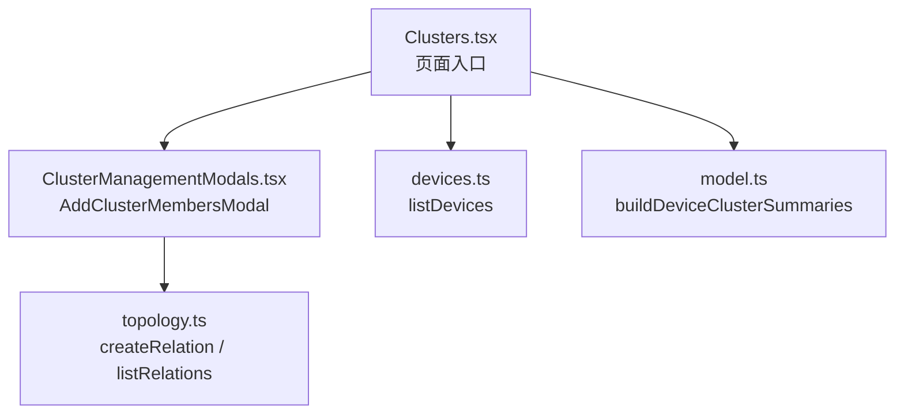
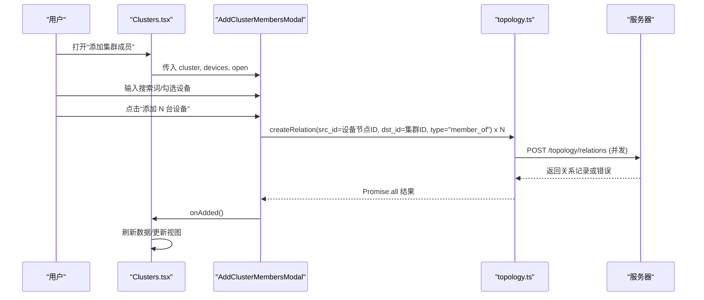
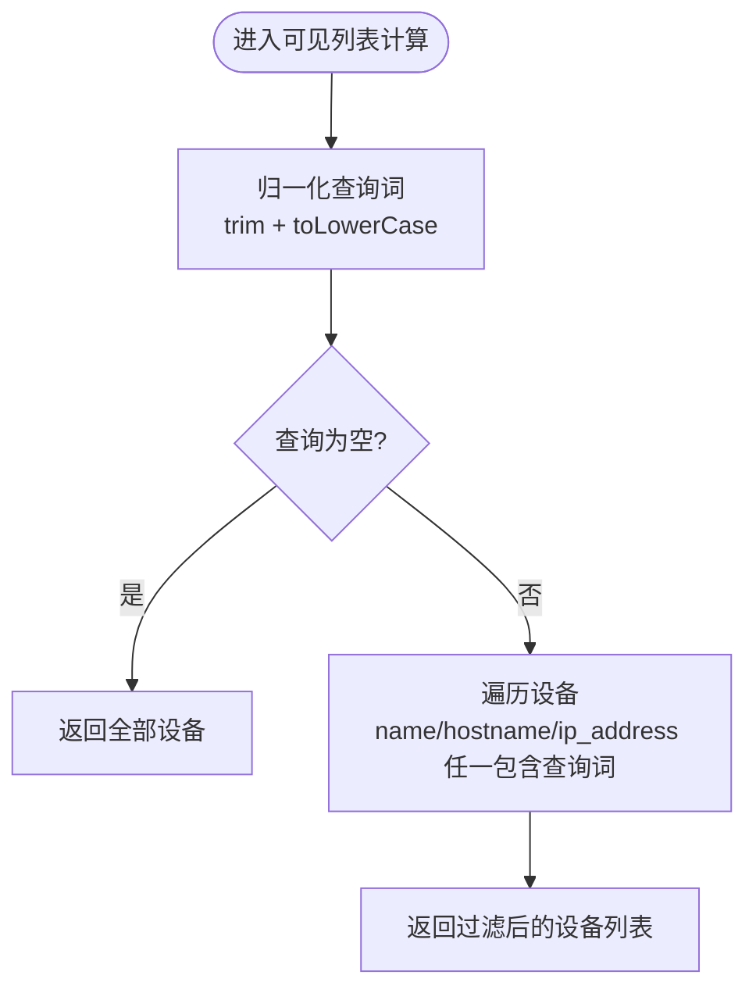
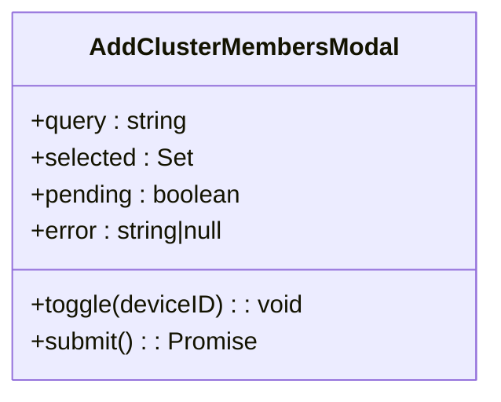
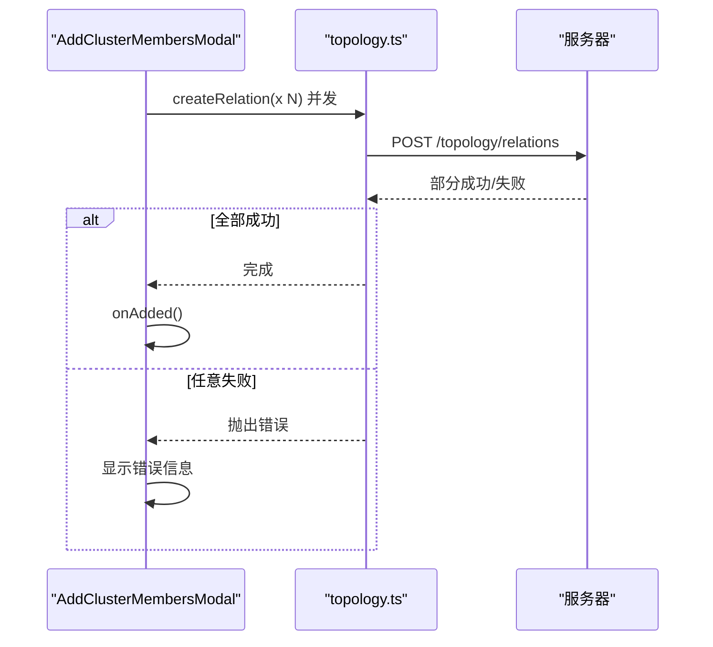
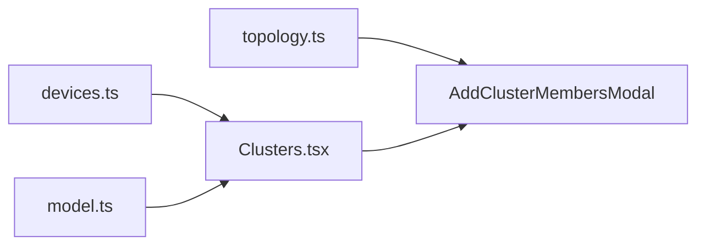

# 添加集群成员模态框

<cite>
**本文引用的文件**
- [ClusterManagementModals.tsx](file://web/src/pages/clusters/ClusterManagementModals.tsx)
- [Clusters.tsx](file://web/src/pages/Clusters.tsx)
- [topology.ts](file://web/src/api/topology.ts)
- [devices.ts](file://web/src/api/devices.ts)
- [model.ts](file://web/src/pages/clusters/model.ts)
</cite>

## 目录
1. [简介](#简介)
2. [项目结构](#项目结构)
3. [核心组件](#核心组件)
4. [架构总览](#架构总览)
5. [详细组件分析](#详细组件分析)
6. [依赖关系分析](#依赖关系分析)
7. [性能考虑](#性能考虑)
8. [故障排查指南](#故障排查指南)
9. [结论](#结论)
10. [附录：扩展示例](#附录：扩展示例)

## 简介
本技术文档聚焦于“添加集群成员”模态框（AddClusterMembersModal）的实现与使用，围绕设备列表筛选、多选与批量操作、搜索算法、选择状态管理、以及设备与集群关系的并发创建流程进行系统化说明。同时提供可扩展的优化建议与开发示例，帮助开发者在现有基础上扩展筛选条件或新增批量导入能力。

## 项目结构
该功能位于前端页面模块中，主要涉及以下文件：
- 模态框实现：web/src/pages/clusters/ClusterManagementModals.tsx
- 页面入口与数据加载：web/src/pages/Clusters.tsx
- 拓扑 API（节点与关系）：web/src/api/topology.ts
- 设备 API：web/src/api/devices.ts
- 集群模型聚合：web/src/pages/clusters/model.ts

图表来源
- [ClusterManagementModals.tsx:201-369](file://web/src/pages/clusters/ClusterManagementModals.tsx#L201-L369)
- [Clusters.tsx:85-120](file://web/src/pages/Clusters.tsx#L85-L120)
- [topology.ts:87-94](file://web/src/api/topology.ts#L87-L94)
- [devices.ts:162-167](file://web/src/api/devices.ts#L162-L167)
- [model.ts:21-77](file://web/src/pages/clusters/model.ts#L21-L77)

章节来源
- [ClusterManagementModals.tsx:201-369](file://web/src/pages/clusters/ClusterManagementModals.tsx#L201-L369)
- [Clusters.tsx:85-120](file://web/src/pages/Clusters.tsx#L85-L120)
- [topology.ts:87-94](file://web/src/api/topology.ts#L87-L94)
- [devices.ts:162-167](file://web/src/api/devices.ts#L162-L167)
- [model.ts:21-77](file://web/src/pages/clusters/model.ts#L21-L77)

## 核心组件
- AddClusterMembersModal：负责展示设备列表、支持搜索过滤、多选与提交批量加入集群。
- Clusters 页面：负责加载设备、拓扑节点与关系，并组装为集群摘要；在需要时打开 AddClusterMembersModal。
- topology API：提供 createRelation 等接口用于建立设备与集群的关系。
- devices API：提供 listDevices 获取设备清单。
- model 聚合：将节点、设备、关系与配置汇总成集群摘要，供页面渲染与交互使用。

章节来源
- [ClusterManagementModals.tsx:201-369](file://web/src/pages/clusters/ClusterManagementModals.tsx#L201-L369)
- [Clusters.tsx:85-120](file://web/src/pages/Clusters.tsx#L85-L120)
- [topology.ts:87-94](file://web/src/api/topology.ts#L87-L94)
- [devices.ts:162-167](file://web/src/api/devices.ts#L162-L167)
- [model.ts:21-77](file://web/src/pages/clusters/model.ts#L21-L77)

## 架构总览
下图展示了从用户触发到后端落库的关键调用链：用户在模态框中选择设备并提交，组件通过拓扑 API 并发创建“设备→集群”的成员关系，成功后回调通知页面刷新。

图表来源
- [ClusterManagementModals.tsx:241-265](file://web/src/pages/clusters/ClusterManagementModals.tsx#L241-L265)
- [topology.ts:87-94](file://web/src/api/topology.ts#L87-L94)
- [Clusters.tsx:85-120](file://web/src/pages/Clusters.tsx#L85-L120)

## 详细组件分析

### 设备列表筛选与搜索算法
- 搜索字段：名称、主机名、IP 地址。
- 归一化：查询词统一转小写并去除首尾空白。
- 匹配逻辑：对设备的 name、hostname、ip_address 三个字段逐一判断是否包含查询词（忽略空值）。
- 计算方式：使用 useMemo 缓存可见列表，避免重复计算。

图表来源
- [ClusterManagementModals.tsx:222-230](file://web/src/pages/clusters/ClusterManagementModals.tsx#L222-L230)

章节来源
- [ClusterManagementModals.tsx:222-230](file://web/src/pages/clusters/ClusterManagementModals.tsx#L222-L230)

### 多选与选择状态管理
- 数据结构：使用 Set<number> 存储已选设备 ID，保证 O(1) 查找与去重。
- 切换逻辑：toggle 方法根据当前集合是否存在该 ID 决定添加或删除。
- 重置策略：模态框每次打开时清空选择状态与搜索词，避免跨次会话污染。

图表来源
- [ClusterManagementModals.tsx:209-239](file://web/src/pages/clusters/ClusterManagementModals.tsx#L209-L239)

章节来源
- [ClusterManagementModals.tsx:209-239](file://web/src/pages/clusters/ClusterManagementModals.tsx#L209-L239)

### 批量操作与并发处理机制
- 提交行为：仅当存在选中设备时执行提交。
- 并发策略：使用 Promise.all 并行发起多个 createRelation 请求，提升吞吐。
- 失败处理：任一请求失败会抛出异常，整体提交回退；错误信息以提示形式展示。
- 成功回调：完成后调用 onAdded 通知父组件刷新。

图表来源
- [ClusterManagementModals.tsx:241-265](file://web/src/pages/clusters/ClusterManagementModals.tsx#L241-L265)
- [topology.ts:87-94](file://web/src/api/topology.ts#L87-L94)

章节来源
- [ClusterManagementModals.tsx:241-265](file://web/src/pages/clusters/ClusterManagementModals.tsx#L241-L265)
- [topology.ts:87-94](file://web/src/api/topology.ts#L87-L94)

### 设备关系创建的API调用流程
- 关系类型：type 固定为 "member_of"，表示设备属于某个集群。
- 关系属性：props.source 标记来源为 "manual"，并附带 device_id 便于溯源。
- 端点：POST /topology/relations，参数包括 src_id（设备拓扑节点ID）、dst_id（集群节点ID）、type、props。

章节来源
- [ClusterManagementModals.tsx:247-255](file://web/src/pages/clusters/ClusterManagementModals.tsx#L247-L255)
- [topology.ts:87-94](file://web/src/api/topology.ts#L87-L94)

### 数据加载与上下文准备
- 设备列表：通过 listDevices 获取可用设备。
- 集群与关系：通过 loadAllNodes("cluster") 与 loadAllRelations({}) 获取集群节点与关系。
- 模型聚合：buildDeviceClusterSummaries 将节点、设备、关系与配置汇总为可渲染的集群摘要，并计算在线数等信息。

章节来源
- [Clusters.tsx:85-120](file://web/src/pages/Clusters.tsx#L85-L120)
- [model.ts:21-77](file://web/src/pages/clusters/model.ts#L21-L77)
- [devices.ts:162-167](file://web/src/api/devices.ts#L162-L167)

## 依赖关系分析
- 组件耦合：
  - AddClusterMembersModal 依赖 topology API 写入关系，依赖 devices 提供的设备数据。
  - Clusters 页面负责数据装配与模态框生命周期控制。
- 外部依赖：
  - 拓扑服务：节点与关系 CRUD。
  - 设备服务：设备清单与详情。
- 潜在循环：无直接循环依赖；数据流单向（页面→模态框→API）。

图表来源
- [devices.ts:162-167](file://web/src/api/devices.ts#L162-L167)
- [topology.ts:87-94](file://web/src/api/topology.ts#L87-L94)
- [model.ts:21-77](file://web/src/pages/clusters/model.ts#L21-L77)
- [Clusters.tsx:85-120](file://web/src/pages/Clusters.tsx#L85-L120)
- [ClusterManagementModals.tsx:201-369](file://web/src/pages/clusters/ClusterManagementModals.tsx#L201-L369)

章节来源
- [devices.ts:162-167](file://web/src/api/devices.ts#L162-L167)
- [topology.ts:87-94](file://web/src/api/topology.ts#L87-L94)
- [model.ts:21-77](file://web/src/pages/clusters/model.ts#L21-L77)
- [Clusters.tsx:85-120](file://web/src/pages/Clusters.tsx#L85-L120)
- [ClusterManagementModals.tsx:201-369](file://web/src/pages/clusters/ClusterManagementModals.tsx#L201-L369)

## 性能考虑
- 前端计算优化：
  - 使用 useMemo 缓存过滤结果，减少重复渲染开销。
  - 使用 Set 维护选择状态，O(1) 查找与插入。
- 网络并发：
  - 使用 Promise.all 并发提交关系，缩短端到端耗时。
  - 注意服务端限流与幂等性，避免重复提交导致的数据不一致。
- 大数据量场景：
  - 若设备数量较大，可考虑分页加载或虚拟滚动以减少 DOM 压力。
  - 可将搜索关键词节流，降低高频输入导致的频繁重算。
- 错误恢复：
  - 单个关系创建失败不影响其他请求，但整体提交会失败；可在后续版本引入分片提交与重试策略。

[本节为通用指导，不直接分析具体文件]

## 故障排查指南
- 常见问题定位：
  - 未选中设备：按钮禁用，检查 selected.size 是否为 0。
  - 搜索无结果：确认 query 归一化与字段过滤逻辑是否正确。
  - 提交失败：查看控制台错误与网络请求，确认拓扑服务权限与参数。
- 调试建议：
  - 在 submit 前后打印 selected 与 visible 列表，验证数据一致性。
  - 检查 createRelation 的参数 src_id、dst_id、type、props 是否符合预期。
  - 若出现部分失败，可增加日志记录每个请求的响应码与消息。

章节来源
- [ClusterManagementModals.tsx:241-265](file://web/src/pages/clusters/ClusterManagementModals.tsx#L241-L265)
- [topology.ts:87-94](file://web/src/api/topology.ts#L87-L94)

## 结论
AddClusterMembersModal 提供了直观的设备筛选、多选与批量加入集群能力，采用简洁高效的前端状态管理与并发提交策略，满足日常运维需求。通过合理优化搜索、渲染与网络层，可进一步提升大规模设备场景下的用户体验与系统稳定性。

[本节为总结，不直接分析具体文件]

## 附录：扩展示例

### 扩展设备筛选条件
目标：增加按操作系统或角色筛选。
步骤：
- 在 visible 的计算中加入新的过滤条件，例如 device.os 或 device.roles。
- 保持查询词归一化与字段包含匹配的一致性。
- 如需多条件组合，建议使用函数式组合，避免复杂嵌套。

参考路径
- [ClusterManagementModals.tsx:222-230](file://web/src/pages/clusters/ClusterManagementModals.tsx#L222-L230)
- [devices.ts:5-34](file://web/src/api/devices.ts#L5-L34)

### 添加批量导入功能
目标：支持从 CSV/Excel 导入设备并批量加入集群。
步骤：
- 新增导入入口与解析器，读取文件并映射为设备 ID 列表。
- 复用现有 toggle/selected 机制，将导入的设备 ID 加入选择集。
- 提交阶段沿用 Promise.all 并发创建关系，必要时增加分片与重试。
- 提供进度反馈与错误明细，提升可观测性与可恢复性。

参考路径
- [ClusterManagementModals.tsx:241-265](file://web/src/pages/clusters/ClusterManagementModals.tsx#L241-L265)
- [topology.ts:87-94](file://web/src/api/topology.ts#L87-L94)

### 改进并发与容错
目标：在高并发下提升成功率与用户体验。
建议：
- 引入分片提交（如每批 20 个），避免一次性过大负载。
- 对失败请求实施指数退避重试，限制最大重试次数。
- 收集失败明细并在 UI 中展示，允许用户修正后重新提交。

参考路径
- [ClusterManagementModals.tsx:241-265](file://web/src/pages/clusters/ClusterManagementModals.tsx#L241-L265)
- [topology.ts:87-94](file://web/src/api/topology.ts#L87-L94)