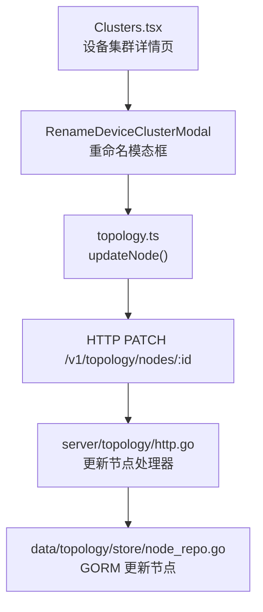
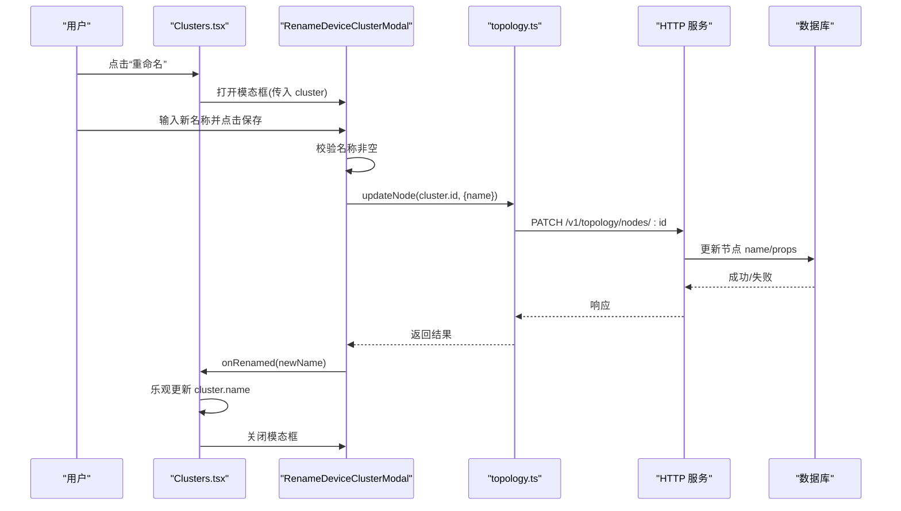
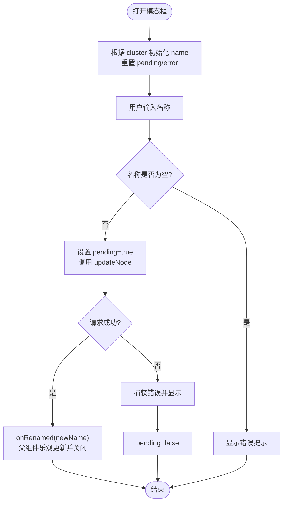

# 重命名集群模态框

<cite>
**本文引用的文件**
- [ClusterManagementModals.tsx](file://web/src/pages/clusters/ClusterManagementModals.tsx)
- [Clusters.tsx](file://web/src/pages/Clusters.tsx)
- [topology.ts](file://web/src/api/topology.ts)
- [http.go](file://internal/manager/server/topology/http.go)
- [node_repo.go](file://internal/manager/data/topology/store/node_repo.go)
</cite>

## 目录
1. [简介](#简介)
2. [项目结构](#项目结构)
3. [核心组件](#核心组件)
4. [架构总览](#架构总览)
5. [详细组件分析](#详细组件分析)
6. [依赖关系分析](#依赖关系分析)
7. [性能与可用性考虑](#性能与可用性考虑)
8. [故障排查指南](#故障排查指南)
9. [结论](#结论)
10. [附录：扩展示例](#附录：扩展示例)

## 简介
本技术文档聚焦于“重命名集群”的模态框实现，围绕 RenameDeviceClusterModal 组件展开，详细说明其数据获取、名称验证、API 调用、状态同步、错误处理与用户确认流程。同时给出如何扩展现有重命名功能或添加批量重命名的开发建议。

## 项目结构
该功能涉及前端页面、模态框组件、拓扑 API 客户端以及后端拓扑服务与存储层：
- 前端页面负责打开/关闭模态框、维护当前集群上下文并在成功后更新本地状态。
- 模态框组件负责输入校验、提交请求、展示错误与加载状态。
- 拓扑 API 客户端封装对 /v1/topology/nodes 的增删改查。
- 后端 HTTP 路由与权限校验、领域用例与数据库持久化完成最终落库。

图表来源
- [Clusters.tsx:1118-1125](file://web/src/pages/Clusters.tsx#L1118-L1125)
- [ClusterManagementModals.tsx:121-191](file://web/src/pages/clusters/ClusterManagementModals.tsx#L121-L191)
- [topology.ts:41-43](file://web/src/api/topology.ts#L41-L43)
- [http.go:78-119](file://internal/manager/server/topology/http.go#L78-L119)
- [node_repo.go:28-40](file://internal/manager/data/topology/store/node_repo.go#L28-L40)

章节来源
- [Clusters.tsx:1118-1125](file://web/src/pages/Clusters.tsx#L1118-L1125)
- [ClusterManagementModals.tsx:121-191](file://web/src/pages/clusters/ClusterManagementModals.tsx#L121-L191)
- [topology.ts:41-43](file://web/src/api/topology.ts#L41-L43)
- [http.go:78-119](file://internal/manager/server/topology/http.go#L78-L119)
- [node_repo.go:28-40](file://internal/manager/data/topology/store/node_repo.go#L28-L40)

## 核心组件
- RenameDeviceClusterModal：接收当前集群对象，提供名称输入、校验、提交与错误反馈；成功后通过回调通知父组件并关闭。
- Clusters.tsx（设备集群详情页）：控制模态框显隐，维护当前集群状态，在重命名成功后进行乐观更新。
- topology.ts：封装 updateNode(id, { name }) 调用，发起 PATCH 请求更新拓扑节点名称。
- 后端 http.go：定义更新节点的 DTO 与受管理员保护的写接口。
- node_repo.go：使用 GORM 更新节点 name 与 props_jsonb，并处理未找到记录的情况。

章节来源
- [ClusterManagementModals.tsx:121-191](file://web/src/pages/clusters/ClusterManagementModals.tsx#L121-L191)
- [Clusters.tsx:1118-1125](file://web/src/pages/Clusters.tsx#L1118-L1125)
- [topology.ts:41-43](file://web/src/api/topology.ts#L41-L43)
- [http.go:78-119](file://internal/manager/server/topology/http.go#L78-L119)
- [node_repo.go:28-40](file://internal/manager/data/topology/store/node_repo.go#L28-L40)

## 架构总览
重命名集群的核心调用链如下：
- 用户在详情页点击“重命名”，打开 RenameDeviceClusterModal。
- 组件内校验名称非空后，调用 updateNode 发送 PATCH 请求。
- 后端校验管理员权限，更新拓扑节点名称到数据库。
- 前端收到成功响应后，通过 onRenamed 回调将新名称写入当前集群状态，并关闭模态框。

图表来源
- [Clusters.tsx:1118-1125](file://web/src/pages/Clusters.tsx#L1118-L1125)
- [ClusterManagementModals.tsx:138-155](file://web/src/pages/clusters/ClusterManagementModals.tsx#L138-L155)
- [topology.ts:41-43](file://web/src/api/topology.ts#L41-L43)
- [http.go:78-119](file://internal/manager/server/topology/http.go#L78-L119)
- [node_repo.go:28-40](file://internal/manager/data/topology/store/node_repo.go#L28-L40)

## 详细组件分析

### RenameDeviceClusterModal 组件
- 输入参数
  - cluster: TopologyNode | null，用于初始化名称与标识目标节点。
  - onClose: 关闭模态框回调。
  - onRenamed(name): 重命名成功后的回调，携带新名称。
- 内部状态
  - name: 当前输入的名称。
  - pending: 是否正在提交。
  - error: 错误消息。
- 生命周期与边界处理
  - 当 cluster 变化时，重置 name 为 cluster.name，并清空 pending 与 error，避免残留状态。
  - 若 cluster 为空，直接返回，防止无效提交。
- 名称验证逻辑
  - 提交前对 name.trim() 进行非空检查，否则设置错误提示。
  - 输入框限制最大长度（128），减少超长字符串风险。
- API 调用与状态同步
  - 调用 updateNode(cluster.id, { name: trimmedName })。
  - 成功后调用 onRenamed(trimmedName)，由父组件执行乐观更新并关闭模态框。
  - 异常捕获并显示错误信息，确保 pending 状态复位。
- UI 交互
  - 支持回车键提交。
  - 提交期间禁用保存按钮，避免重复提交。

图表来源
- [ClusterManagementModals.tsx:131-155](file://web/src/pages/clusters/ClusterManagementModals.tsx#L131-L155)
- [ClusterManagementModals.tsx:157-191](file://web/src/pages/clusters/ClusterManagementModals.tsx#L157-L191)

章节来源
- [ClusterManagementModals.tsx:121-191](file://web/src/pages/clusters/ClusterManagementModals.tsx#L121-L191)

### 父组件状态同步（Clusters.tsx）
- 打开/关闭模态框：通过 renameOpen 状态控制。
- 传递 cluster：当 renameOpen 为真时传入当前 cluster，否则传 null，确保模态框仅在有效上下文中工作。
- 成功回调：onRenamed 中执行 setCluster(current => current && { ...current, name })，实现乐观更新，无需重新拉取数据。
- 关闭模态框：回调后立即关闭，提升用户体验。

章节来源
- [Clusters.tsx:1118-1125](file://web/src/pages/Clusters.tsx#L1118-L1125)

### API 客户端（topology.ts）
- updateNode(id, input)：封装 PATCH /topology/nodes/:id，仅传递 name 字段即可更新名称。
- 类型安全：TopologyNode 包含 id、type、name、props、created_at、updated_at，确保前后端一致。

章节来源
- [topology.ts:9-16](file://web/src/api/topology.ts#L9-L16)
- [topology.ts:41-43](file://web/src/api/topology.ts#L41-L43)

### 后端权限与更新流程（http.go + node_repo.go）
- 权限控制：写操作需管理员角色，否则返回未授权/禁止访问。
- 更新 DTO：updateNodeReq 支持可选 name 与 props。
- 持久化：node_repo.Update 使用 GORM 更新 name 与 props_jsonb，若影响行数为 0 则返回未找到错误。

章节来源
- [http.go:78-119](file://internal/manager/server/topology/http.go#L78-L119)
- [node_repo.go:28-40](file://internal/manager/data/topology/store/node_repo.go#L28-L40)

## 依赖关系分析
- 组件耦合
  - RenameDeviceClusterModal 依赖 topology.ts 的 updateNode，解耦了具体网络实现。
  - Clusters.tsx 通过回调与模态框通信，保持职责清晰。
- 外部依赖
  - 后端 HTTP 服务要求管理员权限，前端需在无权限时处理 403。
  - 数据库层保证唯一性与一致性，未找到记录会返回错误。
- 潜在循环依赖
  - 无循环依赖；调用方向单向：UI -> API -> Server -> DB。

图表来源
- [ClusterManagementModals.tsx:121-191](file://web/src/pages/clusters/ClusterManagementModals.tsx#L121-L191)
- [topology.ts:41-43](file://web/src/api/topology.ts#L41-L43)
- [http.go:78-119](file://internal/manager/server/topology/http.go#L78-L119)
- [node_repo.go:28-40](file://internal/manager/data/topology/store/node_repo.go#L28-L40)

章节来源
- [ClusterManagementModals.tsx:121-191](file://web/src/pages/clusters/ClusterManagementModals.tsx#L121-L191)
- [topology.ts:41-43](file://web/src/api/topology.ts#L41-L43)
- [http.go:78-119](file://internal/manager/server/topology/http.go#L78-L119)
- [node_repo.go:28-40](file://internal/manager/data/topology/store/node_repo.go#L28-L40)

## 性能与可用性考虑
- 乐观更新：成功后立即更新本地状态，减少二次请求，提升响应速度。
- 防抖与幂等：后端更新为幂等操作；前端通过 pending 状态防止重复提交。
- 输入约束：maxLength=128 限制名称长度，降低传输与存储压力。
- 错误可见性：统一 InlineError 展示错误，便于用户快速定位问题。
- 权限拦截：后端 requireAdmin 保护写接口，前端可结合权限状态隐藏入口，但仍保留错误兜底。

[本节为通用指导，不直接分析具体文件]

## 故障排查指南
- 名称为空
  - 现象：保存按钮可用但无法提交，界面显示错误提示。
  - 原因：trim() 后为空触发前端校验。
  - 处理：引导用户输入有效名称。
- 网络或权限错误
  - 现象：保存失败，显示错误消息。
  - 原因：网络异常或无管理员权限导致 403。
  - 处理：检查网络与用户角色；必要时刷新权限或重试。
- 节点不存在
  - 现象：保存失败。
  - 原因：后端更新影响行数为 0，返回未找到错误。
  - 处理：确认 cluster.id 是否正确，或集群已被删除。

章节来源
- [ClusterManagementModals.tsx:138-155](file://web/src/pages/clusters/ClusterManagementModals.tsx#L138-L155)
- [http.go:78-119](file://internal/manager/server/topology/http.go#L78-L119)
- [node_repo.go:28-40](file://internal/manager/data/topology/store/node_repo.go#L28-L40)

## 结论
RenameDeviceClusterModal 以简洁的状态机与清晰的职责划分实现了集群重命名功能：前端负责输入校验与用户体验，API 层封装网络调用，后端保障权限与持久化。通过乐观更新与完善的错误处理，整体流程稳定且高效。建议在后续迭代中继续强化边界条件与可观测性，以便更好地支撑批量重命名等扩展场景。

[本节为总结，不直接分析具体文件]

## 附录：扩展示例

### 扩展点一：增加名称格式校验
- 目标：在现有 trim 非空校验基础上，增加正则或规则校验（如仅允许字母、数字、连字符）。
- 方法：在 submit 中添加额外校验逻辑，失败时设置 error 并阻止提交。
- 参考位置：[ClusterManagementModals.tsx:138-155](file://web/src/pages/clusters/ClusterManagementModals.tsx#L138-L155)

### 扩展点二：添加批量重命名支持
- 目标：一次选择多个集群，统一修改名称或批量替换前缀/后缀。
- 设计要点：
  - 新增批量选择列表与输入模板（如“{旧名}-副本”）。
  - 使用 Promise.all 并发调用 updateNode，聚合错误并展示。
  - 父组件对每个成功项执行乐观更新。
- 参考位置：
  - 批量成员添加的实现模式可借鉴：[ClusterManagementModals.tsx:241-265](file://web/src/pages/clusters/ClusterManagementModals.tsx#L241-L265)
  - API 调用封装：[topology.ts:41-43](file://web/src/api/topology.ts#L41-L43)

### 扩展点三：增强错误提示与重试机制
- 目标：区分网络错误、权限错误与业务错误，提供重试按钮。
- 方法：
  - 在 catch 分支解析错误码或消息，分类展示。
  - 提供“重试”按钮，重新调用 updateNode。
- 参考位置：
  - 错误展示组件：[ClusterManagementModals.tsx:424-433](file://web/src/pages/clusters/ClusterManagementModals.tsx#L424-L433)
  - 权限拦截：[http.go:78-91](file://internal/manager/server/topology/http.go#L78-L91)

### 扩展点四：与配置草稿确认流程集成
- 目标：在重命名前弹出确认对话框，支持撤销。
- 方法：
  - 在提交前调用确认流程（例如基于 lib/configDraftConfirmation 的模式）。
  - 确认后进入现有提交流程。
- 参考位置：
  - 确认流程库：[configDraftConfirmation.ts](file://web/src/lib/configDraftConfirmation.ts)

[本节为概念性扩展建议，不直接分析具体文件]