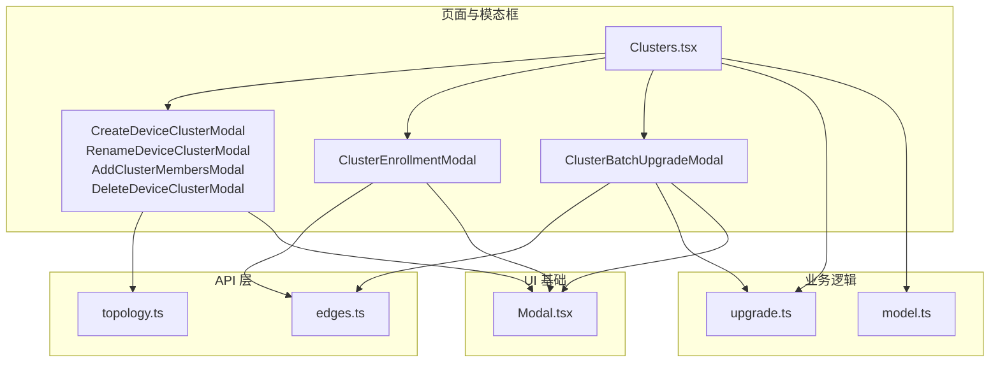
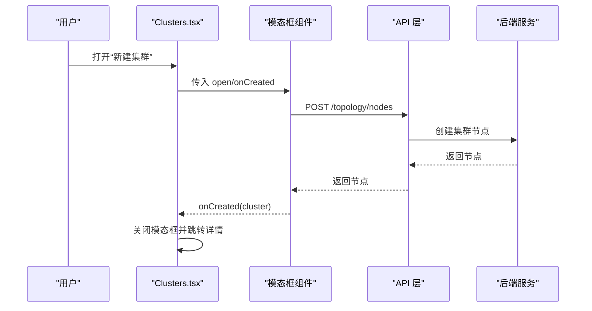
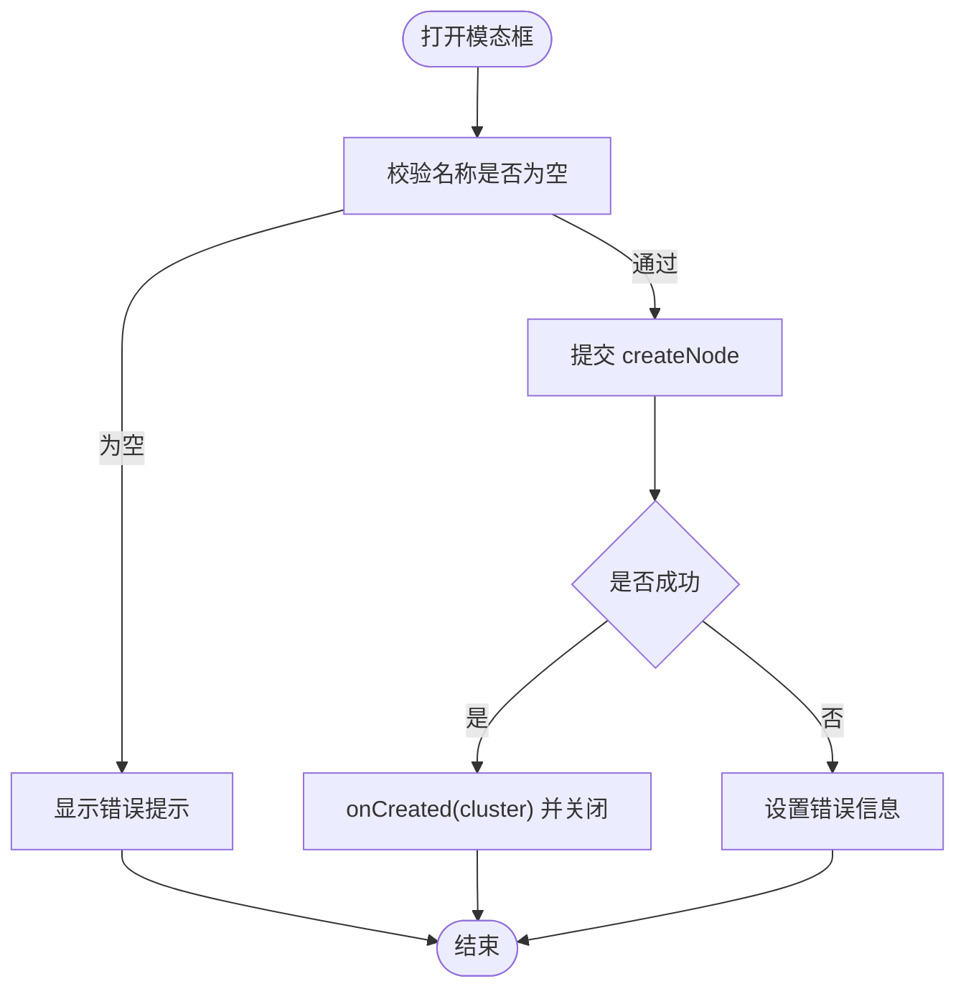
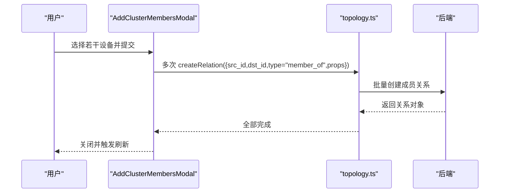
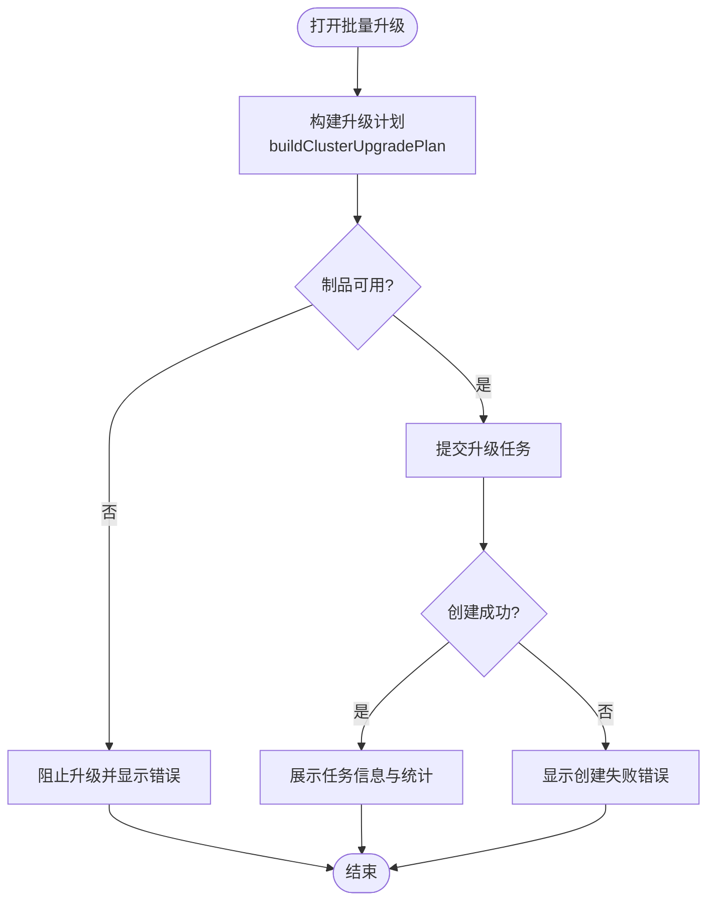
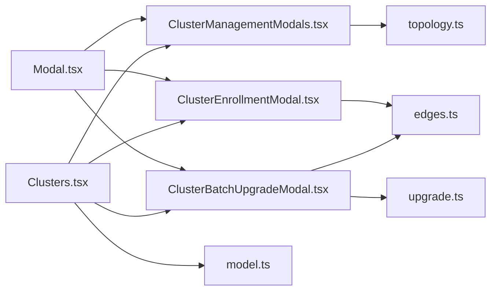

# 集群操作模态框

<cite>
**本文引用的文件**
- [ClusterManagementModals.tsx](file://web/src/pages/clusters/ClusterManagementModals.tsx)
- [ClusterEnrollmentModal.tsx](file://web/src/pages/clusters/ClusterEnrollmentModal.tsx)
- [ClusterBatchUpgradeModal.tsx](file://web/src/pages/clusters/ClusterBatchUpgradeModal.tsx)
- [upgrade.ts](file://web/src/pages/clusters/upgrade.ts)
- [model.ts](file://web/src/pages/clusters/model.ts)
- [Clusters.tsx](file://web/src/pages/Clusters.tsx)
- [topology.ts](file://web/src/api/topology.ts)
- [edges.ts](file://web/src/api/edges.ts)
- [Modal.tsx](file://web/src/components/Modal.tsx)
</cite>

## 目录
1. [简介](#简介)
2. [项目结构](#项目结构)
3. [核心组件](#核心组件)
4. [架构总览](#架构总览)
5. [详细组件分析](#详细组件分析)
6. [依赖关系分析](#依赖关系分析)
7. [性能考量](#性能考量)
8. [故障排查指南](#故障排查指南)
9. [结论](#结论)
10. [附录：扩展与示例](#附录：扩展与示例)

## 简介
本技术文档聚焦“设备集群”管理的前端模态框实现，覆盖新建集群、添加成员、删除集群、重命名集群、安装批次生成以及批量升级等关键操作。文档从表单验证、API 调用流程、状态管理、错误提示与成功反馈等方面展开，并结合代码级流程图与时序图说明数据流转与控制流。同时提供扩展现有功能的开发指引，帮助快速新增或改造集群操作模态框。

## 项目结构
围绕集群管理的 UI 与逻辑主要分布在以下位置：
- 页面与模态框：web/src/pages/clusters/*
- 通用弹窗容器：web/src/components/Modal.tsx
- 拓扑 API（节点/关系）：web/src/api/topology.ts
- 边缘设备与升级 API：web/src/api/edges.ts
- 集群模型与升级计划计算：web/src/pages/clusters/model.ts, upgrade.ts
- 集群列表与详情页（承载各模态框入口）：web/src/pages/Clusters.tsx

图表来源
- [Clusters.tsx:45-65](file://web/src/pages/Clusters.tsx#L45-L65)
- [ClusterManagementModals.tsx:21-113](file://web/src/pages/clusters/ClusterManagementModals.tsx#L21-L113)
- [ClusterEnrollmentModal.tsx:20-87](file://web/src/pages/clusters/ClusterEnrollmentModal.tsx#L20-L87)
- [ClusterBatchUpgradeModal.tsx:37-158](file://web/src/pages/clusters/ClusterBatchUpgradeModal.tsx#L37-L158)
- [topology.ts:23-47](file://web/src/api/topology.ts#L23-L47)
- [edges.ts:117-221](file://web/src/api/edges.ts#L117-L221)
- [upgrade.ts:49-98](file://web/src/pages/clusters/upgrade.ts#L49-L98)
- [model.ts:21-77](file://web/src/pages/clusters/model.ts#L21-L77)
- [Modal.tsx:27-133](file://web/src/components/Modal.tsx#L27-L133)

章节来源
- [Clusters.tsx:69-119](file://web/src/pages/Clusters.tsx#L69-L119)
- [ClusterManagementModals.tsx:21-113](file://web/src/pages/clusters/ClusterManagementModals.tsx#L21-L113)
- [ClusterEnrollmentModal.tsx:20-87](file://web/src/pages/clusters/ClusterEnrollmentModal.tsx#L20-L87)
- [ClusterBatchUpgradeModal.tsx:37-158](file://web/src/pages/clusters/ClusterBatchUpgradeModal.tsx#L37-L158)
- [topology.ts:23-47](file://web/src/api/topology.ts#L23-L47)
- [edges.ts:117-221](file://web/src/api/edges.ts#L117-L221)
- [upgrade.ts:49-98](file://web/src/pages/clusters/upgrade.ts#L49-L98)
- [model.ts:21-77](file://web/src/pages/clusters/model.ts#L21-L77)
- [Modal.tsx:27-133](file://web/src/components/Modal.tsx#L27-L133)

## 核心组件
- 新建集群模态框：创建拓扑节点（type=cluster），支持名称必填与可选描述，提交后回调并导航至新集群详情。
- 重命名集群模态框：编辑已有集群名称，提交更新拓扑节点。
- 添加成员模态框：搜索并勾选设备，批量建立 member_of 关系，将设备加入目标集群。
- 删除集群模态框：在满足无成员、无外部关系、无有效安装批次的条件下允许删除，否则显示阻断原因。
- 安装批次模态框：为集群生成一次性安装令牌与命令，支持有效期与最大使用次数校验。
- 批量升级模态框：基于升级计划选择目标设备，展示制品可用性、架构分组、跳过原因，提交后台升级任务。

章节来源
- [ClusterManagementModals.tsx:21-113](file://web/src/pages/clusters/ClusterManagementModals.tsx#L21-L113)
- [ClusterManagementModals.tsx:121-191](file://web/src/pages/clusters/ClusterManagementModals.tsx#L121-L191)
- [ClusterManagementModals.tsx:201-370](file://web/src/pages/clusters/ClusterManagementModals.tsx#L201-L370)
- [ClusterManagementModals.tsx:380-422](file://web/src/pages/clusters/ClusterManagementModals.tsx#L380-L422)
- [ClusterEnrollmentModal.tsx:20-87](file://web/src/pages/clusters/ClusterEnrollmentModal.tsx#L20-L87)
- [ClusterBatchUpgradeModal.tsx:37-158](file://web/src/pages/clusters/ClusterBatchUpgradeModal.tsx#L37-L158)

## 架构总览
前端以 React 组件组织模态框，通过统一的 Modal 容器渲染；业务逻辑集中在 model.ts 与 upgrade.ts；API 封装在 topology.ts 与 edges.ts；页面 Clusters.tsx 负责聚合数据、驱动模态框开关与结果刷新。

图表来源
- [Clusters.tsx:285-292](file://web/src/pages/Clusters.tsx#L285-L292)
- [ClusterManagementModals.tsx:40-63](file://web/src/pages/clusters/ClusterManagementModals.tsx#L40-L63)
- [topology.ts:37-39](file://web/src/api/topology.ts#L37-L39)

章节来源
- [Clusters.tsx:285-292](file://web/src/pages/Clusters.tsx#L285-L292)
- [ClusterManagementModals.tsx:40-63](file://web/src/pages/clusters/ClusterManagementModals.tsx#L40-L63)
- [topology.ts:37-39](file://web/src/api/topology.ts#L37-L39)

## 详细组件分析

### 新建集群模态框
- 表单验证：名称非空（trim 后校验），描述可选。
- API 调用：POST /topology/nodes，type=cluster，source=manual，可选 description。
- 状态管理：pending/error 控制按钮与错误提示；成功后回调父组件并关闭。
- 用户体验：Enter 快捷提交；错误以 InlineError 展示。

图表来源
- [ClusterManagementModals.tsx:40-63](file://web/src/pages/clusters/ClusterManagementModals.tsx#L40-L63)
- [topology.ts:37-39](file://web/src/api/topology.ts#L37-L39)

章节来源
- [ClusterManagementModals.tsx:40-63](file://web/src/pages/clusters/ClusterManagementModals.tsx#L40-L63)
- [topology.ts:37-39](file://web/src/api/topology.ts#L37-L39)

### 重命名集群模态框
- 表单验证：名称非空。
- API 调用：PATCH /topology/nodes/{id}，仅更新 name。
- 状态管理：初始填充当前名称；pending/error 控制提交与提示。

章节来源
- [ClusterManagementModals.tsx:121-191](file://web/src/pages/clusters/ClusterManagementModals.tsx#L121-L191)
- [topology.ts:41-43](file://web/src/api/topology.ts#L41-L43)

### 添加成员模态框
- 交互：搜索设备（名称/主机名/IP），多选，在线状态标签。
- 业务规则：仅允许添加具备拓扑节点且未归属其他集群或 Kubernetes 的设备（由页面过滤）。
- API 调用：对每个选中设备 POST /topology/relations，type=member_of，props.source=manual，device_id。
- 状态管理：selected Set 维护选择；Promise.all 并发创建关系；错误提示。

图表来源
- [ClusterManagementModals.tsx:241-265](file://web/src/pages/clusters/ClusterManagementModals.tsx#L241-L265)
- [topology.ts:87-94](file://web/src/api/topology.ts#L87-L94)

章节来源
- [ClusterManagementModals.tsx:201-370](file://web/src/pages/clusters/ClusterManagementModals.tsx#L201-L370)
- [topology.ts:87-94](file://web/src/api/topology.ts#L87-L94)

### 删除集群模态框
- 前置检查：无成员、无外部拓扑关系、无有效安装批次，否则禁用删除并显示阻断原因。
- API 调用：DELETE /topology/nodes/{id}。
- 状态管理：deleting 控制按钮；成功后移除本地列表项或导航回列表。

章节来源
- [ClusterManagementModals.tsx:380-422](file://web/src/pages/clusters/ClusterManagementModals.tsx#L380-L422)
- [Clusters.tsx:435-458](file://web/src/pages/Clusters.tsx#L435-L458)
- [topology.ts:45-47](file://web/src/api/topology.ts#L45-L47)

### 安装批次模态框
- 表单验证：批次名称非空；有效期 1-168 小时；最大设备数 1-10000。
- API 调用：POST /edge-enrollment-profiles，assignment_mode=cluster，绑定 cluster_node_id。
- 输出：一次性令牌与可复制的安装命令（含 server 地址与隧道端口）。
- 状态管理：pending/error；成功后展示命令并引导保存。

章节来源
- [ClusterEnrollmentModal.tsx:20-87](file://web/src/pages/clusters/ClusterEnrollmentModal.tsx#L20-L87)
- [edges.ts:365-377](file://web/src/api/edges.ts#L365-L377)

### 批量升级模态框
- 升级计划：基于设备与 Edge 信息计算 eligible/target/upToDate/offline/unlinked/unsupported/missingBundle。
- 制品校验：读取 /edge-bundles 元数据，按架构与版本判断可用；不可用时阻止升级。
- 提交：POST /edge-upgrade-jobs，携带 edge_ids、target_version、cluster_node_id、force_reinstall。
- 结果：展示任务 ID、滚动批次、目标版本、进度指标；支持关闭并在升级历史中查看。

图表来源
- [upgrade.ts:49-98](file://web/src/pages/clusters/upgrade.ts#L49-L98)
- [ClusterBatchUpgradeModal.tsx:76-98](file://web/src/pages/clusters/ClusterBatchUpgradeModal.tsx#L76-L98)
- [edges.ts:147-149](file://web/src/api/edges.ts#L147-L149)
- [edges.ts:214-221](file://web/src/api/edges.ts#L214-L221)

章节来源
- [upgrade.ts:49-98](file://web/src/pages/clusters/upgrade.ts#L49-L98)
- [ClusterBatchUpgradeModal.tsx:37-158](file://web/src/pages/clusters/ClusterBatchUpgradeModal.tsx#L37-L158)
- [edges.ts:147-149](file://web/src/api/edges.ts#L147-L149)
- [edges.ts:214-221](file://web/src/api/edges.ts#L214-L221)

## 依赖关系分析
- 模态框依赖 Modal 容器进行统一渲染与键盘事件处理。
- 集群管理模态框依赖 topology API 进行节点与关系的增删改查。
- 安装批次与批量升级依赖 edges API 的 enrollment profile 与升级任务接口。
- 升级计划计算依赖 upgrade.ts 中的算法函数（版本比较、架构归一化、分组与分片）。
- 页面 Clusters.tsx 聚合数据并驱动各模态框的生命周期。

图表来源
- [Modal.tsx:27-133](file://web/src/components/Modal.tsx#L27-L133)
- [ClusterManagementModals.tsx:21-113](file://web/src/pages/clusters/ClusterManagementModals.tsx#L21-L113)
- [ClusterEnrollmentModal.tsx:20-87](file://web/src/pages/clusters/ClusterEnrollmentModal.tsx#L20-L87)
- [ClusterBatchUpgradeModal.tsx:37-158](file://web/src/pages/clusters/ClusterBatchUpgradeModal.tsx#L37-L158)
- [topology.ts:23-47](file://web/src/api/topology.ts#L23-L47)
- [edges.ts:117-221](file://web/src/api/edges.ts#L117-L221)
- [upgrade.ts:49-98](file://web/src/pages/clusters/upgrade.ts#L49-L98)
- [model.ts:21-77](file://web/src/pages/clusters/model.ts#L21-L77)
- [Clusters.tsx:45-65](file://web/src/pages/Clusters.tsx#L45-L65)

章节来源
- [Modal.tsx:27-133](file://web/src/components/Modal.tsx#L27-L133)
- [ClusterManagementModals.tsx:21-113](file://web/src/pages/clusters/ClusterManagementModals.tsx#L21-L113)
- [ClusterEnrollmentModal.tsx:20-87](file://web/src/pages/clusters/ClusterEnrollmentModal.tsx#L20-L87)
- [ClusterBatchUpgradeModal.tsx:37-158](file://web/src/pages/clusters/ClusterBatchUpgradeModal.tsx#L37-L158)
- [topology.ts:23-47](file://web/src/api/topology.ts#L23-L47)
- [edges.ts:117-221](file://web/src/api/edges.ts#L117-L221)
- [upgrade.ts:49-98](file://web/src/pages/clusters/upgrade.ts#L49-L98)
- [model.ts:21-77](file://web/src/pages/clusters/model.ts#L21-L77)
- [Clusters.tsx:45-65](file://web/src/pages/Clusters.tsx#L45-L65)

## 性能考量
- 批量添加成员时使用 Promise.all 并发创建关系，减少等待时间；注意后端限流与幂等性。
- 升级计划计算采用 Map 与集合优化查找复杂度；架构分组与分片避免单次过大请求。
- 页面加载时并行获取节点、设备、关系、安装批次与升级制品，缩短首屏时间。
- 模态框内长内容使用滚动区域，避免阻塞主线程。

[本节为通用指导，不直接分析具体文件]

## 故障排查指南
- 新建/重命名失败：检查名称是否为空；确认网络与权限；查看 InlineError 提示。
- 添加成员失败：确认设备已具备拓扑节点且未被其他集群/Kubernetes 占用；检查 member_of 关系创建是否全部成功。
- 删除被阻止：若存在成员、外部拓扑关系或有效安装批次，需先清理后再试；阻断原因会明确提示。
- 安装批次生成失败：检查有效期与最大设备数范围；确认集群 ID 正确。
- 批量升级被阻止：制品不可用或管理器版本缺失；查看制品目录错误信息；必要时启用强制重装。

章节来源
- [ClusterManagementModals.tsx:40-63](file://web/src/pages/clusters/ClusterManagementModals.tsx#L40-L63)
- [ClusterManagementModals.tsx:241-265](file://web/src/pages/clusters/ClusterManagementModals.tsx#L241-L265)
- [ClusterManagementModals.tsx:380-422](file://web/src/pages/clusters/ClusterManagementModals.tsx#L380-L422)
- [ClusterEnrollmentModal.tsx:45-87](file://web/src/pages/clusters/ClusterEnrollmentModal.tsx#L45-L87)
- [ClusterBatchUpgradeModal.tsx:76-98](file://web/src/pages/clusters/ClusterBatchUpgradeModal.tsx#L76-L98)

## 结论
集群操作模态框通过清晰的表单验证、稳健的 API 调用与完善的错误反馈机制，实现了安全的集群生命周期管理。升级流程结合制品校验与滚动批次策略，确保大规模部署的可控性与可观测性。借助统一的 Modal 容器与模块化设计，新增或扩展操作模态框的成本较低，便于后续功能演进。

[本节为总结，不直接分析具体文件]

## 附录：扩展与示例
- 新增操作模态框步骤
  - 在 web/src/pages/clusters 下新建模态框组件，复用 Modal 容器与 i18n。
  - 定义 props（open/onClose/回调），管理 pending/error 状态。
  - 封装表单验证逻辑，调用对应 API（topology.ts 或 edges.ts）。
  - 在 Clusters.tsx 中引入并挂载模态框，传递必要上下文（如 clusterID）。
  - 在成功回调中刷新数据或导航，保持界面一致。
- 扩展现有功能示例
  - 在添加成员模态框中增加“批量导入”能力：解析 CSV/Excel，映射设备字段，批量创建 member_of 关系。
  - 在批量升级模态框中增加“分批策略”选项：自定义 batch_size，动态调整滚动节奏。
  - 在安装批次模态框中增加“模板化参数”：预置常用环境变量，一键生成命令。

[本节为概念性指导，不直接分析具体文件]