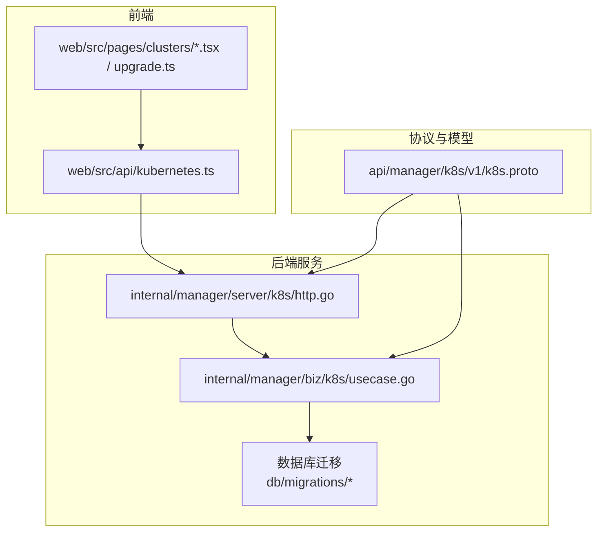
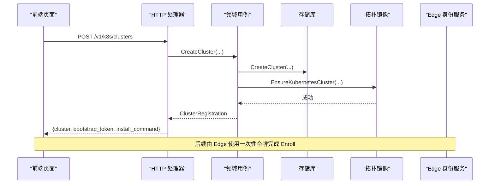
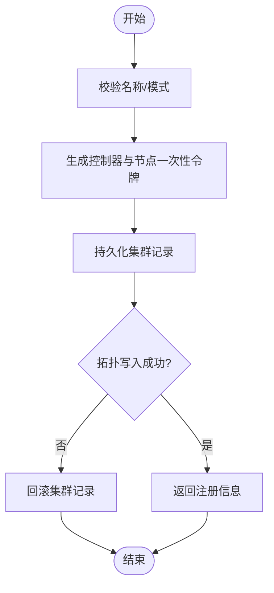
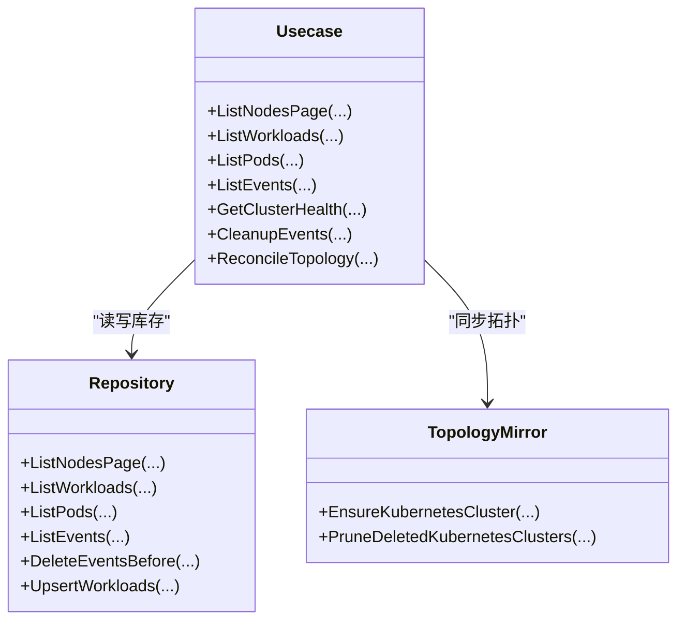
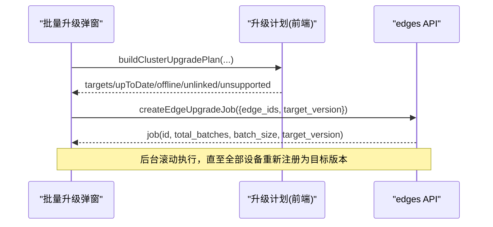
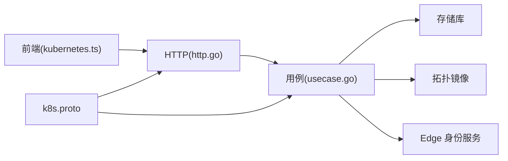

# 集群管理页面

<cite>
**本文引用的文件**
- [k8s.proto](file://api/manager/k8s/v1/k8s.proto)
- [usecase.go](file://internal/manager/biz/k8s/usecase.go)
- [http.go](file://internal/manager/server/k8s/http.go)
- [kubernetes.ts](file://web/src/api/kubernetes.ts)
- [upgrade.ts](file://web/src/pages/clusters/upgrade.ts)
- [ClusterBatchUpgradeModal.tsx](file://web/src/pages/clusters/ClusterBatchUpgradeModal.tsx)
- [model.ts](file://web/src/pages/clusters/model.ts)
- [20260731173000_create_edge_upgrade_jobs.up.sql](file://db/migrations/20260731173000_create_edge_upgrade_jobs.up.sql)
</cite>

## 目录
1. [简介](#简介)
2. [项目结构](#项目结构)
3. [核心组件](#核心组件)
4. [架构总览](#架构总览)
5. [详细组件分析](#详细组件分析)
6. [依赖关系分析](#依赖关系分析)
7. [性能与可扩展性](#性能与可扩展性)
8. [故障排查指南](#故障排查指南)
9. [结论](#结论)
10. [附录：开发示例与最佳实践](#附录：开发示例与最佳实践)

## 简介
本技术文档聚焦于 Ongrid 的 Kubernetes 集群管理页面，覆盖集群注册、资源配置、升级管理与监控集成。重点说明：
- 集群状态实时监控与健康指标
- 资源使用统计（节点、工作负载、Pod、事件）
- 批量升级流程、回滚机制与升级历史记录
- 安全考虑与最佳实践
- 如何扩展现有功能并添加新的集群操作

## 项目结构
后端采用“HTTP 处理器 -> 领域用例 -> 存储库”的分层设计；前端通过 API 客户端调用 HTTP 接口，并在页面中组织升级计划与交互。

**图表来源**
- [http.go:93-106](file://internal/manager/server/k8s/http.go#L93-L106)
- [usecase.go:224-274](file://internal/manager/biz/k8s/usecase.go#L224-L274)
- [k8s.proto:9-27](file://api/manager/k8s/v1/k8s.proto#L9-L27)

**章节来源**
- [http.go:93-106](file://internal/manager/server/k8s/http.go#L93-L106)
- [usecase.go:224-274](file://internal/manager/biz/k8s/usecase.go#L224-L274)
- [k8s.proto:9-27](file://api/manager/k8s/v1/k8s.proto#L9-L27)

## 核心组件
- HTTP 处理器：暴露集群 CRUD、健康检查、节点/工作负载/Pod/事件查询、边缘附件列表、Token 轮换、删除等接口，并对内部 Enroll 与遥测配置刷新提供专用路由。
- 领域用例：实现集群创建、拓扑同步、事件清理、节点覆盖率计算、工作负载聚合、健康汇总等核心业务逻辑。
- 协议定义：gRPC/Proto 定义了集群、节点、工作负载、Pod、事件、操作审计、Enroll 等消息类型与服务方法。
- 前端 API 客户端：封装所有对后端的 REST 调用，提供 TypeScript 类型定义。
- 升级工具与界面：构建升级计划、按架构分组、分批提交升级任务，展示预检结果与进度。

**章节来源**
- [http.go:24-45](file://internal/manager/server/k8s/http.go#L24-L45)
- [usecase.go:42-100](file://internal/manager/biz/k8s/usecase.go#L42-L100)
- [k8s.proto:29-391](file://api/manager/k8s/v1/k8s.proto#L29-L391)
- [kubernetes.ts:18-188](file://web/src/api/kubernetes.ts#L18-L188)
- [upgrade.ts:6-31](file://web/src/pages/clusters/upgrade.ts#L6-L31)

## 架构总览
从请求到数据落库的关键路径如下：

**图表来源**
- [http.go:193-217](file://internal/manager/server/k8s/http.go#L193-L217)
- [usecase.go:501-549](file://internal/manager/biz/k8s/usecase.go#L501-L549)
- [k8s.proto:9-27](file://api/manager/k8s/v1/k8s.proto#L9-L27)

## 详细组件分析

### 集群注册与生命周期
- 创建集群：校验名称与模式，生成控制器与节点的一次性 Bootstrap Token，持久化集群记录，并尝试将集群写入拓扑图；失败时回滚。
- 获取/列表集群：支持按状态、模式、名称过滤与分页；返回节点覆盖率与升级命令。
- 删除集群：支持强制删除；需结合拓扑清理与 Edge 关联清理。
- 旋转令牌：重新生成一次性令牌与安装命令，便于安全轮换。
- 内部 Enroll：Edge 使用一次性令牌向 Manager 注册，返回角色、模式、Edge 标识与遥测配置。

**图表来源**
- [usecase.go:501-549](file://internal/manager/biz/k8s/usecase.go#L501-L549)
- [http.go:193-217](file://internal/manager/server/k8s/http.go#L193-L217)

**章节来源**
- [usecase.go:501-549](file://internal/manager/biz/k8s/usecase.go#L501-L549)
- [http.go:193-217](file://internal/manager/server/k8s/http.go#L193-L217)
- [k8s.proto:83-94](file://api/manager/k8s/v1/k8s.proto#L83-L94)
- [k8s.proto:369-391](file://api/manager/k8s/v1/k8s.proto#L369-L391)

### 资源清单与监控集成
- 节点：支持分页、问题筛选、查询；可计算节点覆盖率（Edge/设备关联）。
- 工作负载：支持按命名空间、Kind、问题筛选；可按 Deployment 聚合其 ReplicaSets。
- Pod：支持按命名空间、节点、阶段、原因筛选。
- 事件：支持按命名空间、类型、原因、涉及对象筛选；具备 TTL 与每集群上限清理策略。
- 健康：汇总降级工作负载、Pending/CrashLoop/OOM/ImagePullBackOff Pod、NotReady 节点及命名空间维度摘要。
- 遥测：支持为集群注入 Remote Write 目标或日志/追踪目标，可通过凭证模式或后端直写。

**图表来源**
- [usecase.go:224-274](file://internal/manager/biz/k8s/usecase.go#L224-L274)
- [usecase.go:283-338](file://internal/manager/biz/k8s/usecase.go#L283-L338)
- [usecase.go:340-370](file://internal/manager/biz/k8s/usecase.go#L340-L370)

**章节来源**
- [usecase.go:578-665](file://internal/manager/biz/k8s/usecase.go#L578-L665)
- [usecase.go:685-759](file://internal/manager/biz/k8s/usecase.go#L685-L759)
- [usecase.go:283-338](file://internal/manager/biz/k8s/usecase.go#L283-L338)
- [http.go:327-466](file://internal/manager/server/k8s/http.go#L327-L466)

### 批量升级流程与回滚
- 升级计划：基于设备在线状态、Edge 关联、架构匹配、制品可用性、是否已是目标版本等条件构建目标集合，并按架构分组与分块。
- 提交升级：调用后端创建升级作业，后台滚动执行，以设备重新注册与目标版本作为收敛条件。
- 回滚机制：通过再次发起升级至旧版本或强制重装同版本进行修复；升级历史用于追溯。
- 预检与可视化：界面展示可升级、离线、未关联、制品缺失、不支持等分类，以及制品就绪情况。

**图表来源**
- [upgrade.ts:49-98](file://web/src/pages/clusters/upgrade.ts#L49-L98)
- [ClusterBatchUpgradeModal.tsx:76-98](file://web/src/pages/clusters/ClusterBatchUpgradeModal.tsx#L76-L98)

**章节来源**
- [upgrade.ts:6-31](file://web/src/pages/clusters/upgrade.ts#L6-L31)
- [upgrade.ts:49-98](file://web/src/pages/clusters/upgrade.ts#L49-L98)
- [upgrade.ts:152-179](file://web/src/pages/clusters/upgrade.ts#L152-L179)
- [ClusterBatchUpgradeModal.tsx:76-98](file://web/src/pages/clusters/ClusterBatchUpgradeModal.tsx#L76-L98)
- [20260731173000_create_edge_upgrade_jobs.up.sql](file://db/migrations/20260731173000_create_edge_upgrade_jobs.up.sql)

### 操作审计与审批
- 统一审计读模型：合并 ReviewGate 决策与人类审批记录，屏蔽敏感参数（如一次性 preflight_token），提供只读审计列表。
- 访问控制：仅管理员可访问审计列表。

**章节来源**
- [http.go:47-77](file://internal/manager/server/k8s/http.go#L47-L77)
- [http.go:108-131](file://internal/manager/server/k8s/http.go#L108-L131)
- [k8s.proto:331-367](file://api/manager/k8s/v1/k8s.proto#L331-L367)

## 依赖关系分析
- HTTP 层依赖 Service 接口，Service 由领域用例实现；用例依赖存储库、拓扑镜像、Edge 身份服务、遥测目标解析器。
- 前端依赖 TypeScript API 客户端，后者直接调用 HTTP 路由。
- Proto 定义同时约束前后端数据结构与后端 gRPC 契约。

**图表来源**
- [kubernetes.ts:190-298](file://web/src/api/kubernetes.ts#L190-L298)
- [http.go:24-45](file://internal/manager/server/k8s/http.go#L24-L45)
- [usecase.go:224-274](file://internal/manager/biz/k8s/usecase.go#L224-L274)
- [k8s.proto:9-27](file://api/manager/k8s/v1/k8s.proto#L9-L27)

**章节来源**
- [kubernetes.ts:190-298](file://web/src/api/kubernetes.ts#L190-L298)
- [http.go:24-45](file://internal/manager/server/k8s/http.go#L24-L45)
- [usecase.go:224-274](file://internal/manager/biz/k8s/usecase.go#L224-L274)

## 性能与可扩展性
- 事件清理：按 TTL 与每集群上限分批删除，避免长事务与大表扫描。
- 列表分页：所有列表接口均限制最大页大小，防止过大响应。
- 拓扑同步：分页遍历活跃集群，增量更新与清理。
- 升级批处理：前端按架构分组与固定批次大小切分，降低并发压力。
- 扩展点：
  - 新增集群操作：在 Service 接口与 HTTP 处理器中添加路由与方法，并在用例中实现业务逻辑。
  - 新增资源视图：复用 ListNodesPage/ListWorkloads/ListPods/ListEvents 的分页与过滤模式。
  - 遥测目标：通过 TelemetryTargetResolver 接入新的日志/追踪后端。

[本节为通用指导，不直接引用具体文件]

## 故障排查指南
- 无法创建集群：检查名称是否为空、模式是否合法；若拓扑写入失败会回滚集群记录。
- 事件过多导致性能问题：确认事件保留策略与每集群上限已正确配置；必要时调整清理间隔。
- 升级无目标设备：检查设备是否在线、是否关联 Host Edge、架构是否受支持、制品是否可用。
- 升级不收敛：确认设备已重新注册且 agent_version 等于目标版本；关注 waiting_reconnect 与 version_mismatch。
- 权限不足：访问审计列表需要管理员权限。

**章节来源**
- [usecase.go:501-549](file://internal/manager/biz/k8s/usecase.go#L501-L549)
- [usecase.go:283-338](file://internal/manager/biz/k8s/usecase.go#L283-L338)
- [upgrade.ts:100-127](file://web/src/pages/clusters/upgrade.ts#L100-L127)
- [http.go:580-589](file://internal/manager/server/k8s/http.go#L580-L589)

## 结论
该集群管理模块以清晰的层次划分与明确的边界接口实现了集群注册、资源清单、健康监控、批量升级与操作审计等关键能力。通过事件清理、分页与批处理保障性能，通过拓扑镜像与遥测目标增强可观测性。遵循本文档的安全建议与扩展方式，可安全高效地增加新的集群操作与功能。

[本节为总结，不直接引用具体文件]

## 附录：开发示例与最佳实践

### 添加新的集群操作（示例步骤）
- 定义请求/响应 DTO：在 HTTP 处理器中声明新的请求结构与响应类型。
- 注册路由：在 RegisterProtected/RegisterInternal 中挂载新路由，必要时加上管理员中间件。
- 实现用例方法：在领域用例中实现业务逻辑，必要时调用存储库与拓扑镜像。
- 暴露给前端：在前端 API 客户端添加函数与类型，并在页面中调用。

**章节来源**
- [http.go:93-106](file://internal/manager/server/k8s/http.go#L93-L106)
- [http.go:591-612](file://internal/manager/server/k8s/http.go#L591-L612)
- [usecase.go:42-100](file://internal/manager/biz/k8s/usecase.go#L42-L100)
- [kubernetes.ts:190-298](file://web/src/api/kubernetes.ts#L190-L298)

### 扩展现有功能（示例：新增资源筛选字段）
- 在后端 Filter 结构体中新增字段，并在列表查询中应用。
- 在 HTTP 处理器中解析查询参数并传入用例。
- 在前端 API 客户端增加对应参数类型与查询拼接。

**章节来源**
- [usecase.go:385-438](file://internal/manager/biz/k8s/usecase.go#L385-L438)
- [http.go:293-466](file://internal/manager/server/k8s/http.go#L293-L466)
- [kubernetes.ts:227-287](file://web/src/api/kubernetes.ts#L227-L287)

### 安全与最佳实践
- 最小权限：仅管理员可访问敏感操作（如旋转令牌、删除集群、审计列表）。
- 一次性令牌：集群注册使用一次性 Bootstrap Token，避免长期凭据泄露。
- 参数脱敏：审计记录屏蔽一次性凭据等敏感字段。
- 输入校验：严格校验名称、模式、分页参数，防止注入与滥用。
- 幂等与回滚：创建集群失败时回滚拓扑与记录，保证一致性。
- 升级安全：仅对在线且已关联 Host Edge 的设备执行升级；以重新注册与目标版本作为收敛条件。

**章节来源**
- [http.go:580-589](file://internal/manager/server/k8s/http.go#L580-L589)
- [usecase.go:501-549](file://internal/manager/biz/k8s/usecase.go#L501-L549)
- [http.go:47-77](file://internal/manager/server/k8s/http.go#L47-L77)
- [ClusterBatchUpgradeModal.tsx:238-246](file://web/src/pages/clusters/ClusterBatchUpgradeModal.tsx#L238-L246)