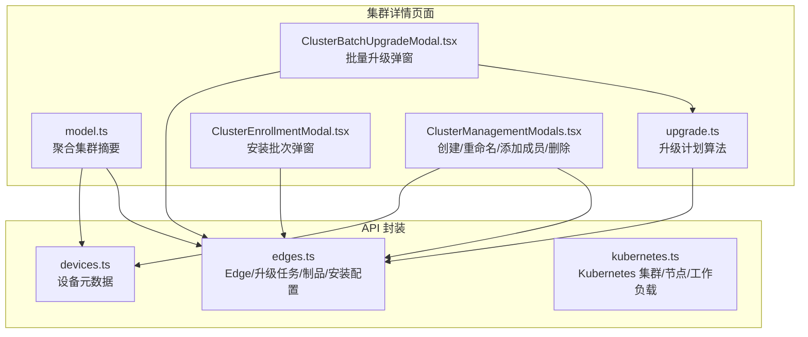
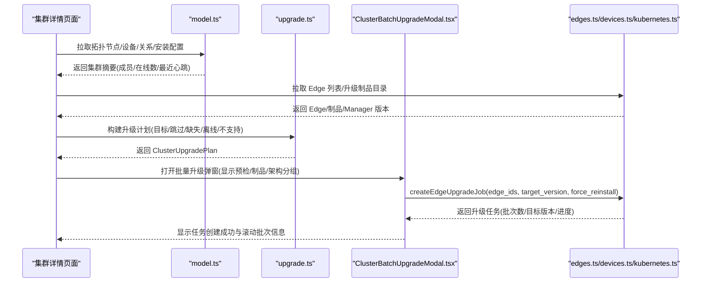
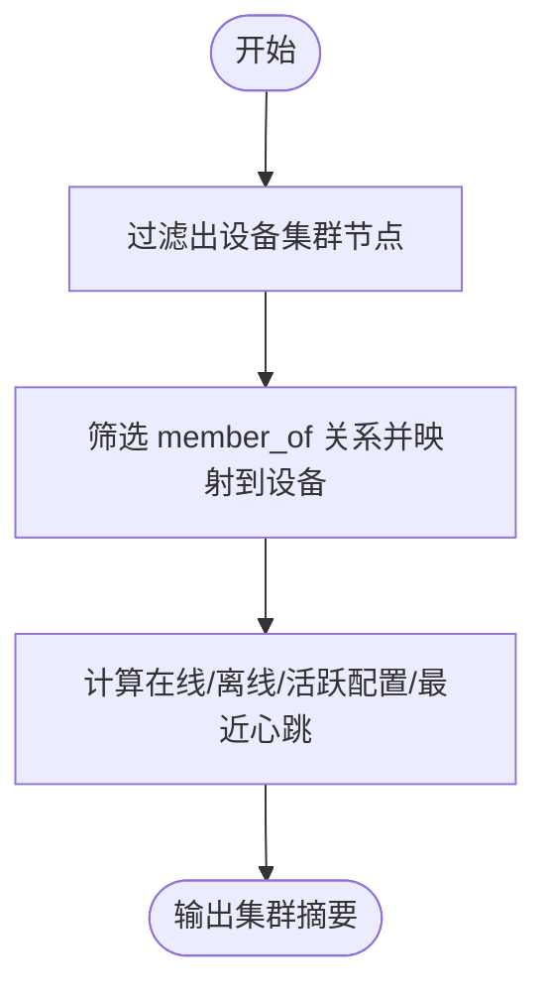
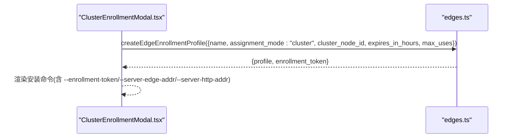
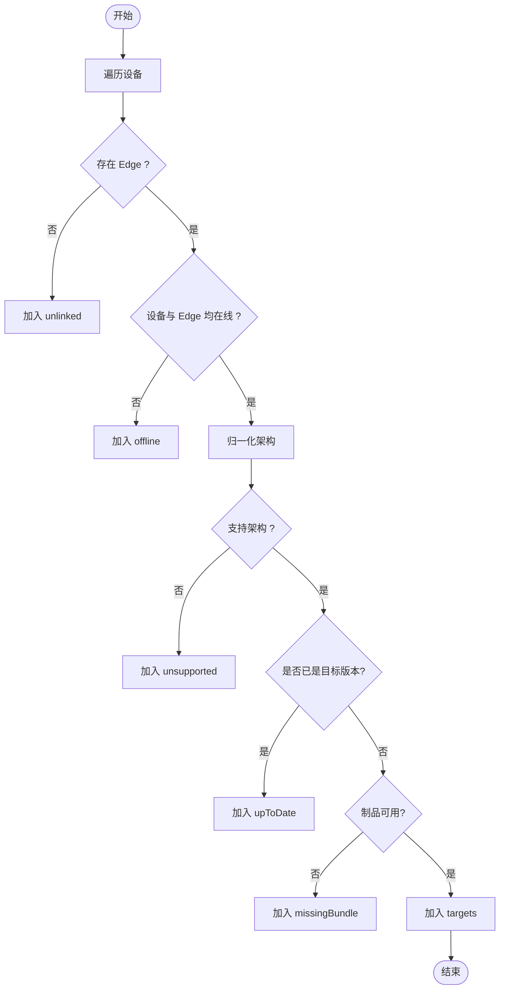
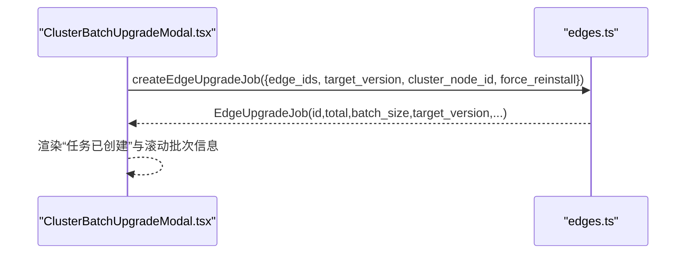
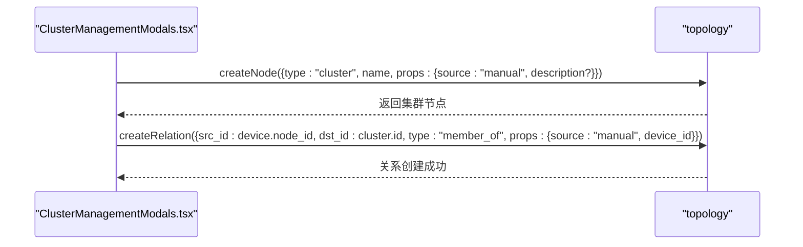
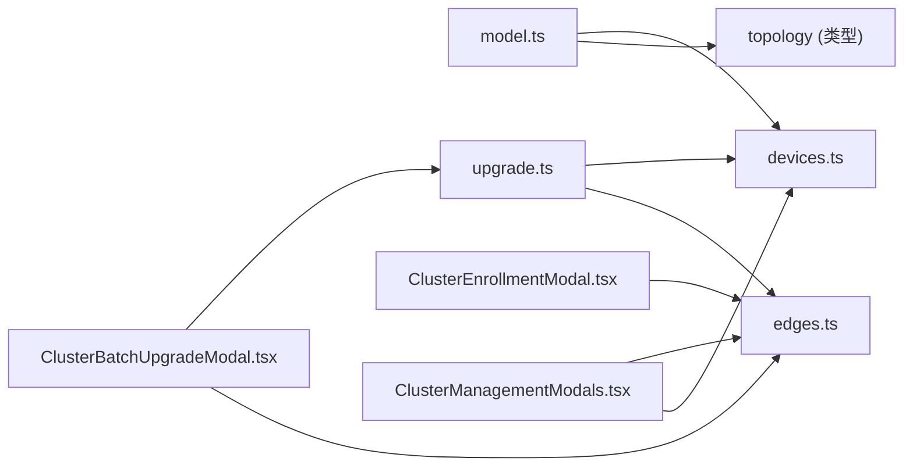

# 集群详情页面

<cite>
**本文引用的文件**
- [web/src/pages/clusters/model.ts](file://web/src/pages/clusters/model.ts)
- [web/src/pages/clusters/upgrade.ts](file://web/src/pages/clusters/upgrade.ts)
- [web/src/pages/clusters/ClusterBatchUpgradeModal.tsx](file://web/src/pages/clusters/ClusterBatchUpgradeModal.tsx)
- [web/src/pages/clusters/ClusterEnrollmentModal.tsx](file://web/src/pages/clusters/ClusterEnrollmentModal.tsx)
- [web/src/pages/clusters/ClusterManagementModals.tsx](file://web/src/pages/clusters/ClusterManagementModals.tsx)
- [web/src/api/edges.ts](file://web/src/api/edges.ts)
- [web/src/api/devices.ts](file://web/src/api/devices.ts)
- [web/src/api/kubernetes.ts](file://web/src/api/kubernetes.ts)
</cite>

## 目录
1. [简介](#简介)
2. [项目结构](#项目结构)
3. [核心组件](#核心组件)
4. [架构总览](#架构总览)
5. [详细组件分析](#详细组件分析)
6. [依赖关系分析](#依赖关系分析)
7. [性能考虑](#性能考虑)
8. [故障排查指南](#故障排查指南)
9. [结论](#结论)
10. [附录：扩展与开发示例](#附录：扩展与开发示例)

## 简介
本技术文档围绕“集群详情页面”的前端实现，系统性说明以下能力：
- 集群基本信息展示（名称、成员数、在线/离线统计、最近一次成员心跳时间）
- 成员设备管理（添加/重命名/删除集群、按拓扑关系维护成员归属）
- 安装批次配置（为集群生成一次性安装令牌与安装命令，支持有效期与最大使用次数）
- 升级计划生成（基于设备与 Edge 状态、系统架构、制品可用性构建可执行升级目标集合）
- Kubernetes 集成检测与版本兼容性检查（通过 API 获取集群能力与健康信息）
- 强制重装选项与升级包可用性验证（避免误操作并提前阻断不可用场景）
- 错误处理策略与用户交互优化（预检提示、批量进度可视化、失败原因定位）

## 项目结构
集群详情相关的前端代码集中在 web/src/pages/clusters 目录，配合 web/src/api 下的 edges、devices、kubernetes 等接口定义，形成“视图层 + 业务逻辑 + 数据模型 + API 封装”的分层结构。

图表来源
- [web/src/pages/clusters/model.ts:1-111](file://web/src/pages/clusters/model.ts#L1-L111)
- [web/src/pages/clusters/upgrade.ts:1-220](file://web/src/pages/clusters/upgrade.ts#L1-L220)
- [web/src/pages/clusters/ClusterBatchUpgradeModal.tsx:1-491](file://web/src/pages/clusters/ClusterBatchUpgradeModal.tsx#L1-L491)
- [web/src/pages/clusters/ClusterEnrollmentModal.tsx:1-257](file://web/src/pages/clusters/ClusterEnrollmentModal.tsx#L1-L257)
- [web/src/pages/clusters/ClusterManagementModals.tsx:1-434](file://web/src/pages/clusters/ClusterManagementModals.tsx#L1-L434)
- [web/src/api/edges.ts:1-469](file://web/src/api/edges.ts#L1-L469)
- [web/src/api/devices.ts:1-198](file://web/src/api/devices.ts#L1-L198)
- [web/src/api/kubernetes.ts:1-310](file://web/src/api/kubernetes.ts#L1-L310)

章节来源
- [web/src/pages/clusters/model.ts:1-111](file://web/src/pages/clusters/model.ts#L1-L111)
- [web/src/pages/clusters/upgrade.ts:1-220](file://web/src/pages/clusters/upgrade.ts#L1-L220)
- [web/src/pages/clusters/ClusterBatchUpgradeModal.tsx:1-491](file://web/src/pages/clusters/ClusterBatchUpgradeModal.tsx#L1-L491)
- [web/src/pages/clusters/ClusterEnrollmentModal.tsx:1-257](file://web/src/pages/clusters/ClusterEnrollmentModal.tsx#L1-L257)
- [web/src/pages/clusters/ClusterManagementModals.tsx:1-434](file://web/src/pages/clusters/ClusterManagementModals.tsx#L1-L434)
- [web/src/api/edges.ts:1-469](file://web/src/api/edges.ts#L1-L469)
- [web/src/api/devices.ts:1-198](file://web/src/api/devices.ts#L1-L198)
- [web/src/api/kubernetes.ts:1-310](file://web/src/api/kubernetes.ts#L1-L310)

## 核心组件
- 集群摘要与成员关系聚合：根据拓扑节点、设备列表、关系图与安装配置，计算每个设备集群的在线/离线数量、活跃配置数、最近成员心跳时间等。
- 升级计划构建：依据设备与 Edge 的状态、系统架构、目标版本与制品可用性，输出可升级目标、已达标、缺失制品、离线、未关联、不支持等分类。
- 批量升级弹窗：提供预检面板、制品清单、架构分组、跳过设备明细、强制重装开关、提交升级任务与结果反馈。
- 安装批次弹窗：为集群生成一次性安装令牌与一键安装命令，支持有效期与最大使用次数限制。
- 集群管理弹窗：新建/重命名/添加成员/删除设备集群，维护拓扑关系与手动来源标记。

章节来源
- [web/src/pages/clusters/model.ts:1-111](file://web/src/pages/clusters/model.ts#L1-L111)
- [web/src/pages/clusters/upgrade.ts:1-220](file://web/src/pages/clusters/upgrade.ts#L1-L220)
- [web/src/pages/clusters/ClusterBatchUpgradeModal.tsx:1-491](file://web/src/pages/clusters/ClusterBatchUpgradeModal.tsx#L1-L491)
- [web/src/pages/clusters/ClusterEnrollmentModal.tsx:1-257](file://web/src/pages/clusters/ClusterEnrollmentModal.tsx#L1-L257)
- [web/src/pages/clusters/ClusterManagementModals.tsx:1-434](file://web/src/pages/clusters/ClusterManagementModals.tsx#L1-L434)

## 架构总览
下图展示了从 UI 到后端 API 的关键调用路径，涵盖集群信息聚合、安装批次创建与批量升级流程。

图表来源
- [web/src/pages/clusters/model.ts:1-111](file://web/src/pages/clusters/model.ts#L1-L111)
- [web/src/pages/clusters/upgrade.ts:1-220](file://web/src/pages/clusters/upgrade.ts#L1-L220)
- [web/src/pages/clusters/ClusterBatchUpgradeModal.tsx:1-491](file://web/src/pages/clusters/ClusterBatchUpgradeModal.tsx#L1-L491)
- [web/src/api/edges.ts:1-469](file://web/src/api/edges.ts#L1-L469)

## 详细组件分析

### 集群基本信息与成员关系
- 识别设备集群：仅当拓扑节点类型为 cluster 且 source 不为 kubernetes 时视为设备集群。
- 成员关系解析：筛选 type 为 member_of 的关系，将 src_id 映射到设备；同时收集非成员的外部关系用于展示。
- 统计指标：在线/离线计数、活跃安装配置数量、最近一次成员心跳时间（优先 last_seen_at，否则 updated_at）。
- 设备归属映射：提供按设备 node_id 反查所属集群的能力，便于在设备详情页展示归属。

图表来源
- [web/src/pages/clusters/model.ts:17-86](file://web/src/pages/clusters/model.ts#L17-L86)

章节来源
- [web/src/pages/clusters/model.ts:17-104](file://web/src/pages/clusters/model.ts#L17-L104)

### 安装批次配置（集群级）
- 输入校验：名称必填、有效期 1–168 小时、最大设备数 1–10000。
- 创建安装配置：assignment_mode 为 cluster，绑定 cluster_node_id，返回一次性令牌与安装命令。
- 安装命令：自动拼接当前主机地址与隧道端口，默认兼容自签名证书，生产环境建议移除不安全参数。

图表来源
- [web/src/pages/clusters/ClusterEnrollmentModal.tsx:45-87](file://web/src/pages/clusters/ClusterEnrollmentModal.tsx#L45-L87)
- [web/src/pages/clusters/ClusterEnrollmentModal.tsx:194-257](file://web/src/pages/clusters/ClusterEnrollmentModal.tsx#L194-L257)
- [web/src/api/edges.ts:365-377](file://web/src/api/edges.ts#L365-L377)

章节来源
- [web/src/pages/clusters/ClusterEnrollmentModal.tsx:1-257](file://web/src/pages/clusters/ClusterEnrollmentModal.tsx#L1-L257)
- [web/src/api/edges.ts:306-377](file://web/src/api/edges.ts#L306-L377)

### 升级计划构建与兼容性检查
- 选择 Host Edge：同一设备可能有多条 Edge，优先选择在线或最近心跳更新的 Edge。
- 架构归一化：将设备 OS/arch 归一化为 linux-amd64 或 linux-arm64，非 Linux 或不支持的架构将被标记为 unsupported。
- 版本比较：规范化版本号（去除前导 v、统一小写），若已为目标版本则标记 upToDate。
- 制品可用性：可选 enforceBundleAvailability，若开启且对应架构+版本无可用制品，则标记 missingBundle。
- 离线与未关联：设备不在线或无 Edge 关联将被分别归类。
- 分批与分组：按架构分组目标，支持按固定批次大小切分。

图表来源
- [web/src/pages/clusters/upgrade.ts:38-98](file://web/src/pages/clusters/upgrade.ts#L38-L98)
- [web/src/pages/clusters/upgrade.ts:118-150](file://web/src/pages/clusters/upgrade.ts#L118-L150)
- [web/src/pages/clusters/upgrade.ts:194-205](file://web/src/pages/clusters/upgrade.ts#L194-L205)

章节来源
- [web/src/pages/clusters/upgrade.ts:1-220](file://web/src/pages/clusters/upgrade.ts#L1-L220)

### 批量升级弹窗与强制重装
- 预检面板：展示可升级、已达标、制品缺失、离线、未关联、不支持的数量，以及制品清单与架构分组。
- 强制重装：勾选后对已是目标版本的设备也下发升级任务，适用于修复损坏安装的场景。
- 提交升级任务：调用 createEdgeUpgradeJob，传入 edge_ids、target_version、cluster_node_id、force_reinstall。
- 任务结果：展示任务 ID、目标版本、滚动批次规模、各阶段计数（pending/succeeded/failed）。

图表来源
- [web/src/pages/clusters/ClusterBatchUpgradeModal.tsx:76-98](file://web/src/pages/clusters/ClusterBatchUpgradeModal.tsx#L76-L98)
- [web/src/pages/clusters/ClusterBatchUpgradeModal.tsx:161-208](file://web/src/pages/clusters/ClusterBatchUpgradeModal.tsx#L161-L208)
- [web/src/api/edges.ts:214-221](file://web/src/api/edges.ts#L214-L221)

章节来源
- [web/src/pages/clusters/ClusterBatchUpgradeModal.tsx:1-491](file://web/src/pages/clusters/ClusterBatchUpgradeModal.tsx#L1-L491)
- [web/src/api/edges.ts:129-221](file://web/src/api/edges.ts#L129-L221)

### 集群管理（创建/重命名/添加成员/删除）
- 新建设备集群：type=cluster，source=manual，可选 description。
- 重命名集群：更新节点名称。
- 添加成员：为选中的设备建立 member_of 关系，props.source=manual，并记录 device_id。
- 删除集群：仅允许删除空集群，防止误删。

图表来源
- [web/src/pages/clusters/ClusterManagementModals.tsx:40-63](file://web/src/pages/clusters/ClusterManagementModals.tsx#L40-L63)
- [web/src/pages/clusters/ClusterManagementModals.tsx:241-265](file://web/src/pages/clusters/ClusterManagementModals.tsx#L241-L265)

章节来源
- [web/src/pages/clusters/ClusterManagementModals.tsx:1-434](file://web/src/pages/clusters/ClusterManagementModals.tsx#L1-L434)

### Kubernetes 集成检测与版本兼容性
- 集群能力与健康：通过 list/get 接口获取集群能力状态（ready/degraded/unavailable 等）与健康指标（异常工作负载、Pod 状态、节点就绪情况）。
- 覆盖度统计：节点与 Edge/Device 的关联覆盖率，帮助判断集成完整性。
- 版本信息：包含控制器版本、最后可见时间、库存同步延迟等，辅助评估升级时机与风险。

章节来源
- [web/src/api/kubernetes.ts:1-310](file://web/src/api/kubernetes.ts#L1-L310)

## 依赖关系分析
- model.ts 依赖 devices、topology、edges 的数据类型，负责聚合与统计。
- upgrade.ts 依赖 devices 与 edges 的类型，实现升级目标筛选、架构归一化、版本比较与制品可用性检查。
- ClusterBatchUpgradeModal.tsx 依赖 upgrade.ts 的输出与 edges.ts 的升级任务接口。
- ClusterEnrollmentModal.tsx 依赖 edges.ts 的安装配置接口。
- ClusterManagementModals.tsx 依赖 topology 与 devices 的接口进行集群 CRUD 与成员关系维护。

图表来源
- [web/src/pages/clusters/model.ts:1-111](file://web/src/pages/clusters/model.ts#L1-L111)
- [web/src/pages/clusters/upgrade.ts:1-220](file://web/src/pages/clusters/upgrade.ts#L1-L220)
- [web/src/pages/clusters/ClusterBatchUpgradeModal.tsx:1-491](file://web/src/pages/clusters/ClusterBatchUpgradeModal.tsx#L1-L491)
- [web/src/pages/clusters/ClusterEnrollmentModal.tsx:1-257](file://web/src/pages/clusters/ClusterEnrollmentModal.tsx#L1-L257)
- [web/src/pages/clusters/ClusterManagementModals.tsx:1-434](file://web/src/pages/clusters/ClusterManagementModals.tsx#L1-L434)
- [web/src/api/edges.ts:1-469](file://web/src/api/edges.ts#L1-L469)
- [web/src/api/devices.ts:1-198](file://web/src/api/devices.ts#L1-L198)

章节来源
- [web/src/pages/clusters/model.ts:1-111](file://web/src/pages/clusters/model.ts#L1-L111)
- [web/src/pages/clusters/upgrade.ts:1-220](file://web/src/pages/clusters/upgrade.ts#L1-L220)
- [web/src/pages/clusters/ClusterBatchUpgradeModal.tsx:1-491](file://web/src/pages/clusters/ClusterBatchUpgradeModal.tsx#L1-L491)
- [web/src/pages/clusters/ClusterEnrollmentModal.tsx:1-257](file://web/src/pages/clusters/ClusterEnrollmentModal.tsx#L1-L257)
- [web/src/pages/clusters/ClusterManagementModals.tsx:1-434](file://web/src/pages/clusters/ClusterManagementModals.tsx#L1-L434)
- [web/src/api/edges.ts:1-469](file://web/src/api/edges.ts#L1-L469)
- [web/src/api/devices.ts:1-198](file://web/src/api/devices.ts#L1-L198)

## 性能考虑
- 升级目标分组与分批：按架构分组减少并行复杂度，按固定批次大小控制并发压力，避免一次性下发过多任务。
- 预检前置：在客户端完成版本与制品可用性检查，减少无效请求与失败重试。
- 数据聚合优化：使用 Map/Set 提升成员关系查找与去重效率，降低 O(n^2) 风险。
- 界面交互：提交过程中禁用重复提交，展示加载态与错误提示，避免用户重复操作导致资源浪费。

[本节为通用指导，不直接分析具体文件]

## 故障排查指南
- 制品不可用：当 bundleCatalogError 存在时，阻止升级并提交错误提示；检查对应架构与目标版本是否 available。
- 创建升级任务失败：捕获后端返回的错误消息并展示；确认 edge_ids 有效、target_version 正确、force_reinstall 设置合理。
- 升级收敛判定：evaluateUpgradeConvergence 依据 last_registered_at 与 agent_version 判断是否完成；若设备未重新注册或版本不匹配，需等待或重试。
- 安装命令执行失败：确认网络可达、TLS 配置与 tunnel 端口正确；生产环境移除不安全参数并使用可信证书。
- 成员添加失败：确保设备已有拓扑节点且未归属其他集群或 Kubernetes；检查 member_of 关系创建是否成功。

章节来源
- [web/src/pages/clusters/ClusterBatchUpgradeModal.tsx:248-265](file://web/src/pages/clusters/ClusterBatchUpgradeModal.tsx#L248-L265)
- [web/src/pages/clusters/upgrade.ts:100-116](file://web/src/pages/clusters/upgrade.ts#L100-L116)
- [web/src/pages/clusters/ClusterEnrollmentModal.tsx:194-257](file://web/src/pages/clusters/ClusterEnrollmentModal.tsx#L194-L257)
- [web/src/pages/clusters/ClusterManagementModals.tsx:241-265](file://web/src/pages/clusters/ClusterManagementModals.tsx#L241-L265)

## 结论
集群详情页面通过清晰的分层设计与严格的预检逻辑，实现了设备集群的基本信息管理、安装批次配置与批量升级能力。升级计划构建兼顾了设备状态、架构兼容性与制品可用性，并提供强制重装以应对异常场景。结合 Kubernetes 集成检测，可在更大范围内保障升级的安全性与可控性。

[本节为总结性内容，不直接分析具体文件]

## 附录：扩展与开发示例

### 新增一个集群操作（例如：批量下线）
- 步骤
  - 在 edges.ts 中新增批量下线接口封装（参考 batchDeleteEdges 的实现模式）。
  - 在 ClusterManagementModals.tsx 中添加“批量下线”按钮与确认弹窗，调用新接口并展示结果。
  - 在 model.ts 中补充下线后的状态刷新逻辑（如更新设备/Edge 状态）。
- 关键点
  - 复用现有批量操作模式，保证一致的用户体验。
  - 增加权限与二次确认，避免误操作。
  - 对失败项进行汇总与提示，便于后续处理。

章节来源
- [web/src/api/edges.ts:263-266](file://web/src/api/edges.ts#L263-L266)
- [web/src/pages/clusters/ClusterManagementModals.tsx:1-434](file://web/src/pages/clusters/ClusterManagementModals.tsx#L1-L434)

### 扩展现有升级功能（例如：增加灰度发布策略）
- 步骤
  - 在 upgrade.ts 中扩展 groupUpgradeTargets 或新增分组函数，按标签/区域/架构维度划分灰度组。
  - 在 ClusterBatchUpgradeModal.tsx 中增加灰度组选择与顺序控制，提交时按组分批创建升级任务。
  - 在 edges.ts 中扩展升级任务参数，支持指定灰度组与回滚策略。
- 关键点
  - 保持升级收敛判定不变，确保灰度组内设备稳定后再推进下一组。
  - 提供可视化的灰度进度与失败隔离机制。

章节来源
- [web/src/pages/clusters/upgrade.ts:152-179](file://web/src/pages/clusters/upgrade.ts#L152-L179)
- [web/src/pages/clusters/ClusterBatchUpgradeModal.tsx:63-98](file://web/src/pages/clusters/ClusterBatchUpgradeModal.tsx#L63-L98)
- [web/src/api/edges.ts:214-221](file://web/src/api/edges.ts#L214-L221)

### 增强 Kubernetes 集成检测
- 步骤
  - 在 kubernetes.ts 中扩展健康指标字段（如新增关键告警计数）。
  - 在集群详情页面中展示能力状态与健康摘要，结合升级计划给出风险提示。
- 关键点
  - 将能力状态与升级策略联动，避免在 degraded 状态下发起大规模升级。
  - 提供快速跳转至问题工作负载/节点的入口。

章节来源
- [web/src/api/kubernetes.ts:1-310](file://web/src/api/kubernetes.ts#L1-L310)