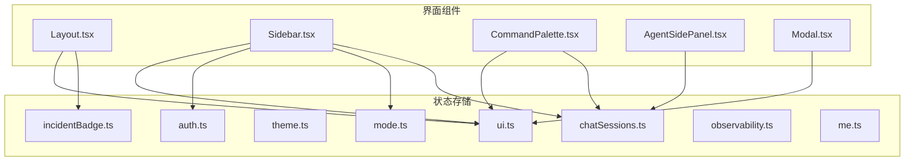
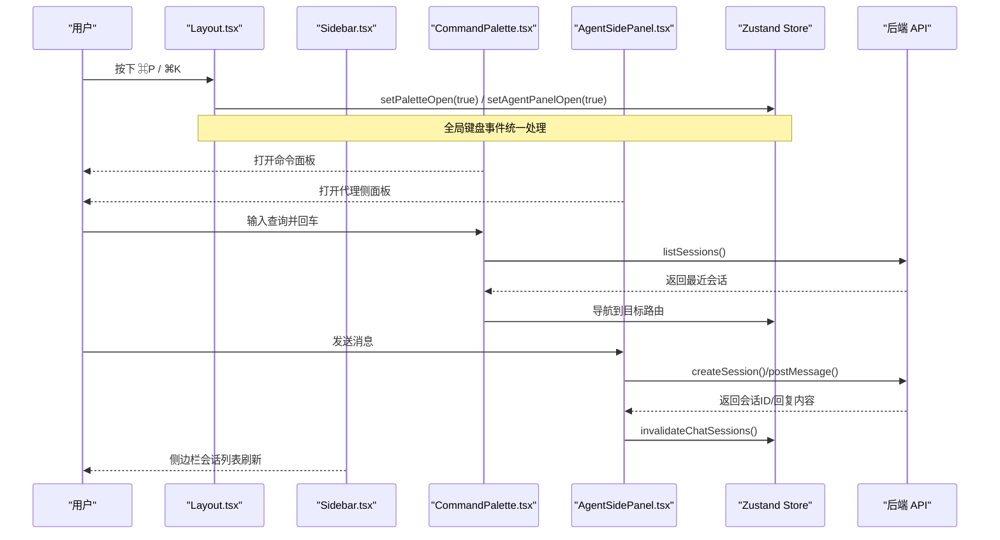
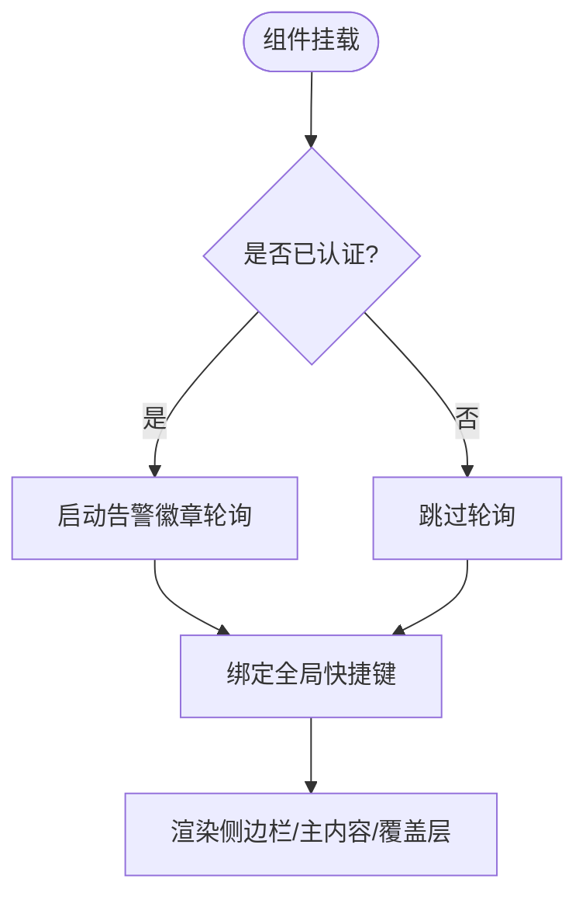
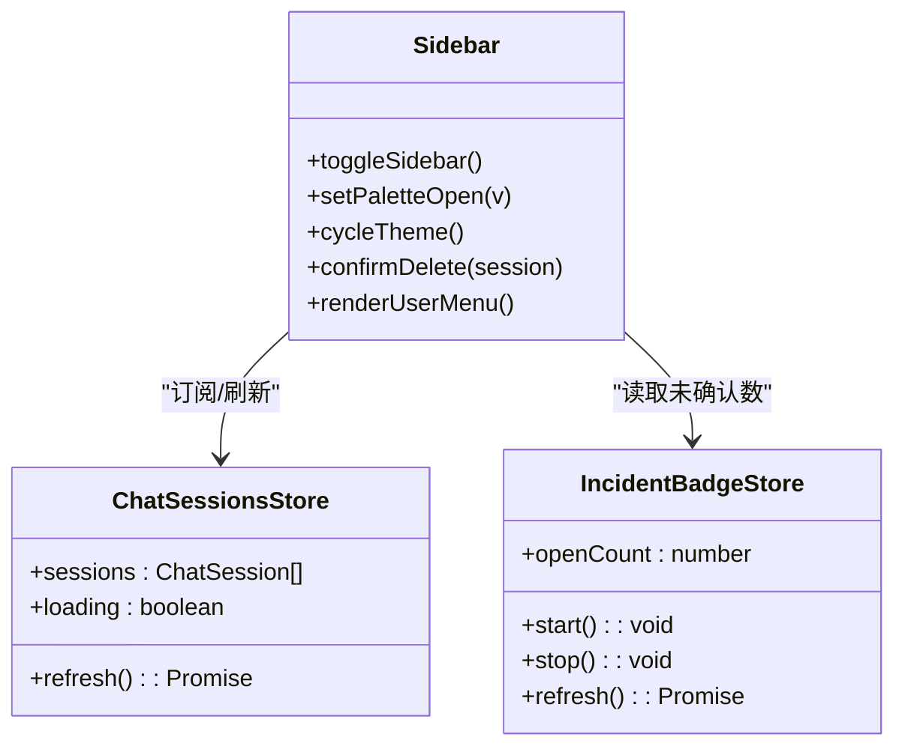
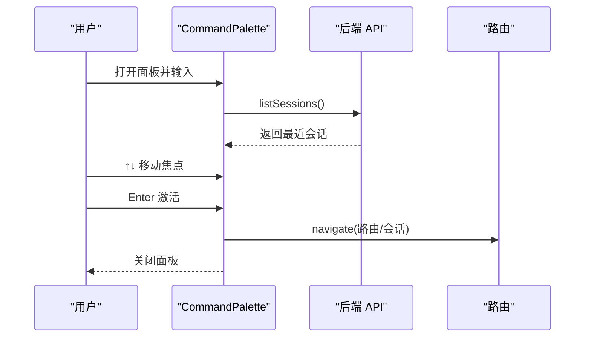
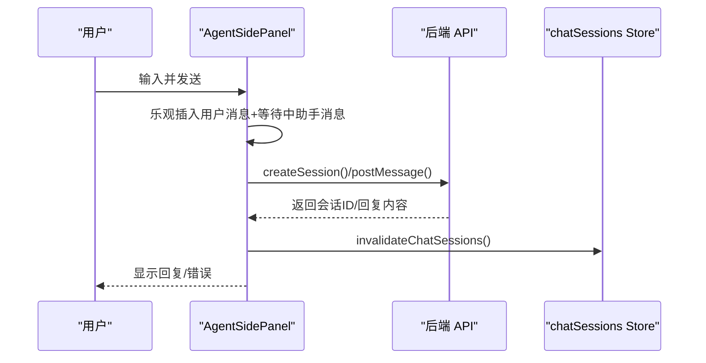
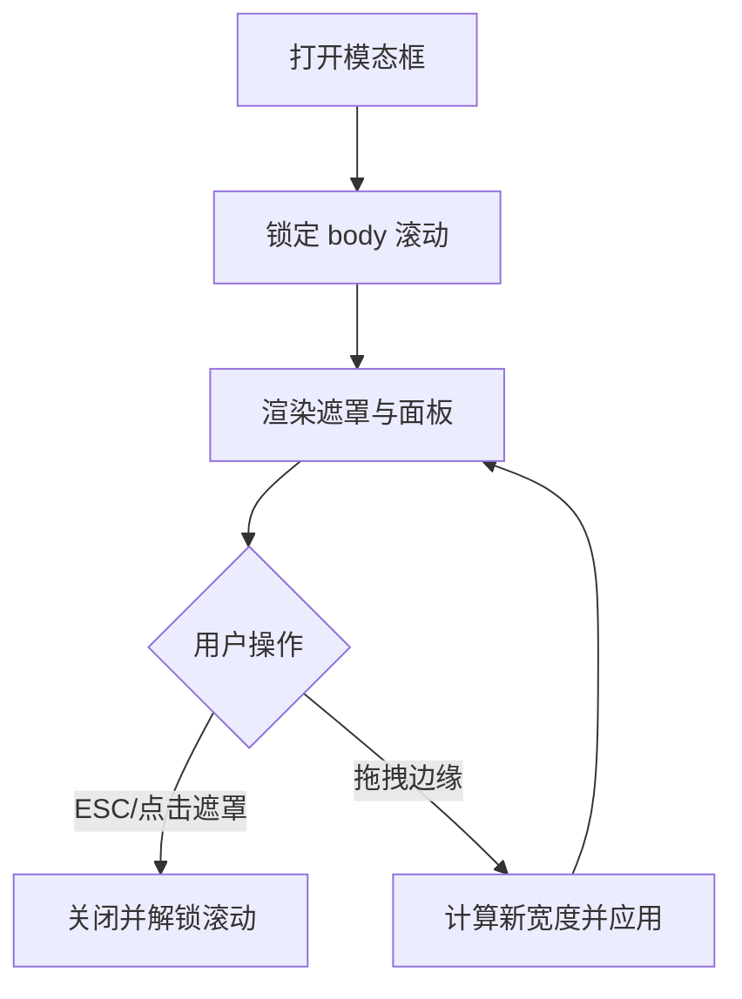
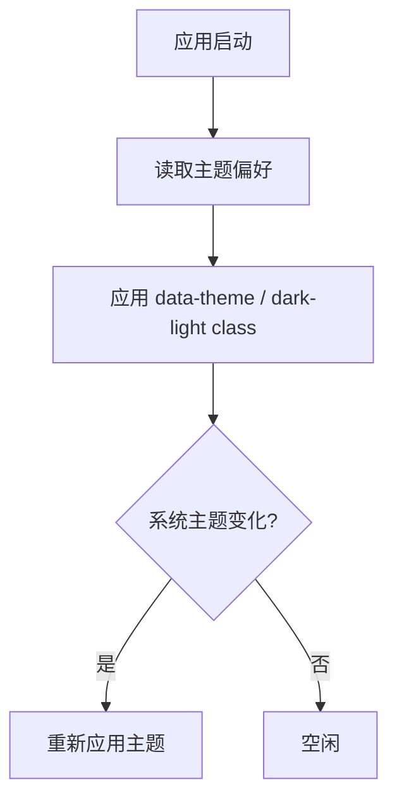
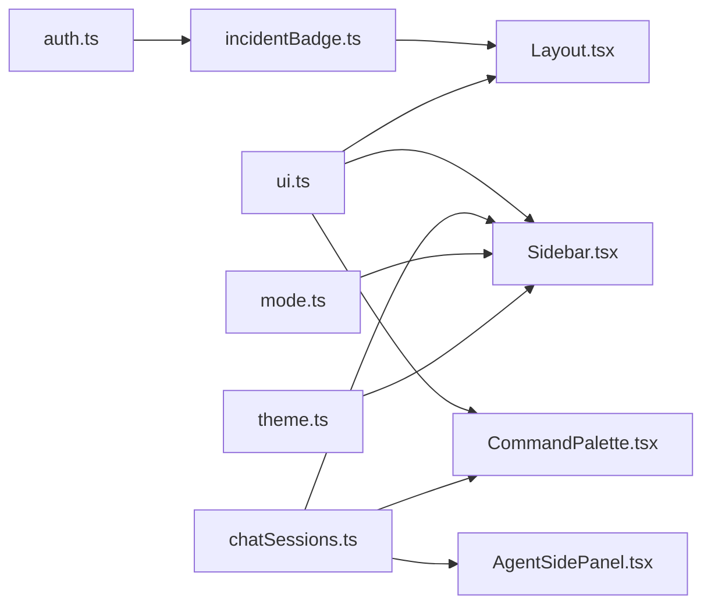

# UI 状态管理

<cite>
**本文引用的文件**
- [web/src/store/ui.ts](file://web/src/store/ui.ts)
- [web/src/store/auth.ts](file://web/src/store/auth.ts)
- [web/src/store/theme.ts](file://web/src/store/theme.ts)
- [web/src/store/mode.ts](file://web/src/store/mode.ts)
- [web/src/store/chatSessions.ts](file://web/src/store/chatSessions.ts)
- [web/src/store/incidentBadge.ts](file://web/src/store/incidentBadge.ts)
- [web/src/store/observability.ts](file://web/src/store/observability.ts)
- [web/src/store/me.ts](file://web/src/store/me.ts)
- [web/src/components/Layout.tsx](file://web/src/components/Layout.tsx)
- [web/src/components/Sidebar.tsx](file://web/src/components/Sidebar.tsx)
- [web/src/components/CommandPalette.tsx](file://web/src/components/CommandPalette.tsx)
- [web/src/components/AgentSidePanel.tsx](file://web/src/components/AgentSidePanel.tsx)
- [web/src/components/Modal.tsx](file://web/src/components/Modal.tsx)
</cite>

## 目录
1. [简介](#简介)
2. [项目结构](#项目结构)
3. [核心组件](#核心组件)
4. [架构总览](#架构总览)
5. [详细组件分析](#详细组件分析)
6. [依赖关系分析](#依赖关系分析)
7. [性能考量](#性能考量)
8. [故障排查指南](#故障排查指南)
9. [结论](#结论)
10. [附录](#附录)

## 简介
本技术文档聚焦于前端 UI 状态管理，围绕“组件状态、全局 UI 配置与用户交互反馈”的统一管理展开。重点覆盖：
- 数据结构设计：模态框状态、侧边栏显示、通知消息（未确认告警计数）、加载状态等
- 状态与组件的绑定机制：响应式更新、事件处理、键盘快捷键
- 复杂交互流程的状态编排：命令面板、浮动助理面板、会话列表刷新
- 冲突与竞态处理：重复请求去重、轮询生命周期、错误静默降级
- 用户体验优化：首屏主题无闪烁、可拖拽弹窗、最小化渲染
- 调试与排障：如何定位状态来源、如何观察副作用

## 项目结构
UI 状态主要位于 web/src/store 目录，采用 Zustand 进行轻量级全局状态管理；页面与布局通过 React 组件订阅 store，并通过 API 层触发数据变更。关键文件职责如下：
- ui.ts：全局 UI 开关（侧边栏折叠、命令面板、代理侧面板）
- auth.ts：认证会话持久化（token、角色、邮箱）
- theme.ts：品牌强调色选择与 CSS 变量注入
- mode.ts：明暗主题偏好与系统跟随策略
- chatSessions.ts：聊天会话列表缓存与刷新
- incidentBadge.ts：未确认告警数量轮询与展示
- observability.ts：可观测性相关用户配置（Grafana 等）
- me.ts：当前用户信息缓存与权限派生
- Layout.tsx：全局快捷键、全局挂载的生命周期
- Sidebar.tsx：导航、用户菜单、会话列表、主题切换入口
- CommandPalette.tsx：命令面板（路由与最近会话搜索）
- AgentSidePanel.tsx：浮动助理面板（临时会话、发送消息）
- Modal.tsx：通用模态框（支持拖拽调宽、ESC 关闭）

**图表来源**
- [web/src/store/ui.ts:1-39](file://web/src/store/ui.ts#L1-L39)
- [web/src/store/auth.ts:1-50](file://web/src/store/auth.ts#L1-L50)
- [web/src/store/theme.ts:1-98](file://web/src/store/theme.ts#L1-L98)
- [web/src/store/mode.ts:1-98](file://web/src/store/mode.ts#L1-L98)
- [web/src/store/chatSessions.ts:1-34](file://web/src/store/chatSessions.ts#L1-L34)
- [web/src/store/incidentBadge.ts:1-59](file://web/src/store/incidentBadge.ts#L1-L59)
- [web/src/store/observability.ts:1-43](file://web/src/store/observability.ts#L1-L43)
- [web/src/store/me.ts:1-114](file://web/src/store/me.ts#L1-L114)
- [web/src/components/Layout.tsx:1-72](file://web/src/components/Layout.tsx#L1-L72)
- [web/src/components/Sidebar.tsx:1-800](file://web/src/components/Sidebar.tsx#L1-L800)
- [web/src/components/CommandPalette.tsx:1-274](file://web/src/components/CommandPalette.tsx#L1-L274)
- [web/src/components/AgentSidePanel.tsx:1-281](file://web/src/components/AgentSidePanel.tsx#L1-L281)
- [web/src/components/Modal.tsx:1-133](file://web/src/components/Modal.tsx#L1-L133)

**章节来源**
- [web/src/store/ui.ts:1-39](file://web/src/store/ui.ts#L1-L39)
- [web/src/components/Layout.tsx:1-72](file://web/src/components/Layout.tsx#L1-L72)

## 核心组件
- 全局 UI 状态（ui.ts）
  - 字段：侧边栏折叠、命令面板打开、代理侧面板打开
  - 方法：切换/设置上述布尔状态
  - 持久化：仅持久化侧边栏折叠，避免将瞬时覆盖层状态写入本地存储
- 认证状态（auth.ts）
  - 字段：访问令牌、刷新令牌、邮箱、角色
  - 方法：设置会话、退出登录
  - 持久化：localStorage 持久化
- 主题与模式（theme.ts, mode.ts）
  - theme.ts：品牌强调色预设，写入 CSS 自定义属性 --accent，避免组件重渲染
  - mode.ts：系统/浅色/深色三种偏好，应用 data-theme 与 dark/light class，监听系统主题变化
- 会话列表（chatSessions.ts）
  - 字段：会话数组、加载标志
  - 方法：刷新会话列表；提供 invalidateChatSessions() 供任意位置触发
- 告警徽章（incidentBadge.ts）
  - 字段：未确认告警数、定时器句柄
  - 方法：start/stop/refresh；每 30 秒轮询一次，无 token 时停止
- 可观测性配置（observability.ts）
  - 字段：Grafana 根地址、数据源 UID、仪表盘 UID、组织 ID
  - 方法：部分更新、重置为默认值
- 当前用户与权限（me.ts）
  - 字段：用户对象、加载、错误、进行中请求
  - 方法：loadMe（单飞去重）、useMe/usePermissions 钩子

**章节来源**
- [web/src/store/ui.ts:1-39](file://web/src/store/ui.ts#L1-L39)
- [web/src/store/auth.ts:1-50](file://web/src/store/auth.ts#L1-L50)
- [web/src/store/theme.ts:1-98](file://web/src/store/theme.ts#L1-L98)
- [web/src/store/mode.ts:1-98](file://web/src/store/mode.ts#L1-L98)
- [web/src/store/chatSessions.ts:1-34](file://web/src/store/chatSessions.ts#L1-L34)
- [web/src/store/incidentBadge.ts:1-59](file://web/src/store/incidentBadge.ts#L1-L59)
- [web/src/store/observability.ts:1-43](file://web/src/store/observability.ts#L1-L43)
- [web/src/store/me.ts:1-114](file://web/src/store/me.ts#L1-L114)

## 架构总览
UI 状态以 Zustand store 为中心，组件通过订阅获取响应式更新；API 调用在组件或 store 中发起，成功后再回写 store。全局快捷键在 Layout 中统一捕获，驱动 UI 状态变化。

**图表来源**
- [web/src/components/Layout.tsx:1-72](file://web/src/components/Layout.tsx#L1-L72)
- [web/src/components/CommandPalette.tsx:1-274](file://web/src/components/CommandPalette.tsx#L1-L274)
- [web/src/components/AgentSidePanel.tsx:1-281](file://web/src/components/AgentSidePanel.tsx#L1-L281)
- [web/src/store/chatSessions.ts:1-34](file://web/src/store/chatSessions.ts#L1-L34)

## 详细组件分析

### 全局布局与快捷键（Layout.tsx）
- 职责
  - 启动未确认告警徽章轮询（进入已认证页面后）
  - 注册全局键盘事件：⌘K 打开代理侧面板，⌘P 打开命令面板
  - 承载侧边栏、主内容区、命令面板与代理侧面板
- 关键点
  - 使用 useUi 读取/设置 paletteOpen 与 agentPanelOpen
  - 使用 useIncidentBadge.start/stop 控制轮询生命周期
  - 使用 Suspense 包裹路由出口，提供轻量加载提示

**图表来源**
- [web/src/components/Layout.tsx:1-72](file://web/src/components/Layout.tsx#L1-L72)
- [web/src/store/incidentBadge.ts:1-59](file://web/src/store/incidentBadge.ts#L1-L59)

**章节来源**
- [web/src/components/Layout.tsx:1-72](file://web/src/components/Layout.tsx#L1-L72)

### 侧边栏（Sidebar.tsx）
- 职责
  - 导航项、分组折叠、会话列表、用户菜单、主题切换入口
  - 读取并展示未确认告警数
  - 触发会话删除/重命名并刷新列表
- 关键点
  - 使用 useUi 控制侧边栏折叠与命令面板
  - 使用 useThemeMode 切换主题偏好
  - 使用 useChatSessions 拉取/刷新会话列表
  - 使用 useIncidentBadge 展示未确认告警数
  - 删除/重命名后调用 invalidateChatSessions() 触发刷新

**图表来源**
- [web/src/components/Sidebar.tsx:1-800](file://web/src/components/Sidebar.tsx#L1-L800)
- [web/src/store/chatSessions.ts:1-34](file://web/src/store/chatSessions.ts#L1-L34)
- [web/src/store/incidentBadge.ts:1-59](file://web/src/store/incidentBadge.ts#L1-L59)

**章节来源**
- [web/src/components/Sidebar.tsx:1-800](file://web/src/components/Sidebar.tsx#L1-L800)

### 命令面板（CommandPalette.tsx）
- 职责
  - 模糊匹配应用路由与最近会话，快速跳转
  - 键盘导航（↑↓ 切换、Enter 激活、Esc 关闭）
- 关键点
  - 打开时拉取最近会话（最多 5 条），保证跨标签页新建会话可见
  - 结果集扁平化（路由优先，会话随后），维护 activeIndex
  - 通过 useNavigate 完成跳转并关闭面板

**图表来源**
- [web/src/components/CommandPalette.tsx:1-274](file://web/src/components/CommandPalette.tsx#L1-L274)

**章节来源**
- [web/src/components/CommandPalette.tsx:1-274](file://web/src/components/CommandPalette.tsx#L1-L274)

### 代理侧面板（AgentSidePanel.tsx）
- 职责
  - 轻量浮动聊天界面，首次发送消息时懒创建会话
  - 乐观更新用户消息与待响应占位，完成后替换为真实回复
  - 失败时显示错误信息，保持编辑可用
- 关键点
  - 关闭后延迟清空状态，避免动画期间闪烁
  - ESC 关闭，自动滚动到底部
  - 发送成功后调用 invalidateChatSessions() 同步侧边栏

**图表来源**
- [web/src/components/AgentSidePanel.tsx:1-281](file://web/src/components/AgentSidePanel.tsx#L1-L281)
- [web/src/store/chatSessions.ts:1-34](file://web/src/store/chatSessions.ts#L1-L34)

**章节来源**
- [web/src/components/AgentSidePanel.tsx:1-281](file://web/src/components/AgentSidePanel.tsx#L1-L281)

### 模态框（Modal.tsx）
- 职责
  - 通用对话框容器，支持标题、内容、底部操作区
  - 支持 ESC 关闭、body 滚动锁定
  - 可选 resizable 左右边缘拖拽调整宽度，限制最小/最大宽度
- 关键点
  - 使用 aria-modal 与 role="dialog" 提升可访问性
  - 拖拽过程中计算 delta，双向等量调整以保持居中
  - 关闭时恢复 body 滚动样式

**图表来源**
- [web/src/components/Modal.tsx:1-133](file://web/src/components/Modal.tsx#L1-L133)

**章节来源**
- [web/src/components/Modal.tsx:1-133](file://web/src/components/Modal.tsx#L1-L133)

### 主题与模式（theme.ts, mode.ts）
- 职责
  - theme.ts：选择品牌强调色，写入 --accent 变量，避免组件重渲染
  - mode.ts：系统/浅色/深色偏好，应用 data-theme 与 dark/light class，监听系统主题变化
- 关键点
  - applyAccentOnBoot 在首屏前直接读取 localStorage，避免闪烁
  - useThemeMode 暴露 preference/resolved/setPreference/cycle
  - 通过 window 事件 ongrid-theme-change 实现跨组件同步

**图表来源**
- [web/src/store/theme.ts:1-98](file://web/src/store/theme.ts#L1-L98)
- [web/src/store/mode.ts:1-98](file://web/src/store/mode.ts#L1-L98)

**章节来源**
- [web/src/store/theme.ts:1-98](file://web/src/store/theme.ts#L1-L98)
- [web/src/store/mode.ts:1-98](file://web/src/store/mode.ts#L1-L98)

### 会话列表与刷新（chatSessions.ts）
- 职责
  - 维护会话列表与加载状态
  - 提供 refresh() 拉取最新数据
  - 暴露 invalidateChatSessions() 供任意组件触发刷新
- 关键点
  - 刷新前后设置 loading 标志
  - 错误路径下确保 loading 复位
  - 与 Sidebar/AgentSidePanel 配合，保证多入口一致性

**章节来源**
- [web/src/store/chatSessions.ts:1-34](file://web/src/store/chatSessions.ts#L1-L34)

### 告警徽章轮询（incidentBadge.ts）
- 职责
  - 每 30 秒轮询未确认告警数量
  - 无 token 时停止轮询，避免 401 风暴
- 关键点
  - start/stop 管理定时器
  - refresh 内部判断 token 存在性
  - 错误静默处理，避免干扰其他页面

**章节来源**
- [web/src/store/incidentBadge.ts:1-59](file://web/src/store/incidentBadge.ts#L1-L59)

### 当前用户与权限（me.ts）
- 职责
  - 缓存当前用户信息与权限派生
  - 单飞请求去重，避免并发重复请求
- 关键点
  - loadMe 使用 inflight 字段合并并发请求
  - useMe 在 token 变化时清理缓存并重新拉取
  - usePermissions 基于 me.role 与 auth.role 派生权限标志

**章节来源**
- [web/src/store/me.ts:1-114](file://web/src/store/me.ts#L1-L114)

## 依赖关系分析
- 组件对 store 的依赖
  - Layout 依赖 ui 与 incidentBadge
  - Sidebar 依赖 ui、auth、mode、chatSessions、incidentBadge
  - CommandPalette 依赖 ui、chatSessions
  - AgentSidePanel 依赖 chatSessions
  - Modal 不依赖 store，纯 UI 容器
- Store 之间的耦合
  - incidentBadge 依赖 auth（检查 token）
  - AgentSidePanel 通过 invalidateChatSessions 影响 chatSessions
  - Sidebar 同时消费 incidentBadge 与 chatSessions

**图表来源**
- [web/src/store/auth.ts:1-50](file://web/src/store/auth.ts#L1-L50)
- [web/src/store/incidentBadge.ts:1-59](file://web/src/store/incidentBadge.ts#L1-L59)
- [web/src/store/ui.ts:1-39](file://web/src/store/ui.ts#L1-L39)
- [web/src/store/chatSessions.ts:1-34](file://web/src/store/chatSessions.ts#L1-L34)
- [web/src/store/mode.ts:1-98](file://web/src/store/mode.ts#L1-L98)
- [web/src/store/theme.ts:1-98](file://web/src/store/theme.ts#L1-L98)
- [web/src/components/Layout.tsx:1-72](file://web/src/components/Layout.tsx#L1-L72)
- [web/src/components/Sidebar.tsx:1-800](file://web/src/components/Sidebar.tsx#L1-L800)
- [web/src/components/CommandPalette.tsx:1-274](file://web/src/components/CommandPalette.tsx#L1-L274)
- [web/src/components/AgentSidePanel.tsx:1-281](file://web/src/components/AgentSidePanel.tsx#L1-L281)

**章节来源**
- [web/src/store/auth.ts:1-50](file://web/src/store/auth.ts#L1-L50)
- [web/src/store/incidentBadge.ts:1-59](file://web/src/store/incidentBadge.ts#L1-L59)
- [web/src/store/ui.ts:1-39](file://web/src/store/ui.ts#L1-L39)
- [web/src/store/chatSessions.ts:1-34](file://web/src/store/chatSessions.ts#L1-L34)
- [web/src/store/mode.ts:1-98](file://web/src/store/mode.ts#L1-L98)
- [web/src/store/theme.ts:1-98](file://web/src/store/theme.ts#L1-L98)
- [web/src/components/Layout.tsx:1-72](file://web/src/components/Layout.tsx#L1-L72)
- [web/src/components/Sidebar.tsx:1-800](file://web/src/components/Sidebar.tsx#L1-L800)
- [web/src/components/CommandPalette.tsx:1-274](file://web/src/components/CommandPalette.tsx#L1-L274)
- [web/src/components/AgentSidePanel.tsx:1-281](file://web/src/components/AgentSidePanel.tsx#L1-L281)

## 性能考量
- 首屏主题无闪烁
  - 在应用启动阶段直接读取 localStorage 并应用主题，避免 React 异步重水合导致的闪烁
- 最小化重渲染
  - 强调色通过 CSS 变量注入，无需组件重渲染
  - 命令面板仅在打开时拉取少量数据（最近 5 条）
- 轮询节流
  - 告警徽章每 30 秒轮询一次，无 token 时停止，避免无效请求
- 请求去重
  - 当前用户信息加载使用 inflight 字段合并并发请求，减少网络压力
- 局部状态隔离
  - 命令面板与代理侧面板使用组件内状态，避免污染全局 store
- 可访问性与交互效率
  - 模态框支持 ESC 关闭与拖拽调宽，提升长内容阅读体验

[本节为通用指导，不直接分析具体文件]

## 故障排查指南
- 常见问题定位
  - 侧边栏未刷新：检查是否在删除/重命名后调用 invalidateChatSessions()
  - 告警徽章不更新：确认 Layout 已启动轮询且存在有效 token
  - 主题闪烁：确认应用启动阶段已调用 applyAccentOnBoot/applyThemeOnBoot
  - 命令面板无结果：检查 listSessions 是否成功返回，以及模糊匹配逻辑
  - 代理侧面板发送失败：查看错误信息并确认会话创建与消息发送链路
- 调试建议
  - 在浏览器控制台查看 localStorage 中的 ongrid.* 键值，验证持久化状态
  - 使用 React DevTools 观察组件订阅的 store 片段变化
  - 在网络面板过滤 API 请求，核对轮询频率与错误码
  - 对于并发请求问题，关注 me.ts 的 inflight 字段与重试逻辑

**章节来源**
- [web/src/store/chatSessions.ts:1-34](file://web/src/store/chatSessions.ts#L1-L34)
- [web/src/store/incidentBadge.ts:1-59](file://web/src/store/incidentBadge.ts#L1-L59)
- [web/src/store/theme.ts:1-98](file://web/src/store/theme.ts#L1-L98)
- [web/src/store/mode.ts:1-98](file://web/src/store/mode.ts#L1-L98)
- [web/src/components/CommandPalette.tsx:1-274](file://web/src/components/CommandPalette.tsx#L1-L274)
- [web/src/components/AgentSidePanel.tsx:1-281](file://web/src/components/AgentSidePanel.tsx#L1-L281)

## 结论
本项目采用 Zustand 作为 UI 状态管理的核心，结合 React 组件的响应式订阅，实现了简洁而高效的全局状态模型。通过集中化的快捷键处理、轮询管理与请求去重，保证了复杂交互的一致性与性能。主题与模式策略兼顾了品牌一致性与用户体验，模态框与命令面板提供了高效的交互入口。整体架构清晰、扩展性强，适合持续演进。

[本节为总结，不直接分析具体文件]

## 附录
- 常用状态字段速查
  - 全局 UI：sidebarCollapsed、paletteOpen、agentPanelOpen
  - 认证：token、refreshToken、email、role
  - 主题：accentId、preference、resolved
  - 会话：sessions、loading
  - 告警：openCount
  - 可观测性：grafanaBaseUrl、grafanaDatasourceUid、grafanaDashboardUid、grafanaOrgId
  - 用户：me、loading、error、权限标志
- 典型交互流程
  - 打开命令面板 → 搜索路由/会话 → 跳转并关闭
  - 打开代理侧面板 → 首次发送创建会话 → 刷新侧边栏
  - 删除/重命名会话 → 触发刷新 → 侧边栏更新
  - 切换主题 → 应用 CSS 变量与类名 → 全局生效

[本节为补充说明，不直接分析具体文件]