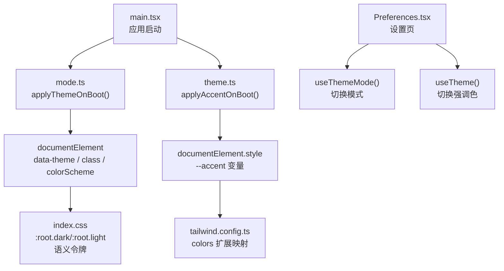
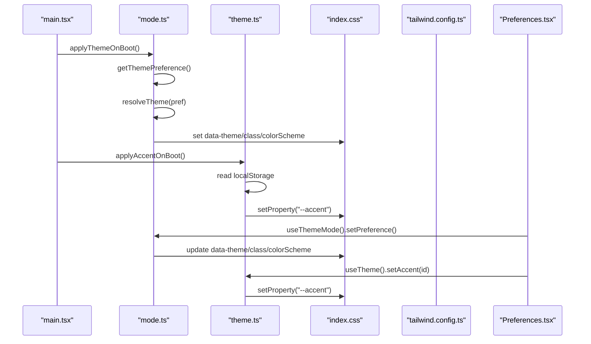
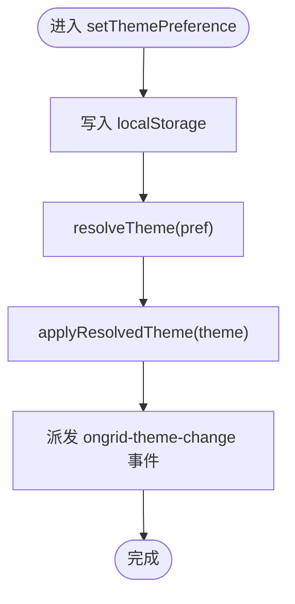
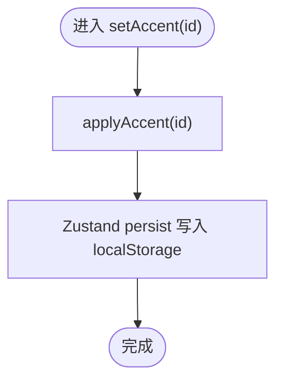
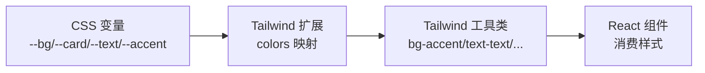
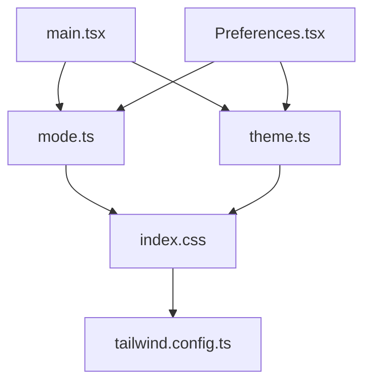

# 主题状态管理

<cite>
**本文引用的文件**
- [web/src/store/theme.ts](file://web/src/store/theme.ts)
- [web/src/store/mode.ts](file://web/src/store/mode.ts)
- [web/src/styles/index.css](file://web/src/styles/index.css)
- [web/tailwind.config.ts](file://web/tailwind.config.ts)
- [web/src/main.tsx](file://web/src/main.tsx)
- [web/src/pages/settings/Preferences.tsx](file://web/src/pages/settings/Preferences.tsx)
</cite>

## 目录
1. [简介](#简介)
2. [项目结构](#项目结构)
3. [核心组件](#核心组件)
4. [架构总览](#架构总览)
5. [详细组件分析](#详细组件分析)
6. [依赖关系分析](#依赖关系分析)
7. [性能考量](#性能考量)
8. [故障排查指南](#故障排查指南)
9. [结论](#结论)
10. [附录](#附录)

## 简介
本技术文档围绕前端主题状态管理展开，覆盖明暗主题切换、自定义强调色（Accent）支持、动态样式更新机制、主题持久化策略以及 CSS-in-JS 集成与性能优化。该实现基于 React + Tailwind CSS + Zustand，通过 CSS 自定义属性（CSS Variables）驱动全局主题变量，结合 DOM 类名与 data 属性控制明暗模式，使用本地存储同步用户偏好，确保首屏无闪烁并具备可访问性与可扩展性。

## 项目结构
主题系统由以下关键部分组成：
- 主题模式管理：负责系统/浅色/深色三种模式的解析、应用与监听
- 强调色管理：提供品牌预设强调色选择，写入 CSS 变量以全局生效
- 样式层：定义语义化设计令牌（颜色、边框、背景等），并通过 Tailwind 扩展暴露为工具类
- 启动阶段：在 React 渲染前应用主题与强调色，避免首屏闪烁
- 设置页：用户交互入口，用于切换主题模式与强调色，并提供实时预览

图表来源
- [web/src/main.tsx:10-14](file://web/src/main.tsx#L10-L14)
- [web/src/store/mode.ts:57-69](file://web/src/store/mode.ts#L57-L69)
- [web/src/store/theme.ts:88-97](file://web/src/store/theme.ts#L88-L97)
- [web/src/styles/index.css:9-54](file://web/src/styles/index.css#L9-L54)
- [web/tailwind.config.ts:12-27](file://web/tailwind.config.ts#L12-L27)

章节来源
- [web/src/main.tsx:10-14](file://web/src/main.tsx#L10-L14)
- [web/src/store/mode.ts:1-97](file://web/src/store/mode.ts#L1-L97)
- [web/src/store/theme.ts:1-97](file://web/src/store/theme.ts#L1-L97)
- [web/src/styles/index.css:1-684](file://web/src/styles/index.css#L1-L684)
- [web/tailwind.config.ts:1-43](file://web/tailwind.config.ts#L1-L43)
- [web/src/pages/settings/Preferences.tsx:1-176](file://web/src/pages/settings/Preferences.tsx#L1-L176)

## 核心组件
- 主题模式（mode.ts）
  - 提供 system/light/dark 三档偏好，解析为最终 light/dark
  - 通过 documentElement 的 data-theme、class（dark/light）、colorScheme 控制主题
  - 监听系统主题变化，保持“跟随系统”时实时更新
  - 提供 useThemeMode Hook 供组件订阅与切换
- 强调色（theme.ts）
  - 维护一组品牌强调色预设，包含 id、label、rgb、hex
  - 将选中强调色的 RGB 写入 --accent CSS 变量，Tailwind 通过 colors 扩展读取
  - 使用 Zustand persist 中间件持久化到 localStorage
  - 提供 applyAccentOnBoot 在首屏前应用强调色，避免闪烁
- 样式层（index.css + tailwind.config.ts）
  - 定义 :root.dark 与 :root.light 下的语义令牌（--bg, --card, --text, --accent 等）
  - Tailwind 配置中将这些令牌映射为 bg/text/border/accent 等工具类
  - 大量针对 light 模式的 zinc 工具类重映射，保证迁移期一致性
- 启动流程（main.tsx）
  - 在创建根节点之前调用 applyThemeOnBoot 与 applyAccentOnBoot，确保首屏正确
- 设置页（Preferences.tsx）
  - 展示主题模式选项与强调色选项，提供即时预览区域

章节来源
- [web/src/store/mode.ts:1-97](file://web/src/store/mode.ts#L1-L97)
- [web/src/store/theme.ts:1-97](file://web/src/store/theme.ts#L1-L97)
- [web/src/styles/index.css:1-684](file://web/src/styles/index.css#L1-L684)
- [web/tailwind.config.ts:1-43](file://web/tailwind.config.ts#L1-L43)
- [web/src/main.tsx:10-14](file://web/src/main.tsx#L10-L14)
- [web/src/pages/settings/Preferences.tsx:1-176](file://web/src/pages/settings/Preferences.tsx#L1-L176)

## 架构总览
主题系统采用“状态 → DOM 变量/类名 → CSS 令牌 → Tailwind 工具类”的分层架构：
- 状态层：Zustand store（强调色）与本地函数式 API（主题模式）
- DOM 层：documentElement 的 data-theme、class、style.setProperty('--accent')
- 样式层：CSS 自定义属性作为语义令牌，Tailwind 扩展将其暴露为实用类
- 渲染层：React 组件通过 Tailwind 工具类消费令牌，无需重新渲染即可响应变量变更

图表来源
- [web/src/main.tsx:10-14](file://web/src/main.tsx#L10-L14)
- [web/src/store/mode.ts:22-69](file://web/src/store/mode.ts#L22-L69)
- [web/src/store/theme.ts:77-97](file://web/src/store/theme.ts#L77-L97)
- [web/src/styles/index.css:9-54](file://web/src/styles/index.css#L9-L54)
- [web/tailwind.config.ts:12-27](file://web/tailwind.config.ts#L12-L27)
- [web/src/pages/settings/Preferences.tsx:13-18](file://web/src/pages/settings/Preferences.tsx#L13-L18)

## 详细组件分析

### 主题模式（mode.ts）
- 数据结构
  - ThemePreference: 'system' | 'light' | 'dark'
  - ResolvedTheme: 'light' | 'dark'
- 关键函数
  - getThemePreference(): 从 localStorage 读取偏好，非法值回退为 system
  - resolveTheme(pref): 若为 system 则依据 matchMedia 解析为 light/dark
  - applyResolvedTheme(theme): 设置 data-theme、class（dark/light）、colorScheme
  - setThemePreference(pref): 持久化偏好、应用主题、派发事件通知订阅者
  - applyThemeOnBoot(): 启动时立即应用主题，并监听系统主题变化
  - useThemeMode(): React Hook，返回 preference/resolved/setPreference/cycle
- 复杂度
  - 时间复杂度 O(1)，空间复杂度 O(1)
- 错误处理
  - 环境检测（localStorage/window/document 是否存在）
  - 非法偏好值回退默认
- 性能
  - 仅一次 DOM 写入；matchMedia 监听仅在 system 模式下生效

图表来源
- [web/src/store/mode.ts:48-52](file://web/src/store/mode.ts#L48-L52)
- [web/src/store/mode.ts:29-46](file://web/src/store/mode.ts#L29-L46)

章节来源
- [web/src/store/mode.ts:1-97](file://web/src/store/mode.ts#L1-L97)

### 强调色（theme.ts）
- 数据结构
  - AccentPreset: { id, label, rgb, hex }
  - ACCENT_PRESETS: 预置强调色列表，label 支持 i18n
- 关键函数
  - applyAccent(id): 查找预设并将 RGB 写入 --accent CSS 变量
  - applyAccentOnBoot(): 启动时直接读取 localStorage 中的 accentId 并应用
  - useTheme: Zustand store，持久化 accentId，提供 setAccent
- 复杂度
  - 查找预设 O(n)（n 为预设数量，通常很小）
- 错误处理
  - 服务端环境跳过 DOM 操作
  - 无效 id 或损坏的 localStorage 数据静默回退
- 性能
  - 仅修改一个 CSS 变量，触发浏览器级样式更新，无组件重渲染

图表来源
- [web/src/store/theme.ts:57-71](file://web/src/store/theme.ts#L57-L71)
- [web/src/store/theme.ts:77-82](file://web/src/store/theme.ts#L77-L82)

章节来源
- [web/src/store/theme.ts:1-97](file://web/src/store/theme.ts#L1-L97)

### 样式层（index.css + tailwind.config.ts）
- 语义令牌
  - :root.dark 与 :root.light 下定义 --bg, --card, --border, --text, --accent 等
- Tailwind 扩展
  - 将语义令牌映射为 bg/text/border/accent 等工具类，支持透明度组合
- Light 模式重映射
  - 对大量硬编码的 zinc-* 工具类进行覆盖，确保浅色模式下可读性与对比度
- 打印样式
  - 报告导出时强制浅色背景与深墨文本，保留强调色

图表来源
- [web/src/styles/index.css:9-54](file://web/src/styles/index.css#L9-L54)
- [web/tailwind.config.ts:12-27](file://web/tailwind.config.ts#L12-L27)

章节来源
- [web/src/styles/index.css:1-684](file://web/src/styles/index.css#L1-L684)
- [web/tailwind.config.ts:1-43](file://web/tailwind.config.ts#L1-L43)

### 启动流程（main.tsx）
- 在 React 渲染前调用 applyThemeOnBoot 与 applyAccentOnBoot
- 设置 documentElement.lang 为当前语言
- 确保首屏无主题/强调色闪烁

章节来源
- [web/src/main.tsx:10-14](file://web/src/main.tsx#L10-L14)

### 设置页（Preferences.tsx）
- 主题模式切换：system/light/dark 按钮，点击后调用 setPreference
- 强调色选择：展示预设色块，点击后调用 setAccent
- 预览区：使用 bg-accent/text-accent/ring-accent 等工具类实时预览强调色效果

章节来源
- [web/src/pages/settings/Preferences.tsx:13-18](file://web/src/pages/settings/Preferences.tsx#L13-L18)
- [web/src/pages/settings/Preferences.tsx:55-95](file://web/src/pages/settings/Preferences.tsx#L55-L95)
- [web/src/pages/settings/Preferences.tsx:97-156](file://web/src/pages/settings/Preferences.tsx#L97-L156)

## 依赖关系分析
- 模块耦合
  - main.tsx 依赖 mode.ts 与 theme.ts 的启动函数
  - Preferences.tsx 依赖 useThemeMode 与 useTheme
  - 样式层通过 CSS 变量与 Tailwind 扩展解耦逻辑与表现
- 外部依赖
  - Zustand + persist 中间件用于强调色状态持久化
  - matchMedia 用于系统主题监听
  - localStorage 用于持久化主题偏好与强调色
- 潜在循环依赖
  - 无直接循环导入；启动顺序明确，先应用主题再渲染 React

图表来源
- [web/src/main.tsx:10-14](file://web/src/main.tsx#L10-L14)
- [web/src/store/mode.ts:1-97](file://web/src/store/mode.ts#L1-L97)
- [web/src/store/theme.ts:1-97](file://web/src/store/theme.ts#L1-L97)
- [web/src/styles/index.css:1-684](file://web/src/styles/index.css#L1-L684)
- [web/tailwind.config.ts:1-43](file://web/tailwind.config.ts#L1-L43)
- [web/src/pages/settings/Preferences.tsx:1-176](file://web/src/pages/settings/Preferences.tsx#L1-L176)

章节来源
- [web/src/main.tsx:10-14](file://web/src/main.tsx#L10-L14)
- [web/src/store/mode.ts:1-97](file://web/src/store/mode.ts#L1-L97)
- [web/src/store/theme.ts:1-97](file://web/src/store/theme.ts#L1-L97)
- [web/src/styles/index.css:1-684](file://web/src/styles/index.css#L1-L684)
- [web/tailwind.config.ts:1-43](file://web/tailwind.config.ts#L1-L43)
- [web/src/pages/settings/Preferences.tsx:1-176](file://web/src/pages/settings/Preferences.tsx#L1-L176)

## 性能考量
- 首屏无闪烁
  - 在 React 渲染前应用主题与强调色，避免一次性重绘
- 最小 DOM 写入
  - 主题切换仅修改少量属性与类名；强调色仅写入一个 CSS 变量
- 无组件重渲染
  - 通过 CSS 变量驱动样式，组件无需因主题变化而重新渲染
- 事件监听开销低
  - matchMedia 监听仅在 system 模式下启用，且仅触发必要更新
- 建议
  - 新增语义令牌时优先使用 CSS 变量，避免硬编码颜色
  - 谨慎添加过多 light 模式重映射规则，逐步迁移至语义令牌
  - 对高频交互的预览区域，尽量复用同一容器以减少布局抖动

## 故障排查指南
- 主题未生效
  - 检查 main.tsx 是否调用了 applyThemeOnBoot 与 applyAccentOnBoot
  - 确认 documentElement 上存在 data-theme 与正确的 class
- 强调色不更新
  - 检查 applyAccent 是否被调用，--accent 变量是否正确写入
  - 确认 Tailwind 配置中 accent 已映射到 --accent
- 浅色模式显示异常
  - 检查 index.css 中 html.light 的重映射规则是否覆盖了相关组件
  - 验证组件使用的 Tailwind 工具类是否在重映射范围内
- 系统主题切换不同步
  - 确认 useThemeMode 是否正确监听 ongrid-theme-change 事件
  - 检查 matchMedia 监听是否注册成功

章节来源
- [web/src/main.tsx:10-14](file://web/src/main.tsx#L10-L14)
- [web/src/store/mode.ts:22-69](file://web/src/store/mode.ts#L22-L69)
- [web/src/store/theme.ts:77-97](file://web/src/store/theme.ts#L77-L97)
- [web/src/styles/index.css:9-54](file://web/src/styles/index.css#L9-L54)
- [web/tailwind.config.ts:12-27](file://web/tailwind.config.ts#L12-L27)

## 结论
该主题状态管理系统通过清晰的分层设计与极小的 DOM 写入，实现了高性能、可维护的主题切换与强调色定制。借助 CSS 变量与 Tailwind 扩展，主题令牌与组件样式解耦，便于后续扩展更多主题与品牌色。启动阶段的提前应用确保了用户体验的一致性，而本地存储与事件机制保证了状态的持久化与跨组件同步。

## 附录

### 主题状态的数据结构
- 主题模式
  - 偏好：system/light/dark
  - 解析结果：light/dark
- 强调色
  - 预设：id、label、rgb、hex
  - 当前选中：accentId（持久化）
- 语义令牌（CSS 变量）
  - 背景：--bg, --card, --card-soft
  - 文本：--text, --text-muted, --text-faint
  - 强调：--accent, --accent-fg
  - 状态：--info, --warn, --ok, --danger
  - 边框：--border, --border-soft

章节来源
- [web/src/store/mode.ts:16-17](file://web/src/store/mode.ts#L16-L17)
- [web/src/store/theme.ts:26-48](file://web/src/store/theme.ts#L26-L48)
- [web/src/styles/index.css:9-54](file://web/src/styles/index.css#L9-L54)

### 主题持久化策略
- 主题偏好
  - 键名：ongrid-theme-preference
  - 存储：localStorage
  - 同步：setThemePreference 写入并派发事件
- 强调色
  - 键名：ongrid.theme（Zustand persist 命名空间）
  - 存储：localStorage
  - 同步：useTheme.setAccent 写入并应用

章节来源
- [web/src/store/mode.ts:19-52](file://web/src/store/mode.ts#L19-L52)
- [web/src/store/theme.ts:57-71](file://web/src/store/theme.ts#L57-L71)

### 具体代码示例路径
- 主题切换
  - 设置页主题按钮点击：[web/src/pages/settings/Preferences.tsx:67-95](file://web/src/pages/settings/Preferences.tsx#L67-L95)
  - 切换逻辑：[web/src/store/mode.ts:48-52](file://web/src/store/mode.ts#L48-L52)
- 预览功能
  - 强调色预览区域：[web/src/pages/settings/Preferences.tsx:136-156](file://web/src/pages/settings/Preferences.tsx#L136-L156)
  - 强调色应用：[web/src/store/theme.ts:77-82](file://web/src/store/theme.ts#L77-L82)
- 批量更新
  - 可通过遍历预设列表调用 setAccent 实现批量应用（参考预设数组定义位置）：[web/src/store/theme.ts:35-48](file://web/src/store/theme.ts#L35-L48)

### CSS-in-JS 集成方案
- 本项目未使用传统 CSS-in-JS 库，而是采用 CSS 变量 + Tailwind 扩展的方式，达到类似效果：
  - 变量注入：通过 style.setProperty('--accent', rgb) 动态更新
  - 工具类消费：Tailwind colors 扩展将变量映射为 bg-accent/text-accent 等类
- 优势
  - 零运行时 JS 样式计算，性能更优
  - 易于维护与扩展，新增令牌只需在 CSS 与 Tailwind 配置中声明

章节来源
- [web/src/store/theme.ts:77-82](file://web/src/store/theme.ts#L77-L82)
- [web/tailwind.config.ts:12-27](file://web/tailwind.config.ts#L12-L27)

### 性能优化技巧
- 启动阶段提前应用主题与强调色，避免闪烁
- 使用 CSS 变量减少组件重渲染
- 仅在必要时监听系统主题变化
- 渐进迁移至语义令牌，减少 light 模式重映射规则