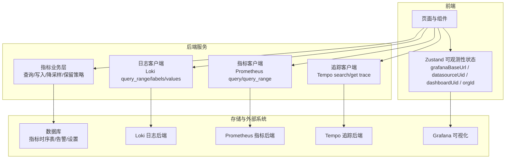
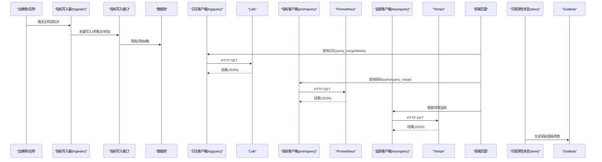
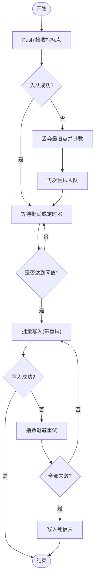
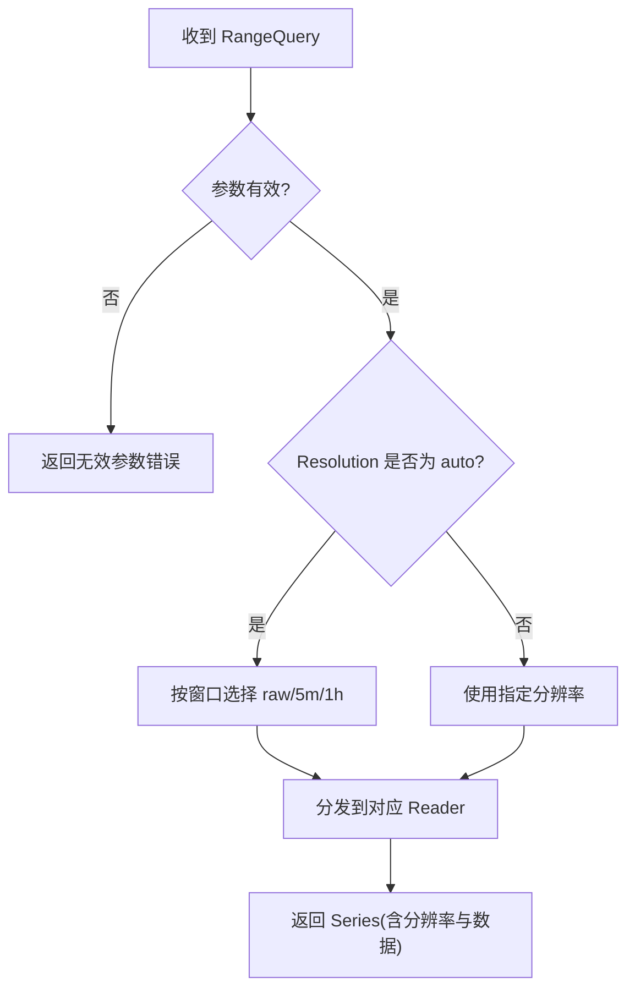
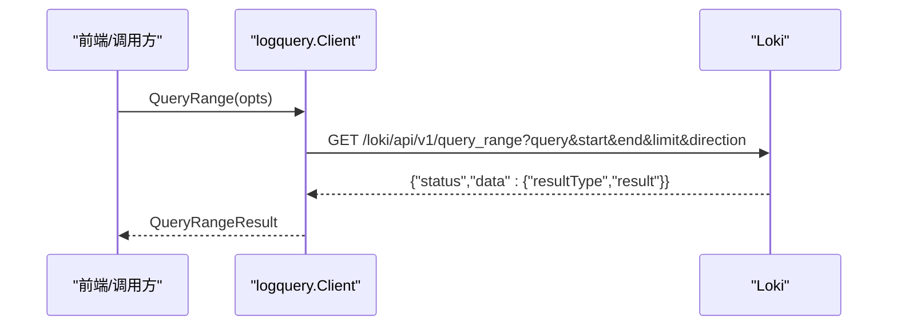
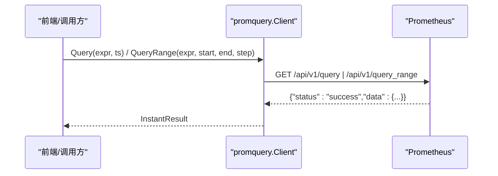
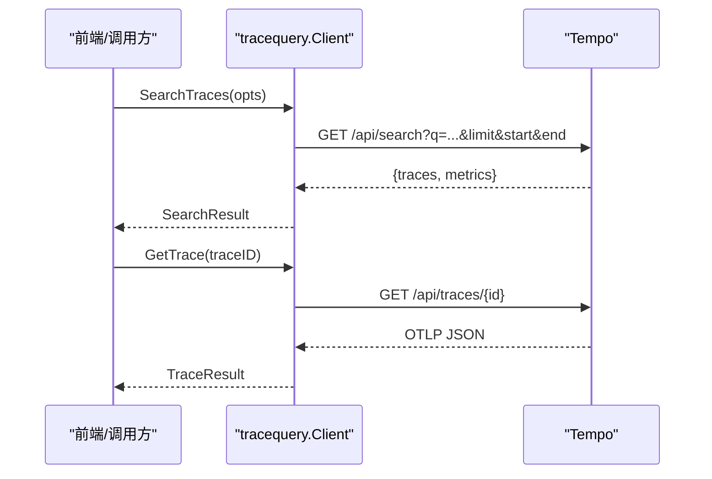
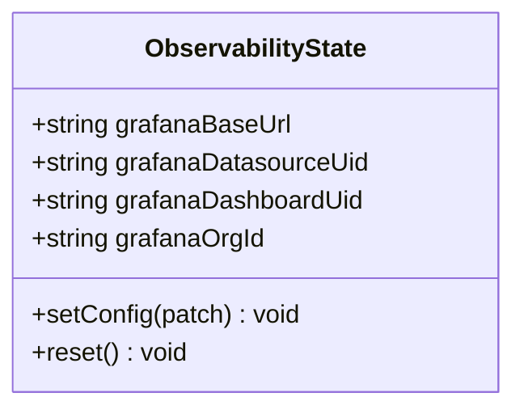
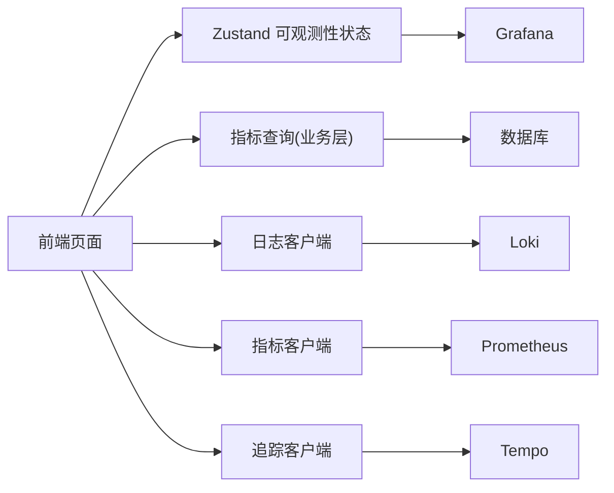

# 可观测性状态管理

<cite>
**本文引用的文件**
- [internal/pkg/logquery/client.go](file://internal/pkg/logquery/client.go)
- [internal/pkg/promquery/client.go](file://internal/pkg/promquery/client.go)
- [internal/pkg/tracequery/client.go](file://internal/pkg/tracequery/client.go)
- [internal/manager/biz/metric/query.go](file://internal/manager/biz/metric/query.go)
- [internal/manager/biz/metric/ingester.go](file://internal/manager/biz/metric/ingester.go)
- [web/src/store/observability.ts](file://web/src/store/observability.ts)
</cite>

## 目录
1. [简介](#简介)
2. [项目结构](#项目结构)
3. [核心组件](#核心组件)
4. [架构总览](#架构总览)
5. [详细组件分析](#详细组件分析)
6. [依赖关系分析](#依赖关系分析)
7. [性能考虑](#性能考虑)
8. [故障排查指南](#故障排查指南)
9. [结论](#结论)
10. [附录](#附录)

## 简介
本技术文档围绕“可观测性状态管理”展开，聚焦监控指标、日志与追踪三大信号在收集、存储与展示上的统一机制。内容涵盖：
- 数据模型：时间序列（指标）、日志事件、追踪链路以及告警与系统健康信息的状态建模
- 实时数据更新策略：WebSocket 连接管理、数据缓存与增量更新
- 订阅与异常处理：如何订阅数据流、处理错误并优化查询性能
- 可视化集成与性能监控：与 Grafana 等可视化工具的对接及系统自身可观测性

## 项目结构
仓库采用前后端分离与分层设计：
- 后端（Go）提供三套可观测性客户端封装：Prometheus（指标）、Loki（日志）、Tempo（追踪），并通过业务层对指标进行入库、聚合与查询；前端通过 API 获取数据并结合本地状态进行渲染
- 前端（React + TypeScript）使用 Zustand 维护可观测性相关配置（如 Grafana 根地址、数据源 UID、仪表盘 UID、组织 ID），用于构建深链跳转与面板参数

图表来源
- [internal/pkg/logquery/client.go:1-280](file://internal/pkg/logquery/client.go#L1-L280)
- [internal/pkg/promquery/client.go:1-168](file://internal/pkg/promquery/client.go#L1-L168)
- [internal/pkg/tracequery/client.go:1-253](file://internal/pkg/tracequery/client.go#L1-L253)
- [internal/manager/biz/metric/query.go:1-133](file://internal/manager/biz/metric/query.go#L1-L133)
- [internal/manager/biz/metric/ingester.go:1-262](file://internal/manager/biz/metric/ingester.go#L1-L262)
- [web/src/store/observability.ts:1-43](file://web/src/store/observability.ts#L1-L43)

章节来源
- [internal/pkg/logquery/client.go:1-280](file://internal/pkg/logquery/client.go#L1-L280)
- [internal/pkg/promquery/client.go:1-168](file://internal/pkg/promquery/client.go#L1-L168)
- [internal/pkg/tracequery/client.go:1-253](file://internal/pkg/tracequery/client.go#L1-L253)
- [internal/manager/biz/metric/query.go:1-133](file://internal/manager/biz/metric/query.go#L1-L133)
- [internal/manager/biz/metric/ingester.go:1-262](file://internal/manager/biz/metric/ingester.go#L1-L262)
- [web/src/store/observability.ts:1-43](file://web/src/store/observability.ts#L1-L43)

## 核心组件
- 指标采集与写入（Ingester）
  - 批量缓冲、定时刷新、退避重试、死信队列
  - 暴露内部指标以监控吞吐与失败原因
- 指标查询（QueryUsecase）
  - 自动分辨率选择（原始/5分钟/1小时）
  - 窗口大小校验与边界保护
- 日志查询（logquery.Client）
  - 基于 Loki 的 query_range、label names/values
  - 单租户隔离头注入与响应体大小限制
- 指标查询（promquery.Client）
  - 即时与范围查询，统一超时与错误包装
- 追踪查询（tracequery.Client）
  - 搜索与详情获取，兼容不同版本返回形态
- 前端可观测性状态（Zustand store）
  - 持久化 Grafana 相关配置，支撑深链与面板参数

章节来源
- [internal/manager/biz/metric/ingester.go:15-262](file://internal/manager/biz/metric/ingester.go#L15-L262)
- [internal/manager/biz/metric/query.go:14-133](file://internal/manager/biz/metric/query.go#L14-L133)
- [internal/pkg/logquery/client.go:29-280](file://internal/pkg/logquery/client.go#L29-L280)
- [internal/pkg/promquery/client.go:17-168](file://internal/pkg/promquery/client.go#L17-L168)
- [internal/pkg/tracequery/client.go:16-253](file://internal/pkg/tracequery/client.go#L16-L253)
- [web/src/store/observability.ts:14-43](file://web/src/store/observability.ts#L14-L43)

## 架构总览
下图展示了从采集到查询、再到可视化的端到端流程，覆盖指标、日志、追踪三种信号。

图表来源
- [internal/manager/biz/metric/ingester.go:120-247](file://internal/manager/biz/metric/ingester.go#L120-L247)
- [internal/pkg/logquery/client.go:120-280](file://internal/pkg/logquery/client.go#L120-L280)
- [internal/pkg/promquery/client.go:93-168](file://internal/pkg/promquery/client.go#L93-L168)
- [internal/pkg/tracequery/client.go:111-253](file://internal/pkg/tracequery/client.go#L111-L253)
- [web/src/store/observability.ts:14-43](file://web/src/store/observability.ts#L14-L43)

## 详细组件分析

### 指标写入与缓冲（Ingester）
- 设计要点
  - 非阻塞 Push：入队失败时丢弃最旧点，避免背压传播
  - 批处理与定时刷新：达到批次大小或定时器触发即刷新
  - 指数退避重试：失败后多次尝试，最终进入死信表
  - 可观测性：注册 Prometheus 计数器/直方图，统计写入成功/失败、丢弃原因、批次大小分布
- 复杂度
  - 入队均摊 O(1)，刷新为 O(N)（N 为批次大小）
- 错误处理
  - 分类错误标签，控制维度爆炸
  - 死信记录便于事后审计与重放

图表来源
- [internal/manager/biz/metric/ingester.go:120-247](file://internal/manager/biz/metric/ingester.go#L120-L247)

章节来源
- [internal/manager/biz/metric/ingester.go:15-262](file://internal/manager/biz/metric/ingester.go#L15-L262)

### 指标查询与自动分辨率（QueryUsecase）
- 设计要点
  - 输入 RangeQuery：包含 EdgeID、From、To、Resolution
  - 自动分辨率：根据窗口长度选择 raw/5m/1h，减少大窗口查询成本
  - 边界校验：禁止空 EdgeID、From>=To、窗口超过上限
- 复杂度
  - 解析与路由 O(1)，实际 IO 由 Reader 实现决定
- 扩展点
  - 可通过 Reader 抽象替换底层存储（如 TSDB/列存）

图表来源
- [internal/manager/biz/metric/query.go:70-133](file://internal/manager/biz/metric/query.go#L70-L133)

章节来源
- [internal/manager/biz/metric/query.go:14-133](file://internal/manager/biz/metric/query.go#L14-L133)

### 日志查询客户端（logquery.Client）
- 能力
  - query_range：支持 LogQL、时间窗、方向、步长（聚合场景）
  - label names/values：用于前端动态筛选
- 健壮性
  - 单次请求默认超时 30s
  - 响应体限制 8MiB，防止内存膨胀
  - 单租户隔离：读取时注入 X-Scope-OrgID
- 错误处理
  - 非 200 状态码记录警告并返回错误
  - 解码失败或 status!=success 时返回结构化错误

图表来源
- [internal/pkg/logquery/client.go:120-171](file://internal/pkg/logquery/client.go#L120-L171)
- [internal/pkg/logquery/client.go:232-280](file://internal/pkg/logquery/client.go#L232-L280)

章节来源
- [internal/pkg/logquery/client.go:29-280](file://internal/pkg/logquery/client.go#L29-L280)

### 指标查询客户端（promquery.Client）
- 能力
  - 即时查询与范围查询，统一超时与错误包装
  - 返回原始 JSON 片段，便于上层灵活处理矩阵/向量/标量
- 健壮性
  - 单次请求默认超时 30s
  - 响应体限制 8MiB
  - 区分 400（查询语法错误）与其他服务端错误
- 错误处理
  - 非 success 状态返回结构化错误，包含 errorType 与 error

图表来源
- [internal/pkg/promquery/client.go:93-168](file://internal/pkg/promquery/client.go#L93-L168)

章节来源
- [internal/pkg/promquery/client.go:17-168](file://internal/pkg/promquery/client.go#L17-L168)

### 追踪查询客户端（tracequery.Client）
- 能力
  - 搜索：支持 TraceQL 表达式或标签匹配，限制数量与时间窗
  - 详情：按 traceID 获取完整 OTLP 形状 JSON
  - 标签值枚举：用于前端下拉框
- 健壮性
  - 单次请求默认超时 30s
  - 响应体限制 16MiB（追踪可能较大）
  - 兼容不同版本的返回格式
- 错误处理
  - NotFound 单独处理，其他非 200 记录警告并返回错误

图表来源
- [internal/pkg/tracequery/client.go:111-201](file://internal/pkg/tracequery/client.go#L111-L201)
- [internal/pkg/tracequery/client.go:203-253](file://internal/pkg/tracequery/client.go#L203-L253)

章节来源
- [internal/pkg/tracequery/client.go:16-253](file://internal/pkg/tracequery/client.go#L16-L253)

### 前端可观测性状态（Zustand Store）
- 职责
  - 持久化 Grafana 根地址、数据源 UID、仪表盘 UID、组织 ID
  - 提供 setConfig/reset 方法，供页面初始化或用户设置更新
- 用途
  - 构建“在 Grafana 中打开”的深链 URL
  - 作为面板参数传递，实现跨页面/跨会话的一致性
- 存储
  - 使用 localStorage 持久化，键名固定，便于调试与迁移

图表来源
- [web/src/store/observability.ts:14-43](file://web/src/store/observability.ts#L14-L43)

章节来源
- [web/src/store/observability.ts:14-43](file://web/src/store/observability.ts#L14-L43)

## 依赖关系分析
- 客户端层解耦
  - logquery/promquery/tracequery 各自独立，仅依赖 HTTP 与 JSON 编解码
  - BaseURLResolver 抽象使运行时切换后端地址成为可能
- 业务层与存储
  - metric 业务层通过 Reader/Writer 抽象屏蔽底层存储差异
  - Ingester 将高吞吐写入与重试/死信逻辑封装，降低调用方复杂度
- 前端与可视化
  - 前端通过 store 管理 Grafana 配置，结合页面上下文生成深链

图表来源
- [internal/manager/biz/metric/query.go:56-133](file://internal/manager/biz/metric/query.go#L56-L133)
- [internal/pkg/logquery/client.go:46-100](file://internal/pkg/logquery/client.go#L46-L100)
- [internal/pkg/promquery/client.go:27-82](file://internal/pkg/promquery/client.go#L27-L82)
- [internal/pkg/tracequery/client.go:32-87](file://internal/pkg/tracequery/client.go#L32-L87)
- [web/src/store/observability.ts:14-43](file://web/src/store/observability.ts#L14-L43)

章节来源
- [internal/manager/biz/metric/query.go:56-133](file://internal/manager/biz/metric/query.go#L56-L133)
- [internal/pkg/logquery/client.go:46-100](file://internal/pkg/logquery/client.go#L46-L100)
- [internal/pkg/promquery/client.go:27-82](file://internal/pkg/promquery/client.go#L27-L82)
- [internal/pkg/tracequery/client.go:32-87](file://internal/pkg/tracequery/client.go#L32-L87)
- [web/src/store/observability.ts:14-43](file://web/src/store/observability.ts#L14-L43)

## 性能考虑
- 超时与限流
  - 三个客户端均设置 30s 默认超时，避免长时间占用资源
  - 响应体限制（8MiB/16MiB）防止内存溢出
- 写入优化
  - 批量写入与定时刷新降低 IO 次数
  - 指数退避重试提升稳定性，死信兜底保障不丢数据
- 查询优化
  - 自动分辨率选择减少大窗口查询成本
  - 日志/追踪查询限制 limit 与时间窗，避免全量扫描
- 前端优化建议
  - 使用防抖/节流合并频繁查询
  - 分页加载日志与追踪列表
  - 利用 store 中的 Grafana 配置直接跳转，减少前端计算开销

[本节为通用指导，无需特定文件引用]

## 故障排查指南
- 指标写入失败
  - 观察 ingester 的 Prometheus 指标：ongrid_ingest_writes_total、ongrid_ingest_flush_failures_total、ongrid_ingest_dropped_total、ongrid_ingest_batch_size
  - 检查死信表记录，定位具体错误原因
  - 参考路径：[ingester flush 与指标注册:120-247](file://internal/manager/biz/metric/ingester.go#L120-L247)
- 日志查询异常
  - 确认 query_range 参数合法（时间窗、limit、方向）
  - 检查 Loki 可达性与 X-Scope-OrgID 是否正确
  - 参考路径：[logquery do 与错误处理:232-280](file://internal/pkg/logquery/client.go#L232-L280)
- 指标查询异常
  - 关注 400 错误（PromQL 语法错误）与超时
  - 调整 step 与时间窗，必要时使用范围查询替代即时查询
  - 参考路径：[promquery do 与错误处理:119-168](file://internal/pkg/promquery/client.go#L119-L168)
- 追踪查询异常
  - 确认 traceID 存在且格式正确
  - 注意不同版本返回结构的兼容性
  - 参考路径：[tracequery get trace 与错误处理:187-253](file://internal/pkg/tracequery/client.go#L187-L253)
- 前端深链不可用
  - 检查 store 中 grafanaBaseUrl/datasourceUid/dashboardUid/orgId 是否已配置
  - 参考路径：[observability store 定义与默认值:14-43](file://web/src/store/observability.ts#L14-L43)

章节来源
- [internal/manager/biz/metric/ingester.go:120-247](file://internal/manager/biz/metric/ingester.go#L120-L247)
- [internal/pkg/logquery/client.go:232-280](file://internal/pkg/logquery/client.go#L232-L280)
- [internal/pkg/promquery/client.go:119-168](file://internal/pkg/promquery/client.go#L119-L168)
- [internal/pkg/tracequery/client.go:187-253](file://internal/pkg/tracequery/client.go#L187-L253)
- [web/src/store/observability.ts:14-43](file://web/src/store/observability.ts#L14-L43)

## 结论
本方案通过统一的客户端封装与业务层抽象，实现了指标、日志、追踪的可观测性统一管理。Ingester 提供高吞吐、可恢复的写入能力；QueryUsecase 提供智能的查询分辨率选择；前端 store 简化了与 Grafana 的集成。整体架构具备良好的可扩展性与可观测性，适合在生产环境中大规模部署与持续演进。

[本节为总结性内容，无需特定文件引用]

## 附录
- 数据模型速览
  - 指标：Point/Bucket5m/Bucket1h（由业务层 Reader 返回）
  - 日志：QueryRangeResult（resultType/result 原始 JSON）
  - 追踪：SearchResult/TraceResult（原始 JSON 透传）
- 实时数据更新策略建议
  - WebSocket 连接管理：建立心跳与断线重连，按资源粒度订阅
  - 数据缓存：按查询条件缓存最近结果，支持增量更新
  - 增量更新：基于游标或时间戳的增量拉取，减少重复传输
- 代码示例路径（不含具体代码）
  - 订阅数据流：参见 [ingester Push 入口:163-171](file://internal/manager/biz/metric/ingester.go#L163-L171)
  - 处理异常情况：参见 [logquery do 错误处理:232-280](file://internal/pkg/logquery/client.go#L232-L280)、[promquery do 错误处理:119-168](file://internal/pkg/promquery/client.go#L119-L168)、[tracequery do 错误处理:203-253](file://internal/pkg/tracequery/client.go#L203-L253)
  - 优化查询性能：参见 [QueryUsecase 自动分辨率:90-133](file://internal/manager/biz/metric/query.go#L90-L133)

[本节为补充说明，无需特定文件引用]