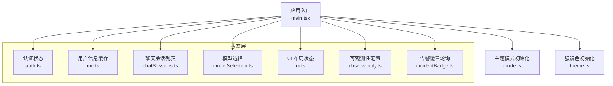
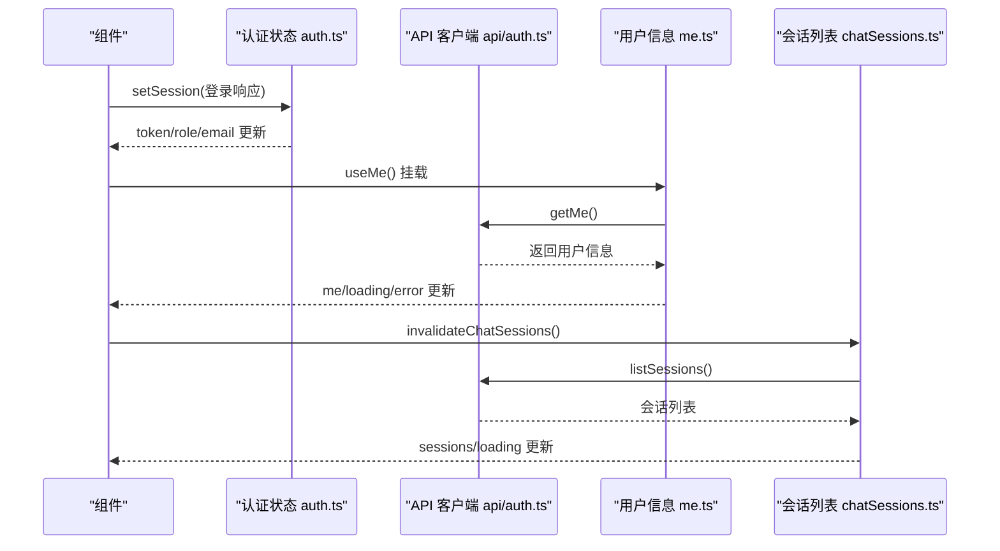
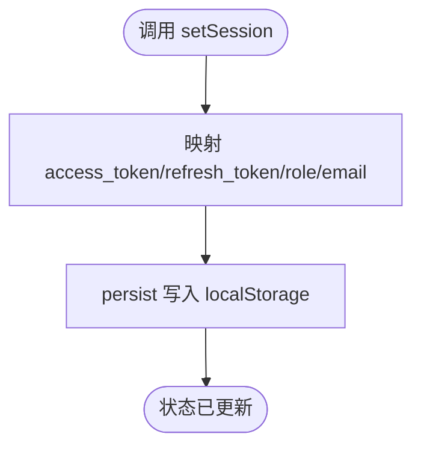
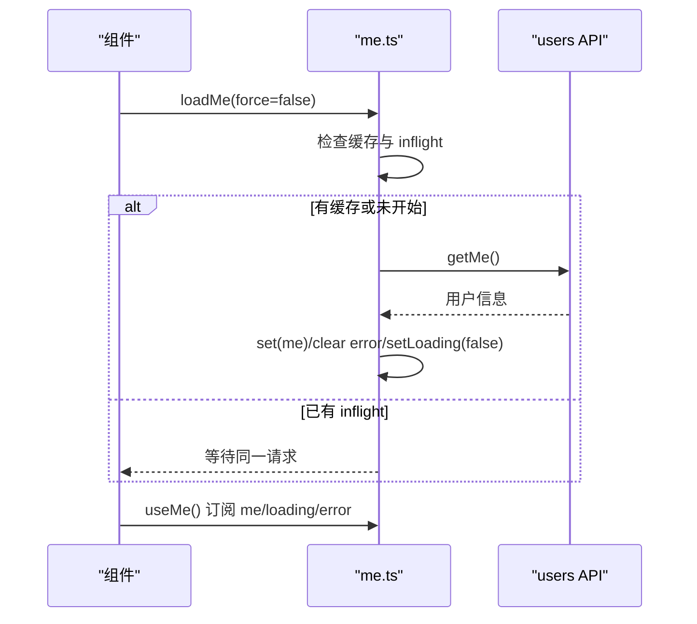
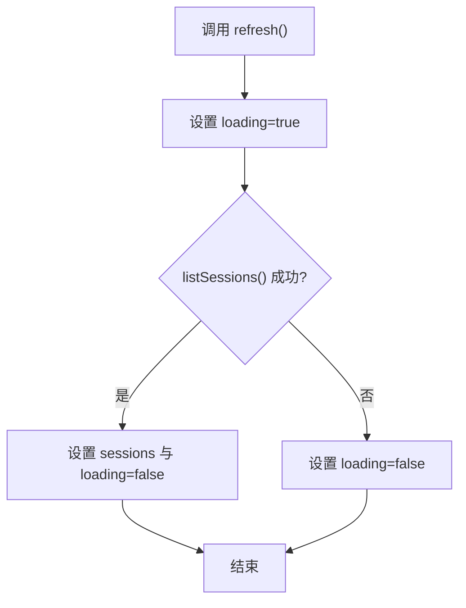
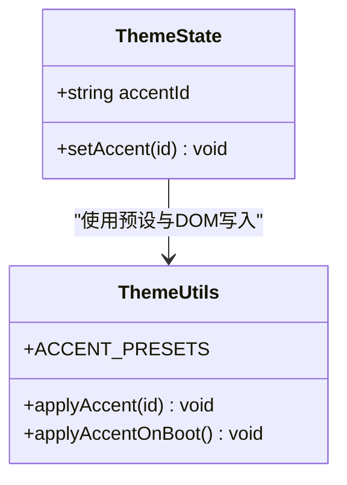
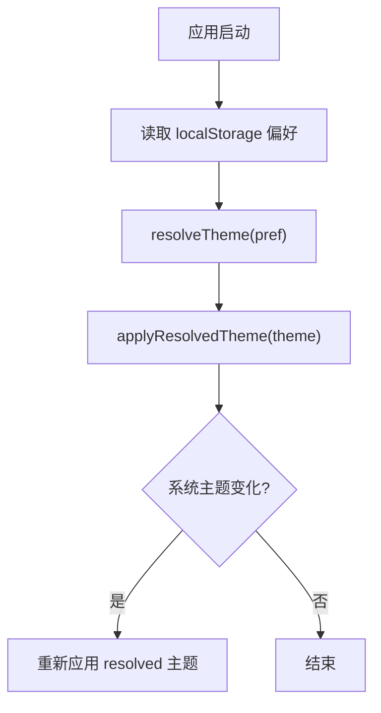
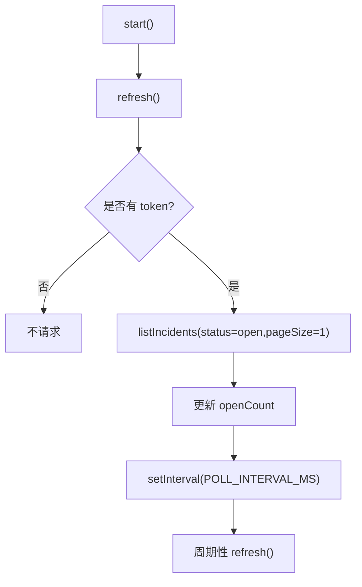
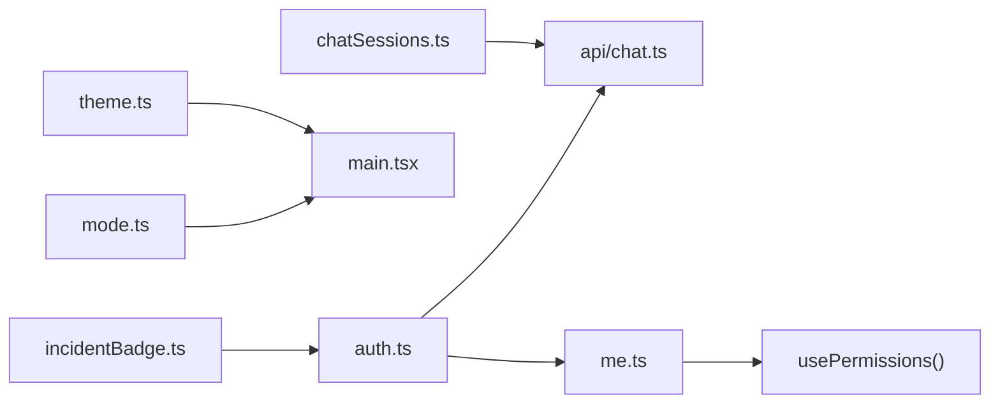

# 状态管理

<cite>
**本文引用的文件**
- [web/src/store/auth.ts](file://web/src/store/auth.ts)
- [web/src/store/chatSessions.ts](file://web/src/store/chatSessions.ts)
- [web/src/store/theme.ts](file://web/src/store/theme.ts)
- [web/src/store/observability.ts](file://web/src/store/observability.ts)
- [web/src/store/me.ts](file://web/src/store/me.ts)
- [web/src/store/mode.ts](file://web/src/store/mode.ts)
- [web/src/store/modelSelection.ts](file://web/src/store/modelSelection.ts)
- [web/src/store/ui.ts](file://web/src/store/ui.ts)
- [web/src/store/incidentBadge.ts](file://web/src/store/incidentBadge.ts)
- [web/src/api/auth.ts](file://web/src/api/auth.ts)
- [web/src/api/chat.ts](file://web/src/api/chat.ts)
- [web/src/main.tsx](file://web/src/main.tsx)
</cite>

## 目录
1. [简介](#简介)
2. [项目结构](#项目结构)
3. [核心组件](#核心组件)
4. [架构总览](#架构总览)
5. [详细组件分析](#详细组件分析)
6. [依赖关系分析](#依赖关系分析)
7. [性能考量](#性能考量)
8. [故障排查指南](#故障排查指南)
9. [结论](#结论)
10. [附录](#附录)

## 简介
本技术文档聚焦前端 Zustand 状态管理的整体设计与实现，覆盖 store 设计、状态更新机制、中间件集成（持久化）、各状态模块职责划分（认证、聊天会话、主题设置、可观测性配置等），以及异步状态处理（API 调用、错误与加载态）。同时给出本地存储同步与状态恢复策略、创建新状态模块的示例路径与最佳实践，并附带调试与性能分析建议。

## 项目结构
前端状态管理集中在 web/src/store 目录下，采用“按领域拆分”的 store 组织方式：每个业务域一个 store，通过 create 创建 store，并通过 zustand/middleware 的 persist 将关键状态持久化到 localStorage。应用启动时，在 main.tsx 中执行主题与强调色的首屏同步，避免闪烁。

图表来源
- [web/src/main.tsx:1-26](file://web/src/main.tsx#L1-L26)
- [web/src/store/mode.ts:1-98](file://web/src/store/mode.ts#L1-L98)
- [web/src/store/theme.ts:1-98](file://web/src/store/theme.ts#L1-L98)

章节来源
- [web/src/main.tsx:1-26](file://web/src/main.tsx#L1-L26)
- [web/src/store/mode.ts:1-98](file://web/src/store/mode.ts#L1-L98)
- [web/src/store/theme.ts:1-98](file://web/src/store/theme.ts#L1-L98)

## 核心组件
- 认证状态（auth）：维护 token、刷新令牌、角色与邮箱，支持设置会话与登出；使用 persist 持久化到 localStorage。
- 用户信息缓存（me）：内存级缓存当前用户信息，提供单飞请求去重、加载与错误状态，并在 token 变化时自动清理或拉取。
- 聊天会话列表（chatSessions）：维护侧边栏会话列表与加载态，提供刷新方法，供全局失效触发重新拉取。
- 模型选择（modelSelection）：持久化用户选择的模型（provider + model），跨页面共享。
- UI 布局（ui）：侧边栏折叠、命令面板、代理面板开关等；仅持久化结构性状态，避免持久化临时弹窗状态。
- 主题设置（theme）：强调色预设与 CSS 变量注入，持久化强调色选择。
- 主题模式（mode）：系统/亮/暗三档偏好，写入 DOM 属性与类名，监听系统主题变化。
- 可观测性（observability）：Grafana 相关配置（数据源 UID、仪表板 UID、组织 ID、根 URL），持久化用户级配置。
- 告警徽章（incidentBadge）：定时轮询未确认告警数量，结合认证状态控制轮询启停。

章节来源
- [web/src/store/auth.ts:1-50](file://web/src/store/auth.ts#L1-L50)
- [web/src/store/me.ts:1-114](file://web/src/store/me.ts#L1-L114)
- [web/src/store/chatSessions.ts:1-34](file://web/src/store/chatSessions.ts#L1-L34)
- [web/src/store/modelSelection.ts:1-32](file://web/src/store/modelSelection.ts#L1-L32)
- [web/src/store/ui.ts:1-39](file://web/src/store/ui.ts#L1-L39)
- [web/src/store/theme.ts:1-98](file://web/src/store/theme.ts#L1-L98)
- [web/src/store/mode.ts:1-98](file://web/src/store/mode.ts#L1-L98)
- [web/src/store/observability.ts:1-43](file://web/src/store/observability.ts#L1-L43)
- [web/src/store/incidentBadge.ts:1-59](file://web/src/store/incidentBadge.ts#L1-L59)

## 架构总览
Zustand 作为轻量状态库，配合 persist 中间件完成本地存储同步。各 store 暴露最小化的读写接口，组件通过 hook 订阅所需字段，减少不必要重渲染。异步操作封装在 store 方法或独立函数中，统一处理加载与错误状态。

图表来源
- [web/src/store/auth.ts:20-41](file://web/src/store/auth.ts#L20-L41)
- [web/src/api/auth.ts:19-29](file://web/src/api/auth.ts#L19-L29)
- [web/src/store/me.ts:37-66](file://web/src/store/me.ts#L37-L66)
- [web/src/store/chatSessions.ts:15-33](file://web/src/store/chatSessions.ts#L15-L33)

## 详细组件分析

### 认证状态（auth）
- 职责：维护访问令牌、刷新令牌、角色与邮箱；提供设置会话与登出方法。
- 持久化：使用 persist + createJSONStorage 将认证信息落盘，键名为 ongrid.auth。
- 更新机制：setSession 映射服务端响应到 store 字段；logout 清空所有敏感字段。
- 辅助：导出 getToken/getRefreshToken 以便 API 层读取。

图表来源
- [web/src/store/auth.ts:20-41](file://web/src/store/auth.ts#L20-L41)

章节来源
- [web/src/store/auth.ts:1-50](file://web/src/store/auth.ts#L1-L50)

### 用户信息缓存（me）
- 职责：缓存 /v1/me 结果，提供 loading/error/inflight 状态；token 变化时自动清理或拉取。
- 单飞请求：inflight 保证并发只发一次请求，避免重复网络开销。
- Hook 行为：useMe 在 token 存在且无缓存时自动拉取；提供 refresh 强制刷新。
- 权限派生：usePermissions 基于 me.role 与 auth.role 推导权限标志，避免首屏闪烁。

图表来源
- [web/src/store/me.ts:37-66](file://web/src/store/me.ts#L37-L66)
- [web/src/store/me.ts:68-92](file://web/src/store/me.ts#L68-L92)

章节来源
- [web/src/store/me.ts:1-114](file://web/src/store/me.ts#L1-L114)

### 聊天会话列表（chatSessions）
- 职责：维护侧边栏会话列表与加载态；提供 refresh 从服务器拉取最新列表。
- 失效机制：invalidateChatSessions 可从任意位置触发刷新，利用 React 批量更新避免多余重渲染。
- 错误处理：catch 分支确保 loading 复位，便于 UI 重试。

图表来源
- [web/src/store/chatSessions.ts:15-33](file://web/src/store/chatSessions.ts#L15-L33)

章节来源
- [web/src/store/chatSessions.ts:1-34](file://web/src/store/chatSessions.ts#L1-L34)

### 主题设置（theme）
- 职责：维护强调色预设与当前选中项；通过 CSS 变量 --accent 驱动全局配色。
- 持久化：persist 保存 accentId；启动时 applyAccentOnBoot 直接读取 localStorage 以避免首屏闪烁。
- 安全回退：applyAccent 对未知 id 进行防御，忽略无效值。

图表来源
- [web/src/store/theme.ts:22-98](file://web/src/store/theme.ts#L22-L98)

章节来源
- [web/src/store/theme.ts:1-98](file://web/src/store/theme.ts#L1-L98)

### 主题模式（mode）
- 职责：维护 system/light/dark 偏好，解析为 light/dark 并写入 DOM 属性与类名；监听系统主题变化。
- 启动同步：applyThemeOnBoot 在 React 挂载前应用主题，避免闪烁。
- 事件通知：通过自定义事件广播主题变化，供其他模块响应。

图表来源
- [web/src/store/mode.ts:22-69](file://web/src/store/mode.ts#L22-L69)

章节来源
- [web/src/store/mode.ts:1-98](file://web/src/store/mode.ts#L1-L98)

### 模型选择（modelSelection）
- 职责：持久化用户选择的模型（provider + model），跨页面共享。
- 默认行为：selected 为 null 时由调用方回退到服务端的默认模型，避免陈旧值影响。

章节来源
- [web/src/store/modelSelection.ts:1-32](file://web/src/store/modelSelection.ts#L1-L32)

### UI 布局（ui）
- 职责：侧边栏折叠、命令面板、代理面板开关等；仅持久化 sidebarCollapsed，避免持久化临时弹窗状态。
- 更新模式：toggle/set 方法保持简单原子更新。

章节来源
- [web/src/store/ui.ts:1-39](file://web/src/store/ui.ts#L1-L39)

### 可观测性（observability）
- 职责：维护 Grafana 根 URL、数据源 UID、仪表板 UID、组织 ID；支持部分更新与重置。
- 持久化：persist 保存用户级配置，便于跨会话复用。

章节来源
- [web/src/store/observability.ts:1-43](file://web/src/store/observability.ts#L1-L43)

### 告警徽章（incidentBadge）
- 职责：每 30 秒轮询未确认告警数量，用于侧边栏徽标提示。
- 生命周期：start/stop 管理定时器；refresh 根据认证状态决定是否请求。
- 容错：静默失败，避免干扰主流程；实际错误由具体页面展示。

图表来源
- [web/src/store/incidentBadge.ts:30-58](file://web/src/store/incidentBadge.ts#L30-L58)

章节来源
- [web/src/store/incidentBadge.ts:1-59](file://web/src/store/incidentBadge.ts#L1-L59)

## 依赖关系分析
- 认证与 API：auth 提供 getToken，被 chat API 用于 SSE 流式请求头；login/refresh 由 API 层调用后回填到 auth store。
- 用户信息与权限：me 依赖 auth 的 token 变化以决定拉取或清理；usePermissions 组合 me.role 与 auth.role 推导权限。
- 聊天与会话：chatSessions 依赖 chat API；streamMessage 使用 auth.getToken 注入鉴权头。
- 主题与启动：main.tsx 在渲染前调用 mode 与 theme 的启动函数，确保首屏一致。
- 可观测性与 UI：observability 与 ui 相对独立，主要服务于功能配置与布局。

图表来源
- [web/src/store/auth.ts:20-41](file://web/src/store/auth.ts#L20-L41)
- [web/src/api/chat.ts:253-266](file://web/src/api/chat.ts#L253-L266)
- [web/src/store/me.ts:68-92](file://web/src/store/me.ts#L68-L92)
- [web/src/store/mode.ts:54-69](file://web/src/store/mode.ts#L54-L69)
- [web/src/store/theme.ts:84-98](file://web/src/store/theme.ts#L84-L98)
- [web/src/store/chatSessions.ts:15-33](file://web/src/store/chatSessions.ts#L15-L33)
- [web/src/store/incidentBadge.ts:30-58](file://web/src/store/incidentBadge.ts#L30-L58)

章节来源
- [web/src/store/auth.ts:1-50](file://web/src/store/auth.ts#L1-L50)
- [web/src/api/chat.ts:253-266](file://web/src/api/chat.ts#L253-L266)
- [web/src/store/me.ts:68-92](file://web/src/store/me.ts#L68-L92)
- [web/src/store/mode.ts:54-69](file://web/src/store/mode.ts#L54-L69)
- [web/src/store/theme.ts:84-98](file://web/src/store/theme.ts#L84-L98)
- [web/src/store/chatSessions.ts:15-33](file://web/src/store/chatSessions.ts#L15-L33)
- [web/src/store/incidentBadge.ts:30-58](file://web/src/store/incidentBadge.ts#L30-L58)

## 性能考量
- 局部订阅：组件仅订阅所需字段（如 useUi((s)=>s.sidebarCollapsed)），降低重渲染范围。
- 单飞请求：me 的 inflight 避免并发重复请求，减少网络与计算开销。
- 批处理更新：React 批量更新使多次 setState 合并为一次渲染。
- 延迟持久化：仅持久化必要字段（如 ui 中的 sidebarCollapsed），避免无用数据落盘。
- 首屏优化：mode 与 theme 在 React 挂载前同步 DOM，避免闪烁。
- 轮询节流：incidentBadge 使用固定间隔轮询，避免高频请求。

## 故障排查指南
- 认证失败或令牌过期
  - 现象：SSE 或 API 请求返回 401；聊天流中断。
  - 排查：检查 auth.store 的 token 是否存在；确认 login/refresh 是否成功回填；查看 chat API 是否正确注入 Authorization 头。
  - 参考路径
    - [web/src/store/auth.ts:20-41](file://web/src/store/auth.ts#L20-L41)
    - [web/src/api/chat.ts:253-266](file://web/src/api/chat.ts#L253-L266)
- 用户信息未更新
  - 现象：权限判断异常或页面内容不刷新。
  - 排查：确认 useMe 是否在 token 变化时触发拉取；检查 me 的 loading/error 状态；必要时调用 refresh 强制刷新。
  - 参考路径
    - [web/src/store/me.ts:68-92](file://web/src/store/me.ts#L68-L92)
- 主题/强调色闪烁
  - 现象：首次加载出现短暂默认主题。
  - 排查：确认 main.tsx 是否调用了 applyThemeOnBoot 与 applyAccentOnBoot；检查 localStorage 中对应 key 是否损坏。
  - 参考路径
    - [web/src/main.tsx:10-14](file://web/src/main.tsx#L10-L14)
    - [web/src/store/mode.ts:54-69](file://web/src/store/mode.ts#L54-L69)
    - [web/src/store/theme.ts:84-98](file://web/src/store/theme.ts#L84-L98)
- 会话列表不更新
  - 现象：新增或修改会话后侧边栏未刷新。
  - 排查：调用 invalidateChatSessions 触发刷新；检查 refresh 的错误分支是否复位 loading。
  - 参考路径
    - [web/src/store/chatSessions.ts:15-33](file://web/src/store/chatSessions.ts#L15-L33)
- 告警徽标不更新
  - 现象：徽标计数不变。
  - 排查：确认 start 是否被调用；检查 token 是否存在；查看 refresh 是否因错误静默失败。
  - 参考路径
    - [web/src/store/incidentBadge.ts:30-58](file://web/src/store/incidentBadge.ts#L30-L58)

## 结论
本项目采用 Zustand 构建轻量、可组合的前端状态层，通过 persist 中间件实现关键状态的本地持久化与恢复。各 store 职责清晰、边界明确，结合单飞请求、局部订阅与首屏同步策略，兼顾了可维护性与性能。对于复杂交互（如 SSE 流式聊天），通过 API 层与 store 协作，实现了稳定的状态推进与错误处理。

## 附录

### 创建新的状态模块（示例步骤）
- 定义类型与初始状态：明确 state 字段与操作方法。
- 创建 store：使用 create 定义 reducer；如需持久化，包裹 persist 并指定 storage 与 partialize。
- 暴露 hook：导出 useXxx 或直接导出 store 实例供组件订阅。
- 集成 API：在 store 方法或独立函数中调用 API，统一处理 loading/error。
- 启动同步：若涉及首屏显示，考虑在 main.tsx 中做一次性同步。
- 测试与调试：使用浏览器开发者工具查看 localStorage 键值；通过 React DevTools 观察 store 变更。

参考路径
- [web/src/store/ui.ts:19-38](file://web/src/store/ui.ts#L19-L38)
- [web/src/store/modelSelection.ts:20-31](file://web/src/store/modelSelection.ts#L20-L31)
- [web/src/store/observability.ts:30-42](file://web/src/store/observability.ts#L30-L42)

### 状态持久化策略
- 使用 persist + createJSONStorage 将 JSON 序列化后的状态写入 localStorage。
- 通过 name 区分不同 store 的存储键（如 ongrid.ui、ongrid.theme）。
- 使用 partialize 仅持久化必要字段，避免冗余数据。
- 启动阶段直接读取 localStorage 以规避异步 rehydrate 导致的闪烁。

参考路径
- [web/src/store/auth.ts:36-40](file://web/src/store/auth.ts#L36-L40)
- [web/src/store/ui.ts:30-36](file://web/src/store/ui.ts#L30-L36)
- [web/src/store/theme.ts:66-70](file://web/src/store/theme.ts#L66-L70)
- [web/src/store/theme.ts:84-98](file://web/src/store/theme.ts#L84-L98)

### 异步状态处理与错误管理
- 加载态：在请求前设置 loading=true，finally 中复位。
- 错误态：捕获异常并记录错误消息，必要时抛出给上层处理。
- 并发控制：使用 inflight 防止重复请求。
- 流式数据：SSE 流式回调集中分发事件，store 或组件按需更新。

参考路径
- [web/src/store/me.ts:37-66](file://web/src/store/me.ts#L37-L66)
- [web/src/store/chatSessions.ts:18-26](file://web/src/store/chatSessions.ts#L18-L26)
- [web/src/api/chat.ts:253-318](file://web/src/api/chat.ts#L253-L318)

### 调试与性能分析工具
- 浏览器开发者工具
  - Application 面板查看 localStorage 中 ongrid.* 键值，验证持久化是否正确。
  - Network 面板检查 API 请求频率与错误码，定位网络问题。
  - Performance 面板录制交互过程，识别不必要的重渲染与长任务。
- React DevTools
  - Components 标签下查看 store 订阅字段与组件重渲染次数。
  - Profiler 记录渲染耗时，定位性能瓶颈。
- 日志与断点
  - 在 store 方法入口处添加 console.log 或断点，追踪状态变更链路。
  - 针对 SSE 流式场景，在 dispatchFrame 处断点，观察事件分发。