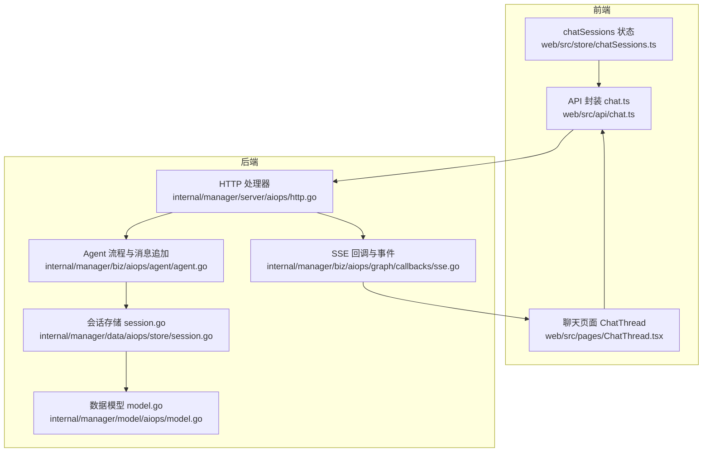
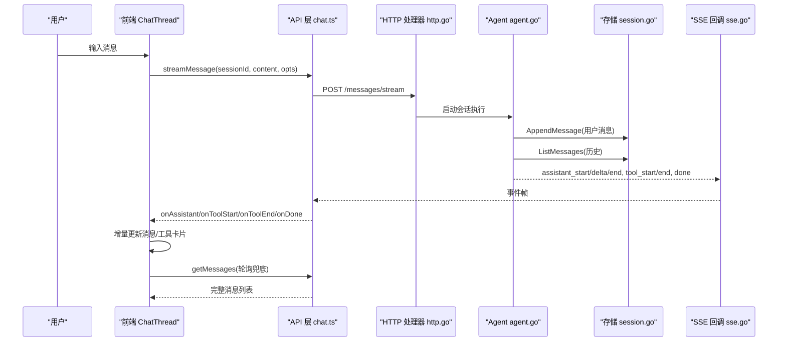
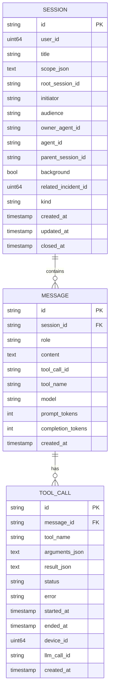
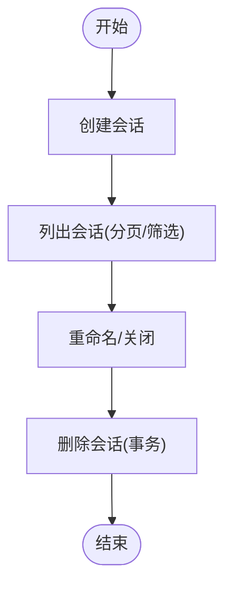
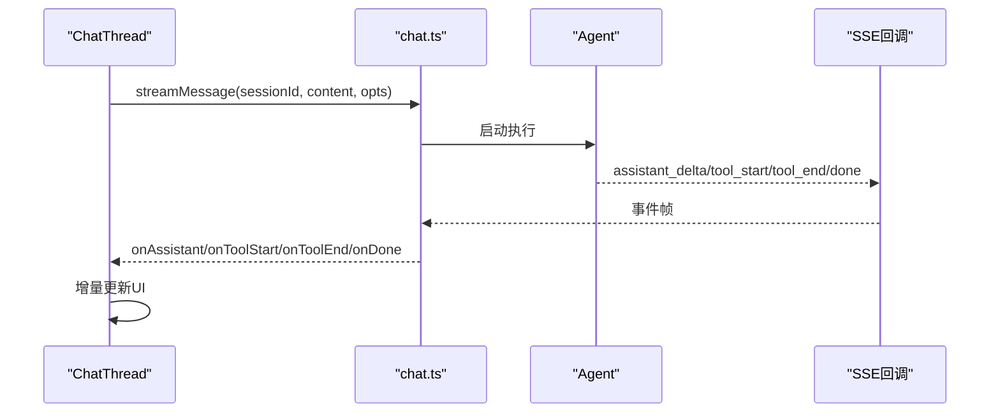
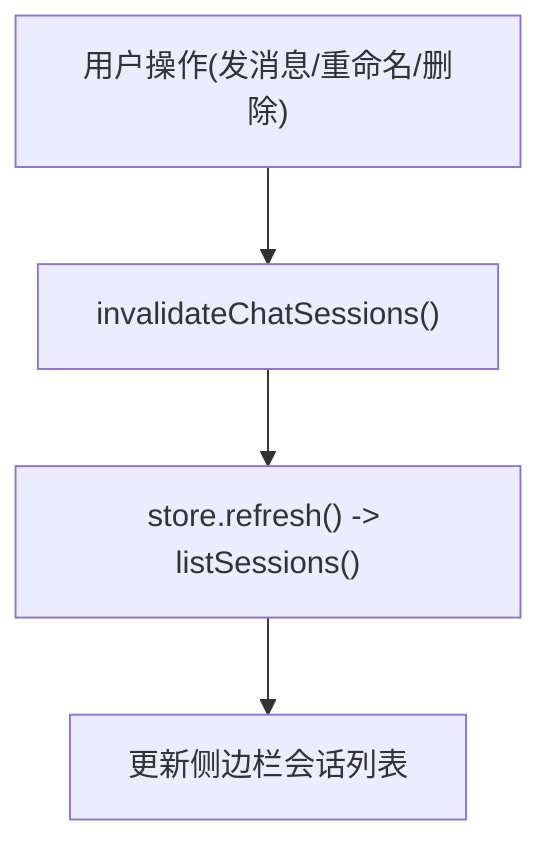
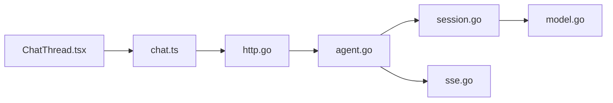

# 聊天会话管理

<cite>
**本文引用的文件**
- [web/src/api/chat.ts](file://web/src/api/chat.ts)
- [web/src/store/chatSessions.ts](file://web/src/store/chatSessions.ts)
- [web/src/pages/ChatThread.tsx](file://web/src/pages/ChatThread.tsx)
- [internal/manager/model/aiops/model.go](file://internal/manager/model/aiops/model.go)
- [internal/manager/data/aiops/store/session.go](file://internal/manager/data/aiops/store/session.go)
- [internal/manager/server/aiops/http.go](file://internal/manager/server/aiops/http.go)
- [internal/manager/biz/aiops/graph/callbacks/sse.go](file://internal/manager/biz/aiops/graph/callbacks/sse.go)
- [internal/manager/biz/aiops/agent/agent.go](file://internal/manager/biz/aiops/agent/agent.go)
</cite>

## 目录
1. [简介](#简介)
2. [项目结构](#项目结构)
3. [核心组件](#核心组件)
4. [架构总览](#架构总览)
5. [详细组件分析](#详细组件分析)
6. [依赖关系分析](#依赖关系分析)
7. [性能与内存优化](#性能与内存优化)
8. [故障排查指南](#故障排查指南)
9. [结论](#结论)
10. [附录：数据模型与接口速查](#附录数据模型与接口速查)

## 简介
本技术文档聚焦于聊天会话的状态管理，覆盖数据结构设计（消息历史、会话元数据、工具调用）、会话生命周期（创建、更新、删除）、消息实时推送与同步机制、会话列表管理策略（分页、搜索过滤、排序），以及多会话切换与数据隔离的实践。同时提供性能优化与内存管理建议，帮助在大规模对话场景下保持流畅体验。

## 项目结构
前端采用 React + TypeScript，使用 Zustand 管理全局状态；后端基于 Go 的 HTTP 服务，结合 GORM 持久化到 SQLite。关键路径如下：
- 前端 API 封装：web/src/api/chat.ts
- 会话列表状态：web/src/store/chatSessions.ts
- 会话页面与流式渲染：web/src/pages/ChatThread.tsx
- 后端数据模型：internal/manager/model/aiops/model.go
- 会话存储实现：internal/manager/data/aiops/store/session.go
- HTTP 路由与处理：internal/manager/server/aiops/http.go
- SSE 回调与事件：internal/manager/biz/aiops/graph/callbacks/sse.go
- Agent 流程与消息追加：internal/manager/biz/aiops/agent/agent.go

**图表来源**
- [web/src/store/chatSessions.ts:1-34](file://web/src/store/chatSessions.ts#L1-L34)
- [web/src/pages/ChatThread.tsx:1-663](file://web/src/pages/ChatThread.tsx#L1-L663)
- [web/src/api/chat.ts:1-361](file://web/src/api/chat.ts#L1-L361)
- [internal/manager/server/aiops/http.go:446-506](file://internal/manager/server/aiops/http.go#L446-L506)
- [internal/manager/biz/aiops/graph/callbacks/sse.go:22-233](file://internal/manager/biz/aiops/graph/callbacks/sse.go#L22-L233)
- [internal/manager/biz/aiops/agent/agent.go:360-394](file://internal/manager/biz/aiops/agent/agent.go#L360-L394)
- [internal/manager/model/aiops/model.go:1-217](file://internal/manager/model/aiops/model.go#L1-L217)
- [internal/manager/data/aiops/store/session.go:75-174](file://internal/manager/data/aiops/store/session.go#L75-L174)

**章节来源**
- [web/src/store/chatSessions.ts:1-34](file://web/src/store/chatSessions.ts#L1-L34)
- [web/src/pages/ChatThread.tsx:1-663](file://web/src/pages/ChatThread.tsx#L1-L663)
- [web/src/api/chat.ts:1-361](file://web/src/api/chat.ts#L1-L361)
- [internal/manager/server/aiops/http.go:446-506](file://internal/manager/server/aiops/http.go#L446-L506)
- [internal/manager/biz/aiops/graph/callbacks/sse.go:22-233](file://internal/manager/biz/aiops/graph/callbacks/sse.go#L22-L233)
- [internal/manager/biz/aiops/agent/agent.go:360-394](file://internal/manager/biz/aiops/agent/agent.go#L360-L394)
- [internal/manager/model/aiops/model.go:1-217](file://internal/manager/model/aiops/model.go#L1-L217)
- [internal/manager/data/aiops/store/session.go:75-174](file://internal/manager/data/aiops/store/session.go#L75-L174)

## 核心组件
- 会话列表状态 store：维护 sessions 数组与加载态，提供刷新与失效方法，供侧边栏等组件订阅。
- 聊天页面 ChatThread：负责单会话的消息展示、发送、SSE 流式接收、滚动行为、人工审批卡片渲染、轮询兜底同步。
- API 层：封装会话 CRUD、消息发送、SSE 流式读取、模型目录查询等。
- 后端模型：Session、Message、ToolCall 三张表，定义会话、消息、工具调用的结构与约束。
- 存储层：GORM 实现的会话列表分页、消息追加、会话删除等。
- HTTP 层：会话创建、列表查询、停止会话等端点。
- SSE 回调：将 agent 执行过程中的 assistant_start/delta/end、tool_start/end、done/error 等事件推送到前端。
- Agent 流程：用户消息持久化、历史加载、构建 LLM 消息数组并执行。

**章节来源**
- [web/src/store/chatSessions.ts:1-34](file://web/src/store/chatSessions.ts#L1-L34)
- [web/src/pages/ChatThread.tsx:1-663](file://web/src/pages/ChatThread.tsx#L1-L663)
- [web/src/api/chat.ts:1-361](file://web/src/api/chat.ts#L1-L361)
- [internal/manager/model/aiops/model.go:1-217](file://internal/manager/model/aiops/model.go#L1-L217)
- [internal/manager/data/aiops/store/session.go:75-174](file://internal/manager/data/aiops/store/session.go#L75-L174)
- [internal/manager/server/aiops/http.go:446-506](file://internal/manager/server/aiops/http.go#L446-L506)
- [internal/manager/biz/aiops/graph/callbacks/sse.go:22-233](file://internal/manager/biz/aiops/graph/callbacks/sse.go#L22-L233)
- [internal/manager/biz/aiops/agent/agent.go:360-394](file://internal/manager/biz/aiops/agent/agent.go#L360-L394)

## 架构总览
聊天会话从前端发起请求，经 HTTP 路由进入业务层，Agent 执行业务逻辑并持久化消息与工具调用，SSE 回调将执行过程实时推送给前端，前端通过流式事件驱动 UI 更新，并通过轮询进行最终一致性校验。

**图表来源**
- [web/src/pages/ChatThread.tsx:222-423](file://web/src/pages/ChatThread.tsx#L222-L423)
- [web/src/api/chat.ts:247-361](file://web/src/api/chat.ts#L247-L361)
- [internal/manager/server/aiops/http.go:446-506](file://internal/manager/server/aiops/http.go#L446-L506)
- [internal/manager/biz/aiops/agent/agent.go:360-394](file://internal/manager/biz/aiops/agent/agent.go#L360-L394)
- [internal/manager/data/aiops/store/session.go:162-174](file://internal/manager/data/aiops/store/session.go#L162-L174)
- [internal/manager/biz/aiops/graph/callbacks/sse.go:22-233](file://internal/manager/biz/aiops/graph/callbacks/sse.go#L22-L233)

## 详细组件分析

### 数据模型与关系
- Session：会话元数据，包含用户、标题、范围、根会话、发起者、受众、负责人、关联告警、类型、时间戳等。
- Message：会话中的一条消息，角色包括 user/assistant/tool/system，支持工具调用关联与模型溯源。
- ToolCall：工具调用记录，包含名称、参数、结果、状态、错误、起止时间、设备、LLM 调用 ID 等。

**图表来源**
- [internal/manager/model/aiops/model.go:25-217](file://internal/manager/model/aiops/model.go#L25-L217)

**章节来源**
- [internal/manager/model/aiops/model.go:25-217](file://internal/manager/model/aiops/model.go#L25-L217)

### 会话生命周期管理
- 创建会话：HTTP 处理器接收创建请求，调用服务层创建会话并返回 DTO。
- 列出会话：支持分页（limit/offset）与按关联告警筛选，仅返回用户可见受众的会话。
- 重命名与会话关闭：支持更新标题与标记关闭时间。
- 删除会话：事务性删除会话及其所有消息与工具调用，保证一致性。

**图表来源**
- [internal/manager/server/aiops/http.go:446-506](file://internal/manager/server/aiops/http.go#L446-L506)
- [internal/manager/data/aiops/store/session.go:75-174](file://internal/manager/data/aiops/store/session.go#L75-L174)

**章节来源**
- [internal/manager/server/aiops/http.go:446-506](file://internal/manager/server/aiops/http.go#L446-L506)
- [internal/manager/data/aiops/store/session.go:75-174](file://internal/manager/data/aiops/store/session.go#L75-L174)

### 消息发送与实时推送
- 前端发送消息：使用 streamMessage 建立 SSE 连接，携带内容、提及、模型选择、语言等选项。
- 服务端执行：Agent 先持久化用户消息，再加载历史构建 LLM 消息数组，执行后通过 SSE 回调推送 assistant_start/delta/end、tool_start/end、done/error 等事件。
- 前端渲染：根据事件类型增量更新消息气泡与工具卡片，并在完成时触发会话列表失效刷新。

**图表来源**
- [web/src/pages/ChatThread.tsx:222-423](file://web/src/pages/ChatThread.tsx#L222-L423)
- [web/src/api/chat.ts:247-361](file://web/src/api/chat.ts#L247-L361)
- [internal/manager/biz/aiops/graph/callbacks/sse.go:22-233](file://internal/manager/biz/aiops/graph/callbacks/sse.go#L22-L233)
- [internal/manager/biz/aiops/agent/agent.go:360-394](file://internal/manager/biz/aiops/agent/agent.go#L360-L394)

**章节来源**
- [web/src/pages/ChatThread.tsx:222-423](file://web/src/pages/ChatThread.tsx#L222-L423)
- [web/src/api/chat.ts:247-361](file://web/src/api/chat.ts#L247-L361)
- [internal/manager/biz/aiops/graph/callbacks/sse.go:22-233](file://internal/manager/biz/aiops/graph/callbacks/sse.go#L22-L233)
- [internal/manager/biz/aiops/agent/agent.go:360-394](file://internal/manager/biz/aiops/agent/agent.go#L360-L394)

### 会话列表管理策略
- 分页加载：后端支持 limit/offset，前端通过 store 的 refresh 拉取最新列表。
- 搜索过滤：命令面板对最近会话进行模糊匹配与评分排序，便于快速跳转。
- 排序：默认按创建时间倒序，便于显示最新会话。
- 失效刷新：发送消息完成后调用 invalidateChatSessions 触发侧边栏重新拉取。

**图表来源**
- [web/src/store/chatSessions.ts:15-33](file://web/src/store/chatSessions.ts#L15-L33)
- [web/src/api/chat.ts:73-87](file://web/src/api/chat.ts#L73-L87)
- [internal/manager/server/aiops/http.go:472-506](file://internal/manager/server/aiops/http.go#L472-L506)

**章节来源**
- [web/src/store/chatSessions.ts:15-33](file://web/src/store/chatSessions.ts#L15-L33)
- [web/src/api/chat.ts:73-87](file://web/src/api/chat.ts#L73-L87)
- [internal/manager/server/aiops/http.go:472-506](file://internal/manager/server/aiops/http.go#L472-L506)

### 多会话切换与数据隔离
- 会话标识：每个会话拥有唯一 UUID，前端通过路由参数 sessionId 区分当前会话。
- 状态隔离：ChatThread 组件内维护 messages 局部状态，避免跨会话污染。
- 列表共享：全局 store 仅持有会话元数据，不混入消息内容，确保切换时无需重建消息缓存。
- 数据一致性：轮询 getMessages 与 SSE 事件共同保障最终一致，避免并发写入导致的数据错乱。

**章节来源**
- [web/src/pages/ChatThread.tsx:32-48](file://web/src/pages/ChatThread.tsx#L32-L48)
- [web/src/pages/ChatThread.tsx:114-179](file://web/src/pages/ChatThread.tsx#L114-L179)
- [web/src/store/chatSessions.ts:15-33](file://web/src/store/chatSessions.ts#L15-L33)

## 依赖关系分析
- 前端依赖：Zustand store、React Router、i18n、本地存储（模型选择）。
- 后端依赖：GORM 数据库访问、SSE 回调框架、Agent 执行图、工具调用基础设施。
- 耦合点：
  - ChatThread 与 chat.ts 的强耦合（API 调用与事件处理）。
  - HTTP 处理器与 service 层的解耦（通过 DTO 转换）。
  - Agent 与存储层的抽象（SessionRepo 接口）。

**图表来源**
- [web/src/pages/ChatThread.tsx:1-663](file://web/src/pages/ChatThread.tsx#L1-L663)
- [web/src/api/chat.ts:1-361](file://web/src/api/chat.ts#L1-L361)
- [internal/manager/server/aiops/http.go:446-506](file://internal/manager/server/aiops/http.go#L446-L506)
- [internal/manager/biz/aiops/agent/agent.go:360-394](file://internal/manager/biz/aiops/agent/agent.go#L360-L394)
- [internal/manager/data/aiops/store/session.go:75-174](file://internal/manager/data/aiops/store/session.go#L75-L174)
- [internal/manager/model/aiops/model.go:1-217](file://internal/manager/model/aiops/model.go#L1-L217)
- [internal/manager/biz/aiops/graph/callbacks/sse.go:22-233](file://internal/manager/biz/aiops/graph/callbacks/sse.go#L22-L233)

**章节来源**
- [web/src/pages/ChatThread.tsx:1-663](file://web/src/pages/ChatThread.tsx#L1-L663)
- [web/src/api/chat.ts:1-361](file://web/src/api/chat.ts#L1-L361)
- [internal/manager/server/aiops/http.go:446-506](file://internal/manager/server/aiops/http.go#L446-L506)
- [internal/manager/biz/aiops/agent/agent.go:360-394](file://internal/manager/biz/aiops/agent/agent.go#L360-L394)
- [internal/manager/data/aiops/store/session.go:75-174](file://internal/manager/data/aiops/store/session.go#L75-L174)
- [internal/manager/model/aiops/model.go:1-217](file://internal/manager/model/aiops/model.go#L1-L217)
- [internal/manager/biz/aiops/graph/callbacks/sse.go:22-233](file://internal/manager/biz/aiops/graph/callbacks/sse.go#L22-L233)

## 性能与内存优化
- 流式渲染：SSE 增量推送减少首屏等待，避免整段响应阻塞。
- 轮询去抖：ChatThread 使用指纹（长度、最后ID、内容长度、待审批ID集合）避免无变化时的重复渲染。
- 分页与限制：后端列表支持 limit/offset，控制单次传输量。
- 滚动优化：stickToBottomRef 避免频繁测量导致的抖动，提升阅读体验。
- 内存管理：
  - 消息数组仅在必要时替换引用，减少不必要的重渲染。
  - 工具卡片使用合成 ID 与合并策略，避免重复节点。
  - 会话列表 store 仅保存元数据，降低内存占用。
- 取消与超时：AbortController 支持中断流式请求，释放资源。

[本节为通用指导，无需具体文件来源]

## 故障排查指南
- 常见问题：
  - SSE 断开：检查网络与代理配置，确认后端事件正常发出。
  - 消息不同步：确认轮询是否被提交中状态跳过，检查指纹计算是否正确。
  - 工具调用未显示：核对 tool_start/tool_end 事件顺序与 ID 映射。
  - 会话列表不更新：确认 invalidateChatSessions 是否被调用，检查后端分页与筛选条件。
- 定位步骤：
  - 查看浏览器控制台与网络面板，确认事件帧与响应体。
  - 在后端日志中查找 agent 执行与存储写入错误。
  - 使用测试用例验证存储层读写一致性。

**章节来源**
- [web/src/pages/ChatThread.tsx:114-179](file://web/src/pages/ChatThread.tsx#L114-L179)
- [web/src/api/chat.ts:247-361](file://web/src/api/chat.ts#L247-L361)
- [internal/manager/data/aiops/store/session.go:132-174](file://internal/manager/data/aiops/store/session.go#L132-L174)

## 结论
该聊天会话管理系统通过清晰的分层设计与前后端协作，实现了高效的会话生命周期管理与实时消息推送。借助 SSE 流式事件与轮询兜底，保证了用户体验的一致性与可靠性。配合分页、搜索与排序策略，满足多会话场景下的导航与管理需求。未来可进一步引入更细粒度的缓存与增量同步机制，以应对更大规模的数据量与更高并发。

[本节为总结，无需具体文件来源]

## 附录：数据模型与接口速查
- 数据模型
  - Session：会话元数据（用户、标题、范围、根会话、发起者、受众、负责人、关联告警、类型、时间戳）
  - Message：消息（角色、内容、工具调用关联、模型溯源、时间戳）
  - ToolCall：工具调用（名称、参数、结果、状态、错误、起止时间、设备、LLM 调用 ID）
- 主要接口
  - 会话列表：GET /chat/sessions?limit=&offset=&related_incident_id=
  - 创建会话：POST /chat/sessions
  - 重命名会话：PATCH /chat/sessions/{id}
  - 停止会话：POST /chat/sessions/{id}/stop
  - 获取消息：GET /chat/sessions/{id}/messages
  - 发送消息（SSE）：POST /api/v1/chat/sessions/{id}/messages/stream

**章节来源**
- [internal/manager/model/aiops/model.go:25-217](file://internal/manager/model/aiops/model.go#L25-L217)
- [web/src/api/chat.ts:73-194](file://web/src/api/chat.ts#L73-L194)
- [internal/manager/server/aiops/http.go:446-506](file://internal/manager/server/aiops/http.go#L446-L506)