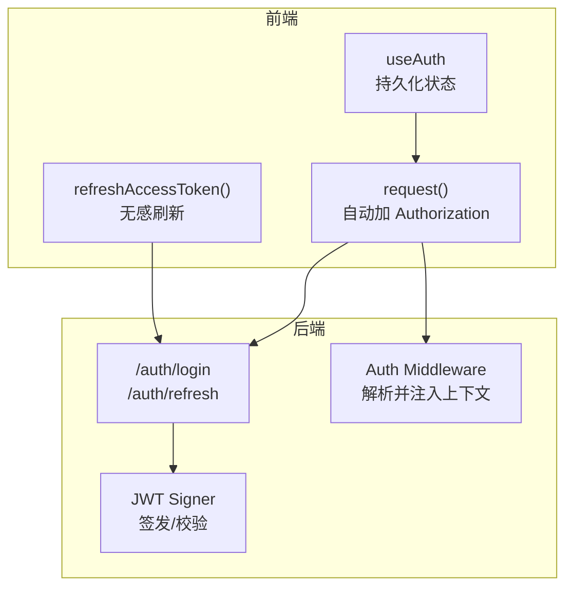
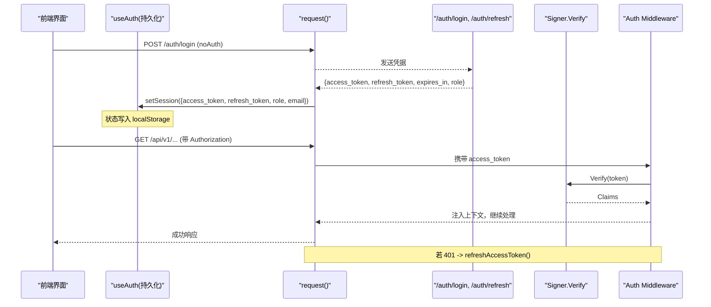
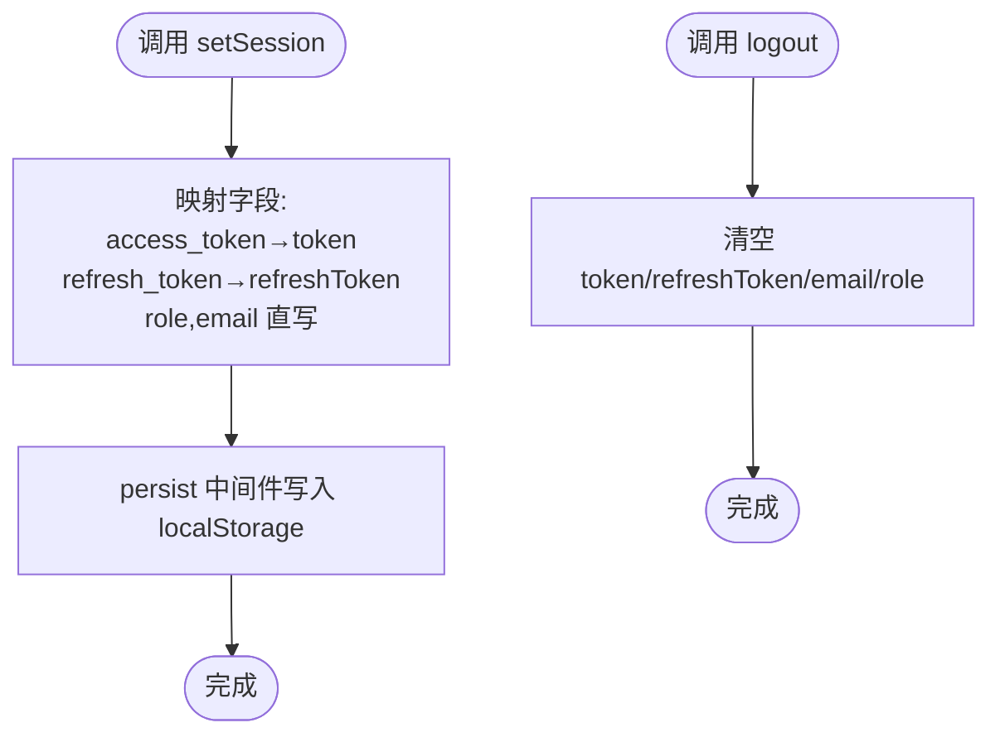
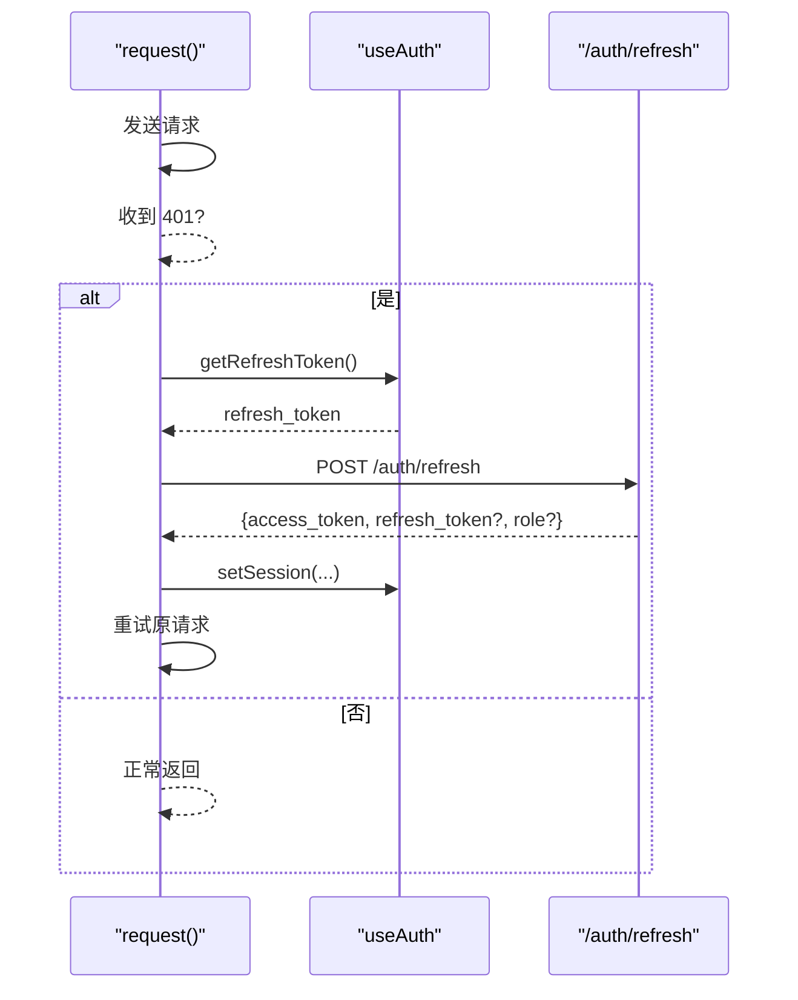
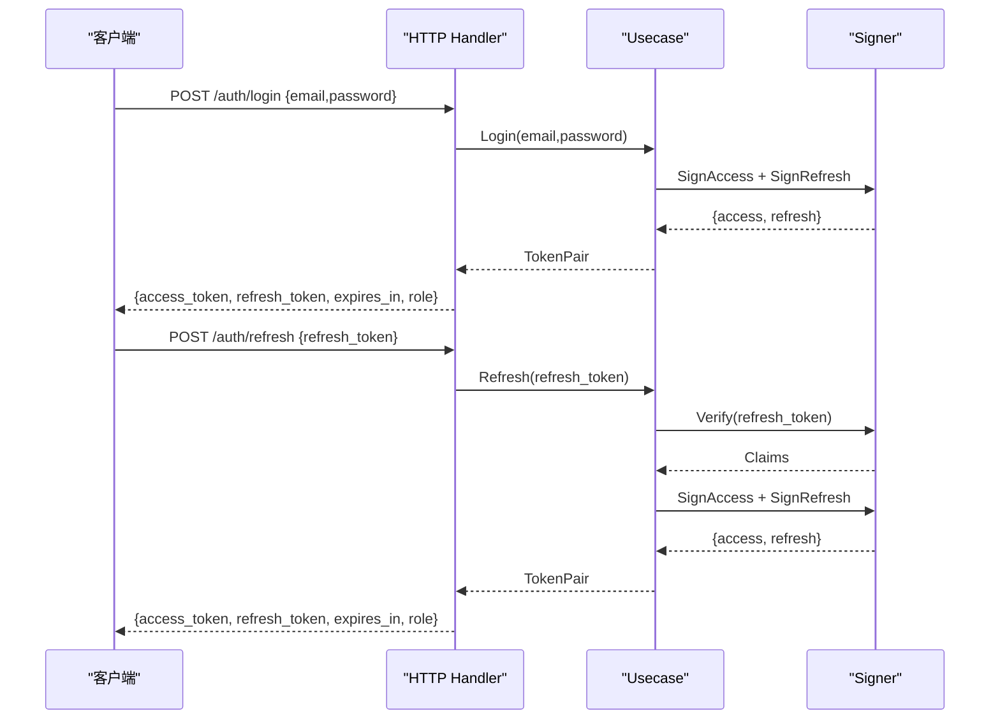
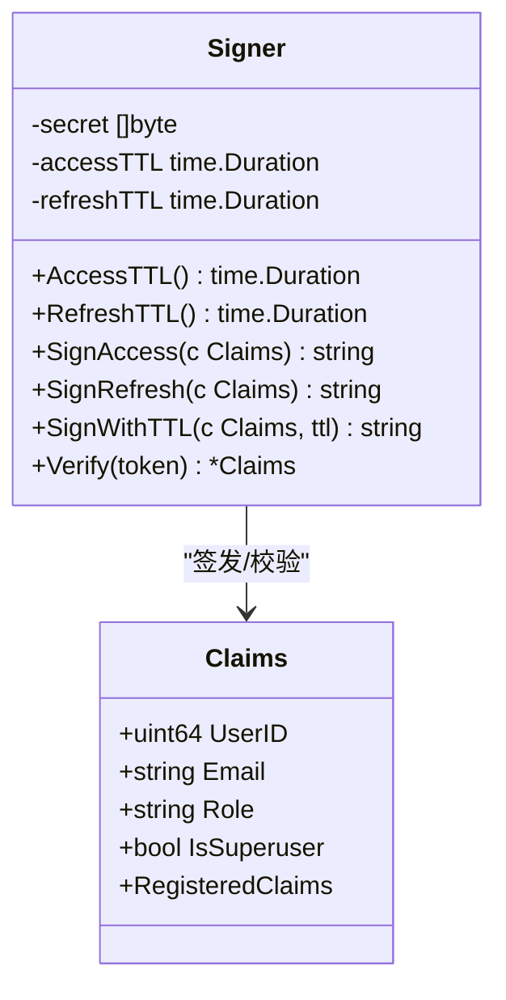
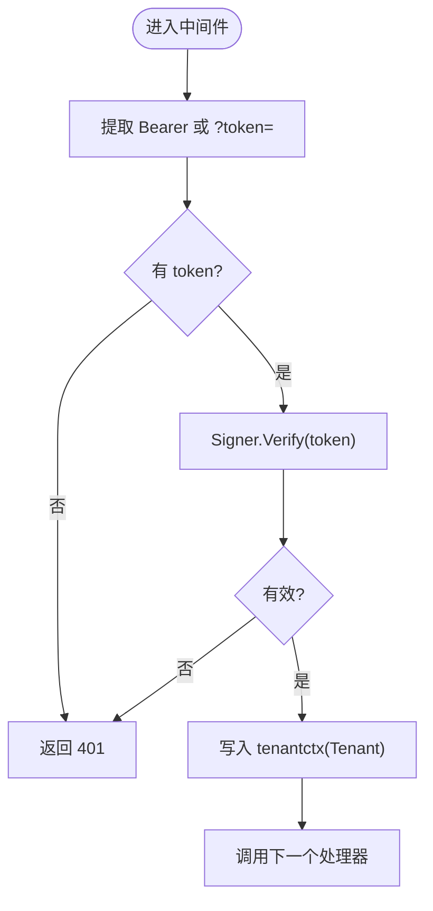
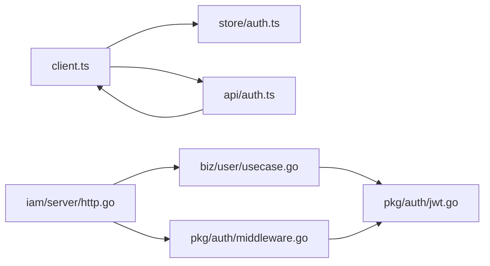

# 认证状态管理

<cite>
**本文引用的文件**
- [web/src/store/auth.ts](file://web/src/store/auth.ts)
- [web/src/api/client.ts](file://web/src/api/client.ts)
- [web/src/api/auth.ts](file://web/src/api/auth.ts)
- [internal/pkg/auth/jwt.go](file://internal/pkg/auth/jwt.go)
- [internal/pkg/auth/middleware.go](file://internal/pkg/auth/middleware.go)
- [internal/iam/server/http.go](file://internal/iam/server/http.go)
- [internal/iam/biz/user/usecase.go](file://internal/iam/biz/user/usecase.go)
- [tests/e2e/auth_login_test.go](file://tests/e2e/auth_login_test.go)
- [tests/e2e/auth_refresh_test.go](file://tests/e2e/auth_refresh_test.go)
</cite>

## 目录
1. [简介](#简介)
2. [项目结构](#项目结构)
3. [核心组件](#核心组件)
4. [架构总览](#架构总览)
5. [详细组件分析](#详细组件分析)
6. [依赖关系分析](#依赖关系分析)
7. [性能考虑](#性能考虑)
8. [故障排查指南](#故障排查指南)
9. [结论](#结论)
10. [附录](#附录)

## 简介
本技术文档聚焦于前端与后端的认证状态管理，覆盖 JWT 的签发、校验、刷新与持久化，以及基于中间件的权限控制。重点说明 AuthState 类型定义（token、refreshToken、email、role）的职责，setSession 与 logout 的实现逻辑，使用 persist 中间件将认证状态同步到本地存储，以及 token 过期时的自动刷新流程。同时给出安全最佳实践与错误处理策略。

## 项目结构
认证相关代码主要分布在以下位置：
- 前端状态与网络层：web/src/store/auth.ts、web/src/api/client.ts、web/src/api/auth.ts
- 后端鉴权与中间件：internal/pkg/auth/jwt.go、internal/pkg/auth/middleware.go
- 后端登录与刷新接口：internal/iam/server/http.go、internal/iam/biz/user/usecase.go
- 端到端测试用例：tests/e2e/auth_login_test.go、tests/e2e/auth_refresh_test.go

图表来源
- [web/src/store/auth.ts:20-41](file://web/src/store/auth.ts#L20-L41)
- [web/src/api/client.ts:27-115](file://web/src/api/client.ts#L27-L115)
- [web/src/api/client.ts:117-162](file://web/src/api/client.ts#L117-L162)
- [internal/iam/server/http.go:151-155](file://internal/iam/server/http.go#L151-L155)
- [internal/pkg/auth/jwt.go:32-99](file://internal/pkg/auth/jwt.go#L32-L99)
- [internal/pkg/auth/middleware.go:21-53](file://internal/pkg/auth/middleware.go#L21-L53)

章节来源
- [web/src/store/auth.ts:1-50](file://web/src/store/auth.ts#L1-L50)
- [web/src/api/client.ts:1-163](file://web/src/api/client.ts#L1-L163)
- [internal/pkg/auth/jwt.go:1-100](file://internal/pkg/auth/jwt.go#L1-L100)
- [internal/pkg/auth/middleware.go:1-68](file://internal/pkg/auth/middleware.go#L1-L68)
- [internal/iam/server/http.go:151-327](file://internal/iam/server/http.go#L151-L327)
- [internal/iam/biz/user/usecase.go:80-123](file://internal/iam/biz/user/usecase.go#L80-L123)

## 核心组件
- 前端认证状态 store：定义 Session 与 AuthState，提供 setSession、logout、getToken、getRefreshToken。通过 zustand 的 persist 中间件将状态持久化到 localStorage，键名为 ongrid.auth。
- 前端请求封装：统一在 request 中附加 Authorization 头；当收到 401 时尝试调用 /auth/refresh 刷新 access_token，成功后重试原请求；若刷新失败则调用 logout 清除本地状态。
- 后端 JWT 签发与校验：Signer 负责签发短生命周期 access token 和长生命周期 refresh token，并提供 Verify 进行签名与过期校验。
- 后端鉴权中间件：从 Authorization 或查询参数中提取 token，校验通过后把用户信息写入请求上下文，供后续路由使用。
- 登录与刷新接口：/auth/login 返回 access_token、refresh_token、expires_in、role；/auth/refresh 用 refresh_token 换取新的 token 对。

章节来源
- [web/src/store/auth.ts:4-18](file://web/src/store/auth.ts#L4-L18)
- [web/src/store/auth.ts:20-41](file://web/src/store/auth.ts#L20-L41)
- [web/src/api/client.ts:27-115](file://web/src/api/client.ts#L27-L115)
- [web/src/api/client.ts:117-162](file://web/src/api/client.ts#L117-L162)
- [internal/pkg/auth/jwt.go:16-99](file://internal/pkg/auth/jwt.go#L16-L99)
- [internal/pkg/auth/middleware.go:10-53](file://internal/pkg/auth/middleware.go#L10-L53)
- [internal/iam/server/http.go:221-288](file://internal/iam/server/http.go#L221-L288)
- [internal/iam/biz/user/usecase.go:80-123](file://internal/iam/biz/user/usecase.go#L80-L123)

## 架构总览
下图展示了从登录到访问受保护资源的全链路：前端发起登录，后端签发 JWT；后续请求携带 access_token，中间件校验并注入上下文；access_token 过期时前端自动刷新。

图表来源
- [web/src/api/auth.ts:19-25](file://web/src/api/auth.ts#L19-L25)
- [web/src/store/auth.ts:20-41](file://web/src/store/auth.ts#L20-L41)
- [web/src/api/client.ts:27-115](file://web/src/api/client.ts#L27-L115)
- [internal/iam/server/http.go:221-288](file://internal/iam/server/http.go#L221-L288)
- [internal/pkg/auth/jwt.go:81-99](file://internal/pkg/auth/jwt.go#L81-L99)
- [internal/pkg/auth/middleware.go:21-53](file://internal/pkg/auth/middleware.go#L21-L53)

## 详细组件分析

### 前端认证状态：AuthState、Session、setSession、logout
- Session 包含 access_token、可选 refresh_token、role、email，用于描述一次会话的核心信息。
- AuthState 暴露 token、refreshToken、email、role 四个字段，以及 setSession(s)、logout() 两个方法。
- setSession 将传入的 Session 映射为内部状态：access_token → token，refresh_token → refreshToken，role/email 直接赋值。
- logout 清空所有认证相关状态。
- 通过 persist 中间件将状态以 JSON 形式写入 localStorage，键名 ongrid.auth，确保页面刷新后仍保持登录态。

图表来源
- [web/src/store/auth.ts:4-18](file://web/src/store/auth.ts#L4-L18)
- [web/src/store/auth.ts:20-41](file://web/src/store/auth.ts#L20-L41)

章节来源
- [web/src/store/auth.ts:1-50](file://web/src/store/auth.ts#L1-L50)

### 前端请求与自动刷新：request、refreshAccessToken
- request 在非 noAuth 模式下自动添加 Authorization: Bearer <token>。
- 当响应为 401 且非 noAuth 时，调用 refreshAccessToken：
  - 若已有刷新中的请求，直接复用该 Promise。
  - 读取本地 refresh_token，调用 /auth/refresh。
  - 成功时更新本地 session（access_token、refresh_token、role、email），并重试原请求。
  - 失败时调用 useAuth.getState().logout() 清理本地状态。
- refreshAccessToken 保证并发安全，避免重复刷新。

图表来源
- [web/src/api/client.ts:27-115](file://web/src/api/client.ts#L27-L115)
- [web/src/api/client.ts:117-162](file://web/src/api/client.ts#L117-L162)
- [web/src/store/auth.ts:43-49](file://web/src/store/auth.ts#L43-L49)

章节来源
- [web/src/api/client.ts:1-163](file://web/src/api/client.ts#L1-L163)
- [web/src/store/auth.ts:43-49](file://web/src/store/auth.ts#L43-L49)

### 后端登录与刷新：/auth/login、/auth/refresh
- /auth/login：验证邮箱与密码，成功后签发 access_token 与 refresh_token，并返回 expires_in、role。
- /auth/refresh：校验 refresh_token，验证用户状态后签发新的 token 对。
- 业务层 Usecase.Login/Refresh 负责从数据库获取用户、校验状态、签发 token 对。

图表来源
- [internal/iam/server/http.go:221-288](file://internal/iam/server/http.go#L221-L288)
- [internal/iam/biz/user/usecase.go:80-123](file://internal/iam/biz/user/usecase.go#L80-L123)
- [internal/iam/biz/user/usecase.go:362-387](file://internal/iam/biz/user/usecase.go#L362-L387)

章节来源
- [internal/iam/server/http.go:151-327](file://internal/iam/server/http.go#L151-L327)
- [internal/iam/biz/user/usecase.go:80-123](file://internal/iam/biz/user/usecase.go#L80-L123)
- [internal/iam/biz/user/usecase.go:362-387](file://internal/iam/biz/user/usecase.go#L362-L387)

### JWT 签发与校验：Claims、Signer、Verify
- Claims 包含 user_id、email、role、is_superuser 及标准注册声明（exp、iat 等）。
- Signer 提供 SignAccess、SignRefresh、SignWithTTL 三种签发方式，以及 Verify 进行签名与过期校验。
- 中间件仅做签名与过期校验，不做数据库查询；角色与权限判断由后续路由或授权中间件完成。

图表来源
- [internal/pkg/auth/jwt.go:16-99](file://internal/pkg/auth/jwt.go#L16-L99)

章节来源
- [internal/pkg/auth/jwt.go:1-100](file://internal/pkg/auth/jwt.go#L1-L100)

### 鉴权中间件：提取 token、注入上下文
- 从 Authorization: Bearer 或 ?token= 查询参数中提取 token。
- 调用 Signer.Verify 校验，失败返回 401。
- 将 Claims 中的用户信息写入 tenantctx，供后续处理器使用。
- 支持 is_superuser 短路权限判断（兼容旧 token 的 Role=="admin" 回退）。

图表来源
- [internal/pkg/auth/middleware.go:21-53](file://internal/pkg/auth/middleware.go#L21-L53)
- [internal/pkg/auth/middleware.go:55-67](file://internal/pkg/auth/middleware.go#L55-L67)

章节来源
- [internal/pkg/auth/middleware.go:1-68](file://internal/pkg/auth/middleware.go#L1-L68)

### 使用示例：获取与设置认证状态
- 获取当前 token：调用 getToken()，返回当前内存中的 access_token。
- 获取 refresh_token：调用 getRefreshToken()，用于触发刷新流程。
- 设置会话：登录后调用 setSession({access_token, refresh_token, role, email})，状态将被持久化到 localStorage。
- 退出登录：调用 logout()，清空所有认证状态。

章节来源
- [web/src/store/auth.ts:43-49](file://web/src/store/auth.ts#L43-L49)
- [web/src/store/auth.ts:20-41](file://web/src/store/auth.ts#L20-L41)

### 错误处理策略
- 网络错误：包装为 ApiError，携带 status、code、payload，便于上层展示。
- 401 未认证：优先尝试刷新；刷新成功则重试；刷新失败则强制登出。
- 服务器错误：解析 JSON 或文本体，提取 message/code，统一抛出 ApiError。
- 中间件错误：无效或缺失 token 直接返回 401，不执行后续处理器。

章节来源
- [web/src/api/client.ts:4-15](file://web/src/api/client.ts#L4-L15)
- [web/src/api/client.ts:82-115](file://web/src/api/client.ts#L82-L115)
- [internal/pkg/auth/middleware.go:21-53](file://internal/pkg/auth/middleware.go#L21-L53)

## 依赖关系分析
- 前端依赖：
  - useAuth 提供状态与持久化能力，被 client.ts 的 request 与 refreshAccessToken 引用。
  - auth.ts 封装登录、刷新、获取当前用户等 API。
- 后端依赖：
  - HTTP handler 依赖 Usecase 进行业务校验与 token 签发。
  - Usecase 依赖 Signer 进行 JWT 操作。
  - 中间件依赖 Signer 进行 token 校验，并将上下文注入给下游处理器。

图表来源
- [web/src/api/client.ts:1-163](file://web/src/api/client.ts#L1-L163)
- [web/src/store/auth.ts:1-50](file://web/src/store/auth.ts#L1-L50)
- [web/src/api/auth.ts:1-30](file://web/src/api/auth.ts#L1-L30)
- [internal/iam/server/http.go:151-327](file://internal/iam/server/http.go#L151-L327)
- [internal/iam/biz/user/usecase.go:80-123](file://internal/iam/biz/user/usecase.go#L80-L123)
- [internal/pkg/auth/jwt.go:16-99](file://internal/pkg/auth/jwt.go#L16-L99)
- [internal/pkg/auth/middleware.go:21-53](file://internal/pkg/auth/middleware.go#L21-L53)

章节来源
- [web/src/api/client.ts:1-163](file://web/src/api/client.ts#L1-L163)
- [web/src/store/auth.ts:1-50](file://web/src/store/auth.ts#L1-L50)
- [web/src/api/auth.ts:1-30](file://web/src/api/auth.ts#L1-L30)
- [internal/iam/server/http.go:151-327](file://internal/iam/server/http.go#L151-L327)
- [internal/iam/biz/user/usecase.go:80-123](file://internal/iam/biz/user/usecase.go#L80-L123)
- [internal/pkg/auth/jwt.go:16-99](file://internal/pkg/auth/jwt.go#L16-L99)
- [internal/pkg/auth/middleware.go:21-53](file://internal/pkg/auth/middleware.go#L21-L53)

## 性能考虑
- 刷新防抖：refreshAccessToken 使用全局变量防止并发重复刷新，减少不必要的网络开销。
- 短生命周期 access token：降低泄露风险与批量重放攻击面。
- 中间件轻量：仅做签名与过期校验，避免数据库查询，提升吞吐。
- 本地持久化：使用 localStorage 减少重复登录，提高用户体验。

[本节为通用指导，无需特定文件引用]

## 故障排查指南
- 401 未认证：
  - 检查 Authorization 头是否正确携带。
  - 确认 refresh_token 是否存在且有效。
  - 查看刷新接口是否返回新 token。
- 刷新失败：
  - 检查 /auth/refresh 接口是否可达。
  - 确认服务端 Signer 配置一致。
  - 若刷新失败，系统会调用 logout，需重新登录。
- 中间件拒绝：
  - 确认 token 格式正确且未过期。
  - 检查是否通过 Authorization 或 ?token= 传递。
- 测试参考：
  - 登录与 self 接口：tests/e2e/auth_login_test.go
  - 刷新流程：tests/e2e/auth_refresh_test.go

章节来源
- [tests/e2e/auth_login_test.go:15-43](file://tests/e2e/auth_login_test.go#L15-L43)
- [tests/e2e/auth_refresh_test.go:37-61](file://tests/e2e/auth_refresh_test.go#L37-L61)

## 结论
本项目采用前后端分离的认证方案：前端通过 zustand 的 persist 中间件将认证状态持久化到 localStorage，并在请求失败时自动刷新 access_token；后端通过 JWT 签发与校验实现无状态鉴权，中间件负责提取与校验 token 并注入上下文。整体设计简洁高效，具备自动刷新、幂等刷新、错误统一处理与可扩展的权限控制基础。建议在生产环境中结合 HTTPS、安全的 Cookie 策略与更严格的刷新令牌轮换机制进一步提升安全性。

[本节为总结性内容，无需特定文件引用]

## 附录
- 安全最佳实践
  - 使用 HTTPS 传输所有认证相关数据。
  - 合理设置 access_token 与 refresh_token 的 TTL，缩短暴露窗口。
  - 对刷新接口实施速率限制与异常检测。
  - 在服务端记录审计日志，追踪登录失败与刷新失败。
  - 定期轮换签名密钥，避免长期密钥泄露风险。
- 错误处理策略
  - 统一包装网络错误为 ApiError，携带状态码与消息。
  - 401 时优先刷新，失败再登出，避免误踢用户。
  - 中间件对非法 token 快速失败，减少不必要处理。

[本节为通用指导，无需特定文件引用]