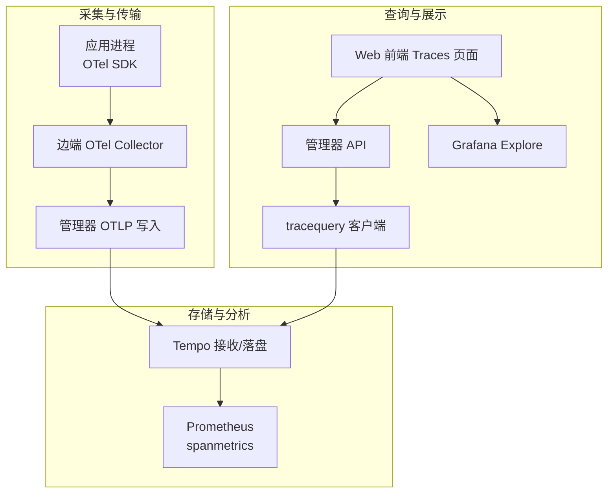
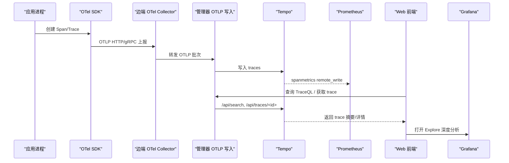
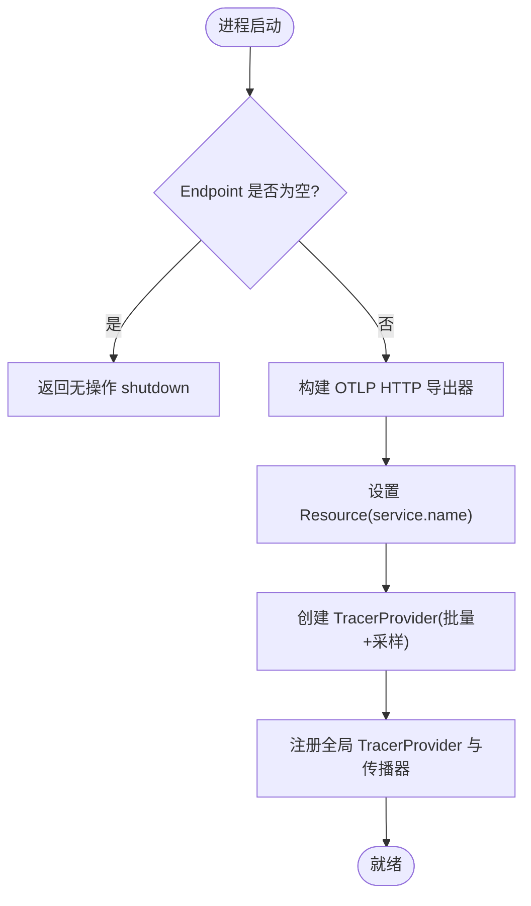
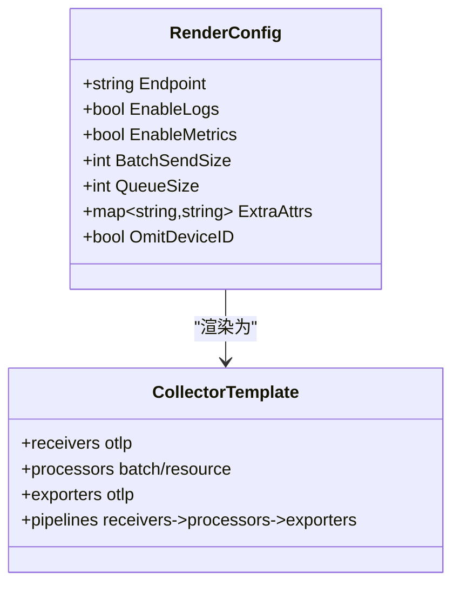
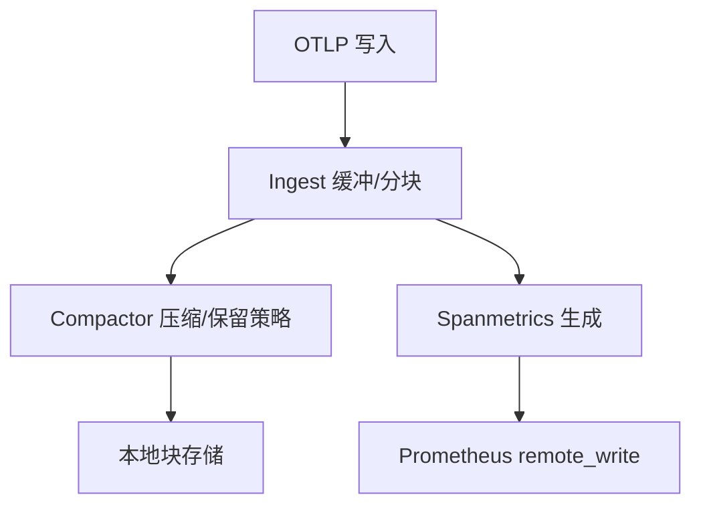
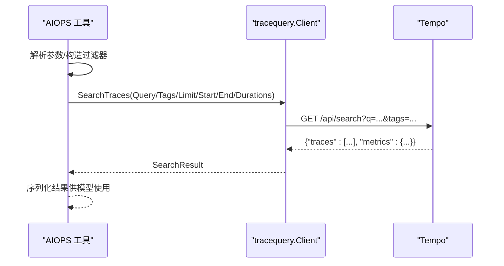
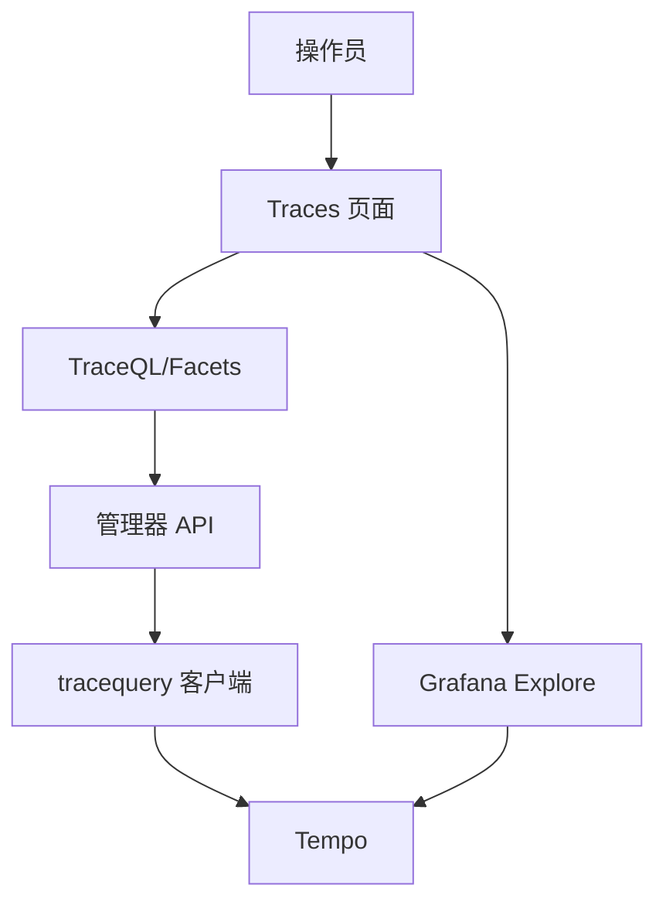
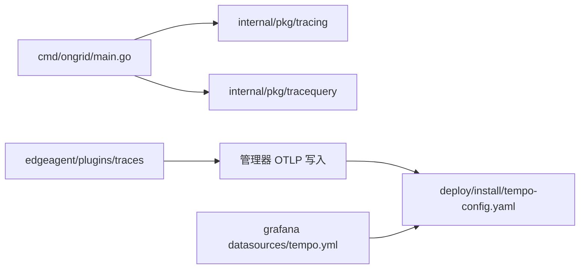

# 分布式追踪

<cite>
**本文引用的文件**
- [internal/pkg/tracing/tracing.go](file://internal/pkg/tracing/tracing.go)
- [internal/pkg/tracequery/client.go](file://internal/pkg/tracequery/client.go)
- [internal/manager/biz/aiops/tools/query_traceql.go](file://internal/manager/biz/aiops/tools/query_traceql.go)
- [internal/edgeagent/plugins/traces/render.go](file://internal/edgeagent/plugins/traces/render.go)
- [deploy/install/tempo-config.yaml](file://deploy/install/tempo-config.yaml)
- [deploy/install/grafana/provisioning/datasources/tempo.yml](file://deploy/install/grafana/provisioning/datasources/tempo.yml)
- [web/src/pages/Traces.tsx](file://web/src/pages/Traces.tsx)
- [web/src/lib/drilldown.ts](file://web/src/lib/drilldown.ts)
- [cmd/ongrid/main.go](file://cmd/ongrid/main.go)
</cite>

## 目录
1. [简介](#简介)
2. [项目结构](#项目结构)
3. [核心组件](#核心组件)
4. [架构总览](#架构总览)
5. [详细组件分析](#详细组件分析)
6. [依赖关系分析](#依赖关系分析)
7. [性能考量](#性能考量)
8. [故障排查指南](#故障排查指南)
9. [结论](#结论)
10. [附录](#附录)

## 简介
本技术文档围绕 ongrid 的分布式追踪能力，系统性说明与 Tempo 的集成方案、数据流处理链路、TraceQL 查询支持、OpenTelemetry SDK 配置与上下文传播、以及前端可视化与 Grafana 联动。重点覆盖：
- 追踪数据的采集、传输与存储机制
- TraceQL 查询语言在系统内的落地实现（链路查询、跨度过滤、性能分析）
- OpenTelemetry 集成（SDK 初始化、采样策略、上下文传播）
- 追踪查询示例与性能分析方法
- 识别性能瓶颈、调用链关系与服务间问题诊断
- 追踪数据生命周期管理与存储优化策略

## 项目结构
本项目将追踪相关能力拆分为多个层次：
- 采集层：应用侧通过 OpenTelemetry SDK 生成 Span，经 OTLP HTTP/gRPC 上报；边端通过 OTel Collector 转发至管理器或外部 Tempo。
- 传输层：管理器提供 OTLP 写入路径，边端插件渲染 OTel Collector 配置并推送。
- 存储与分析层：Tempo 接收并落盘，Spanmetrics 生成指标回写 Prometheus；Grafana 作为统一观测入口。
- 查询层：后端 tracequery 客户端封装 Tempo API；AIOPS 工具层提供 TraceQL 查询工具；前端 Traces 页面提供交互式查询与跳转。

**图示来源**
- [internal/pkg/tracing/tracing.go:60-106](file://internal/pkg/tracing/tracing.go#L60-L106)
- [internal/edgeagent/plugins/traces/render.go:280-423](file://internal/edgeagent/plugins/traces/render.go#L280-L423)
- [deploy/install/tempo-config.yaml:6-77](file://deploy/install/tempo-config.yaml#L6-L77)
- [internal/pkg/tracequery/client.go:111-157](file://internal/pkg/tracequery/client.go#L111-L157)
- [web/src/pages/Traces.tsx:188-218](file://web/src/pages/Traces.tsx#L188-L218)

**章节来源**
- [internal/pkg/tracing/tracing.go:1-107](file://internal/pkg/tracing/tracing.go#L1-L107)
- [internal/edgeagent/plugins/traces/render.go:280-423](file://internal/edgeagent/plugins/traces/render.go#L280-L423)
- [deploy/install/tempo-config.yaml:1-77](file://deploy/install/tempo-config.yaml#L1-L77)
- [internal/pkg/tracequery/client.go:1-253](file://internal/pkg/tracequery/client.go#L1-L253)
- [web/src/pages/Traces.tsx:1-800](file://web/src/pages/Traces.tsx#L1-L800)

## 核心组件
- OpenTelemetry 初始化与传播：负责构建 TracerProvider、设置采样器、批量导出器与上下文传播器。
- 边端 OTel Collector 渲染：根据插件配置动态生成 Collector 配置，注入设备标识、认证、批大小、内存限制等。
- Tempo 配置：定义接收端口、压缩与保留策略、Spanmetrics 生成与远程写入。
- tracequery 客户端：封装 Tempo /api/search 与 /api/traces/<id> 接口，支持 TraceQL 与标签模式查询。
- AIOPS TraceQL 工具：对 TraceQL 进行参数校验、设备范围限定、时间窗口与时长过滤，并调用 tracequery 客户端。
- Web 前端 Traces 页面：提供 TraceQL 输入、快捷筛选、服务/操作选择、直接按 trace_id 查询与 Grafana Explore 跳转。

**章节来源**
- [internal/pkg/tracing/tracing.go:35-106](file://internal/pkg/tracing/tracing.go#L35-L106)
- [internal/edgeagent/plugins/traces/render.go:280-423](file://internal/edgeagent/plugins/traces/render.go#L280-L423)
- [deploy/install/tempo-config.yaml:6-77](file://deploy/install/tempo-config.yaml#L6-L77)
- [internal/pkg/tracequery/client.go:16-201](file://internal/pkg/tracequery/client.go#L16-L201)
- [internal/manager/biz/aiops/tools/query_traceql.go:29-275](file://internal/manager/biz/aiops/tools/query_traceql.go#L29-L275)
- [web/src/pages/Traces.tsx:146-331](file://web/src/pages/Traces.tsx#L146-L331)

## 架构总览
下图展示了从应用侧采集到前端可视化的完整链路，包括 OTel SDK、Collector、管理器、Tempo、Prometheus 与 Grafana 的协作关系。

**图示来源**
- [internal/pkg/tracing/tracing.go:60-106](file://internal/pkg/tracing/tracing.go#L60-L106)
- [internal/edgeagent/plugins/traces/render.go:280-423](file://internal/edgeagent/plugins/traces/render.go#L280-L423)
- [deploy/install/tempo-config.yaml:30-51](file://deploy/install/tempo-config.yaml#L30-L51)
- [internal/pkg/tracequery/client.go:111-201](file://internal/pkg/tracequery/client.go#L111-L201)
- [web/src/pages/Traces.tsx:188-331](file://web/src/pages/Traces.tsx#L188-L331)

## 详细组件分析

### OpenTelemetry 集成与上下文传播
- 初始化流程：
  - 构建 OTLP HTTP 导出器，支持 Insecure 开关以适配 Docker 网络或生产 TLS 代理。
  - 设置 Resource 属性 service.name，确保 spanmetrics 能按服务维度拆分指标。
  - 配置 TracerProvider：批量超时 2s，父级基于比例采样（默认全量），可调整采样率。
  - 注册全局 TracerProvider 与文本映射传播器（TraceContext + Baggage）。
- 使用方式：进程启动时调用 Init，返回 Shutdown 函数用于优雅关闭；业务代码通过全局 Tracer 创建 Span。

**图示来源**
- [internal/pkg/tracing/tracing.go:60-106](file://internal/pkg/tracing/tracing.go#L60-L106)

**章节来源**
- [internal/pkg/tracing/tracing.go:35-106](file://internal/pkg/tracing/tracing.go#L35-L106)

### 边端采集与传输（OTel Collector 渲染）
- 渲染逻辑：
  - 根据插件配置生成 OTel Collector 配置，绑定本地 gRPC/HTTP 接收端点。
  - 注入资源属性 device_id（可配置忽略），批处理与队列大小可调。
  - 支持可选日志与指标导出，支持内存限制与管道有界化。
  - 认证头支持 Basic/Bearer，TLS 跳过验证默认开启（便于自签证书环境）。
- 输出目标：指向管理器的 OTLP HTTP 写入路径（/v1/traces），或由用户配置的外部 Tempo。

**图示来源**
- [internal/edgeagent/plugins/traces/render.go:280-423](file://internal/edgeagent/plugins/traces/render.go#L280-L423)

**章节来源**
- [internal/edgeagent/plugins/traces/render.go:280-423](file://internal/edgeagent/plugins/traces/render.go#L280-L423)

### Tempo 存储与指标生成
- 接收器：gRPC 9095、HTTP 4318。
- 写入与压缩：ingester 块超时与最大时长控制；compactor 保留 7 天，块大小约 100MB。
- Spanmetrics：生成服务维度指标并 remote_write 到 Prometheus，供 RED 面板与评估器复用。
- 存储池：并发与队列深度调优，单 trace 最大字节数限制。

**图示来源**
- [deploy/install/tempo-config.yaml:10-77](file://deploy/install/tempo-config.yaml#L10-L77)

**章节来源**
- [deploy/install/tempo-config.yaml:1-77](file://deploy/install/tempo-config.yaml#L1-L77)

### TraceQL 查询支持与实现
- 工具层（AIOPS）：
  - 参数校验：至少提供一个过滤条件（TraceQL、service、operation、min/max_duration 或 device_id）。
  - 设备范围限定：自动注入 resource.device_id 到首个 spanset，避免跨主机匹配冲突。
  - 时间窗口：默认最近 1 小时，支持 RFC3339 起止时间。
  - 调用 tracequery 客户端执行搜索，返回原始 JSON 给上层模型消费。
- 客户端层：
  - SearchTraces：支持 TraceQL 表达式或 tags 模式，limit 默认 100，start/end 绝对时间，min/max duration。
  - TagValues：获取服务/操作等标签值，用于前端下拉选择。
  - GetTrace：按 trace ID 获取 OTLP 形状详情，兼容不同版本响应格式。

**图示来源**
- [internal/manager/biz/aiops/tools/query_traceql.go:148-275](file://internal/manager/biz/aiops/tools/query_traceql.go#L148-L275)
- [internal/pkg/tracequery/client.go:111-157](file://internal/pkg/tracequery/client.go#L111-L157)

**章节来源**
- [internal/manager/biz/aiops/tools/query_traceql.go:29-275](file://internal/manager/biz/aiops/tools/query_traceql.go#L29-L275)
- [internal/pkg/tracequery/client.go:16-201](file://internal/pkg/tracequery/client.go#L16-L201)

### 前端 Traces 页面与 Grafana 联动
- 查询交互：
  - 支持 TraceQL 输入与快捷芯片（错误 trace、慢 trace、全部）。
  - 服务/操作选择器通过 Tempo tag values 动态填充。
  - 支持直接按 trace_id 查询并展开详情。
  - 实时模式每 5 秒刷新，自动提交当前筛选条件。
- 深度分析：
  - 一键跳转到 Grafana Explore，携带当前 TraceQL 与时间范围。
  - 通过 drilldown 工具构建 v11 兼容的 Explore URL。

**图示来源**
- [web/src/pages/Traces.tsx:146-331](file://web/src/pages/Traces.tsx#L146-L331)
- [web/src/lib/drilldown.ts:190-222](file://web/src/lib/drilldown.ts#L190-L222)

**章节来源**
- [web/src/pages/Traces.tsx:146-331](file://web/src/pages/Traces.tsx#L146-L331)
- [web/src/lib/drilldown.ts:190-222](file://web/src/lib/drilldown.ts#L190-L222)

## 依赖关系分析
- 管理器主程序引入 tracing 包并在启动时初始化 OTel；同时引入 tracequery 客户端用于 AIOPS 工具。
- 边端 traces 插件渲染 OTel Collector 配置，将本地应用产生的追踪数据推送到管理器或外部 Tempo。
- Grafana 数据源 provisioned 指向 Tempo，启用 tracesToLogs、tracesToMetrics、serviceMap 等能力。

**图示来源**
- [cmd/ongrid/main.go:59-70](file://cmd/ongrid/main.go#L59-L70)
- [internal/pkg/tracing/tracing.go:60-106](file://internal/pkg/tracing/tracing.go#L60-L106)
- [internal/pkg/tracequery/client.go:111-201](file://internal/pkg/tracequery/client.go#L111-L201)
- [internal/edgeagent/plugins/traces/render.go:280-423](file://internal/edgeagent/plugins/traces/render.go#L280-L423)
- [deploy/install/tempo-config.yaml:6-77](file://deploy/install/tempo-config.yaml#L6-L77)
- [deploy/install/grafana/provisioning/datasources/tempo.yml:1-51](file://deploy/install/grafana/provisioning/datasources/tempo.yml#L1-L51)

**章节来源**
- [cmd/ongrid/main.go:59-70](file://cmd/ongrid/main.go#L59-L70)
- [deploy/install/grafana/provisioning/datasources/tempo.yml:1-51](file://deploy/install/grafana/provisioning/datasources/tempo.yml#L1-L51)

## 性能考量
- 采样策略：
  - 应用侧 head sampling 比例可配置（默认 1.0），结合管理器侧 tail sampler 可按状态码/耗时/错误进一步过滤。
  - 在高吞吐场景建议降低采样比以减少带宽与存储压力。
- 批量与延迟：
  - OTel 批量超时 2s，保证事故期间 Span 尽快可见于 Tempo。
  - 边端 Collector 支持有界管道与内存限制，防止内存尖峰。
- 存储与查询：
  - Tempo 块大小与保留期已配置，单 trace 最大字节数限制避免过大负载。
  - 查询默认 limit 100，前端支持缩小时间窗与添加 TraceQL 过滤以提升性能。
- 指标联动：
  - Spanmetrics 生成速率/错误率指标，支撑 RED 面板与评估器，减少重复计算。

[本节为通用指导，不直接分析具体文件]

## 故障排查指南
- 无法看到追踪数据：
  - 检查 OTLP Endpoint 是否配置正确；为空时 Init 返回无操作 shutdown。
  - 确认边端 Collector 已渲染并成功连接管理器或外部 Tempo。
  - 查看 Tempo 接收端口与鉴权配置。
- 查询缓慢或超时：
  - 缩小时间范围、增加 TraceQL 过滤条件。
  - 检查 Tempo 冷块导致的搜索延迟，适当调整 limit 与 lookback。
- 标签缺失或错误：
  - 确认 Resource 属性 service.name 与 device_id 是否正确注入。
  - 使用 TagValues 接口验证可用标签集合。
- Grafana 跳转异常：
  - 确认 Explore URL 构建符合 v11 规范，dsType 与 dsUid 正确。
  - 检查数据源 URL 与环境变量替换。

**章节来源**
- [internal/pkg/tracing/tracing.go:60-106](file://internal/pkg/tracing/tracing.go#L60-L106)
- [internal/pkg/tracequery/client.go:169-201](file://internal/pkg/tracequery/client.go#L169-L201)
- [web/src/lib/drilldown.ts:190-222](file://web/src/lib/drilldown.ts#L190-L222)

## 结论
本系统通过 OpenTelemetry SDK 与边端 Collector 实现统一的追踪数据采集与传输，借助 Tempo 完成高效存储与查询，并通过 spanmetrics 与 Grafana 提供丰富的可视化与联动分析。TraceQL 查询在 AIOPS 工具与前端页面中得到良好支持，满足链路查询、跨度过滤与性能分析需求。合理的采样、批量与存储策略保障了系统在大规模场景下的稳定性与可观测性。

[本节为总结性内容，不直接分析具体文件]

## 附录

### TraceQL 查询示例与性能分析方法
- 常见查询：
  - 错误链路：{status=error}
  - 慢请求：{duration > 1s}
  - 指定服务：{resource.service.name="my-api"}
  - 组合过滤：{resource.service.name="k8s" && duration > 500ms}
- 性能分析步骤：
  - 先通过服务/操作筛选缩小范围，再叠加 TraceQL 精确过滤。
  - 使用 min_duration/max_duration 聚焦慢/快链路。
  - 在 Grafana Explore 中查看火焰图与服务图，定位热点与依赖瓶颈。
  - 结合 logs 与 metrics 进行多维关联分析。

**章节来源**
- [web/src/pages/Traces.tsx:82-104](file://web/src/pages/Traces.tsx#L82-L104)
- [internal/manager/biz/aiops/tools/query_traceql.go:77-88](file://internal/manager/biz/aiops/tools/query_traceql.go#L77-L88)

### 追踪数据生命周期管理与存储优化
- 生命周期：
  - 采集：应用侧 OTel SDK 生成 Span，边端 Collector 批处理并转发。
  - 传输：OTLP HTTP/gRPC 写入管理器或直接到外部 Tempo。
  - 存储：Tempo 分块压缩，保留 7 天，单 trace 上限 50MB。
  - 分析：Spanmetrics 生成指标，Grafana 提供可视化与联动。
- 优化策略：
  - 合理设置采样率与批量大小，平衡延迟与开销。
  - 使用设备维度隔离与标签过滤，避免跨主机误匹配。
  - 定期评估保留期与块大小，依据业务增长调整。

**章节来源**
- [deploy/install/tempo-config.yaml:23-77](file://deploy/install/tempo-config.yaml#L23-L77)
- [internal/edgeagent/plugins/traces/render.go:317-334](file://internal/edgeagent/plugins/traces/render.go#L317-L334)