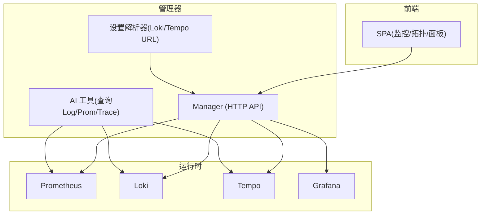
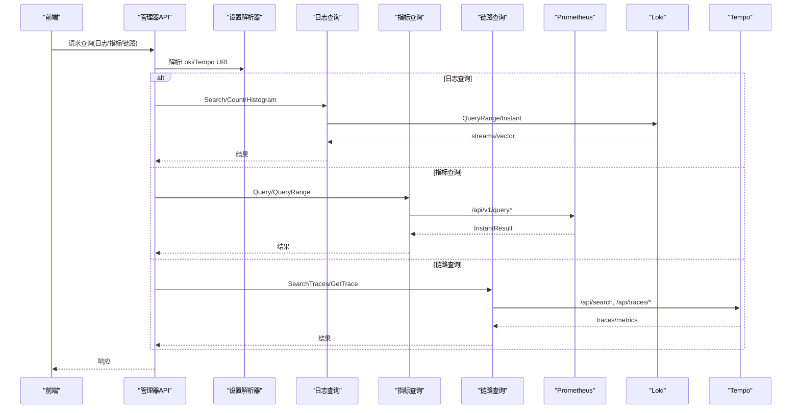
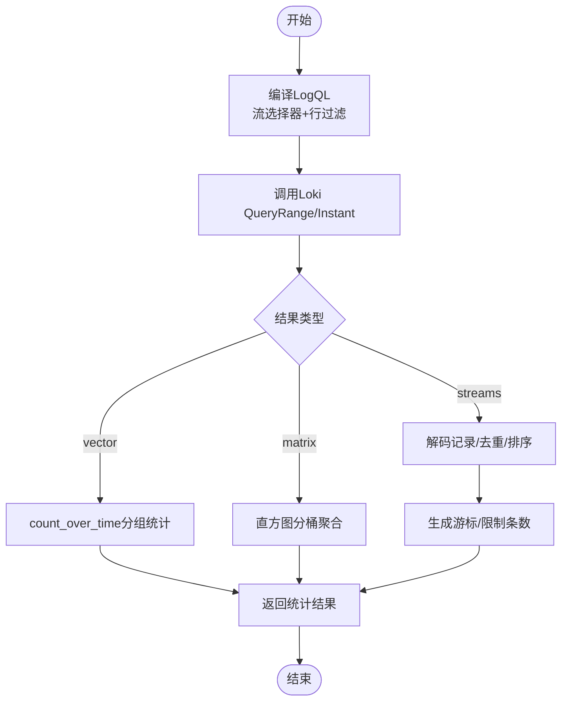
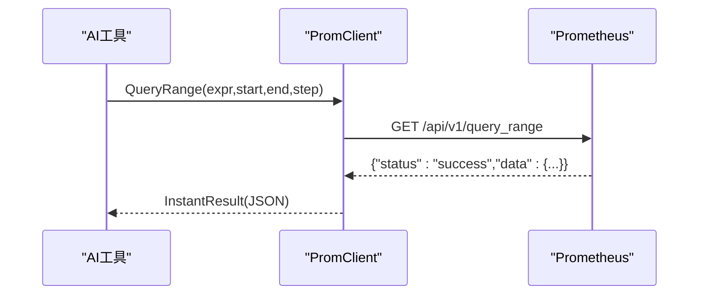
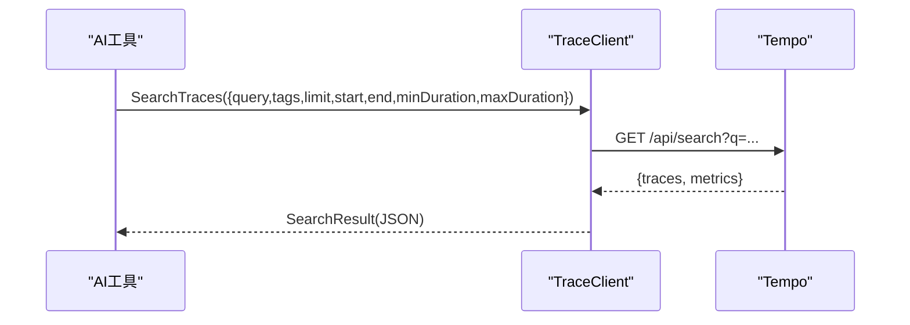
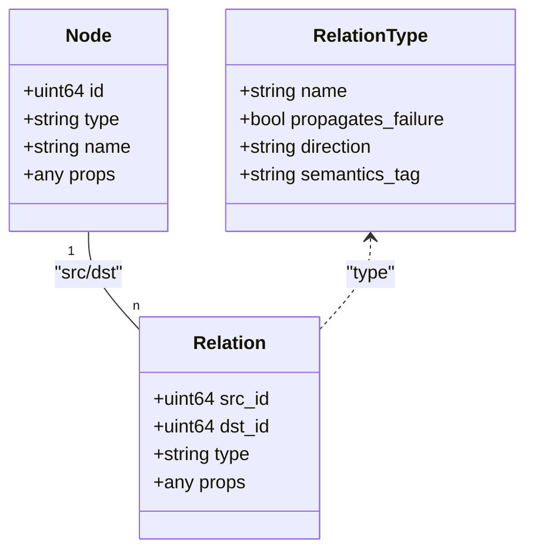
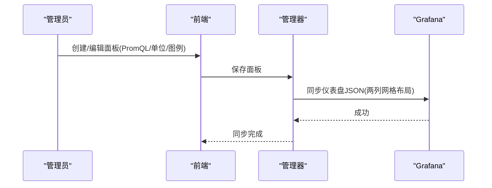
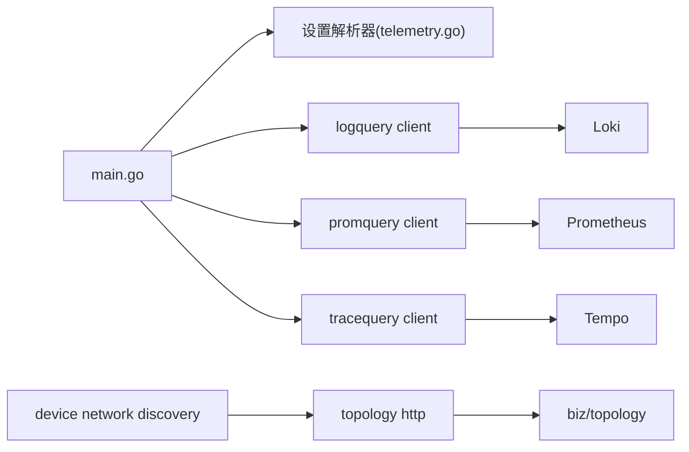

# 可观测性平台

<cite>
**本文引用的文件**
- [README.md](file://README.md)
- [main.go](file://cmd/ongrid/main.go)
- [docker-compose.yml](file://deploy/install/docker-compose.yml)
- [prometheus.yml](file://deploy/install/prometheus.yml)
- [loki-config.yaml](file://deploy/install/loki-config.yaml)
- [tempo-config.yaml](file://deploy/install/tempo-config.yaml)
- [client.go](file://internal/pkg/logquery/loki_search.go)
- [logql_portable.go](file://internal/pkg/logquery/logql_portable.go)
- [query_logql_result.go](file://internal/pkg/logquery/query_logql_result.go)
- [client.go](file://internal/pkg/promquery/client.go)
- [client.go](file://internal/pkg/tracequery/client.go)
- [http.go](file://internal/manager/server/topology/http.go)
- [Graph.tsx](file://web/src/components/topology/Graph.tsx)
- [NodeNeighbors.tsx](file://web/src/components/topology/NodeNeighbors.tsx)
- [EdgeDetail.tsx](file://web/src/pages/EdgeDetail.tsx)
- [service.go](file://internal/manager/biz/grafana/service.go)
- [monitor_test.go](file://internal/manager/biz/grafana/monitor_test.go)
- [grafana.ts](file://web/src/api/grafana.ts)
- [Monitor.tsx](file://web/src/pages/Monitor.tsx)
- [model.go](file://internal/manager/model/monitor/model.go)
- [telemetry.go](file://internal/manager/biz/setting/telemetry.go)
- [probe.go](file://internal/manager/biz/setting/probe.go)
- [model.go](file://internal/manager/model/setting/model.go)
- [http.go](file://internal/manager/server/integration/http.go)
- [query_promql.go](file://internal/manager/biz/aiops/tools/query_promql.go)
- [pipeline.go](file://internal/manager/biz/alert/pipeline.go)
- [evaluators_phaseB.go](file://internal/manager/biz/alert/evaluators_phaseB.go)
- [query_traceql_basetool.go](file://internal/manager/biz/aiops/tools/query_traceql_basetool.go)
- [query_traceql.go](file://internal/manager/biz/aiops/tools/query_traceql.go)
- [query_logql.go](file://internal/manager/biz/aiops/tools/query_logql.go)
- [network_discovery.go](file://internal/manager/biz/device/network_discovery.go)
- [network_inventory_basetool.go](file://internal/manager/biz/aiops/tools/network_inventory_basetool.go)
</cite>

## 目录
1. [简介](#简介)
2. [项目结构](#项目结构)
3. [核心组件](#核心组件)
4. [架构总览](#架构总览)
5. [详细组件分析](#详细组件分析)
6. [依赖关系分析](#依赖关系分析)
7. [性能考量](#性能考量)
8. [故障排查指南](#故障排查指南)
9. [结论](#结论)
10. [附录](#附录)

## 简介
本技术文档面向 Ongrid 可观测性平台，系统性说明与 Prometheus、Loki、Tempo 等后端的集成方案，覆盖数据接入、查询处理与可视化展示。文档重点解释 LogQL、PromQL 与 TraceQL 的查询能力实现，拓扑可视化的设备发现、关系映射与影响面分析原理，以及自定义仪表板与 Grafana 集成方法。同时提供查询示例与性能优化建议，帮助利用可观测性数据进行故障诊断与性能分析。

## 项目结构
Ongrid 将可观测性作为内置能力：容器编排中运行 Prometheus/Loki/Tempo/Grafana；管理器通过 HTTP API 暴露日志、指标、链路查询能力；前端 SPA 提供监控页、拓扑图与 Grafana 内嵌面板渲染。关键目录与职责：
- deploy/install：生产级 docker-compose 与后端服务配置（Prometheus/Loki/Tempo/Grafana）
- internal/pkg：通用客户端库（logquery、promquery、tracequery）
- internal/manager：业务层（告警、AI 工具、Grafana 同步、拓扑、设置解析器）
- web：前端页面与组件（监控、拓扑、Grafana 面板渲染）

图表来源
- [docker-compose.yml:339-426](file://deploy/install/docker-compose.yml#L339-L426)
- [main.go:231-246](file://cmd/ongrid/main.go#L231-L246)
- [telemetry.go:42-83](file://internal/manager/biz/setting/telemetry.go#L42-L83)

章节来源
- [docker-compose.yml:20-528](file://deploy/install/docker-compose.yml#L20-L528)
- [main.go:208-246](file://cmd/ongrid/main.go#L208-L246)

## 核心组件
- 日志查询（Loki）：统一 Search/Histogram/Count 接口，内部编译为 LogQL 并调用 Loki QueryRange/Instant；支持游标分页、字段映射、结构化元数据提取。
- 指标查询（Prometheus）：封装 /api/v1/query 与 /api/v1/query_range，返回 InstantResult 原始 JSON，便于 AI 工具直接消费。
- 链路查询（Tempo）：封装 /api/search 与 /api/traces/<id>，支持 TraceQL 表达式或标签匹配，返回 traces/metrics 原始 JSON。
- 拓扑服务：节点/关系/关系类型 CRUD，支撑网络发现、邻接关系与影响面分析。
- Grafana 集成：用户面板到 ongrid-monitor 仪表盘的双向镜像，前端可原生渲染 Grafana JSON 面板。

章节来源
- [client.go:31-118](file://internal/pkg/logquery/loki_search.go#L31-L118)
- [client.go:94-117](file://internal/pkg/promquery/client.go#L94-L117)
- [client.go:112-157](file://internal/pkg/tracequery/client.go#L112-L157)
- [http.go:48-76](file://internal/manager/server/topology/http.go#L48-L76)
- [service.go:607-651](file://internal/manager/biz/grafana/service.go#L607-L651)

## 架构总览
管理器启动时初始化 OTel 追踪端点（默认 tempo:4318），并通过设置解析器动态获取 Loki/Tempo 查询地址；Prometheus 作为云侧指标中心接收 remote_write 并对外提供 PromQL；Loki/Tempo 仅内部端口暴露，外部访问经 nginx 鉴权转发；Grafana 预置数据源并支持自动创建 SA Token 以同步仪表盘。

图表来源
- [main.go:231-246](file://cmd/ongrid/main.go#L231-L246)
- [telemetry.go:42-83](file://internal/manager/biz/setting/telemetry.go#L42-L83)
- [client.go:31-118](file://internal/pkg/logquery/loki_search.go#L31-L118)
- [client.go:94-117](file://internal/pkg/promquery/client.go#L94-L117)
- [client.go:112-157](file://internal/pkg/tracequery/client.go#L112-L157)

## 详细组件分析

### 日志查询（LogQL）
- 查询编译：将结构化过滤、关键词包含/排除、作用域（device_id、namespace、workload 等）编译为 LogQL 流选择器与行过滤器，优先使用索引标签，非索引字段走行过滤。
- 分页与游标：基于时间戳与 skip 计数生成 cursor，保证前后向翻页不丢不漏。
- 统计与直方图：count_over_time + sum by 分组；按区间对齐计算 histogram buckets。
- 结果归一化：从 Loki streams 解码为 Record，抽取资源属性、级别、trace/span ID，屏蔽内部字段。

图表来源
- [client.go:390-526](file://internal/pkg/logquery/loki_search.go#L390-L526)
- [client.go:130-230](file://internal/pkg/logquery/loki_search.go#L130-L230)
- [client.go:318-388](file://internal/pkg/logquery/loki_search.go#L318-L388)
- [client.go:563-644](file://internal/pkg/logquery/loki_search.go#L563-L644)

章节来源
- [client.go:31-118](file://internal/pkg/logquery/loki_search.go#L31-L118)
- [client.go:390-526](file://internal/pkg/logquery/loki_search.go#L390-L526)
- [client.go:563-644](file://internal/pkg/logquery/loki_search.go#L563-L644)
- [logql_portable.go:11-17](file://internal/pkg/logquery/logql_portable.go#L11-L17)
- [query_logql_result.go:1-11](file://internal/pkg/logquery/query_logql_result.go#L1-L11)

### 指标查询（PromQL）
- 客户端封装：支持即时查询与范围查询，超时保护，错误体解析。
- AI 工具集成：query_promql 工具将 PromQL 表达式转换为 QueryRange/Query，并以 InstantResult 原始 JSON 返回给模型。
- 告警评估：PipelineEvaluator 执行 metric_raw 规则，对 vector 结果逐条目触发 incident，结合上一轮结果做恢复。

图表来源
- [client.go:94-117](file://internal/pkg/promquery/client.go#L94-L117)
- [client.go:120-167](file://internal/pkg/promquery/client.go#L120-L167)
- [query_promql.go:106-131](file://internal/manager/biz/aiops/tools/query_promql.go#L106-L131)
- [pipeline.go:282-319](file://internal/manager/biz/alert/pipeline.go#L282-L319)

章节来源
- [client.go:94-167](file://internal/pkg/promquery/client.go#L94-L167)
- [query_promql.go:106-131](file://internal/manager/biz/aiops/tools/query_promql.go#L106-L131)
- [pipeline.go:282-319](file://internal/manager/biz/alert/pipeline.go#L282-L319)
- [evaluators_phaseB.go:404-435](file://internal/manager/biz/alert/evaluators_phaseB.go#L404-L435)

### 链路查询（TraceQL）
- 搜索：支持 TraceQL 表达式或标签键值对，限制条数、时间窗口、最小/最大耗时过滤。
- 详情：按 traceID 获取完整 OTLP 形状 JSON。
- AI 工具：query_traceql 工具将 service/operation/duration/device_id 等参数转为 TraceQL，并返回搜索结果。

图表来源
- [client.go:112-157](file://internal/pkg/tracequery/client.go#L112-L157)
- [client.go:187-201](file://internal/pkg/tracequery/client.go#L187-L201)
- [query_traceql.go:255-275](file://internal/manager/biz/aiops/tools/query_traceql.go#L255-L275)
- [query_traceql_basetool.go:49-66](file://internal/manager/biz/aiops/tools/query_traceql_basetool.go#L49-L66)

章节来源
- [client.go:112-157](file://internal/pkg/tracequery/client.go#L112-L157)
- [client.go:187-201](file://internal/pkg/tracequery/client.go#L187-L201)
- [query_traceql.go:77-88](file://internal/manager/biz/aiops/tools/query_traceql.go#L77-L88)
- [query_traceql.go:255-275](file://internal/manager/biz/aiops/tools/query_traceql.go#L255-L275)

### 拓扑可视化与影响面分析
- 数据模型：节点（设备/集群/网络设备等）、关系（depends_on/routes_to/member_of/connected_to 等）、关系类型（含传播失败、方向、语义标签）。
- 设备发现：Edge 上报 ARP/网关/SNMP 观察，形成候选项，验证后提升为设备并映射到拓扑节点。
- 邻接与影响面：通过 connected_to 关系获取网络邻接；通过 depends_on 等关系进行影响面扩散。
- 前端渲染：Graph 组件根据节点类型与层级布局，支持隐藏孤立节点与关系类型筛选；NodeNeighbors 卡片列出某节点的所有关系。

图表来源
- [http.go:96-165](file://internal/manager/server/topology/http.go#L96-L165)
- [http.go:169-406](file://internal/manager/server/topology/http.go#L169-L406)
- [http.go:410-549](file://internal/manager/server/topology/http.go#L410-L549)

章节来源
- [http.go:48-76](file://internal/manager/server/topology/http.go#L48-L76)
- [http.go:169-406](file://internal/manager/server/topology/http.go#L169-L406)
- [http.go:410-549](file://internal/manager/server/topology/http.go#L410-L549)
- [Graph.tsx:117-206](file://web/src/components/topology/Graph.tsx#L117-L206)
- [NodeNeighbors.tsx:1-33](file://web/src/components/topology/NodeNeighbors.tsx#L1-L33)
- [EdgeDetail.tsx:1314-1356](file://web/src/pages/EdgeDetail.tsx#L1314-L1356)
- [network_discovery.go:64-101](file://internal/manager/biz/device/network_discovery.go#L64-L101)
- [network_inventory_basetool.go:387-424](file://internal/manager/biz/aiops/tools/network_inventory_basetool.go#L387-L424)

### Grafana 集成与自定义仪表板
- 数据源：Grafana 预置 Prometheus/Loki/Tempo 数据源，环境变量注入 URL。
- 仪表盘同步：管理器将用户定义的 Monitor 面板（PromQL、单位、图例）渲染为 Grafana Dashboard JSON，按两列网格布局写入 ongrid-monitor 仪表盘。
- 前端渲染：SPA 可直接读取 Grafana 面板 JSON 并原生渲染时序/统计/仪表盘等类型，未知字段忽略以保持版本兼容。
- 首次引导：若配置了 Bootstrap 密码，管理器在后台创建 ServiceAccount 并推送默认仪表盘。

图表来源
- [docker-compose.yml:470-519](file://deploy/install/docker-compose.yml#L470-L519)
- [service.go:607-651](file://internal/manager/biz/grafana/service.go#L607-L651)
- [monitor_test.go:14-68](file://internal/manager/biz/grafana/monitor_test.go#L14-L68)
- [grafana.ts:1-43](file://web/src/api/grafana.ts#L1-L43)
- [Monitor.tsx:613-652](file://web/src/pages/Monitor.tsx#L613-L652)
- [model.go:23-42](file://internal/manager/model/monitor/model.go#L23-L42)

章节来源
- [docker-compose.yml:470-519](file://deploy/install/docker-compose.yml#L470-L519)
- [service.go:607-651](file://internal/manager/biz/grafana/service.go#L607-L651)
- [monitor_test.go:14-68](file://internal/manager/biz/grafana/monitor_test.go#L14-L68)
- [grafana.ts:1-43](file://web/src/api/grafana.ts#L1-L43)
- [Monitor.tsx:613-652](file://web/src/pages/Monitor.tsx#L613-L652)
- [model.go:23-42](file://internal/manager/model/monitor/model.go#L23-L42)

### 后端配置与接入
- Prometheus：启用 remote_write receiver，自拉取 manager 指标，加载告警规则。
- Loki：单二进制部署，开启 OTLP 结构化元数据，限制 cardinality 与查询规模，保留期 30 天。
- Tempo：OTLP gRPC/HTTP 接收，spanmetrics 与 service-graph 生成指标回写 Prometheus，块保留 7 天。

章节来源
- [prometheus.yml:1-36](file://deploy/install/prometheus.yml#L1-L36)
- [loki-config.yaml:1-76](file://deploy/install/loki-config.yaml#L1-L76)
- [tempo-config.yaml:1-77](file://deploy/install/tempo-config.yaml#L1-L77)

## 依赖关系分析
- 管理器依赖设置解析器动态获取 Loki/Tempo URL，避免硬编码；Prometheus URL 支持查询与远程写入分离。
- 日志/指标/链路查询均通过独立客户端包解耦后端细节，便于替换与测试。
- 拓扑服务与设备发现模块协作，将 Edge 上报的网络邻接转化为拓扑关系，供前端渲染与影响面分析。

图表来源
- [main.go:231-246](file://cmd/ongrid/main.go#L231-L246)
- [telemetry.go:42-83](file://internal/manager/biz/setting/telemetry.go#L42-L83)
- [client.go:31-118](file://internal/pkg/logquery/loki_search.go#L31-L118)
- [client.go:94-117](file://internal/pkg/promquery/client.go#L94-L117)
- [client.go:112-157](file://internal/pkg/tracequery/client.go#L112-L157)
- [http.go:48-76](file://internal/manager/server/topology/http.go#L48-L76)
- [network_discovery.go:64-101](file://internal/manager/biz/device/network_discovery.go#L64-L101)

章节来源
- [main.go:231-246](file://cmd/ongrid/main.go#L231-L246)
- [telemetry.go:42-83](file://internal/manager/biz/setting/telemetry.go#L42-L83)
- [http.go:48-76](file://internal/manager/server/topology/http.go#L48-L76)
- [network_discovery.go:64-101](file://internal/manager/biz/device/network_discovery.go#L64-L101)

## 性能考量
- 查询超时：Prom/Trace 客户端默认 30s 超时，避免长尾阻塞；LogQL 查询限制最大行数与扫描记录上限。
- 分页与游标：日志查询使用 cursor 避免重复与遗漏，适合大结果集滚动浏览。
- 指标采样：Prometheus 拉取间隔与评估间隔可调；告警评估周期可通过环境变量控制，降低噪声。
- 存储保留：Loki 30 天、Tempo 7 天，合理平衡成本与可追溯性；Prom TSDB 容量与时间保留需按负载规划。
- 拓扑渲染：前端支持隐藏孤立节点与关系类型筛选，减少大图渲染压力。

[本节为通用指导，无需特定文件引用]

## 故障排查指南
- 连接性与鉴权：
  - 使用集成探测接口校验 Loki/Tempo 可达性与鉴权（GET /ready 或空 OTLP 导出）。
  - 检查 docker-compose 中各服务端口与卷挂载是否正确。
- 查询失败：
  - LogQL 编译失败：检查作用域字段映射与转义；确认索引标签是否存在。
  - PromQL 解析错误：查看返回 errorType/error；调整表达式或 step。
  - TraceQL 无结果：确认时间窗口、标签维度与 duration 过滤是否过严。
- 告警异常：
  - 检查 metric_raw 规则表达式与 Prom 返回值类型是否为 vector。
  - 评估间隔与冷却时间设置是否导致频繁触发或未恢复。
- 仪表盘不同步：
  - 确认 Grafana 子路径与 Root URL 配置一致；检查 SA Token 是否有效。
  - 查看面板 last_sync_error 定位最近一次同步失败原因。

章节来源
- [probe.go:83-106](file://internal/manager/biz/setting/probe.go#L83-L106)
- [http.go:42-67](file://internal/manager/server/integration/http.go#L42-L67)
- [client.go:390-526](file://internal/pkg/logquery/loki_search.go#L390-L526)
- [client.go:120-167](file://internal/pkg/promquery/client.go#L120-L167)
- [client.go:203-243](file://internal/pkg/tracequery/client.go#L203-L243)
- [pipeline.go:282-319](file://internal/manager/biz/alert/pipeline.go#L282-L319)
- [monitor_test.go:14-68](file://internal/manager/biz/grafana/monitor_test.go#L14-L68)

## 结论
Ongrid 将 Prometheus/Loki/Tempo/Grafana 深度整合，提供统一的日志、指标、链路查询与拓扑可视化能力。通过设置解析器与客户端抽象，系统具备高可插拔性与可维护性；AI 工具链可直接消费后端查询结果，加速根因定位。配合合理的保留策略与查询优化，可在成本可控的前提下实现高效的可观测性闭环。

[本节为总结，无需特定文件引用]

## 附录

### 查询示例（概念性）
- LogQL：按设备与级别过滤并包含关键字
  - 示例思路：{device_id="123", level="error"} |~ "(?i)timeout"
- PromQL：计算 CPU 使用率均值
  - 示例思路：avg(rate(process_cpu_seconds_total[5m])) by (instance)
- TraceQL：查找慢请求
  - 示例思路：{resource.service.name = "web" && duration > 500ms}

[本节为概念性示例，无需特定文件引用]

### 性能优化建议
- 日志：优先使用索引标签过滤；限制查询窗口与 limit；合理使用直方图分桶。
- 指标：选择合适的 step；避免过度聚合；合理设置评估间隔与告警冷却。
- 链路：限定时间窗口与耗时范围；按需检索 tags 而非全量 TraceQL。
- 拓扑：隐藏无关关系类型；限制邻接数量；增量加载节点详情。

[本节为通用指导，无需特定文件引用]