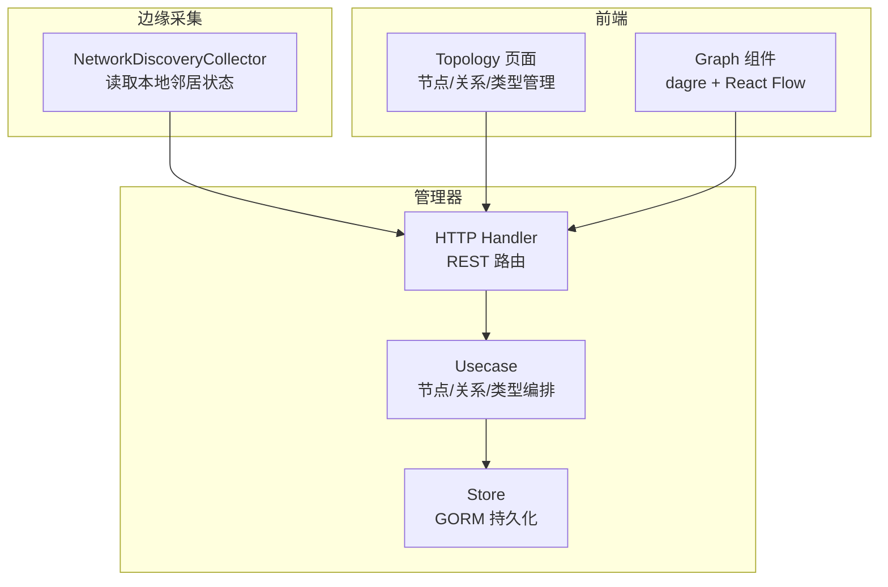
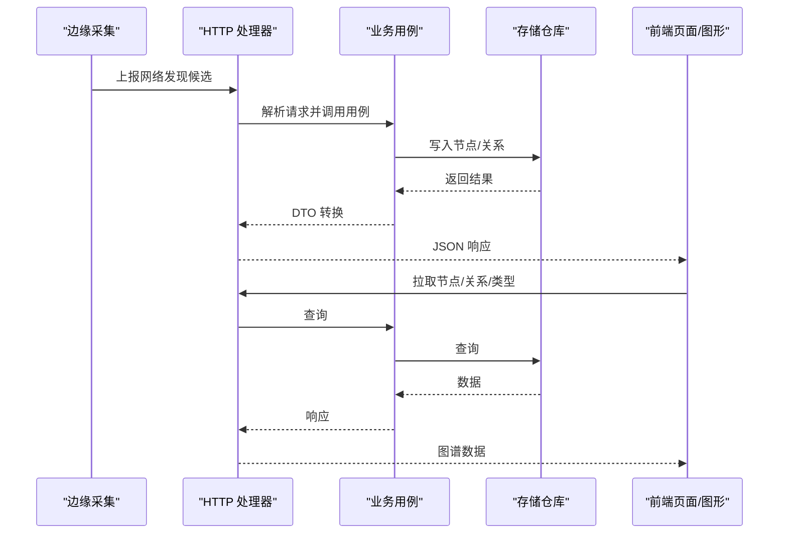
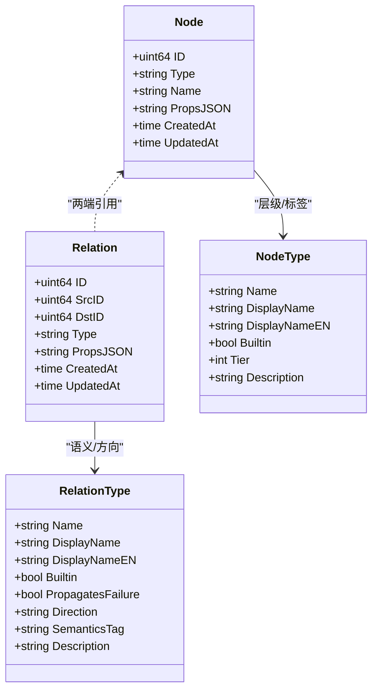
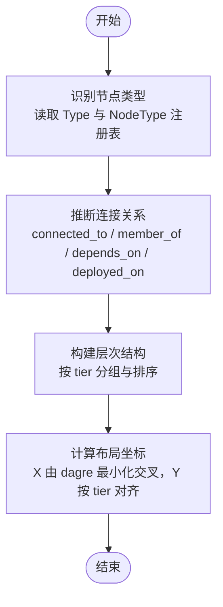
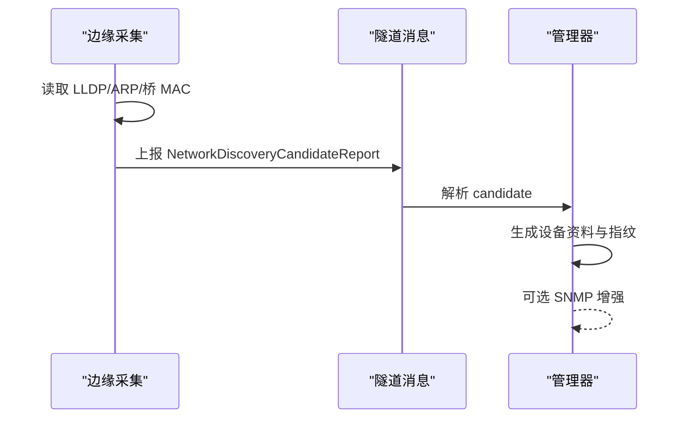
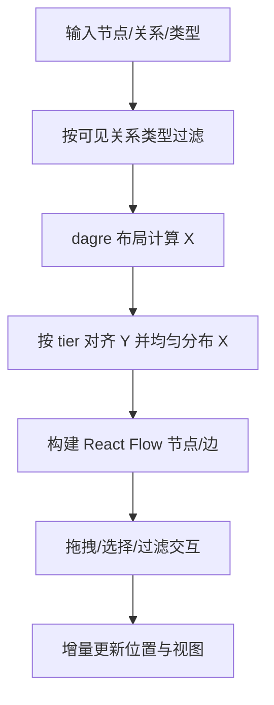
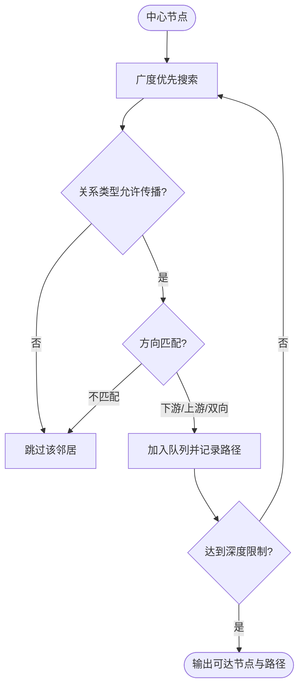
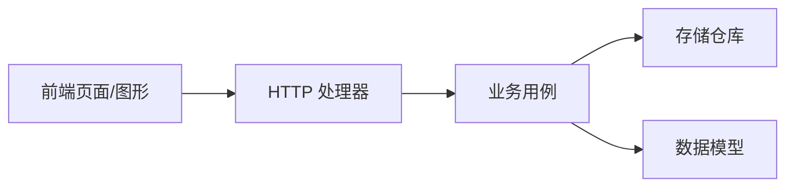

# 拓扑可视化

<cite>
**本文引用的文件**
- [internal/manager/model/topology/model.go](file://internal/manager/model/topology/model.go)
- [internal/manager/biz/topology/usecase.go](file://internal/manager/biz/topology/usecase.go)
- [internal/manager/data/topology/store/node_repo.go](file://internal/manager/data/topology/store/node_repo.go)
- [internal/manager/server/topology/http.go](file://internal/manager/server/topology/http.go)
- [web/src/api/topology.ts](file://web/src/api/topology.ts)
- [web/src/pages/Topology.tsx](file://web/src/pages/Topology.tsx)
- [web/src/components/topology/Graph.tsx](file://web/src/components/topology/Graph.tsx)
- [internal/edgeagent/collector/network_discovery.go](file://internal/edgeagent/collector/network_discovery.go)
- [internal/pkg/tunnel/messages.go](file://internal/pkg/tunnel/messages.go)
- [internal/manager/biz/device/network_discovery.go](file://internal/manager/biz/device/network_discovery.go)
- [api/tunnel/v1/tunnel.proto](file://api/tunnel/v1/tunnel.proto)
- [internal/manager/biz/aiops/tools/expand_topology_basetool.go](file://internal/manager/biz/aiops/tools/expand_topology_basetool.go)
</cite>

## 目录
1. [简介](#简介)
2. [项目结构](#项目结构)
3. [核心组件](#核心组件)
4. [架构总览](#架构总览)
5. [详细组件分析](#详细组件分析)
6. [依赖关系分析](#依赖关系分析)
7. [性能考虑](#性能考虑)
8. [故障排查指南](#故障排查指南)
9. [结论](#结论)
10. [附录：API 接口定义与使用示例](#附录api-接口定义与使用示例)

## 简介
本技术文档围绕“拓扑可视化系统”展开，覆盖网络拓扑发现、拓扑数据构建算法、可视化渲染原理、API 接口与使用方式，以及基于拓扑的故障影响分析、变更风险评估和网络优化实践。系统采用“属性图”模型：节点表示设备/服务/集群/应用等实体，边表示关系（如依赖、部署、路由、监控、复制、连接），关系类型声明了故障传播方向与语义标签，从而支撑上层 AIOps 推理与可视化展示。

## 项目结构
拓扑能力横跨边缘采集、管理器业务层、存储层、HTTP API、前端页面与图形渲染：
- 边缘侧负责被动收集邻居信息并上报候选设备
- 管理器将候选设备转化为通用拓扑节点与关系
- HTTP 层暴露节点、关系、关系类型、节点类型的 CRUD
- 前端提供图谱、节点列表、关系类型管理等界面，并使用 dagre + React Flow 进行布局与交互

图表来源
- [internal/edgeagent/collector/network_discovery.go:18-41](file://internal/edgeagent/collector/network_discovery.go#L18-L41)
- [internal/manager/server/topology/http.go:48-76](file://internal/manager/server/topology/http.go#L48-L76)
- [internal/manager/biz/topology/usecase.go:15-38](file://internal/manager/biz/topology/usecase.go#L15-L38)
- [internal/manager/data/topology/store/node_repo.go:16-22](file://internal/manager/data/topology/store/node_repo.go#L16-L22)
- [web/src/pages/Topology.tsx:41-83](file://web/src/pages/Topology.tsx#L41-L83)
- [web/src/components/topology/Graph.tsx:208-231](file://web/src/components/topology/Graph.tsx#L208-L231)

章节来源
- [internal/manager/server/topology/http.go:48-76](file://internal/manager/server/topology/http.go#L48-L76)
- [web/src/pages/Topology.tsx:41-83](file://web/src/pages/Topology.tsx#L41-L83)

## 核心组件
- 拓扑数据模型：节点、关系、关系类型、节点类型，定义了内置类型、方向、语义标签与层级
- 业务用例：节点/关系/类型的增删改查、设备镜像、Kubernetes 集群镜像、成员关系维护、删除保护
- 存储仓库：基于 GORM 的节点仓库实现，支持过滤、分页、计数与事务性删除保护
- HTTP 处理器：认证、鉴权、参数解析、DTO 转换、错误码映射
- 前端 API 客户端：封装节点、关系、类型查询与创建
- 前端页面与图形：图谱页、节点详情抽屉、关系类型管理；Graph 组件使用 dagre 布局与 React Flow 渲染

章节来源
- [internal/manager/model/topology/model.go:27-41](file://internal/manager/model/topology/model.go#L27-L41)
- [internal/manager/model/topology/model.go:136-168](file://internal/manager/model/topology/model.go#L136-L168)
- [internal/manager/model/topology/model.go:219-330](file://internal/manager/model/topology/model.go#L219-L330)
- [internal/manager/biz/topology/usecase.go:48-146](file://internal/manager/biz/topology/usecase.go#L48-L146)
- [internal/manager/data/topology/store/node_repo.go:68-93](file://internal/manager/data/topology/store/node_repo.go#L68-L93)
- [internal/manager/server/topology/http.go:169-285](file://internal/manager/server/topology/http.go#L169-L285)
- [web/src/api/topology.ts:23-47](file://web/src/api/topology.ts#L23-L47)
- [web/src/pages/Topology.tsx:178-313](file://web/src/pages/Topology.tsx#L178-L313)

## 架构总览
拓扑系统以“属性图”为核心，上游通过边缘采集与外部系统（如 Kubernetes）注入节点与关系，管理器统一校验与持久化，前端通过 REST API 获取数据并进行可视化。AIOps 工具基于关系类型的方向与语义标签进行影响面扩展。

图表来源
- [internal/edgeagent/collector/network_discovery.go:18-41](file://internal/edgeagent/collector/network_discovery.go#L18-L41)
- [internal/manager/server/topology/http.go:48-76](file://internal/manager/server/topology/http.go#L48-L76)
- [internal/manager/biz/topology/usecase.go:48-146](file://internal/manager/biz/topology/usecase.go#L48-L146)
- [internal/manager/data/topology/store/node_repo.go:68-93](file://internal/manager/data/topology/store/node_repo.go#L68-L93)
- [web/src/pages/Topology.tsx:178-313](file://web/src/pages/Topology.tsx#L178-L313)

## 详细组件分析

### 拓扑数据模型与层次结构
- 节点类型：内置应用、服务、集群、设备、机架，分别对应不同层级 tier，用于可视化分层布局
- 关系类型：内置成员属于、依赖、部署于、复制到、监控、路由到、连接到；每个类型声明是否传播故障、方向与语义标签
- 节点类型与关系类型共同构成可配置的“图谱元数据”，前端据此生成 chip 标签与布局层级

图表来源
- [internal/manager/model/topology/model.go:43-78](file://internal/manager/model/topology/model.go#L43-L78)
- [internal/manager/model/topology/model.go:136-168](file://internal/manager/model/topology/model.go#L136-L168)
- [internal/manager/model/topology/model.go:219-330](file://internal/manager/model/topology/model.go#L219-L330)

章节来源
- [internal/manager/model/topology/model.go:27-41](file://internal/manager/model/topology/model.go#L27-L41)
- [internal/manager/model/topology/model.go:136-168](file://internal/manager/model/topology/model.go#L136-L168)
- [internal/manager/model/topology/model.go:219-330](file://internal/manager/model/topology/model.go#L219-L330)

### 拓扑数据构建算法
- 节点类型识别：从节点 Type 字段与 NodeType 注册表确定显示名称与层级 tier
- 连接关系推断：
  - 设备间物理连接通过 EnsureDeviceConnection 去重并规范化为 connected_to 关系
  - 设备归属集群通过 member_of 关系维护，支持 edge_enrollment 与 kubernetes 来源区分
  - 设备镜像 EnsureNodeForDevice/EnsureNetworkDeviceNode 将设备映射为拓扑节点
- 层次结构生成：NodeType.Tier 决定可视化分层；前端按 tier 分组排序并均匀分布

图表来源
- [internal/manager/biz/topology/usecase.go:222-246](file://internal/manager/biz/topology/usecase.go#L222-L246)
- [internal/manager/biz/topology/usecase.go:294-370](file://internal/manager/biz/topology/usecase.go#L294-L370)
- [internal/manager/model/topology/model.go:136-168](file://internal/manager/model/topology/model.go#L136-L168)
- [web/src/components/topology/Graph.tsx:327-447](file://web/src/components/topology/Graph.tsx#L327-L447)

章节来源
- [internal/manager/biz/topology/usecase.go:222-246](file://internal/manager/biz/topology/usecase.go#L222-L246)
- [internal/manager/biz/topology/usecase.go:294-370](file://internal/manager/biz/topology/usecase.go#L294-L370)
- [internal/manager/model/topology/model.go:136-168](file://internal/manager/model/topology/model.go#L136-L168)
- [web/src/components/topology/Graph.tsx:327-447](file://web/src/components/topology/Graph.tsx#L327-L447)

### 网络拓扑发现机制
- 边缘侧被动采集：读取本地邻居状态（LLDP、ARP、桥 MAC 等），不主动扫描网段，不发送 SNMP 凭据
- 上报格式：通过隧道消息携带候选设备信息（IP、MAC、接口、厂商、型号、序列号、系统名、描述、源数据、接口与链路）
- 管理器处理：将候选转换为设备网络资料并生成指纹，后续可由管理器触发 SNMP 增强

图表来源
- [internal/edgeagent/collector/network_discovery.go:18-41](file://internal/edgeagent/collector/network_discovery.go#L18-L41)
- [internal/pkg/tunnel/messages.go:446-465](file://internal/pkg/tunnel/messages.go#L446-L465)
- [internal/manager/biz/device/network_discovery.go:505-542](file://internal/manager/biz/device/network_discovery.go#L505-L542)
- [api/tunnel/v1/tunnel.proto:453-472](file://api/tunnel/v1/tunnel.proto#L453-L472)

章节来源
- [internal/edgeagent/collector/network_discovery.go:18-41](file://internal/edgeagent/collector/network_discovery.go#L18-L41)
- [internal/pkg/tunnel/messages.go:446-465](file://internal/pkg/tunnel/messages.go#L446-L465)
- [internal/manager/biz/device/network_discovery.go:505-542](file://internal/manager/biz/device/network_discovery.go#L505-L542)
- [api/tunnel/v1/tunnel.proto:453-472](file://api/tunnel/v1/tunnel.proto#L453-L472)

### 可视化渲染实现原理
- 布局算法：使用 dagre 计算 X 坐标以最小化边交叉；按节点类型 tier 将 Y 坐标对齐到层级带；同层内按 dagre X 稳定排序并均匀间距
- 交互操作：React Flow 控制节点拖拽位置，独立保存 draggedPositions 避免每次渲染回弹；支持隐藏孤立节点、按关系类型过滤
- 数据更新：前端根据服务器拓扑数据重建图，颜色与选择环在渲染前预计算，减少组件内部状态复杂度

图表来源
- [web/src/components/topology/Graph.tsx:208-231](file://web/src/components/topology/Graph.tsx#L208-L231)
- [web/src/components/topology/Graph.tsx:311-447](file://web/src/components/topology/Graph.tsx#L311-L447)

章节来源
- [web/src/components/topology/Graph.tsx:208-231](file://web/src/components/topology/Graph.tsx#L208-L231)
- [web/src/components/topology/Graph.tsx:311-447](file://web/src/components/topology/Graph.tsx#L311-L447)

### 故障影响分析与变更风险评估
- 影响面扩展：BFS 遍历拓扑，依据关系类型的方向与是否传播故障，沿上下游或双向扩展，记录路径元数据（跳数、关系类型、语义标签、传播标志、到达方向）
- 变更风险评估：结合 member_of 与 deployed_on 等关系，评估变更对所属集群与宿主的影响范围；仅传播关系参与风险扩散
- 使用场景：告警根因定位、批量升级影响面评估、依赖链断裂检测

图表来源
- [internal/manager/biz/aiops/tools/expand_topology_basetool.go:208-259](file://internal/manager/biz/aiops/tools/expand_topology_basetool.go#L208-L259)

章节来源
- [internal/manager/biz/aiops/tools/expand_topology_basetool.go:208-259](file://internal/manager/biz/aiops/tools/expand_topology_basetool.go#L208-L259)

### 大规模拓扑的性能优化方案
- 后端分页与过滤：节点与关系列表支持 limit/offset/type/q 过滤，减少传输量
- 前端布局优化：隐藏孤立节点以减少首屏拥挤；按 tier 分层降低边交叉；并行边通过曲率偏移分离标签
- 缓存与增量：前端保留拖拽位置，避免重复布局抖动；按需加载邻居节点详情，避免全量拉取
- 数据库索引：节点与关系表建立复合索引，提升查询效率

章节来源
- [internal/manager/data/topology/store/node_repo.go:68-93](file://internal/manager/data/topology/store/node_repo.go#L68-L93)
- [web/src/components/topology/Graph.tsx:311-447](file://web/src/components/topology/Graph.tsx#L311-L447)
- [web/src/pages/Topology.tsx:178-313](file://web/src/pages/Topology.tsx#L178-L313)

### 可视化定制方法
- 节点类型注册：通过 NodeType 注册表自定义类型、显示名称、层级与描述，前端自动适配 chip 与布局
- 关系类型注册：自定义关系类型需声明传播标志、方向与语义标签，确保 AIOps 推理正确
- 主题与颜色：前端根据主题模式选择节点颜色表与选择环颜色，保持可读性

章节来源
- [internal/manager/model/topology/model.go:136-168](file://internal/manager/model/topology/model.go#L136-L168)
- [internal/manager/model/topology/model.go:219-330](file://internal/manager/model/topology/model.go#L219-L330)
- [web/src/components/topology/Graph.tsx:327-447](file://web/src/components/topology/Graph.tsx#L327-L447)

## 依赖关系分析
- 模块耦合：HTTP 处理器依赖业务用例；业务用例依赖存储仓库；前端依赖 HTTP API 与类型注册表
- 外部依赖：GORM 用于持久化；dagre 用于布局；React Flow 用于交互渲染
- 潜在循环：无直接循环依赖；通过接口与包边界解耦

图表来源
- [internal/manager/server/topology/http.go:48-76](file://internal/manager/server/topology/http.go#L48-L76)
- [internal/manager/biz/topology/usecase.go:15-38](file://internal/manager/biz/topology/usecase.go#L15-L38)
- [internal/manager/data/topology/store/node_repo.go:16-22](file://internal/manager/data/topology/store/node_repo.go#L16-L22)
- [web/src/pages/Topology.tsx:41-83](file://web/src/pages/Topology.tsx#L41-L83)

章节来源
- [internal/manager/server/topology/http.go:48-76](file://internal/manager/server/topology/http.go#L48-L76)
- [internal/manager/biz/topology/usecase.go:15-38](file://internal/manager/biz/topology/usecase.go#L15-L38)
- [internal/manager/data/topology/store/node_repo.go:16-22](file://internal/manager/data/topology/store/node_repo.go#L16-L22)
- [web/src/pages/Topology.tsx:41-83](file://web/src/pages/Topology.tsx#L41-L83)

## 性能考虑
- 查询优化：使用 limit/offset 与 type/q 过滤减少数据量；关系列表支持 src_or_dst_id 单端查询
- 布局性能：dagre 仅作用于可见节点；tier 分层减少边交叉与重叠；隐藏孤立节点改善首屏体验
- 渲染性能：React Flow 节点尺寸预先设置，避免首次测量开销；颜色与选择环在布局阶段预计算
- 存储性能：GORM 查询使用索引；删除操作在事务中检查引用，防止脏数据

[本节为通用指导，无需特定文件来源]

## 故障排查指南
- 未授权/禁止访问：HTTP 处理器要求租户上下文与 admin 角色，缺失时返回未授权或禁止错误
- 无效参数：请求体 props 必须为合法 JSON；节点/关系必填字段校验失败返回 invalid
- 冲突与不存在：删除节点前需确认无关系引用；查询不存在资源返回 not-found
- 未就绪：仓库未接入时返回 not-wired-yet，需检查依赖注入

章节来源
- [internal/manager/server/topology/http.go:78-92](file://internal/manager/server/topology/http.go#L78-L92)
- [internal/manager/server/topology/http.go:651-675](file://internal/manager/server/topology/http.go#L651-L675)
- [internal/manager/biz/topology/usecase.go:50-92](file://internal/manager/biz/topology/usecase.go#L50-L92)
- [internal/manager/data/topology/store/node_repo.go:95-115](file://internal/manager/data/topology/store/node_repo.go#L95-L115)

## 结论
该系统以属性图为基石，结合边缘被动发现与管理器统一建模，提供了可扩展的拓扑数据构建与可视化能力。通过关系类型的方向与语义标签，系统能够支撑故障影响分析、变更风险评估与网络优化。前端采用 dagre + React Flow 实现高效布局与交互，配合分页、过滤与主题定制，满足大规模拓扑的展示需求。

[本节为总结，无需特定文件来源]

## 附录：API 接口定义与使用示例
- 节点
  - GET /v1/topology/nodes：列出节点，支持 type、q、limit、offset
  - GET /v1/topology/nodes/{id}：获取单个节点
  - POST /v1/topology/nodes：创建节点（admin）
  - PATCH /v1/topology/nodes/{id}：更新节点名称/属性（admin）
  - DELETE /v1/topology/nodes/{id}：删除节点（admin）
- 关系
  - GET /v1/topology/relations：列出关系，支持 src_id、dst_id、src_or_dst_id、type、limit、offset
  - GET /v1/topology/relations/{id}：获取单个关系
  - POST /v1/topology/relations：创建关系（admin）
  - PATCH /v1/topology/relations/{id}：更新关系属性（admin）
  - DELETE /v1/topology/relations/{id}：删除关系（admin）
- 关系类型
  - GET /v1/topology/relation-types：列出关系类型
  - GET /v1/topology/relation-types/{name}：获取关系类型
  - POST /v1/topology/relation-types：创建关系类型（admin）
  - DELETE /v1/topology/relation-types/{name}：删除关系类型（admin）
- 节点类型
  - GET /v1/topology/node-types：列出节点类型
  - GET /v1/topology/node-types/{name}：获取节点类型
  - POST /v1/topology/node-types：创建节点类型（admin）
  - DELETE /v1/topology/node-types/{name}：删除节点类型（admin）

使用示例（前端调用）
- 拉取节点列表：调用 listNodes({ type, q, limit, offset })
- 拉取关系列表：调用 listRelations({ src_or_dst_id, type, limit, offset })
- 拉取关系类型：调用 listRelationTypes()
- 拉取节点类型：调用 listNodeTypes()

章节来源
- [internal/manager/server/topology/http.go:48-76](file://internal/manager/server/topology/http.go#L48-L76)
- [internal/manager/server/topology/http.go:169-285](file://internal/manager/server/topology/http.go#L169-L285)
- [internal/manager/server/topology/http.go:289-406](file://internal/manager/server/topology/http.go#L289-L406)
- [internal/manager/server/topology/http.go:410-549](file://internal/manager/server/topology/http.go#L410-L549)
- [web/src/api/topology.ts:23-47](file://web/src/api/topology.ts#L23-L47)
- [web/src/api/topology.ts:65-84](file://web/src/api/topology.ts#L65-L84)
- [web/src/api/topology.ts:132-154](file://web/src/api/topology.ts#L132-L154)
- [web/src/api/topology.ts:189-209](file://web/src/api/topology.ts#L189-L209)