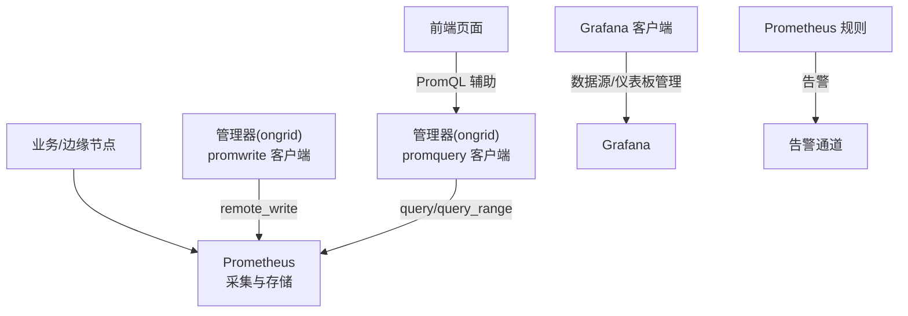
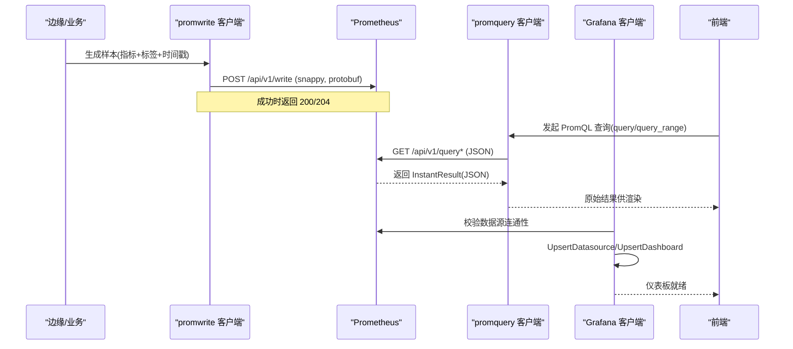
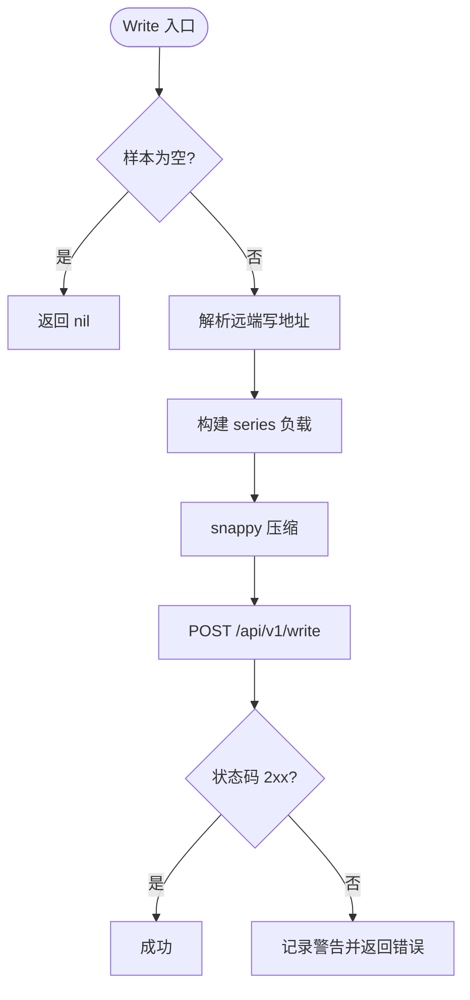
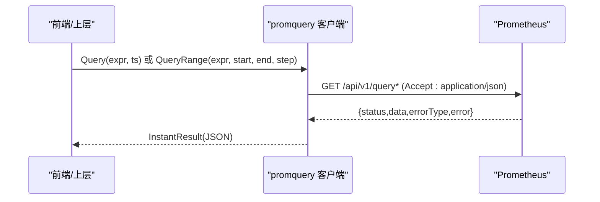
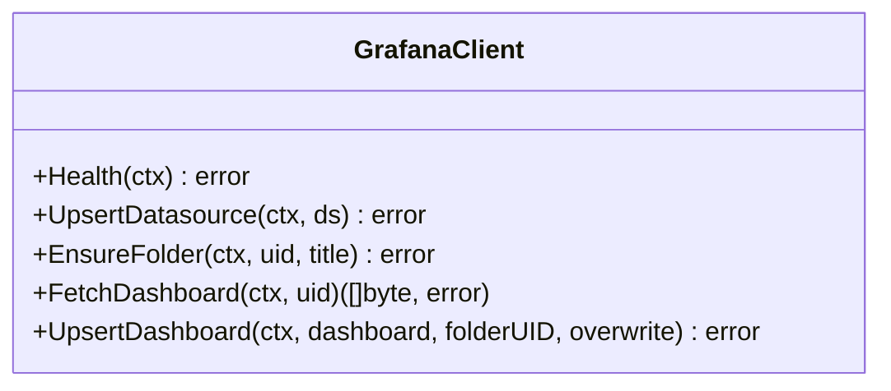
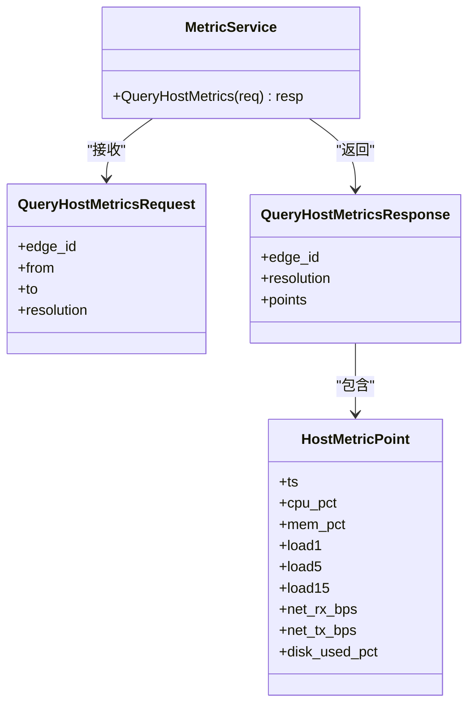
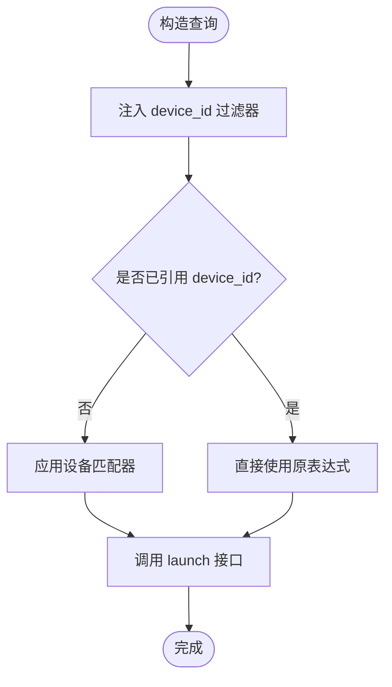
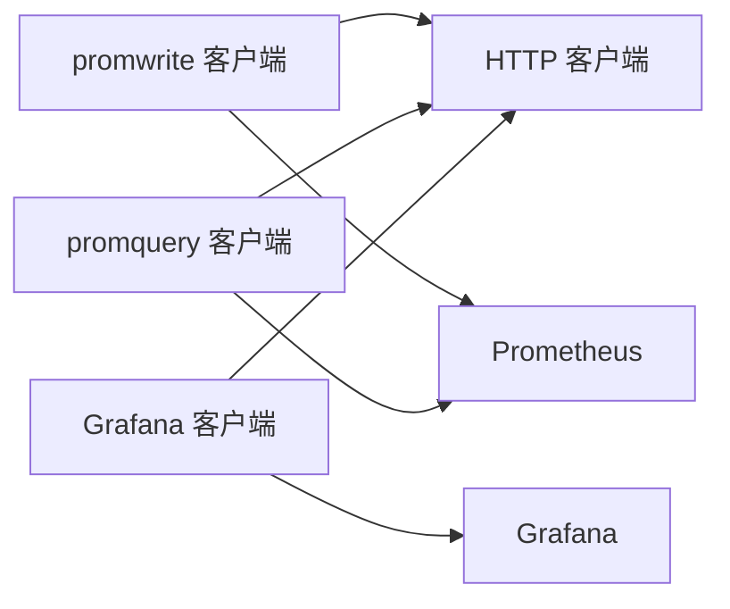

# 指标可视化

<cite>
**本文引用的文件**
- [prometheus.yml](file://deploy/install/prometheus/prometheus.yml)
- [prometheus.yml（Grafana 数据源）](file://deploy/grafana/provisioning/datasources/prometheus.yml)
- [prometheus-rules.yml](file://deploy/install/prometheus-rules.yml)
- [client.go（Prometheus 写入客户端）](file://internal/pkg/promwrite/client.go)
- [client.go（Prometheus 查询客户端）](file://internal/pkg/promquery/client.go)
- [client.go（Grafana 客户端）](file://internal/pkg/grafana/client.go)
- [metric.proto（主机指标服务定义）](file://api/manager/metric/v1/metric.proto)
- [promql.ts（PromQL 前端工具）](file://web/src/lib/promql.ts)
- [prometheus.ts（前端 Prometheus 启动接口）](file://web/src/api/prometheus.ts)
</cite>

## 目录
1. [简介](#简介)
2. [项目结构](#项目结构)
3. [核心组件](#核心组件)
4. [架构总览](#架构总览)
5. [详细组件分析](#详细组件分析)
6. [依赖关系分析](#依赖关系分析)
7. [性能考虑](#性能考虑)
8. [故障排查指南](#故障排查指南)
9. [结论](#结论)
10. [附录](#附录)

## 简介
本技术文档围绕指标可视化系统展开，重点说明与 Prometheus 的集成架构：指标采集、存储与查询机制；PromQL 查询语言在系统中的支持方式（指标选择器、聚合函数、时间范围查询）；Grafana 仪表板的自动配置与管理（数据源同步、面板模板、权限控制）；以及如何基于指标进行性能监控、容量规划与异常检测。同时提供查询优化技巧与常见问题解决方案，帮助读者快速上手并高效运维。

## 项目结构
本项目将指标相关能力拆分为多个层次：
- 采集与写入层：通过 remote_write 将指标写入 Prometheus。
- 查询与展示层：通过 HTTP API 调用 Prometheus 的 query/query_range 接口执行 PromQL，并在前端以 PromQL 辅助工具增强设备维度过滤。
- 可视化编排层：通过 Grafana 客户端管理数据源、文件夹与仪表板，实现自动化部署与同步。
- 规则与告警层：通过 Prometheus 规则文件定义自观测告警，保障系统可观测性。

图表来源
- [client.go（Prometheus 写入客户端）:126-176](file://internal/pkg/promwrite/client.go#L126-L176)
- [client.go（Prometheus 查询客户端）:94-117](file://internal/pkg/promquery/client.go#L94-L117)
- [client.go（Grafana 客户端）:125-159](file://internal/pkg/grafana/client.go#L125-L159)
- [prometheus.yml（Grafana 数据源）:1-11](file://deploy/grafana/provisioning/datasources/prometheus.yml#L1-L11)
- [prometheus-rules.yml:7-79](file://deploy/install/prometheus-rules.yml#L7-L79)

章节来源
- [prometheus.yml（Prometheus 抓取配置）:6-20](file://deploy/install/prometheus/prometheus.yml#L6-L20)
- [prometheus.yml（Grafana 数据源）:1-11](file://deploy/grafana/provisioning/datasources/prometheus.yml#L1-L11)
- [prometheus-rules.yml:7-79](file://deploy/install/prometheus-rules.yml#L7-L79)

## 核心组件
- Prometheus 写入客户端：负责将样本序列以 remote_write 协议发送到 Prometheus，支持动态端点解析与超时控制。
- Prometheus 查询客户端：封装 /api/v1/query 与 /api/v1/query_range，返回原始 JSON 结果以便上层灵活处理。
- Grafana 客户端：提供健康检查、数据源 upsert、文件夹创建、仪表板 upsert/fetch 等能力，支持服务账号或 Basic Auth。
- 主机指标服务定义：定义按时间窗口与分辨率读取主机指标的 RPC 契约，用于后端聚合表选择与响应结构。
- 前端 PromQL 工具：提供设备维度过滤器注入与引用检测，便于在 UI 中安全地拼接设备标签。
- 前端 Prometheus 启动接口：提供从 UI 触发 PromQL 查询并跳转至 Prometheus 的能力。

章节来源
- [client.go（Prometheus 写入客户端）:17-176](file://internal/pkg/promwrite/client.go#L17-L176)
- [client.go（Prometheus 查询客户端）:17-168](file://internal/pkg/promquery/client.go#L17-L168)
- [client.go（Grafana 客户端）:1-367](file://internal/pkg/grafana/client.go#L1-L367)
- [metric.proto:9-55](file://api/manager/metric/v1/metric.proto#L9-L55)
- [promql.ts:1-43](file://web/src/lib/promql.ts#L1-L43)
- [prometheus.ts:1-13](file://web/src/api/prometheus.ts#L1-L13)

## 架构总览
下图展示了指标从采集到可视化的端到端流程，包括写入、查询、可视化编排与告警。

图表来源
- [client.go（Prometheus 写入客户端）:126-176](file://internal/pkg/promwrite/client.go#L126-L176)
- [client.go（Prometheus 查询客户端）:94-117](file://internal/pkg/promquery/client.go#L94-L117)
- [client.go（Grafana 客户端）:125-159](file://internal/pkg/grafana/client.go#L125-L159)

## 详细组件分析

### Prometheus 写入客户端（remote_write）
- 功能要点
  - 支持静态 base URL、精确 write URL 与动态 EndpointResolver。
  - 每个 Sample 作为独立 TimeSeries 发送，简化 manager 侧分组逻辑。
  - 使用 snappy 压缩与 protobuf 编码，设置必要头部与 User-Agent。
  - 对非 2xx 响应进行有限体读取与日志记录，避免内存泄漏。
- 复杂度与性能
  - 单次 Write 为 O(n) 构建 series 负载，n 为样本数；默认超时较短，适合小批量高频写入。
- 错误处理
  - 空样本直接返回 nil；端点解析失败、HTTP 错误均包装为 error 并附带上下文信息。
- 优化建议
  - 合理批量化样本以降低网络往返；必要时注入自定义 http.Client 调整超时与连接池。

图表来源
- [client.go（Prometheus 写入客户端）:126-176](file://internal/pkg/promwrite/client.go#L126-L176)

章节来源
- [client.go（Prometheus 写入客户端）:17-176](file://internal/pkg/promwrite/client.go#L17-L176)

### Prometheus 查询客户端（PromQL）
- 功能要点
  - 封装 instant query 与 range query，支持 step 参数校验。
  - 返回 InstantResult 的原始 JSON，保留矩阵/向量/标量形状，便于上层灵活消费。
  - 支持 BaseURLResolver 动态解析，配合缓存策略减少 DB 访问。
- 复杂度与性能
  - Range 查询受 step 与时间窗口影响较大；默认超时 30s，适合较长时间范围查询。
- 错误处理
  - 对非 200/400 的状态码进行日志记录；400 用于解析错误，仍尝试解码错误类型。
- 优化建议
  - 合理设置 step，避免过细粒度导致数据量过大；结合索引与标签裁剪提升查询效率。

图表来源
- [client.go（Prometheus 查询客户端）:94-117](file://internal/pkg/promquery/client.go#L94-L117)
- [client.go（Prometheus 查询客户端）:120-167](file://internal/pkg/promquery/client.go#L120-L167)

章节来源
- [client.go（Prometheus 查询客户端）:17-168](file://internal/pkg/promquery/client.go#L17-L168)

### Grafana 客户端（数据源与仪表板管理）
- 功能要点
  - 健康检查：调用 /api/health 验证数据库状态。
  - 数据源 upsert：按 UID 幂等创建/更新，兼容文件 provisioned 且 editable:false 的只读场景。
  - 文件夹确保：按 UID 创建或复用。
  - 仪表板 upsert/fetch：支持 overwrite 模式与 folderUID 指定，返回原始 JSON 透传。
- 权限与安全
  - 支持服务账号令牌或 Basic Auth；鉴权头自动注入。
- 错误处理
  - 针对 404 返回专用错误，便于上层映射为 HTTP 404；对只读数据源变更进行防御性短路。

图表来源
- [client.go（Grafana 客户端）:68-84](file://internal/pkg/grafana/client.go#L68-L84)
- [client.go（Grafana 客户端）:125-159](file://internal/pkg/grafana/client.go#L125-L159)
- [client.go（Grafana 客户端）:173-189](file://internal/pkg/grafana/client.go#L173-L189)
- [client.go（Grafana 客户端）:270-315](file://internal/pkg/grafana/client.go#L270-L315)

章节来源
- [client.go（Grafana 客户端）:1-367](file://internal/pkg/grafana/client.go#L1-L367)

### 主机指标服务（RPC 契约）
- 功能要点
  - 定义按 edge_id 与时间区间查询主机指标点的 RPC。
  - 支持分辨率选择：RAW/M5/H1 与 AUTO（按窗口自动选表）。
  - 响应包含实际采用的分辨率与时序点集合。
- 适用场景
  - 后端聚合表选择与历史数据读取；与前端展示层解耦。

图表来源
- [metric.proto:9-55](file://api/manager/metric/v1/metric.proto#L9-L55)

章节来源
- [metric.proto:9-55](file://api/manager/metric/v1/metric.proto#L9-L55)

### 前端 PromQL 工具与启动接口
- 功能要点
  - injectDeviceIDFilter：向表达式中的选择器注入 device_id 匹配器，空列表时使用哨兵值避免全集群扫描。
  - referencesDeviceID：判断表达式是否已引用 device_id，避免重复注入改变语义。
  - createPrometheusLaunch：调用后端接口以启动 Prometheus 查询并获取跳转链接。
- 最佳实践
  - 始终通过工具函数注入设备过滤，保证面板行为一致性与安全性。

图表来源
- [promql.ts:9-43](file://web/src/lib/promql.ts#L9-L43)
- [prometheus.ts:3-12](file://web/src/api/prometheus.ts#L3-L12)

章节来源
- [promql.ts:1-43](file://web/src/lib/promql.ts#L1-L43)
- [prometheus.ts:1-13](file://web/src/api/prometheus.ts#L1-L13)

## 依赖关系分析
- promwrite 与 promquery 均依赖 HTTP 客户端与日志模块，并通过 Resolver 抽象实现动态配置。
- Grafana 客户端依赖 HTTP 客户端与 JSON 编解码，提供幂等的 upsert 操作。
- 前端 PromQL 工具仅做字符串级处理，不引入重型解析库，降低包体积。
- Prometheus 抓取配置与数据源 provision 文件确保运行时环境一致性。

图表来源
- [client.go（Prometheus 写入客户端）:126-176](file://internal/pkg/promwrite/client.go#L126-L176)
- [client.go（Prometheus 查询客户端）:120-167](file://internal/pkg/promquery/client.go#L120-L167)
- [client.go（Grafana 客户端）:325-366](file://internal/pkg/grafana/client.go#L325-L366)

章节来源
- [prometheus.yml（Prometheus 抓取配置）:6-20](file://deploy/install/prometheus/prometheus.yml#L6-L20)
- [prometheus.yml（Grafana 数据源）:1-11](file://deploy/grafana/provisioning/datasources/prometheus.yml#L1-L11)

## 性能考虑
- 写入路径
  - 使用 remote_write 的 snappy 压缩与 protobuf 编码，减少带宽占用。
  - 默认超时较短，适合小批量高频写入；可按需注入自定义 http.Client 调优。
- 查询路径
  - Range 查询的 step 直接影响数据点数与响应时间，应结合展示需求合理设置。
  - 利用标签选择器与时间窗口裁剪数据，避免全集群扫描。
- 可视化
  - 通过 Grafana 数据源 provision 固定 UID，确保仪表板稳定引用。
  - 使用 overwrite 模式推送仪表板，避免重复创建与版本混乱。

[本节为通用指导，无需特定文件来源]

## 故障排查指南
- 写入失败
  - 检查远端写地址解析是否正确；确认 HTTP 状态码与响应体片段，定位服务端错误。
  - 若频繁失败，检查网络连通性与 Prometheus 服务状态。
- 查询异常
  - 关注非 200/400 状态码与错误类型；对于 400，解析 errorType 与 error 字段定位语法问题。
  - 调整 step 与时间范围，避免过大查询导致超时或资源耗尽。
- Grafana 数据源不可变
  - 当数据源由文件 provision 且 editable:false 时，API 更新会被拒绝；此时应信任现有配置或通过文件方式修改。
- 告警与自观测
  - 参考 Prometheus 规则文件中的自观测告警，快速定位管理器、LLM、DB 池、HTTP 错误率等问题。

章节来源
- [client.go（Prometheus 写入客户端）:126-176](file://internal/pkg/promwrite/client.go#L126-L176)
- [client.go（Prometheus 查询客户端）:120-167](file://internal/pkg/promquery/client.go#L120-L167)
- [client.go（Grafana 客户端）:125-159](file://internal/pkg/grafana/client.go#L125-L159)
- [prometheus-rules.yml:7-79](file://deploy/install/prometheus-rules.yml#L7-L79)

## 结论
本系统通过清晰的职责划分与模块化设计，实现了从指标采集、存储、查询到可视化的完整闭环。Prometheus 写入与查询客户端提供了稳定可靠的底层能力；Grafana 客户端保障了仪表板与数据源的自动化管理；前端 PromQL 工具增强了设备维度的查询体验。结合 Prometheus 规则与自观测告警，系统具备良好的可维护性与可扩展性。

[本节为总结性内容，无需特定文件来源]

## 附录
- 自定义仪表板最佳实践
  - 使用稳定的数据源 UID，便于跨环境迁移。
  - 通过文件夹组织仪表板，结合 overwrite 模式进行版本管理。
  - 在前端统一使用 PromQL 工具注入设备过滤，保证一致性。
- 查询优化技巧
  - 合理设置 step，避免过细粒度。
  - 使用标签选择器与时间窗口裁剪数据。
  - 对热点指标建立预聚合或短周期采样。
- 容量规划与异常检测
  - 基于 CPU、内存、负载、网络与磁盘使用率趋势进行容量规划。
  - 利用 Prometheus 规则与告警通道实现异常检测与快速响应。

[本节为通用指导，无需特定文件来源]