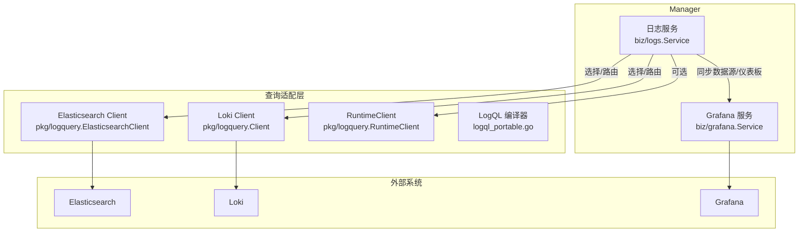
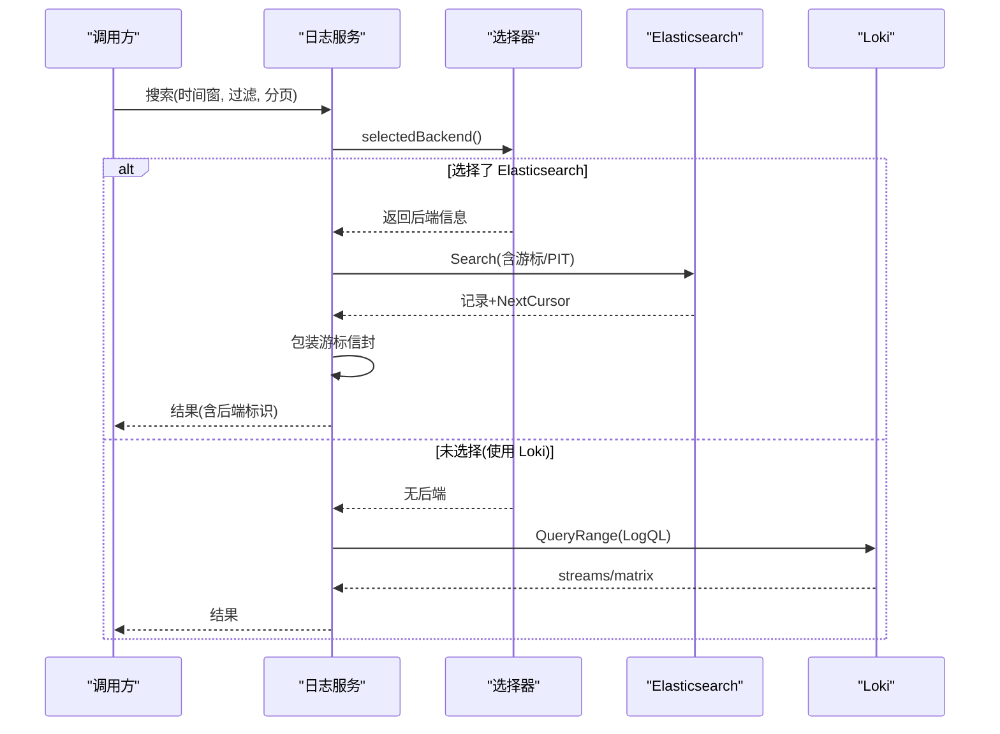
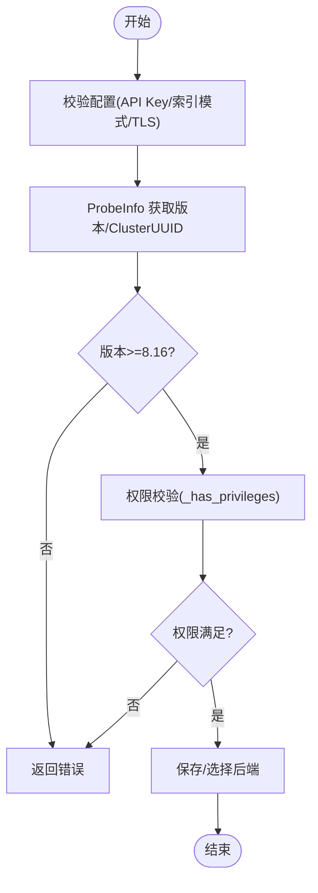
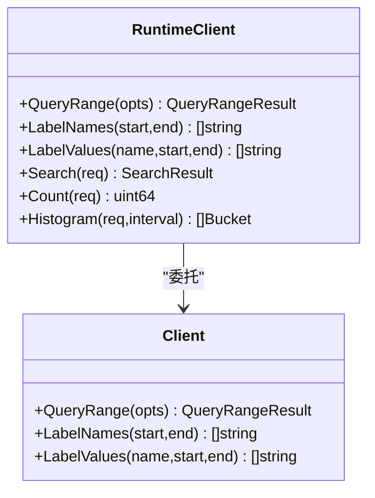
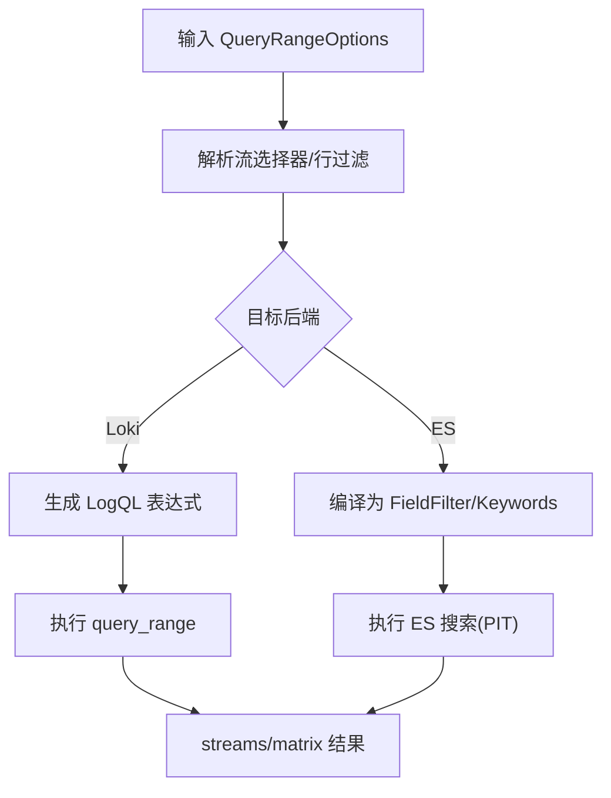
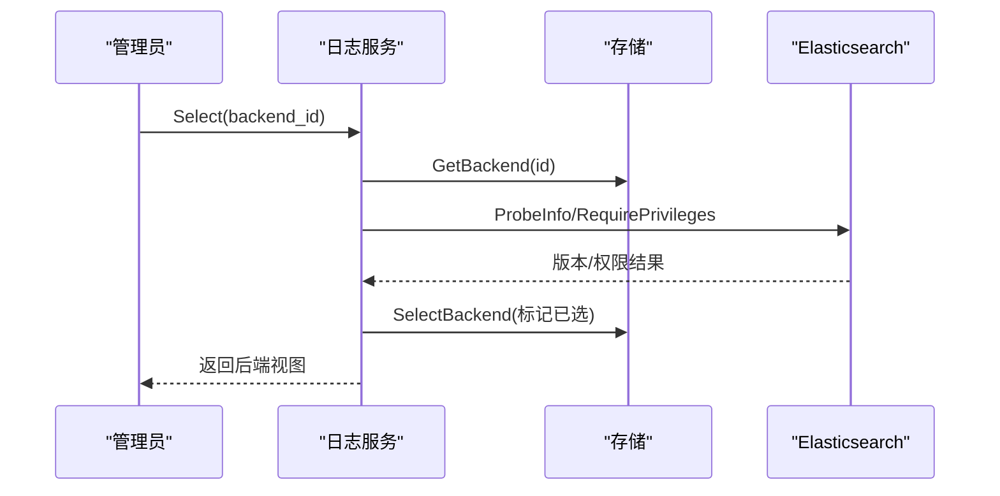
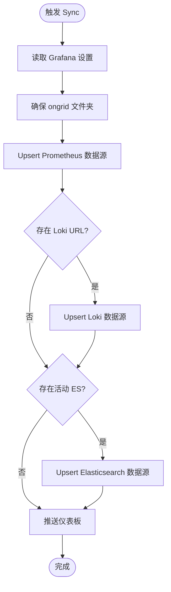
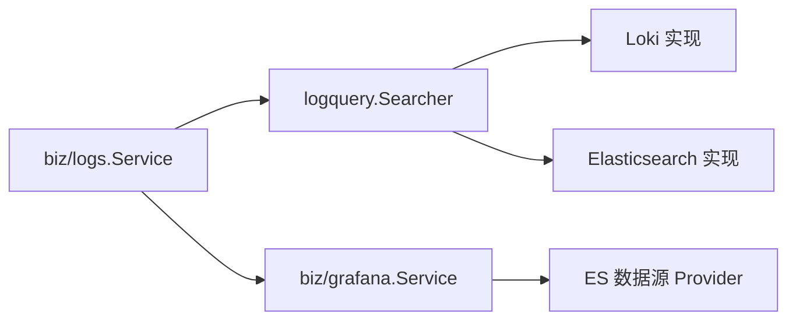

# 日志管理

<cite>
**本文引用的文件**
- [internal/pkg/logquery/client.go](file://internal/pkg/logquery/client.go)
- [internal/pkg/logquery/elasticsearch.go](file://internal/pkg/logquery/elasticsearch.go)
- [internal/pkg/logquery/loki_search.go](file://internal/pkg/logquery/loki_search.go)
- [internal/pkg/logquery/logql_portable.go](file://internal/pkg/logquery/logql_portable.go)
- [internal/pkg/logquery/runtime_client.go](file://internal/pkg/logquery/runtime_client.go)
- [internal/pkg/logquery/search.go](file://internal/pkg/logquery/search.go)
- [internal/pkg/logquery/query_logql_result.go](file://internal/pkg/logquery/query_logql_result.go)
- [internal/manager/biz/logs/service.go](file://internal/manager/biz/logs/service.go)
- [internal/manager/biz/logs/search.go](file://internal/manager/biz/logs/search.go)
- [internal/manager/biz/logs/query_logql.go](file://internal/manager/biz/logs/query_logql.go)
- [internal/manager/biz/grafana/service.go](file://internal/manager/biz/grafana/service.go)
</cite>

## 目录
1. [简介](#简介)
2. [项目结构](#项目结构)
3. [核心组件](#核心组件)
4. [架构总览](#架构总览)
5. [详细组件分析](#详细组件分析)
6. [依赖关系分析](#依赖关系分析)
7. [性能考虑](#性能考虑)
8. [故障排查指南](#故障排查指南)
9. [结论](#结论)
10. [附录](#附录)

## 简介
本技术文档围绕日志管理子系统，系统阐述 Elasticsearch 与 Loki 双后端的管理机制、LogQL 查询语言的实现原理、动态切换与权限安全、Grafana 集成方案，以及性能调优与故障排查。代码采用“后端无关”的抽象层（Searcher）统一对外暴露搜索、计数、直方图、字段枚举等能力；Manager 侧负责后端配置、连接测试、版本检测、选择与通知，并同步 Grafana 数据源与仪表板。

## 项目结构
- 查询适配层：位于 internal/pkg/logquery，提供 Loki HTTP 客户端、Elasticsearch 适配器、可移植 LogQL 子集编译、运行时客户端封装与通用数据结构。
- Manager 业务层：位于 internal/manager/biz/logs，负责后端保存、选择、连接检查、游标包装、路由到具体 Searcher，以及与 Grafana 的联动。
- Grafana 集成：位于 internal/manager/biz/grafana，负责自动创建/更新 Prometheus/Loki/Elasticsearch 数据源，推送内置仪表板。

图表来源
- [internal/manager/biz/logs/service.go:303-507](file://internal/manager/biz/logs/service.go#L303-L507)
- [internal/pkg/logquery/client.go:124-171](file://internal/pkg/logquery/client.go#L124-L171)
- [internal/pkg/logquery/elasticsearch.go:88-175](file://internal/pkg/logquery/elasticsearch.go#L88-L175)
- [internal/pkg/logquery/runtime_client.go:53-83](file://internal/pkg/logquery/runtime_client.go#L53-L83)
- [internal/manager/biz/grafana/service.go:213-299](file://internal/manager/biz/grafana/service.go#L213-L299)

章节来源
- [internal/pkg/logquery/search.go:13-22](file://internal/pkg/logquery/search.go#L13-L22)
- [internal/manager/biz/logs/service.go:34-44](file://internal/manager/biz/logs/service.go#L34-L44)

## 核心组件
- 后端无关接口与数据结构
  - Searcher：统一 Search/Count/Fields/FieldValues/Histogram 能力，屏蔽后端差异。
  - GroupedCounter：支持按维度聚合计数，用于告警评估。
  - CursorCloser：释放后端游标资源（Elasticsearch PIT）。
  - 公共常量与校验：限制窗口、分页、关键词数量等，防止滥用。
- Loki 适配
  - 通过 /loki/api/v1/query_range 执行 LogQL，支持 streams/matrix 结果解析、直方图对齐、字段值扫描。
  - 使用 BaseURLResolver 支持运行时 URL 变更；HTTP 客户端带超时与 Basic Auth。
- Elasticsearch 适配
  - 固定索引模式与 API Key 认证；PIT + search_after 实现稳定分页。
  - 版本探测（要求 8.16+）、权限校验（_security/user/_has_privileges）。
  - 将产品字段映射为 OTel 文档路径，构建 bool/filter/must/must_not 查询。
- LogQL 可移植编译
  - 仅允许安全的子集：流选择器、行过滤、字面量正则交替；拒绝解析阶段与度量表达式。
  - 将 Label 匹配转换为 FieldFilter，关键字转换为 Keywords（包含/排除/模式）。
- RuntimeClient
  - 每次调用前解析 Loki 端点，缓存 HTTP 客户端，支持 TLSInsecure 与 BasicAuth 动态切换。

章节来源
- [internal/pkg/logquery/search.go:138-159](file://internal/pkg/logquery/search.go#L138-L159)
- [internal/pkg/logquery/loki_search.go:31-118](file://internal/pkg/logquery/loki_search.go#L31-L118)
- [internal/pkg/logquery/elasticsearch.go:58-86](file://internal/pkg/logquery/elasticsearch.go#L58-L86)
- [internal/pkg/logquery/logql_portable.go:21-84](file://internal/pkg/logquery/logql_portable.go#L21-L84)
- [internal/pkg/logquery/runtime_client.go:16-30](file://internal/pkg/logquery/runtime_client.go#L16-L30)

## 架构总览
Manager 日志服务根据“已选后端”决定查询路由：未选择则走内置 Loki；选择后走 Elasticsearch。所有查询先经请求规范化与校验，再进入后端适配层。对需要跨页的结果，Elasticsearch 使用 PIT 游标，Loki 使用基于时间戳与 skip 的无状态游标。Manager 在返回给上层时，对 Elasticsearch 游标进行信封包装，以绑定后端 ID 与版本。

图表来源
- [internal/manager/biz/logs/search.go:27-74](file://internal/manager/biz/logs/search.go#L27-L74)
- [internal/pkg/logquery/loki_search.go:31-118](file://internal/pkg/logquery/loki_search.go#L31-L118)
- [internal/pkg/logquery/elasticsearch.go:88-175](file://internal/pkg/logquery/elasticsearch.go#L88-L175)

## 详细组件分析

### Elasticsearch 后端管理与连接
- 配置与校验
  - 固定索引模式，API Key 必填；支持自定义 CA 与 TLS 跳过验证（仅限测试环境）。
  - 版本探测要求 8.16+；权限校验通过 _security/user/_has_privileges 检查所需集群/索引权限。
- 连接测试与版本检测
  - Test/Select 流程会调用 ProbeInfo 获取版本与 ClusterUUID，避免脑裂场景下读写指向不同集群。
- 故障转移与回滚
  - 选择操作原子性保护（互斥锁），失败不改变已选后端；设备连通性检查独立于选择流程。

图表来源
- [internal/pkg/logquery/elasticsearch.go:437-468](file://internal/pkg/logquery/elasticsearch.go#L437-L468)
- [internal/pkg/logquery/elasticsearch.go:474-520](file://internal/pkg/logquery/elasticsearch.go#L474-L520)
- [internal/manager/biz/logs/service.go:454-507](file://internal/manager/biz/logs/service.go#L454-L507)

章节来源
- [internal/pkg/logquery/elasticsearch.go:19-86](file://internal/pkg/logquery/elasticsearch.go#L19-L86)
- [internal/manager/biz/logs/service.go:454-507](file://internal/manager/biz/logs/service.go#L454-L507)

### Loki 后端与运行时客户端
- 运行时端点解析
  - RuntimeClient 每次调用前解析 LokiEndpoint，支持 BasicAuth 与 TLSInsecure；缓存 HTTP 客户端，端点变化时重建。
- 查询执行
  - 通过 QueryRangeOptions 构造 query_range 请求；支持 limit、step、direction；默认 30s 超时。
  - 标签名/值查询用于前端自动补全。

图表来源
- [internal/pkg/logquery/runtime_client.go:53-83](file://internal/pkg/logquery/runtime_client.go#L53-L83)
- [internal/pkg/logquery/client.go:124-171](file://internal/pkg/logquery/client.go#L124-L171)

章节来源
- [internal/pkg/logquery/runtime_client.go:16-30](file://internal/pkg/logquery/runtime_client.go#L16-L30)
- [internal/pkg/logquery/client.go:46-99](file://internal/pkg/logquery/client.go#L46-L99)

### LogQL 查询语言实现
- 可移植子集编译（面向 Elasticsearch）
  - 仅允许流选择器与行过滤；拒绝解析阶段与度量表达式；将 label matcher 转为 FieldFilter，关键字转为 Keywords。
  - 限制最大查询长度与关键词数量，防止滥用。
- Loki 原生执行
  - compileLogQL 将范围/过滤器编译为 LogQL 字符串，利用索引标签加速；非索引字段走行过滤。
  - 直方图通过 count_over_time 与 step 对齐，处理边界偏移与半桶。

图表来源
- [internal/pkg/logquery/logql_portable.go:21-84](file://internal/pkg/logquery/logql_portable.go#L21-L84)
- [internal/pkg/logquery/loki_search.go:390-526](file://internal/pkg/logquery/loki_search.go#L390-L526)
- [internal/pkg/logquery/elasticsearch.go:553-669](file://internal/pkg/logquery/elasticsearch.go#L553-L669)

章节来源
- [internal/pkg/logquery/logql_portable.go:21-84](file://internal/pkg/logquery/logql_portable.go#L21-L84)
- [internal/pkg/logquery/loki_search.go:390-526](file://internal/pkg/logquery/loki_search.go#L390-L526)

### 动态切换机制与游标封装
- 选择后端
  - Select：校验、探测版本、迁移旧版日志告警规则、持久化选择并通知 Edge。
  - SelectLoki：切换到内置 Loki 路径，异步同步 Grafana Loki 数据源。
- 游标封装
  - 对 Elasticsearch 游标进行信封包装（后端类型、ID、版本、内部游标），确保翻页安全与一致性。
  - CloseCursor 释放 PIT 上下文，避免服务端资源泄漏。

图表来源
- [internal/manager/biz/logs/service.go:473-507](file://internal/manager/biz/logs/service.go#L473-L507)
- [internal/manager/biz/logs/search.go:27-74](file://internal/manager/biz/logs/search.go#L27-L74)

章节来源
- [internal/manager/biz/logs/service.go:473-507](file://internal/manager/biz/logs/service.go#L473-L507)
- [internal/manager/biz/logs/search.go:27-74](file://internal/manager/biz/logs/search.go#L27-L74)

### 权限控制与安全考虑
- 最小权限原则
  - 写读分离：Edge 仅接收写凭据，Manager 仅使用读凭据；两者必须不同。
  - 权限校验：通过 _security/user/_has_privileges 精确校验所需集群/索引权限。
- 传输安全
  - 支持 TLS 与自定义 CA；Loki BasicAuth 通过 RoundTripper 注入。
- 敏感信息
  - API Key 以受管密钥形式存储，仅在构造客户端或专用 RPC 中解密；失败时清理临时密钥引用。

章节来源
- [internal/manager/biz/logs/service.go:303-440](file://internal/manager/biz/logs/service.go#L303-L440)
- [internal/pkg/logquery/elasticsearch.go:474-520](file://internal/pkg/logquery/elasticsearch.go#L474-L520)
- [internal/pkg/logquery/runtime_client.go:99-128](file://internal/pkg/logquery/runtime_client.go#L99-L128)

### Grafana 集成方案
- 数据源同步
  - 自动创建/更新 Prometheus、Loki、Elasticsearch 数据源；固定 UID 保证幂等覆盖。
  - Elasticsearch 数据源设置 timeField=logMessageField=logLevelField，并通过 Header 注入 ApiKey。
- 仪表板同步
  - 启动时 Bootstrap 创建 ServiceAccount 与 Token；Sync 推送内置仪表板至 ongrid 文件夹。
  - 监控面板镜像：将 SPA 的 Monitor 面板列表同步为单一 Grafana 仪表板，覆盖式更新。

图表来源
- [internal/manager/biz/grafana/service.go:213-299](file://internal/manager/biz/grafana/service.go#L213-L299)
- [internal/manager/biz/grafana/service.go:325-393](file://internal/manager/biz/grafana/service.go#L325-L393)
- [internal/manager/biz/grafana/service.go:395-431](file://internal/manager/biz/grafana/service.go#L395-L431)

章节来源
- [internal/manager/biz/grafana/service.go:125-190](file://internal/manager/biz/grafana/service.go#L125-L190)
- [internal/manager/biz/grafana/service.go:213-299](file://internal/manager/biz/grafana/service.go#L213-L299)

## 依赖关系分析
- 耦合与内聚
  - logquery 包内聚后端无关接口与各后端实现；Manager biz/logs 仅依赖接口，降低耦合。
  - grafana 服务通过 Provider 注入当前活动 ES 数据源配置，解耦日志模块。
- 直接/间接依赖
  - Manager 日志服务依赖存储、Secret 解析、告警迁移、Grafana 同步、Edge 连通性清单等。
  - 查询适配层依赖 HTTP 客户端与日志库，无全局状态。
- 循环依赖
  - 通过接口与 Provider 模式避免循环依赖；例如 Grafana 服务通过函数注入获取活动 ES 配置。

图表来源
- [internal/manager/biz/logs/search.go:233-245](file://internal/manager/biz/logs/search.go#L233-L245)
- [internal/manager/biz/grafana/service.go:98-105](file://internal/manager/biz/grafana/service.go#L98-L105)

章节来源
- [internal/manager/biz/logs/search.go:233-245](file://internal/manager/biz/logs/search.go#L233-L245)
- [internal/manager/biz/grafana/service.go:98-105](file://internal/manager/biz/grafana/service.go#L98-L105)

## 性能考虑
- 查询窗口与限制
  - 最大搜索窗口 30 天；默认/最大分页限制分别为 200/1000；关键词与过滤器数量受限。
- Loki 优化
  - 优先使用索引标签匹配；非索引字段走行过滤；直方图计算采用步长对齐与偏移补偿。
  - 字段值扫描上限 10,000 条，避免长时间扫描。
- Elasticsearch 优化
  - 使用 PIT + search_after 稳定分页；track_total_hits=false；只取必要字段；响应体大小限制。
  - 聚合分组使用 composite aggregation 分页，避免高基数截断。
- 超时与内存
  - 单次查询默认 30s 超时；Loki 响应体限制 8MB；ES 响应体限制 16MB（搜索硬限制 32MB）。

章节来源
- [internal/pkg/logquery/search.go:13-22](file://internal/pkg/logquery/search.go#L13-L22)
- [internal/pkg/logquery/loki_search.go:21-21](file://internal/pkg/logquery/loki_search.go#L21-L21)
- [internal/pkg/logquery/loki_search.go:318-388](file://internal/pkg/logquery/loki_search.go#L318-L388)
- [internal/pkg/logquery/elasticsearch.go:19-31](file://internal/pkg/logquery/elasticsearch.go#L19-L31)
- [internal/pkg/logquery/elasticsearch.go:211-302](file://internal/pkg/logquery/elasticsearch.go#L211-L302)
- [internal/pkg/logquery/client.go:61-64](file://internal/pkg/logquery/client.go#L61-L64)

## 故障排查指南
- 常见错误定位
  - 空查询/时间窗无效：请求校验失败，检查 start/end 与方向。
  - 游标无效：Loki 游标时间戳/跳数不一致；ES 游标后端/版本不匹配。
  - 权限不足：ES 权限校验失败，需补充 cluster/index 权限。
  - 版本不兼容：ES 版本低于 8.16，需升级。
- 连接检查
  - 使用 StartConnectionCheck/ConnectionCheck 查看各 Edge 在线/验证/失败/离线状态。
  - Loki 内置路径检查需配置 loki.url 与鉴权。
- Grafana 集成问题
  - 数据源同步失败：检查 root_url、sa_token/api_key、TLS 设置。
  - 仪表板未更新：确认 ongrid 文件夹与 UID 一致，重试 Sync。

章节来源
- [internal/pkg/logquery/search.go:257-338](file://internal/pkg/logquery/search.go#L257-L338)
- [internal/pkg/logquery/loki_search.go:31-118](file://internal/pkg/logquery/loki_search.go#L31-L118)
- [internal/pkg/logquery/elasticsearch.go:437-520](file://internal/pkg/logquery/elasticsearch.go#L437-L520)
- [internal/manager/biz/logs/service.go:509-650](file://internal/manager/biz/logs/service.go#L509-L650)
- [internal/manager/biz/grafana/service.go:201-210](file://internal/manager/biz/grafana/service.go#L201-L210)

## 结论
该日志管理系统通过后端无关的查询抽象、严格的请求校验与资源限制、稳定的分页与游标管理、完善的权限与版本检测，实现了 Elasticsearch 与 Loki 的双后端支持与无缝切换。配合 Grafana 的数据源与仪表板自动化同步，提供了开箱即用的日志观测体验。建议在生产环境中严格遵循最小权限原则、合理设置查询窗口与分页限制，并结合连接检查与监控指标持续优化性能与稳定性。

## 附录

### 配置示例（说明性）
- Elasticsearch 后端
  - 写入端点：数组形式的多个地址
  - 查询端点：单地址
  - 数据集/命名空间：用于生成索引模式
  - 写/读凭据：分别使用不同的 API Key 引用
  - CA 证书与 TLS 跳过：按需启用
- Loki 后端
  - URL：绝对 HTTP(S) 地址
  - Basic 认证：用户与密码
  - TLS 跳过：仅测试环境

### 查询语句示例（说明性）
- 日志聚合
  - 按设备/命名空间/工作负载统计日志量（后端聚合或 count_over_time）
- 过滤与分析
  - 关键字包含/排除、级别过滤、字段前缀匹配
  - 时间窗口内的趋势直方图

[本节为概念性内容，不直接分析具体文件]