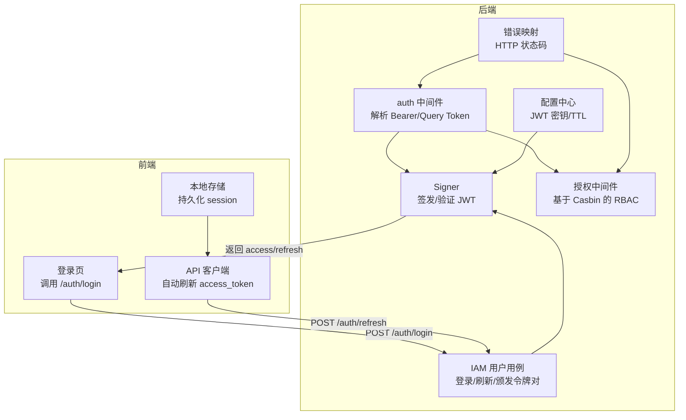
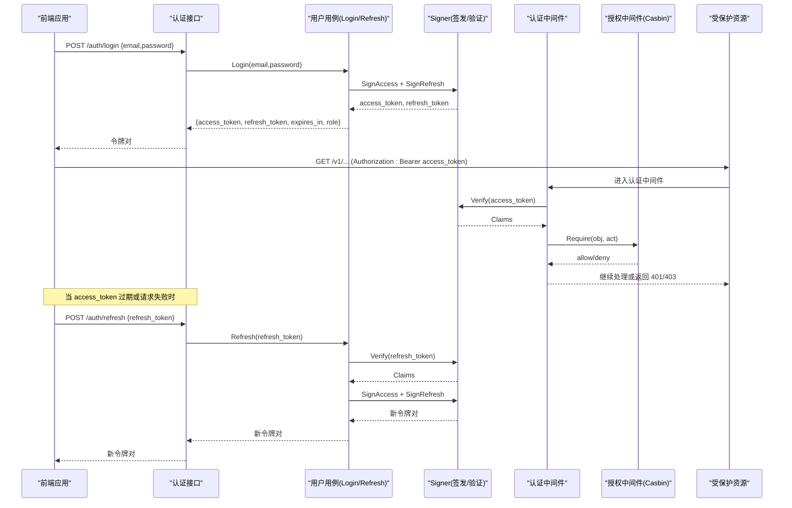
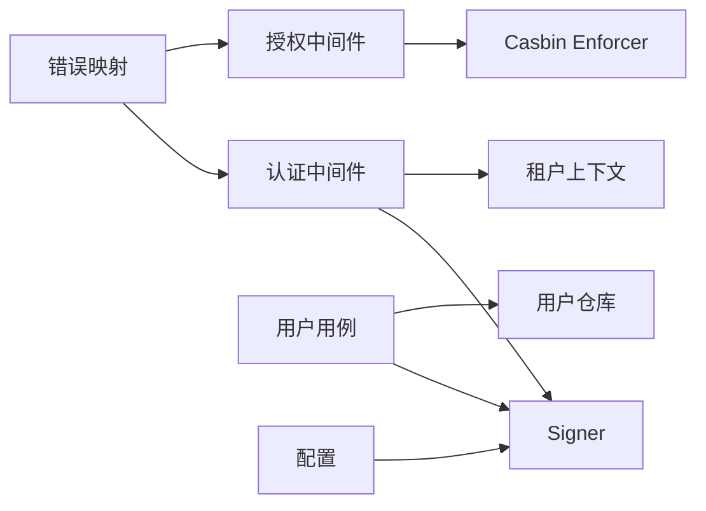

# JWT 认证机制

<cite>
**本文引用的文件**
- [internal/pkg/auth/jwt.go](file://internal/pkg/auth/jwt.go)
- [internal/pkg/auth/middleware.go](file://internal/pkg/auth/middleware.go)
- [internal/iam/biz/user/usecase.go](file://internal/iam/biz/user/usecase.go)
- [internal/pkg/authzmw/middleware.go](file://internal/pkg/authzmw/middleware.go)
- [internal/pkg/config/config.go](file://internal/pkg/config/config.go)
- [internal/pkg/errs/errs.go](file://internal/pkg/errs/errs.go)
- [web/src/api/auth.ts](file://web/src/api/auth.ts)
- [web/src/api/client.ts](file://web/src/api/client.ts)
- [web/src/store/auth.ts](file://web/src/store/auth.ts)
- [web/src/pages/Login.tsx](file://web/src/pages/Login.tsx)
- [internal/iam/server/http.go](file://internal/iam/server/http.go)
</cite>

## 目录
1. [简介](#简介)
2. [项目结构](#项目结构)
3. [核心组件](#核心组件)
4. [架构总览](#架构总览)
5. [详细组件分析](#详细组件分析)
6. [依赖关系分析](#依赖关系分析)
7. [性能与安全考量](#性能与安全考量)
8. [故障排查指南](#故障排查指南)
9. [结论](#结论)
10. [附录：前端集成与最佳实践](#附录前端集成与最佳实践)

## 简介
本技术文档围绕项目的 JSON Web Token（JWT）认证机制，系统阐述令牌的签发、验证、刷新与撤销策略，中间件在请求拦截、用户上下文注入和权限校验中的作用，以及多会话支持与令牌存储策略。同时给出安全配置建议、错误处理策略、性能优化要点，并说明与前端应用的集成方式和用户体验优化。

## 项目结构
本项目采用分层与领域边界清晰的组织方式：
- 认证与授权核心位于 internal/pkg/auth 与 internal/pkg/authzmw
- 用户域业务逻辑位于 internal/iam/biz/user
- 运行时配置集中于 internal/pkg/config
- 统一错误语义在 internal/pkg/errs
- 前端认证状态与自动刷新在 web/src/store 与 web/src/api

图表来源
- [internal/pkg/auth/middleware.go:10-53](file://internal/pkg/auth/middleware.go#L10-L53)
- [internal/pkg/auth/jwt.go:16-99](file://internal/pkg/auth/jwt.go#L16-L99)
- [internal/iam/biz/user/usecase.go:80-123](file://internal/iam/biz/user/usecase.go#L80-L123)
- [internal/pkg/authzmw/middleware.go:57-97](file://internal/pkg/authzmw/middleware.go#L57-L97)
- [internal/pkg/config/config.go:321-326](file://internal/pkg/config/config.go#L321-L326)
- [internal/pkg/errs/errs.go:28-53](file://internal/pkg/errs/errs.go#L28-L53)
- [web/src/api/auth.ts:19-29](file://web/src/api/auth.ts#L19-L29)
- [web/src/api/client.ts:117-162](file://web/src/api/client.ts#L117-L162)
- [web/src/store/auth.ts:20-41](file://web/src/store/auth.ts#L20-L41)

章节来源
- [internal/pkg/auth/middleware.go:10-67](file://internal/pkg/auth/middleware.go#L10-L67)
- [internal/pkg/auth/jwt.go:16-99](file://internal/pkg/auth/jwt.go#L16-L99)
- [internal/iam/biz/user/usecase.go:80-123](file://internal/iam/biz/user/usecase.go#L80-L123)
- [internal/pkg/authzmw/middleware.go:57-97](file://internal/pkg/authzmw/middleware.go#L57-L97)
- [internal/pkg/config/config.go:321-326](file://internal/pkg/config/config.go#L321-L326)
- [internal/pkg/errs/errs.go:28-53](file://internal/pkg/errs/errs.go#L28-L53)
- [web/src/api/auth.ts:19-29](file://web/src/api/auth.ts#L19-L29)
- [web/src/api/client.ts:117-162](file://web/src/api/client.ts#L117-L162)
- [web/src/store/auth.ts:20-41](file://web/src/store/auth.ts#L20-L41)

## 核心组件
- 令牌签发与验证（Signer）
  - 使用 HS256 对称签名算法，签发短生命周期访问令牌与长生命周期刷新令牌；支持自定义 TTL。
  - 验证时强制要求 HMAC 签名方法，拒绝非预期算法。
- 认证中间件
  - 从 Authorization: Bearer 或查询参数 token 提取令牌，验证后把租户上下文写入请求上下文，供后续处理器使用。
- 用户域用例（Login/Refresh）
  - 登录：校验邮箱密码，生成 access/refresh 令牌对，附带过期时间。
  - 刷新：校验 refresh token，检查用户状态，重新签发新令牌对。
- 授权中间件（RBAC）
  - 超级用户短路放行；否则通过 Casbin 进行对象-动作级权限判定。
- 配置与错误
  - JWT 密钥与 TTL 由环境变量驱动；统一错误到 HTTP 状态码映射。

章节来源
- [internal/pkg/auth/jwt.go:16-99](file://internal/pkg/auth/jwt.go#L16-L99)
- [internal/pkg/auth/middleware.go:10-67](file://internal/pkg/auth/middleware.go#L10-L67)
- [internal/iam/biz/user/usecase.go:80-123](file://internal/iam/biz/user/usecase.go#L80-L123)
- [internal/pkg/authzmw/middleware.go:57-97](file://internal/pkg/authzmw/middleware.go#L57-L97)
- [internal/pkg/config/config.go:321-326](file://internal/pkg/config/config.go#L321-L326)
- [internal/pkg/errs/errs.go:28-53](file://internal/pkg/errs/errs.go#L28-L53)

## 架构总览
下图展示了从前端登录到后端鉴权、再到资源访问的完整流程，包括令牌刷新路径。

图表来源
- [web/src/pages/Login.tsx:19-43](file://web/src/pages/Login.tsx#L19-L43)
- [web/src/api/auth.ts:19-29](file://web/src/api/auth.ts#L19-L29)
- [internal/iam/biz/user/usecase.go:80-123](file://internal/iam/biz/user/usecase.go#L80-L123)
- [internal/pkg/auth/jwt.go:56-99](file://internal/pkg/auth/jwt.go#L56-L99)
- [internal/pkg/auth/middleware.go:21-53](file://internal/pkg/auth/middleware.go#L21-L53)
- [internal/pkg/authzmw/middleware.go:70-97](file://internal/pkg/authzmw/middleware.go#L70-L97)
- [web/src/api/client.ts:117-162](file://web/src/api/client.ts#L117-L162)

## 详细组件分析

### 令牌签发与验证（Signer）
- 设计要点
  - 使用 HS256 对称签名，避免公钥分发复杂度；适合单服务或可信内网场景。
  - 访问令牌短生命周期（默认分钟级），刷新令牌长生命周期（默认天级）。
  - 支持自定义 TTL，用于内部票据等短期凭证。
- 数据结构
  - Claims 包含用户标识、邮箱、角色、超级用户标记及标准注册声明（exp/iat/sub 等）。
- 复杂度
  - 签发/验证均为 O(1)，主要开销为 HMAC 计算与序列化。
- 优化点
  - 合理设置 TTL 平衡安全性与刷新频率。
  - 将密钥管理纳入外部密钥管理服务（如 KMS）以提升安全性。

章节来源
- [internal/pkg/auth/jwt.go:16-99](file://internal/pkg/auth/jwt.go#L16-L99)
- [internal/pkg/config/config.go:321-326](file://internal/pkg/config/config.go#L321-L326)

### 认证中间件（请求拦截与上下文注入）
- 功能
  - 从 Authorization 头或查询参数提取令牌，验证通过后构造租户上下文（用户ID、邮箱、角色、是否超级用户）并注入请求上下文。
  - 失败直接返回 401，不继续下游处理。
- 多通道兼容
  - 支持 WebSocket 升级场景下的 ?token= 回退方案。
- 上下文传播
  - 将租户信息同时写入外层可变槽位，确保审计等外层中间件可读取。

章节来源
- [internal/pkg/auth/middleware.go:10-67](file://internal/pkg/auth/middleware.go#L10-L67)

### 用户域用例（登录与刷新）
- 登录流程
  - 校验邮箱与密码，检查用户状态，签发 access/refresh 令牌对，返回 expires_in 以便前端展示。
- 刷新流程
  - 校验 refresh token 有效性，检查用户状态，重新签发新令牌对。MVP 阶段未实现令牌轮换与撤销列表，仅依赖签名有效性与用户状态。
- 数据流
  - 通过 Signer 完成签发，结合数据库用户信息完成身份核验。

章节来源
- [internal/iam/biz/user/usecase.go:80-123](file://internal/iam/biz/user/usecase.go#L80-L123)
- [internal/iam/biz/user/usecase.go:362-387](file://internal/iam/biz/user/usecase.go#L362-L387)

### 授权中间件（RBAC）
- 规则
  - 无租户上下文 → 401
  - 超级用户 → 短路放行
  - 未启用授权器 → 放行（兼容历史部署）
  - 允许任意组织 → 放行
  - 否则 → 403
- 扩展
  - 未来将引入 X-Active-Org 头以进行组织级资源隔离。

章节来源
- [internal/pkg/authzmw/middleware.go:57-97](file://internal/pkg/authzmw/middleware.go#L57-L97)

### 前端集成与自动刷新
- 登录
  - 调用 /auth/login，成功后将 access_token、refresh_token、role、email 持久化至 localStorage。
- 自动刷新
  - 当请求失败且存在 refresh_token 时，调用 /auth/refresh 获取新 access_token，并更新本地状态。
- 状态管理
  - 使用 zustand 持久化认证状态，提供 setSession/logout 等方法。

章节来源
- [web/src/pages/Login.tsx:19-43](file://web/src/pages/Login.tsx#L19-L43)
- [web/src/api/auth.ts:19-29](file://web/src/api/auth.ts#L19-L29)
- [web/src/api/client.ts:117-162](file://web/src/api/client.ts#L117-L162)
- [web/src/store/auth.ts:20-41](file://web/src/store/auth.ts#L20-L41)

## 依赖关系分析
- 组件耦合
  - 认证中间件依赖 Signer 与租户上下文包；授权中间件依赖 IAM 的授权器。
  - 用户用例依赖 Signer 与数据库仓库。
- 外部依赖
  - JWT 库用于签名与解析；Casbin 用于 RBAC 策略执行。
- 潜在循环
  - 当前分层清晰，未见循环依赖。

图表来源
- [internal/pkg/auth/middleware.go:10-67](file://internal/pkg/auth/middleware.go#L10-L67)
- [internal/pkg/auth/jwt.go:16-99](file://internal/pkg/auth/jwt.go#L16-L99)
- [internal/pkg/authzmw/middleware.go:57-97](file://internal/pkg/authzmw/middleware.go#L57-L97)
- [internal/iam/biz/user/usecase.go:80-123](file://internal/iam/biz/user/usecase.go#L80-L123)
- [internal/pkg/config/config.go:321-326](file://internal/pkg/config/config.go#L321-L326)
- [internal/pkg/errs/errs.go:28-53](file://internal/pkg/errs/errs.go#L28-L53)

章节来源
- [internal/pkg/auth/middleware.go:10-67](file://internal/pkg/auth/middleware.go#L10-L67)
- [internal/pkg/auth/jwt.go:16-99](file://internal/pkg/auth/jwt.go#L16-L99)
- [internal/pkg/authzmw/middleware.go:57-97](file://internal/pkg/authzmw/middleware.go#L57-L97)
- [internal/iam/biz/user/usecase.go:80-123](file://internal/iam/biz/user/usecase.go#L80-L123)
- [internal/pkg/config/config.go:321-326](file://internal/pkg/config/config.go#L321-L326)
- [internal/pkg/errs/errs.go:28-53](file://internal/pkg/errs/errs.go#L28-L53)

## 性能与安全考量
- 性能
  - JWT 签发/验证为轻量操作，注意在高并发下控制刷新频率；合理设置 access_token TTL 可减少刷新压力。
  - 授权中间件在超大规模场景可考虑缓存用户-组织映射结果以降低 Casbin 查询成本。
- 安全
  - 签名算法固定为 HS256，需严格保护密钥；建议通过环境变量或密钥管理服务注入。
  - 登录接口具备 IP 与邮箱维度的速率限制，防止暴力破解。
  - 刷新流程校验用户状态，禁用账户无法刷新。
  - 当前 MVP 未实现 refresh token 轮换与撤销列表；生产环境应引入令牌黑名单或版本化策略以实现即时撤销。
  - 防重放攻击：JWT 本身不含一次性随机数；若需强防重放，可在关键写操作引入服务端 nonce 或请求签名。

章节来源
- [internal/pkg/config/config.go:449-451](file://internal/pkg/config/config.go#L449-L451)
- [internal/iam/server/http.go:38-76](file://internal/iam/server/http.go#L38-L76)
- [internal/iam/biz/user/usecase.go:102-123](file://internal/iam/biz/user/usecase.go#L102-L123)

## 故障排查指南
- 常见错误与状态码
  - 缺少令牌或无效令牌 → 401 Unauthorized
  - 权限不足 → 403 Forbidden
  - 参数非法 → 400 Bad Request
  - 冲突（如重复注册）→ 409 Conflict
  - 过多尝试（登录限流）→ 429 Too Many Requests
  - 其他未知错误 → 500 Internal Server Error
- 定位步骤
  - 检查 Authorization 头或查询参数是否正确携带令牌。
  - 确认 Signer 密钥与 TTL 配置正确。
  - 查看授权中间件的日志输出，确认对象与动作匹配。
  - 检查用户状态是否为激活，禁用账户将无法登录或刷新。
  - 前端刷新失败时，检查 refresh_token 是否存在且有效。

章节来源
- [internal/pkg/errs/errs.go:28-53](file://internal/pkg/errs/errs.go#L28-L53)
- [internal/pkg/auth/middleware.go:21-53](file://internal/pkg/auth/middleware.go#L21-L53)
- [internal/pkg/authzmw/middleware.go:70-97](file://internal/pkg/authzmw/middleware.go#L70-L97)
- [internal/iam/server/http.go:38-76](file://internal/iam/server/http.go#L38-L76)

## 结论
该项目的 JWT 认证机制以简洁可靠的 HS256 签名为核心，配合短生命周期的访问令牌与长生命周期的刷新令牌，实现了安全的身份认证与细粒度的权限控制。中间件层负责统一的请求拦截、上下文注入与授权校验，前端侧实现了自动刷新与本地状态持久化，提升了用户体验。生产环境中建议引入密钥管理、令牌轮换与撤销能力，并持续优化性能与监控指标。

## 附录：前端集成与最佳实践
- 登录流程
  - 调用 /auth/login，成功后保存 access_token、refresh_token、role、email。
- 自动刷新
  - 当请求失败且存在 refresh_token 时，调用 /auth/refresh 获取新 access_token 并更新本地状态。
- 本地存储
  - 使用 localStorage 持久化认证状态，便于页面刷新后保持登录态。
- 用户体验优化
  - 首次渲染利用 role 快速判断可见菜单，减少闪烁。
  - 登录失败时给出明确的用户友好提示。
- 安全配置建议
  - 使用强随机密钥，定期轮换。
  - 合理设置 access_token 与 refresh_token 的 TTL。
  - 在生产环境启用 HTTPS，避免令牌泄露。
  - 对敏感写操作引入额外校验（如二次确认、验证码）。

章节来源
- [web/src/pages/Login.tsx:19-43](file://web/src/pages/Login.tsx#L19-L43)
- [web/src/api/auth.ts:19-29](file://web/src/api/auth.ts#L19-L29)
- [web/src/api/client.ts:117-162](file://web/src/api/client.ts#L117-L162)
- [web/src/store/auth.ts:20-41](file://web/src/store/auth.ts#L20-L41)
- [internal/pkg/config/config.go:449-451](file://internal/pkg/config/config.go#L449-L451)