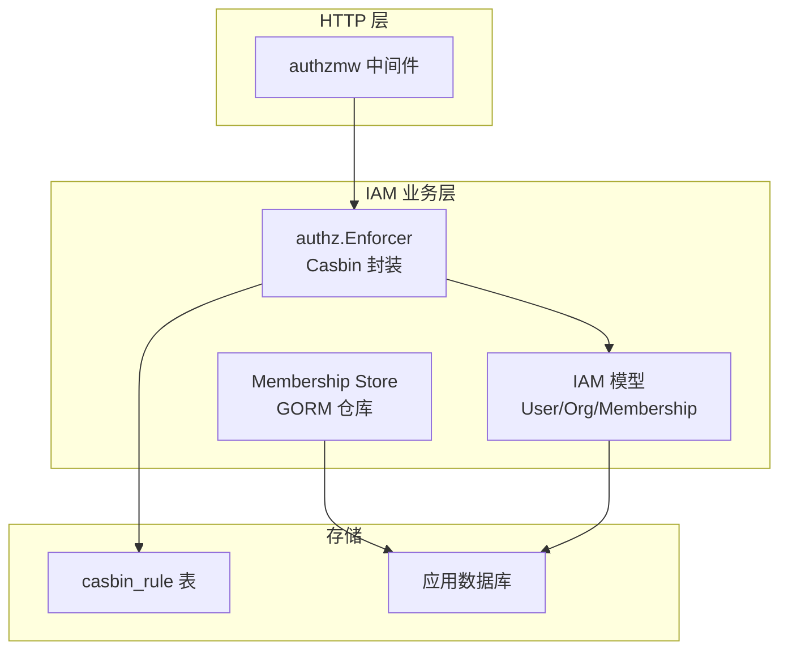
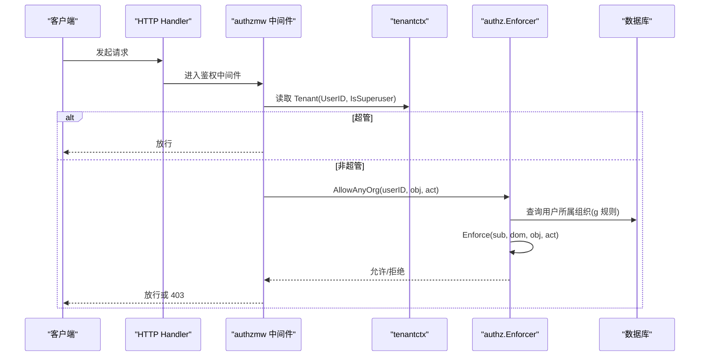
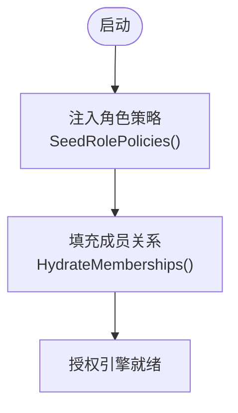
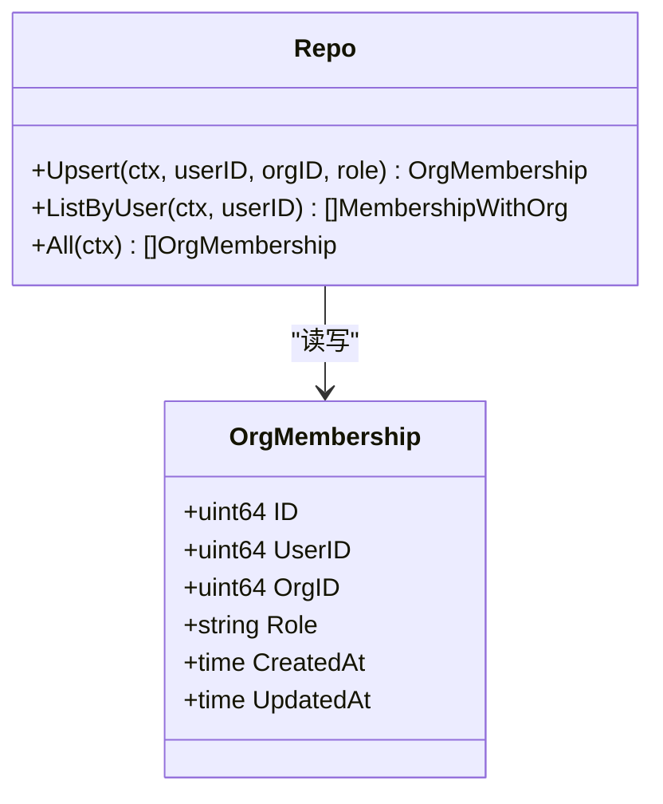
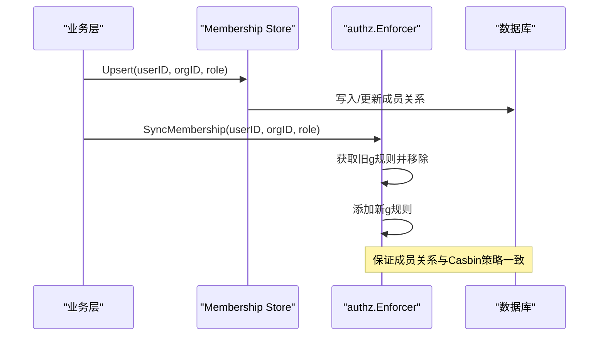
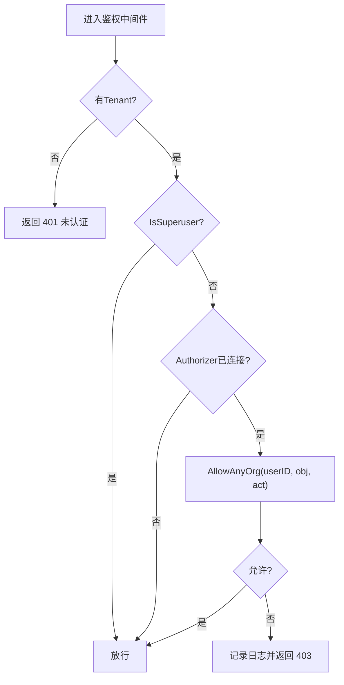
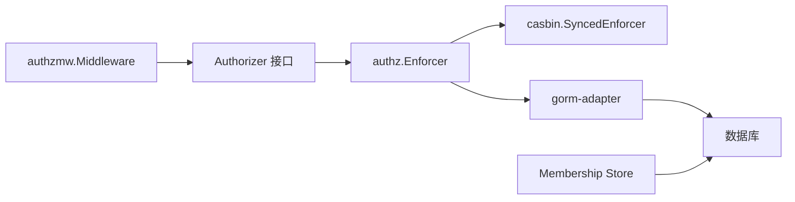

# RBAC 权限控制

<cite>
**本文引用的文件**
- [internal/iam/biz/authz/authz.go](file://internal/iam/biz/authz/authz.go)
- [internal/iam/biz/authz/model.conf](file://internal/iam/biz/authz/model.conf)
- [internal/pkg/authzmw/middleware.go](file://internal/pkg/authzmw/middleware.go)
- [internal/pkg/tenantctx/tenantctx.go](file://internal/pkg/tenantctx/tenantctx.go)
- [internal/iam/model/model.go](file://internal/iam/model/model.go)
- [internal/iam/data/membership/store/repo.go](file://internal/iam/data/membership/store/repo.go)
- [tests/e2e/auth_rbac_test.go](file://tests/e2e/auth_rbac_test.go)
</cite>

## 目录
1. [简介](#简介)
2. [项目结构](#项目结构)
3. [核心组件](#核心组件)
4. [架构总览](#架构总览)
5. [详细组件分析](#详细组件分析)
6. [依赖关系分析](#依赖关系分析)
7. [性能考量](#性能考量)
8. [故障排查指南](#故障排查指南)
9. [结论](#结论)
10. [附录](#附录)

## 简介
本技术文档系统性阐述基于 Casbin 的 RBAC（基于角色的访问控制）设计与实现，覆盖角色定义（org_admin、member、viewer）、权限矩阵与资源访问策略；多租户隔离机制（组织级边界与数据隔离）；成员关系变更时的权限同步与一致性保证；超级用户绕过机制与安全考虑；并提供配置示例、最佳实践、权限检查流程、错误处理与性能优化建议。

## 项目结构
RBAC 相关代码主要分布在以下模块：
- 授权引擎封装与策略注入：internal/iam/biz/authz
- HTTP 层鉴权中间件：internal/pkg/authzmw
- 租户上下文（JWT 解析后的调用者身份）：internal/pkg/tenantctx
- IAM 领域模型（用户、组织、成员关系）：internal/iam/model
- 成员关系持久化仓库：internal/iam/data/membership/store
- 端到端测试用例：tests/e2e/auth_rbac_test.go

图表来源
- [internal/pkg/authzmw/middleware.go:1-98](file://internal/pkg/authzmw/middleware.go#L1-L98)
- [internal/iam/biz/authz/authz.go:1-316](file://internal/iam/biz/authz/authz.go#L1-L316)
- [internal/iam/model/model.go:69-139](file://internal/iam/model/model.go#L69-L139)
- [internal/iam/data/membership/store/repo.go:1-163](file://internal/iam/data/membership/store/repo.go#L1-L163)

章节来源
- [internal/pkg/authzmw/middleware.go:1-98](file://internal/pkg/authzmw/middleware.go#L1-L98)
- [internal/iam/biz/authz/authz.go:1-316](file://internal/iam/biz/authz/authz.go#L1-L316)
- [internal/iam/model/model.go:69-139](file://internal/iam/model/model.go#L69-L139)
- [internal/iam/data/membership/store/repo.go:1-163](file://internal/iam/data/membership/store/repo.go#L1-L163)

## 核心组件
- Casbin 模型与策略：通过内嵌 model.conf 定义请求、策略、角色定义、匹配器与效果函数；策略矩阵在启动时注入，包含 org_admin、member、viewer 三类角色的资源与动作权限。
- 授权执行器 Enforcer：封装 casbin.SyncedEnforcer，提供 Allow/AllowAnyOrg、成员关系同步（SyncMembership/RevokeMembership/RevokeAllForOrg/RevokeAllForUser）、启动时填充（HydrateMemberships）与种子策略（SeedRolePolicies）。
- 鉴权中间件：对每个受保护接口进行前置校验，支持超管短路与按对象/动作的细粒度授权。
- 租户上下文：从 JWT 中解析出 UserID、Email、Role、IsSuperuser，供后续鉴权与审计使用。
- 成员关系仓库：维护 users 与 orgs 的多对多关系及角色，支持 Upsert、ListByUser、All 等。

章节来源
- [internal/iam/biz/authz/authz.go:40-125](file://internal/iam/biz/authz/authz.go#L40-L125)
- [internal/pkg/authzmw/middleware.go:35-98](file://internal/pkg/authzmw/middleware.go#L35-L98)
- [internal/pkg/tenantctx/tenantctx.go:1-35](file://internal/pkg/tenantctx/tenantctx.go#L1-L35)
- [internal/iam/data/membership/store/repo.go:21-47](file://internal/iam/data/membership/store/repo.go#L21-L47)

## 架构总览
请求进入后，先经过认证中间件将调用者信息写入上下文，再进入鉴权中间件。鉴权中间件优先检查是否超管，若否则调用 authz.Enforcer.AllowAnyOrg 或 Allow 进行决策。Enforcer 基于 Casbin 模型与策略，结合 g 规则（用户-角色-组织）判定是否允许。成员关系变更时，通过 SyncMembership 等方法保持 Casbin 策略与数据库一致。

图表来源
- [internal/pkg/authzmw/middleware.go:57-98](file://internal/pkg/authzmw/middleware.go#L57-L98)
- [internal/iam/biz/authz/authz.go:233-271](file://internal/iam/biz/authz/authz.go#L233-L271)
- [internal/pkg/tenantctx/tenantctx.go:13-35](file://internal/pkg/tenantctx/tenantctx.go#L13-L35)

## 详细组件分析

### Casbin 模型与权限矩阵
- 模型定义：请求 r = sub, dom, obj, act；策略 p = sub, dom, obj, act；角色 g = _, _, _；匹配器 m 要求子主体属于域并匹配对象与动作。
- 角色矩阵（启动时注入）：
  - org_admin：在所属域内拥有 org:*、member:* 的全量操作，以及通配资源读写执行能力。
  - member：具备资源的 read/write，以及 device:shell 的 exec。
  - viewer：仅 read，无设备 shell 执行权限。
  - superuser：系统管理员，由中间件短路放行，同时保留兜底策略。

图表来源
- [internal/iam/biz/authz/authz.go:86-125](file://internal/iam/biz/authz/authz.go#L86-L125)
- [internal/iam/biz/authz/authz.go:127-143](file://internal/iam/biz/authz/authz.go#L127-L143)

章节来源
- [internal/iam/biz/authz/model.conf:1-15](file://internal/iam/biz/authz/model.conf#L1-L15)
- [internal/iam/biz/authz/authz.go:86-125](file://internal/iam/biz/authz/authz.go#L86-L125)

### 成员关系与多租户隔离
- 成员关系模型：OrgMembership 记录 user_id、org_id、role，支持同一用户在多个组织具有不同角色。
- 数据隔离：Casbin 的 domain/dom 字段绑定到 org_id，策略匹配时要求 r.dom == p.dom 或 p.dom 为通配符；因此资源访问被限制在用户所属组织范围内。
- 启动时同步：HydrateMemberships 将数据库中所有成员关系映射为 Casbin 的 g 规则，确保运行时授权基于最新成员关系。
- 删除组织清理：当组织被删除时，调用 RevokeAllForOrg 清理该组织下的所有 g 规则，避免残留权限。

图表来源
- [internal/iam/model/model.go:126-139](file://internal/iam/model/model.go#L126-L139)
- [internal/iam/data/membership/store/repo.go:21-47](file://internal/iam/data/membership/store/repo.go#L21-L47)

章节来源
- [internal/iam/model/model.go:126-139](file://internal/iam/model/model.go#L126-L139)
- [internal/iam/data/membership/store/repo.go:124-163](file://internal/iam/data/membership/store/repo.go#L124-L163)
- [internal/iam/biz/authz/authz.go:127-143](file://internal/iam/biz/authz/authz.go#L127-L143)
- [internal/iam/biz/authz/authz.go:191-210](file://internal/iam/biz/authz/authz.go#L191-L210)

### 权限同步机制与一致性保证
- 成员新增/角色变更：调用 SyncMembership，先移除旧的角色 g 规则，再添加新角色，确保 Casbin 与数据库一致。
- 成员移除：调用 RevokeMembership 清除指定用户在指定组织的角色关联。
- 组织/用户删除：分别调用 RevokeAllForOrg / RevokeAllForUser 清理所有相关 g 规则，防止越权。
- 启动时全量同步：HydrateMemberships 将数据库中的成员关系一次性映射到 Casbin，保证服务重启后状态一致。

图表来源
- [internal/iam/data/membership/store/repo.go:21-47](file://internal/iam/data/membership/store/repo.go#L21-L47)
- [internal/iam/biz/authz/authz.go:145-169](file://internal/iam/biz/authz/authz.go#L145-L169)

章节来源
- [internal/iam/biz/authz/authz.go:145-169](file://internal/iam/biz/authz/authz.go#L145-L169)
- [internal/iam/biz/authz/authz.go:171-231](file://internal/iam/biz/authz/authz.go#L171-L231)
- [internal/iam/data/membership/store/repo.go:21-47](file://internal/iam/data/membership/store/repo.go#L21-L47)

### 超级用户绕过机制与安全考虑
- 中间件短路：当 Tenant.IsSuperuser 为真时，直接放行，不经过 Casbin 决策，确保即使策略损坏也不会锁死系统管理员。
- 兜底策略：仍保留 superuser 的策略行以增强纵深防御，但实际路径优先走中间件短路。
- 安全建议：严格限制超管账号数量与生命周期管理；审计所有超管操作；避免将超管用于日常业务。

章节来源
- [internal/pkg/authzmw/middleware.go:57-98](file://internal/pkg/authzmw/middleware.go#L57-L98)
- [internal/iam/biz/authz/authz.go:105-110](file://internal/iam/biz/authz/authz.go#L105-L110)
- [internal/pkg/tenantctx/tenantctx.go:13-35](file://internal/pkg/tenantctx/tenantctx.go#L13-L35)

### 权限检查流程与错误处理
- 流程：
  1) 从上下文提取 Tenant；若无则返回未认证。
  2) 若 IsSuperuser 为真，直接放行。
  3) 若 Authorizer 未接入（兼容模式），放行。
  4) 调用 AllowAnyOrg 遍历用户所属组织进行授权判断。
  5) 拒绝时记录日志并返回 403。
- 错误码映射：统一通过 errs.HTTPStatus 将内部错误映射为 HTTP 状态码（如 unauthorized、forbidden、not-found 等）。

图表来源
- [internal/pkg/authzmw/middleware.go:57-98](file://internal/pkg/authzmw/middleware.go#L57-L98)
- [internal/iam/biz/authz/authz.go:233-271](file://internal/iam/biz/authz/authz.go#L233-L271)
- [internal/pkg/errs/errs.go:28-53](file://internal/pkg/errs/errs.go#L28-L53)

章节来源
- [internal/pkg/authzmw/middleware.go:57-98](file://internal/pkg/authzmw/middleware.go#L57-L98)
- [internal/pkg/errs/errs.go:28-53](file://internal/pkg/errs/errs.go#L28-L53)

### 最佳实践与配置示例
- 资源命名约定：采用“资源:动作”形式，例如 edge:*、knowledge:doc、agent:custom 等，便于中间件 Require(obj, act) 精确限定。
- 动作词汇：read / write / delete / manage / exec，语义清晰且易于扩展。
- 最小权限原则：为 viewer 仅提供 read；为 member 提供 read/write/exec；为 org_admin 提供组织与成员管理能力。
- 成员关系管理：任何 AddMember/ChangeRole/RemoveMember 都需调用对应的 SyncMembership/RevokeMembership，确保 Casbin 与数据库一致。
- 组织生命周期：删除组织前需移动子组织；删除时清理成员关系与 Casbin 规则，避免残留权限。

章节来源
- [internal/pkg/authzmw/middleware.go:11-23](file://internal/pkg/authzmw/middleware.go#L11-L23)
- [internal/iam/biz/authz/authz.go:86-125](file://internal/iam/biz/authz/authz.go#L86-L125)
- [internal/iam/biz/authz/authz.go:145-231](file://internal/iam/biz/authz/authz.go#L145-L231)

## 依赖关系分析
- 中间件依赖租户上下文与授权执行器；授权执行器依赖 Casbin 模型与数据库适配器；成员关系仓库依赖 GORM 与应用数据库。
- 耦合点：
  - 中间件与 Enforcer 的接口契约（Allow/AllowAnyOrg）松耦合，便于替换实现。
  - 成员关系变更与 Casbin 策略同步集中在 authz 包，降低业务层复杂度。
- 外部依赖：Casbin 与 GORM Adapter；数据库表 casbin_rule 与应用表共享连接。

图表来源
- [internal/pkg/authzmw/middleware.go:35-98](file://internal/pkg/authzmw/middleware.go#L35-L98)
- [internal/iam/biz/authz/authz.go:46-84](file://internal/iam/biz/authz/authz.go#L46-L84)
- [internal/iam/data/membership/store/repo.go:1-47](file://internal/iam/data/membership/store/repo.go#L1-L47)

章节来源
- [internal/pkg/authzmw/middleware.go:35-98](file://internal/pkg/authzmw/middleware.go#L35-L98)
- [internal/iam/biz/authz/authz.go:46-84](file://internal/iam/biz/authz/authz.go#L46-L84)
- [internal/iam/data/membership/store/repo.go:1-47](file://internal/iam/data/membership/store/repo.go#L1-L47)

## 性能考量
- 策略加载与同步：
  - 启动时一次性注入角色策略与成员关系，避免频繁 IO。
  - 成员关系变更采用增量同步（SyncMembership），减少全量重建成本。
- 授权决策：
  - AllowAnyOrg 会遍历用户所属组织，建议在高频路径缓存用户组织列表或使用更细粒度的 X-Active-Org 头（Phase 2）以减少遍历。
- 数据库负载：
  - casbin_rule 与应用数据库同连接，注意索引与查询优化；避免在热点路径重复查询 g 规则。
- 并发安全：
  - Enforcer 内部使用互斥锁保护策略变更，保障并发安全。

[本节为通用性能指导，不直接分析具体文件]

## 故障排查指南
- 常见错误与定位：
  - 401 未认证：检查上下文是否包含 Tenant，确认认证中间件是否正确设置。
  - 403 禁止：查看鉴权中间件日志（记录 user、obj、act），确认策略与成员关系是否正确。
  - 策略不一致：检查成员关系变更后是否调用 SyncMembership；必要时重新 HydrateMemberships。
- 工具与日志：
  - 使用统一的错误码映射（unauthorized、forbidden、not-found 等）便于前端处理。
  - 在 Enforcer 中记录 enforce 错误与警告，辅助定位策略问题。

章节来源
- [internal/pkg/authzmw/middleware.go:86-98](file://internal/pkg/authzmw/middleware.go#L86-L98)
- [internal/iam/biz/authz/authz.go:233-247](file://internal/iam/biz/authz/authz.go#L233-L247)
- [internal/pkg/errs/errs.go:28-53](file://internal/pkg/errs/errs.go#L28-L53)

## 结论
本 RBAC 系统通过 Casbin 实现了细粒度的资源访问控制，结合组织级多租户隔离与成员关系同步机制，保证了权限的一致性与可维护性。超管短路设计提升了系统韧性，配合严格的错误处理与日志记录，便于运维与排障。建议在生产环境中遵循最小权限原则，严格控制超管账号，并持续监控授权决策的性能与正确性。

[本节为总结性内容，不直接分析具体文件]

## 附录

### 角色与权限矩阵（摘要）
- org_admin：组织与成员管理，资源全量读写执行。
- member：资源读/写/执行（含设备 shell）。
- viewer：只读，无设备 shell。
- superuser：系统管理员，中间件短路放行。

章节来源
- [internal/iam/biz/authz/authz.go:86-125](file://internal/iam/biz/authz/authz.go#L86-L125)

### 端到端测试要点
- 验证 admin-only 接口对非 admin 返回 403。
- 验证 viewer 无法创建自定义代理，admin/user 可以。
- 验证任意已认证角色均可访问自身信息接口。

章节来源
- [tests/e2e/auth_rbac_test.go:22-111](file://tests/e2e/auth_rbac_test.go#L22-L111)