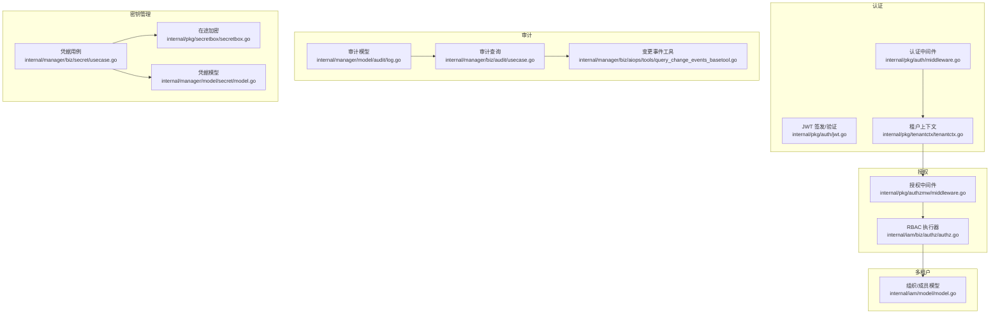
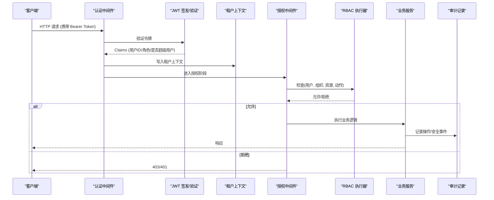
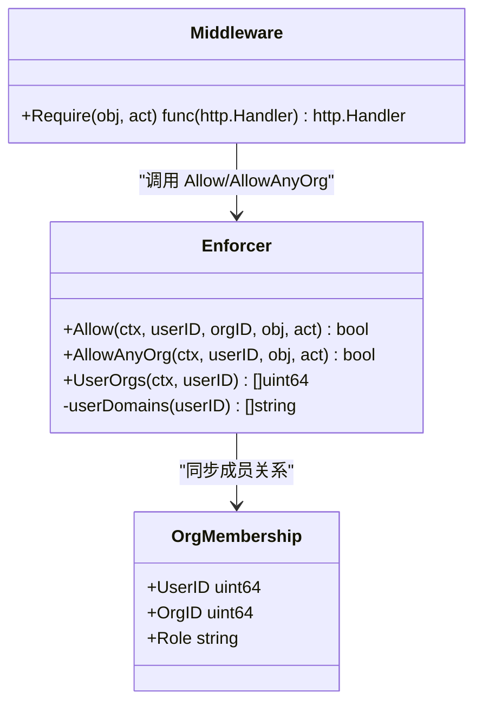
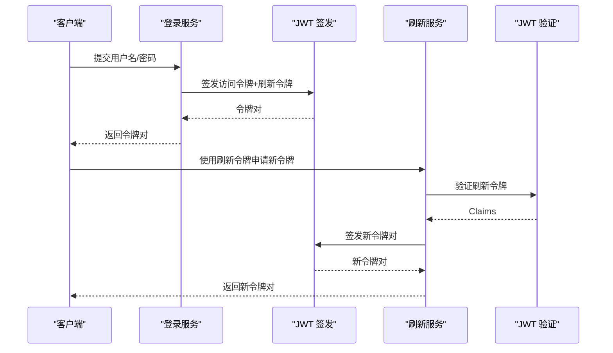
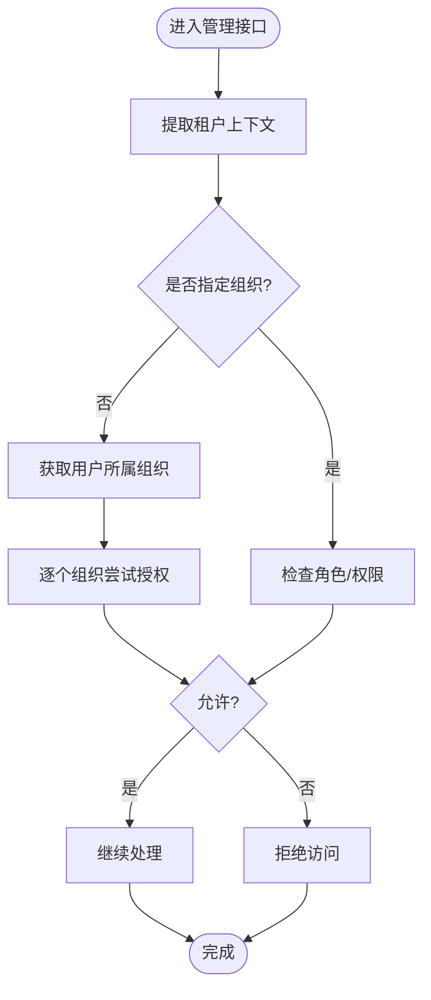
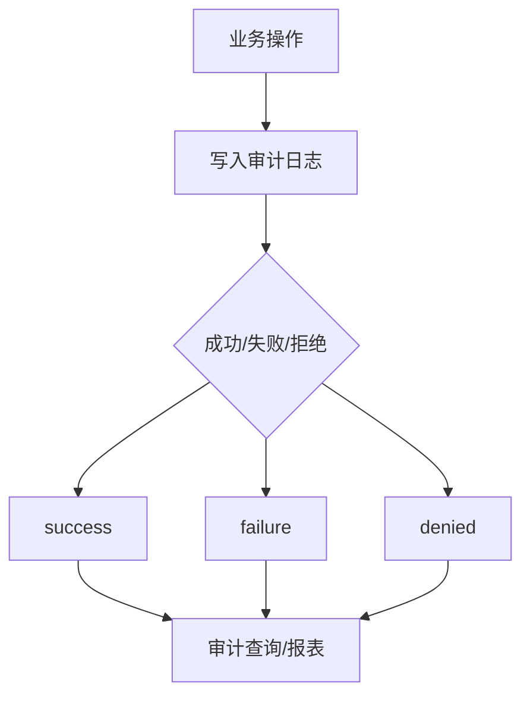
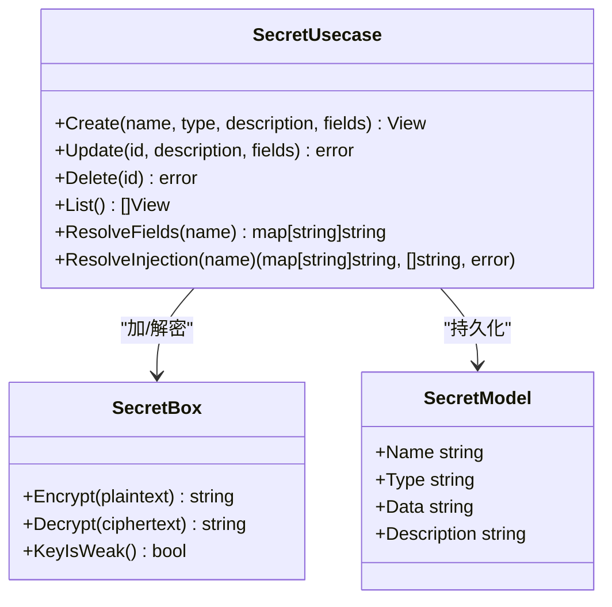
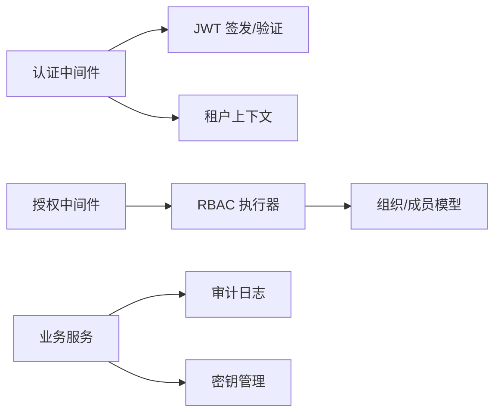

# 安全与认证

<cite>
**本文引用的文件**
- [internal/pkg/auth/jwt.go](file://internal/pkg/auth/jwt.go)
- [internal/pkg/auth/middleware.go](file://internal/pkg/auth/middleware.go)
- [internal/iam/biz/authz/authz.go](file://internal/iam/biz/authz/authz.go)
- [internal/pkg/authzmw/middleware.go](file://internal/pkg/authzmw/middleware.go)
- [internal/pkg/tenantctx/tenantctx.go](file://internal/pkg/tenantctx/tenantctx.go)
- [internal/manager/server/device/http.go](file://internal/manager/server/device/http.go)
- [internal/manager/server/knowledge/http.go](file://internal/manager/server/knowledge/http.go)
- [internal/iam/model/model.go](file://internal/iam/model/model.go)
- [internal/manager/model/audit/log.go](file://internal/manager/model/audit/log.go)
- [internal/manager/biz/audit/usecase.go](file://internal/manager/biz/audit/usecase.go)
- [internal/manager/biz/aiops/tools/query_change_events_basetool.go](file://internal/manager/biz/aiops/tools/query_change_events_basetool.go)
- [internal/manager/biz/secret/usecase.go](file://internal/manager/biz/secret/usecase.go)
- [internal/pkg/secretbox/secretbox.go](file://internal/pkg/secretbox/secretbox.go)
- [internal/manager/model/secret/model.go](file://internal/manager/model/secret/model.go)
- [internal/manager/server/setting/http.go](file://internal/manager/server/setting/http.go)
- [internal/manager/biz/setting/service.go](file://internal/manager/biz/setting/service.go)
- [internal/iam/biz/user/hash.go](file://internal/iam/biz/user/hash.go)
- [internal/pkg/passwd/argon2.go](file://internal/pkg/passwd/argon2.go)
</cite>

## 目录
1. [简介](#简介)
2. [项目结构](#项目结构)
3. [核心组件](#核心组件)
4. [架构总览](#架构总览)
5. [详细组件分析](#详细组件分析)
6. [依赖关系分析](#依赖关系分析)
7. [性能考量](#性能考量)
8. [故障排查指南](#故障排查指南)
9. [结论](#结论)
10. [附录：安全配置示例与最佳实践](#附录：安全配置示例与最佳实践)

## 简介
本技术文档聚焦于系统的安全与认证能力，覆盖以下关键主题：
- RBAC 权限模型（角色、资源、动作）及多租户边界控制
- JWT 认证机制（签发、验证、刷新）
- 多租户隔离（组织级数据隔离与权限边界）
- 审计日志（操作记录、安全事件追踪、合规报告）
- 密钥管理（敏感信息加密存储、访问控制、生命周期）
- 安全配置示例与运维最佳实践

## 项目结构
与安全相关的关键代码分布在如下模块：
- 认证与上下文：JWT 签发/验证、请求中间件、租户上下文注入
- 授权：基于 Casbin 的 RBAC 策略与中间件
- 多租户：组织、成员、角色映射到授权域
- 审计：统一审计模型、查询接口、变更事件工具
- 密钥管理：凭据库、在途加密、环境变量注入
- 密码学：Argon2id 密码哈希、AES-GCM 对称加密

图表来源
- [internal/pkg/auth/jwt.go:1-100](file://internal/pkg/auth/jwt.go#L1-L100)
- [internal/pkg/auth/middleware.go:1-68](file://internal/pkg/auth/middleware.go#L1-L68)
- [internal/pkg/tenantctx/tenantctx.go:1-87](file://internal/pkg/tenantctx/tenantctx.go#L1-L87)
- [internal/iam/biz/authz/authz.go:1-316](file://internal/iam/biz/authz/authz.go#L1-L316)
- [internal/pkg/authzmw/middleware.go:1-55](file://internal/pkg/authzmw/middleware.go#L1-L55)
- [internal/iam/model/model.go:103-139](file://internal/iam/model/model.go#L103-L139)
- [internal/manager/model/audit/log.go:1-136](file://internal/manager/model/audit/log.go#L1-L136)
- [internal/manager/biz/audit/usecase.go:118-147](file://internal/manager/biz/audit/usecase.go#L118-L147)
- [internal/manager/biz/aiops/tools/query_change_events_basetool.go:1-35](file://internal/manager/biz/aiops/tools/query_change_events_basetool.go#L1-L35)
- [internal/manager/biz/secret/usecase.go:1-231](file://internal/manager/biz/secret/usecase.go#L1-L231)
- [internal/pkg/secretbox/secretbox.go:1-110](file://internal/pkg/secretbox/secretbox.go#L1-L110)
- [internal/manager/model/secret/model.go:32-45](file://internal/manager/model/secret/model.go#L32-L45)

章节来源
- [internal/pkg/auth/jwt.go:1-100](file://internal/pkg/auth/jwt.go#L1-L100)
- [internal/pkg/auth/middleware.go:1-68](file://internal/pkg/auth/middleware.go#L1-L68)
- [internal/pkg/tenantctx/tenantctx.go:1-87](file://internal/pkg/tenantctx/tenantctx.go#L1-L87)
- [internal/iam/biz/authz/authz.go:1-316](file://internal/iam/biz/authz/authz.go#L1-L316)
- [internal/pkg/authzmw/middleware.go:1-55](file://internal/pkg/authzmw/middleware.go#L1-L55)
- [internal/iam/model/model.go:103-139](file://internal/iam/model/model.go#L103-L139)
- [internal/manager/model/audit/log.go:1-136](file://internal/manager/model/audit/log.go#L1-L136)
- [internal/manager/biz/audit/usecase.go:118-147](file://internal/manager/biz/audit/usecase.go#L118-L147)
- [internal/manager/biz/aiops/tools/query_change_events_basetool.go:1-35](file://internal/manager/biz/aiops/tools/query_change_events_basetool.go#L1-L35)
- [internal/manager/biz/secret/usecase.go:1-231](file://internal/manager/biz/secret/usecase.go#L1-L231)
- [internal/pkg/secretbox/secretbox.go:1-110](file://internal/pkg/secretbox/secretbox.go#L1-L110)
- [internal/manager/model/secret/model.go:32-45](file://internal/manager/model/secret/model.go#L32-L45)

## 核心组件
- JWT 认证：提供短效访问令牌与长效刷新令牌；签名算法为 HMAC-SHA256；支持通过请求头或查询参数传递令牌。
- 授权中间件：基于 Casbin 的 RBAC，支持按对象与动作进行细粒度控制；超级用户可短路鉴权。
- 多租户隔离：以组织为单位划分权限域；成员关系映射到授权域，确保跨组织不可见。
- 审计日志：统一记录“谁在何时对何资源做了什么”，支持按时间范围与资源类型检索，并用于根因分析工具。
- 密钥管理：凭据以 AES-256-GCM 加密存储；列表 API 仅暴露字段名；运行时按类型注入环境变量。
- 密码学：密码使用 Argon2id 哈希；敏感配置值采用掩码展示；密钥从环境变量派生，支持弱密钥检测。

章节来源
- [internal/pkg/auth/jwt.go:16-99](file://internal/pkg/auth/jwt.go#L16-L99)
- [internal/pkg/auth/middleware.go:10-68](file://internal/pkg/auth/middleware.go#L10-L68)
- [internal/iam/biz/authz/authz.go:86-125](file://internal/iam/biz/authz/authz.go#L86-L125)
- [internal/iam/model/model.go:106-139](file://internal/iam/model/model.go#L106-L139)
- [internal/manager/model/audit/log.go:10-136](file://internal/manager/model/audit/log.go#L10-L136)
- [internal/manager/biz/secret/usecase.go:1-231](file://internal/manager/biz/secret/usecase.go#L1-L231)
- [internal/pkg/secretbox/secretbox.go:1-110](file://internal/pkg/secretbox/secretbox.go#L1-L110)
- [internal/pkg/passwd/argon2.go:14-78](file://internal/pkg/passwd/argon2.go#L14-L78)

## 架构总览
下图展示了从客户端请求到鉴权、授权、业务处理与审计记录的完整链路。

图表来源
- [internal/pkg/auth/middleware.go:21-53](file://internal/pkg/auth/middleware.go#L21-L53)
- [internal/pkg/auth/jwt.go:81-99](file://internal/pkg/auth/jwt.go#L81-L99)
- [internal/pkg/tenantctx/tenantctx.go:30-49](file://internal/pkg/tenantctx/tenantctx.go#L30-L49)
- [internal/pkg/authzmw/middleware.go:1-55](file://internal/pkg/authzmw/middleware.go#L1-L55)
- [internal/iam/biz/authz/authz.go:233-271](file://internal/iam/biz/authz/authz.go#L233-L271)
- [internal/manager/model/audit/log.go:10-47](file://internal/manager/model/audit/log.go#L10-L47)

## 详细组件分析

### RBAC 权限模型
- 角色定义：内置角色包括 org_admin、member、viewer，以及 superuser（系统管理员）。角色策略在启动时注入，不随运行期修改。
- 资源与动作：资源命名约定如 edge:*、knowledge:doc、alert:rule 等；动作包括 read/write/delete/manage/exec。
- 多租户域：每个组织作为授权域；成员关系映射为 Casbin 分组策略，确保跨组织不可见。
- 超级用户短路：当令牌包含超级用户标志或兼容旧版 admin 角色时，授权中间件直接放行。

图表来源
- [internal/iam/biz/authz/authz.go:46-125](file://internal/iam/biz/authz/authz.go#L46-L125)
- [internal/iam/biz/authz/authz.go:233-289](file://internal/iam/biz/authz/authz.go#L233-L289)
- [internal/pkg/authzmw/middleware.go:1-55](file://internal/pkg/authzmw/middleware.go#L1-L55)
- [internal/iam/model/model.go:126-139](file://internal/iam/model/model.go#L126-L139)

章节来源
- [internal/iam/biz/authz/authz.go:86-125](file://internal/iam/biz/authz/authz.go#L86-L125)
- [internal/iam/biz/authz/authz.go:233-289](file://internal/iam/biz/authz/authz.go#L233-L289)
- [internal/pkg/authzmw/middleware.go:1-55](file://internal/pkg/authzmw/middleware.go#L1-L55)
- [internal/iam/model/model.go:106-139](file://internal/iam/model/model.go#L106-L139)

### JWT 认证机制
- 令牌签发：访问令牌短时效、刷新令牌长时效；Claims 包含用户ID、邮箱、角色、是否超级用户。
- 令牌验证：解析并校验签名、有效期；失败返回未授权。
- 刷新流程：使用刷新令牌换取新的访问/刷新令牌对；校验用户状态有效。
- 上下文注入：将租户上下文写入请求上下文，供下游中间件与服务使用。

图表来源
- [internal/pkg/auth/jwt.go:56-79](file://internal/pkg/auth/jwt.go#L56-L79)
- [internal/pkg/auth/jwt.go:81-99](file://internal/pkg/auth/jwt.go#L81-L99)
- [internal/iam/biz/user/usecase.go:102-123](file://internal/iam/biz/user/usecase.go#L102-L123)
- [internal/pkg/auth/middleware.go:21-53](file://internal/pkg/auth/middleware.go#L21-L53)

章节来源
- [internal/pkg/auth/jwt.go:16-99](file://internal/pkg/auth/jwt.go#L16-L99)
- [internal/pkg/auth/middleware.go:10-68](file://internal/pkg/auth/middleware.go#L10-L68)
- [internal/iam/biz/user/usecase.go:102-123](file://internal/iam/biz/user/usecase.go#L102-L123)

### 多租户隔离机制
- 组织与成员：组织具有名称、描述、层级关系；成员关系绑定用户与组织，并指定角色。
- 权限边界：授权以组织为域；同一用户在多个组织拥有不同角色，互不影响。
- 默认域：当请求未携带活动组织头时，授权中间件遍历用户所属组织，首个允许即放行。
- 管理员路由：部分管理接口要求管理员角色，否则拒绝。

图表来源
- [internal/iam/model/model.go:106-139](file://internal/iam/model/model.go#L106-L139)
- [internal/iam/biz/authz/authz.go:249-289](file://internal/iam/biz/authz/authz.go#L249-L289)
- [internal/manager/server/device/http.go:68-84](file://internal/manager/server/device/http.go#L68-L84)

章节来源
- [internal/iam/model/model.go:106-139](file://internal/iam/model/model.go#L106-L139)
- [internal/iam/biz/authz/authz.go:249-289](file://internal/iam/biz/authz/authz.go#L249-L289)
- [internal/manager/server/device/http.go:68-84](file://internal/manager/server/device/http.go#L68-L84)

### 审计日志系统
- 审计模型：每条记录包含发生时间、用户、角色、IP、用户代理、动作、资源类型/标识、状态、错误信息、负载 JSON、请求 ID。
- 标准动作与资源：动作采用动词_资源的命名规范；资源类型涵盖用户、设备、告警规则、设置、通道、仓库、技能等。
- 查询接口：支持按时间范围、资源类型、动作过滤；变更事件查询用于根因分析。
- 合规报告：审计行不可伪造，仅可通过保留任务删除；负载需脱敏，避免泄露敏感值。

图表来源
- [internal/manager/model/audit/log.go:10-136](file://internal/manager/model/audit/log.go#L10-L136)
- [internal/manager/biz/audit/usecase.go:118-147](file://internal/manager/biz/audit/usecase.go#L118-L147)
- [internal/manager/biz/aiops/tools/query_change_events_basetool.go:15-35](file://internal/manager/biz/aiops/tools/query_change_events_basetool.go#L15-L35)

章节来源
- [internal/manager/model/audit/log.go:10-136](file://internal/manager/model/audit/log.go#L10-L136)
- [internal/manager/biz/audit/usecase.go:118-147](file://internal/manager/biz/audit/usecase.go#L118-L147)
- [internal/manager/biz/aiops/tools/query_change_events_basetool.go:15-35](file://internal/manager/biz/aiops/tools/query_change_events_basetool.go#L15-L35)

### 密钥管理系统
- 加密存储：凭据以 AES-256-GCM 密封存储；密文格式带版本前缀，便于未来方案轮换。
- 访问控制：列表 API 仅返回字段名；读取 API 不暴露明文；仅在进程内注入路径解密。
- 生命周期：创建时密封存储；更新时重新密封；删除时移除；受管凭据支持原子替换与补偿删除。
- 环境变量注入：根据凭据类型生成注入计划，缺失字段会提示；自定义类型按字段名注入环境变量。

图表来源
- [internal/manager/biz/secret/usecase.go:48-175](file://internal/manager/biz/secret/usecase.go#L48-L175)
- [internal/pkg/secretbox/secretbox.go:53-109](file://internal/pkg/secretbox/secretbox.go#L53-L109)
- [internal/manager/model/secret/model.go:32-45](file://internal/manager/model/secret/model.go#L32-L45)

章节来源
- [internal/manager/biz/secret/usecase.go:1-231](file://internal/manager/biz/secret/usecase.go#L1-L231)
- [internal/pkg/secretbox/secretbox.go:1-110](file://internal/pkg/secretbox/secretbox.go#L1-L110)
- [internal/manager/model/secret/model.go:32-45](file://internal/manager/model/secret/model.go#L32-L45)

### 密码学与敏感数据处理
- 密码哈希：使用 Argon2id，参数调优兼顾安全性与性能；哈希格式为标准 PHC 编码。
- 敏感配置掩码：列表响应中敏感值仅显示首尾片段；短值全掩码。
- 密钥强度检测：若未设置环境变量密钥，则使用弱密钥并报告，引导运维人员配置强密钥。

章节来源
- [internal/pkg/passwd/argon2.go:14-78](file://internal/pkg/passwd/argon2.go#L14-L78)
- [internal/manager/biz/setting/service.go:244-258](file://internal/manager/biz/setting/service.go#L244-L258)
- [internal/pkg/secretbox/secretbox.go:31-51](file://internal/pkg/secretbox/secretbox.go#L31-L51)

## 依赖关系分析
- 认证中间件依赖 JWT 签发器与租户上下文；授权中间件依赖 RBAC 执行器；业务层依赖审计与密钥管理。
- 多租户通过组织与成员关系驱动授权域；审计与密钥管理独立于授权但共享租户上下文。

图表来源
- [internal/pkg/auth/middleware.go:21-53](file://internal/pkg/auth/middleware.go#L21-L53)
- [internal/pkg/auth/jwt.go:81-99](file://internal/pkg/auth/jwt.go#L81-L99)
- [internal/pkg/tenantctx/tenantctx.go:30-49](file://internal/pkg/tenantctx/tenantctx.go#L30-L49)
- [internal/pkg/authzmw/middleware.go:1-55](file://internal/pkg/authzmw/middleware.go#L1-L55)
- [internal/iam/biz/authz/authz.go:233-289](file://internal/iam/biz/authz/authz.go#L233-L289)
- [internal/iam/model/model.go:106-139](file://internal/iam/model/model.go#L106-L139)
- [internal/manager/model/audit/log.go:10-47](file://internal/manager/model/audit/log.go#L10-L47)
- [internal/manager/biz/secret/usecase.go:1-231](file://internal/manager/biz/secret/usecase.go#L1-L231)

章节来源
- [internal/pkg/auth/middleware.go:21-53](file://internal/pkg/auth/middleware.go#L21-L53)
- [internal/pkg/auth/jwt.go:81-99](file://internal/pkg/auth/jwt.go#L81-L99)
- [internal/pkg/tenantctx/tenantctx.go:30-49](file://internal/pkg/tenantctx/tenantctx.go#L30-L49)
- [internal/pkg/authzmw/middleware.go:1-55](file://internal/pkg/authzmw/middleware.go#L1-L55)
- [internal/iam/biz/authz/authz.go:233-289](file://internal/iam/biz/authz/authz.go#L233-L289)
- [internal/iam/model/model.go:106-139](file://internal/iam/model/model.go#L106-L139)
- [internal/manager/model/audit/log.go:10-47](file://internal/manager/model/audit/log.go#L10-L47)
- [internal/manager/biz/secret/usecase.go:1-231](file://internal/manager/biz/secret/usecase.go#L1-L231)

## 性能考量
- 授权决策：Casbin 策略加载与组成员同步在启动时完成；运行时按组织域快速判定，适合中小规模部署。
- 审计写入：审计记录轻量且索引完善，支持高效查询；建议合理设置保留策略以避免表膨胀。
- 密钥解密：仅在进程内注入路径解密；列表 API 不解密，降低开销。
- 密码哈希：Argon2id 参数平衡安全与延迟；可根据硬件调整以提升吞吐。

[本节为通用指导，无需特定文件引用]

## 故障排查指南
- 未授权访问：检查令牌是否存在、是否过期；确认租户上下文是否正确注入；验证授权中间件是否启用。
- 权限不足：确认用户组织与角色；检查资源与动作命名是否符合约定；必要时查看授权中间件的 Require 配置。
- 审计为空：确认业务层是否记录审计事件；检查审计查询过滤器；核对负载是否被脱敏导致信息不足。
- 密钥解密失败：检查环境变量密钥是否设置；确认密文格式是否带版本前缀；查看弱密钥警告。

章节来源
- [internal/pkg/auth/middleware.go:21-53](file://internal/pkg/auth/middleware.go#L21-L53)
- [internal/pkg/authzmw/middleware.go:1-55](file://internal/pkg/authzmw/middleware.go#L1-L55)
- [internal/manager/model/audit/log.go:10-47](file://internal/manager/model/audit/log.go#L10-L47)
- [internal/pkg/secretbox/secretbox.go:31-51](file://internal/pkg/secretbox/secretbox.go#L31-L51)

## 结论
本系统通过 JWT 认证、Casbin RBAC、多租户隔离、统一审计与密钥管理，构建了端到端的安全体系。各组件职责清晰、耦合适度，既满足 MVP 的快速交付，也为后续扩展预留了空间。建议在生产环境严格配置环境变量密钥、启用审计保留策略，并结合监控告警保障安全基线。

[本节为总结性内容，无需特定文件引用]

## 附录：安全配置示例与最佳实践
- 环境变量密钥：设置强随机密钥，避免使用默认弱密钥；启动时关注弱密钥警告。
- 令牌策略：访问令牌短时效、刷新令牌长时效；定期轮换密钥并限制刷新频率。
- 角色最小权限：为成员授予必要的最小权限；避免滥用超级用户。
- 审计合规：开启审计记录并设置保留策略；对敏感负载脱敏；定期导出合规报告。
- 密钥生命周期：为每次配置变更生成新凭据；失败时回滚并清理临时凭据；列表 API 不暴露明文。
- 密码安全：使用 Argon2id 哈希；禁止明文存储；定期评估参数以匹配硬件能力。

章节来源
- [internal/pkg/secretbox/secretbox.go:31-51](file://internal/pkg/secretbox/secretbox.go#L31-L51)
- [internal/pkg/auth/jwt.go:56-79](file://internal/pkg/auth/jwt.go#L56-L79)
- [internal/iam/biz/authz/authz.go:86-125](file://internal/iam/biz/authz/authz.go#L86-L125)
- [internal/manager/model/audit/log.go:10-136](file://internal/manager/model/audit/log.go#L10-L136)
- [internal/manager/biz/secret/usecase.go:91-118](file://internal/manager/biz/secret/usecase.go#L91-L118)
- [internal/pkg/passwd/argon2.go:14-78](file://internal/pkg/passwd/argon2.go#L14-L78)