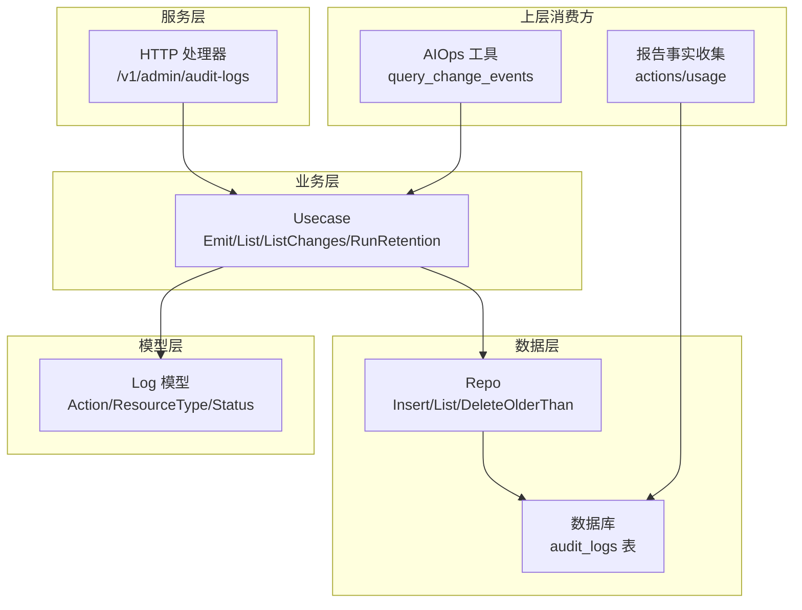
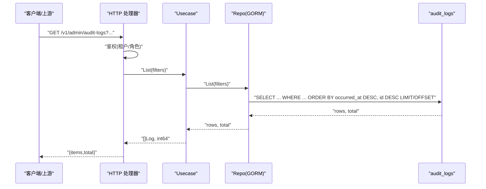
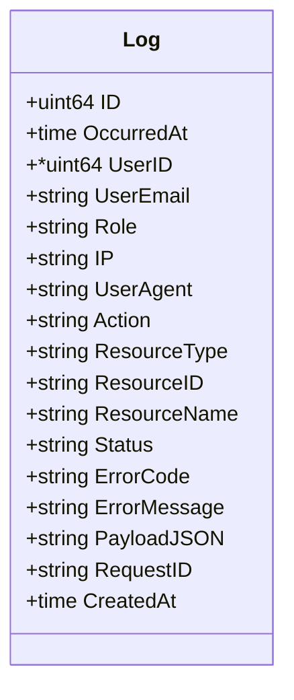
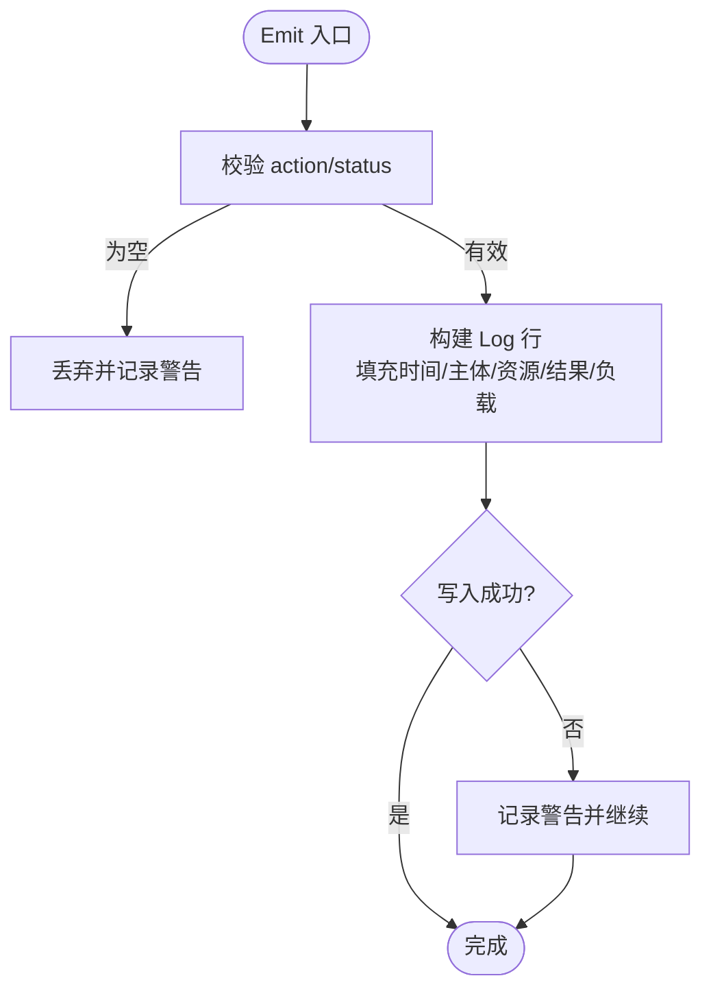
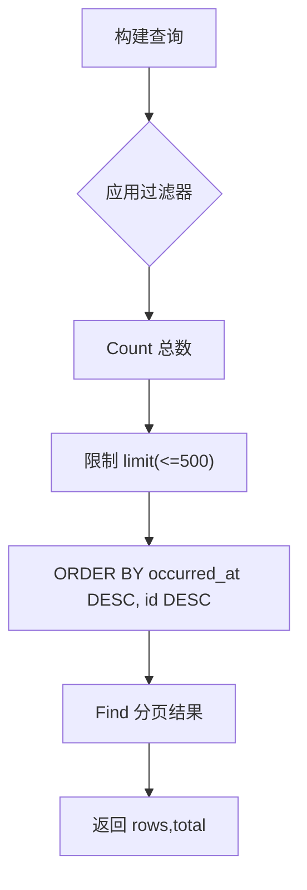
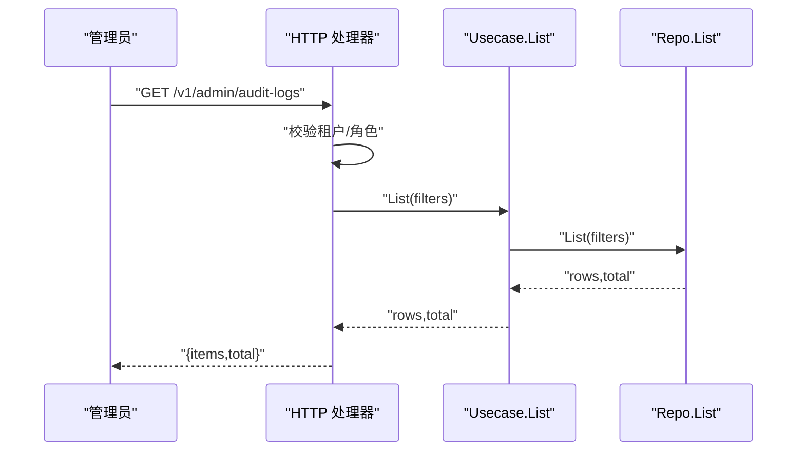
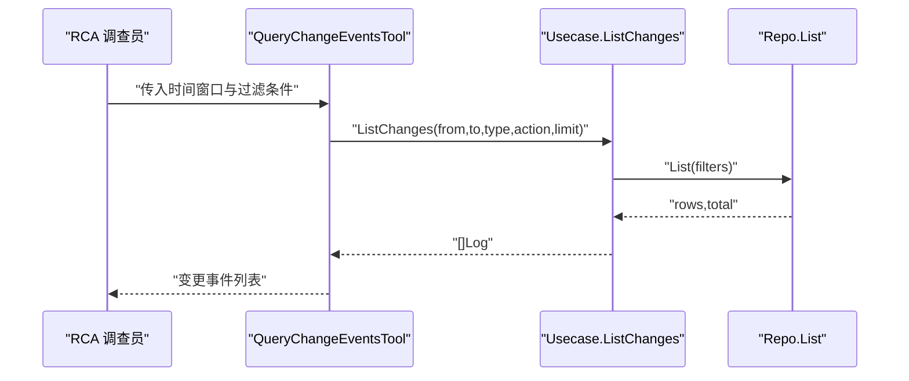
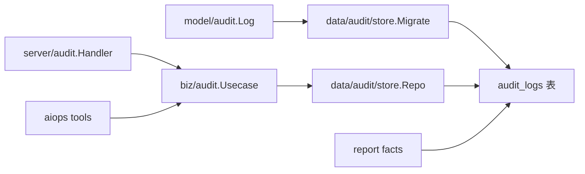

# 审计日志系统

<cite>
**本文引用的文件**
- [internal/manager/model/audit/log.go](file://internal/manager/model/audit/log.go)
- [internal/manager/biz/audit/usecase.go](file://internal/manager/biz/audit/usecase.go)
- [internal/manager/data/audit/store/repo.go](file://internal/manager/data/audit/store/repo.go)
- [internal/manager/data/audit/store/migrate.go](file://internal/manager/data/audit/store/migrate.go)
- [internal/manager/server/audit/http.go](file://internal/manager/server/audit/http.go)
- [internal/manager/biz/aiops/tools/query_change_events_basetool.go](file://internal/manager/biz/aiops/tools/query_change_events_basetool.go)
- [internal/manager/data/report/store/facts.go](file://internal/manager/data/report/store/facts.go)
- [internal/manager/biz/report/content.go](file://internal/manager/biz/report/content.go)
</cite>

## 目录
1. [简介](#简介)
2. [项目结构](#项目结构)
3. [核心组件](#核心组件)
4. [架构总览](#架构总览)
5. [详细组件分析](#详细组件分析)
6. [依赖关系分析](#依赖关系分析)
7. [性能与存储策略](#性能与存储策略)
8. [分析与报告能力](#分析与报告能力)
9. [配置与告警示例](#配置与告警示例)
10. [隐私、访问控制与合规](#隐私访问控制与合规)
11. [与外部 SIEM 集成](#与外部-siem-集成)
12. [故障排查指南](#故障排查指南)
13. [结论](#结论)

## 简介
本技术文档围绕 ongrid 的审计日志系统（HLD-010）展开，聚焦操作审计的设计与实现：关键操作记录、安全事件追踪、合规报告生成；并说明数据采集机制（API 调用、用户行为、系统状态变更）、存储策略（持久化、查询优化、归档）、分析能力（异常检测、趋势分析、报表生成），以及配置与告警建议、数据隐私保护、访问控制、性能优化和与外部 SIEM 系统的集成方式。

## 项目结构
审计日志系统采用分层设计：
- 模型层：定义审计日志实体、枚举常量与表名映射。
- 业务层：提供统一写入接口、列表查询、变更回溯与保留清理。
- 数据层：基于 GORM 的插入、分页过滤查询与过期删除。
- 服务层：暴露管理员只读 API 用于审计日志浏览。
- 工具与报告：为 AIOps 根因分析提供“某时间窗口内变更”查询；为周期报告聚合审计计数。

图表来源
- [internal/manager/server/audit/http.go:1-34](file://internal/manager/server/audit/http.go#L1-L34)
- [internal/manager/biz/audit/usecase.go:1-23](file://internal/manager/biz/audit/usecase.go#L1-L23)
- [internal/manager/data/audit/store/repo.go:14-47](file://internal/manager/data/audit/store/repo.go#L14-L47)
- [internal/manager/model/audit/log.go:10-51](file://internal/manager/model/audit/log.go#L10-L51)

章节来源
- [internal/manager/model/audit/log.go:10-51](file://internal/manager/model/audit/log.go#L10-L51)
- [internal/manager/biz/audit/usecase.go:1-23](file://internal/manager/biz/audit/usecase.go#L1-L23)
- [internal/manager/data/audit/store/repo.go:14-47](file://internal/manager/data/audit/store/repo.go#L14-L47)
- [internal/manager/server/audit/http.go:1-34](file://internal/manager/server/audit/http.go#L1-L34)

## 核心组件
- 审计日志模型：定义审计行结构、索引字段、状态与动作常量、资源类型分组。
- 业务用例：统一写入（Emit）、列表查询（List）、变更回溯（ListChanges）、保留清理（RunRetention）。
- 数据仓库：GORM 封装 Insert、带过滤的分页 List、按时间删除 DeleteOlderThan。
- HTTP 处理器：管理员权限校验后的审计日志分页查询接口。
- 工具与报告：AIOps 变更查询工具、报告事实收集对审计日志的统计使用。

章节来源
- [internal/manager/model/audit/log.go:10-136](file://internal/manager/model/audit/log.go#L10-L136)
- [internal/manager/biz/audit/usecase.go:29-147](file://internal/manager/biz/audit/usecase.go#L29-L147)
- [internal/manager/data/audit/store/repo.go:35-101](file://internal/manager/data/audit/store/repo.go#L35-L101)
- [internal/manager/server/audit/http.go:22-110](file://internal/manager/server/audit/http.go#L22-L110)
- [internal/manager/biz/aiops/tools/query_change_events_basetool.go:15-32](file://internal/manager/biz/aiops/tools/query_change_events_basetool.go#L15-L32)
- [internal/manager/data/report/store/facts.go:268-368](file://internal/manager/data/report/store/facts.go#L268-L368)

## 架构总览
审计日志系统遵循“写多读少、不可变追加、失败不阻塞业务”的原则：
- 采集点：通过业务中间件或处理器在关键操作前后构造 Event，调用 Usecase.Emit 写入。
- 存储：单表 audit_logs，包含操作者、资源、动作、结果与结构化负载；附带请求 ID 便于关联链路日志。
- 读取：管理员 API 支持按用户、动作、资源类型、状态、时间范围分页查询。
- 生命周期：每日定时任务清理早于保留期的记录。
- 消费：AIOps 工具拉取变更事件辅助根因分析；报告模块统计成功操作数等指标。

图表来源
- [internal/manager/server/audit/http.go:60-110](file://internal/manager/server/audit/http.go#L60-L110)
- [internal/manager/biz/audit/usecase.go:118-124](file://internal/manager/biz/audit/usecase.go#L118-L124)
- [internal/manager/data/audit/store/repo.go:52-93](file://internal/manager/data/audit/store/repo.go#L52-L93)

## 详细组件分析

### 审计日志模型与常量
- 字段设计：包含发生时间、操作者信息（ID/邮箱/角色/IP/UserAgent）、动作、资源维度（类型/ID/名称）、结果（状态/错误码/错误信息）、结构化负载、请求 ID、创建时间。
- 索引：occurred_at、action、resource(resource_type+resource_id)、status 等索引支撑高频过滤与排序。
- 常量：限定 action、resource_type、status 的取值空间，保证 UI 筛选稳定且可扩展。

图表来源
- [internal/manager/model/audit/log.go:10-51](file://internal/manager/model/audit/log.go#L10-L51)

章节来源
- [internal/manager/model/audit/log.go:10-136](file://internal/manager/model/audit/log.go#L10-L136)

### 业务用例：写入、查询、变更回溯与保留
- Emit：构造 Log 行并持久化；空 action/status 丢弃并告警；payload 序列化失败仅记录警告；写入失败不返回给调用方，确保业务不阻塞。
- List：透传至 store 层进行过滤与分页。
- ListChanges：面向 RCA 的便捷方法，限制时间窗口与资源/动作，默认上限 50。
- RunRetention：每日 03:00 执行一次，删除早于 cutoff 的记录；retentionDays<=0 时禁用自动清理。

图表来源
- [internal/manager/biz/audit/usecase.go:72-116](file://internal/manager/biz/audit/usecase.go#L72-L116)

章节来源
- [internal/manager/biz/audit/usecase.go:72-190](file://internal/manager/biz/audit/usecase.go#L72-L190)

### 数据仓库：插入、过滤查询与删除
- Insert：追加写入，失败由上层处理。
- List：支持 user_email、action、resource_type、status、from/to 过滤；limit 最大 500，默认 50；按 occurred_at DESC, id DESC 排序；先 Count 再 Find。
- DeleteOlderThan：按 occurred_at < cutoff 批量删除，返回影响行数。

图表来源
- [internal/manager/data/audit/store/repo.go:52-101](file://internal/manager/data/audit/store/repo.go#L52-L101)

章节来源
- [internal/manager/data/audit/store/repo.go:35-101](file://internal/manager/data/audit/store/repo.go#L35-L101)

### HTTP 处理器：管理员审计日志查询
- 路由：GET /v1/admin/audit-logs
- 鉴权：从租户上下文提取角色，要求 admin 或 superuser；拒绝访问不产生审计行（避免噪音）。
- 参数：user_email、action、resource_type、status、from、to、limit、offset。
- 响应：{ items[], total }。

图表来源
- [internal/manager/server/audit/http.go:30-110](file://internal/manager/server/audit/http.go#L30-L110)
- [internal/manager/biz/audit/usecase.go:118-124](file://internal/manager/biz/audit/usecase.go#L118-L124)
- [internal/manager/data/audit/store/repo.go:52-93](file://internal/manager/data/audit/store/repo.go#L52-L93)

章节来源
- [internal/manager/server/audit/http.go:22-110](file://internal/manager/server/audit/http.go#L22-L110)

### AIOps 变更回溯工具
- 目的：在 incident 附近的时间窗口内，列出通过 ongrid 发生的变更（规则、设置、设备等），辅助根因定位。
- 输入：from、to、resource_type、action、limit。
- 输出：审计日志列表（包含失败/拒绝，因为尝试变更本身也是线索）。

图表来源
- [internal/manager/biz/aiops/tools/query_change_events_basetool.go:15-32](file://internal/manager/biz/aiops/tools/query_change_events_basetool.go#L15-L32)
- [internal/manager/biz/audit/usecase.go:126-147](file://internal/manager/biz/audit/usecase.go#L126-L147)
- [internal/manager/data/audit/store/repo.go:52-93](file://internal/manager/data/audit/store/repo.go#L52-L93)

章节来源
- [internal/manager/biz/aiops/tools/query_change_events_basetool.go:15-32](file://internal/manager/biz/aiops/tools/query_change_events_basetool.go#L15-L32)
- [internal/manager/biz/audit/usecase.go:126-147](file://internal/manager/biz/audit/usecase.go#L126-L147)

### 报告事实收集：审计统计
- 用途：在周期报告中汇总“安全/成功操作数量”等事实，作为 LLM 生成报告的依据之一。
- 数据来源：SQL 直接统计 audit_logs 中指定时间段的成功条目。

章节来源
- [internal/manager/data/report/store/facts.go:335-368](file://internal/manager/data/report/store/facts.go#L335-L368)
- [internal/manager/biz/report/content.go:83-106](file://internal/manager/biz/report/content.go#L83-L106)

## 依赖关系分析
- 模型到数据层：store.Migrate 注册 model.Log 的自动迁移。
- 业务到数据层：Usecase 依赖 Repo 接口，屏蔽具体存储实现。
- 服务到业务：HTTP 处理器依赖 Usecase 提供查询能力。
- 上层消费：AIOps 工具与报告模块分别依赖 Usecase 或直接 SQL 访问。

图表来源
- [internal/manager/data/audit/store/migrate.go:11-14](file://internal/manager/data/audit/store/migrate.go#L11-L14)
- [internal/manager/biz/audit/usecase.go:17-23](file://internal/manager/biz/audit/usecase.go#L17-L23)
- [internal/manager/data/audit/store/repo.go:14-33](file://internal/manager/data/audit/store/repo.go#L14-L33)
- [internal/manager/server/audit/http.go:22-34](file://internal/manager/server/audit/http.go#L22-L34)

章节来源
- [internal/manager/data/audit/store/migrate.go:1-14](file://internal/manager/data/audit/store/migrate.go#L1-L14)
- [internal/manager/biz/audit/usecase.go:17-23](file://internal/manager/biz/audit/usecase.go#L17-L23)
- [internal/manager/data/audit/store/repo.go:14-33](file://internal/manager/data/audit/store/repo.go#L14-L33)
- [internal/manager/server/audit/http.go:22-34](file://internal/manager/server/audit/http.go#L22-L34)

## 性能与存储策略
- 写入路径：Append-only，失败不阻塞业务；payload 序列化失败降级为记录警告。
- 查询优化：
  - 索引：occurred_at、action、resource(resource_type+resource_id)、status 提升过滤效率。
  - 分页：limit 上限 500，默认 50；按 occurred_at DESC, id DESC 排序保证稳定性。
  - 先 Count 后 Find，避免大结果集传输。
- 归档与保留：
  - 每日 03:00 触发保留清理，删除早于 cutoff 的记录；可配置 retentionDays 以启用/禁用。
  - 若外部归档优先，可将 retentionDays<=0 交由外部流程管理。
- 扩展性建议：
  - 高吞吐场景可考虑异步写入队列（如消息总线）缓冲写入峰值。
  - 冷热分离：将历史数据归档至低成本存储，查询走热库。

章节来源
- [internal/manager/biz/audit/usecase.go:72-116](file://internal/manager/biz/audit/usecase.go#L72-L116)
- [internal/manager/data/audit/store/repo.go:52-101](file://internal/manager/data/audit/store/repo.go#L52-L101)
- [internal/manager/biz/audit/usecase.go:149-183](file://internal/manager/biz/audit/usecase.go#L149-L183)

## 分析与报告能力
- 异常检测：
  - 通过 action=auth_login_failed 与 status=failure/denied 的组合识别潜在暴力破解或越权尝试。
  - 结合时间窗口与资源维度，快速定位异常集中时段与目标。
- 趋势分析：
  - 利用 occurred_at 与 resource_type/action 维度做时间序列统计，观察变更频率与资源热度。
- 报表生成：
  - 报告事实收集阶段统计成功操作数量，作为“安全操作总量”的事实输入。
  - 报告内容结构包含 ActionsSummary（mutating_total、mutating_approved、safe_total、by_tool）等字段。

章节来源
- [internal/manager/model/audit/log.go:53-116](file://internal/manager/model/audit/log.go#L53-L116)
- [internal/manager/data/report/store/facts.go:335-368](file://internal/manager/data/report/store/facts.go#L335-L368)
- [internal/manager/biz/report/content.go:83-106](file://internal/manager/biz/report/content.go#L83-L106)

## 配置与告警示例
- 保留策略：
  - 启用：设置 retentionDays>0，系统将每日 03:00 清理早于该天数的记录。
  - 禁用：设置 retentionDays<=0，关闭内置清理，交由外部归档流程管理。
- 查询过滤：
  - 常用参数：user_email、action、resource_type、status、from、to、limit、offset。
  - 建议：始终限定 from/to 与 limit，避免全表扫描与大响应体。
- 告警规则建议：
  - 登录失败突增：在短窗口内 auth_login_failed 次数超过阈值。
  - 拒绝访问激增：denied 状态在特定资源类型上突增。
  - 敏感设置变更：setting_update 在高风险 key 上频繁出现。
  - 批量删除：device_delete/rule_delete 在短时间内大量发生。
- 注意：
  - 读取审计日志的行为不再生成审计行，以避免噪音淹没变更信号。

章节来源
- [internal/manager/biz/audit/usecase.go:149-183](file://internal/manager/biz/audit/usecase.go#L149-L183)
- [internal/manager/server/audit/http.go:60-110](file://internal/manager/server/audit/http.go#L60-L110)
- [internal/manager/model/audit/log.go:53-116](file://internal/manager/model/audit/log.go#L53-L116)

## 隐私、访问控制与合规
- 隐私保护：
  - payload 必须在上游进行脱敏（LLM 密钥、SSH 密钥、密码、令牌等），仅记录变更形状而非敏感值。
  - 错误信息长度截断，防止过长文本污染存储与展示。
- 访问控制：
  - 审计日志查询仅限 admin 或 superuser；非授权访问返回 403，且不产生审计行。
- 合规要点：
  - 不可篡改：审计日志为追加型记录，除保留清理外不允许修改或删除。
  - 可追溯：每条记录携带 request_id，可与结构化日志/链路追踪关联。
  - 最小化：action/resource_type/status 使用受控枚举，降低歧义与滥用风险。

章节来源
- [internal/manager/model/audit/log.go:10-51](file://internal/manager/model/audit/log.go#L10-L51)
- [internal/manager/server/audit/http.go:60-73](file://internal/manager/server/audit/http.go#L60-L73)
- [internal/manager/biz/audit/usecase.go:72-116](file://internal/manager/biz/audit/usecase.go#L72-L116)

## 与外部 SIEM 集成
- 导出方式：
  - 通过管理员 API 分页拉取审计日志，结合 from/to、action、resource_type、status 等过滤条件，定期增量同步至 SIEM。
  - 使用 request_id 与外部日志系统进行关联分析。
- 安全传输：
  - 使用 HTTPS 与认证凭据访问 API；建议在 SIEM 侧配置最小权限账号。
- 解析与入库：
  - 将 JSON 字段（payload_json）解析为结构化字段，便于 SIEM 侧检索与告警。
  - 将 occurred_at 映射为 SIEM 时间戳，保持时序一致性。
- 注意事项：
  - 控制拉取频率与批次大小，避免对源系统造成压力。
  - 对 payload 中的敏感信息进行二次脱敏后再入库。

章节来源
- [internal/manager/server/audit/http.go:60-110](file://internal/manager/server/audit/http.go#L60-L110)
- [internal/manager/model/audit/log.go:10-51](file://internal/manager/model/audit/log.go#L10-L51)

## 故障排查指南
- 写入失败：
  - 现象：业务正常但审计缺失。
  - 排查：检查 Usecase.Emit 的 warn 日志，确认 repo.Insert 是否报错；关注数据库连接与磁盘空间。
- 查询缓慢：
  - 现象：审计列表加载慢。
  - 排查：确认是否未设置 from/to 与 limit；检查索引是否生效；评估是否存在超大 payload 导致响应过大。
- 保留清理未执行：
  - 现象：审计日志持续增长。
  - 排查：确认 retentionDays>0；查看每日 03:00 清理任务是否被取消或报错；检查 DeleteOlderThan 的影响行数。
- 权限问题：
  - 现象：访问审计 API 返回 403。
  - 排查：确认租户上下文角色是否为 admin 或 superuser；检查中间件是否正确注入上下文。

章节来源
- [internal/manager/biz/audit/usecase.go:72-116](file://internal/manager/biz/audit/usecase.go#L72-L116)
- [internal/manager/data/audit/store/repo.go:52-101](file://internal/manager/data/audit/store/repo.go#L52-L101)
- [internal/manager/biz/audit/usecase.go:149-183](file://internal/manager/biz/audit/usecase.go#L149-L183)
- [internal/manager/server/audit/http.go:60-73](file://internal/manager/server/audit/http.go#L60-L73)

## 结论
ondrid 审计日志系统以简洁稳定的模型与分层架构，实现了“谁在何时对何资源做了什么”的可审计记录。其设计强调：
- 写入不阻塞业务、失败可观测；
- 查询具备高效过滤与分页；
- 保留策略可控、可外部归档；
- 面向 AIOps 的变更回溯与报告事实聚合；
- 严格的访问控制与隐私脱敏。
在生产环境中，建议配合 SIEM 进行集中化分析，并结合告警规则实现对异常操作的及时响应与合规审计。