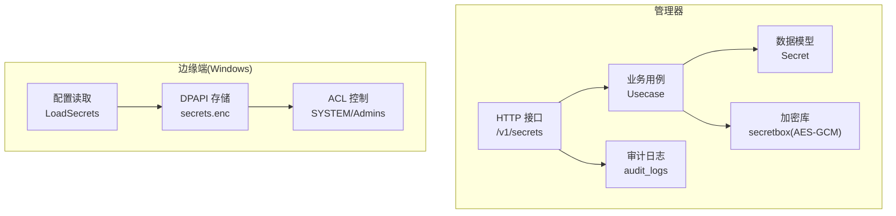
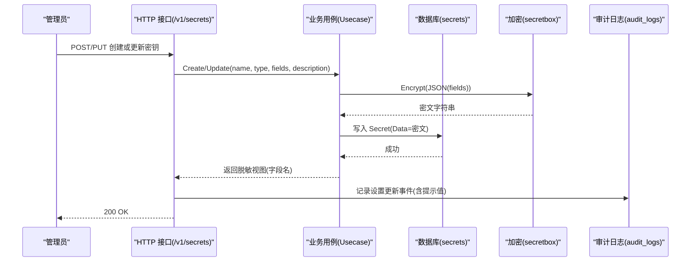
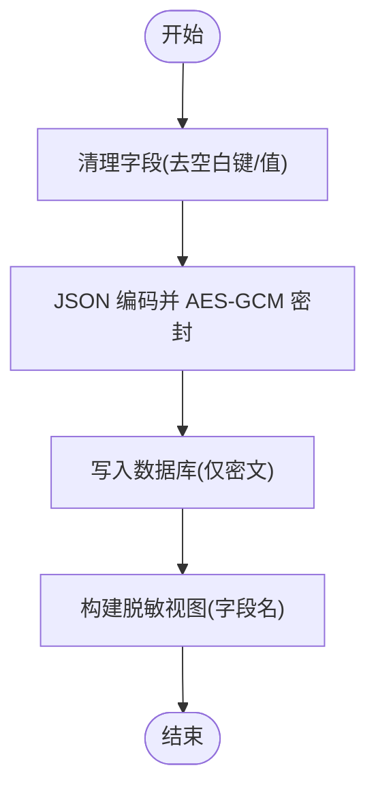
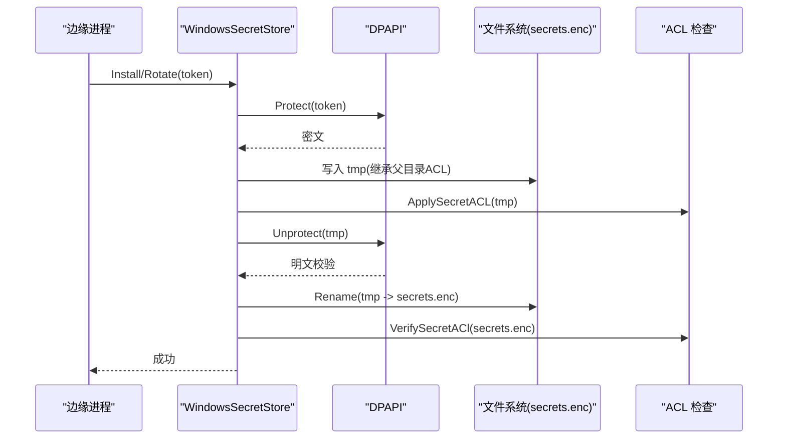
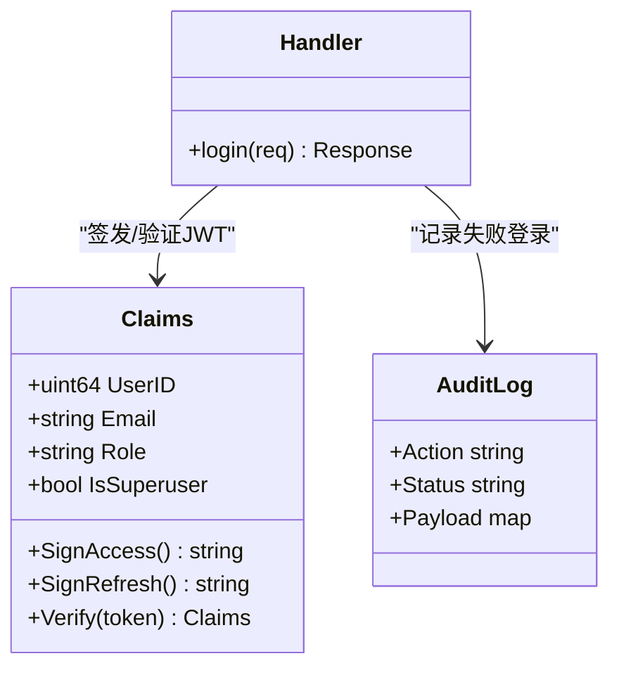
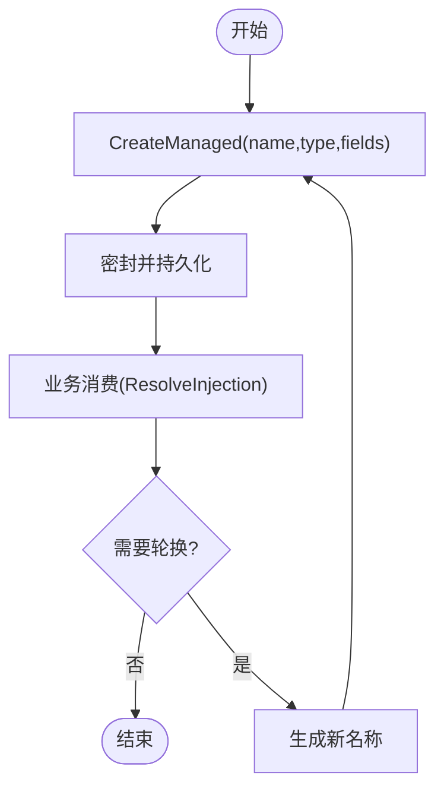
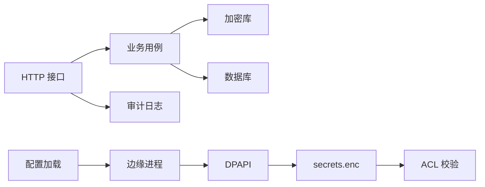

# 密钥管理系统

<cite>
**本文引用的文件**
- [secretbox.go](file://internal/pkg/secretbox/secretbox.go)
- [usecase.go](file://internal/manager/biz/secret/usecase.go)
- [model.go](file://internal/manager/model/secret/model.go)
- [http.go](file://internal/manager/server/secret/http.go)
- [secrets_windows.go](file://internal/edgeagent/install/secrets_windows.go)
- [acl_windows.go](file://internal/edgeagent/install/acl_windows.go)
- [secrets.go](file://internal/edgeagent/config/secrets.go)
- [config.go](file://internal/pkg/config/config.go)
- [jwt.go](file://internal/pkg/auth/jwt.go)
- [log.go](file://internal/manager/model/audit/log.go)
- [usecase.go](file://internal/manager/biz/audit/usecase.go)
- [http.go](file://internal/iam/server/http.go)
- [service.go](file://internal/manager/biz/logs/service.go)
- [data-permissions.sh](file://deploy/install/data-permissions.sh)
</cite>

## 目录
1. [简介](#简介)
2. [项目结构](#项目结构)
3. [核心组件](#核心组件)
4. [架构总览](#架构总览)
5. [详细组件分析](#详细组件分析)
6. [依赖关系分析](#依赖关系分析)
7. [性能考虑](#性能考虑)
8. [故障排查指南](#故障排查指南)
9. [结论](#结论)
10. [附录](#附录)

## 简介
本文件面向“密钥管理系统”的安全架构与实现，覆盖敏感信息的加密存储、访问控制、生命周期管理（含轮换）、审计追踪、备份恢复与灾难恢复策略，以及与外部密钥管理服务（如 HashiCorp Vault）的集成建议。系统采用“进程内加密 + 文件系统 ACL + 数据库密文存储”的分层防护思路：管理器侧使用 AES-256-GCM 对凭据字段进行密封存储；边缘侧在 Windows 平台使用 DPAPI 加密本地 secrets.enc，并通过严格的 ACL 限制仅 SYSTEM 与管理员可读写；所有写操作均通过鉴权中间件与审计日志记录，确保可追溯。

## 项目结构
密钥管理相关代码分布在以下层次：
- 加密原语：pkg/secretbox（AES-256-GCM）
- 业务用例：manager/biz/secret（凭据创建、更新、列表、解析注入）
- 数据模型：manager/model/secret（持久化实体）
- HTTP 接口：manager/server/secret（只读返回脱敏视图，写操作受管理员保护）
- 边缘端安全存储：edgeagent/install（Windows DPAPI + ACL）
- 配置加载：pkg/config（环境变量驱动）
- 认证与授权：pkg/auth（JWT）、iam/server（登录与限流）
- 审计：manager/model/audit、manager/biz/audit（统一审计事件）
- 运维脚本：deploy/install（权限修复与回滚辅助）

图表来源
- [http.go:25-33](file://internal/manager/server/secret/http.go#L25-L33)
- [usecase.go:48-175](file://internal/manager/biz/secret/usecase.go#L48-L175)
- [model.go:17-45](file://internal/manager/model/secret/model.go#L17-L45)
- [secretbox.go:53-109](file://internal/pkg/secretbox/secretbox.go#L53-L109)
- [secrets_windows.go:36-169](file://internal/edgeagent/install/secrets_windows.go#L36-L169)
- [acl_windows.go:60-191](file://internal/edgeagent/install/acl_windows.go#L60-L191)
- [secrets.go:12-38](file://internal/edgeagent/config/secrets.go#L12-L38)

章节来源
- [http.go:25-33](file://internal/manager/server/secret/http.go#L25-L33)
- [usecase.go:48-175](file://internal/manager/biz/secret/usecase.go#L48-L175)
- [model.go:17-45](file://internal/manager/model/secret/model.go#L17-L45)
- [secretbox.go:53-109](file://internal/pkg/secretbox/secretbox.go#L53-L109)
- [secrets_windows.go:36-169](file://internal/edgeagent/install/secrets_windows.go#L36-L169)
- [acl_windows.go:60-191](file://internal/edgeagent/install/acl_windows.go#L60-L191)
- [secrets.go:12-38](file://internal/edgeagent/config/secrets.go#L12-L38)

## 核心组件
- 加密存储（管理器）：使用 AES-256-GCM 对凭据字段 JSON 进行密封，密文以版本前缀 + base64 形式存储于数据库，避免明文落库。
- 加密存储（边缘端）：Windows 下使用 DPAPI 加密 token 写入 secrets.enc，配合严格 ACL 限制仅 SYSTEM 与 Administrators 可读写。
- 访问控制：所有密钥管理 API 需管理员权限；登录接口具备速率限制与失败审计；JWT 承载用户身份与角色。
- 生命周期管理：支持凭据创建、更新、删除；边缘端支持原子轮转（临时文件 + 原子重命名），并验证 ACL。
- 审计追踪：统一审计表记录关键动作（如设置更新、登录失败等），便于事后溯源。
- 配置与环境：通过环境变量加载运行时配置，包括加密密钥、服务地址、TLS 参数等。

章节来源
- [secretbox.go:53-109](file://internal/pkg/secretbox/secretbox.go#L53-L109)
- [secrets_windows.go:96-169](file://internal/edgeagent/install/secrets_windows.go#L96-L169)
- [http.go:25-33](file://internal/manager/server/secret/http.go#L25-L33)
- [http.go:221-269](file://internal/iam/server/http.go#L221-L269)
- [jwt.go:16-99](file://internal/pkg/auth/jwt.go#L16-L99)
- [log.go:49-76](file://internal/manager/model/audit/log.go#L49-L76)
- [config.go:417-549](file://internal/pkg/config/config.go#L417-L549)

## 架构总览
下图展示从请求到存储的端到端流程：管理员通过 HTTP 接口创建或更新密钥，业务层将字段映射为 JSON 并使用 AES-GCM 密封后持久化；列表接口仅返回字段名，不暴露值；边缘端启动时从受限目录读取 secrets.enc，经 DPAPI 解密获取 token；所有敏感写操作均记录审计日志。

图表来源
- [http.go:25-33](file://internal/manager/server/secret/http.go#L25-L33)
- [usecase.go:48-89](file://internal/manager/biz/secret/usecase.go#L48-L89)
- [secretbox.go:53-75](file://internal/pkg/secretbox/secretbox.go#L53-L75)
- [model.go:17-45](file://internal/manager/model/secret/model.go#L17-L45)
- [log.go:49-76](file://internal/manager/model/audit/log.go#L49-L76)

## 详细组件分析

### 加密存储（管理器侧 AES-256-GCM）
- 算法与密钥派生：使用 AES-256-GCM，密钥由环境变量 ONGRID_SECRET_KEY 经 SHA-256 派生；若未设置则使用内置弱密钥并标记 KeyIsWeak，便于启动告警。
- 密文格式：版本前缀 v1: + base64(nonce || ciphertext+tag)，便于未来方案升级。
- 数据模型：Secret.Data 列存储密封后的 JSON 字符串，读 API 不返回该字段。
- 业务封装：Usecase.Create/Update 负责清理字段、密封并持久化；List 返回脱敏视图（仅字段名）。

图表来源
- [secretbox.go:31-51](file://internal/pkg/secretbox/secretbox.go#L31-L51)
- [secretbox.go:53-109](file://internal/pkg/secretbox/secretbox.go#L53-L109)
- [usecase.go:48-89](file://internal/manager/biz/secret/usecase.go#L48-L89)
- [model.go:17-45](file://internal/manager/model/secret/model.go#L17-L45)

章节来源
- [secretbox.go:31-109](file://internal/pkg/secretbox/secretbox.go#L31-L109)
- [usecase.go:48-89](file://internal/manager/biz/secret/usecase.go#L48-L89)
- [model.go:17-45](file://internal/manager/model/secret/model.go#L17-L45)

### 加密存储（边缘端 Windows DPAPI + ACL）
- 安装流程：确保父目录 ACL 受限 → DPAPI 加密 token → 写入 secrets.enc → 应用并验证 ACL → round-trip 校验。
- 轮转流程：创建随机 tmp 文件 → 写入加密内容并应用 ACL → round-trip 校验 → 原子重命名为 secrets.enc → 再次验证 ACL（失败仅警告，因为新 token 已生效）。
- 读取流程：读取 secrets.enc → DPAPI 解密 → 返回明文 token（调用方可回退至环境变量）。

图表来源
- [secrets_windows.go:36-86](file://internal/edgeagent/install/secrets_windows.go#L36-L86)
- [secrets_windows.go:96-169](file://internal/edgeagent/install/secrets_windows.go#L96-L169)
- [acl_windows.go:60-191](file://internal/edgeagent/install/acl_windows.go#L60-L191)
- [secrets.go:12-38](file://internal/edgeagent/config/secrets.go#L12-L38)

章节来源
- [secrets_windows.go:36-169](file://internal/edgeagent/install/secrets_windows.go#L36-L169)
- [acl_windows.go:60-191](file://internal/edgeagent/install/acl_windows.go#L60-L191)
- [secrets.go:12-38](file://internal/edgeagent/config/secrets.go#L12-L38)

### 访问控制与审计
- 登录与限流：登录接口按 IP+邮箱维度限流，失败记录审计事件，防止暴力破解。
- JWT 鉴权：签发短时效访问令牌与长时效刷新令牌，携带用户 ID、邮箱、角色与超级用户标志；中间件验证签名与有效期。
- 资源级权限：密钥管理接口要求管理员权限；设置更新会记录审计事件，包含类别、键、是否敏感及值提示（非完整值）。
- 审计事件：统一审计表记录成功、失败、拒绝状态，动作采用动词_资源命名规范，具体细节在负载中体现。

图表来源
- [jwt.go:16-99](file://internal/pkg/auth/jwt.go#L16-L99)
- [http.go:221-269](file://internal/iam/server/http.go#L221-L269)
- [log.go:49-76](file://internal/manager/model/audit/log.go#L49-L76)

章节来源
- [jwt.go:16-99](file://internal/pkg/auth/jwt.go#L16-L99)
- [http.go:221-269](file://internal/iam/server/http.go#L221-L269)
- [log.go:49-76](file://internal/manager/model/audit/log.go#L49-L76)
- [usecase.go:118-147](file://internal/manager/biz/audit/usecase.go#L118-L147)

### 生命周期管理与轮换
- 凭据生命周期：创建（密封存储）、更新（重新密封）、删除（按 ID）、列表（脱敏视图）、解析注入（进程内解密用于注入环境变量）。
- 边缘端轮换：原子替换 secrets.enc，先写临时文件并验证，再重命名；轮转后即使 ACL 验证失败也仅警告，因为新 token 已生效。
- 托管凭据：其他模块可通过 CreateManaged/DeleteManaged 管理独立命名的凭据，失败时可补偿删除。

图表来源
- [usecase.go:91-118](file://internal/manager/biz/secret/usecase.go#L91-L118)
- [usecase.go:137-175](file://internal/manager/biz/secret/usecase.go#L137-L175)
- [secrets_windows.go:96-169](file://internal/edgeagent/install/secrets_windows.go#L96-L169)

章节来源
- [usecase.go:91-175](file://internal/manager/biz/secret/usecase.go#L91-L175)
- [secrets_windows.go:96-169](file://internal/edgeagent/install/secrets_windows.go#L96-L169)

### 与外部密钥管理服务（Vault）集成建议
当前仓库未直接实现与 HashiCorp Vault 的集成。建议采用以下模式：
- 动态凭据：通过 Vault Agent 或 Sidecar 将短期凭据注入到容器环境变量或文件，再由应用读取。
- 静态凭据：将长期密钥存入 Vault，应用启动时通过 Vault SDK 拉取并缓存，定期刷新。
- 审计与合规：利用 Vault 的审计日志与策略引擎，结合本系统的审计表形成闭环。
- 迁移路径：在 manager 侧增加“密钥源”抽象，优先从 Vault 拉取，失败回退到本地 secretbox 存储，逐步迁移。

[本节为概念性说明，不直接引用具体源码]

## 依赖关系分析
- 管理器侧依赖链：HTTP 接口 → 业务用例 → 加密库 → 数据库；审计日志贯穿写操作。
- 边缘端依赖链：配置读取 → DPAPI 解密 → 文件系统 ACL 校验；轮转过程依赖原子重命名与临时文件隔离。
- 认证与授权：JWT 中间件保障接口访问控制；登录接口限流与审计增强安全性。

图表来源
- [http.go:25-33](file://internal/manager/server/secret/http.go#L25-L33)
- [usecase.go:48-175](file://internal/manager/biz/secret/usecase.go#L48-L175)
- [secretbox.go:53-109](file://internal/pkg/secretbox/secretbox.go#L53-L109)
- [secrets_windows.go:36-169](file://internal/edgeagent/install/secrets_windows.go#L36-L169)
- [acl_windows.go:60-191](file://internal/edgeagent/install/acl_windows.go#L60-L191)
- [config.go:417-549](file://internal/pkg/config/config.go#L417-L549)

章节来源
- [http.go:25-33](file://internal/manager/server/secret/http.go#L25-L33)
- [usecase.go:48-175](file://internal/manager/biz/secret/usecase.go#L48-L175)
- [secretbox.go:53-109](file://internal/pkg/secretbox/secretbox.go#L53-L109)
- [secrets_windows.go:36-169](file://internal/edgeagent/install/secrets_windows.go#L36-L169)
- [acl_windows.go:60-191](file://internal/edgeagent/install/acl_windows.go#L60-L191)
- [config.go:417-549](file://internal/pkg/config/config.go#L417-L549)

## 性能考虑
- 加密开销：AES-GCM 加解密为对称加密，性能良好；批量处理时可复用 cipher.GCM 实例以减少对象分配。
- 磁盘 I/O：边缘端轮转使用临时文件与原子重命名，减少锁竞争与并发问题；建议将 secrets.enc 置于高性能 SSD。
- 审计写入：审计日志为追加写，注意磁盘 IO 与索引维护；可按资源类型分表或分区以提升查询性能。
- 配置加载：环境变量读取为轻量操作，建议在启动阶段集中加载并缓存。

[本节提供通用指导，不直接分析具体文件]

## 故障排查指南
- 登录失败审计：检查登录接口的限流与失败审计事件，定位密码喷洒或异常 IP。
- 密钥列表为空：确认业务用例 List 是否因解密失败仍返回行（仅字段名）；检查数据库密文格式与密钥环境。
- 边缘端无法读取 secrets.enc：验证父目录 ACL 是否正确（仅 SYSTEM/Admins），检查 DPAPI 解密错误与文件权限。
- 轮转后 ACL 漂移：轮转流程会 warn 而非 error，需人工修复 ACL；检查 GPO/AV 是否修改了权限。
- 数据目录权限修复：使用部署脚本修复数据目录权限并在失败时尝试恢复现有栈。

章节来源
- [http.go:221-269](file://internal/iam/server/http.go#L221-L269)
- [usecase.go:123-135](file://internal/manager/biz/secret/usecase.go#L123-L135)
- [secrets_windows.go:161-169](file://internal/edgeagent/install/secrets_windows.go#L161-L169)
- [acl_windows.go:86-118](file://internal/edgeagent/install/acl_windows.go#L86-L118)
- [data-permissions.sh:174-231](file://deploy/install/data-permissions.sh#L174-L231)

## 结论
本密钥管理系统通过多层防护实现敏感信息的安全管理：管理器侧使用 AES-256-GCM 密封存储，边缘端使用 DPAPI 与严格 ACL 保护本地凭证；访问控制基于 JWT 与管理员权限，审计日志贯穿关键操作；生命周期管理支持凭据 CRUD 与原子轮转；备份恢复与灾难恢复通过脚本与规划文档支撑。建议在生产环境中始终设置强加密密钥、启用审计、定期演练恢复流程，并考虑引入外部密钥管理服务以实现更灵活的密钥治理。

[本节为总结，不直接分析具体文件]

## 附录
- 配置示例（环境变量）：
  - 加密密钥：ONGRID_SECRET_KEY（必须设置，避免弱密钥）
  - 数据库：ONGRID_DB_DIALECT、ONGRID_DB_DSN、ONGRID_DB_PATH
  - JWT：ONGRID_JWT_SECRET、ONGRID_JWT_ACCESS_TTL、ONGRID_JWT_REFRESH_TTL
  - 通知渠道：各渠道 URL 与 Secret（默认关闭）
  - 边缘端：ONGRID_EDGE_COLLECTOR_MODE、ONGRID_EDGE_SCRAPE_CONFIG_FILE、ONGRID_EDGE_COLLECTOR_INTERVAL
- 最佳实践：
  - 生产环境务必设置强加密密钥，避免使用内置弱密钥。
  - 边缘端 secrets.enc 所在目录与文件均需严格 ACL，仅允许 SYSTEM 与 Administrators。
  - 所有写操作开启审计，定期审查审计日志。
  - 轮换策略：为每次变更生成新凭据名称，旧凭据延迟清理，确保零停机。
  - 备份恢复：定期快照数据库与对象存储，演练恢复流程，记录 MTTR。

章节来源
- [config.go:417-549](file://internal/pkg/config/config.go#L417-L549)
- [secretbox.go:31-51](file://internal/pkg/secretbox/secretbox.go#L31-L51)
- [secrets_windows.go:36-86](file://internal/edgeagent/install/secrets_windows.go#L36-L86)
- [log.go:49-76](file://internal/manager/model/audit/log.go#L49-L76)