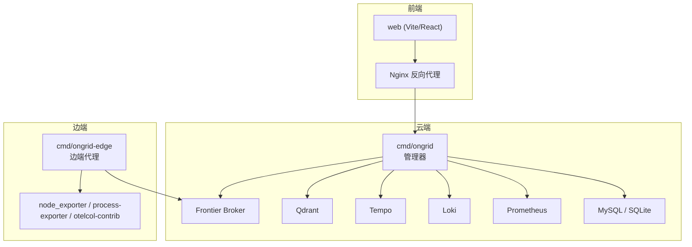
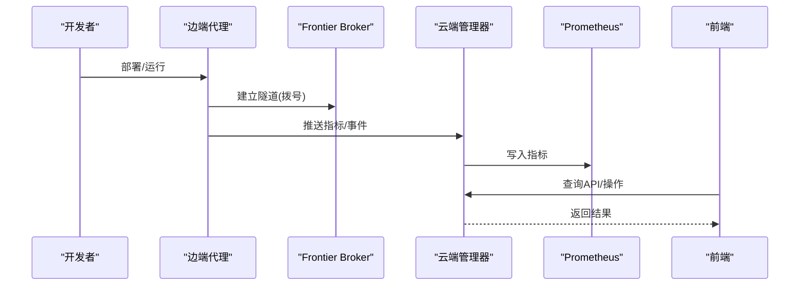
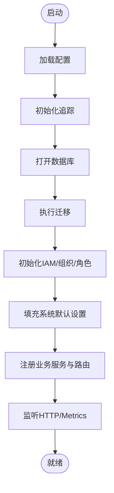
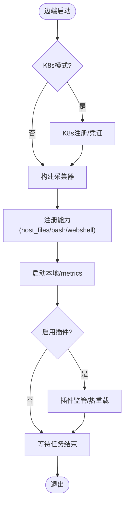
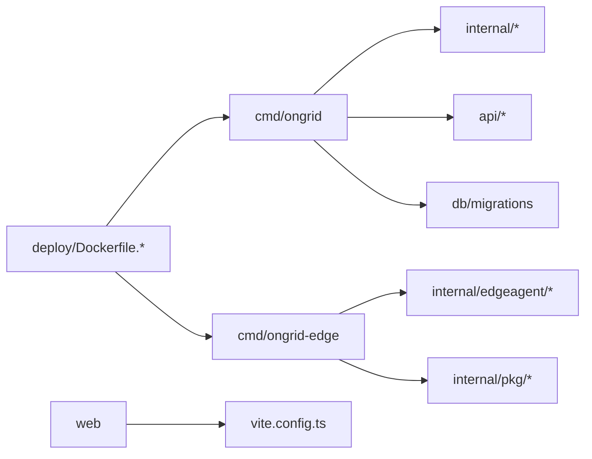

# 开发指南

<cite>
**本文引用的文件**
- [README.md](file://README.md)
- [CONTRIBUTING.md](file://CONTRIBUTING.md)
- [Makefile](file://Makefile)
- [go.mod](file://go.mod)
- [web/package.json](file://web/package.json)
- [cmd/ongrid/main.go](file://cmd/ongrid/main.go)
- [cmd/ongrid-edge/main.go](file://cmd/ongrid-edge/main.go)
- [deploy/Dockerfile.ongrid](file://deploy/Dockerfile.ongrid)
- [deploy/Dockerfile.ongrid-edge](file://deploy/Dockerfile.ongrid-edge)
- [deploy/docker-compose.yml](file://deploy/docker-compose.yml)
- [web/vite.config.ts](file://web/vite.config.ts)
</cite>

## 目录
1. [简介](#简介)
2. [项目结构](#项目结构)
3. [核心组件](#核心组件)
4. [架构总览](#架构总览)
5. [详细组件分析](#详细组件分析)
6. [依赖关系分析](#依赖关系分析)
7. [性能与构建优化](#性能与构建优化)
8. [故障排查指南](#故障排查指南)
9. [结论](#结论)
10. [附录](#附录)

## 简介
本指南面向 Ongrid 项目的开发者，覆盖从环境搭建、代码规范、模块组织到构建发布的全流程。Ongrid 由云端管理器（Go）与边端代理（Go）组成，前端为 TypeScript + React（Vite）。项目通过 Makefile 统一构建、测试与打包；使用 Docker Compose 提供本地全栈开发环境；通过多阶段镜像构建与脚本完成版本化发布。

## 项目结构
- cmd：可执行程序入口
  - ongrid：云端管理器主程序
  - ongrid-edge：边端代理主程序
- internal：业务与通用库
  - manager：云端业务域（告警、设备、Kubernetes、日志、指标等）
  - edgeagent：边端采集、插件、能力注册
  - iam：身份与权限
  - pkg：跨域共享工具（配置、HTTP、鉴权、数据库、遥测等）
  - skill：技能注册与执行
- api：gRPC/Protobuf 接口定义
- deploy：Dockerfile、Compose、Helm Chart、安装脚本
- web：前端 SPA（React + Vite + Tailwind）
- db/migrations：数据库迁移脚本
- scripts：发布、校验、测试辅助脚本
- docs：设计文档、RFC、安装说明等

图表来源
- [deploy/docker-compose.yml:39-185](file://deploy/docker-compose.yml#L39-L185)
- [deploy/Dockerfile.ongrid:118-158](file://deploy/Dockerfile.ongrid#L118-L158)
- [deploy/Dockerfile.ongrid-edge:114-126](file://deploy/Dockerfile.ongrid-edge#L114-L126)
- [web/vite.config.ts:54-63](file://web/vite.config.ts#L54-L63)

章节来源
- [README.md:43-172](file://README.md#L43-L172)
- [CONTRIBUTING.md:7-30](file://CONTRIBUTING.md#L7-L30)

## 核心组件
- 云端管理器（cmd/ongrid）
  - 启动时加载配置、初始化 OTel 追踪、连接数据库并执行迁移
  - 组装 IAM、设置系统默认值、注册各业务服务与中间件
  - 暴露 HTTP API、/metrics、与 Frontier 的长连接回调
- 边端代理（cmd/ongrid-edge）
  - 建立到云端的隧道，周期性上报主机指标
  - 注册 host_files、bash、restart_service、webshell 等能力
  - 在 Kubernetes 模式下支持控制器/节点模式、遥测网关、插件生命周期管理
- 前端（web）
  - Vite 开发服务器与生产构建，按路由拆分 chunk，减少首屏体积
  - 通过 Nginx 反向代理到后端 API

章节来源
- [cmd/ongrid/main.go:208-300](file://cmd/ongrid/main.go#L208-L300)
- [cmd/ongrid-edge/main.go:66-160](file://cmd/ongrid-edge/main.go#L66-L160)
- [web/vite.config.ts:13-52](file://web/vite.config.ts#L13-L52)

## 架构总览
- 通信拓扑
  - 边端主动拨号至云端 Frontier Broker，形成双向通道
  - 管理器通过 SDK 向边端发起调用（如 AIOps 工具）
- 数据流
  - 边端采集主机/进程/数据库指标，经隧道推送至管理器
  - 管理器将指标写入 Prometheus，日志/链路分别进入 Loki/Tempo
  - 前端通过 Nginx 访问管理器 API，展示监控、拓扑、工作流等
- 安全与权限
  - JWT 鉴权、RBAC（Casbin）、审计日志
  - 敏感信息加密存储（密钥库），环境变量注入最小化

图表来源
- [cmd/ongrid/main.go:208-300](file://cmd/ongrid/main.go#L208-L300)
- [cmd/ongrid-edge/main.go:136-160](file://cmd/ongrid-edge/main.go#L136-L160)
- [deploy/docker-compose.yml:214-260](file://deploy/docker-compose.yml#L214-L260)

## 详细组件分析

### 云端管理器（cmd/ongrid）
- 启动流程
  - 加载配置、初始化日志与追踪
  - 打开数据库并执行迁移（AutoMigrate + SQL 迁移）
  - 初始化 IAM（用户、组织、成员、角色策略）
  - 初始化系统设置（LLM、Prom/Loki/Tempo/Grafana 等）
  - 注册各业务服务与 HTTP 路由
- 关键特性
  - 多模型路由（OpenAI、Anthropic、Gemini、DeepSeek、Kimi、智谱）
  - 审计日志、通知渠道、Grafana 集成、Monitor 面板同步
  - 与 Frontier 的长连接回调（边缘握手、心跳、指标推送）

图表来源
- [cmd/ongrid/main.go:208-300](file://cmd/ongrid/main.go#L208-L300)
- [cmd/ongrid/main.go:421-518](file://cmd/ongrid/main.go#L421-L518)

章节来源
- [cmd/ongrid/main.go:208-800](file://cmd/ongrid/main.go#L208-L800)

### 边端代理（cmd/ongrid-edge）
- 启动流程
  - 解析参数与模式（Kubernetes 控制器/节点/普通主机）
  - 建立隧道客户端，根据模式构建采集器（embedded/scrape/auto/off）
  - 注册 host_files、bash、restart_service、webshell 等能力
  - 启动本地 /metrics 与健康检查端口
  - 在 K8s 模式下可选启用遥测网关与插件运行时
- 插件体系
  - node_exporter、process-exporter、otelcol-contrib 作为子进程或内嵌采集器
  - 插件配置变更热重载，健康状态上报

图表来源
- [cmd/ongrid-edge/main.go:66-160](file://cmd/ongrid-edge/main.go#L66-L160)
- [cmd/ongrid-edge/main.go:428-488](file://cmd/ongrid-edge/main.go#L428-L488)
- [cmd/ongrid-edge/main.go:302-417](file://cmd/ongrid-edge/main.go#L302-L417)

章节来源
- [cmd/ongrid-edge/main.go:66-800](file://cmd/ongrid-edge/main.go#L66-L800)

### 前端（web）
- 开发与构建
  - 开发服务器端口 5173，自动代理 /api 到后端
  - 构建目标 es2020，输出 dist，按需拆分 vendor-charts、vendor-xterm
- 路由与性能
  - 通过 manualChunks 控制大依赖拆分，减少登录页首包体积
  - modulePreload 过滤非关键资源，提升首屏速度

章节来源
- [web/vite.config.ts:1-64](file://web/vite.config.ts#L1-L64)
- [web/package.json:6-16](file://web/package.json#L6-L16)

## 依赖关系分析
- Go 模块
  - 核心依赖包括 gRPC/protobuf、ORM（GORM）、鉴权（JWT/Casbin）、遥测（OTel）、消息与队列（Frontier）、向量检索（Qdrant）等
- 前端依赖
  - React、Vite、Tailwind、Zustand、图表库（recharts/dagre）、终端（xterm）
- 容器镜像
  - 管理器镜像基于 debian-slim，包含 ONNX Runtime、Python 等运行时依赖
  - 边端镜像基于 distroless，仅包含二进制与必要插件

图表来源
- [go.mod:1-44](file://go.mod#L1-L44)
- [deploy/Dockerfile.ongrid:7-51](file://deploy/Dockerfile.ongrid#L7-L51)
- [deploy/Dockerfile.ongrid-edge:16-37](file://deploy/Dockerfile.ongrid-edge#L16-L37)

章节来源
- [go.mod:1-180](file://go.mod#L1-L180)

## 性能与构建优化
- 构建缓存
  - Go 构建使用 --mount=type=cache 缓存 go mod 与编译产物，显著降低重复构建时间
  - 前端通过 manualChunks 与 modulePreload 优化首包大小与预加载
- 镜像优化
  - 多阶段构建分离 builder 与 runtime，最终镜像精简
  - 边端镜像采用 distroless，仅暴露必要的 /metrics 端口
- 本地调试
  - 使用 docker compose 一键拉起 MySQL、Prometheus、Loki、Tempo、Qdrant、Grafana、Frontier
  - 前端 dev server 代理 /api 到后端，便于联调

章节来源
- [deploy/Dockerfile.ongrid:28-51](file://deploy/Dockerfile.ongrid#L28-L51)
- [deploy/Dockerfile.ongrid-edge:26-37](file://deploy/Dockerfile.ongrid-edge#L26-L37)
- [web/vite.config.ts:13-52](file://web/vite.config.ts#L13-L52)
- [deploy/docker-compose.yml:39-185](file://deploy/docker-compose.yml#L39-L185)

## 故障排查指南
- 常见问题定位
  - 数据库连接失败：检查 DB_DSN、网络连通性与健康检查
  - 追踪不可用：确认 OTel 端点可达，必要时禁用不影响启动
  - 插件未生效：查看插件健康快照与日志，确认配置下发与热重载
  - 前端无法访问 API：确认 Nginx 反向代理与 CORS/认证配置
- 建议步骤
  - 使用 make test/test-race 快速验证单元测试
  - 使用 make compose-up 启动完整本地栈，逐步隔离问题
  - 查看边端 /metrics 与日志，确认指标上报与插件状态

章节来源
- [Makefile:103-118](file://Makefile#L103-L118)
- [deploy/docker-compose.yml:14-38](file://deploy/docker-compose.yml#L14-L38)
- [cmd/ongrid-edge/main.go:282-290](file://cmd/ongrid-edge/main.go#L282-L290)

## 结论
本项目以清晰的模块化设计与统一的构建发布流程，支撑了云端管理与边端采集的复杂场景。通过 Makefile、Dockerfile 与脚本的组合，实现了从开发、测试到发布的闭环。遵循贡献规范与编码标准，配合完善的本地环境与调试手段，可高效推进新功能与缺陷修复。

## 附录

### 开发环境搭建
- 前置要求
  - Go 1.25+（见 go.mod）
  - Node.js 与 npm（用于前端构建）
  - Docker 与 Docker Compose（本地全栈）
- 后端
  - 克隆仓库后，使用 make build 构建 ongrid 与 ongrid-edge
  - 使用 make run-ongrid 或 make run-ongrid-edge 直接运行
- 前端
  - cd web && npm install && npm run dev 启动开发服务器
  - npm run build 生成生产静态资源
- 本地全栈
  - cp deploy/.env.example deploy/.env（如需）
  - make compose-up 启动 MySQL、Prometheus、Loki、Tempo、Qdrant、Grafana、Frontier 与 ongrid
  - 浏览器访问 Nginx 端口（默认 443/80）

章节来源
- [CONTRIBUTING.md:17-30](file://CONTRIBUTING.md#L17-L30)
- [Makefile:88-203](file://Makefile#L88-L203)
- [web/package.json:6-16](file://web/package.json#L6-L16)
- [deploy/docker-compose.yml:39-185](file://deploy/docker-compose.yml#L39-L185)

### 代码规范与提交流程
- 提交前检查
  - 运行 go test ./... 与 web 构建（npm run build）
- 提交信息规范
  - 使用 Conventional Commits：feat(scope): …、fix(scope): …、docs(scope): …、chore(scope): …
- PR 流程
  - main 分支保护，所有变更需通过 PR
  - 从 main 创建主题分支，保持每个 PR 聚焦单一逻辑变更
  - 维护者审查通过后合并

章节来源
- [CONTRIBUTING.md:32-51](file://CONTRIBUTING.md#L32-L51)

### 项目结构与模块职责
- cmd：可执行程序入口
- internal：业务域与共享库
  - manager：云端业务（告警、设备、K8s、日志、指标、市场、技能等）
  - edgeagent：边端采集、插件、能力注册
  - iam：身份与权限
  - pkg：配置、鉴权、HTTP、数据库、遥测等
- api：接口定义（Protobuf）
- deploy：镜像、编排、安装与发布
- web：前端 SPA

章节来源
- [CONTRIBUTING.md:7-15](file://CONTRIBUTING.md#L7-L15)

### 构建与发布流程
- 构建
  - make build：构建 ongrid 与 ongrid-edge
  - make docker-build：构建管理器镜像
  - make docker-build-web：构建前端镜像
- 打包与发布
  - make package：生成单架构安装包
  - make package-all：生成 amd64/arm64 安装包
  - make docker-push-cloud-images：发布多架构镜像
  - make publish-k8s-chart：发布 Helm Chart
- 版本管理
  - 版本号通过 VERSION 或 git describe 注入二进制
  - 镜像标签与 Chart 版本与项目版本一致

章节来源
- [Makefile:88-100](file://Makefile#L88-L100)
- [Makefile:259-369](file://Makefile#L259-L369)
- [Makefile:602-621](file://Makefile#L602-L621)
- [Makefile:749-787](file://Makefile#L749-L787)

### 添加新功能与修复 Bug 示例
- 新增云端 API
  - 在 internal/manager/server 下新增处理器与服务
  - 在 cmd/ongrid/main.go 中注册路由与中间件
  - 编写单元测试并通过 make test
- 新增边端能力
  - 在 internal/edgeagent 下实现 handler/plugin
  - 在 cmd/ongrid-edge/main.go 中注册能力与流处理
  - 通过本地 compose 与边端联调，观察 /metrics 与健康状态
- 前端页面
  - 在 web/src/pages 新增页面组件
  - 在 web/src/api 新增 API 调用封装
  - 使用 vite dev 联调，确保路由与代理正确

章节来源
- [cmd/ongrid/main.go:208-300](file://cmd/ongrid/main.go#L208-L300)
- [cmd/ongrid-edge/main.go:160-213](file://cmd/ongrid-edge/main.go#L160-L213)
- [web/vite.config.ts:54-63](file://web/vite.config.ts#L54-L63)

### 贡献指南与社区参与
- 行为准则与许可
  - 遵守社区行为准则，贡献受 AGPLv3 许可约束
- 报告问题
  - 功能与缺陷：GitHub Issue
  - 安全问题：参考 SECURITY.md，不公开披露
- 社区渠道
  - Telegram、Slack 等社区群组

章节来源
- [CONTRIBUTING.md:53-85](file://CONTRIBUTING.md#L53-L85)
- [README.md:12-14](file://README.md#L12-L14)