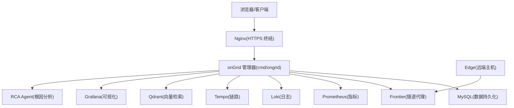
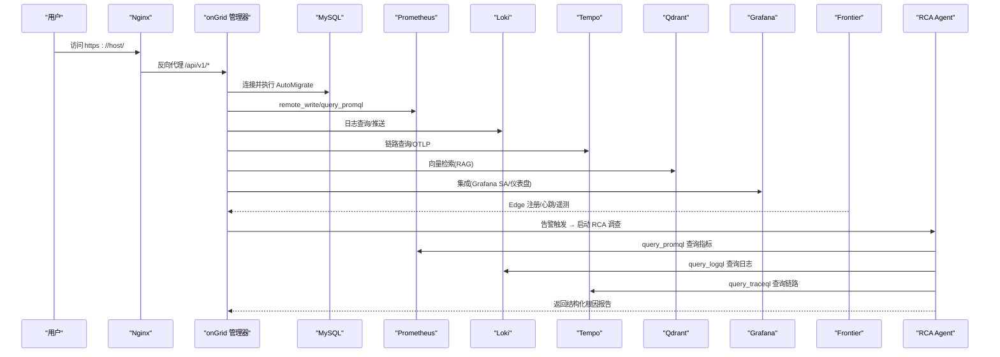
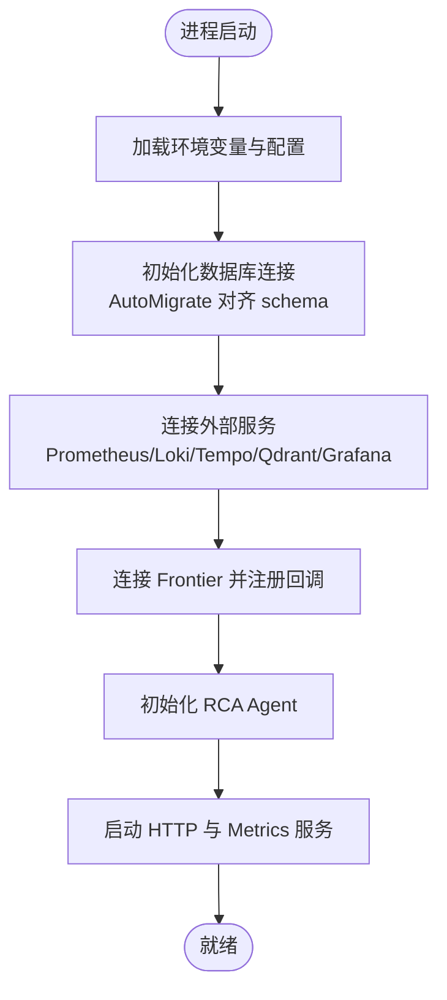
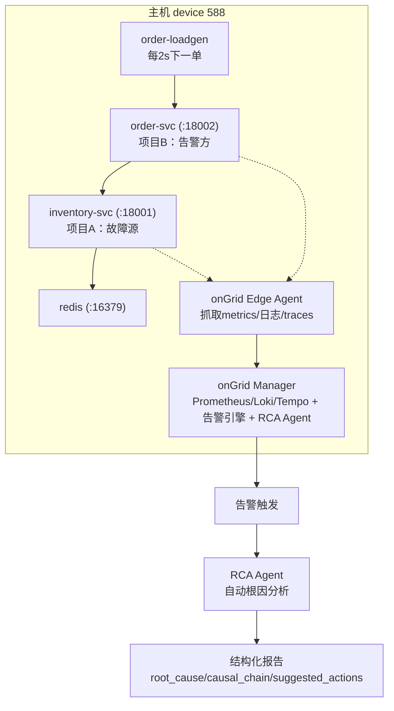

# 快速开始

<cite>
**本文引用的文件**
- [README.md](file://README.md)
- [deploy/README.md](file://deploy/README.md)
- [deploy/docker-compose.yml](file://deploy/docker-compose.yml)
- [deploy/install/.env.example](file://deploy/install/.env.example)
- [deploy/install/README.md](file://deploy/install/README.md)
- [deploy/install/install.sh](file://deploy/install/install.sh)
- [deploy/one-click-deploy.sh](file://deploy/one-click-deploy.sh)
- [deploy/Dockerfile.ongrid](file://deploy/Dockerfile.ongrid)
- [cmd/ongrid/main.go](file://cmd/ongrid/main.go)
- [跨项目根因分析报告.md](file://跨项目根因分析报告.md)
- [demoA/README.md](file://demoA/README.md)
- [demoB/README.md](file://demoB/README.md)
- [demoA/compose.yml](file://demoA/compose.yml)
- [demoB/compose.yml](file://demoB/compose.yml)
- [demoB/deploy.sh](file://demoB/deploy.sh)
</cite>

## 更新摘要
**所做更改**
- 新增“跨项目根因分析（RCA）演示系统”章节，展示 Ongrid 的根因分析能力
- 更新“首次启动后的基本配置”部分，增加 RCA 功能启用说明
- 扩展“常见问题与故障排查”，包含 RCA 相关故障场景
- 增强架构图表，展示 RCA Agent 在整体架构中的作用

## 目录
1. [简介](#简介)
2. [项目结构](#项目结构)
3. [核心组件](#核心组件)
4. [架构总览](#架构总览)
5. [详细组件分析](#详细组件分析)
6. [依赖与兼容性](#依赖与兼容性)
7. [本地开发环境搭建（Docker Compose）](#本地开发环境搭建docker-compose)
8. [生产环境部署（传统安装脚本）](#生产环境部署传统安装脚本)
9. [一键部署（推荐）](#一键部署推荐)
10. [跨项目根因分析（RCA）演示系统](#跨项目根因分析rca演示系统)
11. [首次启动后的基本配置](#首次启动后的基本配置)
12. [常见问题与故障排查](#常见问题与故障排查)
13. [性能与容量建议](#性能与容量建议)
14. [结论](#结论)

## 简介
本指南面向不同技术水平的用户，帮助你在本地或生产环境中快速完成 Ongrid 平台的初始化与基础功能验证。内容涵盖：
- 环境与依赖要求（操作系统、硬件、Docker 版本等）
- 本地开发环境的 Docker Compose 一键拉起
- 生产环境的传统安装脚本与升级流程
- 首次登录与管理员账户创建
- **跨项目根因分析（RCA）演示系统的部署与验证**
- 常见问题的定位与解决

Ongrid 是一个运维 AI Agent 平台，内置指标、日志、链路追踪、拓扑、告警、知识库、工作流与专家智能体能力，支持通过 Edge 将远端主机纳入统一管理。**最新版本新增了强大的跨项目根因分析能力，能够自动从告警症状回溯到真实根因。**

**章节来源**
- [README.md:43-57](file://README.md#L43-L57)
- [deploy/README.md:1-13](file://deploy/README.md#L1-L13)

## 项目结构
仓库采用"云管端"分层组织：
- cmd/ongrid：云端管理器主程序入口
- internal/*：业务域（IAM、Manager、EdgeAgent）、通用库（配置、鉴权、数据库、LLM、通知等）
- deploy/*：部署产物（Compose、Nginx、Prometheus/Loki/Tempo/Grafana/Qdrant 配置、安装脚本）
- web/*：前端工程
- api/*：API 定义（gRPC/Proto）
- db/migrations：数据库迁移脚本
- **demoA/demoB：跨项目根因分析演示系统**



**图表来源**
- [deploy/docker-compose.yml:13-367](file://deploy/docker-compose.yml#L13-L367)
- [cmd/ongrid/main.go:1-13](file://cmd/ongrid/main.go#L1-L13)

**章节来源**
- [deploy/README.md:1-13](file://deploy/README.md#L1-L13)
- [deploy/docker-compose.yml:13-367](file://deploy/docker-compose.yml#L13-L367)

## 核心组件
- ongrid 管理器：提供 HTTP API、Prometheus /metrics、连接上游 Frontier 并管理 Edge 生命周期
- Nginx：TLS 终结、静态资源与反向代理
- MySQL：默认关系型存储
- Prometheus/Loki/Tempo：指标、日志、链路追踪
- Qdrant：向量检索（知识库/RAG）
- Grafana：可视化面板
- Frontier：Edge 隧道代理（端口映射到宿主）
- **RCA Agent：结构化根因分析智能体，自动从告警症状回溯到真实根因**

**章节来源**
- [cmd/ongrid/main.go:1-13](file://cmd/ongrid/main.go#L1-L13)
- [deploy/docker-compose.yml:13-367](file://deploy/docker-compose.yml#L13-L367)

## 架构总览
下图展示了本地开发栈的容器编排与服务间调用关系。管理器在启动时等待 MySQL 健康检查通过后建立连接；Nginx 对外暴露 HTTPS，内部转发至管理器；Edge 通过 Frontier 与 Manager 通信；**RCA Agent 在告警触发时自动执行根因分析**。



**图表来源**
- [deploy/docker-compose.yml:39-185](file://deploy/docker-compose.yml#L39-L185)
- [deploy/docker-compose.yml:214-367](file://deploy/docker-compose.yml#L214-L367)
- [deploy/README.md:22-25](file://deploy/README.md#L22-L25)

**章节来源**
- [deploy/docker-compose.yml:39-185](file://deploy/docker-compose.yml#L39-L185)
- [deploy/docker-compose.yml:214-367](file://deploy/docker-compose.yml#L214-L367)

## 详细组件分析

### 管理器进程与启动流程
管理器二进制由多阶段构建生成，最终运行于非 root 用户下，暴露 HTTP API 与 /metrics。启动时会加载配置、初始化数据库、连接外部服务（Prometheus/Loki/Tempo/Qdrant/Grafana），并通过 Frontier 与 Edge 建立长连接。**同时会初始化 RCA Agent，用于处理告警的自动根因分析**。



**图表来源**
- [cmd/ongrid/main.go:1-13](file://cmd/ongrid/main.go#L1-L13)
- [deploy/Dockerfile.ongrid:143-158](file://deploy/Dockerfile.ongrid#L143-L158)

**章节来源**
- [cmd/ongrid/main.go:1-13](file://cmd/ongrid/main.go#L1-L13)
- [deploy/Dockerfile.ongrid:143-158](file://deploy/Dockerfile.ongrid#L143-L158)

### 本地开发 Compose 栈
- MySQL：默认后端，健康检查通过后管理器才连接
- ongrid：管理器，依赖 MySQL 与 Qdrant
- Nginx：TLS 终结与前端 SPA，反向代理到管理器
- Frontier：Edge 隧道代理（端口映射到宿主）
- Prometheus/Loki/Tempo/Qdrant/Grafana：观测与可视化

注意：该 compose 用于本地开发，不等同于生产形态。

**章节来源**
- [deploy/docker-compose.yml:1-12](file://deploy/docker-compose.yml#L1-L12)
- [deploy/docker-compose.yml:13-367](file://deploy/docker-compose.yml#L13-L367)
- [deploy/README.md:14-27](file://deploy/README.md#L14-L27)

## 依赖与兼容性
- 操作系统：Linux amd64/arm64（Ubuntu 22.04+ / Debian 12+ / CentOS Stream 9 / Rocky 9）
- Docker：>= 24.0；需 Docker Compose v2（docker compose 子命令）
- 内存：至少 2 GB
- 磁盘：至少 10 GB 可用空间
- 权限：以 root 或具备 sudo 权限的用户执行安装脚本
- 网络：可访问 docker.cnb.cool 与 cnb.cool（镜像与 Edge 制品下载）

说明：
- 管理器镜像基于 debian:bookworm-slim，包含 ONNX Runtime 运行时依赖（libstdc++、libgomp 等）
- Edge 为纯 Go 静态二进制，独立安装为 systemd 服务

**章节来源**
- [deploy/install/README.md:5-12](file://deploy/install/README.md#L5-L12)
- [deploy/Dockerfile.ongrid:53-88](file://deploy/Dockerfile.ongrid#L53-L88)
- [deploy/README.md:8-10](file://deploy/README.md#L8-L10)

## 本地开发环境搭建（Docker Compose）
适用于快速体验与调试，不建议直接用于生产。

步骤：
1. 准备 .env（可选）
   - 复制模板并编辑敏感项（如管理员邮箱/密码、OpenAI 密钥等）
   - 参考：[deploy/install/.env.example](file://deploy/install/.env.example)
2. 启动服务
   - 使用 Makefile 目标或 docker compose 命令启动
   - 参考：[deploy/README.md:14-27](file://deploy/README.md#L14-L27)
3. 访问地址
   - Web UI：http://localhost:8080（开发栈未启用 TLS）
   - Prometheus：http://localhost:9090
   - Grafana：http://localhost:3000
   - MySQL：localhost:3306（用户名/密码见 compose 配置）
4. 停止服务
   - 使用 make compose-down 或 docker compose down

注意事项：
- 开发栈无 TLS、无认证代理、无速率限制
- MySQL 默认密码简单，仅用于本地实验
- 如需 SQLite 模式，可在 compose 中切换（参考 README 中的说明）

**章节来源**
- [deploy/README.md:14-27](file://deploy/README.md#L14-L27)
- [deploy/docker-compose.yml:13-367](file://deploy/docker-compose.yml#L13-L367)
- [deploy/install/.env.example:1-217](file://deploy/install/.env.example#L1-L217)

## 生产环境部署（传统安装脚本）
适用于 VPS/裸金属服务器的一键式部署与升级。

前置条件：
- Linux 系统（amd64/arm64）
- Docker >= 24.0 且已安装 Docker Compose v2
- 至少 2 GB 内存、10 GB 磁盘
- 具备 root 或 sudo 权限
- 可访问 CNB 制品库

安装步骤：
1. 上传发布包到目标主机并解压
2. 进入解压目录
3. （可选）编辑 .env.example 自定义端口、OpenAI 等
4. 执行安装脚本
   - 脚本会自动检测 Docker、生成自签证书、创建数据目录、拉取镜像并启动全栈
   - 完成后输出 Web URL、Healthz 与管理员初始密码（只显示一次）
5. 访问 https://<host>/ 并登录

升级步骤：
- 使用新版发布包中的 upgrade.sh 进行滚动升级
- 升级过程会预取并校验新版本 Edge 制品，再拉取镜像并重启服务
- 数据库 schema 由管理器启动时自动迁移

卸载步骤：
- 使用 uninstall.sh 停止服务
- 使用 --purge --yes 彻底清理（破坏性操作）

**章节来源**
- [deploy/install/README.md:17-88](file://deploy/install/README.md#L17-L88)
- [deploy/install/README.md:111-121](file://deploy/install/README.md#L111-L121)
- [deploy/install/install.sh:375-388](file://deploy/install/install.sh#L375-L388)
- [deploy/install/install.sh:641-655](file://deploy/install/install.sh#L641-L655)

## 一键部署（推荐）
一键脚本简化了下载、校验、解压与安装流程，适合阿里云 ECS 或其他 Linux 服务器。

用法：
- 以 root 或 sudo 执行脚本
- 可通过环境变量覆盖版本、下载源、HTTP 端口、管理员邮箱/密码、OpenAI 密钥等
- 脚本会：
  - 检查 Linux 与 Docker 环境
  - 下载发布包并校验 SHA-256
  - 解压并调用官方 install.sh
  - 轮询 healthz 并输出访问地址与管理员初始密码

示例：
- 指定管理员邮箱与 OpenAI 密钥后执行脚本

**章节来源**
- [deploy/one-click-deploy.sh:1-151](file://deploy/one-click-deploy.sh#L1-L151)

## 跨项目根因分析（RCA）演示系统

### 演示系统概述
Ongrid 平台新增了强大的跨项目根因分析能力，通过 demoA（库存服务 inventory-svc）和 demoB（订单服务 order-svc）两个独立项目的协作，模拟真实的电商业务场景，验证平台能够从告警症状自动回溯到真实根因。

### 系统架构


**图表来源**
- [跨项目根因分析报告.md:11-25](file://跨项目根因分析报告.md#L11-L25)

### 项目A：inventory-svc（库存服务，故障源）
**业务定位**：库存的唯一权威记录方（System of Record），为订单系统提供库存查询与扣减能力。

**核心特性**：
- Redis 作为库存存储，支持原子扣减防超卖
- Chaos 工程开关支持慢查询、错误注入等故障模拟
- 完整的观测埋点：指标、日志（带 trace_id）、链路追踪

**关键接口**：
- `GET /healthz`：健康检查（含当前 chaos 模式）
- `POST /api/v1/inventory/deduct`：扣减库存
- `GET/POST /chaos`：故障注入控制

### 项目B：order-svc（订单服务，告警方）
**业务定位**：面向下单流量的订单入口，同步依赖项目A完成库存扣减后才确认订单。

**核心特性**：
- 熔断器机制：连续失败≥5次触发熔断，防止雪崩
- 对账 worker：周期性查询上游库存，提供稳态流量
- 完整的故障传播链：上游故障 → 超时/拒绝 → 熔断 → 告警

**关键接口**：
- `POST /api/v1/orders`：创建订单（同步调用上游）
- `GET /api/v1/orders`：查询订单列表

### 故障传播链与告警设计
```
A 变慢/依赖挂/进程宕
   → B 的 httpx 调用 timeout/refused/5xx
   → B 熔断器跳闸（circuit_open）
   → 下单 502 + 对账 ERROR
   → order_upstream_errors_total 速率越线
   → 告警（症状全在 B 侧）
```

**告警规则**：
```promql
sum by (device_id) (rate(order_upstream_errors_total[1m])) > 0.2
```

### 三幕故障演示
| 幕 | 注入命令 | 故障语义 | 恢复命令 |
|---|---|---|---|
| 1 慢查询 | `curl -X POST '127.0.0.1:18001/chaos?mode=slow'` | A 活着但极慢（5s/请求） | `chaos?mode=ok` |
| 2 依赖挂 | `docker stop inventory-redis` | A 自身依赖（Redis）死亡 | `docker start inventory-redis` |
| 3 进程宕 | `docker stop inventory-svc` | A 整体消失 | `docker start inventory-svc` |

### 部署与验证
1. **部署演示系统**：
   ```bash
   # 确保镜像已加载，然后执行一键部署
   cd demoB && ./deploy.sh
   ```

2. **触发故障**：
   ```bash
   # 注入慢查询故障
   curl -X POST '127.0.0.1:18001/chaos?mode=slow'
   ```

3. **观察告警与RCA**：
   - 等待约30秒，告警引擎评估规则并触发 incident
   - RCA Agent 自动启动，通过工具循环查询指标、日志、链路
   - 约60-90秒后生成结构化根因报告

4. **验证结果**：
   - 检查 incident 页面的 RCA 报告
   - 验证是否准确识别出 inventory-svc 的慢查询问题
   - 确认因果链包含 B→A 的传播路径

**章节来源**
- [跨项目根因分析报告.md:1-212](file://跨项目根因分析报告.md#L1-L212)
- [demoA/README.md:1-25](file://demoA/README.md#L1-L25)
- [demoB/README.md:1-36](file://demoB/README.md#L1-L36)
- [demoA/compose.yml:1-22](file://demoA/compose.yml#L1-L22)
- [demoB/compose.yml:1-26](file://demoB/compose.yml#L1-L26)
- [demoB/deploy.sh:1-21](file://demoB/deploy.sh#L1-L21)

## 首次启动后的基本配置
管理员账户创建：
- 若 .env 中设置了管理员邮箱与密码，管理器会在首次启动时创建管理员账户
- 若留空，install.sh 会生成随机密码并在末尾打印一次（务必记录）
- 若两者均留空，则不会创建管理员，需手动设置环境变量后重启

登录验证：
- 使用 curl 调用登录接口获取 JWT，再用 Token 访问其他 API
- 或通过浏览器访问 Web UI 并使用管理员账号登录

基础设置：
- 替换自签证书为正式证书（可选但推荐）
- 配置外部观测栈（Prometheus/Loki/Tempo/Grafana/qdrant）以减少重复运维
- 配置通知渠道（Slack/飞书/钉钉/Webhook）以便告警与任务通知
- **启用 RCA 功能**：设置 `ONGRID_INVESTIGATOR_ENABLED=true` 以启用自动根因分析

**章节来源**
- [deploy/install/.env.example:49-61](file://deploy/install/.env.example#L49-L61)
- [deploy/install/README.md:314-330](file://deploy/install/README.md#L314-L330)
- [deploy/install/README.md:273-286](file://deploy/install/README.md#L273-L286)
- [deploy/install/README.md:241-263](file://deploy/install/README.md#L241-L263)

## 常见问题与故障排查
- 端口被占用
  - 修改 .env 中的 HTTP/TUNNEL/METRICS 端口后重新拉起
- host-gateway 错误
  - 旧版 Docker 不支持 host-gateway，脚本会自动写入桥网关 IP；也可手动设置
- MySQL 健康检查超时
  - 冷启动较慢，查看 MySQL 日志；确保健康检查通过后再访问
- /healthz 不通
  - 检查 .env 中的 JWT 密钥与数据库 DSN；查看管理器日志
- AI Chat 接口 500
  - OPENAI_API_KEY 未配置；填写 key 或不调用 chat 接口
- Edge 连不上
  - 检查云端隧道端口防火墙；查看 Edge 侧日志确认连通性
- **RCA 报告未生成**
  - 检查 `ONGRID_INVESTIGATOR_ENABLED=true` 配置
  - 确认告警规则已正确配置并触发
  - 查看 RCA Agent 日志，确认工具调用是否正常
- **演示系统无法部署**
  - 确保镜像已通过 `docker load` 加载
  - 检查端口冲突（18001、18002、16379）
  - 验证 journald 日志驱动是否正常工作

**章节来源**
- [deploy/install/README.md:360-374](file://deploy/install/README.md#L360-374)

## 性能与容量建议
- 内存：建议 >= 2 GB（全栈运行更稳健）
- 磁盘：建议 >= 10 GB（含 MySQL/Prometheus/Loki/Tempo 数据）
- 数据目录：
  - 默认位于 /var/lib/ongrid，可按需指向 SSD/NFS/iSCSI
  - 关键卷（MySQL、Prometheus）建议走高性能盘
- 外部观测栈：
  - 已有 Prometheus/Loki/Tempo/Grafana/qdrant 时，强烈建议复用，避免重复运维
  - 最低兼容版本：Prometheus ≥ 2.40、Loki ≥ 2.9、Tempo ≥ 2.3、Grafana ≥ 10.4、qdrant ≥ 1.8

**章节来源**
- [deploy/install/README.md:5-12](file://deploy/install/README.md#L5-L12)
- [deploy/install/README.md:162-182](file://deploy/install/README.md#L162-L182)
- [deploy/install/README.md:241-263](file://deploy/install/README.md#L241-L263)

## 结论
通过本指南，你可以在本地快速拉起开发栈，或在生产环境使用安装脚本完成部署与升级。首次登录后请完成管理员账户与基础设置，并根据团队现有工具链选择是否接入外部观测栈。**特别地，推荐使用新增的跨项目根因分析演示系统来验证平台的 RCA 能力，这能够帮助你理解如何在实际生产环境中利用 Ongrid 的自动化根因分析功能。**遇到问题时，可参考故障排查部分定位与解决。

**更新后的主要改进**：
- 新增了完整的跨项目根因分析演示系统文档
- 增强了 RCA 功能的配置和使用说明
- 提供了详细的故障演示和验证步骤
- 更新了架构图表以反映 RCA Agent 的作用