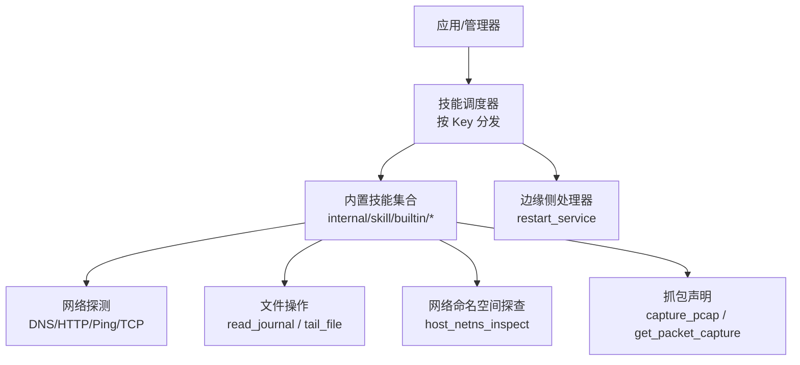
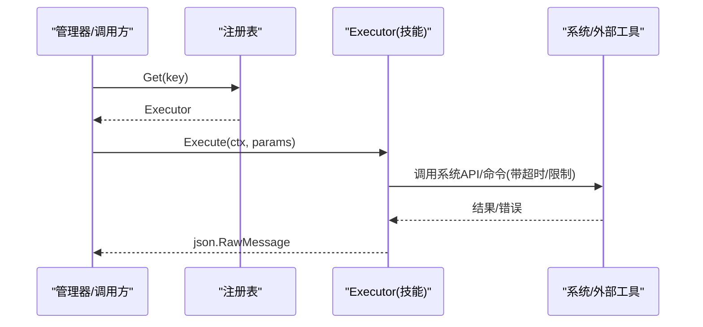
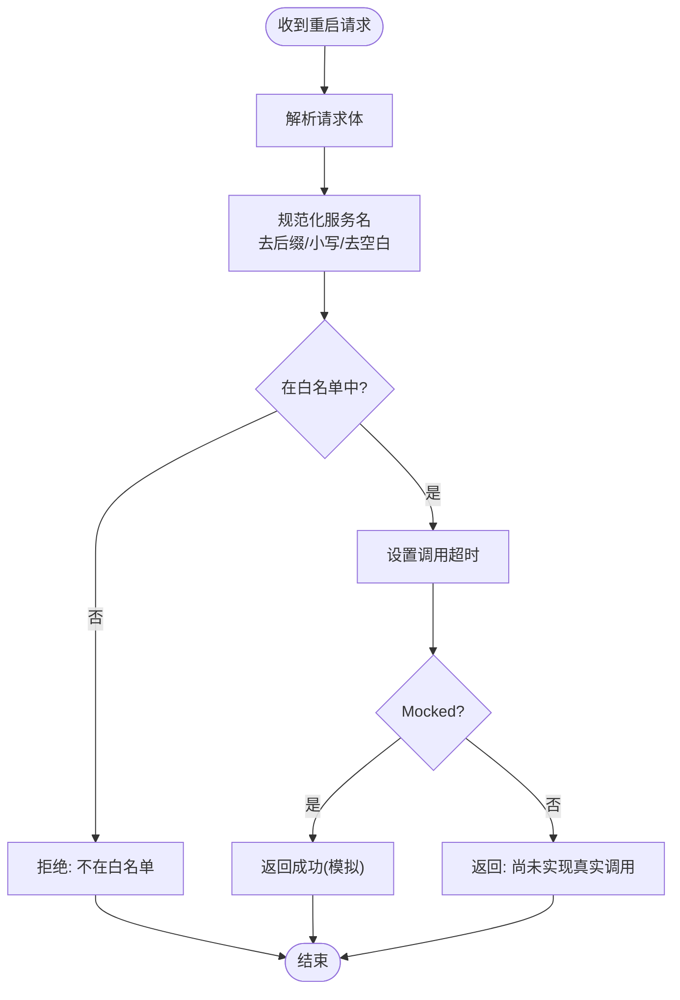
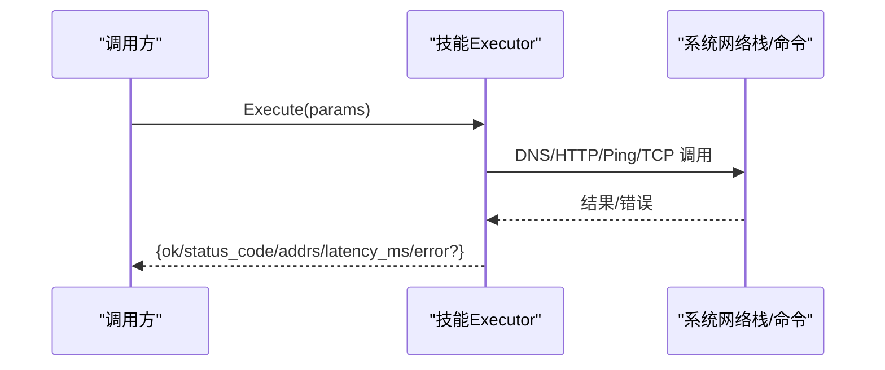
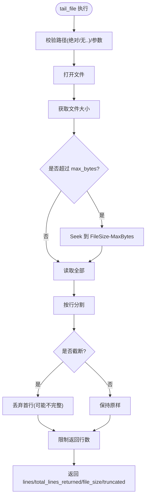
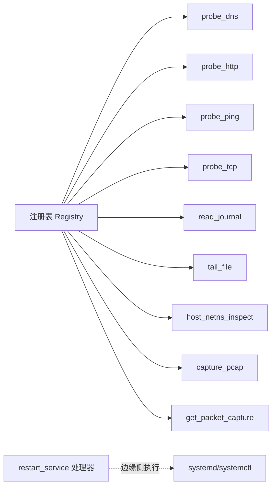

# 内置技能详解

<cite>
**本文引用的文件**
- [internal/skill/types.go](file://internal/skill/types.go)
- [internal/skill/registry.go](file://internal/skill/registry.go)
- [internal/skill/loader.go](file://internal/skill/loader.go)
- [internal/skill/builtin/doc.go](file://internal/skill/builtin/doc.go)
- [internal/skill/builtin/probe_dns.go](file://internal/skill/builtin/probe_dns.go)
- [internal/skill/builtin/probe_http.go](file://internal/skill/builtin/probe_http.go)
- [internal/skill/builtin/probe_ping.go](file://internal/skill/builtin/probe_ping.go)
- [internal/skill/builtin/probe_tcp.go](file://internal/skill/builtin/probe_tcp.go)
- [internal/skill/builtin/read_journal.go](file://internal/skill/builtin/read_journal.go)
- [internal/skill/builtin/tail_file.go](file://internal/skill/builtin/tail_file.go)
- [internal/skill/builtin/host_netns_inspect.go](file://internal/skill/builtin/host_netns_inspect.go)
- [internal/skill/builtin/capture_pcap.go](file://internal/skill/builtin/capture_pcap.go)
- [internal/edgeagent/restart_service/handlers.go](file://internal/edgeagent/restart_service/handlers.go)
</cite>

## 目录
1. [简介](#简介)
2. [项目结构](#项目结构)
3. [核心组件](#核心组件)
4. [架构总览](#架构总览)
5. [详细组件分析](#详细组件分析)
6. [依赖关系分析](#依赖关系分析)
7. [性能考量](#性能考量)
8. [故障排查指南](#故障排查指南)
9. [结论](#结论)
10. [附录：使用示例与最佳实践](#附录使用示例与最佳实践)

## 简介
本技术文档系统性梳理 ongrid 的“内置技能”体系，覆盖重启服务、网络探测（DNS、HTTP、Ping、TCP）、文件操作（读取 journald 日志、读取文件尾部）以及网络抓包等能力。文档从框架注册机制、权限分级、执行范围到具体实现细节进行逐层解析，并提供在 AI Agent 工作流中的调用范式、性能优化建议与排障方法。

## 项目结构
- 技能框架位于 internal/skill，提供统一的元数据、注册表、执行接口与外部子进程加载器。
- 内置技能集中在 internal/skill/builtin，每个技能一个文件，通过 init() 自注册。
- 重启服务为边缘侧处理器，位于 internal/edgeagent/restart_service，作为首个“变更类”技能入口。
- 网络命名空间探查与抓包能力分别由 host_netns_inspect 与 capture_pcap 暴露统一技能元数据，实际执行由边缘侧完成。

图表来源
- [internal/skill/registry.go:10-47](file://internal/skill/registry.go#L10-L47)
- [internal/skill/builtin/doc.go:1-25](file://internal/skill/builtin/doc.go#L1-L25)
- [internal/edgeagent/restart_service/handlers.go:144-161](file://internal/edgeagent/restart_service/handlers.go#L144-L161)

章节来源
- [internal/skill/types.go:1-27](file://internal/skill/types.go#L1-L27)
- [internal/skill/registry.go:10-47](file://internal/skill/registry.go#L10-L47)
- [internal/skill/builtin/doc.go:1-25](file://internal/skill/builtin/doc.go#L1-L25)

## 核心组件
- 技能元数据与执行接口：定义权限等级（safe/mutating/dangerous）、执行范围（host/manager）、参数 Schema、结果预览等，所有内置技能均基于此接口实现。
- 全局注册表：进程级技能目录，init 阶段注册，运行时并发安全地查询与枚举。
- 外部技能加载器：扫描指定目录下的 skill.json，构建并注册子进程型技能，具备路径白名单与环境变量白名单控制。

章节来源
- [internal/skill/types.go:35-125](file://internal/skill/types.go#L35-L125)
- [internal/skill/types.go:177-203](file://internal/skill/types.go#L177-L203)
- [internal/skill/registry.go:10-47](file://internal/skill/registry.go#L10-L47)
- [internal/skill/loader.go:13-67](file://internal/skill/loader.go#L13-L67)

## 架构总览
技能生命周期：
- 启动期：各内置技能通过 init() 调用 Register 将自身加入全局注册表；外部技能通过 Loader 扫描并注册。
- 运行期：管理器或边缘侧根据 Key 查找 Executor，传入已校验的参数 JSON，执行 Execute 返回结果 JSON。
- 权限与范围：Class 决定审批策略（safe 可直接调用，mutating/dangerous 需审批），Scope 决定在边缘还是管理器执行。

图表来源
- [internal/skill/registry.go:35-47](file://internal/skill/registry.go#L35-L47)
- [internal/skill/types.go:190-203](file://internal/skill/types.go#L190-L203)

章节来源
- [internal/skill/registry.go:10-47](file://internal/skill/registry.go#L10-L47)
- [internal/skill/types.go:190-203](file://internal/skill/types.go#L190-L203)

## 详细组件分析

### 重启服务技能（变更类）
- 功能特性：对受信任的系统服务执行重启（当前为 Mocked 模式），包含严格的单位名白名单与二次校验。
- 参数配置：service（服务短名，规范化后匹配白名单）、reason（可选原因）。
- 使用场景：在审批通过后恢复关键服务（如 nginx、redis、prometheus 等）。
- 技术实现要点：
  - 边缘侧 handler 对 service 名称进行规范化与白名单校验，拒绝不在列表的服务。
  - 默认配置仅允许有限服务，且处于 Mocked=true 状态，避免未实现时误触发真实 systemctl。
  - 单次调用设置超时保护，记录审计信息。
- 性能特点：Mocked 模式下开销极低；未来接入真实 systemctl 时需关注系统调用与 dbus 延迟。
- 限制条件：仅支持 systemd 环境；当前不直接调用 systemctl，需后续 PR 完善。
- 错误处理：非法 service、空请求体、超时会返回结构化错误；非白名单服务明确拒绝。

图表来源
- [internal/edgeagent/restart_service/handlers.go:167-219](file://internal/edgeagent/restart_service/handlers.go#L167-L219)
- [internal/edgeagent/restart_service/handlers.go:69-90](file://internal/edgeagent/restart_service/handlers.go#L69-L90)

章节来源
- [internal/edgeagent/restart_service/handlers.go:1-28](file://internal/edgeagent/restart_service/handlers.go#L1-L28)
- [internal/edgeagent/restart_service/handlers.go:43-90](file://internal/edgeagent/restart_service/handlers.go#L43-L90)
- [internal/edgeagent/restart_service/handlers.go:144-219](file://internal/edgeagent/restart_service/handlers.go#L144-L219)

### 网络探测技能（DNS、HTTP、Ping、TCP）
- DNS 解析（host_probe_dns）
  - 功能：通过系统解析器获取 A/AAAA 记录，返回地址列表、耗时与错误。
  - 参数：host（必填）、timeout_ms（默认 3000ms）。
  - 实现：使用 net.DefaultResolver.LookupIPAddr，上下文超时保护。
  - 性能：低开销，适合快速连通性检查。
  - 限制：依赖系统解析器与网络栈。
  - 错误：解析失败时 error 字段携带错误信息。
- HTTP 探测（host_probe_http）
  - 功能：发起 HEAD/GET 请求，返回状态码、耗时、内容长度。
  - 参数：url（必填）、method（GET/HEAD，默认 HEAD）、timeout_ms（默认 5000ms）。
  - 实现：http.Client 自定义 Transport 跳过 TLS 验证以适配内部自签证书；GET 会丢弃响应体并统计字节数。
  - 性能：单次请求，注意大响应体的内存占用（GET 会丢弃但仍有带宽消耗）。
  - 限制：仅只读方法；TLS 验证关闭用于内网探测。
  - 错误：连接/协议错误写入 error 字段。
- Ping 探测（host_probe_ping）
  - 功能：调用系统 ping 二进制发送固定数量的 ICMP 包，返回 ok、退出码、耗时、stdout/stderr。
  - 参数：host（必填）、count（默认 4，上限 10）、timeout_ms（默认 3000ms，上限 10000ms）。
  - 实现：exec.CommandContext 调用 ping，严格限制 count 与超时，避免长时间阻塞。
  - 性能：轻量，但依赖主机安装 ping。
  - 限制：需要 root 或 ICMP 权限；跨平台行为取决于系统。
  - 错误：退出码与错误信息区分网络不可达与超时。
- TCP 连通性探测（host_probe_tcp）
  - 功能：拨号目标 host:port，返回 ok 与耗时。
  - 参数：target（必填）、timeout_ms（默认 3000ms）。
  - 实现：net.Dialer.DialContext 建立连接后立即关闭，无数据传输。
  - 性能：极快，适合端口可达性检查。
  - 限制：仅测试传输层连通性。
  - 错误：连接失败时 error 字段携带错误。

图表来源
- [internal/skill/builtin/probe_dns.go:52-84](file://internal/skill/builtin/probe_dns.go#L52-L84)
- [internal/skill/builtin/probe_http.go:62-119](file://internal/skill/builtin/probe_http.go#L62-L119)
- [internal/skill/builtin/probe_ping.go:60-99](file://internal/skill/builtin/probe_ping.go#L60-L99)
- [internal/skill/builtin/probe_tcp.go:52-82](file://internal/skill/builtin/probe_tcp.go#L52-L82)

章节来源
- [internal/skill/builtin/probe_dns.go:13-84](file://internal/skill/builtin/probe_dns.go#L13-L84)
- [internal/skill/builtin/probe_http.go:15-119](file://internal/skill/builtin/probe_http.go#L15-L119)
- [internal/skill/builtin/probe_ping.go:14-124](file://internal/skill/builtin/probe_ping.go#L14-L124)
- [internal/skill/builtin/probe_tcp.go:13-82](file://internal/skill/builtin/probe_tcp.go#L13-L82)

### 文件操作技能（读取 journald 日志、读取文件尾部）
- Journald 日志读取（host_read_journal）
  - 功能：包装 journalctl 读取最近日志行，仅 Linux 支持。
  - 参数：unit（可选）、since（默认 10m）、lines（默认 200）。
  - 实现：exec.CommandContext 调用 journalctl，强制 30s 超时，输出按行拆分。
  - 性能：受限于 lines 与 since，避免过大输出。
  - 限制：非 Linux 返回结构化错误。
  - 错误：命令执行失败时 error 字段携带错误。
- 文件尾部读取（host_tail_file）
  - 功能：类似 tail -n，返回最后 N 行，支持最大读取字节预算。
  - 参数：path（绝对路径，禁止 ..）、lines（默认 100）、max_bytes（默认 1MiB）。
  - 实现：打开文件后若超过预算则 seek 至 FileSize-MaxBytes，读取并切分行；截断时丢弃首行半行。
  - 性能：O(N) 读取尾部，预算控制内存与带宽。
  - 限制：仅读；路径必须绝对且不含 ..。
  - 错误：路径非法、IO 错误写入 error 字段。

图表来源
- [internal/skill/builtin/tail_file.go:64-132](file://internal/skill/builtin/tail_file.go#L64-L132)

章节来源
- [internal/skill/builtin/read_journal.go:16-111](file://internal/skill/builtin/read_journal.go#L16-L111)
- [internal/skill/builtin/tail_file.go:15-132](file://internal/skill/builtin/tail_file.go#L15-L132)

### 网络命名空间探查（host_netns_inspect）
- 功能：列出 /var/run/netns 下的 network namespace，并对每个 ns 报告 IP 地址、路由与可选 link 信息。
- 参数：namespace（可选精确匹配）、include_routes（默认 true）、include_links（默认 false）。
- 实现：调用 ip -j -n <ns> addr/route/link show，解析 JSON 输出；对 namespace 名称进行正则白名单校验。
- 性能：多 ns 时 include_links 数据量大，按需开启。
- 限制：仅 Linux；依赖 iproute2 工具。
- 错误：单个 ns 的错误不影响其他 ns 的结果；整体错误字段提示工具缺失或权限问题。

章节来源
- [internal/skill/builtin/host_netns_inspect.go:48-205](file://internal/skill/builtin/host_netns_inspect.go#L48-L205)
- [internal/skill/builtin/host_netns_inspect.go:207-327](file://internal/skill/builtin/host_netns_inspect.go#L207-L327)

### 网络抓包技能（capture_pcap / get_packet_capture）
- 功能：在 Linux Edge 上启动有界抓包任务，返回任务 id；查询任务状态、结果与错误。
- 参数（capture_pcap）：interface（必填）、filter（可选）、duration_seconds（默认 30，上限 300）、max_bytes（默认 64MiB，上限 256MiB）、max_packets（默认 100k，上限 500k）、snaplen（默认 1514，上限 65535）、promiscuous（默认 false，需 CAP_NET_ADMIN）。
- 参数（get_packet_capture）：capture_id（必填）。
- 实现：管理器侧仅声明技能元数据与 LLM 工具描述；实际执行由边缘侧完成（Execute 返回“必须在边缘执行”的错误，由调度器转发）。
- 性能：受 duration/max_bytes/max_packets/snaplen 限制，避免资源耗尽。
- 限制：需要边缘侧具备相应权限与抓包服务；promiscuous 模式需额外权限。
- 错误：任务状态与错误详情可通过 get_packet_capture 查询。

章节来源
- [internal/skill/builtin/capture_pcap.go:11-72](file://internal/skill/builtin/capture_pcap.go#L11-L72)

## 依赖关系分析
- 技能注册与发现：
  - 内置技能通过 init() 调用 Register 自注册。
  - 外部技能通过 Loader 扫描 skill.json 并注册为 SubprocessSkill。
- 权限与范围：
  - Class 决定调用策略（safe 可直调，mutating/dangerous 需审批）。
  - Scope 决定执行位置（host 边缘设备，manager 管理器进程）。
- 子系统耦合：
  - 网络探测依赖系统解析器、HTTP 客户端、ping 二进制、TCP 栈。
  - 文件操作依赖文件系统与 journalctl。
  - 抓包依赖边缘侧抓包服务与内核抓包能力。

图表来源
- [internal/skill/registry.go:10-47](file://internal/skill/registry.go#L10-L47)
- [internal/skill/builtin/doc.go:19-25](file://internal/skill/builtin/doc.go#L19-L25)
- [internal/edgeagent/restart_service/handlers.go:144-161](file://internal/edgeagent/restart_service/handlers.go#L144-L161)

章节来源
- [internal/skill/registry.go:10-47](file://internal/skill/registry.go#L10-L47)
- [internal/skill/loader.go:69-160](file://internal/skill/loader.go#L69-L160)

## 性能考量
- 超时与预算：
  - DNS/HTTP/TCP 探测均使用上下文超时，防止阻塞调度器。
  - Ping 限制 count 与单包超时，计算外层总超时。
  - tail_file 通过 max_bytes 控制读取预算，避免大文件导致内存峰值。
  - read_journal 固定 30s 超时，限制 lines 与 since。
  - 抓包通过 duration_seconds、max_bytes、max_packets、snaplen 多重限制。
- I/O 与 CPU：
  - HTTP GET 会丢弃响应体但仍消耗带宽，建议在健康检查中使用 HEAD。
  - 多命名空间探查时谨慎开启 include_links，减少不必要的数据量。
- 并发与资源：
  - 技能执行应尽量避免长事务；批量探测建议分片与限流。
  - 外部命令调用（ping/journalctl/ip）需考虑系统负载与权限。

[本节为通用指导，无需特定文件引用]

## 故障排查指南
- 常见错误定位：
  - 参数校验失败：检查必填字段、类型与取值范围（例如 host、url、target、path）。
  - 权限不足：journalctl、ip 命令、promiscuous 抓包需要相应权限。
  - 平台限制：read_journal 与 host_netns_inspect 仅 Linux；非 Linux 返回结构化错误。
  - 网络问题：DNS/HTTP/TCP/Ping 错误信息在 result.error 或 stdout/stderr 中。
- 调试步骤：
  - 查看技能返回的 error 字段与耗时指标。
  - 在边缘侧手动执行对应命令（如 journalctl、ip、ping）确认环境与权限。
  - 对于抓包，先使用 get_packet_capture 查询任务状态与错误详情。
- 重启服务：
  - 确认服务名在白名单中；当前为 Mocked 模式，不会真正调用 systemctl。
  - 如需真实调用，需在后续版本启用并配置 SandboxConfig.Mocked=false。

章节来源
- [internal/skill/builtin/read_journal.go:81-111](file://internal/skill/builtin/read_journal.go#L81-L111)
- [internal/skill/builtin/host_netns_inspect.go:143-174](file://internal/skill/builtin/host_netns_inspect.go#L143-L174)
- [internal/skill/builtin/probe_ping.go:101-124](file://internal/skill/builtin/probe_ping.go#L101-L124)
- [internal/skill/builtin/capture_pcap.go:47-72](file://internal/skill/builtin/capture_pcap.go#L47-L72)
- [internal/edgeagent/restart_service/handlers.go:167-219](file://internal/edgeagent/restart_service/handlers.go#L167-L219)

## 结论
ongrid 的内置技能体系以统一的元数据与注册表为核心，结合权限分级与执行范围控制，为 AI Agent 提供了安全、可控的设备侧能力。网络探测与文件操作技能强调只读与预算控制，重启服务与抓包技能通过白名单与参数限制降低风险。建议在 AI 工作流中优先使用 safe 技能进行诊断，变更类技能严格走审批流程，并结合超时与预算参数保障稳定性。

[本节为总结，无需特定文件引用]

## 附录：使用示例与最佳实践
- 工作流编排建议：
  - 诊断阶段：依次调用 DNS、HTTP、TCP、Ping 探测，结合 host_netns_inspect 与 read_journal 收集上下文。
  - 决策阶段：若确需重启服务，走审批流程后再调用 restart_service。
  - 取证阶段：使用 capture_pcap 抓取流量，随后用 get_packet_capture 下载与分析。
- 参数最佳实践：
  - 探测超时：根据网络质量设置合理 timeout_ms，避免过长等待。
  - 日志读取：限制 lines 与 since，避免大量输出影响性能。
  - 文件读取：设置 max_bytes 与 lines，确保结果可控。
  - 抓包：设置合理的 duration_seconds、max_bytes、max_packets 与 snaplen，必要时开启 promiscuous 并评估权限。
- 性能优化：
  - 批量探测时分片与限流，避免同时发起过多并发。
  - 对大响应体使用 HEAD 而非 GET。
  - 多命名空间探查时关闭 include_links 除非必要。
- 安全与合规：
  - 变更类技能必须经过审批；危险类技能需 SOP 与双重审批。
  - 严格校验输入（路径、服务名、命名空间名），遵循最小权限原则。

[本节为通用指导，无需特定文件引用]