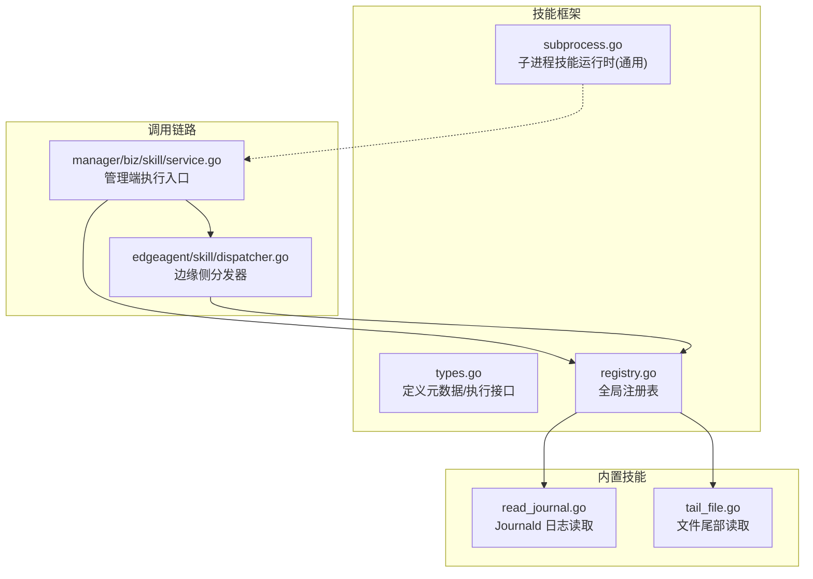
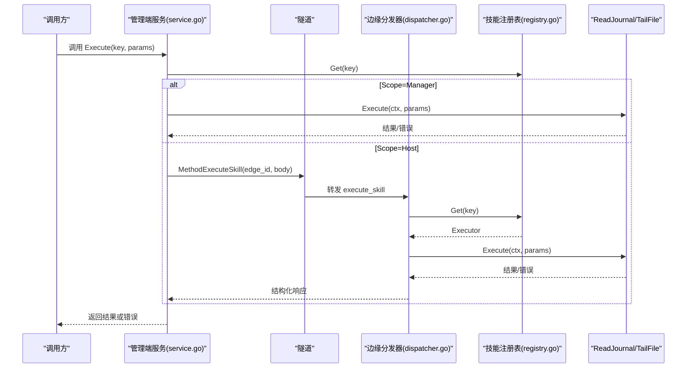
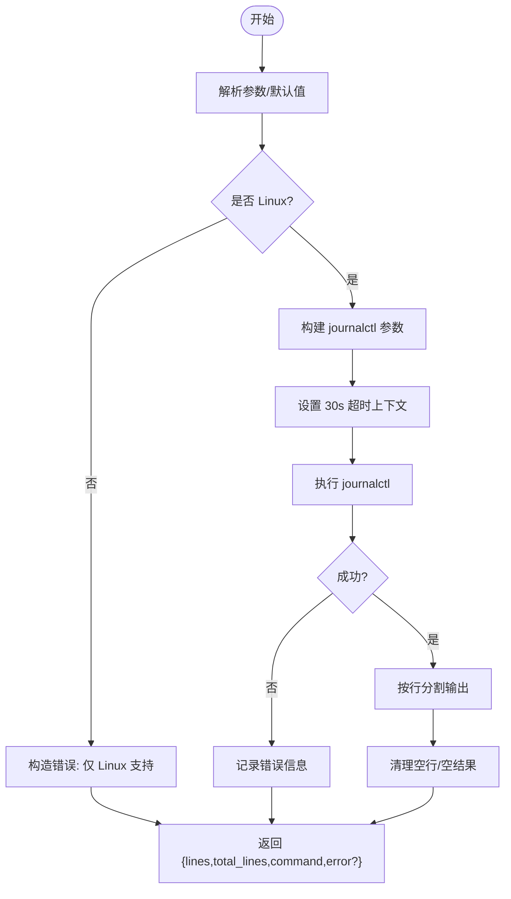
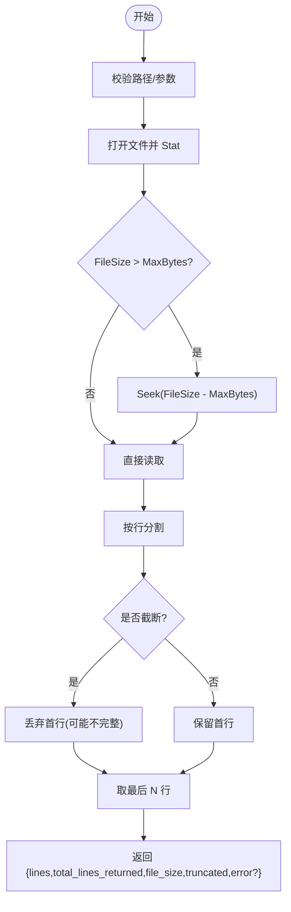
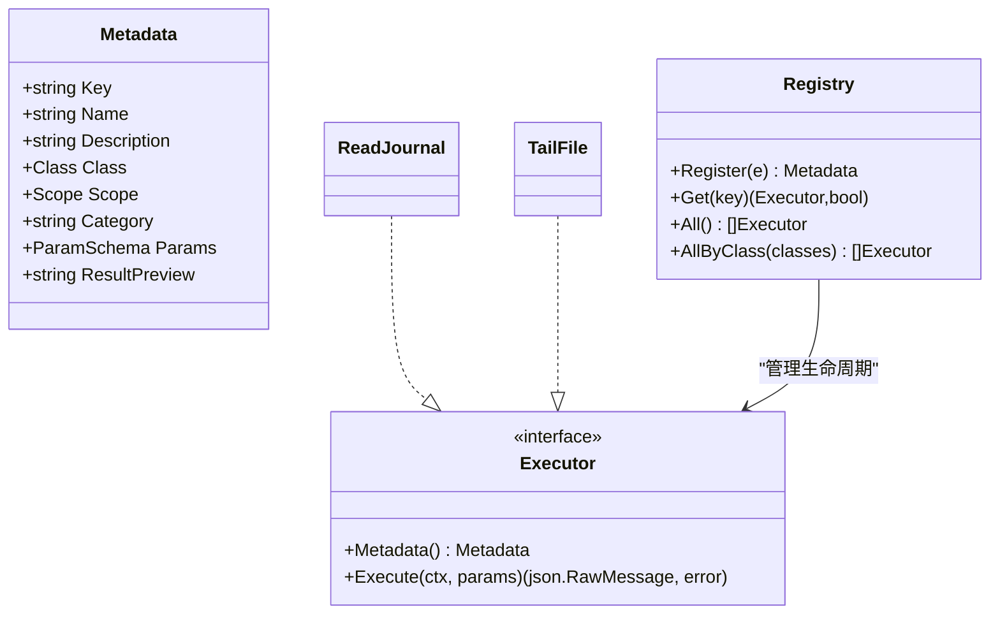
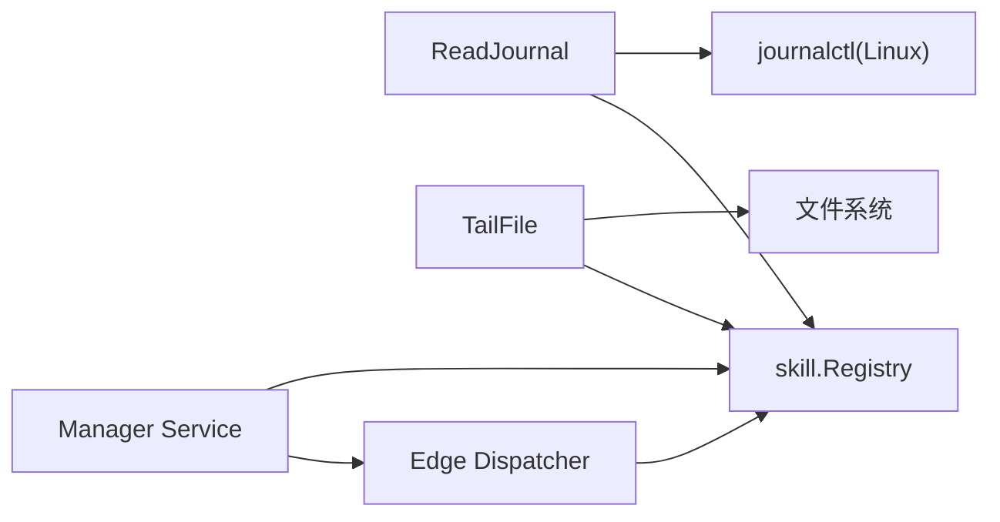

# 文件操作技能

<cite>
**本文引用的文件**
- [internal/skill/builtin/read_journal.go](file://internal/skill/builtin/read_journal.go)
- [internal/skill/builtin/tail_file.go](file://internal/skill/builtin/tail_file.go)
- [internal/skill/types.go](file://internal/skill/types.go)
- [internal/skill/registry.go](file://internal/skill/registry.go)
- [internal/skill/subprocess.go](file://internal/skill/subprocess.go)
- [internal/edgeagent/skill/dispatcher.go](file://internal/edgeagent/skill/dispatcher.go)
- [internal/manager/biz/skill/service.go](file://internal/manager/biz/skill/service.go)
- [internal/skill/builtin/read_journal_test.go](file://internal/skill/builtin/read_journal_test.go)
- [internal/skill/builtin/tail_file_test.go](file://internal/skill/builtin/tail_file_test.go)
</cite>

## 目录
1. [简介](#简介)
2. [项目结构](#项目结构)
3. [核心组件](#核心组件)
4. [架构总览](#架构总览)
5. [详细组件分析](#详细组件分析)
6. [依赖关系分析](#依赖关系分析)
7. [性能考量](#性能考量)
8. [故障排查指南](#故障排查指南)
9. [结论](#结论)
10. [附录](#附录)

## 简介
本技术文档聚焦于系统内的两类文件操作技能：
- 系统日志读取技能（read_journal）：封装 journalctl，用于在 Linux 上安全地读取 systemd-journald 的近期日志。
- 文件跟踪技能（tail_file）：类似 tail -n，读取指定文件的最后 N 行，支持大文件预算控制与截断标记。

文档将深入解释两者的功能特性、技术实现、参数与结果结构、错误处理、以及在大文件场景下的内存与性能优化策略。同时提供在故障排查中的使用示例与最佳实践。

## 项目结构
与文件操作技能相关的代码主要位于 internal/skill 包及其子包：
- 内置技能实现：internal/skill/builtin
- 技能框架类型与注册表：internal/skill
- 边缘侧调度器：internal/edgeagent/skill
- 管理端服务编排：internal/manager/biz/skill

图表来源
- [internal/skill/types.go:99-125](file://internal/skill/types.go#L99-L125)
- [internal/skill/registry.go:10-47](file://internal/skill/registry.go#L10-L47)
- [internal/skill/builtin/read_journal.go:16-47](file://internal/skill/builtin/read_journal.go#L16-L47)
- [internal/skill/builtin/tail_file.go:15-46](file://internal/skill/builtin/tail_file.go#L15-L46)
- [internal/manager/biz/skill/service.go:187-261](file://internal/manager/biz/skill/service.go#L187-L261)
- [internal/edgeagent/skill/dispatcher.go:16-44](file://internal/edgeagent/skill/dispatcher.go#L16-L44)

章节来源
- [internal/skill/types.go:1-241](file://internal/skill/types.go#L1-L241)
- [internal/skill/registry.go:1-127](file://internal/skill/registry.go#L1-L127)
- [internal/skill/builtin/read_journal.go:1-112](file://internal/skill/builtin/read_journal.go#L1-L112)
- [internal/skill/builtin/tail_file.go:1-133](file://internal/skill/builtin/tail_file.go#L1-L133)
- [internal/manager/biz/skill/service.go:187-261](file://internal/manager/biz/skill/service.go#L187-L261)
- [internal/edgeagent/skill/dispatcher.go:16-44](file://internal/edgeagent/skill/dispatcher.go#L16-L44)

## 核心组件
- ReadJournal（read_journal）：以只读方式调用 journalctl，限制超时与输出行数，返回结构化结果。仅 Linux 平台可用。
- TailFile（tail_file）：打开目标文件，按最大字节预算从末尾读取并返回最后 N 行；对大文件进行 seek 截断，避免全量加载。
- 技能框架（types.go, registry.go）：定义技能元数据、权限分类（safe/mutating/dangerous）、作用域（host/manager）、注册与分发机制。
- 管理端与服务编排（service.go）：根据技能作用域决定本地执行或经隧道转发到边缘侧执行，并统一封装错误与审计。
- 边缘侧分发器（dispatcher.go）：接收 execute_skill RPC，按 key 查找 Executor 并执行，将错误包装为结构化响应。

章节来源
- [internal/skill/builtin/read_journal.go:16-112](file://internal/skill/builtin/read_journal.go#L16-L112)
- [internal/skill/builtin/tail_file.go:15-133](file://internal/skill/builtin/tail_file.go#L15-L133)
- [internal/skill/types.go:35-125](file://internal/skill/types.go#L35-L125)
- [internal/skill/registry.go:10-47](file://internal/skill/registry.go#L10-L47)
- [internal/manager/biz/skill/service.go:187-261](file://internal/manager/biz/skill/service.go#L187-L261)
- [internal/edgeagent/skill/dispatcher.go:16-44](file://internal/edgeagent/skill/dispatcher.go#L16-L44)

## 架构总览
技能调用路径分为两条：
- 管理端直接执行（ScopeManager）：如 web_search、子进程技能等，直接在管理器进程内执行。
- 边缘端执行（ScopeHost）：通过隧道将请求转发到边缘 agent，由边缘侧分发器查找并执行具体技能。

对于 read_journal 与 tail_file，两者均属于 host 作用域，实际在边缘 agent 上执行。

图表来源
- [internal/manager/biz/skill/service.go:187-261](file://internal/manager/biz/skill/service.go#L187-L261)
- [internal/edgeagent/skill/dispatcher.go:16-44](file://internal/edgeagent/skill/dispatcher.go#L16-L44)
- [internal/skill/registry.go:35-47](file://internal/skill/registry.go#L35-L47)

## 详细组件分析

### 系统日志读取技能（read_journal）
- 功能概述
  - 封装 journalctl，读取 systemd-journald 的近期日志。
  - 支持 unit 过滤、since 时间回溯、lines 行数限制。
  - 非 Linux 平台返回结构化错误，不执行外部命令。
  - 强制只读，无破坏性参数。
- 参数与结果
  - 参数：unit（可选字符串）、since（可选时长，默认 10m）、lines（整数，默认 200）。
  - 结果：lines（日志行数组）、total_lines（行数）、command（执行的命令）、error（错误信息）。
- 执行流程
  - 校验与默认值填充。
  - 构建 journalctl 参数：--no-pager、--output=short-iso、-n lines、--unit、--since。
  - 设置上下文超时（30s），防止长时间挂起。
  - 执行命令并解析输出为行数组。
- 错误处理
  - 非 Linux：返回 error 字段，不抛异常。
  - 命令失败：错误信息写入 error 字段。
  - 参数解码失败：返回 Go 错误。
- 性能与安全
  - 通过 --no-pager 与 -n 限制输出大小。
  - 30s 超时保护。
  - 只读访问，无写操作。

图表来源
- [internal/skill/builtin/read_journal.go:62-112](file://internal/skill/builtin/read_journal.go#L62-L112)

章节来源
- [internal/skill/builtin/read_journal.go:16-112](file://internal/skill/builtin/read_journal.go#L16-L112)
- [internal/skill/builtin/read_journal_test.go:12-78](file://internal/skill/builtin/read_journal_test.go#L12-L78)

### 文件跟踪技能（tail_file）
- 功能概述
  - 读取文件最后 N 行，类似 tail -n。
  - 强制绝对路径且禁止 .. 穿越，保障安全。
  - 支持 max_bytes 预算，超过时从 FileSize - MaxBytes 处 seek 读取，标记 truncated=true。
- 参数与结果
  - 参数：path（必填绝对路径）、lines（整数，默认 100）、max_bytes（整数，默认 1MiB）。
  - 结果：lines（行数组）、total_lines_returned（返回行数）、file_size（文件大小）、truncated（是否截断）、error（错误信息）。
- 执行流程
  - 参数校验：路径存在性、绝对路径、禁止 ..、lines/max_bytes 默认值。
  - 打开文件并 Stat 获取大小。
  - 若文件大小 > max_bytes，则 Seek 至尾部预算起点，读取剩余内容。
  - 按行分割，丢弃首行可能不完整的数据（seek 导致），再截取最后 N 行。
  - 返回结果。
- 错误处理
  - 缺少 path、相对路径、包含 ..：返回 Go 错误。
  - 文件不存在或无法打开：错误信息写入 error 字段。
- 性能与内存
  - 通过 max_bytes 控制内存占用，避免全量加载大文件。
  - 使用 Seek + ReadAll 减少不必要 I/O。
  - 注意：当前实现仍会将选定区间内容读入内存，适合 MB 级日志；GB 级建议分块处理或改用流式方案。

图表来源
- [internal/skill/builtin/tail_file.go:62-133](file://internal/skill/builtin/tail_file.go#L62-L133)

章节来源
- [internal/skill/builtin/tail_file.go:15-133](file://internal/skill/builtin/tail_file.go#L15-L133)
- [internal/skill/builtin/tail_file_test.go:25-130](file://internal/skill/builtin/tail_file_test.go#L25-L130)

### 技能框架与调度
- 元数据与权限
  - Metadata 描述技能的 Key、Name、Description、Class、Scope、Category、Params、ResultPreview。
  - ClassSafe 表示只读、无副作用；Mutating/Dangerous 需要审批或签名。
- 注册与发现
  - 所有内置技能在 init() 中注册到全局注册表。
  - 管理端通过 All()/AllByClass() 枚举技能，构建 LLM 工具与 UI。
- 执行路由
  - 管理端 service.Execute 根据 Scope 选择本地执行或隧道转发到边缘。
  - 边缘 dispatcher.Dispatch 按 key 查找 Executor 并执行，错误包装为结构化响应。

图表来源
- [internal/skill/types.go:99-125](file://internal/skill/types.go#L99-L125)
- [internal/skill/types.go:190-203](file://internal/skill/types.go#L190-L203)
- [internal/skill/registry.go:21-47](file://internal/skill/registry.go#L21-L47)
- [internal/skill/builtin/read_journal.go:16-47](file://internal/skill/builtin/read_journal.go#L16-L47)
- [internal/skill/builtin/tail_file.go:15-46](file://internal/skill/builtin/tail_file.go#L15-L46)

章节来源
- [internal/skill/types.go:1-241](file://internal/skill/types.go#L1-L241)
- [internal/skill/registry.go:1-127](file://internal/skill/registry.go#L1-L127)
- [internal/manager/biz/skill/service.go:187-261](file://internal/manager/biz/skill/service.go#L187-L261)
- [internal/edgeagent/skill/dispatcher.go:16-44](file://internal/edgeagent/skill/dispatcher.go#L16-L44)

## 依赖关系分析
- read_journal 依赖操作系统提供的 journalctl 命令，仅在 Linux 有效；非 Linux 返回结构化错误。
- tail_file 依赖标准库文件 I/O，通过 Seek 与 ReadAll 实现高效尾部读取。
- 两者均通过 skill 框架注册与调度，受权限与作用域约束。
- 管理端与边缘端通过隧道通信，确保跨进程/跨主机执行一致性。

图表来源
- [internal/skill/builtin/read_journal.go:81-112](file://internal/skill/builtin/read_journal.go#L81-L112)
- [internal/skill/builtin/tail_file.go:89-133](file://internal/skill/builtin/tail_file.go#L89-L133)
- [internal/skill/registry.go:35-47](file://internal/skill/registry.go#L35-L47)
- [internal/manager/biz/skill/service.go:187-261](file://internal/manager/biz/skill/service.go#L187-L261)
- [internal/edgeagent/skill/dispatcher.go:16-44](file://internal/edgeagent/skill/dispatcher.go#L16-L44)

章节来源
- [internal/skill/builtin/read_journal.go:1-112](file://internal/skill/builtin/read_journal.go#L1-L112)
- [internal/skill/builtin/tail_file.go:1-133](file://internal/skill/builtin/tail_file.go#L1-L133)
- [internal/skill/registry.go:1-127](file://internal/skill/registry.go#L1-L127)
- [internal/manager/biz/skill/service.go:187-261](file://internal/manager/biz/skill/service.go#L187-L261)
- [internal/edgeagent/skill/dispatcher.go:16-44](file://internal/edgeagent/skill/dispatcher.go#L16-L44)

## 性能考量
- read_journal
  - 使用 --no-pager 与 -n 限制输出体积，避免大量数据回传。
  - 30s 超时防止阻塞。
  - 建议在故障排查时结合 unit 与 since 缩小范围，减少无关日志。
- tail_file
  - 通过 max_bytes 控制内存峰值，避免大文件全量加载。
  - Seek 定位起始位置，减少不必要的 I/O。
  - 当 truncated=true 时，首行可能不完整，已自动丢弃，保证每行完整性。
  - 对于 GB 级日志，建议：
    - 调小 max_bytes 并结合多次轮询（分页式读取）。
    - 在后端引入流式读取与游标机制，避免一次性驻留内存。
    - 结合日志轮转策略，避免读取历史归档文件。
- 通用优化
  - 合理设置 lines 与 max_bytes，平衡可读性与资源消耗。
  - 在高频调用场景下，考虑缓存最近结果或使用增量读取（需扩展能力）。
  - 监控与度量：统计执行耗时、返回行数、截断率，辅助容量规划。

[本节为通用指导，不直接分析具体文件]

## 故障排查指南
- read_journal 常见问题
  - 非 Linux 平台：返回 error 字段提示不支持。
  - journalctl 未安装或权限不足：错误信息会出现在 error 字段，检查系统环境与权限。
  - 超时：30s 超时被触发，检查系统负载与日志量。
- tail_file 常见问题
  - 路径错误：必须为绝对路径且不含 ..，否则返回 Go 错误。
  - 文件不存在：错误信息写入 error 字段。
  - 截断：truncated=true 表示按预算读取，必要时增大 max_bytes 或分段读取。
- 调试建议
  - 查看 command 字段（read_journal）确认实际执行参数。
  - 关注 total_lines_returned 与 file_size，评估数据规模。
  - 结合测试用例验证边界行为（参考测试文件）。

章节来源
- [internal/skill/builtin/read_journal.go:81-112](file://internal/skill/builtin/read_journal.go#L81-L112)
- [internal/skill/builtin/tail_file.go:71-133](file://internal/skill/builtin/tail_file.go#L71-L133)
- [internal/skill/builtin/read_journal_test.go:25-78](file://internal/skill/builtin/read_journal_test.go#L25-L78)
- [internal/skill/builtin/tail_file_test.go:98-130](file://internal/skill/builtin/tail_file_test.go#L98-L130)

## 结论
read_journal 与 tail_file 作为安全的只读文件操作技能，提供了高效的日志读取与文件尾部追踪能力。通过严格的参数校验、超时保护、预算控制与结构化错误返回，既保障了安全性，又兼顾了性能与可观测性。在大规模日志场景中，建议结合预算控制与分页策略，持续优化内存与 I/O 开销。

[本节为总结，不直接分析具体文件]

## 附录
- 使用示例（基于测试与实现推断）
  - 读取 ongrid-edge 单元最近 5 分钟、最多 50 行的 journald 日志：
    - 参数：unit="ongrid-edge", since="5m", lines=50
    - 预期：返回 lines 数组与 total_lines，若无错误则 command 字段包含实际执行的 journalctl 命令。
  - 读取 /var/log/app.log 最后 100 行，预算 1MiB：
    - 参数：path="/var/log/app.log", lines=100, max_bytes=1048576
    - 预期：返回 lines 数组、file_size、truncated=false（若文件小于预算）。
  - 读取大文件 /var/log/big.log 最后 5 行，预算 200 字节：
    - 参数：path="/var/log/big.log", lines=5, max_bytes=200
    - 预期：truncated=true，返回最后 5 行，首行不完整已被丢弃。

章节来源
- [internal/skill/builtin/read_journal_test.go:25-69](file://internal/skill/builtin/read_journal_test.go#L25-L69)
- [internal/skill/builtin/tail_file_test.go:25-96](file://internal/skill/builtin/tail_file_test.go#L25-L96)