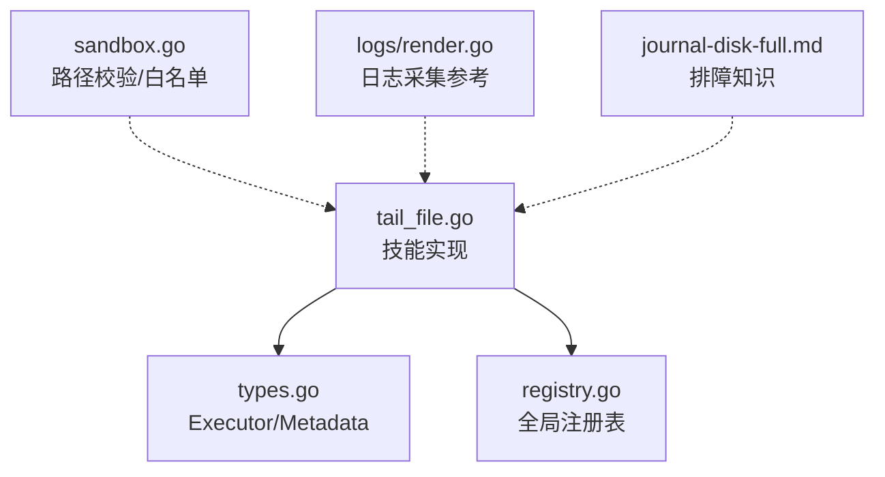
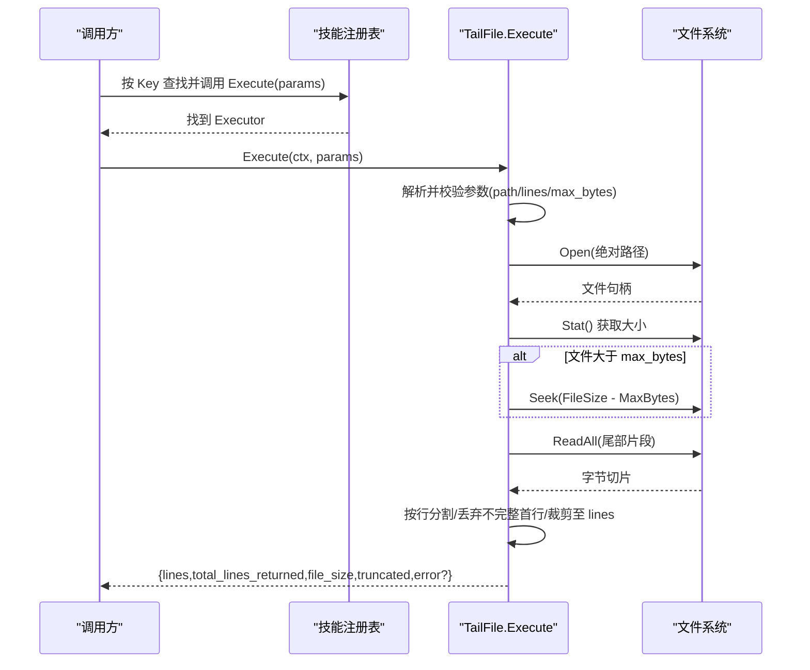
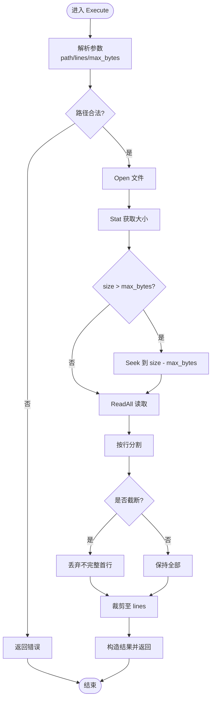
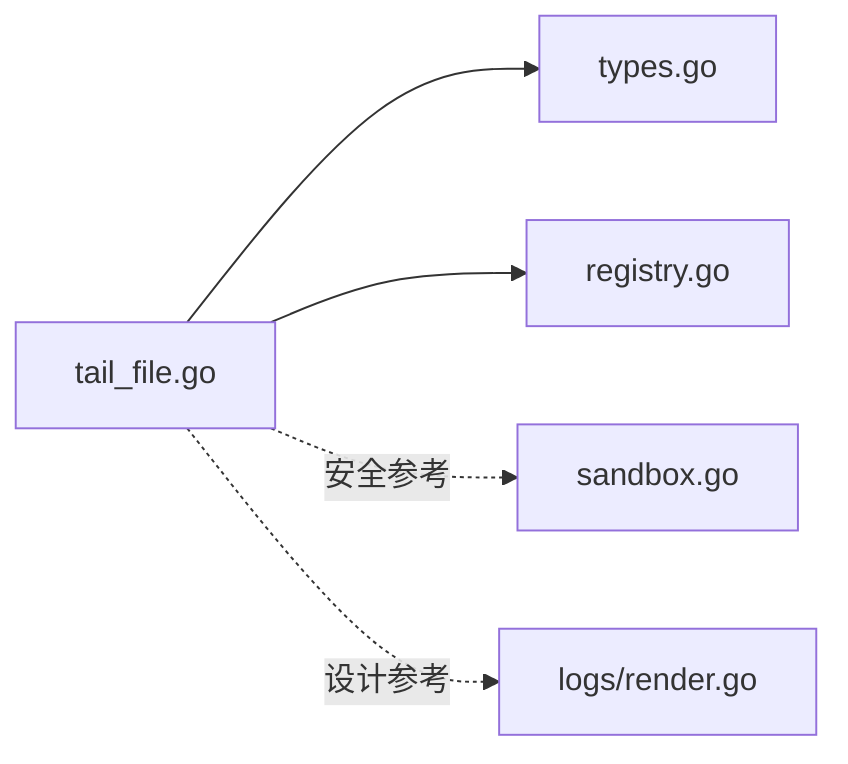

# 文件跟踪技能

<cite>
**本文引用的文件**
- [internal/skill/builtin/tail_file.go](file://internal/skill/builtin/tail_file.go)
- [internal/skill/builtin/tail_file_test.go](file://internal/skill/builtin/tail_file_test.go)
- [internal/skill/types.go](file://internal/skill/types.go)
- [internal/skill/registry.go](file://internal/skill/registry.go)
- [internal/edgeagent/host_files/sandbox.go](file://internal/edgeagent/host_files/sandbox.go)
- [internal/edgeagent/host_files/sandbox_test.go](file://internal/edgeagent/host_files/sandbox_test.go)
- [internal/edgeagent/plugins/logs/render.go](file://internal/edgeagent/plugins/logs/render.go)
- [internal/manager/biz/knowledge/builtin_vault/diagnostics/journal-disk-full.md](file://internal/manager/biz/knowledge/builtin_vault/diagnostics/journal-disk-full.md)
</cite>

## 目录
1. [简介](#简介)
2. [项目结构](#项目结构)
3. [核心组件](#核心组件)
4. [架构总览](#架构总览)
5. [详细组件分析](#详细组件分析)
6. [依赖关系分析](#依赖关系分析)
7. [性能与内存优化](#性能与内存优化)
8. [故障排查指南](#故障排查指南)
9. [结论](#结论)
10. [附录：使用示例与最佳实践](#附录使用示例与最佳实践)

## 简介
本技术文档围绕“文件跟踪技能”展开，重点解释 tail_file 技能如何实现文件的尾部读取与增量式查看能力。该技能以安全、可控的方式提供对目标主机上日志或状态文件的只读访问，支持路径白名单校验、最大字节预算限制、行数裁剪等关键特性，适用于实时监控场景下的应用日志与系统状态文件追踪。

需要特别说明的是：当前仓库中的 tail_file 实现为“一次性读取文件尾部 N 行”，并非持续监听文件变化的流式 watcher；若需真正的实时增量推送，可在上层通过定时轮询调用该技能并结合业务层去重与状态管理来实现近实时效果。

## 项目结构
tail_file 技能位于内置技能集合中，遵循统一的技能框架注册与执行模型：
- 技能定义与执行逻辑：internal/skill/builtin/tail_file.go
- 单元测试覆盖：internal/skill/builtin/tail_file_test.go
- 技能框架元数据与执行接口：internal/skill/types.go
- 技能全局注册表：internal/skill/registry.go
- 主机文件沙箱与路径校验（用于更广泛的 host_files 能力）：internal/edgeagent/host_files/sandbox.go
- 日志采集插件（展示大文件与多行处理、轮转策略的参考实现）：internal/edgeagent/plugins/logs/render.go
- 运维排障知识（日志洪泛与磁盘满的处理建议）：internal/manager/biz/knowledge/builtin_vault/diagnostics/journal-disk-full.md

图表来源
- [internal/skill/builtin/tail_file.go:1-133](file://internal/skill/builtin/tail_file.go#L1-L133)
- [internal/skill/types.go:1-241](file://internal/skill/types.go#L1-L241)
- [internal/skill/registry.go:1-126](file://internal/skill/registry.go#L1-L126)
- [internal/edgeagent/host_files/sandbox.go:135-281](file://internal/edgeagent/host_files/sandbox.go#L135-L281)
- [internal/edgeagent/plugins/logs/render.go:343-387](file://internal/edgeagent/plugins/logs/render.go#L343-L387)
- [internal/manager/biz/knowledge/builtin_vault/diagnostics/journal-disk-full.md:1-50](file://internal/manager/biz/knowledge/builtin_vault/diagnostics/journal-disk-full.md#L1-L50)

章节来源
- [internal/skill/builtin/tail_file.go:1-133](file://internal/skill/builtin/tail_file.go#L1-L133)
- [internal/skill/types.go:1-241](file://internal/skill/types.go#L1-L241)
- [internal/skill/registry.go:1-126](file://internal/skill/registry.go#L1-L126)

## 核心组件
- TailFile 技能
  - 功能：读取文件最后 N 行，类似 tail -n；支持最大字节预算与截断标记；返回结果包含实际返回行数、文件大小、是否被截断以及可选错误信息。
  - 安全：强制绝对路径、禁止路径穿越（..），属于安全类技能（ClassSafe）。
  - 参数：
    - path：必填，文件绝对路径
    - lines：返回行数，默认 100
    - max_bytes：最多读取的尾部字节数，默认 1MiB
- 技能框架
  - Executor 接口：定义 Metadata() 与 Execute(ctx, params)
  - Metadata：描述技能名称、类别、权限等级、参数 Schema、结果预览等
  - Registry：进程级技能注册表，init 时完成注册，运行时并发安全地分发执行

章节来源
- [internal/skill/builtin/tail_file.go:22-60](file://internal/skill/builtin/tail_file.go#L22-L60)
- [internal/skill/types.go:99-203](file://internal/skill/types.go#L99-L203)
- [internal/skill/registry.go:10-47](file://internal/skill/registry.go#L10-L47)

## 架构总览
tail_file 技能在启动时通过 init 注册到全局技能注册表；当外部调用（如 LLM 工具、HTTP 路由或边缘代理 RPC）触发执行时，框架根据 Key 查找并调用 Execute。Execute 内部进行参数校验、路径安全检查、打开文件、按预算定位起始位置、读取尾部内容并按行数裁剪后返回结构化结果。

图表来源
- [internal/skill/builtin/tail_file.go:64-132](file://internal/skill/builtin/tail_file.go#L64-L132)
- [internal/skill/registry.go:31-47](file://internal/skill/registry.go#L31-L47)

## 详细组件分析

### TailFile 技能实现
- 参数校验与安全
  - 要求 path 为绝对路径且不能包含 ..，防止路径穿越攻击
  - lines 与 max_bytes 具备默认值，避免无效配置
- 文件读取与内存控制
  - 先 Stat 获取文件大小，若超过 max_bytes 则 Seek 到 FileSize - MaxBytes 开始处，确保只读取尾部预算范围
  - 读取后按行分割，若发生截断则丢弃可能不完整的第一个片段，保证每行完整性
  - 最终按 lines 裁剪保留最近 N 行
- 结果结构
  - lines：返回的行数组
  - total_lines_returned：实际返回的行数
  - file_size：文件大小
  - truncated：是否因超出预算而截断
  - error：错误信息（仅在出错时填充）

图表来源
- [internal/skill/builtin/tail_file.go:64-132](file://internal/skill/builtin/tail_file.go#L64-L132)

章节来源
- [internal/skill/builtin/tail_file.go:64-132](file://internal/skill/builtin/tail_file.go#L64-L132)
- [internal/skill/builtin/tail_file_test.go:25-129](file://internal/skill/builtin/tail_file_test.go#L25-L129)

### 技能框架与注册
- 元数据与权限
  - tail_file 声明为 ClassSafe，表示只读、无副作用，适合直接由 AI 智能体调用
  - 参数 Schema 明确 path、lines、max_bytes 的类型、默认值与说明
- 注册机制
  - 在 init 中调用 Register 将 TailFile 加入全局注册表
  - 注册时对 Metadata 进行校验，重复 Key 会触发 panic，便于开发期发现问题
  - 运行时通过 Get(key) 获取 Executor 并执行

章节来源
- [internal/skill/builtin/tail_file.go:15-46](file://internal/skill/builtin/tail_file.go#L15-L46)
- [internal/skill/types.go:99-175](file://internal/skill/types.go#L99-L175)
- [internal/skill/registry.go:31-74](file://internal/skill/registry.go#L31-L74)

### 路径验证与沙箱（扩展）
虽然 tail_file 自身仅做基础路径检查（绝对路径、不含 ..），但同模块的 host_files 沙箱提供了更严格的路径校验能力，包括：
- 拒绝虚拟文件系统（/proc /sys /dev /run）与敏感路径（/etc/shadow、/root/.ssh 等）
- 支持可选白名单（AllowedReadPaths）进一步限制可访问路径
- 解析符号链接后进行严格匹配，防止通过软链接绕过限制

这些机制可作为 tail_file 的安全增强参考，或在更严格的部署环境中结合使用。

章节来源
- [internal/edgeagent/host_files/sandbox.go:135-281](file://internal/edgeagent/host_files/sandbox.go#L135-L281)
- [internal/edgeagent/host_files/sandbox_test.go:32-152](file://internal/edgeagent/host_files/sandbox_test.go#L32-L152)

### 日志采集与轮转（参考）
日志采集插件展示了如何处理大文件、多行日志、排除规则与存储策略，可作为理解日志轮转与内存控制的参考：
- 支持 include/exclude 模式匹配文件
- 支持 start_at 偏移与 multiline 起止模式
- 设置 max_log_size 限制单条日志大小
- 通过 storage 与 retry_on_failure 提升可靠性

章节来源
- [internal/edgeagent/plugins/logs/render.go:343-387](file://internal/edgeagent/plugins/logs/render.go#L343-L387)

## 依赖关系分析
- tail_file 依赖标准库 io/os/path/filepath 进行文件操作与路径处理
- 通过 skill 框架的 Executor/Metadata/Registry 完成统一接入与分发
- 与 host_files 沙箱存在概念上的安全互补关系（路径白名单、符号链接解析、敏感路径拒绝）
- 与日志采集插件共享“大文件与多行处理”的设计思路

图表来源
- [internal/skill/builtin/tail_file.go:1-133](file://internal/skill/builtin/tail_file.go#L1-L133)
- [internal/skill/types.go:1-241](file://internal/skill/types.go#L1-L241)
- [internal/skill/registry.go:1-126](file://internal/skill/registry.go#L1-L126)
- [internal/edgeagent/host_files/sandbox.go:135-281](file://internal/edgeagent/host_files/sandbox.go#L135-L281)
- [internal/edgeagent/plugins/logs/render.go:343-387](file://internal/edgeagent/plugins/logs/render.go#L343-L387)

章节来源
- [internal/skill/builtin/tail_file.go:1-133](file://internal/skill/builtin/tail_file.go#L1-L133)
- [internal/skill/types.go:1-241](file://internal/skill/types.go#L1-L241)
- [internal/skill/registry.go:1-126](file://internal/skill/registry.go#L1-L126)

## 性能与内存优化
- 预算读取（max_bytes）
  - 通过 Seek 定位到 FileSize - MaxBytes，避免全量加载大文件，降低内存占用
  - 截断时丢弃不完整首行，确保每行完整性，减少后续处理成本
- 行数裁剪（lines）
  - 在内存中仅保留最近 N 行，控制返回体积，减轻网络传输与序列化开销
- 字符串处理
  - 使用 Split 与 TrimRight 快速切分，避免额外缓冲；对于超大文件仍受限于 max_bytes
- 并发与生命周期
  - 每次调用独立打开/关闭文件，避免长期持有句柄；适合短请求场景
- 建议
  - 合理设置 max_bytes 与 lines，平衡实时性与资源消耗
  - 在高吞吐日志场景下，建议在上层采用定时轮询 + 去重策略实现近实时跟踪

[本节为通用指导，不直接分析具体文件]

## 故障排查指南
- 常见错误
  - 缺少 path 或路径非绝对：参数校验失败
  - 路径包含 ..：安全拦截
  - 文件不存在：打开失败，返回错误信息
- 日志洪泛与磁盘满
  - 优先定位日志生产者，必要时截断或清理日志，避免 IO 饱和与磁盘耗尽
  - 注意不要删除正在被写入的文件，应使用原地截断或重启写入进程
- 建议步骤
  - 使用 du/journalctl 等工具定位占用空间与生产者
  - 调整日志轮转策略与保留时间，限制单文件与整体容量
  - 结合 tail_file 的 max_bytes/lines 限制，避免单次读取过大

章节来源
- [internal/manager/biz/knowledge/builtin_vault/diagnostics/journal-disk-full.md:1-50](file://internal/manager/biz/knowledge/builtin_vault/diagnostics/journal-disk-full.md#L1-L50)

## 结论
tail_file 技能以最小化依赖实现了安全、可控的文件尾部读取能力，通过路径校验、预算读取与行数裁剪，满足大多数监控与诊断场景中对“最近日志”的快速查看需求。其设计简洁、易于集成，适合作为上层近实时跟踪的基础构件。对于更复杂的实时流式需求，可在业务层结合定时轮询与状态管理实现增量推送。

[本节为总结性内容，不直接分析具体文件]

## 附录：使用示例与最佳实践

### 基本用法
- 读取某应用日志的最后 50 行
  - 参数：path=/var/log/app.log，lines=50，max_bytes=1MiB
  - 预期：返回最近 50 行，若文件较大则 truncated=true
- 读取系统状态文件
  - 参数：path=/proc/meminfo（需确认平台允许），lines=20，max_bytes=64KiB
  - 预期：返回前 20 行，便于快速查看内存概况

### 实时监控场景（近实时）
- 方案
  - 上层定时任务每隔固定间隔调用 tail_file，记录上次返回的 last_line 或 offset
  - 对比本次返回，过滤已消费行，实现增量推送
- 注意事项
  - 合理设置 max_bytes 与 lines，避免频繁大对象传输
  - 对高频日志源启用去重与聚合，降低下游压力

### 安全与权限最佳实践
- 路径安全
  - 始终传入绝对路径，避免相对路径与 .. 穿越
  - 在严格环境中结合 host_files 沙箱白名单，限定可访问目录
- 权限检查
  - 确保运行用户对目标文件具有读权限
  - 避免读取敏感系统文件（如 /etc/shadow），遵循最小权限原则
- 大文件与轮转
  - 使用 max_bytes 限制读取范围，避免 OOM
  - 配合日志轮转策略，定期清理旧日志，防止磁盘占满

[本节为通用指导，不直接分析具体文件]