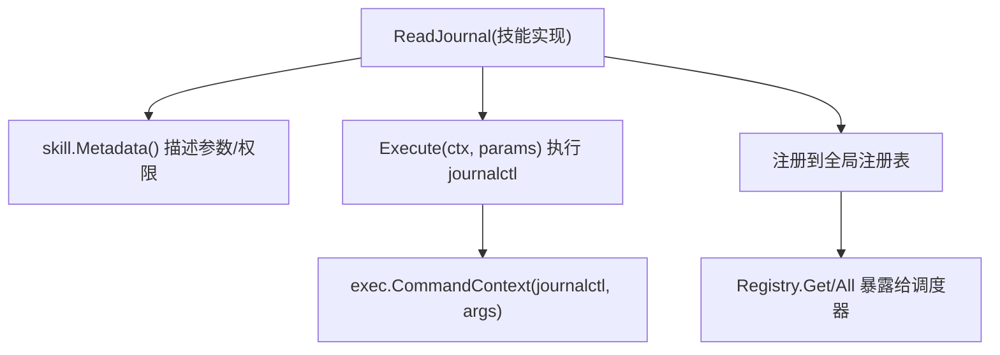
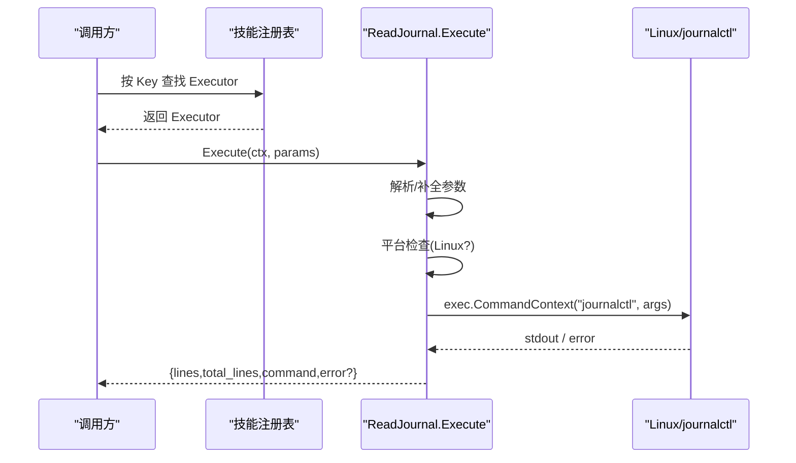
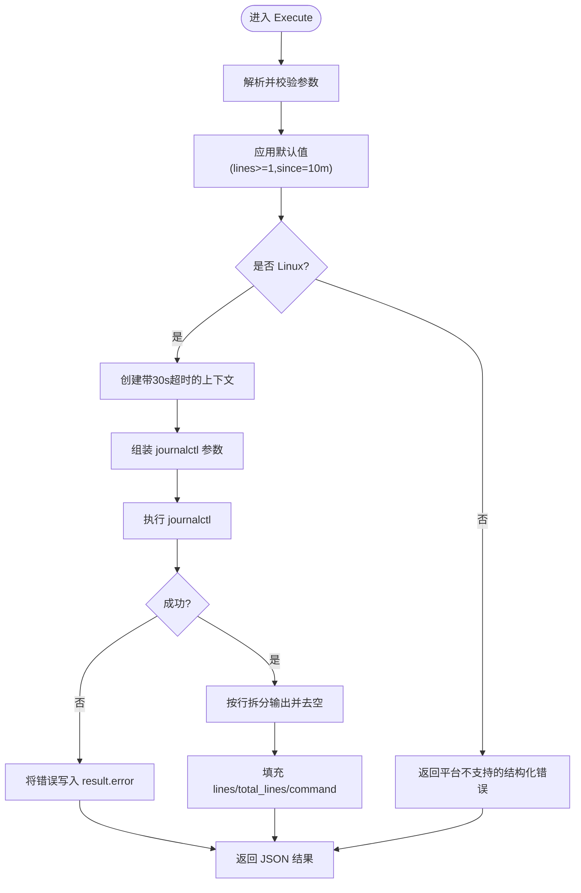
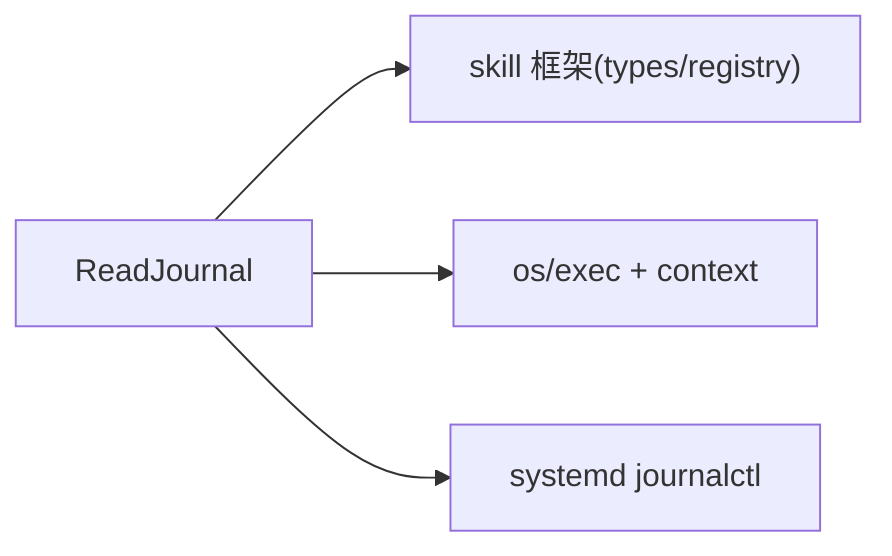

# 系统日志读取技能

<cite>
**本文引用的文件**
- [read_journal.go](file://internal/skill/builtin/read_journal.go)
- [read_journal_test.go](file://internal/skill/builtin/read_journal_test.go)
- [types.go](file://internal/skill/types.go)
- [registry.go](file://internal/skill/registry.go)
- [subprocess.go](file://internal/skill/subprocess.go)
</cite>

## 目录
1. [简介](#简介)
2. [项目结构](#项目结构)
3. [核心组件](#核心组件)
4. [架构总览](#架构总览)
5. [详细组件分析](#详细组件分析)
6. [依赖关系分析](#依赖关系分析)
7. [性能与内存管理](#性能与内存管理)
8. [故障排查指南](#故障排查指南)
9. [结论](#结论)
10. [附录：使用示例](#附录使用示例)

## 简介
本技术文档聚焦于“系统日志读取技能”（read_journal），该技能通过包装 Linux 的 journalctl 命令，安全、可控地读取 systemd-journald 中的系统服务日志。它提供 unit 过滤、时间范围回溯（since）、行数限制等关键能力，并在 Linux 平台内以只读方式执行，避免对系统造成副作用。同时内置了 30 秒超时保护机制和结构化错误返回，便于上层调度器与 LLM 工具进行稳定调用。

## 项目结构
read_journal 技能位于内置技能包中，遵循统一的 skill 框架约定：实现 Metadata 描述参数与权限等级，实现 Execute 完成实际执行；在 init 中注册到全局技能注册表，供管理器与边缘侧统一调度。

图表来源
- [read_journal.go:16-47](file://internal/skill/builtin/read_journal.go#L16-L47)
- [registry.go:10-47](file://internal/skill/registry.go#L10-L47)

章节来源
- [read_journal.go:16-47](file://internal/skill/builtin/read_journal.go#L16-L47)
- [registry.go:10-47](file://internal/skill/registry.go#L10-L47)

## 核心组件
- ReadJournal 技能：实现 skill.Executor 接口，负责解析参数、构造 journalctl 命令、执行并返回结构化结果。
- 参数与元数据：通过 Metadata 声明 key、名称、描述、权限类别、分类、参数 Schema 与结果预览。
- 执行流程：参数校验与默认值填充 -> 平台检查（仅 Linux）-> 上下文超时控制 -> 构建参数 -> 执行 -> 输出处理 -> 返回 JSON。

章节来源
- [read_journal.go:23-47](file://internal/skill/builtin/read_journal.go#L23-L47)
- [read_journal.go:62-111](file://internal/skill/builtin/read_journal.go#L62-L111)
- [types.go:99-125](file://internal/skill/types.go#L99-L125)

## 架构总览
read_journal 作为“安全类”技能，运行在目标主机上（ScopeHost）。管理器或 AI 工具通过统一的 execute_skill 路由分发到对应 Key，由边缘侧执行并返回结构化结果。

图表来源
- [read_journal.go:62-111](file://internal/skill/builtin/read_journal.go#L62-L111)
- [registry.go:31-47](file://internal/skill/registry.go#L31-L47)

## 详细组件分析

### 参数与过滤机制
- unit：可选，用于过滤指定 systemd unit 的日志。
- since：可选，支持 duration 类型，默认 10m，传入 journalctl --since 参数。
- lines：可选，整数，默认 200，传入 -n 限制最大输出行数。
- 输出格式：固定为 short-iso，关闭分页器，保证可预测、易解析的输出。

章节来源
- [read_journal.go:31-44](file://internal/skill/builtin/read_journal.go#L31-L44)
- [read_journal.go:89-95](file://internal/skill/builtin/read_journal.go#L89-L95)

### 执行流程与时序

图表来源
- [read_journal.go:62-111](file://internal/skill/builtin/read_journal.go#L62-L111)

### 超时保护与错误处理
- 超时保护：使用 context.WithTimeout 设置 30 秒硬超时，防止 journalctl 挂起导致调度器阻塞。
- 错误策略：
  - 非 Linux 平台：直接返回结构化错误字段，不抛 Go 错误，便于上层统一消费。
  - 执行失败：将错误信息写入 result.error，并返回完整结果对象。
  - 参数解码失败：返回 Go 错误，由上层统一处理。
- 结果字段：
  - lines：日志行数组
  - total_lines：实际返回的行数
  - command：最终执行的 journalctl 命令字符串（便于审计与调试）
  - error：可选的错误信息

章节来源
- [read_journal.go:62-111](file://internal/skill/builtin/read_journal.go#L62-L111)

### 单元测试要点
- 元数据校验：确保 Key、ClassSafe 等符合预期。
- 非 Linux 行为：在非 Linux 环境应返回平台不支持的错误。
- Linux 正常路径：即使无 journalctl，也应能返回包含 command 的结构化结果。
- 参数类型校验：错误的 lines 类型应在解码阶段报错。

章节来源
- [read_journal_test.go:12-77](file://internal/skill/builtin/read_journal_test.go#L12-L77)

## 依赖关系分析
- 运行时依赖：
  - Linux 平台与 systemd-journald
  - 系统命令 journalctl 必须存在且具备只读访问权限
- 框架依赖：
  - skill 框架的 Metadata/Executor/Registry 机制
  - 标准库 os/exec 与 context 超时控制

图表来源
- [read_journal.go:3-14](file://internal/skill/builtin/read_journal.go#L3-L14)
- [types.go:99-125](file://internal/skill/types.go#L99-L125)
- [registry.go:10-47](file://internal/skill/registry.go#L10-L47)

章节来源
- [read_journal.go:3-14](file://internal/skill/builtin/read_journal.go#L3-L14)
- [types.go:99-125](file://internal/skill/types.go#L99-L125)
- [registry.go:10-47](file://internal/skill/registry.go#L10-L47)

## 性能与内存管理
- 行数限制：通过 -n 限制输出行数，避免一次性拉取过多日志导致内存膨胀。
- 输出格式：short-iso 减少额外格式化开销，便于快速解析。
- 超时保护：30 秒超时避免长时间阻塞，保障调度稳定性。
- 内存占用：
  - 输出按行切分后存入切片，建议结合业务场景合理设置 lines。
  - 对于大日志场景，优先使用 unit 与 since 缩小查询范围，再配合较小的 lines 分批获取。
- 与通用子进程技能的对比：
  - 通用子进程技能（SubprocessSkill）提供 16 MiB 的 stdout 上限与 stderr 尾部保留，适用于外部脚本；read_journal 直接调用系统命令，未使用 cappedWriter，但通过 -n 与 short-iso 控制输出规模。

章节来源
- [read_journal.go:89-111](file://internal/skill/builtin/read_journal.go#L89-L111)
- [subprocess.go:17-28](file://internal/skill/subprocess.go#L17-L28)
- [subprocess.go:207-238](file://internal/skill/subprocess.go#L207-L238)

## 故障排查指南
- 平台不支持：
  - 现象：返回 error 字段提示仅 Linux 支持。
  - 处理：确认运行环境为 Linux，或在管理器侧做前置判断。
- journalctl 不可用：
  - 现象：返回 error 字段包含命令执行错误。
  - 处理：安装 journalctl，或切换到其他日志后端。
- 权限不足：
  - 现象：journalctl 返回权限相关错误。
  - 处理：确保进程具有读取 journald 的权限（如加入 appropriate groups 或使用 sudo 配置）。
- 查询过大：
  - 现象：响应慢、内存高。
  - 处理：缩小 since 时间窗口、限定 unit、降低 lines。
- 超时：
  - 现象：context 超时被触发。
  - 处理：优化查询条件或增加上游超时阈值（注意保持 30 秒保护语义）。

章节来源
- [read_journal.go:81-103](file://internal/skill/builtin/read_journal.go#L81-L103)

## 结论
read_journal 技能以最小侵入的方式封装了 journalctl，提供了面向故障排查的常用能力：unit 过滤、时间回溯、行数限制与 30 秒超时保护。其结构化返回与平台检测使得上层调度更加稳健。在生产环境中，建议结合业务需求合理设置 since 与 lines，必要时先定位问题 unit，再逐步扩大查询范围，以获得最佳性能与可观测性。

## 附录：使用示例
以下为典型故障排查场景的使用思路（不展示具体代码，仅提供调用思路与参数说明）：

- 查看某服务最近 10 分钟的最后 200 行日志
  - 参数：unit="your-service", since="10m", lines=200
  - 用途：快速定位服务近期异常

- 查看某服务最近 1 小时的最后 50 行日志
  - 参数：unit="your-service", since="1h", lines=50
  - 用途：缩小范围，聚焦最近的问题片段

- 查看系统级日志（不限 unit），最近 5 分钟，最多 100 行
  - 参数：since="5m", lines=100
  - 用途：快速浏览系统事件

- 当出现磁盘空间告警时，先定位哪个 unit 产生大量日志
  - 先用较小 lines 与较短 since 观察热点 unit
  - 再针对该 unit 深入查看

- 当需要跨多个 unit 对比时
  - 多次调用，分别指定不同 unit，比较相同时间段内的日志量与错误模式

注意事项
- 始终优先使用 unit 与 since 缩小查询范围
- 在大日志环境下，尽量使用较小的 lines 分批获取
- 若返回 error 字段，根据错误信息进行相应修复（平台、权限、命令可用性）

章节来源
- [read_journal.go:31-44](file://internal/skill/builtin/read_journal.go#L31-L44)
- [read_journal.go:89-111](file://internal/skill/builtin/read_journal.go#L89-L111)