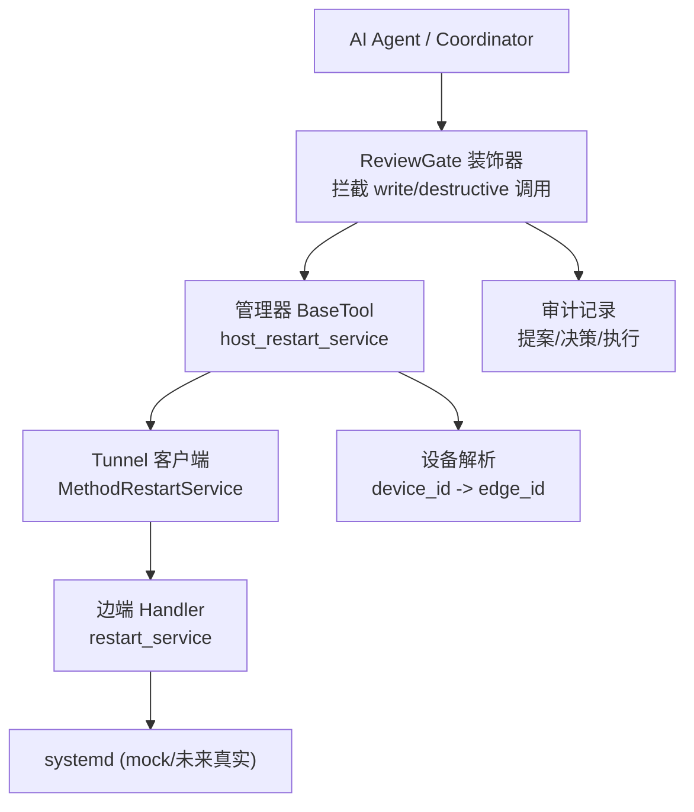
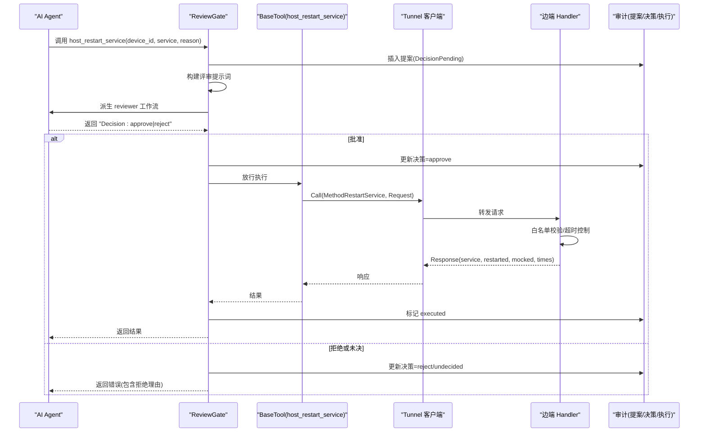
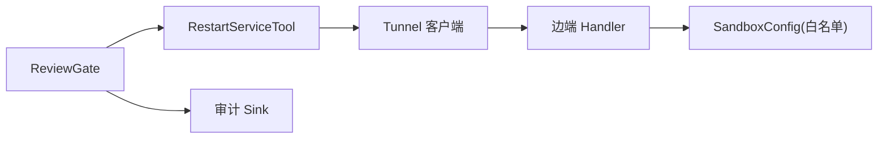

# 服务管理技能

<cite>
**本文引用的文件**
- [skills/restart-service/SKILL.md](file://skills/restart-service/SKILL.md)
- [internal/skill/builtin/restart_service/restart_service.go](file://internal/skill/builtin/restart_service/restart_service.go)
- [internal/manager/biz/aiops/tools/restart_service_basetool.go](file://internal/manager/biz/aiops/tools/restart_service_basetool.go)
- [internal/manager/biz/aiops/tools/decorators/review_gate.go](file://internal/manager/biz/aiops/tools/decorators/review_gate.go)
- [internal/edgeagent/restart_service/handlers.go](file://internal/edgeagent/restart_service/handlers.go)
- [internal/pkg/tunnel/restart_service.go](file://internal/pkg/tunnel/restart_service.go)
- [internal/pkg/tunnel/types.go](file://internal/pkg/tunnel/types.go)
- [internal/manager/model/audit/log.go](file://internal/manager/model/audit/log.go)
- [internal/manager/server/audit/http.go](file://internal/manager/server/audit/http.go)
- [internal/manager/service/systemhealth/service.go](file://internal/manager/service/systemhealth/service.go)
</cite>

## 目录
1. [简介](#简介)
2. [项目结构](#项目结构)
3. [核心组件](#核心组件)
4. [架构总览](#架构总览)
5. [详细组件分析](#详细组件分析)
6. [依赖关系分析](#依赖关系分析)
7. [性能与超时](#性能与超时)
8. [故障排查指南](#故障排查指南)
9. [结论](#结论)
10. [附录：使用示例与最佳实践](#附录使用示例与最佳实践)

## 简介
本技术文档聚焦“重启 systemd 服务”技能，系统性说明其安全机制、权限控制、执行流程、参数配置、错误处理与审计日志。该技能属于变更类（mutating）能力，通过 ReviewGate 装饰器实现“双重审批”：在管理器侧拦截并触发 reviewer 工作流进行 SOP、并发操作、回滚路径等审查；仅当 reviewer 输出“Decision: approve”后，才下发到边端执行。边端再次校验白名单并返回结果，全程记录审计行，便于事后复盘。

## 项目结构
围绕“重启 systemd 服务”的关键代码分布在以下位置：
- 技能声明与元数据：skills/restart-service/SKILL.md、internal/skill/builtin/restart_service/restart_service.go
- 管理器侧 BaseTool（工具实现与调度）：internal/manager/biz/aiops/tools/restart_service_basetool.go
- 双重审批装饰器：internal/manager/biz/aiops/tools/decorators/review_gate.go
- 边端处理器（沙箱白名单与 mock 实现）：internal/edgeagent/restart_service/handlers.go
- 隧道协议与消息体：internal/pkg/tunnel/restart_service.go、internal/pkg/tunnel/types.go
- 审计模型与查询接口：internal/manager/model/audit/log.go、internal/manager/server/audit/http.go
- 健康检查与超时参考：internal/manager/service/systemhealth/service.go

图表来源
- [internal/manager/biz/aiops/tools/decorators/review_gate.go:235-349](file://internal/manager/biz/aiops/tools/decorators/review_gate.go#L235-L349)
- [internal/manager/biz/aiops/tools/restart_service_basetool.go:176-259](file://internal/manager/biz/aiops/tools/restart_service_basetool.go#L176-L259)
- [internal/pkg/tunnel/restart_service.go:21-74](file://internal/pkg/tunnel/restart_service.go#L21-L74)
- [internal/edgeagent/restart_service/handlers.go:144-219](file://internal/edgeagent/restart_service/handlers.go#L144-L219)

章节来源
- [skills/restart-service/SKILL.md:1-82](file://skills/restart-service/SKILL.md#L1-L82)
- [internal/skill/builtin/restart_service/restart_service.go:58-114](file://internal/skill/builtin/restart_service/restart_service.go#L58-L114)

## 核心组件
- 技能元数据与注册：定义 Key、名称、类别（ClassMutating）、作用域（ScopeHost）、参数 schema（device_id、service、reason），并禁止直接 Execute，强制走管理器 BaseTool + ReviewGate。
- 管理器 BaseTool：负责参数校验、白名单检查、设备解析、构造请求、调用隧道、封装响应。
- ReviewGate 装饰器：对 Class="write"/"destructive" 的调用进行拦截，生成提案、派生 reviewer 工作流、解析决策、写入审计、仅在 approve 时放行。
- 边端 Handler：防御性二次校验白名单、设置超时、当前为 mock 模式返回成功、预留真实 systemctl 扩展点。
- 隧道协议：定义 MethodRestartService、Request/Response 结构，承载 service、reason、started_at/ended_at、mocked、error 等字段。
- 审计与查询：提案表记录插入、更新决策、标记执行；审计日志提供统一查询入口。

章节来源
- [internal/skill/builtin/restart_service/restart_service.go:58-114](file://internal/skill/builtin/restart_service/restart_service.go#L58-L114)
- [internal/manager/biz/aiops/tools/restart_service_basetool.go:176-259](file://internal/manager/biz/aiops/tools/restart_service_basetool.go#L176-L259)
- [internal/manager/biz/aiops/tools/decorators/review_gate.go:235-349](file://internal/manager/biz/aiops/tools/decorators/review_gate.go#L235-L349)
- [internal/edgeagent/restart_service/handlers.go:144-219](file://internal/edgeagent/restart_service/handlers.go#L144-L219)
- [internal/pkg/tunnel/restart_service.go:21-74](file://internal/pkg/tunnel/restart_service.go#L21-L74)

## 架构总览
下图展示从 AI Agent 发起重启请求到边端执行的完整链路，以及 ReviewGate 的双审与审计落盘过程。

图表来源
- [internal/manager/biz/aiops/tools/decorators/review_gate.go:263-349](file://internal/manager/biz/aiops/tools/decorators/review_gate.go#L263-L349)
- [internal/manager/biz/aiops/tools/restart_service_basetool.go:198-259](file://internal/manager/biz/aiops/tools/restart_service_basetool.go#L198-L259)
- [internal/pkg/tunnel/restart_service.go:21-74](file://internal/pkg/tunnel/restart_service.go#L21-L74)
- [internal/edgeagent/restart_service/handlers.go:167-219](file://internal/edgeagent/restart_service/handlers.go#L167-L219)

## 详细组件分析

### 技能元数据与注册（internal/skill/builtin/restart_service/restart_service.go）
- 关键设计：
  - Key 与管理器工具名一致，便于审计与目录关联。
  - Class=ClassMutating，Scope=ScopeHost，强制走管理器 BaseTool。
  - 参数 schema：device_id（必填）、service（必填，systemd 短名）、reason（建议填写）。
  - Execute 直接报错，防止绕过 ReviewGate 的直接调用路径。

章节来源
- [internal/skill/builtin/restart_service/restart_service.go:58-114](file://internal/skill/builtin/restart_service/restart_service.go#L58-L114)

### 管理器 BaseTool（internal/manager/biz/aiops/tools/restart_service_basetool.go）
- 职责：
  - 参数解析与校验（device_id、service 非空、规范化 service 名称）。
  - 白名单校验（与边端保持一致的允许列表）。
  - 设备解析（device_id → edge_id）。
  - 构造 tunnel.RestartServiceRequest 并调用隧道。
  - 封装响应（包含 device_id、service、restarted、mocked、时间戳、error）。
- 超时：单次隧道调用限制 30s，为后续真实 systemctl 留出余量。

章节来源
- [internal/manager/biz/aiops/tools/restart_service_basetool.go:113-124](file://internal/manager/biz/aiops/tools/restart_service_basetool.go#L113-L124)
- [internal/manager/biz/aiops/tools/restart_service_basetool.go:198-259](file://internal/manager/biz/aiops/tools/restart_service_basetool.go#L198-L259)

### ReviewGate 装饰器（internal/manager/biz/aiops/tools/decorators/review_gate.go）
- 拦截条件：Class="write"或"destructive"。
- 流程要点：
  - 插入提案行（DecisionPending），携带 tool_name、args、class、operator user_id、session_id。
  - 构建评审提示词，派生 reviewer 工作流。
  - 解析 reviewer 输出中的“Decision: approve|reject”，未决视为拒绝。
  - 批准则放行 Inner Tool，拒绝则返回错误（包含理由）。
  - 审计：更新决策、标记执行（best-effort，不阻塞主流程）。
- 超时：默认 60s 用于 reviewer 往返，独立于内层工具超时。

章节来源
- [internal/manager/biz/aiops/tools/decorators/review_gate.go:235-349](file://internal/manager/biz/aiops/tools/decorators/review_gate.go#L235-L349)
- [internal/manager/biz/aiops/tools/decorators/review_gate.go:420-466](file://internal/manager/biz/aiops/tools/decorators/review_gate.go#L420-L466)
- [internal/manager/biz/aiops/tools/decorators/review_gate.go:480-512](file://internal/manager/biz/aiops/tools/decorators/review_gate.go#L480-L512)
- [internal/manager/biz/aiops/tools/decorators/review_gate.go:537-592](file://internal/manager/biz/aiops/tools/decorators/review_gate.go#L537-L592)

### 边端 Handler（internal/edgeagent/restart_service/handlers.go）
- 安全机制：
  - 白名单二次校验（canonicalUnit 标准化：去空白、去 .service、小写、非法字符过滤）。
  - 超时保护（10s），避免长时间挂起。
  - Mocked 模式：当前 PR-7 不实际执行 systemctl，返回 Mocked=true；若关闭 Mocked 会显式报错，防止半实现误触发。
- 日志：记录 service、reason、mocked 状态，便于审计与排障。

章节来源
- [internal/edgeagent/restart_service/handlers.go:49-142](file://internal/edgeagent/restart_service/handlers.go#L49-L142)
- [internal/edgeagent/restart_service/handlers.go:167-219](file://internal/edgeagent/restart_service/handlers.go#L167-L219)

### 隧道协议与消息体（internal/pkg/tunnel/restart_service.go、types.go）
- MethodRestartService：唯一方法标识，用于路由到对应 handler。
- RestartServiceRequest：service（短名）、reason（可选，审计用）。
- RestartServiceResponse：service、restarted、mocked、started_at、ended_at、error。
- Session：边端身份上下文（单租户 MVP）。

章节来源
- [internal/pkg/tunnel/restart_service.go:21-74](file://internal/pkg/tunnel/restart_service.go#L21-L74)
- [internal/pkg/tunnel/types.go:8-24](file://internal/pkg/tunnel/types.go#L8-L24)

### 审计与查询（internal/manager/model/audit/log.go、server/audit/http.go）
- 审计模型：统一 action 命名规范，status 包括 success/failure/denied。
- 查询接口：管理员可访问审计列表，支持按资源类型、状态等过滤。
- 与 ReviewGate 集成：提案表记录插入、更新决策、标记执行，形成闭环。

章节来源
- [internal/manager/model/audit/log.go:49-76](file://internal/manager/model/audit/log.go#L49-L76)
- [internal/manager/server/audit/http.go:36-73](file://internal/manager/server/audit/http.go#L36-L73)

## 依赖关系分析
- 管理器侧：
  - BaseTool 依赖设备解析（device_id → edge_id）和隧道客户端。
  - ReviewGate 依赖评审工作流 spawner 与审计 sink。
- 边端侧：
  - Handler 依赖 SandboxConfig（白名单）与隧道 Client。
- 跨层：
  - 隧道协议作为管理器与边端的契约，确保 Request/Response 一致性。

图表来源
- [internal/manager/biz/aiops/tools/decorators/review_gate.go:235-349](file://internal/manager/biz/aiops/tools/decorators/review_gate.go#L235-L349)
- [internal/manager/biz/aiops/tools/restart_service_basetool.go:198-259](file://internal/manager/biz/aiops/tools/restart_service_basetool.go#L198-L259)
- [internal/edgeagent/restart_service/handlers.go:144-219](file://internal/edgeagent/restart_service/handlers.go#L144-L219)

章节来源
- [internal/manager/biz/aiops/tools/decorators/review_gate.go:235-349](file://internal/manager/biz/aiops/tools/decorators/review_gate.go#L235-L349)
- [internal/manager/biz/aiops/tools/restart_service_basetool.go:198-259](file://internal/manager/biz/aiops/tools/restart_service_basetool.go#L198-L259)
- [internal/edgeagent/restart_service/handlers.go:144-219](file://internal/edgeagent/restart_service/handlers.go#L144-L219)

## 性能与超时
- 管理器侧：
  - ReviewGate 默认 60s 超时，覆盖 reviewer 往返。
  - BaseTool 单次隧道调用 30s 超时，为未来真实 systemctl 留出空间。
- 边端侧：
  - Handler 10s 超时，避免长时间阻塞。
- 健康检查参考：系统探针具备超时与状态汇总逻辑，可用于监控服务健康度。

优化建议
- 合理调优超时：根据网络与边端负载调整 ReviewGate 与 BaseTool 超时。
- 批处理与限流：在高并发场景下，结合速率限制与队列化评审，避免 reviewer 过载。
- 缓存白名单：边端已预计算 allow-list 集合，减少重复开销。

章节来源
- [internal/manager/biz/aiops/tools/decorators/review_gate.go:90-94](file://internal/manager/biz/aiops/tools/decorators/review_gate.go#L90-L94)
- [internal/manager/biz/aiops/tools/restart_service_basetool.go:120-124](file://internal/manager/biz/aiops/tools/restart_service_basetool.go#L120-L124)
- [internal/edgeagent/restart_service/handlers.go:43-47](file://internal/edgeagent/restart_service/handlers.go#L43-L47)
- [internal/manager/service/systemhealth/service.go:388-442](file://internal/manager/service/systemhealth/service.go#L388-L442)

## 故障排查指南
常见问题与定位步骤
- 白名单拒绝：
  - 现象：管理器或边端返回“not in allow-list”。
  - 排查：确认 service 是否在允许列表（nginx/redis/prometheus/loki/tempo/grafana/mysql/ongrid）。
  - 依据：管理器与边端均做白名单校验。
- 设备未链接：
  - 现象：device_id 无 host-edge 链接。
  - 排查：使用设备查询接口确认可用设备 id。
- 评审拒绝：
  - 现象：返回“review rejected: ...”。
  - 排查：查看 reviewer 输出的拒绝理由，不要立即重试。
- 边端未实现真实 systemctl：
  - 现象：Mocked=true 或显式错误提示。
  - 排查：确认 sandbox.Mocked 配置；生产环境需实现真实 shell-out。
- 审计缺失：
  - 现象：提案/决策/执行记录不完整。
  - 排查：检查审计 sink 是否启用与写入成功；审计失败不应阻断主流程。

章节来源
- [internal/manager/biz/aiops/tools/restart_service_basetool.go:214-226](file://internal/manager/biz/aiops/tools/restart_service_basetool.go#L214-L226)
- [internal/edgeagent/restart_service/handlers.go:178-185](file://internal/edgeagent/restart_service/handlers.go#L178-L185)
- [internal/manager/biz/aiops/tools/decorators/review_gate.go:331-349](file://internal/manager/biz/aiops/tools/decorators/review_gate.go#L331-L349)
- [internal/edgeagent/restart_service/handlers.go:198-204](file://internal/edgeagent/restart_service/handlers.go#L198-L204)

## 结论
“重启 systemd 服务”技能通过管理器侧 BaseTool 与 ReviewGate 装饰器实现了严格的安全门控与审计闭环，并在边端进行白名单二次校验与超时保护。当前以 mock 模式完成端到端评审流程验证，后续将接入真实 systemctl 执行。建议在部署中保持最小白名单、完善审计与监控、合理配置超时与限流，确保变更操作可控、可追溯。

## 附录：使用示例与最佳实践

### 参数配置
- device_id：目标设备 id（必填）。
- service：systemd 短名（不带 .service 后缀，必填）。
- reason：重启理由（建议填写，写入审计行）。

章节来源
- [internal/skill/builtin/restart_service/restart_service.go:77-90](file://internal/skill/builtin/restart_service/restart_service.go#L77-L90)
- [internal/manager/biz/aiops/tools/restart_service_basetool.go:83-99](file://internal/manager/biz/aiops/tools/restart_service_basetool.go#L83-L99)

### 安全流程（AI Agent 工作流）
- 用户明确请求重启某允许列表内的服务。
- Coordinator 发出 tool_call。
- ReviewGate 拦截并派生 reviewer 工作流。
- reviewer 基于 SOP、并行操作、告警等信息决议。
- 批准后，管理器 BaseTool 调用隧道，边端执行（当前为 mock）。
- 审计记录提案、决策、执行。

章节来源
- [skills/restart-service/SKILL.md:32-69](file://skills/restart-service/SKILL.md#L32-L69)
- [internal/manager/biz/aiops/tools/decorators/review_gate.go:263-349](file://internal/manager/biz/aiops/tools/decorators/review_gate.go#L263-L349)

### 白名单与服务选择
- 允许列表：nginx、redis、prometheus、loki、tempo、grafana、mysql、ongrid。
- 其他服务直接拒绝，不走 reviewer，节省 LLM 调用。

章节来源
- [skills/restart-service/SKILL.md:46-52](file://skills/restart-service/SKILL.md#L46-L52)
- [internal/manager/biz/aiops/tools/restart_service_basetool.go:101-117](file://internal/manager/biz/aiops/tools/restart_service_basetool.go#L101-L117)

### 错误处理与审计
- 错误类型：参数错误、白名单拒绝、设备未链接、评审拒绝、边端未实现、超时。
- 审计：提案插入、决策更新、执行标记；审计失败不阻断主流程。

章节来源
- [internal/manager/biz/aiops/tools/restart_service_basetool.go:198-259](file://internal/manager/biz/aiops/tools/restart_service_basetool.go#L198-L259)
- [internal/edgeagent/restart_service/handlers.go:167-219](file://internal/edgeagent/restart_service/handlers.go#L167-L219)
- [internal/manager/biz/aiops/tools/decorators/review_gate.go:377-398](file://internal/manager/biz/aiops/tools/decorators/review_gate.go#L377-L398)

### 监控与状态
- 健康检查：探针具备超时与状态汇总，可用于监控服务健康。
- 指标建议：统计评审通过率、执行耗时、拒绝原因分布。

章节来源
- [internal/manager/service/systemhealth/service.go:388-442](file://internal/manager/service/systemhealth/service.go#L388-L442)