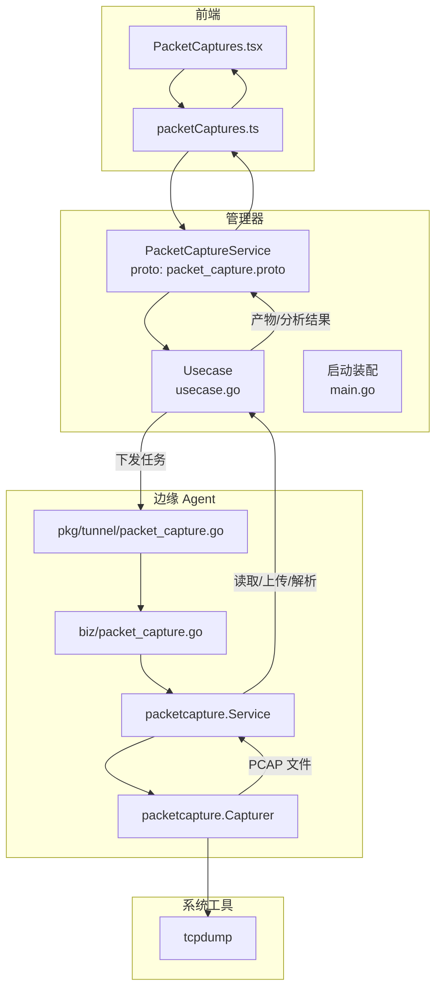
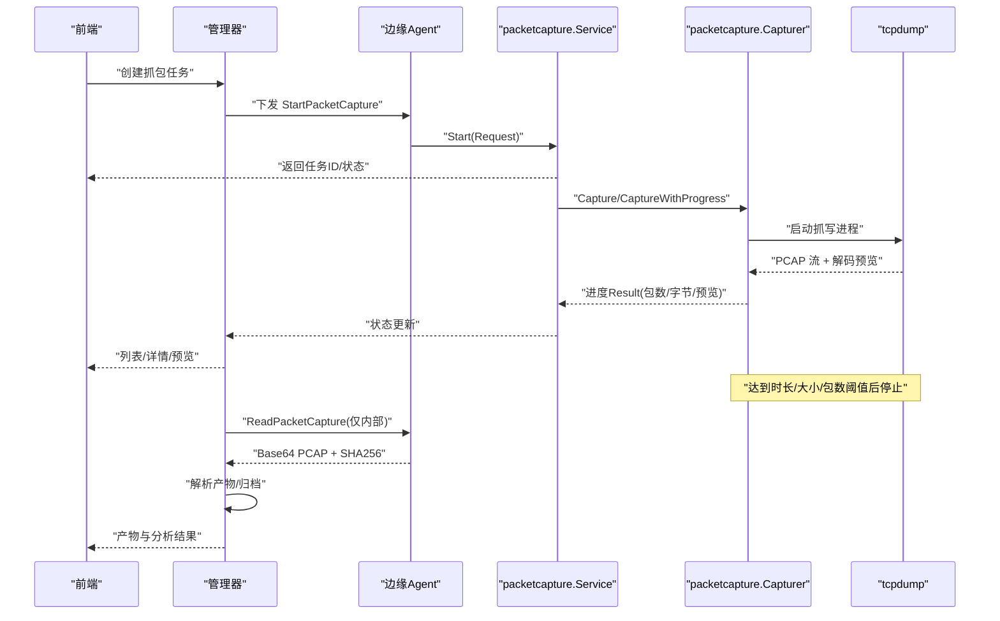
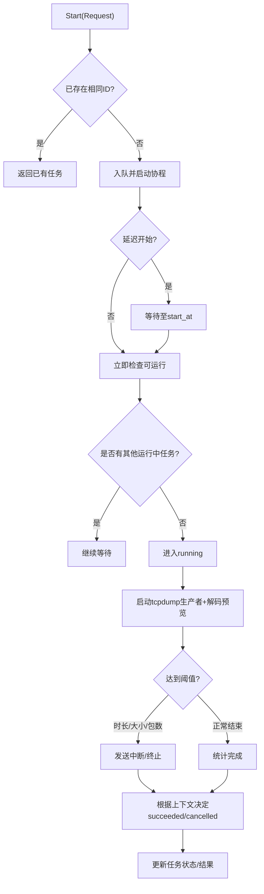
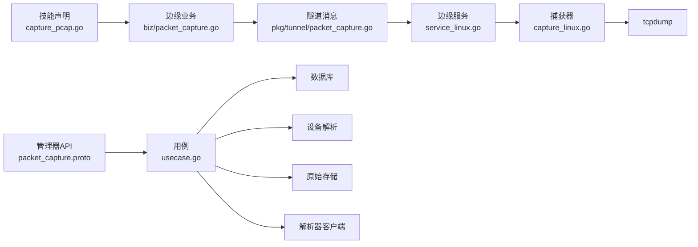

# 网络抓包技能

<cite>
**本文引用的文件**
- [capture_pcap.go](file://internal/skill/builtin/capture_pcap.go)
- [service_linux.go](file://internal/edgeagent/packetcapture/service_linux.go)
- [capture_linux.go](file://internal/edgeagent/packetcapture/capture_linux.go)
- [packet_capture.go（tunnel）](file://internal/pkg/tunnel/packet_capture.go)
- [packet_capture.go（edge agent biz）](file://internal/edgeagent/biz/packet_capture.go)
- [packet_capture.proto](file://api/manager/packetcapture/v1/packet_capture.proto)
- [usecase.go](file://internal/manager/biz/packetcapture/usecase.go)
- [main.go](file://cmd/ongrid/main.go)
- [PacketCaptures.tsx](file://web/src/pages/PacketCaptures.tsx)
- [packetCaptures.ts](file://web/src/api/packetCaptures.ts)
</cite>

## 目录
1. [简介](#简介)
2. [项目结构](#项目结构)
3. [核心组件](#核心组件)
4. [架构总览](#架构总览)
5. [详细组件分析](#详细组件分析)
6. [依赖关系分析](#依赖关系分析)
7. [性能与资源控制](#性能与资源控制)
8. [故障排查指南](#故障排查指南)
9. [结论](#结论)
10. [附录：使用示例与分析工具集成](#附录使用示例与分析工具集成)

## 简介
本技术文档面向“网络抓包技能”，覆盖 PCAP 抓包的功能特性、捕获规则配置、数据处理流程、过滤器语法、存储格式、分析与可视化工具集成，以及性能优化、内存管理与磁盘空间控制。文档同时提供在真实网络故障诊断中的使用示例，说明如何从发起抓包到导出、解析、可视化分析的完整闭环。

## 项目结构
抓包能力贯穿“技能声明—边缘执行—管理器编排—前端交互”四层：
- 技能层：定义可被工作流或助手调用的“抓包”和“查询抓包状态”两个技能。
- 边缘层：在 Linux Edge 上通过 tcpdump 进行受控的 PCAP 抓取，支持网络命名空间切换、过滤、限时/限大小/限包数等边界控制，并提供任务队列、进度上报、取消/停止等能力。
- 管理器层：对外暴露 gRPC/HTTP API，负责创建抓包任务、调度到边缘、拉取结果、解析产物、管理会话与权限审批等。
- 前端层：提供抓包列表、新建抓包表单、状态刷新、产物查看与分析面板。

图表来源
- [packet_capture.proto:1-26](file://api/manager/packetcapture/v1/packet_capture.proto#L1-L26)
- [usecase.go:262-298](file://internal/manager/biz/packetcapture/usecase.go#L262-L298)
- [main.go:1300-1329](file://cmd/ongrid/main.go#L1300-L1329)
- [packet_capture.go（tunnel）:5-22](file://internal/pkg/tunnel/packet_capture.go#L5-L22)
- [packet_capture.go（edge agent biz）:15-133](file://internal/edgeagent/biz/packet_capture.go#L15-L133)
- [service_linux.go:47-109](file://internal/edgeagent/packetcapture/service_linux.go#L47-L109)
- [capture_linux.go:131-187](file://internal/edgeagent/packetcapture/capture_linux.go#L131-L187)

章节来源
- [capture_pcap.go:26-45](file://internal/skill/builtin/capture_pcap.go#L26-L45)
- [service_linux.go:47-109](file://internal/edgeagent/packetcapture/service_linux.go#L47-L109)
- [capture_linux.go:131-187](file://internal/edgeagent/packetcapture/capture_linux.go#L131-L187)
- [packet_capture.proto:1-26](file://api/manager/packetcapture/v1/packet_capture.proto#L1-L26)
- [usecase.go:262-298](file://internal/manager/biz/packetcapture/usecase.go#L262-L298)
- [main.go:1300-1329](file://cmd/ongrid/main.go#L1300-L1329)
- [PacketCaptures.tsx:50-119](file://web/src/pages/PacketCaptures.tsx#L50-L119)
- [packetCaptures.ts:149-199](file://web/src/api/packetCaptures.ts#L149-L199)

## 核心组件
- 技能声明：提供“抓包”和“获取抓包状态”两个技能，限定参数范围与安全策略，确保仅在授权场景下触发。
- 边缘服务：单实例并发限制、任务队列、进度上报、取消/停止、命名空间隔离、过滤器规范化、输出文件安全路径。
- 管理器服务：统一 API、幂等键、目标设备解析、状态机流转、产物解析与访问控制、会话聚合。
- 前端界面：设备选择、接口选择、过滤器输入、时长/大小/包数限制、状态筛选与刷新、产物详情与分析视图。

章节来源
- [capture_pcap.go:26-45](file://internal/skill/builtin/capture_pcap.go#L26-L45)
- [service_linux.go:47-109](file://internal/edgeagent/packetcapture/service_linux.go#L47-L109)
- [packet_capture.proto:1-26](file://api/manager/packetcapture/v1/packet_capture.proto#L1-L26)
- [PacketCaptures.tsx:50-119](file://web/src/pages/PacketCaptures.tsx#L50-L119)

## 架构总览
抓包请求的生命周期如下：
- 前端调用管理器 API 创建抓包任务；管理器校验并持久化记录，解析目标设备与能力。
- 管理器通过隧道将任务下发至边缘 Agent；边缘 Service 入队并异步执行 Capturer。
- Capturer 在指定网络命名空间内调用 tcpdump 写入 PCAP，同时解码为可读预览行，按阈值自动停止。
- 管理器轮询/回调获取任务状态，完成后读取原始 PCAP 字节，交由解析器生成结构化产物。
- 前端展示任务列表、实时预览、产物详情与协议树。

图表来源
- [packet_capture.proto:11-25](file://api/manager/packetcapture/v1/packet_capture.proto#L11-L25)
- [packet_capture.go（tunnel）:5-22](file://internal/pkg/tunnel/packet_capture.go#L5-L22)
- [packet_capture.go（edge agent biz）:15-133](file://internal/edgeagent/biz/packet_capture.go#L15-L133)
- [service_linux.go:82-109](file://internal/edgeagent/packetcapture/service_linux.go#L82-L109)
- [capture_linux.go:131-187](file://internal/edgeagent/packetcapture/capture_linux.go#L131-L187)

## 详细组件分析

### 技能层：capture_pcap.go
- 注册两个技能：
  - capture_pcap：在 Linux Edge 上启动有边界的 PCAP 抓包，支持过滤器语法，返回后台任务 ID，后续用 get_packet_capture 查询状态。
  - get_packet_capture：查询抓包任务的状态、停止原因、文件大小与错误信息。
- 参数约束：接口名、可选过滤器、持续时间、最大字节、最大包数、每包保留长度、是否混杂模式。
- 安全与范围：标记为变更类技能，主机作用域，需显式授权。

章节来源
- [capture_pcap.go:26-45](file://internal/skill/builtin/capture_pcap.go#L26-L45)
- [capture_pcap.go:55-67](file://internal/skill/builtin/capture_pcap.go#L55-L67)

### 边缘层：Service 与 Capturer
- Service（service_linux.go）
  - 任务状态机：queued/running/succeeded/failed/cancelled。
  - 并发控制：同一时刻只运行一个抓包，避免 AF_PACKET 双重压力；支持多任务排队。
  - 生命周期：Start 入队并异步 run；run 支持延迟开始、定时轮询就绪、进度上报、取消/停止。
  - 数据读取：Read 限制最大读取字节，计算 SHA256，防止超大文件直接回传。
  - 列表与取消：List 按时间倒序；Cancel/Stop 分别丢弃部分输出与保留有效前缀。
- Capturer（capture_linux.go）
  - 命名空间：若指定 network_namespace，则切换到该命名空间执行，结束后恢复。
  - 抓取实现：调用固定 tcpdump 二进制，以 argv 方式传入参数；将 PCAP 流写入文件，同时管道给另一个 tcpdump 解码为文本预览。
  - 阈值控制：基于 duration、max_bytes、max_packets、snaplen 限制；到达阈值即发送中断信号优雅停止。
  - 过滤器规范化：仅允许有限集合（tcp/udp/icmp/icmp6/icmpv6、host <IP>、port <N>），并以 and 连接，拒绝危险语法。
  - 清理策略：失败时删除不完整 PCAP，保证磁盘整洁。

图表来源
- [service_linux.go:82-208](file://internal/edgeagent/packetcapture/service_linux.go#L82-L208)
- [capture_linux.go:131-335](file://internal/edgeagent/packetcapture/capture_linux.go#L131-L335)

章节来源
- [service_linux.go:17-59](file://internal/edgeagent/packetcapture/service_linux.go#L17-L59)
- [service_linux.go:82-208](file://internal/edgeagent/packetcapture/service_linux.go#L82-L208)
- [service_linux.go:269-383](file://internal/edgeagent/packetcapture/service_linux.go#L269-L383)
- [capture_linux.go:40-65](file://internal/edgeagent/packetcapture/capture_linux.go#L40-L65)
- [capture_linux.go:101-187](file://internal/edgeagent/packetcapture/capture_linux.go#L101-L187)
- [capture_linux.go:337-390](file://internal/edgeagent/packetcapture/capture_linux.go#L337-L390)
- [capture_linux.go:422-483](file://internal/edgeagent/packetcapture/capture_linux.go#L422-L483)

### 管理器层：API 与 Usecase
- API（packet_capture.proto）
  - 提供预检、创建、查询、获取产物、列表、取消、停止、数据包分页查询、会话管理等 RPC。
  - 明确禁止直接返回原始 PCAP 内容，保障敏感数据安全。
- Usecase（usecase.go）
  - 创建流程：校验输入、幂等键去重、解析设备与边缘、构造请求 JSON、持久化 Capture 记录、进入队列。
  - 状态机：pending_approval → queued → dispatching → capturing → uploading → parsing → ready/failed/cancelled/expired/deleted。
  - 产物管理：解析器客户端配置、超时、最大包/字节、是否包含十六进制等。
- 启动装配（main.go）
  - 初始化 PacketCapture Usecase、本地原始存储、解析器客户端，注入配置项。

章节来源
- [packet_capture.proto:1-26](file://api/manager/packetcapture/v1/packet_capture.proto#L1-L26)
- [packet_capture.proto:79-174](file://api/manager/packetcapture/v1/packet_capture.proto#L79-L174)
- [usecase.go:262-298](file://internal/manager/biz/packetcapture/usecase.go#L262-L298)
- [main.go:1300-1329](file://cmd/ongrid/main.go#L1300-L1329)

### 前端层：页面与 API
- 页面（PacketCaptures.tsx）
  - 展示抓包列表、状态筛选、刷新、新建抓包弹窗。
  - 默认表单值：eth0、30秒、64MB、100000包、1514 snaplen、非混杂模式。
- API（packetCaptures.ts）
  - 封装列表、创建、会话创建、详情、产物获取、刷新、取消、停止等接口。
  - 类型定义涵盖状态、分析摘要、协议树节点、十六进制行等。

章节来源
- [PacketCaptures.tsx:50-119](file://web/src/pages/PacketCaptures.tsx#L50-L119)
- [packetCaptures.ts:149-199](file://web/src/api/packetCaptures.ts#L149-L199)
- [packetCaptures.ts:18-120](file://web/src/api/packetCaptures.ts#L18-L120)

## 依赖关系分析
- 技能层依赖 manager 共享 schema，实际执行由 edge agent 承担。
- 边缘层依赖 tcpdump 二进制与 Linux 内核能力（AF_PACKET、网络命名空间）。
- 管理器层依赖数据库、设备解析、隧道通信、解析器客户端与本地原始存储。
- 前端依赖后端 REST/gRPC 接口与鉴权机制。

图表来源
- [capture_pcap.go:26-45](file://internal/skill/builtin/capture_pcap.go#L26-L45)
- [packet_capture.go（edge agent biz）:15-133](file://internal/edgeagent/biz/packet_capture.go#L15-L133)
- [packet_capture.go（tunnel）:5-22](file://internal/pkg/tunnel/packet_capture.go#L5-L22)
- [service_linux.go:47-109](file://internal/edgeagent/packetcapture/service_linux.go#L47-L109)
- [capture_linux.go:131-187](file://internal/edgeagent/packetcapture/capture_linux.go#L131-L187)
- [packet_capture.proto:1-26](file://api/manager/packetcapture/v1/packet_capture.proto#L1-L26)
- [usecase.go:262-298](file://internal/manager/biz/packetcapture/usecase.go#L262-L298)
- [main.go:1300-1329](file://cmd/ongrid/main.go#L1300-L1329)

章节来源
- [packet_capture.proto:1-26](file://api/manager/packetcapture/v1/packet_capture.proto#L1-L26)
- [usecase.go:262-298](file://internal/manager/biz/packetcapture/usecase.go#L262-L298)
- [main.go:1300-1329](file://cmd/ongrid/main.go#L1300-L1329)

## 性能与资源控制
- 并发控制：边缘 Service 同一时刻仅运行一个抓包，避免 AF_PACKET 重复导致的内存、磁盘与拷贝压力；支持多任务排队，按创建时间与 start_at 排序执行。
- 阈值保护：
  - 持续时间：默认 30 秒，上限 5 分钟。
  - 最大字节：默认 64MB，上限 256MB。
  - 最大包数：默认 100000，上限 500000。
  - 每包保留长度：默认 1514，上限 65535。
- 预览与进度：解码预览行最多保留最近 80 行，定期上报进度，降低传输与显示开销。
- 磁盘清理：异常路径会删除不完整的 PCAP 文件，避免残留占用。
- 读取限制：Read 方法限制最大读取字节，防止大文件直接回传导致内存溢出。
- 解析器限制：管理器侧解析器可配置最大包数、最大字节、超时与是否包含十六进制，避免解析阶段资源耗尽。

章节来源
- [service_linux.go:17-25](file://internal/edgeagent/packetcapture/service_linux.go#L17-L25)
- [service_linux.go:82-109](file://internal/edgeagent/packetcapture/service_linux.go#L82-L109)
- [capture_linux.go:26-38](file://internal/edgeagent/packetcapture/capture_linux.go#L26-L38)
- [capture_linux.go:247-335](file://internal/edgeagent/packetcapture/capture_linux.go#L247-L335)
- [capture_linux.go:348-390](file://internal/edgeagent/packetcapture/capture_linux.go#L348-L390)
- [main.go:1314-1329](file://cmd/ongrid/main.go#L1314-L1329)

## 故障排查指南
- 常见错误与定位
  - 未安装 tcpdump：边缘捕获器会报错提示需要 tcpdump。
  - 无效过滤器：规范化阶段拒绝不支持的语法，返回具体错误信息。
  - 命名空间不存在：打开 /var/run/netns/<name> 失败会返回错误。
  - 文件权限：输出目录与 PCAP 文件采用严格权限，创建失败会清理。
  - 任务不存在：Get/Read/Cancel/Stop 对不存在 ID 返回未找到错误。
  - 状态不符：Read 仅允许 succeeded 状态的任务读取。
- 建议排查步骤
  - 确认边缘主机具备 CAP_NET_ADMIN（如需混杂模式）。
  - 检查过滤器语法是否符合受限集合（tcp/udp/icmp/icmp6/icmpv6、host <IP>、port <N>，且仅一个 host 和一个 port）。
  - 观察任务状态机流转，必要时使用 Cancel/Stop 区分丢弃与保留证据。
  - 查看预览行与错误日志，定位 tcpdump 子进程错误输出。
  - 核对磁盘空间与配额，避免捕获过程中因空间不足失败。

章节来源
- [capture_linux.go:131-187](file://internal/edgeagent/packetcapture/capture_linux.go#L131-L187)
- [capture_linux.go:348-390](file://internal/edgeagent/packetcapture/capture_linux.go#L348-L390)
- [capture_linux.go:422-483](file://internal/edgeagent/packetcapture/capture_linux.go#L422-L483)
- [service_linux.go:269-383](file://internal/edgeagent/packetcapture/service_linux.go#L269-L383)

## 结论
本方案通过“受限技能声明 + 边缘受控捕获 + 管理器统一编排 + 前端可视化”的分层设计，实现了安全、可控、可观测的网络抓包能力。通过严格的过滤器白名单、资源阈值、并发限制与清理策略，在保证性能与稳定性的同时，提供了完整的产物解析与可视化分析链路，适用于生产环境的网络故障诊断与取证。

## 附录：使用示例与分析工具集成

### 典型使用流程
- 在 Web 界面选择设备与接口（如 eth0），设置过滤器（例如 tcp and host 10.0.0.8 and port 443）、持续时间（如 30 秒）、最大字节（如 64MB）、最大包数（如 100000）、snaplen（如 1514），按需开启混杂模式。
- 提交后，前端轮询刷新任务状态，查看实时预览行。
- 任务完成后，查看产物详情与协议树；必要时下载或在线分析。

章节来源
- [PacketCaptures.tsx:50-119](file://web/src/pages/PacketCaptures.tsx#L50-L119)
- [packetCaptures.ts:149-199](file://web/src/api/packetCaptures.ts#L149-L199)

### 过滤器语法与规则
- 支持的协议：tcp、udp、icmp、icmp6、icmpv6。
- 主机与端口：host <IP>、port <N>，每个仅允许出现一次。
- 组合方式：多个条件之间使用 and 连接。
- 规范化策略：将简写形式转换为标准表达式，拒绝非法语法。

章节来源
- [capture_pcap.go:26-45](file://internal/skill/builtin/capture_pcap.go#L26-L45)
- [capture_linux.go:422-483](file://internal/edgeagent/packetcapture/capture_linux.go#L422-L483)

### 存储格式与产物
- 原始格式：PCAP（由 tcpdump 写入）。
- 产物解析：管理器侧解析器将 PCAP 解析为结构化数据包、协议树、十六进制片段等，供前端展示与分析。
- 安全性：API 不直接返回原始 PCAP 内容，仅通过内部通道读取并解析。

章节来源
- [packet_capture.proto:9-20](file://api/manager/packetcapture/v1/packet_capture.proto#L9-L20)
- [packet_capture.go（tunnel）:12-21](file://internal/pkg/tunnel/packet_capture.go#L12-L21)
- [main.go:1314-1329](file://cmd/ongrid/main.go#L1314-L1329)

### 分析工具集成
- 管理器解析器：可配置 URL、令牌、证书、超时、最大包数/字节、是否包含十六进制。
- 前端展示：协议树、字段层级、十六进制行、流量时间线、会话聚合分析。
- 导出与二次分析：通过产物 ID 获取解析结果，结合外部工具（如 Wireshark）进行深度分析。

章节来源
- [main.go:1314-1329](file://cmd/ongrid/main.go#L1314-L1329)
- [packetCaptures.ts:18-120](file://web/src/api/packetCaptures.ts#L18-L120)

### 性能优化建议
- 合理设置过滤器，减少无关流量。
- 控制持续时间与大小阈值，避免长时间高负载捕获。
- 使用 snaplen 限制每包保留长度，降低内存与带宽消耗。
- 避免频繁开启混杂模式，除非确有必要。
- 利用队列与延迟开始，协调多任务执行顺序与时机。

章节来源
- [capture_linux.go:26-38](file://internal/edgeagent/packetcapture/capture_linux.go#L26-L38)
- [capture_linux.go:247-335](file://internal/edgeagent/packetcapture/capture_linux.go#L247-L335)
- [service_linux.go:82-109](file://internal/edgeagent/packetcapture/service_linux.go#L82-L109)