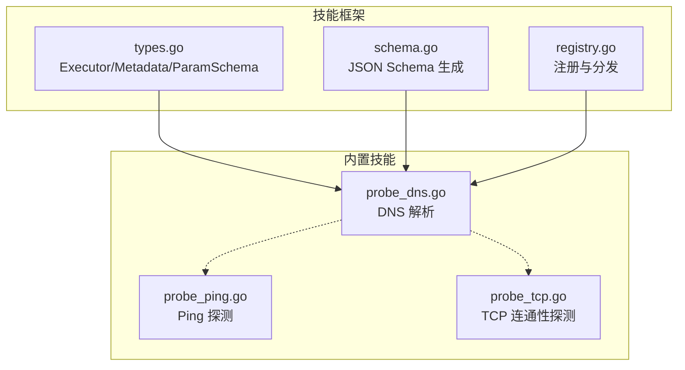
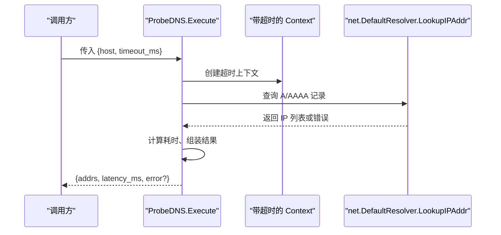
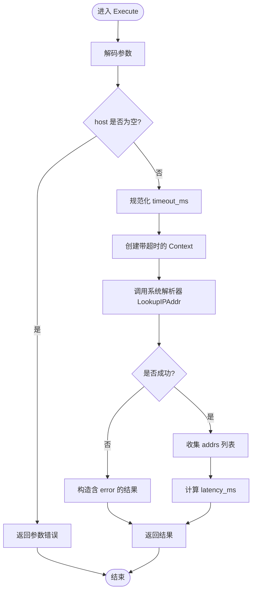
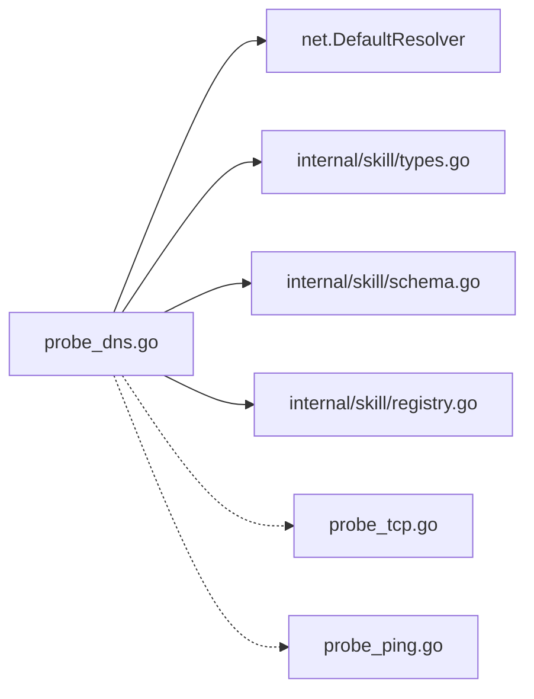

# DNS 解析技能

<cite>
**本文引用的文件**
- [probe_dns.go](file://internal/skill/builtin/probe_dns.go)
- [probe_dns_test.go](file://internal/skill/builtin/probe_dns_test.go)
- [types.go](file://internal/skill/types.go)
- [schema.go](file://internal/skill/schema.go)
- [registry.go](file://internal/skill/registry.go)
- [probe_tcp.go](file://internal/skill/builtin/probe_tcp.go)
- [probe_ping.go](file://internal/skill/builtin/probe_ping.go)
- [dns-resolution-failure.md](file://internal/manager/biz/knowledge/builtin_vault/diagnostics/dns-resolution-failure.md)
- [network-connectivity.md](file://internal/manager/biz/knowledge/builtin_vault/diagnostics/network-connectivity.md)
</cite>

## 目录
1. [简介](#简介)
2. [项目结构](#项目结构)
3. [核心组件](#核心组件)
4. [架构总览](#架构总览)
5. [详细组件分析](#详细组件分析)
6. [依赖关系分析](#依赖关系分析)
7. [性能与超时特性](#性能与超时特性)
8. [故障排查指南](#故障排查指南)
9. [结论](#结论)
10. [附录：参数与结果说明](#附录参数与结果说明)

## 简介
DNS 解析技能用于在目标主机上通过系统解析器进行域名到 IP 的查询，返回 A/AAAA 记录。该技能属于“安全”类能力，仅执行只读操作，适合在网络连通性诊断中快速定位域名解析问题（如解析失败、解析缓慢、A/AAAA 不一致等）。

## 项目结构
DNS 解析技能位于内置技能集合中，遵循统一的技能框架：
- 技能实现：internal/skill/builtin/probe_dns.go
- 单元测试：internal/skill/builtin/probe_dns_test.go
- 技能框架类型与元数据：internal/skill/types.go、internal/skill/schema.go、internal/skill/registry.go
- 相关网络探测技能（可配合使用）：TCP 连通性探测、Ping 探测

图表来源
- [types.go:99-125](file://internal/skill/types.go#L99-L125)
- [schema.go:22-95](file://internal/skill/schema.go#L22-L95)
- [registry.go:10-47](file://internal/skill/registry.go#L10-L47)
- [probe_dns.go:19-39](file://internal/skill/builtin/probe_dns.go#L19-L39)
- [probe_ping.go:20-43](file://internal/skill/builtin/probe_ping.go#L20-L43)
- [probe_tcp.go:19-39](file://internal/skill/builtin/probe_tcp.go#L19-L39)

章节来源
- [probe_dns.go:1-85](file://internal/skill/builtin/probe_dns.go#L1-L85)
- [types.go:1-241](file://internal/skill/types.go#L1-L241)
- [schema.go:1-96](file://internal/skill/schema.go#L1-L96)
- [registry.go:1-127](file://internal/skill/registry.go#L1-L127)

## 核心组件
- 技能元数据：定义键名、名称、描述、权限类别、分类、参数 schema 与结果预览。
- 参数模型：host（必填）、timeout_ms（可选，默认毫秒）。
- 执行逻辑：基于系统解析器发起 A/AAAA 查询，统计耗时并返回结果或错误信息。
- 注册机制：在 init 中向全局注册表注册，供调度器按 key 调用。

章节来源
- [probe_dns.go:19-39](file://internal/skill/builtin/probe_dns.go#L19-L39)
- [probe_dns.go:41-50](file://internal/skill/builtin/probe_dns.go#L41-L50)
- [probe_dns.go:52-84](file://internal/skill/builtin/probe_dns.go#L52-L84)
- [registry.go:10-47](file://internal/skill/registry.go#L10-L47)

## 架构总览
DNS 解析技能的调用链路如下：
- 上层通过统一技能接口调用 Execute，传入 JSON 参数。
- 技能内部校验参数、设置超时上下文、调用系统解析器。
- 将结果序列化为 JSON 返回，包含地址列表、耗时和可能的错误信息。

图表来源
- [probe_dns.go:52-84](file://internal/skill/builtin/probe_dns.go#L52-L84)

## 详细组件分析

### 参数与元数据
- host：字符串类型，必填。要解析的主机名。
- timeout_ms：整数类型，可选，默认 3000 毫秒。解析超时控制。
- 权限类别：safe（只读，无副作用）。
- 分类：network。
- 结果预览：{addrs, latency_ms, error?}。

章节来源
- [probe_dns.go:19-39](file://internal/skill/builtin/probe_dns.go#L19-L39)
- [types.go:63-86](file://internal/skill/types.go#L63-L86)
- [schema.go:22-95](file://internal/skill/schema.go#L22-L95)

### 执行流程与时序
- 参数解码与校验：若未提供 host 则直接报错；若 timeout_ms 非正数则回退为默认值。
- 超时控制：基于传入 context 派生带超时的子 context，避免慢解析阻塞调度器。
- 解析调用：调用系统解析器进行 A/AAAA 查询。
- 结果处理：成功时收集所有 IP 地址；失败时将错误信息写入 result.error。
- 耗时统计：记录从开始到结束的时间差，单位为毫秒。

图表来源
- [probe_dns.go:52-84](file://internal/skill/builtin/probe_dns.go#L52-L84)

### 错误处理
- 参数错误：缺少必填 host 或类型不匹配时，返回明确的参数错误。
- 解析错误：当系统解析器返回错误时，不会向上抛出 Go error，而是将错误文本放入 result.error，保持审计一致性。
- 超时处理：通过 context 超时终止长时间挂起的解析请求，并在结果中体现错误信息。

章节来源
- [probe_dns.go:55-84](file://internal/skill/builtin/probe_dns.go#L55-L84)
- [probe_dns_test.go:52-77](file://internal/skill/builtin/probe_dns_test.go#L52-L77)

### 测试覆盖
- 正常路径：对 localhost 解析应返回 IPv4 或 IPv6 地址。
- 参数校验：缺失 host 或类型错误时应报错。
- 不可解析域名：返回包含 error 的结果。

章节来源
- [probe_dns_test.go:12-77](file://internal/skill/builtin/probe_dns_test.go#L12-L77)

## 依赖关系分析
- 运行时依赖：标准库 net 解析器（系统级 DNS 配置），context 超时控制。
- 框架依赖：skill 元数据、参数 schema 生成、全局注册表。
- 协同技能：可与 Ping、TCP 连通性探测组合，形成完整的网络诊断流水线。

图表来源
- [probe_dns.go:1-85](file://internal/skill/builtin/probe_dns.go#L1-L85)
- [types.go:99-125](file://internal/skill/types.go#L99-L125)
- [schema.go:22-95](file://internal/skill/schema.go#L22-L95)
- [registry.go:10-47](file://internal/skill/registry.go#L10-L47)
- [probe_tcp.go:1-83](file://internal/skill/builtin/probe_tcp.go#L1-L83)
- [probe_ping.go:1-125](file://internal/skill/builtin/probe_ping.go#L1-L125)

章节来源
- [probe_dns.go:1-85](file://internal/skill/builtin/probe_dns.go#L1-L85)
- [types.go:1-241](file://internal/skill/types.go#L1-L241)
- [schema.go:1-96](file://internal/skill/schema.go#L1-L96)
- [registry.go:1-127](file://internal/skill/registry.go#L1-L127)

## 性能与超时特性
- 超时机制：通过 context.WithTimeout 限制解析时间，防止慢解析占用调度器 goroutine。
- 延迟统计：每次执行都会记录 latency_ms，便于评估解析性能。
- 资源占用：仅进行只读查询，无持久连接，开销低。
- 并发安全：注册阶段单线程，运行期并发读取注册表；Execute 本身无共享状态。

章节来源
- [probe_dns.go:52-84](file://internal/skill/builtin/probe_dns.go#L52-L84)
- [registry.go:10-47](file://internal/skill/registry.go#L10-L47)

## 故障排查指南
结合知识库中的网络诊断方法，建议按以下步骤定位 DNS 问题：

- 第一步：确认应用视角的解析行为
  - 使用系统工具验证解析是否与 glibc/nsswitch 一致。
  - 对比不同工具的解析结果与耗时，识别缓存或上游差异。

- 第二步：检查解析器配置
  - 查看 resolv.conf 的 nameserver、search、ndots 等选项。
  - 若使用 systemd-resolved，检查其状态与缓存统计。

- 第三步：逐个测试上游解析服务器
  - 分别对配置的 nameserver 发起查询，定位响应慢或失败的节点。

- 第四步：关注 UDP/53 与 conntrack
  - 在高负载场景下，conntrack 表满可能导致 DNS 丢包与 SERVFAIL。
  - 观察 UDP 流量与连接跟踪计数，必要时调整系统参数。

- 第五步：结合其他技能进行分层排查
  - 使用 Ping 探测基础连通性。
  - 使用 TCP 连通性探测验证端口可达性与握手延迟。

章节来源
- [dns-resolution-failure.md:1-84](file://internal/manager/biz/knowledge/builtin_vault/diagnostics/dns-resolution-failure.md#L1-L84)
- [network-connectivity.md:1-74](file://internal/manager/biz/knowledge/builtin_vault/diagnostics/network-connectivity.md#L1-L74)
- [probe_ping.go:20-43](file://internal/skill/builtin/probe_ping.go#L20-L43)
- [probe_tcp.go:19-39](file://internal/skill/builtin/probe_tcp.go#L19-L39)

## 结论
DNS 解析技能以最小侵入的方式暴露系统解析能力，提供稳定的参数校验、超时控制与结果序列化，适用于网络连通性诊断的早期环节。配合 Ping 与 TCP 连通性探测，可快速定位解析层、传输层与防火墙/NAT 等问题。建议在故障排查中优先使用该技能确认解析行为，再逐步深入至系统配置与网络栈层面。

## 附录：参数与结果说明

### 输入参数
- host：字符串，必填。要解析的主机名。
- timeout_ms：整数，可选，默认 3000 毫秒。解析超时。

章节来源
- [probe_dns.go:27-36](file://internal/skill/builtin/probe_dns.go#L27-L36)
- [types.go:63-86](file://internal/skill/types.go#L63-L86)

### 输出结果
- addrs：字符串数组，包含解析到的 IPv4/IPv6 地址。
- latency_ms：整数，解析耗时（毫秒）。
- error：字符串，解析失败时的错误信息（可选字段）。

章节来源
- [probe_dns.go:46-50](file://internal/skill/builtin/probe_dns.go#L46-L50)
- [probe_dns.go:73-83](file://internal/skill/builtin/probe_dns.go#L73-L83)

### 使用示例（概念性）
- 基本解析：指定 host，使用默认超时，获取 A/AAAA 地址列表与耗时。
- 快速失败：设置较短的 timeout_ms，用于快速判断解析是否可用。
- 组合排查：先使用 DNS 解析技能确认解析结果，再用 Ping/TCP 技能验证连通性。

[本节为概念性说明，不直接分析具体代码文件]