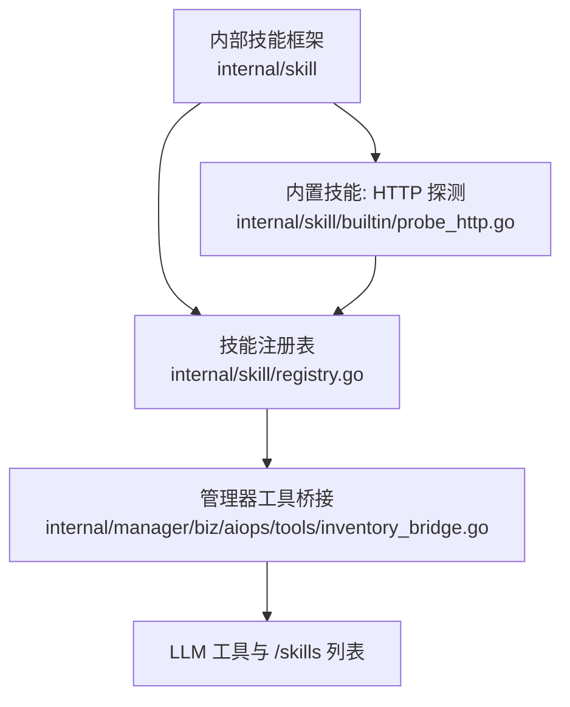
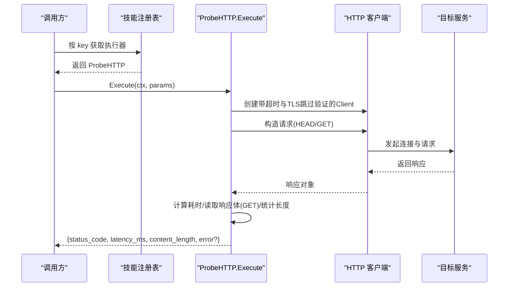
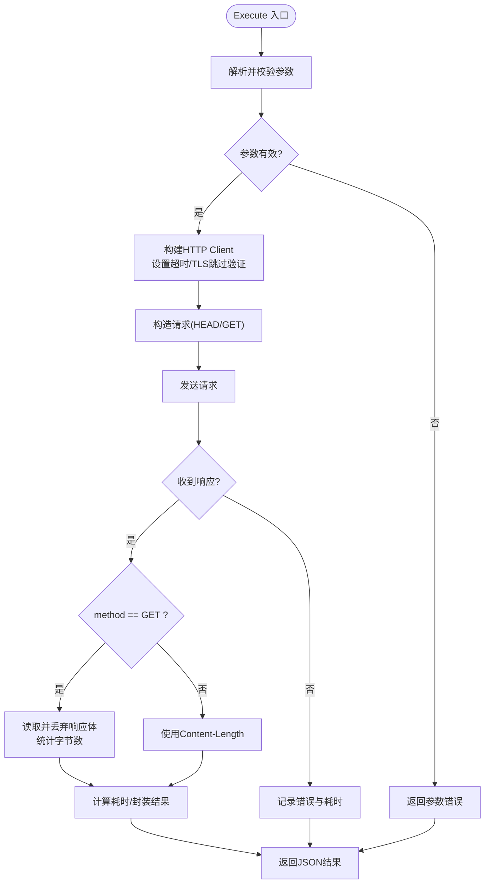
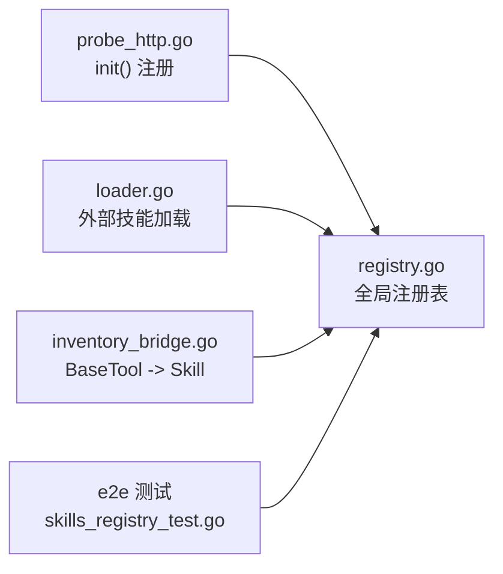

# HTTP 探测技能

<cite>
**本文引用的文件**
- [internal/skill/builtin/probe_http.go](file://internal/skill/builtin/probe_http.go)
- [internal/skill/builtin/probe_http_test.go](file://internal/skill/builtin/probe_http_test.go)
- [internal/skill/types.go](file://internal/skill/types.go)
- [internal/skill/registry.go](file://internal/skill/registry.go)
- [internal/skill/loader.go](file://internal/skill/loader.go)
- [internal/manager/biz/aiops/tools/inventory_bridge.go](file://internal/manager/biz/aiops/tools/inventory_bridge.go)
- [tests/e2e/skills_registry_test.go](file://tests/e2e/skills_registry_test.go)
</cite>

## 目录
1. [简介](#简介)
2. [项目结构](#项目结构)
3. [核心组件](#核心组件)
4. [架构总览](#架构总览)
5. [详细组件分析](#详细组件分析)
6. [依赖关系分析](#依赖关系分析)
7. [性能考量](#性能考量)
8. [故障排查指南](#故障排查指南)
9. [结论](#结论)
10. [附录：使用示例与最佳实践](#附录使用示例与最佳实践)

## 简介
本技术文档围绕“HTTP 探测技能”展开，系统性说明其功能、参数配置、执行流程、错误处理、重试策略与性能优化建议。该技能用于从边缘侧对目标 URL 发起只读 HTTP 请求（HEAD/GET），返回状态码、响应时间与内容长度等指标，适用于检测 Web 服务可用性、API 健康检查与响应性能评估。

## 项目结构
HTTP 探测技能属于内置技能集合，位于 internal/skill/builtin 目录下，通过全局技能注册表进行发现与调度；在管理器侧通过工具桥接暴露给 LLM 工具与 /skills 列表。

图表来源
- [internal/skill/builtin/probe_http.go:15-47](file://internal/skill/builtin/probe_http.go#L15-L47)
- [internal/skill/registry.go:10-47](file://internal/skill/registry.go#L10-L47)
- [internal/manager/biz/aiops/tools/inventory_bridge.go:1-34](file://internal/manager/biz/aiops/tools/inventory_bridge.go#L1-L34)

章节来源
- [internal/skill/builtin/probe_http.go:15-47](file://internal/skill/builtin/probe_http.go#L15-L47)
- [internal/skill/registry.go:10-47](file://internal/skill/registry.go#L10-L47)
- [internal/manager/biz/aiops/tools/inventory_bridge.go:1-34](file://internal/manager/biz/aiops/tools/inventory_bridge.go#L1-L34)

## 核心组件
- 技能元数据与参数定义：描述技能键名、名称、分类、权限等级、输入参数与结果预览。
- 执行器：实现 Execute 方法，完成 HTTP 连接建立、请求发送、响应接收、耗时测量与结果封装。
- 注册表：进程级技能目录，提供注册、查询、枚举能力。
- 加载器：扫描外部技能包并注册为子进程技能（与 HTTP 探测同属技能体系）。
- 管理器桥接：将管理器侧 BaseTool 统一注册为技能，便于 /skills 页面与 LLM 工具发现。

章节来源
- [internal/skill/types.go:99-125](file://internal/skill/types.go#L99-L125)
- [internal/skill/builtin/probe_http.go:23-60](file://internal/skill/builtin/probe_http.go#L23-L60)
- [internal/skill/registry.go:10-47](file://internal/skill/registry.go#L10-L47)
- [internal/skill/loader.go:13-53](file://internal/skill/loader.go#L13-L53)
- [internal/manager/biz/aiops/tools/inventory_bridge.go:1-34](file://internal/manager/biz/aiops/tools/inventory_bridge.go#L1-L34)

## 架构总览
HTTP 探测技能的调用路径如下：
- 调用方（AI 工具或 /skills 页面）通过技能键 host_probe_http 查找执行器。
- 框架校验参数后，调用 Execute 执行 HTTP 探测。
- 执行器创建带超时的 http.Client，禁用 TLS 证书校验以适配内网自签证书场景。
- 根据 method 选择 HEAD 或 GET；GET 会读取并丢弃响应体以统计实际字节数。
- 记录耗时、状态码与内容长度，返回 JSON 结果。

图表来源
- [internal/skill/builtin/probe_http.go:62-119](file://internal/skill/builtin/probe_http.go#L62-L119)
- [internal/skill/registry.go:31-40](file://internal/skill/registry.go#L31-L40)

## 详细组件分析

### 技能元数据与参数
- 键名：host_probe_http
- 名称：HTTP 探测
- 分类：network
- 权限等级：safe（只读，无副作用）
- 参数：
  - url：string，必填，完整 URL
  - method：enum，可选，默认 HEAD，允许值 GET/HEAD
  - timeout_ms：int，可选，默认 5000（毫秒）
- 结果预览：包含 status_code、latency_ms、content_length、error

章节来源
- [internal/skill/builtin/probe_http.go:23-47](file://internal/skill/builtin/probe_http.go#L23-L47)
- [internal/skill/types.go:99-125](file://internal/skill/types.go#L99-L125)

### 执行流程与数据处理
- 参数解析与校验：
  - 解析 JSON 参数，url 必填
  - method 仅允许 GET/HEAD，否则报错
  - timeout_ms 非正数时回退到默认值
- 网络层：
  - 构建 http.Client，设置超时
  - Transport 中 TLS 证书校验关闭，适配内网自签证书
- 请求与响应：
  - 使用 context.Context 控制取消
  - HEAD：直接使用响应头 Content-Length
  - GET：读取并丢弃响应体，统计实际字节数
- 指标计算：
  - 记录开始时间，计算延迟毫秒
  - 封装状态码、延迟、内容长度与可选错误信息

图表来源
- [internal/skill/builtin/probe_http.go:62-119](file://internal/skill/builtin/probe_http.go#L62-L119)

章节来源
- [internal/skill/builtin/probe_http.go:62-119](file://internal/skill/builtin/probe_http.go#L62-L119)

### 错误处理与边界情况
- 参数缺失或非法：
  - url 为空：返回错误
  - method 不在允许集合：返回错误
- 网络异常：
  - 无法连接或超时：记录错误字符串与耗时
- GET 响应体：
  - 若服务器未设置 Content-Length，仍通过实际读取统计字节数
- 安全考虑：
  - 仅支持只读方法（HEAD/GET），避免写入操作
  - 关闭 TLS 验证以兼容内网自签证书，生产环境需结合网络策略与访问控制

章节来源
- [internal/skill/builtin/probe_http.go:65-119](file://internal/skill/builtin/probe_http.go#L65-L119)
- [internal/skill/builtin/probe_http_test.go:77-104](file://internal/skill/builtin/probe_http_test.go#L77-L104)

### 测试覆盖
- 元数据校验：确保权限等级为 safe
- 正常路径：
  - HEAD：状态码正确
  - GET：状态码与内容长度正确
- 异常路径：
  - 缺少 url
  - 非法 method
  - 不可达主机：返回错误字段

章节来源
- [internal/skill/builtin/probe_http_test.go:13-21](file://internal/skill/builtin/probe_http_test.go#L13-L21)
- [internal/skill/builtin/probe_http_test.go:23-75](file://internal/skill/builtin/probe_http_test.go#L23-L75)
- [internal/skill/builtin/probe_http_test.go:77-104](file://internal/skill/builtin/probe_http_test.go#L77-L104)

## 依赖关系分析
- 技能注册与发现：
  - 内置技能在 init() 中注册到全局注册表
  - 管理器通过工具桥接将 BaseTool 注册为技能，形成统一清单
- 外部技能加载：
  - 通过 loader 扫描 skill.json，构建子进程技能并注册
- 端到端验证：
  - e2e 测试断言 /v1/skills 列表包含 host_probe_http 等关键技能

图表来源
- [internal/skill/builtin/probe_http.go:15-15](file://internal/skill/builtin/probe_http.go#L15-L15)
- [internal/skill/registry.go:10-47](file://internal/skill/registry.go#L10-L47)
- [internal/skill/loader.go:69-110](file://internal/skill/loader.go#L69-L110)
- [internal/manager/biz/aiops/tools/inventory_bridge.go:88-158](file://internal/manager/biz/aiops/tools/inventory_bridge.go#L88-L158)
- [tests/e2e/skills_registry_test.go:80-116](file://tests/e2e/skills_registry_test.go#L80-L116)

章节来源
- [internal/skill/builtin/probe_http.go:15-15](file://internal/skill/builtin/probe_http.go#L15-L15)
- [internal/skill/registry.go:10-47](file://internal/skill/registry.go#L10-L47)
- [internal/skill/loader.go:69-110](file://internal/skill/loader.go#L69-L110)
- [internal/manager/biz/aiops/tools/inventory_bridge.go:88-158](file://internal/manager/biz/aiops/tools/inventory_bridge.go#L88-L158)
- [tests/e2e/skills_registry_test.go:80-116](file://tests/e2e/skills_registry_test.go#L80-L116)

## 性能考量
- 超时配置：
  - 合理设置 timeout_ms，避免长尾阻塞；默认 5000ms
- 连接复用：
  - 当前实现每次执行新建 http.Client；在高并发场景可考虑复用 Client 以提升性能
- 响应体读取：
  - GET 模式会读取并丢弃响应体，增加带宽与 CPU 开销；优先使用 HEAD 进行轻量探测
- TLS 验证：
  - 关闭证书校验减少握手失败概率，但需配合网络隔离与白名单策略
- 并发与限流：
  - 建议在调用层限制并发度，避免对目标服务造成压力

[本节为通用性能建议，不直接分析具体文件]

## 故障排查指南
- 常见错误与定位：
  - 参数错误：检查 url 是否填写、method 是否为 GET/HEAD、timeout_ms 是否为正数
  - 网络错误：确认目标可达性、DNS 解析、防火墙策略
  - 超时：增大 timeout_ms 或检查服务端响应速度
- 日志与调试：
  - 查看返回的 error 字段，定位具体错误原因
  - 使用 httptest 或服务端日志辅助验证
- 回归测试：
  - 参考单元测试用例，复现问题并验证修复

章节来源
- [internal/skill/builtin/probe_http_test.go:77-104](file://internal/skill/builtin/probe_http_test.go#L77-L104)
- [internal/skill/builtin/probe_http.go:65-119](file://internal/skill/builtin/probe_http.go#L65-L119)

## 结论
HTTP 探测技能提供了轻量、安全的只读 HTTP 探测能力，适用于边缘侧对 Web 服务与 API 的健康检查与性能评估。通过明确的参数配置、严格的错误处理与合理的超时策略，能够在复杂网络环境中稳定工作。建议在生产环境中结合网络策略与调用层限流，以获得更好的可用性与性能表现。

[本节为总结性内容，不直接分析具体文件]

## 附录：使用示例与最佳实践
- 检测 Web 服务可用性：
  - 使用 HEAD 方法探测 /health 或 /status 接口，关注 status_code 与 latency_ms
- API 接口健康检查：
  - 针对特定业务接口进行 GET 探测，结合 content_length 判断响应完整性
- 响应性能评估：
  - 多次探测取平均延迟，识别慢接口与抖动
- 参数配置建议：
  - url：填写完整且可路由的目标地址
  - method：优先 HEAD，必要时使用 GET
  - timeout_ms：根据网络与服务特性调整，避免过短导致误报
- 错误分类与处理：
  - 参数错误：修正参数后重试
  - 网络错误：检查连通性与 DNS
  - 超时：调大超时或优化服务端响应
- 重试机制建议：
  - 在调用层实现指数退避重试，避免瞬时抖动导致的误判
- 性能优化建议：
  - 复用 http.Client、限制并发、优先 HEAD 探测

[本节为概念性指导，不直接分析具体文件]