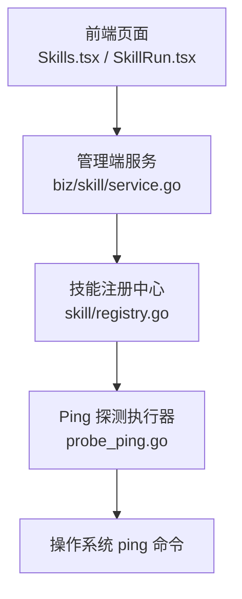
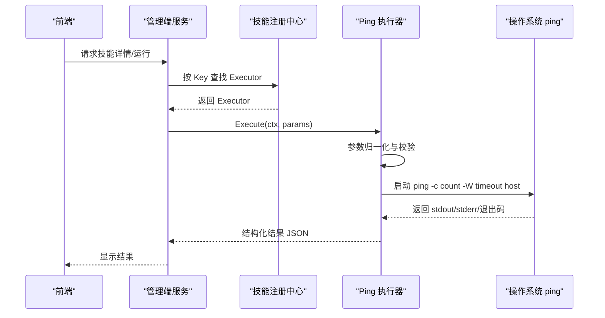
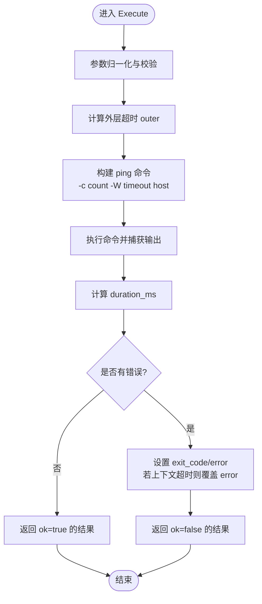
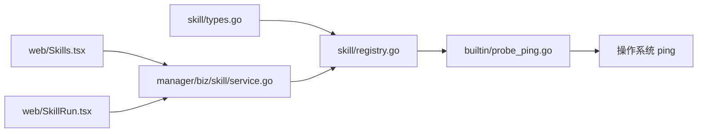

# Ping 探测技能

<cite>
**本文引用的文件**
- [internal/skill/builtin/probe_ping.go](file://internal/skill/builtin/probe_ping.go)
- [internal/skill/builtin/probe_ping_test.go](file://internal/skill/builtin/probe_ping_test.go)
- [internal/skill/types.go](file://internal/skill/types.go)
- [internal/skill/registry.go](file://internal/skill/registry.go)
- [internal/manager/biz/skill/service.go](file://internal/manager/biz/skill/service.go)
- [web/src/pages/Skills.tsx](file://web/src/pages/Skills.tsx)
- [web/src/pages/SkillRun.tsx](file://web/src/pages/SkillRun.tsx)
</cite>

## 目录
1. [简介](#简介)
2. [项目结构](#项目结构)
3. [核心组件](#核心组件)
4. [架构总览](#架构总览)
5. [详细组件分析](#详细组件分析)
6. [依赖关系分析](#依赖关系分析)
7. [性能与限制](#性能与限制)
8. [使用示例](#使用示例)
9. [结果分析与故障诊断](#结果分析与故障诊断)
10. [结论](#结论)

## 简介
本技术文档围绕“Ping 探测”技能，系统性说明其实现原理、参数配置、网络要求与平台兼容性，并提供使用示例与结果分析方法。该技能通过调用宿主系统的 ping 二进制程序，向目标主机发送少量 ICMP Echo Request 包，收集退出码、耗时和原始输出，用于快速评估网络连通性与延迟情况。

## 项目结构
Ping 探测技能属于内置网络探测能力之一，位于 skill 框架的内置探针集合中。整体结构如下：
- 技能注册与元数据：在 init() 中完成注册，提供稳定的 Key、名称、描述、权限类别、分类与参数 Schema。
- 执行器：实现 Execute 方法，负责参数校验、超时控制、调用系统命令、捕获输出并返回结构化结果。
- 管理端与服务层：将技能元数据暴露为 API，供前端渲染表单与调用。
- 前端：展示技能参数表、运行入口与结果预览。

图表来源
- [internal/skill/builtin/probe_ping.go:20-43](file://internal/skill/builtin/probe_ping.go#L20-L43)
- [internal/skill/registry.go:10-47](file://internal/skill/registry.go#L10-L47)
- [internal/manager/biz/skill/service.go:91-116](file://internal/manager/biz/skill/service.go#L91-L116)
- [web/src/pages/Skills.tsx:579-622](file://web/src/pages/Skills.tsx#L579-L622)
- [web/src/pages/SkillRun.tsx:44-89](file://web/src/pages/SkillRun.tsx#L44-L89)

章节来源
- [internal/skill/builtin/probe_ping.go:20-43](file://internal/skill/builtin/probe_ping.go#L20-L43)
- [internal/skill/registry.go:10-47](file://internal/skill/registry.go#L10-L47)
- [internal/manager/biz/skill/service.go:91-116](file://internal/manager/biz/skill/service.go#L91-L116)
- [web/src/pages/Skills.tsx:579-622](file://web/src/pages/Skills.tsx#L579-L622)
- [web/src/pages/SkillRun.tsx:44-89](file://web/src/pages/SkillRun.tsx#L44-L89)

## 核心组件
- 技能元数据（Metadata）
  - Key: host_probe_ping
  - Name: Ping 探测
  - Description: 对目标 host 发起短时 ICMP ping，返回退出码、耗时和原始输出
  - Class: safe（只读、无副作用）
  - Category: network
  - Params:
    - host: string，必填，目标主机名或 IP
    - count: int，默认 4，最大 10，发送包数
    - timeout_ms: int，默认 3000，单包等待超时（毫秒）
  - ResultPreview: {ok, exit_code, duration_ms, stdout, stderr}

- 参数归一化与校验
  - 缺失 host 报错
  - count 范围钳制：<=0 时回退到 4；>10 时上限为 10
  - timeout_ms 范围钳制：<=0 时回退到 3000；>10000 时上限为 10000

- 执行流程
  - 计算外层上下文超时：outer = (count * timeout_seconds + 2) 秒，避免长时间阻塞
  - 调用系统 ping 命令，参数包括 -c count、-W timeout_seconds、host
  - 捕获 stdout/stderr，记录开始时间，执行完成后计算 duration_ms
  - 根据错误类型设置 OK、ExitCode、Error；若因上下文超时则覆盖 Error 信息

- 结果结构
  - ok: 布尔，表示是否成功
  - exit_code: 整数，进程退出码
  - duration_ms: 整数，总耗时（毫秒）
  - stdout: 字符串，ping 标准输出
  - stderr: 字符串，ping 标准错误
  - error: 字符串，可选，错误信息

章节来源
- [internal/skill/builtin/probe_ping.go:20-43](file://internal/skill/builtin/probe_ping.go#L20-L43)
- [internal/skill/builtin/probe_ping.go:45-58](file://internal/skill/builtin/probe_ping.go#L45-L58)
- [internal/skill/builtin/probe_ping.go:60-99](file://internal/skill/builtin/probe_ping.go#L60-L99)
- [internal/skill/builtin/probe_ping.go:101-124](file://internal/skill/builtin/probe_ping.go#L101-L124)

## 架构总览
Ping 探测技能遵循统一的 skill 框架：
- 注册阶段：init() 调用 Register，将 ProbePing 加入全局注册表，同时验证 Metadata 合法性。
- 管理端：读取所有已注册技能的元数据，生成 API 与 UI 表单。
- 运行时：Manager 或 Edge 通过 execute_skill RPC 分发到对应 Executor 的 Execute 方法。
- 执行器：ProbePing.Execute 负责参数解析、超时控制、命令执行与结果封装。

图表来源
- [internal/skill/registry.go:31-73](file://internal/skill/registry.go#L31-L73)
- [internal/skill/builtin/probe_ping.go:60-99](file://internal/skill/builtin/probe_ping.go#L60-L99)
- [internal/manager/biz/skill/service.go:91-116](file://internal/manager/biz/skill/service.go#L91-L116)

## 详细组件分析

### Ping 探测执行器（ProbePing）
- 安全边界
  - 仅调用系统 ping 二进制，不经过 shell，避免注入风险
  - 限制发包数量与超时，防止资源滥用
- 超时策略
  - 外层上下文超时 outer = count * timeout_seconds + 2 秒，确保即使单个包超时也能整体结束
  - 单包超时由 -W 指定，单位为秒
- 结果语义
  - ok 反映命令是否成功返回
  - exit_code 来自进程退出码，便于区分不同失败原因
  - duration_ms 为端到端耗时，可用于粗略评估链路质量
  - stdout/stderr 保留原始输出，便于进一步分析

图表来源
- [internal/skill/builtin/probe_ping.go:60-99](file://internal/skill/builtin/probe_ping.go#L60-L99)
- [internal/skill/builtin/probe_ping.go:101-124](file://internal/skill/builtin/probe_ping.go#L101-L124)

章节来源
- [internal/skill/builtin/probe_ping.go:60-99](file://internal/skill/builtin/probe_ping.go#L60-L99)
- [internal/skill/builtin/probe_ping.go:101-124](file://internal/skill/builtin/probe_ping.go#L101-L124)

### 技能框架与元数据
- 权限类别
  - ClassSafe：只读、无副作用，适合自动化直接调用
- 作用域
  - ScopeHost：在目标边缘节点执行，需要 edge_id
- 参数 Schema
  - 支持 string/int/float/bool/duration/enum/array 等类型
  - 自动生成 LLM 工具定义与 UI 表单
- 注册与发现
  - 全局注册表维护所有已注册技能，支持按 Key 查询与按类别过滤

章节来源
- [internal/skill/types.go:1-27](file://internal/skill/types.go#L1-L27)
- [internal/skill/types.go:63-125](file://internal/skill/types.go#L63-L125)
- [internal/skill/types.go:127-175](file://internal/skill/types.go#L127-L175)
- [internal/skill/registry.go:10-47](file://internal/skill/registry.go#L10-L47)

### 管理与前端集成
- 管理端服务
  - 导出 SkillSummary，包含 key/name/description/class/scope/category/params/result_preview 等字段
- 前端页面
  - Skills.tsx：渲染参数表格，展示类型、是否必填、默认值与说明
  - SkillRun.tsx：获取技能详情与边缘列表，处理参数变更与执行

章节来源
- [internal/manager/biz/skill/service.go:91-116](file://internal/manager/biz/skill/service.go#L91-L116)
- [web/src/pages/Skills.tsx:579-622](file://web/src/pages/Skills.tsx#L579-L622)
- [web/src/pages/SkillRun.tsx:44-89](file://web/src/pages/SkillRun.tsx#L44-L89)

## 依赖关系分析
- 内部依赖
  - skill 框架：types.go 定义元数据与执行器接口；registry.go 提供注册与查询
  - 管理端服务：biz/skill/service.go 暴露技能摘要 DTO
  - 前端：Skills.tsx 与 SkillRun.tsx 消费技能元数据与运行能力
- 外部依赖
  - 操作系统 ping 命令：实际网络探测由宿主系统提供
  - Go 标准库：context、os/exec、time、bytes、encoding/json

图表来源
- [internal/skill/types.go:190-203](file://internal/skill/types.go#L190-L203)
- [internal/skill/registry.go:31-73](file://internal/skill/registry.go#L31-L73)
- [internal/skill/builtin/probe_ping.go:60-99](file://internal/skill/builtin/probe_ping.go#L60-L99)
- [internal/manager/biz/skill/service.go:91-116](file://internal/manager/biz/skill/service.go#L91-L116)
- [web/src/pages/Skills.tsx:579-622](file://web/src/pages/Skills.tsx#L579-L622)
- [web/src/pages/SkillRun.tsx:44-89](file://web/src/pages/SkillRun.tsx#L44-L89)

章节来源
- [internal/skill/types.go:190-203](file://internal/skill/types.go#L190-L203)
- [internal/skill/registry.go:31-73](file://internal/skill/registry.go#L31-L73)
- [internal/skill/builtin/probe_ping.go:60-99](file://internal/skill/builtin/probe_ping.go#L60-L99)
- [internal/manager/biz/skill/service.go:91-116](file://internal/manager/biz/skill/service.go#L91-L116)
- [web/src/pages/Skills.tsx:579-622](file://web/src/pages/Skills.tsx#L579-L622)
- [web/src/pages/SkillRun.tsx:44-89](file://web/src/pages/SkillRun.tsx#L44-L89)

## 性能与限制
- 发包数量限制
  - count 默认 4，最大 10，避免过度探测造成网络拥塞或被限速
- 超时限制
  - timeout_ms 默认 3000，最大 10000；外层上下文超时自动保护，防止长时间挂起
- 延迟测量
  - duration_ms 为端到端耗时，包含 DNS 解析、路由、ICMP 往返与系统调度开销
  - 如需更细粒度延迟，可结合 TCP/DNS 探测技能进行分层诊断
- 平台兼容性
  - 依赖宿主系统存在 ping 命令；Linux/macOS 通常可用
  - Windows 下 ping 行为可能略有差异（如参数或输出格式），需结合实际环境验证
- 防火墙与安全策略
  - ICMP 可能被中间设备或主机防火墙拦截；若被丢弃，表现为超时或丢包
  - 云环境或容器环境中，网络命名空间或安全组策略可能限制出站 ICMP

[本节为通用指导，不直接分析具体文件]

## 使用示例
以下示例以 JSON 参数形式调用 Ping 探测技能，展示常见场景：

- 基本连通性测试
  - 参数：{ "host": "8.8.8.8", "count": 4, "timeout_ms": 3000 }
  - 预期：ok=true，duration_ms 较小，stdout 包含统计信息

- 高丢包环境下的稳健评估
  - 参数：{ "host": "example.com", "count": 10, "timeout_ms": 5000 }
  - 预期：通过多次发包提升统计可靠性；关注丢包率与抖动

- 快速失败与重试
  - 参数：{ "host": "unreachable.example", "count": 4, "timeout_ms": 1000 }
  - 预期：ok=false，exit_code 非零，error 可能包含上下文超时或连接失败

- 结合 DNS 与 TCP 探测
  - 先调用 DNS 解析技能确认域名解析
  - 再调用 TCP 探测技能检查端口可达性
  - 最后调用 Ping 探测评估 ICMP 路径质量

[本节为概念性示例，不直接引用代码片段]

## 结果分析与故障诊断
- 结果字段解读
  - ok：true 表示 ping 进程成功返回；false 表示失败或异常
  - exit_code：参考系统 ping 的退出码含义，辅助定位问题
  - duration_ms：端到端耗时，可用于粗略评估链路质量
  - stdout：包含每次包的往返时间与最终统计，便于人工分析
  - stderr：记录错误信息，如权限不足、参数非法等
  - error：当发生错误时填充；若因上下文超时，会覆盖为超时错误

- 常见问题与排查
  - 超时频繁
    - 检查 timeout_ms 是否过小；适当增大
    - 检查网络路径是否存在丢包或限速
    - 查看 firewall/nftables/iptables 规则是否丢弃 ICMP
  - 无法解析主机名
    - 使用 DNS 探测技能验证解析是否正常
    - 检查本地 resolver 配置与上游 DNS 可用性
  - 权限问题
    - 某些环境可能需要 root 权限才能发送 ICMP；检查运行用户权限
  - 云平台限制
    - 安全组或网络 ACL 可能阻止 ICMP；联系网络管理员调整策略

- 建议的诊断流程
  - 第一步：DNS 解析（确认域名到 IP）
  - 第二步：TCP 连通性（确认端口可达）
  - 第三步：Ping 探测（评估 ICMP 路径质量）
  - 第四步：结合日志与抓包（必要时使用 pcap 技能）

章节来源
- [internal/skill/builtin/probe_ping.go:51-58](file://internal/skill/builtin/probe_ping.go#L51-L58)
- [internal/skill/builtin/probe_ping.go:60-99](file://internal/skill/builtin/probe_ping.go#L60-L99)
- [internal/skill/builtin/probe_ping_test.go:24-40](file://internal/skill/builtin/probe_ping_test.go#L24-L40)

## 结论
Ping 探测技能通过调用系统 ping 命令，提供了轻量、安全的网络连通性与延迟评估能力。其参数归一化与超时保护机制确保了执行的稳定性与可控性。结合 DNS 与 TCP 探测技能，可以形成完整的网络诊断闭环。在实际使用中，应充分考虑防火墙策略、平台差异与环境限制，合理配置参数以获得可靠的诊断结果。

[本节为总结性内容，不直接分析具体文件]