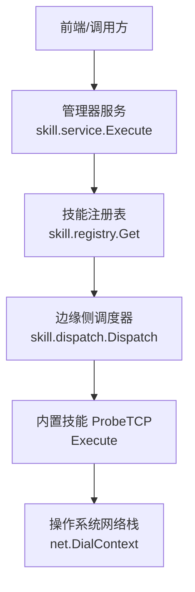
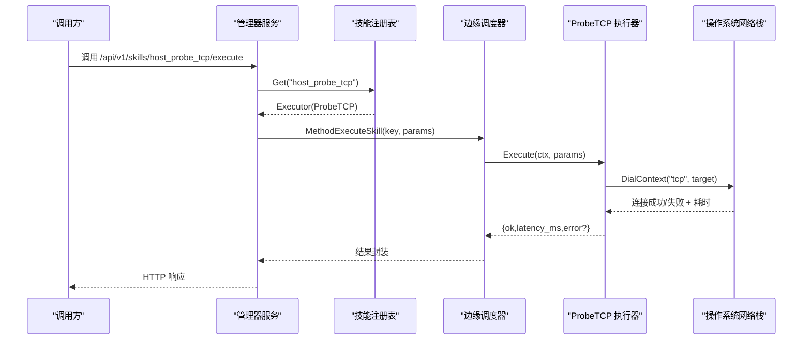
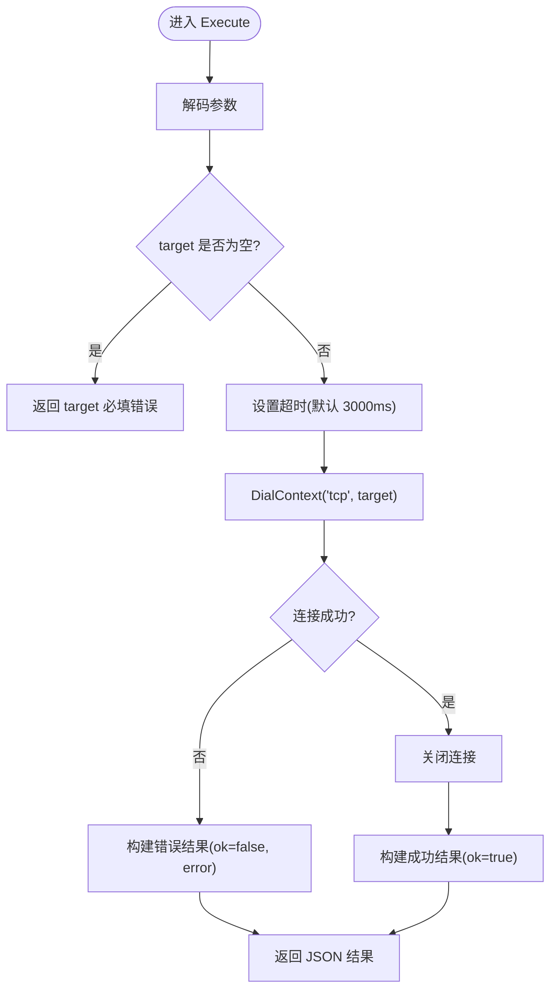
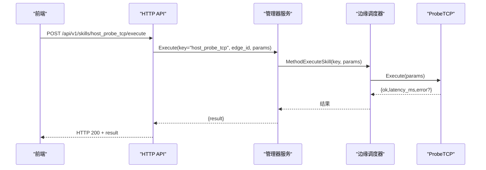
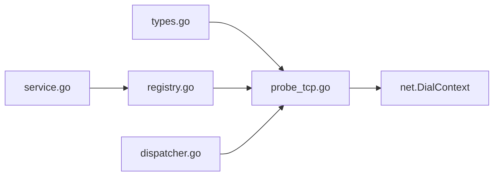

# TCP 连接探测技能

<cite>
**本文引用的文件**
- [internal/skill/builtin/probe_tcp.go](file://internal/skill/builtin/probe_tcp.go)
- [internal/skill/builtin/probe_tcp_test.go](file://internal/skill/builtin/probe_tcp_test.go)
- [internal/skill/types.go](file://internal/skill/types.go)
- [internal/skill/registry.go](file://internal/skill/registry.go)
- [internal/edgeagent/skill/dispatcher.go](file://internal/edgeagent/skill/dispatcher.go)
- [internal/manager/biz/skill/service.go](file://internal/manager/biz/skill/service.go)
- [web/src/api/skills.test.ts](file://web/src/api/skills.test.ts)
</cite>

## 目录
1. [简介](#简介)
2. [项目结构](#项目结构)
3. [核心组件](#核心组件)
4. [架构总览](#架构总览)
5. [详细组件分析](#详细组件分析)
6. [依赖关系分析](#依赖关系分析)
7. [性能考量](#性能考量)
8. [故障排查指南](#故障排查指南)
9. [结论](#结论)
10. [附录](#附录)

## 简介
本技术文档围绕“TCP 连接探测”技能，系统阐述其在 ongrid 中的实现与使用。该技能用于对目标 host:port 发起一次 TCP 拨号，返回连通状态与延迟，适用于端口连通性检查、连接建立过程验证与服务状态检测等场景。其设计遵循安全类（safe）能力模型：仅发起单次出站连接，立即关闭，不发送任何业务载荷，保证最小副作用。

## 项目结构
TCP 连接探测技能位于内置技能包中，通过技能框架注册并暴露为可被管理器调度、边缘端执行的统一能力。关键路径如下：
- 技能定义与执行逻辑：internal/skill/builtin/probe_tcp.go
- 单元测试：internal/skill/builtin/probe_tcp_test.go
- 技能框架类型与元数据：internal/skill/types.go
- 技能注册表：internal/skill/registry.go
- 边缘侧调度入口：internal/edgeagent/skill/dispatcher.go
- 管理器侧执行服务：internal/manager/biz/skill/service.go
- 前端调用示例（API 路由与请求体）：web/src/api/skills.test.ts

**图表来源**
- [internal/manager/biz/skill/service.go:187-223](file://internal/manager/biz/skill/service.go#L187-L223)
- [internal/skill/registry.go:31-47](file://internal/skill/registry.go#L31-L47)
- [internal/edgeagent/skill/dispatcher.go:16-44](file://internal/edgeagent/skill/dispatcher.go#L16-L44)
- [internal/skill/builtin/probe_tcp.go:13-82](file://internal/skill/builtin/probe_tcp.go#L13-L82)

**章节来源**
- [internal/skill/builtin/probe_tcp.go:1-82](file://internal/skill/builtin/probe_tcp.go#L1-L82)
- [internal/skill/types.go:1-241](file://internal/skill/types.go#L1-L241)
- [internal/skill/registry.go:1-127](file://internal/skill/registry.go#L1-L127)
- [internal/edgeagent/skill/dispatcher.go:1-44](file://internal/edgeagent/skill/dispatcher.go#L1-L44)
- [internal/manager/biz/skill/service.go:187-223](file://internal/manager/biz/skill/service.go#L187-L223)
- [web/src/api/skills.test.ts:8-24](file://web/src/api/skills.test.ts#L8-L24)

## 核心组件
- 技能元数据与参数
  - 键名：host_probe_tcp
  - 名称：TCP 连通性探测
  - 类别：network
  - 权限类：safe（只读、无副作用）
  - 参数：
    - target（string，必填）：目标地址，格式 host:port
    - timeout_ms（int，默认 3000）：拨号超时毫秒数
  - 结果预览：{ok, latency_ms, error?}
- 执行逻辑
  - 解析参数并校验 target 非空
  - 若未设置或非法超时，回退到默认值
  - 使用 net.DialContext 发起 TCP 拨号，记录耗时
  - 成功则关闭连接并返回 ok=true；失败则返回 ok=false 及错误信息
- 测试覆盖
  - 正常连通路径
  - 无效参数路径
  - 不可达端口路径（如 127.0.0.1:1）

**章节来源**
- [internal/skill/builtin/probe_tcp.go:19-82](file://internal/skill/builtin/probe_tcp.go#L19-L82)
- [internal/skill/builtin/probe_tcp_test.go:12-90](file://internal/skill/builtin/probe_tcp_test.go#L12-L90)

## 架构总览
TCP 连接探测技能的调用链路贯穿管理器与边缘端：
- 管理器侧根据技能元数据判断 Scope 与 Class，进行鉴权与路由
- 对于 host 作用域的技能，管理器通过隧道将 execute_skill RPC 转发至指定边缘节点
- 边缘侧接收请求后，按 key 查找已注册的 Executor，调用 Execute 完成实际拨号
- 结果以 JSON 形式回传，包含连通状态、延迟与可选错误信息

**图表来源**
- [internal/manager/biz/skill/service.go:187-223](file://internal/manager/biz/skill/service.go#L187-L223)
- [internal/skill/registry.go:31-47](file://internal/skill/registry.go#L31-L47)
- [internal/edgeagent/skill/dispatcher.go:16-44](file://internal/edgeagent/skill/dispatcher.go#L16-L44)
- [internal/skill/builtin/probe_tcp.go:52-82](file://internal/skill/builtin/probe_tcp.go#L52-L82)

## 详细组件分析

### 技能元数据与参数规范
- 键名与分类
  - Key: host_probe_tcp
  - Category: network
  - Class: safe（允许直接由 AI 代理调用）
- 参数定义
  - target：字符串，必填，描述目标 host:port
  - timeout_ms：整数，默认 3000，描述拨号超时
- 结果字段
  - ok：布尔，表示是否成功建立 TCP 连接
  - latency_ms：整数，拨号耗时（毫秒）
  - error：可选字符串，失败时携带错误信息

**章节来源**
- [internal/skill/builtin/probe_tcp.go:19-39](file://internal/skill/builtin/probe_tcp.go#L19-L39)
- [internal/skill/types.go:63-125](file://internal/skill/types.go#L63-L125)

### 执行流程与时序
- 参数解码与校验
  - 若传入参数为空或类型错误，返回解码错误
  - 若 target 为空，返回必填错误
- 超时处理
  - 若 timeout_ms <= 0，使用默认 3000ms
  - 转换为 time.Duration 并传入 DialContext
- 拨号与计时
  - 记录开始时间，发起 net.DialContext 拨号
  - 计算耗时并写入 latency_ms
- 结果封装
  - 成功：ok=true，关闭连接
  - 失败：ok=false，error=错误信息

**图表来源**
- [internal/skill/builtin/probe_tcp.go:52-82](file://internal/skill/builtin/probe_tcp.go#L52-L82)

**章节来源**
- [internal/skill/builtin/probe_tcp.go:52-82](file://internal/skill/builtin/probe_tcp.go#L52-L82)

### 错误处理与边界情况
- 参数错误
  - 缺少 target 或类型不符：返回解码错误或必填错误
- 网络错误
  - 端口拒绝、主机不可达、DNS 解析失败等：返回 ok=false 与错误信息
- 超时
  - 由 DialContext 的 Timeout 控制；可通过 timeout_ms 调整
- 资源释放
  - 成功连接后立即关闭，避免资源泄漏

**章节来源**
- [internal/skill/builtin/probe_tcp.go:55-82](file://internal/skill/builtin/probe_tcp.go#L55-L82)
- [internal/skill/builtin/probe_tcp_test.go:61-90](file://internal/skill/builtin/probe_tcp_test.go#L61-L90)

### 与技能框架的集成
- 注册机制
  - 在 init() 中调用 skill.Register(&ProbeTCP{}) 完成注册
- 调度路径
  - 管理器侧通过 service.Execute 获取 Executor 并鉴权
  - 边缘侧 dispatcher.Dispatch 按 key 分发到具体 Executor
- 作用域与权限
  - ScopeHost：在边缘端执行，需要 edge_id
  - ClassSafe：允许直接调用，无需额外审批

**章节来源**
- [internal/skill/builtin/probe_tcp.go:13-17](file://internal/skill/builtin/probe_tcp.go#L13-L17)
- [internal/skill/registry.go:10-47](file://internal/skill/registry.go#L10-L47)
- [internal/edgeagent/skill/dispatcher.go:16-44](file://internal/edgeagent/skill/dispatcher.go#L16-L44)
- [internal/manager/biz/skill/service.go:187-223](file://internal/manager/biz/skill/service.go#L187-L223)

### API 调用示例（前端视角）
- 路由与方法
  - POST /api/v1/skills/host_probe_tcp/execute
- 请求体
  - 当为 host 作用域技能时，需附带 edge_id 与 params
  - params 中包含 target 与可选 timeout_ms
- 响应体
  - result 包含 ok、latency_ms、error?

**图表来源**
- [web/src/api/skills.test.ts:8-24](file://web/src/api/skills.test.ts#L8-L24)
- [internal/manager/biz/skill/service.go:187-223](file://internal/manager/biz/skill/service.go#L187-L223)
- [internal/edgeagent/skill/dispatcher.go:16-44](file://internal/edgeagent/skill/dispatcher.go#L16-L44)
- [internal/skill/builtin/probe_tcp.go:52-82](file://internal/skill/builtin/probe_tcp.go#L52-L82)

**章节来源**
- [web/src/api/skills.test.ts:8-24](file://web/src/api/skills.test.ts#L8-L24)

## 依赖关系分析
- 内部依赖
  - 技能框架类型与元数据：internal/skill/types.go
  - 技能注册表：internal/skill/registry.go
  - 边缘调度器：internal/edgeagent/skill/dispatcher.go
  - 管理器服务：internal/manager/biz/skill/service.go
- 外部依赖
  - Go 标准库 net：负责 TCP 拨号与超时控制
- 耦合与内聚
  - 技能实现与框架解耦，通过 Metadata 与 Executor 接口抽象
  - 注册表提供进程级能力目录，便于枚举与分发
  - 调度器集中处理 RPC 到 Executor 的映射

**图表来源**
- [internal/skill/types.go:1-241](file://internal/skill/types.go#L1-L241)
- [internal/skill/registry.go:1-127](file://internal/skill/registry.go#L1-L127)
- [internal/edgeagent/skill/dispatcher.go:1-44](file://internal/edgeagent/skill/dispatcher.go#L1-L44)
- [internal/manager/biz/skill/service.go:187-223](file://internal/manager/biz/skill/service.go#L187-L223)
- [internal/skill/builtin/probe_tcp.go:1-82](file://internal/skill/builtin/probe_tcp.go#L1-L82)

**章节来源**
- [internal/skill/types.go:1-241](file://internal/skill/types.go#L1-L241)
- [internal/skill/registry.go:1-127](file://internal/skill/registry.go#L1-L127)
- [internal/edgeagent/skill/dispatcher.go:1-44](file://internal/edgeagent/skill/dispatcher.go#L1-L44)
- [internal/manager/biz/skill/service.go:187-223](file://internal/manager/biz/skill/service.go#L187-L223)
- [internal/skill/builtin/probe_tcp.go:1-82](file://internal/skill/builtin/probe_tcp.go#L1-L82)

## 性能考量
- 拨号延迟
  - latency_ms 反映从发起连接到握手完成的整体耗时，可用于评估网络质量
- 超时配置
  - 合理设置 timeout_ms 以避免长时间阻塞；默认 3000ms 适合大多数场景
- 并发与资源
  - 每次探测仅建立一次连接并立即关闭，内存与句柄占用极低
- 建议
  - 批量探测时注意并发度与目标分布，避免对同一目标造成拥塞
  - 在高延迟或丢包环境中适当增大超时，并结合重试策略（上层应用实现）

[本节为通用指导，不直接分析具体文件]

## 故障排查指南
- 常见错误与定位
  - 参数缺失或类型错误：检查 target 与 timeout_ms 的传入格式
  - 端口拒绝：确认目标服务监听端口且防火墙放行
  - DNS 解析失败：结合 DNS 解析技能验证域名可达性
  - 超时：检查网络质量与超时配置，必要时增大 timeout_ms
- 诊断步骤
  - 使用 DNS 解析技能确认域名解析结果
  - 使用 HTTP 探测技能验证更高层协议可用性
  - 查看错误信息字段 error，定位具体原因
- 日志与审计
  - 管理器与边缘端的调度链路会保留执行上下文，便于回溯
  - 错误信息统一封装在结果中，便于 UI 展示与告警

**章节来源**
- [internal/skill/builtin/probe_tcp.go:55-82](file://internal/skill/builtin/probe_tcp.go#L55-L82)
- [internal/skill/builtin/probe_tcp_test.go:61-90](file://internal/skill/builtin/probe_tcp_test.go#L61-L90)

## 结论
TCP 连接探测技能以最小化副作用的方式提供了可靠的端口连通性与延迟测量能力。通过统一的技能框架，它在管理器与边缘端之间实现了清晰的职责划分与安全的执行环境。配合 DNS 与 HTTP 探测技能，可形成完整的网络连通性与服务质量评估体系。建议在大规模探测场景中关注超时与并发配置，并结合错误信息进行快速定位与优化。

[本节为总结性内容，不直接分析具体文件]

## 附录
- 使用示例（概念性）
  - 检测服务端口监听状态：传入 target=服务IP:端口，timeout_ms=合适值，观察 ok 与 latency_ms
  - 评估网络连接质量：多次探测同一路径，统计延迟分布与失败率
  - 验证协议支持：先 TCP 探测端口，再使用 HTTP/DNS 技能进一步验证
- 相关技能参考
  - DNS 解析：host_probe_dns
  - HTTP 探测：host_probe_http
  - Ping 探测：host_probe_ping

[本节为补充说明，不直接分析具体文件]