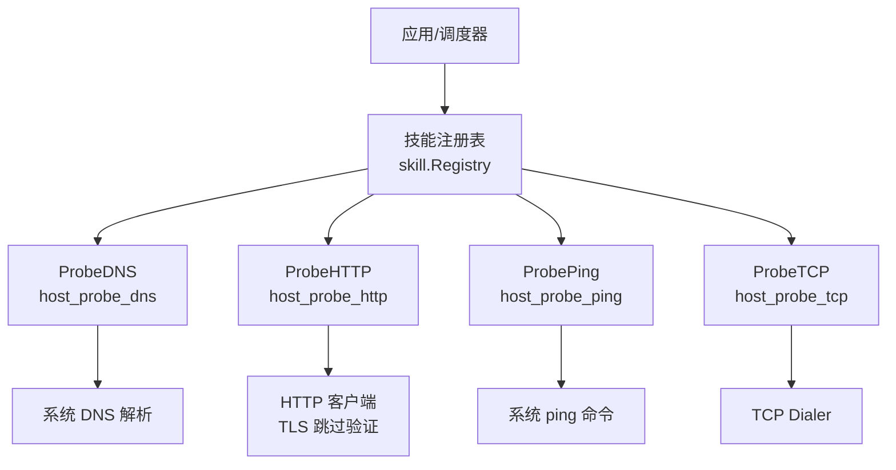
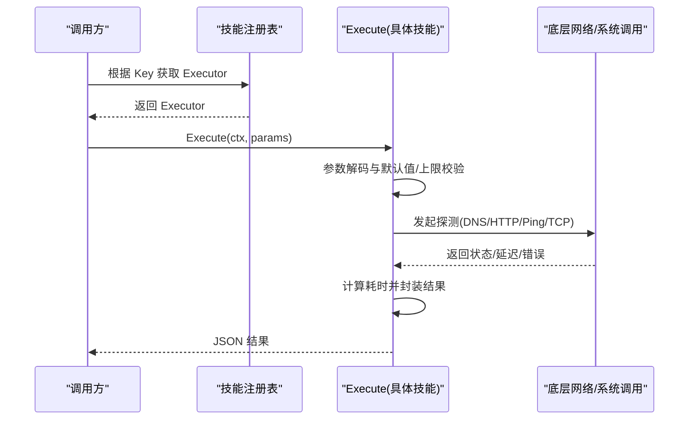
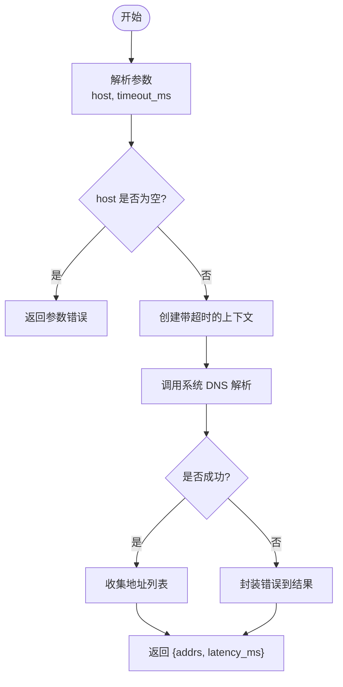
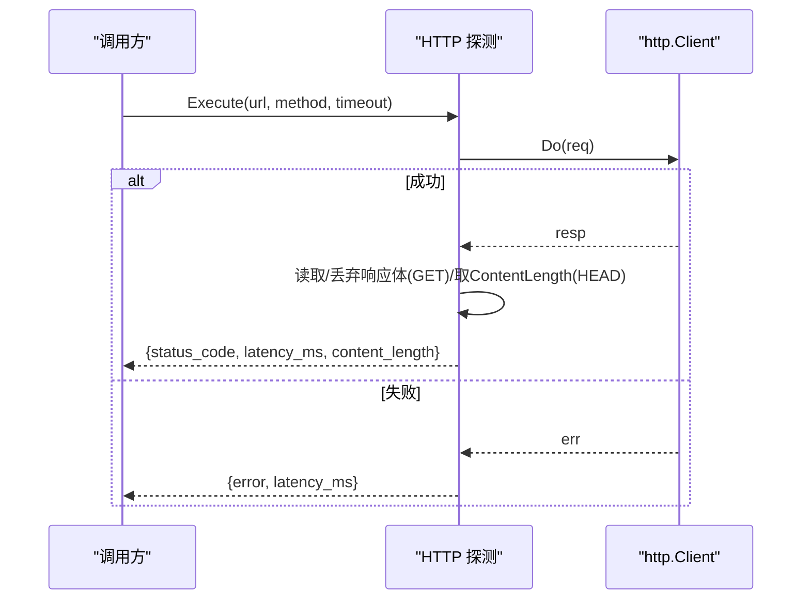
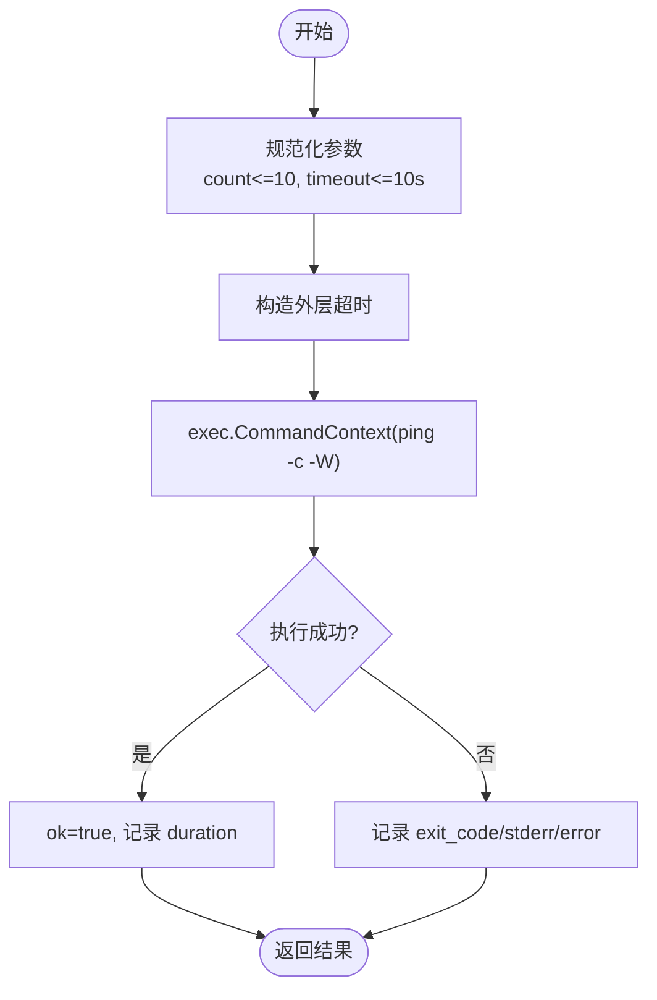
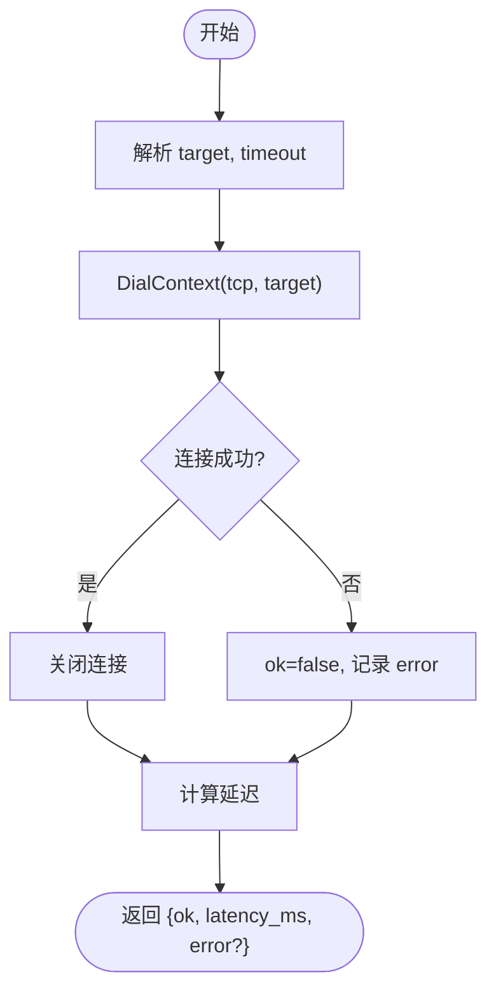
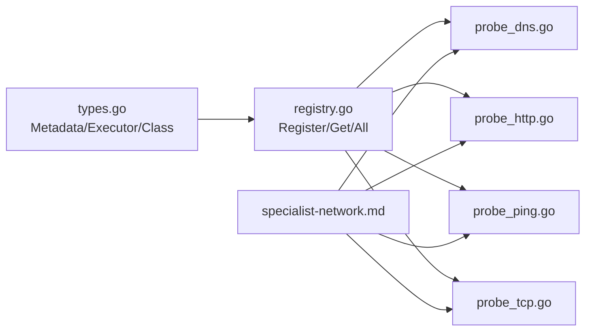

# 网络探测技能

<cite>
**本文引用的文件**
- [internal/skill/builtin/probe_dns.go](file://internal/skill/builtin/probe_dns.go)
- [internal/skill/builtin/probe_http.go](file://internal/skill/builtin/probe_http.go)
- [internal/skill/builtin/probe_ping.go](file://internal/skill/builtin/probe_ping.go)
- [internal/skill/builtin/probe_tcp.go](file://internal/skill/builtin/probe_tcp.go)
- [internal/skill/types.go](file://internal/skill/types.go)
- [internal/skill/registry.go](file://internal/skill/registry.go)
- [agents/specialist-network.md](file://agents/specialist-network.md)
</cite>

## 目录
1. [简介](#简介)
2. [项目结构](#项目结构)
3. [核心组件](#核心组件)
4. [架构总览](#架构总览)
5. [详细组件分析](#详细组件分析)
6. [依赖关系分析](#依赖关系分析)
7. [性能与限制](#性能与限制)
8. [故障排查指南](#故障排查指南)
9. [结论](#结论)
10. [附录：使用示例与结果解读](#附录使用示例与结果解读)

## 简介
本技术文档聚焦于 ongrid 内置的四种网络诊断技能：DNS 解析、HTTP 探测、Ping 探测与 TCP 连通性探测。它们以统一的“技能（Skill）”框架注册与执行，具备参数校验、超时控制、错误归一化与审计友好的结果结构，适用于边缘设备侧的网络问题定位与排障。

## 项目结构
- 技能实现位于 internal/skill/builtin 下，每种探测对应一个独立文件，并在 init() 中向全局注册表注册。
- 技能框架类型、元数据与权限分类定义在 internal/skill/types.go；注册表与枚举在 internal/skill/registry.go。
- 网络专家智能体编排参考 agents/specialist-network.md，指导如何组合使用这些技能进行端到端排障。

图表来源
- [internal/skill/registry.go:10-47](file://internal/skill/registry.go#L10-L47)
- [internal/skill/builtin/probe_dns.go:13-39](file://internal/skill/builtin/probe_dns.go#L13-L39)
- [internal/skill/builtin/probe_http.go:15-47](file://internal/skill/builtin/probe_http.go#L15-L47)
- [internal/skill/builtin/probe_ping.go:14-43](file://internal/skill/builtin/probe_ping.go#L14-L43)
- [internal/skill/builtin/probe_tcp.go:13-39](file://internal/skill/builtin/probe_tcp.go#L13-L39)

章节来源
- [internal/skill/types.go:1-27](file://internal/skill/types.go#L1-L27)
- [internal/skill/registry.go:10-47](file://internal/skill/registry.go#L10-L47)

## 核心组件
- 技能元数据与权限模型：所有技能通过 Metadata 声明 Key、Name、Description、Class、Category、Params、ResultPreview，并由框架自动推导 LLM 工具描述、UI 表单与权限门控。
- 执行接口：每个技能实现 Execute(ctx, params) -> (json.RawMessage, error)，统一返回 JSON 结果，错误信息尽量落入结果字段以保持审计一致性。
- 注册机制：init() 调用 skill.Register 将技能加入全局注册表，支持按 Key 查找与按 Class 过滤。

章节来源
- [internal/skill/types.go:99-125](file://internal/skill/types.go#L99-L125)
- [internal/skill/types.go:190-203](file://internal/skill/types.go#L190-L203)
- [internal/skill/registry.go:10-47](file://internal/skill/registry.go#L10-L47)

## 架构总览
下图展示了从调用方到具体探测实现的完整链路，包括参数校验、超时控制、底层网络调用与结果封装。

图表来源
- [internal/skill/registry.go:31-40](file://internal/skill/registry.go#L31-L40)
- [internal/skill/builtin/probe_dns.go:55-84](file://internal/skill/builtin/probe_dns.go#L55-L84)
- [internal/skill/builtin/probe_http.go:65-119](file://internal/skill/builtin/probe_http.go#L65-L119)
- [internal/skill/builtin/probe_ping.go:60-99](file://internal/skill/builtin/probe_ping.go#L60-L99)
- [internal/skill/builtin/probe_tcp.go:55-82](file://internal/skill/builtin/probe_tcp.go#L55-L82)

## 详细组件分析

### DNS 解析（host_probe_dns）
- 功能特性
  - 通过系统解析器查询目标主机的 A/AAAA 记录。
  - 只读操作，安全等级为 safe。
- 参数配置
  - host：必填，要解析的主机名。
  - timeout_ms：可选，解析超时毫秒数，默认 3000。
- 技术实现要点
  - 使用 net.DefaultResolver.LookupIPAddr 进行解析。
  - 通过 context.WithTimeout 强制超时，避免阻塞调度 goroutine。
  - 结果包含 addrs、latency_ms、error?。
- 超时与重试
  - 仅单次解析，无重试；超时由上下文控制。
- 错误处理
  - 解析失败时，错误字符串写入结果 error 字段，不抛 Go error，便于审计追踪。
- 性能与限制
  - 受系统 DNS 缓存与解析策略影响；在高并发场景下注意 DNS 服务器压力。
- 典型场景
  - 快速判断域名是否可解析、是否存在多 IP、解析延迟是否异常。

图表来源
- [internal/skill/builtin/probe_dns.go:55-84](file://internal/skill/builtin/probe_dns.go#L55-L84)

章节来源
- [internal/skill/builtin/probe_dns.go:13-84](file://internal/skill/builtin/probe_dns.go#L13-L84)

### HTTP 探测（host_probe_http）
- 功能特性
  - 对 URL 发起 HEAD 或 GET 请求，返回状态码、延迟与内容长度。
  - 为适配边缘设备常见自签名证书场景，TLS 验证被有意跳过。
- 参数配置
  - url：必填，完整 URL。
  - method：可选，枚举 GET/HEAD，默认 HEAD。
  - timeout_ms：可选，请求超时毫秒数，默认 5000。
- 技术实现要点
  - 使用 http.Client，设置 TLS InsecureSkipVerify。
  - GET 模式会读取并丢弃响应体以统计实际字节数；HEAD 模式直接使用 Content-Length。
  - 结果包含 status_code、latency_ms、content_length、error?。
- 超时与重试
  - 单次请求，无重试；超时由 client.Timeout 与上下文共同保障。
- 错误处理
  - 连接/协议错误、方法非法等，均封装为结果中的 error 字段。
- 性能与限制
  - 跳过 TLS 验证带来便利但降低安全性，仅用于内部服务探测。
  - GET 模式会传输整个响应体，注意带宽与内存占用。
- 典型场景
  - 健康检查、服务可达性、接口可用性验证。

图表来源
- [internal/skill/builtin/probe_http.go:65-119](file://internal/skill/builtin/probe_http.go#L65-L119)

章节来源
- [internal/skill/builtin/probe_http.go:15-119](file://internal/skill/builtin/probe_http.go#L15-L119)

### Ping 探测（host_probe_ping）
- 功能特性
  - 调用系统 ping 二进制发送 ICMP 包，返回退出码、耗时与原始输出。
  - 安全等级 safe，固定小包数量，不走 shell。
- 参数配置
  - host：必填，目标主机名或 IP。
  - count：可选，发送包数，默认 4，最大 10。
  - timeout_ms：可选，单包等待超时毫秒数，默认 3000，最大 10000。
- 技术实现要点
  - 使用 exec.CommandContext 运行 ping，传入 -c 与 -W 参数。
  - 外层超时 = count * timeout + 余量，防止长时间挂起。
  - 结果包含 ok、exit_code、duration_ms、stdout、stderr、error?。
- 超时与重试
  - 单次探测，count 次发包；无重试逻辑。
- 错误处理
  - 捕获 exec.ExitError 并转换为 exit_code；若上下文取消则覆盖 error 为取消原因。
- 性能与限制
  - 依赖系统 ping 命令存在性与权限；某些环境可能受限。
- 典型场景
  - 基础连通性检测、丢包率与延迟概览。

图表来源
- [internal/skill/builtin/probe_ping.go:60-124](file://internal/skill/builtin/probe_ping.go#L60-L124)

章节来源
- [internal/skill/builtin/probe_ping.go:14-124](file://internal/skill/builtin/probe_ping.go#L14-L124)

### TCP 连通性探测（host_probe_tcp）
- 功能特性
  - 对 target(host:port) 发起一次 TCP 拨号，立即关闭连接，不发送业务负载。
  - 安全等级 safe。
- 参数配置
  - target：必填，host:port 形式。
  - timeout_ms：可选，拨号超时毫秒数，默认 3000。
- 技术实现要点
  - 使用 net.Dialer.DialContext 建立 TCP 连接。
  - 结果包含 ok、latency_ms、error?。
- 超时与重试
  - 单次拨号，无重试；超时由 Dialer 与上下文控制。
- 错误处理
  - 连接失败时，ok=false 且 error 填充错误信息。
- 性能与限制
  - 适合端口级连通性检查；不涉及应用层语义。
- 典型场景
  - 服务端口监听检查、防火墙/NAT 规则验证。

图表来源
- [internal/skill/builtin/probe_tcp.go:55-82](file://internal/skill/builtin/probe_tcp.go#L55-L82)

章节来源
- [internal/skill/builtin/probe_tcp.go:13-82](file://internal/skill/builtin/probe_tcp.go#L13-L82)

## 依赖关系分析
- 技能框架依赖
  - types.go 定义了 Skill 元数据、权限分类、执行接口与参数 Schema。
  - registry.go 提供进程内注册表，负责注册、查找与按权限类过滤。
- 各探测技能的依赖
  - DNS：net.DefaultResolver。
  - HTTP：crypto/tls、net/http，跳过证书校验。
  - Ping：os/exec 调用系统 ping。
  - TCP：net.Dialer。
- 外部集成
  - 网络专家智能体（specialist-network.md）推荐优先使用专用探针而非通用 bash 命令，提升效率与可观测性。

图表来源
- [internal/skill/types.go:99-125](file://internal/skill/types.go#L99-L125)
- [internal/skill/registry.go:10-47](file://internal/skill/registry.go#L10-L47)
- [agents/specialist-network.md:17-35](file://agents/specialist-network.md#L17-L35)

章节来源
- [internal/skill/types.go:1-241](file://internal/skill/types.go#L1-L241)
- [internal/skill/registry.go:1-127](file://internal/skill/registry.go#L1-L127)
- [agents/specialist-network.md:1-78](file://agents/specialist-network.md#L1-L78)

## 性能与限制
- 性能特点
  - 全部为轻量级探测：DNS 解析、HTTP HEAD/GET、ICMP ping、TCP 拨号均为低开销操作。
  - 超时控制严格，避免长尾阻塞；Ping 对外层超时做了保护。
- 限制条件
  - DNS：依赖系统解析器与 DNS 服务器可用性。
  - HTTP：跳过 TLS 验证仅适用于可信内网；GET 会传输完整响应体。
  - Ping：依赖系统 ping 命令与 ICMP 权限；部分环境可能被禁用。
  - TCP：仅验证三层/四层连通，不涉及应用层协议。
- 最佳实践
  - 合理设置超时与次数，避免对远端造成压力。
  - 结合多种探测手段交叉验证（如 DNS + TCP + HTTP）。
  - 在自动化流程中优先使用专用探针，减少不可控因素。

[本节为通用指导，不直接分析具体文件]

## 故障排查指南
- 常见问题与定位思路
  - DNS 解析失败：检查 host 是否正确、DNS 服务器可达性、解析超时设置。
  - HTTP 连接失败：确认 URL、方法合法性、服务端状态码、TLS 策略与网络可达性。
  - Ping 不通：检查目标可达性、防火墙/ACL、ICMP 策略、系统 ping 可用性与权限。
  - TCP 端口不可达：确认目标端口监听、中间网络设备（NAT/防火墙）、路由与命名空间隔离。
- 结果字段解读
  - DNS：addrs 为空或 error 非空表示解析失败；latency_ms 反映解析耗时。
  - HTTP：status_code 指示响应状态；content_length 在 GET 模式下为实际字节数；error 包含连接/协议错误。
  - Ping：ok 表示整体成功；exit_code 与 stderr 辅助定位系统级错误；duration_ms 为总耗时。
  - TCP：ok 表示拨号成功；error 包含拒绝/超时等错误信息。
- 建议的排障顺序
  - 先 Ping 验证基础连通性，再 TCP 验证端口可达，最后 HTTP/DNS 验证应用层与名称解析。
  - 结合网络专家智能体的编排建议，优先使用专用探针，必要时辅以网络命名空间与路由检查。

章节来源
- [internal/skill/builtin/probe_dns.go:55-84](file://internal/skill/builtin/probe_dns.go#L55-L84)
- [internal/skill/builtin/probe_http.go:65-119](file://internal/skill/builtin/probe_http.go#L65-L119)
- [internal/skill/builtin/probe_ping.go:60-124](file://internal/skill/builtin/probe_ping.go#L60-L124)
- [internal/skill/builtin/probe_tcp.go:55-82](file://internal/skill/builtin/probe_tcp.go#L55-L82)
- [agents/specialist-network.md:51-76](file://agents/specialist-network.md#L51-L76)

## 结论
这四种网络探测技能提供了从底层连通性到应用层可达性的完整能力集，具备统一的参数与结果模型、严格的超时控制与安全的执行边界。结合网络专家智能体的编排策略，可在复杂网络环境中高效定位问题根因，形成标准化、可审计的排障闭环。

[本节为总结性内容，不直接分析具体文件]

## 附录：使用示例与结果解读
以下示例基于测试用例与实现行为归纳，展示典型输入与预期输出结构，便于在实际场景中快速上手。

- DNS 解析
  - 输入：{host: "localhost", timeout_ms: 2000}
  - 输出示例：{addrs: ["127.0.0.1","::1"], latency_ms: <数值>, error: ""}
  - 说明：解析成功时 addrs 非空；解析失败时 error 非空。
  - 参考路径
    - [internal/skill/builtin/probe_dns_test.go:22-49](file://internal/skill/builtin/probe_dns_test.go#L22-L49)
    - [internal/skill/builtin/probe_dns_test.go:61-77](file://internal/skill/builtin/probe_dns_test.go#L61-L77)

- HTTP 探测
  - 输入（HEAD）：{url: "<服务URL>", method: "HEAD", timeout_ms: 2000}
  - 输出示例：{status_code: 200, latency_ms: <数值>, content_length: <数值>, error: ""}
  - 输入（GET）：{url: "<服务URL>", method: "GET"}
  - 输出示例：{status_code: 200, latency_ms: <数值>, content_length: 11, error: ""}
  - 说明：GET 模式会读取并统计响应体字节数；方法非法会报错。
  - 参考路径
    - [internal/skill/builtin/probe_http_test.go:23-49](file://internal/skill/builtin/probe_http_test.go#L23-L49)
    - [internal/skill/builtin/probe_http_test.go:51-75](file://internal/skill/builtin/probe_http_test.go#L51-L75)
    - [internal/skill/builtin/probe_http_test.go:77-85](file://internal/skill/builtin/probe_http_test.go#L77-L85)

- Ping 探测
  - 输入：{host: "example.com", count: 4, timeout_ms: 3000}
  - 输出示例：{ok: true/false, exit_code: 0/非0, duration_ms: <数值>, stdout: "...", stderr: "...", error: ""}
  - 说明：count 与 timeout 会被规范化至上限；外层超时保护避免长时间阻塞。
  - 参考路径
    - [internal/skill/builtin/probe_ping_test.go:24-40](file://internal/skill/builtin/probe_ping_test.go#L24-L40)
    - [internal/skill/builtin/probe_ping.go:101-124](file://internal/skill/builtin/probe_ping.go#L101-L124)

- TCP 连通性探测
  - 输入：{target: "127.0.0.1:<端口>", timeout_ms: 1000}
  - 输出示例：{ok: true, latency_ms: <数值>, error: ""}
  - 说明：端口不可达时 ok=false 且 error 非空。
  - 参考路径
    - [internal/skill/builtin/probe_tcp_test.go:25-59](file://internal/skill/builtin/probe_tcp_test.go#L25-L59)
    - [internal/skill/builtin/probe_tcp_test.go:70-90](file://internal/skill/builtin/probe_tcp_test.go#L70-L90)

章节来源
- [internal/skill/builtin/probe_dns_test.go:12-77](file://internal/skill/builtin/probe_dns_test.go#L12-L77)
- [internal/skill/builtin/probe_http_test.go:13-105](file://internal/skill/builtin/probe_http_test.go#L13-L105)
- [internal/skill/builtin/probe_ping_test.go:11-50](file://internal/skill/builtin/probe_ping_test.go#L11-L50)
- [internal/skill/builtin/probe_tcp_test.go:12-91](file://internal/skill/builtin/probe_tcp_test.go#L12-L91)