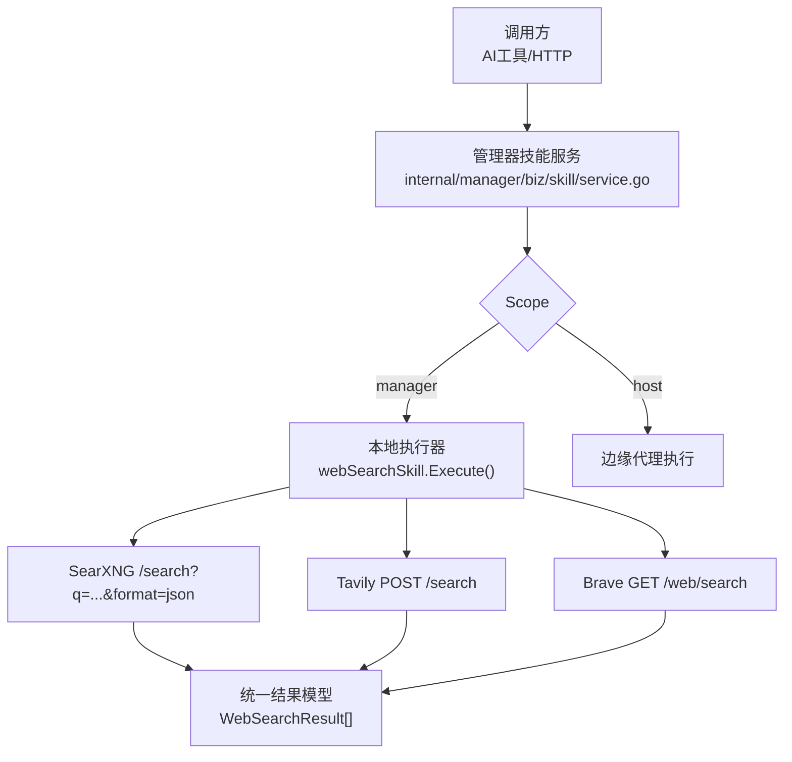
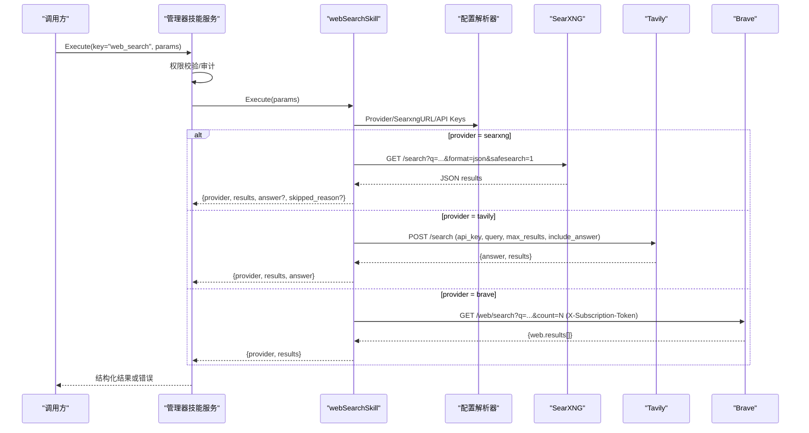
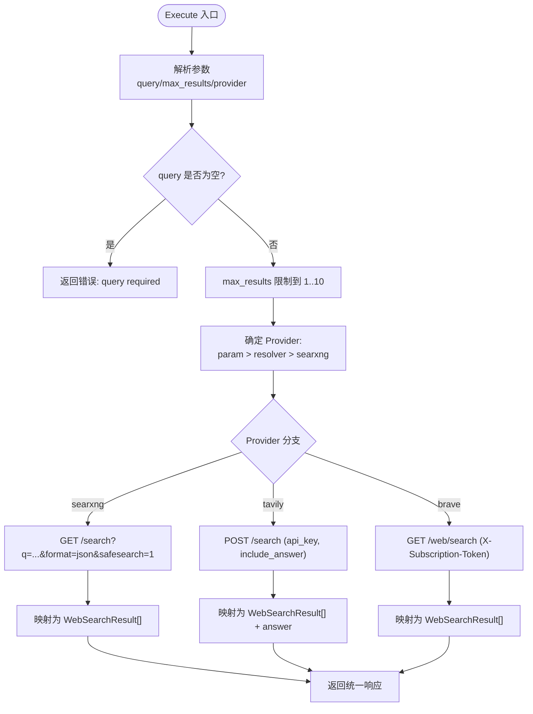
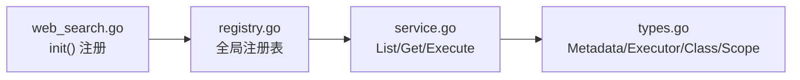

# 网络搜索技能

<cite>
**本文引用的文件**
- [web_search.go](file://internal/skill/builtin/web_search.go)
- [web_search_test.go](file://internal/skill/builtin/web_search_test.go)
- [settings.yml](file://deploy/searxng/settings.yml)
- [registry.go](file://internal/skill/registry.go)
- [loader.go](file://internal/skill/loader.go)
- [types.go](file://internal/skill/types.go)
- [service.go](file://internal/manager/biz/skill/service.go)
</cite>

## 目录
1. [简介](#简介)
2. [项目结构](#项目结构)
3. [核心组件](#核心组件)
4. [架构总览](#架构总览)
5. [详细组件分析](#详细组件分析)
6. [依赖关系分析](#依赖关系分析)
7. [性能与并发](#性能与并发)
8. [故障排查指南](#故障排查指南)
9. [结论](#结论)
10. [附录：使用示例与质量评估](#附录使用示例与质量评估)

## 简介
本技术文档围绕“联网搜索”技能（Key: web_search）展开，系统性说明其功能特性、搜索引擎集成、结果处理机制、查询构建、排序与去重策略、缓存与配置注入、并发控制、错误重试与降级、以及质量评估与可信度判断方法。该技能支持三种后端：SearXNG（默认、零密钥）、Tavily（可返回摘要答案）、Brave Search；通过统一的执行接口对外暴露，并在管理器侧注册为安全类能力，供 AI 工具与 HTTP API 调用。

## 项目结构
- 技能实现位于内置包 internal/skill/builtin，提供 web_search 的元数据、参数校验、多后端调度与响应归一化。
- 技能框架在 internal/skill 下提供注册表、类型定义、加载器与执行契约。
- 管理器服务层 internal/manager/biz/skill 负责权限校验、审计记录与按 Scope 路由到本地或边缘执行。
- SearXNG 部署配置在 deploy/searxng/settings.yml，启用 JSON 输出与安全策略。

图表来源
- [service.go:187-288](file://internal/manager/biz/skill/service.go#L187-L288)
- [web_search.go:225-283](file://internal/skill/builtin/web_search.go#L225-L283)

章节来源
- [web_search.go:1-195](file://internal/skill/builtin/web_search.go#L1-L195)
- [service.go:130-170](file://internal/manager/biz/skill/service.go#L130-L170)
- [settings.yml:50-83](file://deploy/searxng/settings.yml#L50-L83)

## 核心组件
- webSearchSkill：单例执行器，负责解析参数、选择 Provider、构造请求、发送 HTTP 请求、解析并归一化为统一结果结构。
- WebSearchConfigResolver：运行时配置解析接口，提供 Provider、SearXNG URL、Tavily/Brave API Key。
- 统一结果模型：WebSearchResult（title/url/snippet/published_date），对外稳定键名，便于提示词模板消费。
- 管理器服务：根据 Skill 的 Class/Scope 进行权限校验与路由，记录审计日志。

章节来源
- [web_search.go:150-223](file://internal/skill/builtin/web_search.go#L150-L223)
- [web_search.go:225-283](file://internal/skill/builtin/web_search.go#L225-L283)
- [service.go:187-288](file://internal/manager/biz/skill/service.go#L187-L288)

## 架构总览
下图展示一次搜索请求从调用方到后端的完整流程，包括 Provider 选择、请求构建、响应归一化与跳过原因（SkippedReason）处理。

图表来源
- [web_search.go:225-283](file://internal/skill/builtin/web_search.go#L225-L283)
- [web_search.go:287-373](file://internal/skill/builtin/web_search.go#L287-L373)
- [web_search.go:391-455](file://internal/skill/builtin/web_search.go#L391-L455)
- [web_search.go:485-543](file://internal/skill/builtin/web_search.go#L485-L543)
- [service.go:187-288](file://internal/manager/biz/skill/service.go#L187-L288)

## 详细组件分析

### 参数与元数据
- 参数
  - query：必填，自然语言或精确字符串。
  - max_results：可选，默认 5，范围 1~10，超出会被截断。
  - include_domains/exclude_domains：仅 Tavily 生效，逗号分隔。
  - provider：可选枚举，覆盖系统设置；留空则走系统设置或默认 SearXNG。
- 元数据
  - Key: web_search
  - Name: 联网搜索
  - Class: safe（只读 HTTP）
  - Scope: manager（在管理器进程内执行）
  - ResultPreview: 包含 provider、results、answer（可选）、skipped_reason（可选）

章节来源
- [web_search.go:161-195](file://internal/skill/builtin/web_search.go#L161-L195)
- [web_search.go:197-223](file://internal/skill/builtin/web_search.go#L197-L223)

### 执行流程与 Provider 选择
- 优先级：显式传入 provider > 配置解析器返回的 provider > 默认 searxng。
- 未配置 key 的处理：
  - 显式指定 Tavily/Brave 但未提供 key：返回 skipped_reason 而非 Go error，便于 LLM 引导用户配置。
  - 未显式指定且 resolver 为空或未设置：回退到 SearXNG。
- 超时与客户端：默认 http.Client 超时 30s；可通过 SetWebSearchHTTPClient 注入测试客户端。

图表来源
- [web_search.go:225-283](file://internal/skill/builtin/web_search.go#L225-L283)
- [web_search.go:287-373](file://internal/skill/builtin/web_search.go#L287-L373)
- [web_search.go:391-455](file://internal/skill/builtin/web_search.go#L391-L455)
- [web_search.go:485-543](file://internal/skill/builtin/web_search.go#L485-L543)

章节来源
- [web_search.go:225-283](file://internal/skill/builtin/web_search.go#L225-L283)

### SearXNG 集成
- 端点：/search?q=...&format=json&safesearch=1，使用 GET。
- 头部：Accept: application/json，User-Agent 标识来源。
- 可达性失败：返回 skipped_reason，提示检查 docker-compose 是否启动 searxng 或切换 provider。
- 响应体限制：读取上限 4MB，避免大响应阻塞。
- 结果映射：title/url/content→snippet/publishedDate→published_date。

章节来源
- [web_search.go:287-373](file://internal/skill/builtin/web_search.go#L287-L373)
- [settings.yml:50-83](file://deploy/searxng/settings.yml#L50-L83)

### Tavily 集成
- 端点：POST /search，携带 api_key、query、max_results、include_answer=true、search_depth=basic、include_domains/exclude_domains。
- 未配置 key：返回 skipped_reason，引导前往设置配置。
- 错误传播：非 2xx 状态码直接返回 Go error（如 429 限流）。
- 结果映射：answer 字段透传，results 映射为统一结构。

章节来源
- [web_search.go:391-455](file://internal/skill/builtin/web_search.go#L391-L455)

### Brave Search 集成
- 端点：GET /web/search?q=...&count=N，认证头 X-Subscription-Token。
- 未配置 key：返回 skipped_reason，引导前往设置配置。
- 结果映射：description→snippet，age→published_date。

章节来源
- [web_search.go:485-543](file://internal/skill/builtin/web_search.go#L485-L543)

### 管理器服务与权限
- 权限：web_search 标记为 safe，任何已认证角色均可调用。
- 路由：由于 Scope=manager，直接在管理器进程内执行 Executor.Execute。
- 审计：每次执行记录 SkillKey、EdgeID、Caller、Class、Params、Result/Error、时间戳。

章节来源
- [service.go:187-288](file://internal/manager/biz/skill/service.go#L187-L288)
- [types.go:19-27](file://internal/skill/types.go#L19-L27)

## 依赖关系分析
- 技能注册：web_search 在 init 中通过 skill.Register(WebSearch) 注册到全局注册表。
- 加载器：外部子进程技能由 loader.go 扫描 skill.json 并注册；web_search 为内置，不依赖外部加载。
- 类型与元数据：types.go 定义 Class、Scope、Metadata、Executor 等基础类型，确保一致性。

图表来源
- [web_search.go:19](file://internal/skill/builtin/web_search.go#L19)
- [registry.go:10-47](file://internal/skill/registry.go#L10-L47)
- [service.go:130-170](file://internal/manager/biz/skill/service.go#L130-L170)
- [types.go:99-203](file://internal/skill/types.go#L99-L203)

章节来源
- [registry.go:10-47](file://internal/skill/registry.go#L10-L47)
- [loader.go:69-160](file://internal/skill/loader.go#L69-L160)
- [types.go:99-203](file://internal/skill/types.go#L99-L203)

## 性能与并发
- 并发控制
  - webSearchSkill 内部使用 sync.RWMutex 保护配置与端点读写，Execute 期间以读锁获取快照，避免热点写影响读路径。
  - HTTP 客户端默认 30s 超时；SearXNG 出站连接池与超时在 settings.yml 中配置，避免上游阻塞。
- 结果裁剪
  - max_results 在调用前被限制到 10，SearXNG 路径在服务端解析后再按 limit 截断，防止多余结果传输。
- 响应体限制
  - 所有后端响应体读取均限制最大 4MB，避免内存膨胀。
- 缓存策略
  - 代码层未实现结果缓存；配置解析器（WebSearchConfigResolver）期望具备缓存能力以减少配置读取开销。
- 排序与去重
  - 当前实现未对结果进行排序或去重；结果顺序取决于各后端返回顺序。如需排序/去重，可在上层聚合时基于 URL 或标题指纹实现。

章节来源
- [web_search.go:150-159](file://internal/skill/builtin/web_search.go#L150-L159)
- [web_search.go:225-283](file://internal/skill/builtin/web_search.go#L225-L283)
- [web_search.go:287-373](file://internal/skill/builtin/web_search.go#L287-L373)
- [settings.yml:76-83](file://deploy/searxng/settings.yml#L76-L83)

## 故障排查指南
- SearXNG 不可达
  - 现象：返回 skipped_reason，提示检查 docker-compose 是否启动 searxng 或切换 provider。
  - 排查：确认容器网络与端口可达；检查 settings.yml 中 method 与 formats 是否启用 json。
- Tavily/Brave 未配置 key
  - 现象：返回 skipped_reason，提示前往设置 → 集成 → 联网搜索 配置对应 provider 的 key。
- 限流或错误码
  - 现象：Tavily/Brave 返回非 2xx 状态码，包装为 Go error（例如 429）。
  - 排查：降低频率、检查配额、重试策略（指数退避）与告警。
- 参数错误
  - 现象：query 为空时报错；max_results 超出范围会被自动截断。
- 调试技巧
  - 使用单元测试中的 httptest 模拟后端，验证请求头、查询参数与响应映射是否正确。
  - 通过 SetWebSearchHTTPClient 注入自定义客户端，捕获真实请求。

章节来源
- [web_search.go:287-373](file://internal/skill/builtin/web_search.go#L287-L373)
- [web_search.go:391-455](file://internal/skill/builtin/web_search.go#L391-L455)
- [web_search.go:485-543](file://internal/skill/builtin/web_search.go#L485-L543)
- [web_search_test.go:390-416](file://internal/skill/builtin/web_search_test.go#L390-L416)

## 结论
联网搜索技能以统一接口屏蔽了多后端差异，提供稳定的结果结构与清晰的错误语义。默认 SearXNG 零密钥可用，Tavily/Brave 提供增强能力（如答案摘要）。通过配置解析器注入、超时与响应体限制、以及 skipped_reason 友好提示，兼顾易用性与健壮性。建议在业务层按需实现结果排序与去重，并结合上游限流策略提升稳定性。

## 附录：使用示例与质量评估

### 使用示例
- 基本搜索（默认 SearXNG）
  - 参数：{query: "Kubernetes OOM 排查", max_results: 5}
  - 预期：返回 provider=searxng，results 列表，无 answer。
- 强制 Tavily 并获取答案
  - 参数：{query: "Pod Evicted 原因", provider: "tavily", max_results: 3, include_domains: "kubernetes.io,example.com"}
  - 预期：返回 provider=tavily，可能包含 answer 字段。
- 强制 Brave 搜索
  - 参数：{query: "Linux 内核 panic 分析", provider: "brave", max_results: 5}
  - 预期：返回 provider=brave，results 列表，无 answer。

章节来源
- [web_search.go:161-195](file://internal/skill/builtin/web_search.go#L161-L195)
- [web_search_test.go:199-269](file://internal/skill/builtin/web_search_test.go#L199-L269)
- [web_search_test.go:488-549](file://internal/skill/builtin/web_search_test.go#L488-L549)

### 结果质量评估与可信度判断
- 来源多样性
  - 优先关注不同域名的结果；若 include_domains 限定过窄，可能导致信息偏倚。
- 发布时间
  - 利用 published_date 或 age 字段评估时效性；越新的内容通常更可靠。
- 片段相关性
  - snippet 应包含关键词上下文；过长或无关片段需降权。
- 链接有效性
  - 建议在上层做轻量级可达性检查（如 HEAD 请求）或域名信誉校验。
- 答案字段
  - Tavily 的 answer 可作为快速参考，但仍需结合原始结果交叉验证。
- 去重与排序建议
  - 去重：基于 URL 或标题哈希；合并重复条目。
  - 排序：可按发布时间、来源权威度、片段匹配度加权打分。

[本节为通用指导，不直接分析具体文件]