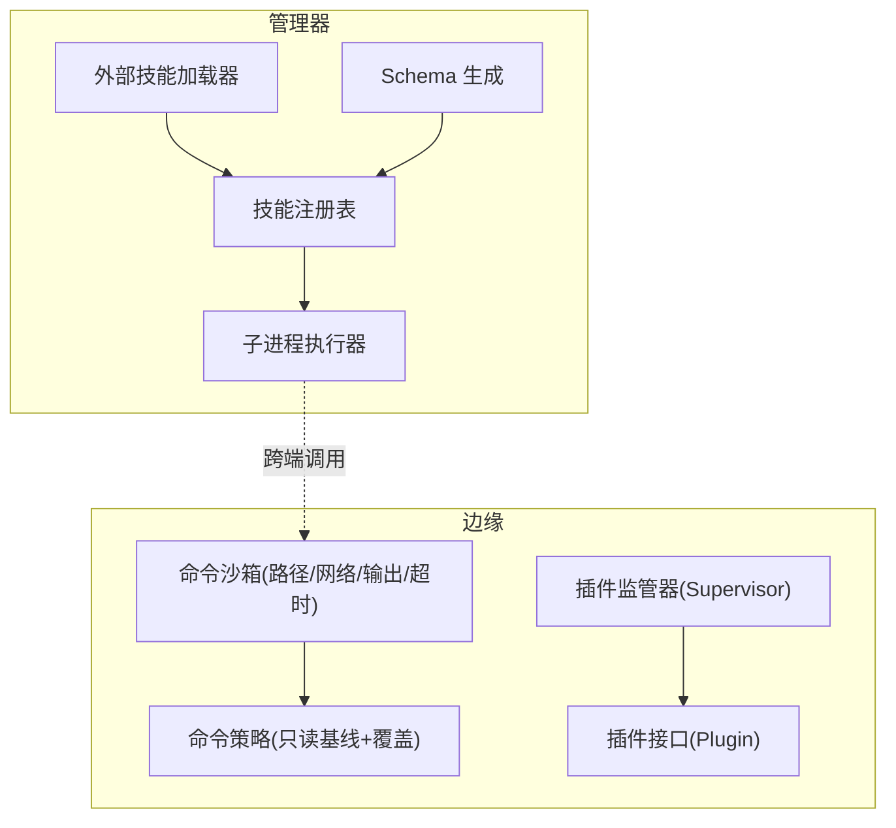
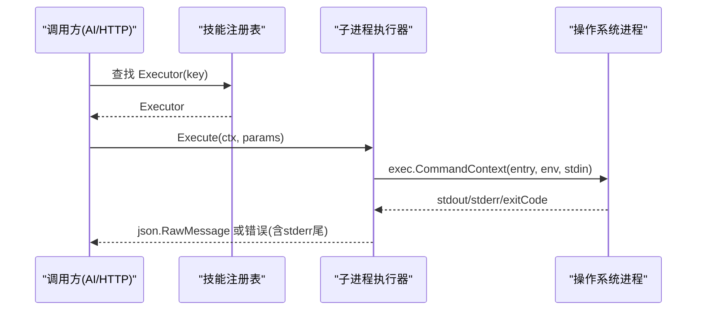
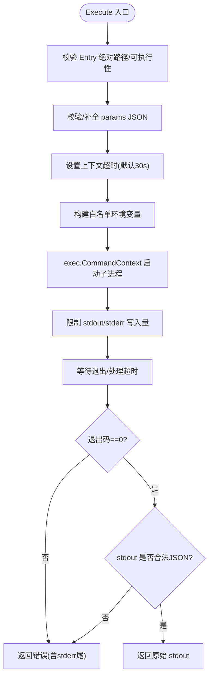
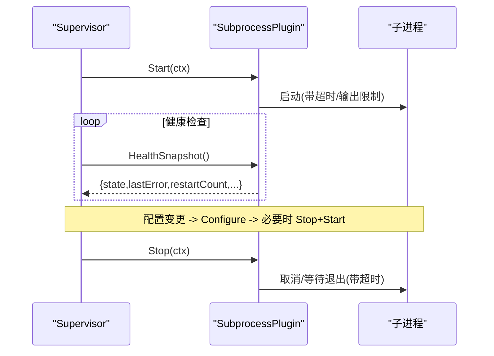
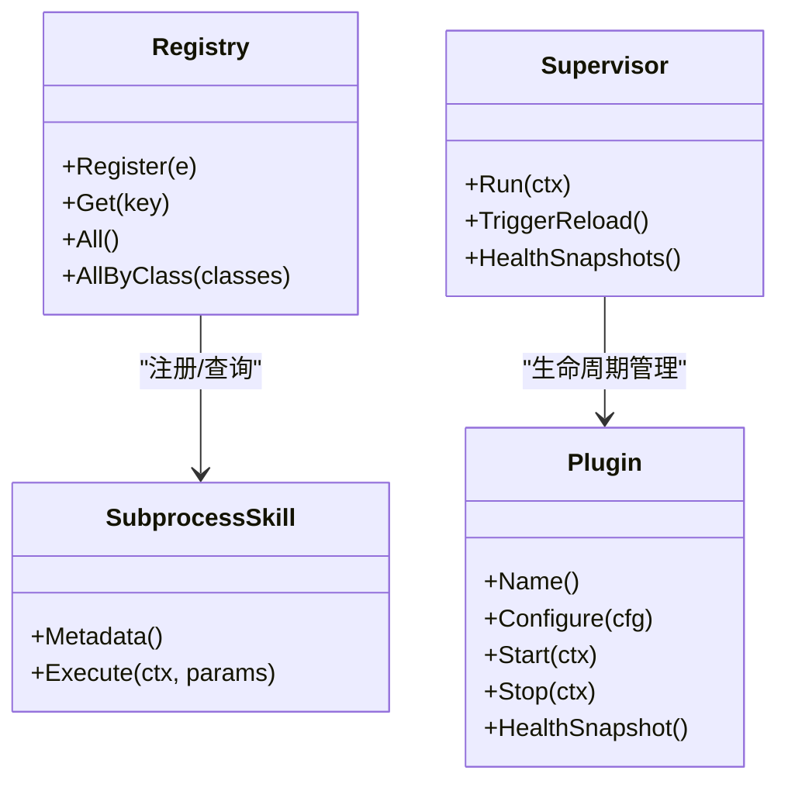
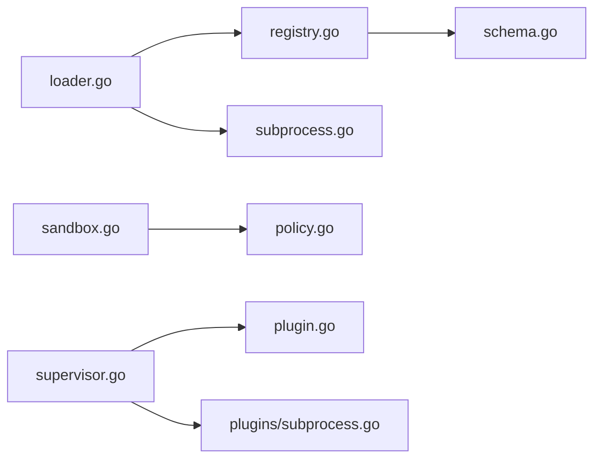

# 技能执行环境

<cite>
**本文引用的文件**
- [internal/skill/subprocess.go](file://internal/skill/subprocess.go)
- [internal/skill/types.go](file://internal/skill/types.go)
- [internal/skill/loader.go](file://internal/skill/loader.go)
- [internal/skill/registry.go](file://internal/skill/registry.go)
- [internal/skill/schema.go](file://internal/skill/schema.go)
- [internal/skill/subprocess_process_unix.go](file://internal/skill/subprocess_process_unix.go)
- [internal/edgeagent/cmdpolicy/sandbox.go](file://internal/edgeagent/cmdpolicy/sandbox.go)
- [internal/edgeagent/cmdpolicy/policy.go](file://internal/edgeagent/cmdpolicy/policy.go)
- [internal/edgeagent/plugins/supervisor.go](file://internal/edgeagent/plugins/supervisor.go)
- [internal/edgeagent/plugins/plugin.go](file://internal/edgeagent/plugins/plugin.go)
- [internal/edgeagent/plugins/subprocess.go](file://internal/edgeagent/plugins/subprocess.go)
- [internal/manager/biz/aiops/chatruntime/types.go](file://internal/manager/biz/aiops/chatruntime/types.go)
</cite>

## 目录
1. [简介](#简介)
2. [项目结构](#项目结构)
3. [核心组件](#核心组件)
4. [架构总览](#架构总览)
5. [详细组件分析](#详细组件分析)
6. [依赖关系分析](#依赖关系分析)
7. [性能与资源限制](#性能与资源限制)
8. [故障排查指南](#故障排查指南)
9. [结论](#结论)
10. [附录：配置与调优参数](#附录配置与调优参数)

## 简介
本技术文档聚焦于“技能执行环境”的子系统设计与实现，覆盖子进程隔离、权限控制、文件系统访问控制、环境变量白名单与安全边界、进程生命周期管理（启动、监控、超时、优雅终止）、插件化架构（动态加载、热更新、故障恢复），以及执行环境的配置选项与调优参数。该能力由管理器侧的技能注册与子进程执行器、边缘侧的命令沙箱策略与插件监管器等共同构成，确保在不可信或受限环境中安全地运行外部可执行文件或脚本。

## 项目结构
围绕技能执行环境的关键代码分布在以下模块：
- 管理器侧技能框架：定义技能元数据、执行接口、JSON Schema 生成、全局注册表、外部技能包加载器与子进程执行器。
- 边缘侧命令沙箱：基于策略对 shell 管道进行细粒度放行/拒绝，包含路径校验、网络目标白名单、输出上限与超时控制。
- 边缘侧插件运行时：以 Supervisor 统一编排插件生命周期，支持子进程插件的自动重启与健康上报。

图表来源
- [internal/skill/loader.go:75-160](file://internal/skill/loader.go#L75-L160)
- [internal/skill/registry.go:17-47](file://internal/skill/registry.go#L17-L47)
- [internal/skill/subprocess.go:112-172](file://internal/skill/subprocess.go#L112-L172)
- [internal/edgeagent/cmdpolicy/policy.go:33-49](file://internal/edgeagent/cmdpolicy/policy.go#L33-L49)
- [internal/edgeagent/cmdpolicy/sandbox.go:140-188](file://internal/edgeagent/cmdpolicy/sandbox.go#L140-L188)
- [internal/edgeagent/plugins/supervisor.go:114-133](file://internal/edgeagent/plugins/supervisor.go#L114-L133)

章节来源
- [internal/skill/loader.go:75-160](file://internal/skill/loader.go#L75-L160)
- [internal/skill/registry.go:17-47](file://internal/skill/registry.go#L17-L47)
- [internal/skill/subprocess.go:112-172](file://internal/skill/subprocess.go#L112-L172)
- [internal/edgeagent/cmdpolicy/policy.go:33-49](file://internal/edgeagent/cmdpolicy/policy.go#L33-L49)
- [internal/edgeagent/cmdpolicy/sandbox.go:140-188](file://internal/edgeagent/cmdpolicy/sandbox.go#L140-L188)
- [internal/edgeagent/plugins/supervisor.go:114-133](file://internal/edgeagent/plugins/supervisor.go#L114-L133)

## 核心组件
- 技能元数据与执行接口：定义技能的分类、作用域、参数 Schema、执行入口等，并统一对外暴露 Metadata() 与 Execute(ctx, params)。
- 外部技能加载器：扫描指定目录下的 skill.json，构建 SubprocessSkill，强制 ScopeManager，校验 Entry 绝对路径且位于允许目录白名单内。
- 子进程执行器：以 JSON 通过 stdin 传递参数，捕获 stdout/stderr，限制输出大小，设置超时，按退出码与 stderr 尾部信息返回错误。
- 命令沙箱与策略：对 shell 管道进行分段解析与策略匹配，限制二进制、参数、路径、网络目标，提供输出上限与超时；支持管理员直通模式（绕过策略）。
- 插件监管器：统一管理插件的配置拉取、启停、健康检查、崩溃重启与优雅关闭。

章节来源
- [internal/skill/types.go:35-61](file://internal/skill/types.go#L35-L61)
- [internal/skill/types.go:99-175](file://internal/skill/types.go#L99-L175)
- [internal/skill/loader.go:179-254](file://internal/skill/loader.go#L179-L254)
- [internal/skill/subprocess.go:17-78](file://internal/skill/subprocess.go#L17-L78)
- [internal/skill/subprocess.go:112-172](file://internal/skill/subprocess.go#L112-L172)
- [internal/edgeagent/cmdpolicy/sandbox.go:17-38](file://internal/edgeagent/cmdpolicy/sandbox.go#L17-L38)
- [internal/edgeagent/cmdpolicy/policy.go:33-49](file://internal/edgeagent/cmdpolicy/policy.go#L33-L49)
- [internal/edgeagent/plugins/supervisor.go:12-35](file://internal/edgeagent/plugins/supervisor.go#L12-L35)

## 架构总览
技能执行环境采用“管理器侧注册与调度 + 边缘侧沙箱与插件监管”的分层架构：
- 管理器侧负责将外部技能包（subprocess）注册为可被 AI 工具调用的能力，并通过 JSON 协议与子进程通信。
- 边缘侧通过命令沙箱对 shell 管道进行严格限制，防止任意命令执行带来的风险；同时通过插件监管器管理日志/追踪等子进程插件的生命周期。
- 两者通过统一的 RPC/HTTP 接口协作，形成端到端的“安全执行通道”。

图表来源
- [internal/skill/registry.go:31-47](file://internal/skill/registry.go#L31-L47)
- [internal/skill/subprocess.go:112-172](file://internal/skill/subprocess.go#L112-L172)
- [internal/skill/subprocess_process_unix.go:12-26](file://internal/skill/subprocess_process_unix.go#L12-L26)

## 详细组件分析

### 子进程隔离机制（资源限制、权限控制、文件系统访问控制）
- 资源限制
  - 输出上限：stdout 最大 16 MiB，stderr 仅保留尾部 4 KiB 用于诊断，避免恶意进程耗尽内存。
  - 超时控制：默认 30 秒，可通过 manifest 的 timeout_seconds 覆盖；使用 context.WithTimeout 绑定上下文。
  - 进程组与取消：Unix 下设置进程组，取消时向整个进程组发送 SIGKILL，确保子树进程被清理。
- 权限控制
  - 作用域强制：SubprocessSkill 的 Metadata 强制 Scope=ScopeManager，避免误标为 edge 范围。
  - 二进制白名单：Loader 要求 Entry 必须为绝对路径，且解析后必须位于配置的 ExternalDirs 白名单根目录下，阻止符号链接逃逸。
  - 环境变量白名单：仅允许 EnvAllow 中声明的环境变量注入到子进程，默认不继承父进程 PATH，除非显式加入。
- 文件系统访问控制
  - Loader 对 Entry 进行规范化与符号链接解析，确保其位于允许目录内。
  - 执行前 stat 检查，拒绝目录、非可执行文件。
  - 边缘侧命令沙箱进一步限制路径访问（PathAllowlist）与网络目标（NetworkHostAllowlist），并对管道各段进行策略匹配。

图表来源
- [internal/skill/subprocess.go:112-172](file://internal/skill/subprocess.go#L112-L172)
- [internal/skill/subprocess.go:174-193](file://internal/skill/subprocess.go#L174-L193)
- [internal/skill/subprocess.go:207-238](file://internal/skill/subprocess.go#L207-L238)
- [internal/skill/subprocess_process_unix.go:12-26](file://internal/skill/subprocess_process_unix.go#L12-L26)

章节来源
- [internal/skill/subprocess.go:17-78](file://internal/skill/subprocess.go#L17-L78)
- [internal/skill/subprocess.go:112-172](file://internal/skill/subprocess.go#L112-L172)
- [internal/skill/loader.go:179-254](file://internal/skill/loader.go#L179-L254)
- [internal/skill/subprocess_process_unix.go:12-26](file://internal/skill/subprocess_process_unix.go#L12-L26)
- [internal/edgeagent/cmdpolicy/sandbox.go:140-188](file://internal/edgeagent/cmdpolicy/sandbox.go#L140-L188)

### 环境变量白名单机制与安全边界
- 白名单机制
  - 子进程环境变量从空集开始，仅当名称出现在 EnvAllow 列表时才注入对应值。
  - 若未显式包含 PATH，则子进程无 PATH，降低误用系统命令的风险。
- 安全边界
  - Loader 强制 Entry 位于允许目录，防止指向系统敏感路径。
  - Manager 侧 Skill 默认 Scope=ScopeManager，避免在边缘设备直接执行不受控二进制。
  - 边缘侧命令沙箱对 shell 管道进行分段策略匹配，限制二进制、参数、路径、网络目标，并提供输出上限与超时。

章节来源
- [internal/skill/subprocess.go:174-193](file://internal/skill/subprocess.go#L174-L193)
- [internal/skill/loader.go:179-254](file://internal/skill/loader.go#L179-L254)
- [internal/skill/types.go:47-61](file://internal/skill/types.go#L47-L61)
- [internal/edgeagent/cmdpolicy/sandbox.go:140-188](file://internal/edgeagent/cmdpolicy/sandbox.go#L140-L188)

### 进程生命周期管理（启动、监控、超时控制、优雅终止）
- 启动
  - 子进程通过 exec.CommandContext 启动，绑定上下文以便取消。
  - 插件子进程由 Supervisor 统一拉起，支持幂等 Start。
- 监控
  - 子进程 stdout/stderr 写入受限于 capWriter，避免内存膨胀。
  - 插件健康快照定期上报，Supervisor 维护 running 状态与最近错误。
- 超时控制
  - 子进程执行默认 30 秒，manifest 可覆盖；管道执行也受 Policy.Timeout 约束。
  - 管道中任一阶段失败或超时，会终止后续阶段并返回结果。
- 优雅终止
  - Unix 下设置进程组，取消时向进程组发送 SIGKILL，确保子树进程被清理。
  - 插件 Stop 带超时等待，避免阻塞 Supervisor 关闭流程。

图表来源
- [internal/edgeagent/plugins/supervisor.go:114-133](file://internal/edgeagent/plugins/supervisor.go#L114-L133)
- [internal/edgeagent/plugins/subprocess.go:208-308](file://internal/edgeagent/plugins/subprocess.go#L208-L308)
- [internal/skill/subprocess.go:112-172](file://internal/skill/subprocess.go#L112-L172)

章节来源
- [internal/edgeagent/plugins/supervisor.go:114-133](file://internal/edgeagent/plugins/supervisor.go#L114-L133)
- [internal/edgeagent/plugins/subprocess.go:208-308](file://internal/edgeagent/plugins/subprocess.go#L208-L308)
- [internal/skill/subprocess.go:112-172](file://internal/skill/subprocess.go#L112-L172)

### 插件化架构（动态加载、热更新、故障恢复）
- 动态加载
  - Loader 扫描指定目录，解析 skill.json，构建 SubprocessSkill 并注册到全局注册表。
  - 重复 Key 会被跳过，避免重载期间冲突。
- 热更新
  - Supervisor 周期性拉取配置，比较差异，按需 Configure/Stop/Start 插件。
  - 支持 ReadyPlugin 接口，等待子进程就绪后再上报应用成功。
- 故障恢复
  - 子进程崩溃后，Supervisor 指数退避重启，记录错误与重启次数。
  - 插件停止带超时，避免阻塞整体关闭。

图表来源
- [internal/skill/registry.go:17-47](file://internal/skill/registry.go#L17-L47)
- [internal/skill/loader.go:75-160](file://internal/skill/loader.go#L75-L160)
- [internal/edgeagent/plugins/supervisor.go:114-133](file://internal/edgeagent/plugins/supervisor.go#L114-L133)
- [internal/edgeagent/plugins/plugin.go:18-52](file://internal/edgeagent/plugins/plugin.go#L18-L52)

章节来源
- [internal/skill/loader.go:75-160](file://internal/skill/loader.go#L75-L160)
- [internal/skill/registry.go:17-47](file://internal/skill/registry.go#L17-L47)
- [internal/edgeagent/plugins/supervisor.go:114-133](file://internal/edgeagent/plugins/supervisor.go#L114-L133)
- [internal/edgeagent/plugins/plugin.go:18-52](file://internal/edgeagent/plugins/plugin.go#L18-L52)

### 执行环境的配置选项与调优参数
- 技能清单（skill.json）
  - name/description/entry/schema/env_allow/timeout_seconds/class/category
  - 关键项：env_allow 控制环境变量注入；timeout_seconds 控制子进程超时。
- 管理器侧默认值
  - 子进程默认超时 30 秒；stdout 上限 16 MiB；stderr 尾部 4 KiB。
- 边缘侧命令沙箱
  - 默认输出上限：stdout 64 KiB，stderr 16 KiB；默认超时 30 秒；最大参数长度 32。
  - 路径白名单：/var,/opt,/home,/tmp,/srv,/data。
  - 网络目标白名单：默认空（拒绝所有出站），可通过 YAML 覆盖。
- 插件配置
  - enabled/edge_id/endpoint/auth_user/auth_pass/spec
  - 支持 ReadyPlugin 等待子进程就绪。

章节来源
- [internal/skill/loader.go:17-53](file://internal/skill/loader.go#L17-L53)
- [internal/skill/subprocess.go:17-28](file://internal/skill/subprocess.go#L17-L28)
- [internal/edgeagent/cmdpolicy/policy.go:26-49](file://internal/edgeagent/cmdpolicy/policy.go#L26-L49)
- [internal/edgeagent/plugins/plugin.go:54-71](file://internal/edgeagent/plugins/plugin.go#L54-L71)

### 安全加固措施与异常处理策略
- 安全加固
  - 二进制白名单与路径校验：Loader 限制 Entry 位置；Sandbox 限制 argv 中的绝对路径。
  - 网络目标白名单：仅允许配置的目标主机/IP/CIDR。
  - 环境变量白名单：最小化注入，默认无 PATH。
  - 作用域强制：SubprocessSkill 强制 ScopeManager。
- 异常处理
  - 子进程非零退出：返回错误并附带 stderr 尾部，便于审计与调试。
  - 超时：返回上下文超时错误，管道执行标记 truncated。
  - 插件崩溃：记录错误并指数退避重启；停止带超时，避免阻塞。

章节来源
- [internal/skill/loader.go:179-254](file://internal/skill/loader.go#L179-L254)
- [internal/skill/subprocess.go:112-172](file://internal/skill/subprocess.go#L112-L172)
- [internal/edgeagent/cmdpolicy/sandbox.go:140-188](file://internal/edgeagent/cmdpolicy/sandbox.go#L140-L188)
- [internal/edgeagent/plugins/subprocess.go:208-308](file://internal/edgeagent/plugins/subprocess.go#L208-L308)

## 依赖关系分析
- 管理器侧
  - loader.go 依赖 registry.go 进行注册；subprocess.go 依赖操作系统 exec 与 SysProcAttr。
  - schema.go 提供 JSON Schema 生成，供 LLM 工具描述与 UI 表单渲染。
- 边缘侧
  - sandbox.go 依赖 policy.go 的策略基线与覆盖；supervisor.go 管理插件生命周期。
  - subprocess.go（插件侧）实现子进程插件的启动、重启与停止。

图表来源
- [internal/skill/loader.go:75-160](file://internal/skill/loader.go#L75-L160)
- [internal/skill/registry.go:17-47](file://internal/skill/registry.go#L17-L47)
- [internal/skill/schema.go:5-20](file://internal/skill/schema.go#L5-L20)
- [internal/edgeagent/cmdpolicy/sandbox.go:140-188](file://internal/edgeagent/cmdpolicy/sandbox.go#L140-L188)
- [internal/edgeagent/cmdpolicy/policy.go:33-49](file://internal/edgeagent/cmdpolicy/policy.go#L33-L49)
- [internal/edgeagent/plugins/supervisor.go:114-133](file://internal/edgeagent/plugins/supervisor.go#L114-L133)
- [internal/edgeagent/plugins/plugin.go:18-52](file://internal/edgeagent/plugins/plugin.go#L18-L52)
- [internal/edgeagent/plugins/subprocess.go:208-308](file://internal/edgeagent/plugins/subprocess.go#L208-L308)

章节来源
- [internal/skill/loader.go:75-160](file://internal/skill/loader.go#L75-L160)
- [internal/skill/registry.go:17-47](file://internal/skill/registry.go#L17-L47)
- [internal/skill/schema.go:5-20](file://internal/skill/schema.go#L5-L20)
- [internal/edgeagent/cmdpolicy/sandbox.go:140-188](file://internal/edgeagent/cmdpolicy/sandbox.go#L140-L188)
- [internal/edgeagent/cmdpolicy/policy.go:33-49](file://internal/edgeagent/cmdpolicy/policy.go#L33-L49)
- [internal/edgeagent/plugins/supervisor.go:114-133](file://internal/edgeagent/plugins/supervisor.go#L114-L133)
- [internal/edgeagent/plugins/plugin.go:18-52](file://internal/edgeagent/plugins/plugin.go#L18-L52)
- [internal/edgeagent/plugins/subprocess.go:208-308](file://internal/edgeagent/plugins/subprocess.go#L208-L308)

## 性能与资源限制
- I/O 限制
  - 子进程 stdout 上限 16 MiB，stderr 尾部 4 KiB，避免内存爆炸。
  - 命令沙箱默认 stdout 64 KiB、stderr 16 KiB，可配置覆盖。
- 超时与并发
  - 子进程默认 30 秒超时；管道执行同样受超时约束。
  - 插件重启采用指数退避，上限 5 分钟，避免频繁重启导致抖动。
- 建议
  - 根据任务规模调整 stdout/stderr 上限与超时。
  - 对长耗时任务拆分或异步化，避免阻塞调用链。

[本节为通用指导，无需特定文件引用]

## 故障排查指南
- 子进程执行失败
  - 检查 Entry 是否为绝对路径且可执行；确认位于允许目录白名单内。
  - 查看 stderr 尾部信息定位错误原因。
  - 确认 env_allow 是否包含必要的环境变量（如 API Key）。
- 超时问题
  - 调整 manifest 的 timeout_seconds 或 Policy.Timeout。
  - 检查管道下游是否阻塞或上游过早退出导致断管。
- 插件崩溃/重启频繁
  - 查看健康快照中的 last_error 与 restart_count。
  - 检查二进制是否存在、配置是否正确、依赖服务是否可达。
- 网络访问被拒
  - 确认 NetworkHostAllowlist 是否包含目标主机/IP/CIDR。
  - 检查命令参数是否被识别为目标主机（如 curl/wget/dig 等）。

章节来源
- [internal/skill/subprocess.go:112-172](file://internal/skill/subprocess.go#L112-L172)
- [internal/edgeagent/cmdpolicy/sandbox.go:140-188](file://internal/edgeagent/cmdpolicy/sandbox.go#L140-L188)
- [internal/edgeagent/plugins/subprocess.go:208-308](file://internal/edgeagent/plugins/subprocess.go#L208-L308)

## 结论
技能执行环境通过“管理器侧注册与子进程执行 + 边缘侧命令沙箱与插件监管”的分层设计，实现了严格的子进程隔离、权限控制、文件系统与网络访问控制、环境变量白名单与安全边界，并提供了完善的进程生命周期管理与故障恢复机制。配合可配置的超时与输出上限，能够在不可信环境中安全地运行外部可执行文件或脚本，满足大规模自动化运维与诊断场景的需求。

[本节为总结，无需特定文件引用]

## 附录：配置与调优参数
- 技能清单（skill.json）
  - name/description/entry/schema/env_allow/timeout_seconds/class/category
  - 推荐：明确 env_allow，仅注入必要环境变量；设置合理的 timeout_seconds。
- 管理器侧默认值
  - 子进程默认超时 30 秒；stdout 上限 16 MiB；stderr 尾部 4 KiB。
- 边缘侧命令沙箱
  - 默认输出上限：stdout 64 KiB，stderr 16 KiB；默认超时 30 秒；最大参数长度 32。
  - 路径白名单：/var,/opt,/home,/tmp,/srv,/data。
  - 网络目标白名单：默认空（拒绝所有出站），可通过 YAML 覆盖。
- 插件配置
  - enabled/edge_id/endpoint/auth_user/auth_pass/spec
  - 支持 ReadyPlugin 等待子进程就绪。

章节来源
- [internal/skill/loader.go:17-53](file://internal/skill/loader.go#L17-L53)
- [internal/skill/subprocess.go:17-28](file://internal/skill/subprocess.go#L17-L28)
- [internal/edgeagent/cmdpolicy/policy.go:26-49](file://internal/edgeagent/cmdpolicy/policy.go#L26-L49)
- [internal/edgeagent/plugins/plugin.go:54-71](file://internal/edgeagent/plugins/plugin.go#L54-L71)