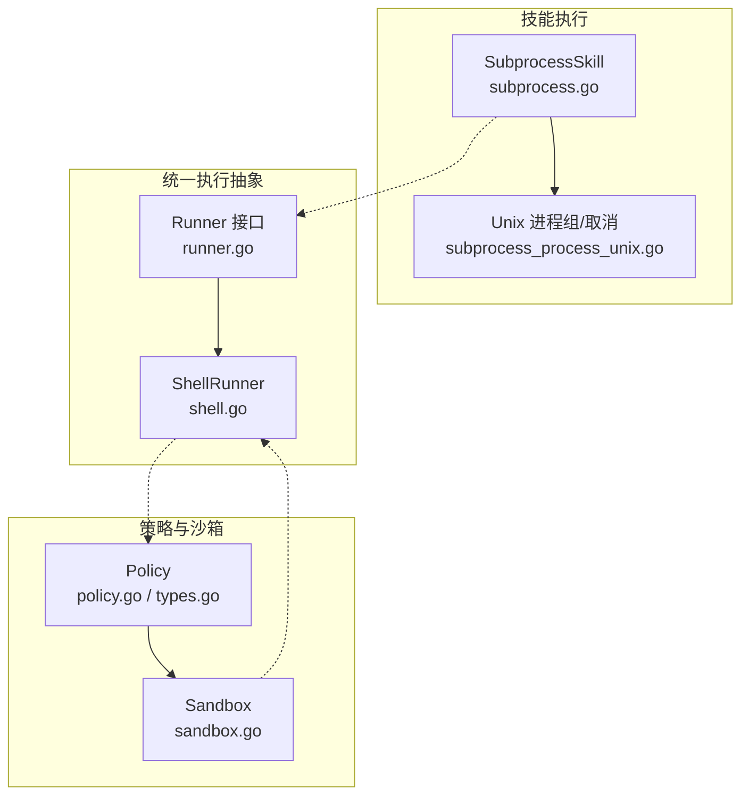
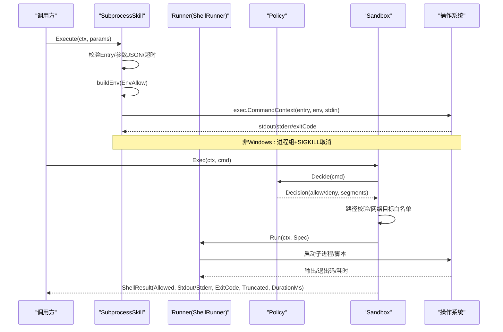
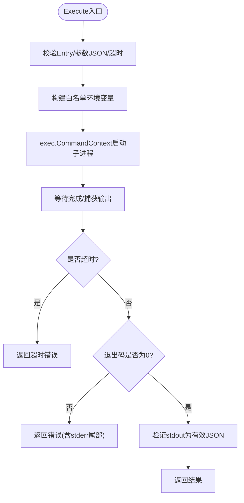
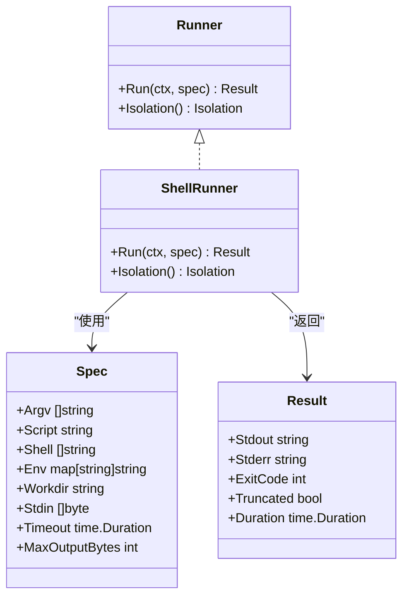
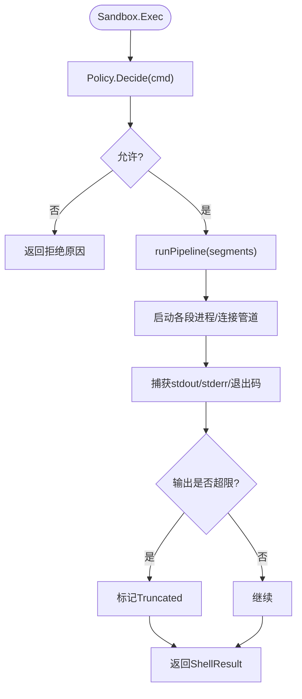
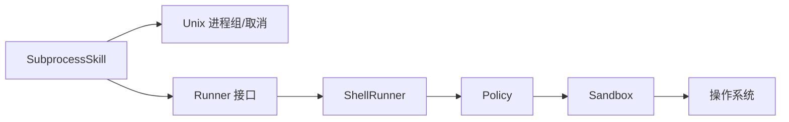

# 执行环境隔离

<cite>
**本文引用的文件**
- [internal/skill/subprocess.go](file://internal/skill/subprocess.go)
- [internal/skill/subprocess_process_unix.go](file://internal/skill/subprocess_process_unix.go)
- [internal/skill/types.go](file://internal/skill/types.go)
- [internal/pkg/runner/runner.go](file://internal/pkg/runner/runner.go)
- [internal/pkg/runner/shell.go](file://internal/pkg/runner/shell.go)
- [internal/edgeagent/cmdpolicy/sandbox.go](file://internal/edgeagent/cmdpolicy/sandbox.go)
- [internal/edgeagent/cmdpolicy/policy.go](file://internal/edgeagent/cmdpolicy/policy.go)
- [internal/edgeagent/cmdpolicy/types.go](file://internal/edgeagent/cmdpolicy/types.go)
</cite>

## 目录
1. [简介](#简介)
2. [项目结构](#项目结构)
3. [核心组件](#核心组件)
4. [架构总览](#架构总览)
5. [详细组件分析](#详细组件分析)
6. [依赖关系分析](#依赖关系分析)
7. [性能考量](#性能考量)
8. [故障排查指南](#故障排查指南)
9. [结论](#结论)
10. [附录：配置与最佳实践](#附录配置与最佳实践)

## 简介
本技术文档聚焦于“技能执行环境隔离”的设计与实现，覆盖子进程执行模型、环境变量白名单、超时与资源限制、沙箱安全模型（文件系统访问限制与网络权限控制）、以及执行环境的配置选项与最佳实践。目标是帮助读者理解并正确使用系统提供的安全执行边界，确保在管理器侧或边缘侧以最小权限运行外部命令或脚本，同时具备可观测性与可控性。

## 项目结构
围绕执行隔离的关键代码分布在以下模块：
- internal/skill：技能框架与子进程执行器（SubprocessSkill），负责以独立进程运行外部二进制，提供输入输出流控、超时与环境过滤。
- internal/pkg/runner：统一的执行沙箱抽象（Runner），当前默认后端为 ShellRunner（无容器隔离的进程级隔离），预留未来容器/微VM扩展点。
- internal/edgeagent/cmdpolicy：策略与沙箱层，定义允许的二进制集合、参数匹配规则、路径校验、网络目标白名单、输出上限与超时等。

图表来源
- [internal/skill/subprocess.go:30-78](file://internal/skill/subprocess.go#L30-L78)
- [internal/skill/subprocess_process_unix.go:12-26](file://internal/skill/subprocess_process_unix.go#L12-L26)
- [internal/pkg/runner/runner.go:20-35](file://internal/pkg/runner/runner.go#L20-L35)
- [internal/pkg/runner/shell.go:14-23](file://internal/pkg/runner/shell.go#L14-L23)
- [internal/edgeagent/cmdpolicy/policy.go:33-49](file://internal/edgeagent/cmdpolicy/policy.go#L33-L49)
- [internal/edgeagent/cmdpolicy/sandbox.go:52-59](file://internal/edgeagent/cmdpolicy/sandbox.go#L52-L59)

章节来源
- [internal/skill/subprocess.go:30-78](file://internal/skill/subprocess.go#L30-L78)
- [internal/pkg/runner/runner.go:20-35](file://internal/pkg/runner/runner.go#L20-L35)
- [internal/edgeagent/cmdpolicy/policy.go:33-49](file://internal/edgeagent/cmdpolicy/policy.go#L33-L49)

## 核心组件
- SubprocessSkill：以独立进程运行外部二进制，stdin 传入 JSON 参数，stdout 返回 JSON 结果；强制 ScopeManager，默认 ClassSafe；支持 EnvAllow 白名单注入环境变量；内置超时与输出大小限制。
- Unix 进程组与取消：在非 Windows 平台将子进程置于独立进程组，并在父上下文取消时通过 SIGKILL 整组终止，避免僵尸进程。
- Runner/ShellRunner：统一执行抽象，当前实现为进程内子进程执行，支持脚本或 argv 模式，完全替换环境变量（不继承父进程 env），输出有界缓冲，超时控制。
- Policy/Sandbox：策略层定义允许的二进制、参数匹配、路径白名单、网络目标白名单、输出上限与超时；沙箱层组合策略与路径/网络校验后执行管道化命令，支持分段 stderr 捕获与截断标记。

章节来源
- [internal/skill/subprocess.go:30-78](file://internal/skill/subprocess.go#L30-L78)
- [internal/skill/subprocess_process_unix.go:12-26](file://internal/skill/subprocess_process_unix.go#L12-L26)
- [internal/pkg/runner/runner.go:48-96](file://internal/pkg/runner/runner.go#L48-L96)
- [internal/pkg/runner/shell.go:25-101](file://internal/pkg/runner/shell.go#L25-L101)
- [internal/edgeagent/cmdpolicy/types.go:43-77](file://internal/edgeagent/cmdpolicy/types.go#L43-L77)
- [internal/edgeagent/cmdpolicy/sandbox.go:52-59](file://internal/edgeagent/cmdpolicy/sandbox.go#L52-L59)

## 架构总览
下图展示了从“技能调用”到“策略校验”再到“子进程执行”的整体流程，包括环境变量白名单、超时控制、输出限流与网络/路径策略。

图表来源
- [internal/skill/subprocess.go:112-171](file://internal/skill/subprocess.go#L112-L171)
- [internal/skill/subprocess_process_unix.go:12-26](file://internal/skill/subprocess_process_unix.go#L12-L26)
- [internal/pkg/runner/shell.go:25-101](file://internal/pkg/runner/shell.go#L25-L101)
- [internal/edgeagent/cmdpolicy/sandbox.go:140-187](file://internal/edgeagent/cmdpolicy/sandbox.go#L140-L187)
- [internal/edgeagent/cmdpolicy/policy.go:707-726](file://internal/edgeagent/cmdpolicy/policy.go#L707-L726)

## 详细组件分析

### 子进程执行模型（SubprocessSkill）
- 进程创建与生命周期
  - 使用 exec.CommandContext 启动子进程，父上下文携带超时与取消语义。
  - 非 Windows 平台设置进程组（Setpgid=true），并通过自定义 Cancel 回调对进程组发送 SIGKILL，确保超时或取消时整个进程树被清理。
- 输入输出与内存保护
  - 标准输入为 JSON 参数；标准输出限制最大字节数（防止恶意二进制无限输出导致 OOM）。
  - 错误信息中保留 stderr 尾部片段用于诊断。
- 超时控制
  - 若未显式指定 Timeout，则使用默认超时；超过时限返回 DeadlineExceeded 包装错误。
- 环境变量白名单
  - 仅允许白名单中的环境变量名从父进程注入子进程；未列入白名单的环境变量不会传递，避免敏感信息泄露。
- 安全约束
  - 强制 ScopeManager，禁止在边缘侧直接执行任意二进制；Entry 必须为绝对路径且存在并可执行。

图表来源
- [internal/skill/subprocess.go:112-171](file://internal/skill/subprocess.go#L112-L171)
- [internal/skill/subprocess_process_unix.go:12-26](file://internal/skill/subprocess_process_unix.go#L12-L26)

章节来源
- [internal/skill/subprocess.go:17-28](file://internal/skill/subprocess.go#L17-L28)
- [internal/skill/subprocess.go:112-171](file://internal/skill/subprocess.go#L112-L171)
- [internal/skill/subprocess_process_unix.go:12-26](file://internal/skill/subprocess_process_unix.go#L12-L26)

### 统一执行抽象（Runner/ShellRunner）
- 设计目标
  - 提供统一的执行接口，屏蔽底层隔离差异；当前默认后端为 ShellRunner（进程级隔离），未来可扩展容器/微VM后端。
- 执行特性
  - 支持 argv 或脚本模式；工作目录可为临时目录；环境变量完全由调用方提供，不继承父进程环境。
  - 输出缓冲限制（每流默认 1MiB），超限时返回 truncated 标志。
  - 超时控制：默认 2 分钟，可通过 Spec.Timeout 调整。
- 环境变量处理
  - 若未提供 PATH，自动注入最小 PATH 以保证常见命令解析。

图表来源
- [internal/pkg/runner/runner.go:20-96](file://internal/pkg/runner/runner.go#L20-L96)
- [internal/pkg/runner/shell.go:25-101](file://internal/pkg/runner/shell.go#L25-L101)

章节来源
- [internal/pkg/runner/runner.go:20-96](file://internal/pkg/runner/runner.go#L20-L96)
- [internal/pkg/runner/shell.go:25-101](file://internal/pkg/runner/shell.go#L25-L101)

### 策略与沙箱（Policy/Sandbox）
- 策略（Policy）
  - 二进制分类：read-fs、read-system、mixed、network、denied。
  - 默认只读策略包含常用诊断命令，拒绝 shell/脚本语言及破坏性命令。
  - 支持 YAML 覆盖合并，允许扩展/收紧规则。
  - 全局限制：输出上限、超时、最大参数长度、路径白名单、网络目标白名单。
- 沙箱（Sandbox）
  - Decide：基于策略判断命令是否允许，并进行路径校验与网络目标白名单检查。
  - Exec：按管道段启动多个子进程，串联 stdout→stdin，捕获各段 stderr，限制输出，超时控制，返回结构化结果。
  - ExecRaw：绕过策略检查的“管理员逃逸通道”，仍受输出上限与超时保护。

图表来源
- [internal/edgeagent/cmdpolicy/sandbox.go:140-187](file://internal/edgeagent/cmdpolicy/sandbox.go#L140-L187)
- [internal/edgeagent/cmdpolicy/sandbox.go:263-341](file://internal/edgeagent/cmdpolicy/sandbox.go#L263-L341)
- [internal/edgeagent/cmdpolicy/policy.go:707-726](file://internal/edgeagent/cmdpolicy/policy.go#L707-L726)

章节来源
- [internal/edgeagent/cmdpolicy/types.go:132-166](file://internal/edgeagent/cmdpolicy/types.go#L132-L166)
- [internal/edgeagent/cmdpolicy/policy.go:33-49](file://internal/edgeagent/cmdpolicy/policy.go#L33-L49)
- [internal/edgeagent/cmdpolicy/sandbox.go:140-187](file://internal/edgeagent/cmdpolicy/sandbox.go#L140-L187)

### 环境变量白名单机制
- SubprocessSkill 的 EnvAllow
  - 仅允许白名单中的环境变量名从父进程注入子进程；未列入白名单的环境变量不会传递。
  - 典型场景：仅注入 API Key 等必要变量，避免 PATH 或其他敏感变量泄露。
- ShellRunner 的环境处理
  - 完全替换环境变量，不继承父进程环境；若未提供 PATH，自动注入最小 PATH。
  - 调用方负责注入 PATH/HOME 与凭据相关的环境变量。
- 策略层的环境控制
  - 管道执行时固定设置 PATH/LANG/LC_ALL，保证稳定执行环境。

章节来源
- [internal/skill/subprocess.go:64-69](file://internal/skill/subprocess.go#L64-L69)
- [internal/skill/subprocess.go:174-193](file://internal/skill/subprocess.go#L174-L193)
- [internal/pkg/runner/shell.go:66-69](file://internal/pkg/runner/shell.go#L66-L69)
- [internal/pkg/runner/shell.go:104-125](file://internal/pkg/runner/shell.go#L104-L125)
- [internal/edgeagent/cmdpolicy/sandbox.go:274-278](file://internal/edgeagent/cmdpolicy/sandbox.go#L274-L278)

### 超时控制与资源监控
- 超时控制
  - SubprocessSkill：默认 30 秒，可通过 Timeout 字段覆盖；超时返回 DeadlineExceeded。
  - ShellRunner：默认 2 分钟，可通过 Spec.Timeout 覆盖；超时返回错误并标记退出码。
  - 策略层：默认 30 秒，可通过 YAML 覆盖；超时将终止管道并返回超时消息。
- 输出限制
  - SubprocessSkill：stdout 最大 16 MiB，stderr 尾部保留 4 KiB。
  - ShellRunner：每流默认 1 MiB，超出标记 truncated。
  - 策略层：stdout/stderr 上限可配置，超出标记 truncated。
- 资源监控
  - 当前实现未内置 CPU/内存使用率监控；可通过上层指标采集或系统工具获取。
  - 建议结合系统监控（如进程采样、Prometheus 指标）进行观测。

章节来源
- [internal/skill/subprocess.go:17-28](file://internal/skill/subprocess.go#L17-L28)
- [internal/skill/subprocess.go:145-160](file://internal/skill/subprocess.go#L145-L160)
- [internal/pkg/runner/runner.go:92-96](file://internal/pkg/runner/runner.go#L92-L96)
- [internal/pkg/runner/shell.go:29-39](file://internal/pkg/runner/shell.go#L29-L39)
- [internal/edgeagent/cmdpolicy/policy.go:26-31](file://internal/edgeagent/cmdpolicy/policy.go#L26-L31)
- [internal/edgeagent/cmdpolicy/sandbox.go:148-153](file://internal/edgeagent/cmdpolicy/sandbox.go#L148-L153)

### 沙箱隔离的安全模型
- 文件系统访问限制
  - 策略层通过 PathValidator 校验所有以“/”开头的参数，确保仅访问白名单路径。
  - 默认路径白名单包含 /var、/opt、/home、/tmp、/srv、/data 等。
  - 拒绝高危路径（如 /proc、/sys、/dev、/run 及敏感文件）。
- 网络权限控制
  - 网络类二进制（curl、wget、ping、dig 等）需通过 NetworkHostAllowlist 放行目标主机/CIDR/后缀。
  - 空白名单意味着拒绝所有出站；可通过 YAML 配置放宽。
- 进程与管道安全
  - 管道执行时每个子进程均设置进程组，便于整体取消与清理。
  - 严格限制参数长度与元字符，避免注入攻击。

章节来源
- [internal/edgeagent/cmdpolicy/sandbox.go:76-131](file://internal/edgeagent/cmdpolicy/sandbox.go#L76-L131)
- [internal/edgeagent/cmdpolicy/policy.go:43-49](file://internal/edgeagent/cmdpolicy/policy.go#L43-L49)
- [internal/edgeagent/cmdpolicy/policy.go:426-460](file://internal/edgeagent/cmdpolicy/policy.go#L426-L460)
- [internal/edgeagent/cmdpolicy/sandbox.go:428-549](file://internal/edgeagent/cmdpolicy/sandbox.go#L428-L549)

## 依赖关系分析
- SubprocessSkill 依赖 Unix 进程组与取消机制，确保超时/取消时子进程树被清理。
- ShellRunner 作为 Runner 接口的默认实现，提供进程级隔离与资源限制。
- Policy 提供二进制分类与规则，Sandbox 组合策略与路径/网络校验后执行。
- 各层之间通过清晰的接口解耦，便于扩展新的隔离后端（容器/微VM）。

图表来源
- [internal/skill/subprocess_process_unix.go:12-26](file://internal/skill/subprocess_process_unix.go#L12-L26)
- [internal/pkg/runner/runner.go:20-35](file://internal/pkg/runner/runner.go#L20-L35)
- [internal/pkg/runner/shell.go:25-101](file://internal/pkg/runner/shell.go#L25-L101)
- [internal/edgeagent/cmdpolicy/policy.go:707-726](file://internal/edgeagent/cmdpolicy/policy.go#L707-L726)
- [internal/edgeagent/cmdpolicy/sandbox.go:140-187](file://internal/edgeagent/cmdpolicy/sandbox.go#L140-L187)

章节来源
- [internal/skill/subprocess_process_unix.go:12-26](file://internal/skill/subprocess_process_unix.go#L12-L26)
- [internal/pkg/runner/runner.go:20-35](file://internal/pkg/runner/runner.go#L20-L35)
- [internal/edgeagent/cmdpolicy/policy.go:707-726](file://internal/edgeagent/cmdpolicy/policy.go#L707-L726)

## 性能考量
- 输出限制降低内存占用：通过 cappedWriter/capBuffer 限制 stdout/stderr 增长，避免 OOM。
- 超时控制防止长时间占用资源：默认 30 秒（策略层）或 2 分钟（Runner），可按需调整。
- 管道执行减少中间文件 I/O：直接通过管道连接子进程，提升吞吐。
- 环境变量最小化：仅注入必要变量，减少子进程初始化开销。
- 建议：在高并发场景下，合理设置 MaxOutputBytes 与 Timeout，并结合系统监控观察资源使用情况。

[本节为通用性能讨论，不直接分析具体文件]

## 故障排查指南
- 子进程未启动或启动失败
  - 检查 Entry 是否存在且可执行；确认环境变量白名单是否包含必要项（如 PATH）。
  - 查看 stderr 尾部信息定位错误原因。
- 超时频繁
  - 评估任务复杂度，适当增加 Timeout；检查下游依赖是否阻塞。
  - 对于管道执行，确认上游是否及时关闭管道，避免死锁。
- 输出被截断
  - 检查 MaxOutputBytes 与策略层的 StdoutCap/StderrCap；必要时调大限制。
  - 关注 Truncated 标志，提示 LLM 或上层逻辑采取重试/分页策略。
- 网络请求被拒绝
  - 确认 NetworkHostAllowlist 是否包含目标主机/CIDR/后缀。
  - 检查命令参数是否正确提取目标主机（如 curl URL、ping 主机）。
- 路径访问被拒绝
  - 确认 PathValidator 白名单是否包含目标路径；避免访问 /proc、/sys、/dev 等高危路径。

章节来源
- [internal/skill/subprocess.go:112-171](file://internal/skill/subprocess.go#L112-L171)
- [internal/pkg/runner/shell.go:29-39](file://internal/pkg/runner/shell.go#L29-L39)
- [internal/edgeagent/cmdpolicy/sandbox.go:140-187](file://internal/edgeagent/cmdpolicy/sandbox.go#L140-L187)
- [internal/edgeagent/cmdpolicy/sandbox.go:428-549](file://internal/edgeagent/cmdpolicy/sandbox.go#L428-L549)

## 结论
本系统通过多层隔离与策略控制，实现了安全的技能执行环境：
- 子进程隔离：通过独立进程、进程组与超时取消，确保执行边界清晰。
- 环境变量白名单：最小权限注入，避免敏感信息泄露。
- 资源限制：输出上限与超时控制，防止资源滥用。
- 沙箱策略：路径与网络白名单，严格限制文件系统与出站访问。
- 可扩展性：统一 Runner 接口支持未来容器/微VM隔离后端。

建议在生产环境中结合策略配置与监控告警，持续优化执行效率与安全边界。

[本节为总结性内容，不直接分析具体文件]

## 附录：配置与最佳实践
- 环境变量白名单
  - 仅在 EnvAllow 中声明必要变量（如 API Key），避免 PATH 等敏感变量泄露。
  - 对于 ShellRunner，明确提供 PATH 与 HOME，确保命令解析稳定。
- 超时与输出限制
  - 根据任务类型设置合理 Timeout 与 MaxOutputBytes；高并发场景建议更保守的限制。
  - 关注 Truncated 标志，必要时调整限制或采用分页/增量读取。
- 策略配置
  - 使用 YAML 覆盖默认策略，按需扩展二进制列表与匹配规则。
  - 谨慎配置 NetworkHostAllowlist，仅放行必要目标；空名单默认拒绝所有出站。
  - 定期审查 PathAllowlist，避免过度开放路径权限。
- 监控与审计
  - 结合系统监控（进程采样、CPU/内存指标）观察执行效果。
  - 记录执行结果（ExitCode、Truncated、DurationMs）用于审计与问题定位。

章节来源
- [internal/skill/subprocess.go:64-69](file://internal/skill/subprocess.go#L64-L69)
- [internal/pkg/runner/shell.go:66-69](file://internal/pkg/runner/shell.go#L66-L69)
- [internal/edgeagent/cmdpolicy/policy.go:550-641](file://internal/edgeagent/cmdpolicy/policy.go#L550-L641)
- [internal/edgeagent/cmdpolicy/sandbox.go:140-187](file://internal/edgeagent/cmdpolicy/sandbox.go#L140-L187)