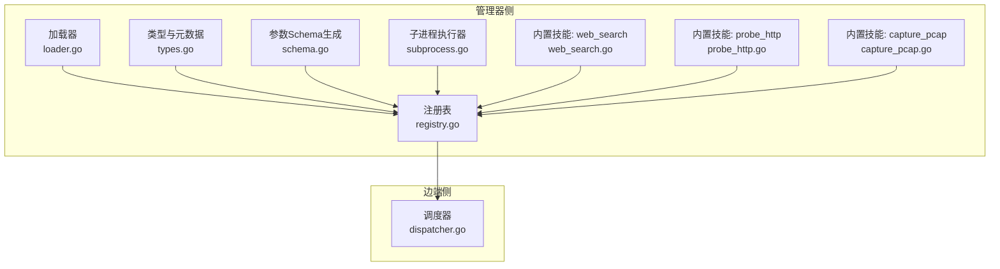
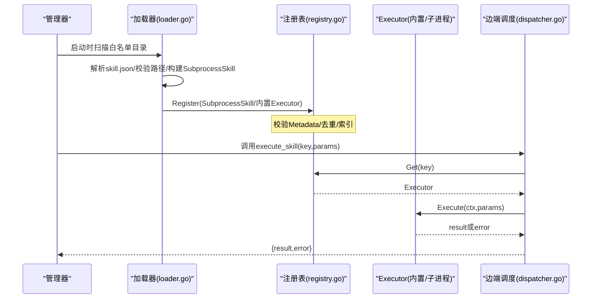
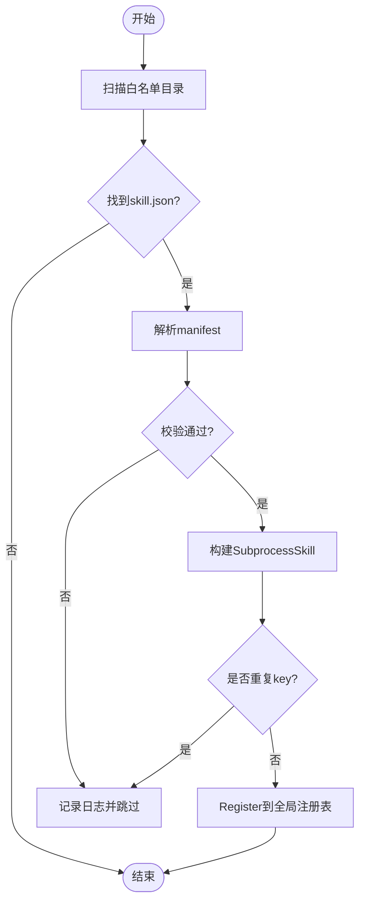
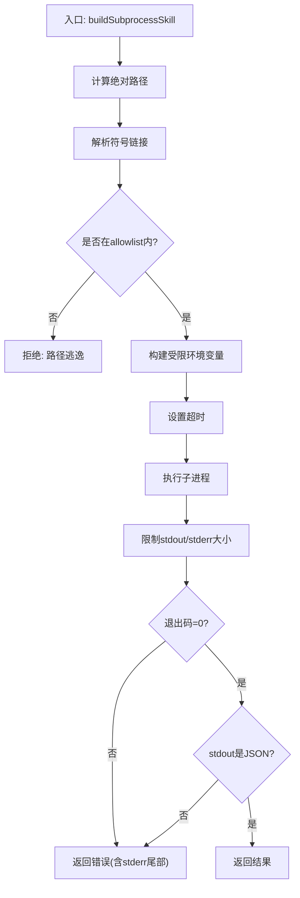
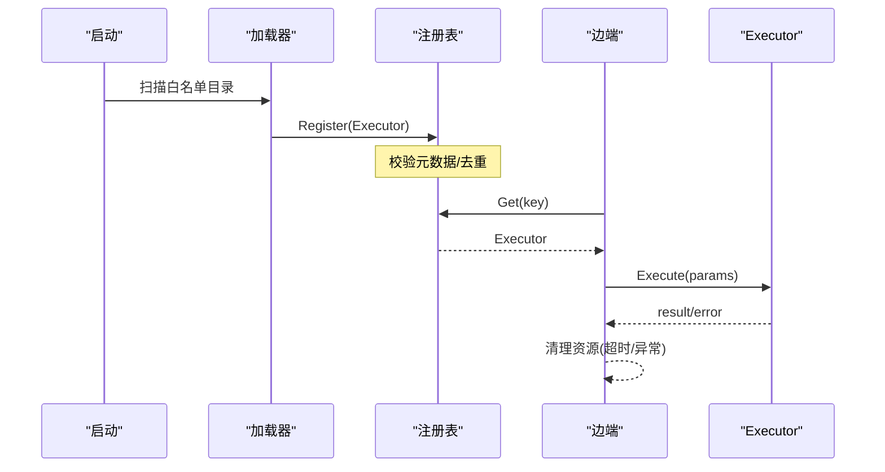
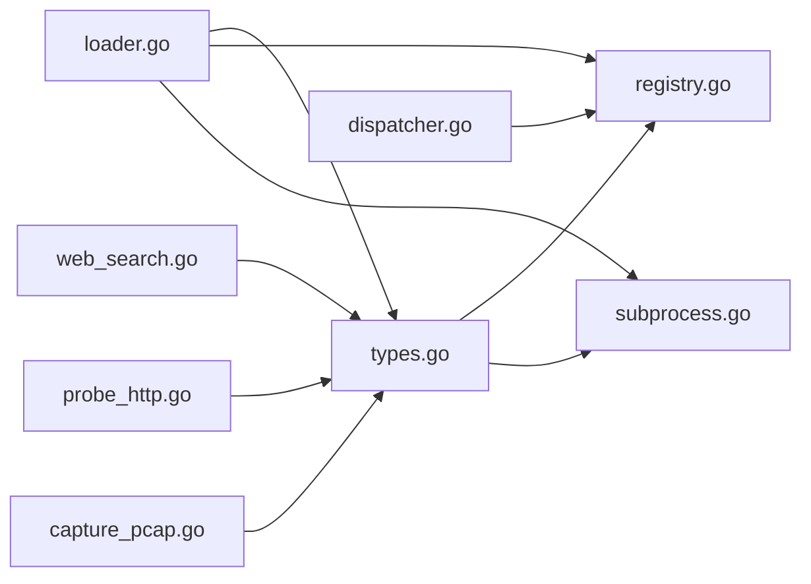

# 技能架构设计

<cite>
**本文引用的文件**
- [internal/skill/loader.go](file://internal/skill/loader.go)
- [internal/skill/registry.go](file://internal/skill/registry.go)
- [internal/skill/types.go](file://internal/skill/types.go)
- [internal/skill/schema.go](file://internal/skill/schema.go)
- [internal/skill/subprocess.go](file://internal/skill/subprocess.go)
- [internal/edgeagent/skill/dispatcher.go](file://internal/edgeagent/skill/dispatcher.go)
- [internal/skill/builtin/capture_pcap.go](file://internal/skill/builtin/capture_pcap.go)
- [internal/skill/builtin/probe_http.go](file://internal/skill/builtin/probe_http.go)
- [internal/skill/builtin/web_search.go](file://internal/skill/builtin/web_search.go)
- [skills/bash/SKILL.md](file://skills/bash/SKILL.md)
</cite>

## 目录
1. [简介](#简介)
2. [项目结构](#项目结构)
3. [核心组件](#核心组件)
4. [架构总览](#架构总览)
5. [详细组件分析](#详细组件分析)
6. [依赖关系分析](#依赖关系分析)
7. [性能考量](#性能考量)
8. [故障排查指南](#故障排查指南)
9. [结论](#结论)
10. [附录](#附录)

## 简介
本技术文档系统性阐述 Ongrid 技能系统（Skill System）的架构设计与实现细节，重点覆盖：
- 技能注册机制：清单解析、路径校验与安全沙箱隔离
- 技能分类体系与执行环境隔离：safe/mutating/dangerous 与 host/manager 作用域
- 技能加载器：目录扫描、配置文件解析与依赖管理
- 生命周期管理：从注册到执行的完整流程
- 架构图表与组件交互：技能系统与核心系统的集成方式
- 安全考虑与最佳实践建议

## 项目结构
技能系统围绕“声明式元数据 + 可执行体”的模式组织：
- 元数据与接口定义位于 internal/skill/types.go
- 注册表与查询在 internal/skill/registry.go
- 子进程技能运行器在 internal/skill/subprocess.go
- 外部技能包加载器在 internal/skill/loader.go
- 边端调度入口在 internal/edgeagent/skill/dispatcher.go
- 内置技能示例在 internal/skill/builtin/*（如 capture_pcap、probe_http、web_search）
- 外部技能包以 SKILL.md 描述能力与策略（如 skills/bash/SKILL.md）

图表来源
- [internal/skill/loader.go:75-160](file://internal/skill/loader.go#L75-L160)
- [internal/skill/registry.go:17-47](file://internal/skill/registry.go#L17-L47)
- [internal/skill/types.go:99-175](file://internal/skill/types.go#L99-L175)
- [internal/skill/schema.go:5-20](file://internal/skill/schema.go#L5-L20)
- [internal/skill/subprocess.go:30-78](file://internal/skill/subprocess.go#L30-L78)
- [internal/skill/builtin/web_search.go:161-195](file://internal/skill/builtin/web_search.go#L161-L195)
- [internal/skill/builtin/probe_http.go:23-47](file://internal/skill/builtin/probe_http.go#L23-L47)
- [internal/skill/builtin/capture_pcap.go:26-45](file://internal/skill/builtin/capture_pcap.go#L26-L45)
- [internal/edgeagent/skill/dispatcher.go:16-44](file://internal/edgeagent/skill/dispatcher.go#L16-L44)

章节来源
- [internal/skill/loader.go:75-160](file://internal/skill/loader.go#L75-L160)
- [internal/skill/registry.go:17-47](file://internal/skill/registry.go#L17-L47)
- [internal/skill/types.go:99-175](file://internal/skill/types.go#L99-L175)
- [internal/skill/schema.go:5-20](file://internal/skill/schema.go#L5-L20)
- [internal/skill/subprocess.go:30-78](file://internal/skill/subprocess.go#L30-L78)
- [internal/edgeagent/skill/dispatcher.go:16-44](file://internal/edgeagent/skill/dispatcher.go#L16-L44)

## 核心组件
- 元数据与接口
  - Executor 接口：提供 Metadata() 与 Execute(ctx, params)
  - Metadata：Key/Name/Description/Class/Scope/Category/Params/ResultPreview
  - ParamSchema：声明式参数定义，自动转换为 JSON Schema
- 注册表
  - 全局 Registry：线程安全的技能注册与查询
  - Register/Get/All/AllByClass：按 Key 查找、按 Class 过滤
- 加载器
  - LoadDirs：遍历白名单目录，发现 skill.json 并构建 SubprocessSkill
  - buildSubprocessSkill：校验 Name/Description/Entry，强制 ScopeManager，限制 Class
  - 路径安全：绝对路径、符号链接解析、allowlist 根目录前缀检查
- 子进程执行器
  - SubprocessSkill：以独立进程运行外部二进制，stdin/stdout 传输 JSON
  - 资源保护：stdout/stderr 上限、超时控制、环境变量白名单
- 边端调度器
  - Dispatch：接收 execute_skill RPC，按 Key 分发到 Executor.Execute
- 内置技能
  - web_search：联网搜索（searxng/tavily/brave），ScopeManager，ClassSafe
  - probe_http：HTTP 探测（GET/HEAD），ClassSafe
  - capture_pcap：抓包任务（mutating），需边端执行

章节来源
- [internal/skill/types.go:99-175](file://internal/skill/types.go#L99-L175)
- [internal/skill/registry.go:17-47](file://internal/skill/registry.go#L17-L47)
- [internal/skill/loader.go:179-253](file://internal/skill/loader.go#L179-L253)
- [internal/skill/subprocess.go:30-78](file://internal/skill/subprocess.go#L30-L78)
- [internal/edgeagent/skill/dispatcher.go:16-44](file://internal/edgeagent/skill/dispatcher.go#L16-L44)
- [internal/skill/builtin/web_search.go:161-195](file://internal/skill/builtin/web_search.go#L161-L195)
- [internal/skill/builtin/probe_http.go:23-47](file://internal/skill/builtin/probe_http.go#L23-L47)
- [internal/skill/builtin/capture_pcap.go:26-45](file://internal/skill/builtin/capture_pcap.go#L26-L45)

## 架构总览
技能系统采用“声明式注册 + 统一调度”的架构。管理器侧负责发现、校验与注册技能；边端侧通过统一的 execute_skill 路由将请求分发给对应 Executor。

图表来源
- [internal/skill/loader.go:75-160](file://internal/skill/loader.go#L75-L160)
- [internal/skill/registry.go:59-82](file://internal/skill/registry.go#L59-L82)
- [internal/edgeagent/skill/dispatcher.go:24-44](file://internal/edgeagent/skill/dispatcher.go#L24-L44)

## 详细组件分析

### 技能注册机制与清单解析
- 清单格式：SkillManifest（name/description/schema/entry/env_allow/timeout_seconds/class/category）
- 解析流程：LoadDirs -> loadOneDir -> parseManifest -> buildSubprocessSkill -> Register
- 关键校验：
  - name 必须为 lower_snake，description/entry 必填
  - entry 必须为绝对路径，且解析后位于 allowlist 根目录下（防逃逸）
  - class 仅允许 safe/mutating/dangerous，未设置默认 safe
  - category 未设置默认 external
- 并发与健壮性：
  - 重复 key 跳过而非崩溃
  - 单个 manifest 解析失败不影响其他技能加载

图表来源
- [internal/skill/loader.go:75-160](file://internal/skill/loader.go#L75-L160)
- [internal/skill/loader.go:179-253](file://internal/skill/loader.go#L179-L253)

章节来源
- [internal/skill/loader.go:75-160](file://internal/skill/loader.go#L75-L160)
- [internal/skill/loader.go:179-253](file://internal/skill/loader.go#L179-L253)

### 路径验证与安全沙箱隔离
- 路径安全：
  - 使用 filepath.Abs/EvalSymlinks 规范化路径
  - pathHasPrefix 确保 entry 始终位于 allowlist 根目录下
- 执行环境隔离：
  - 子进程默认无继承环境变量，仅 EnvAllow 白名单变量注入
  - stdout/stderr 有上限，防止内存耗尽
  - 超时控制：默认 30s，可通过 manifest 配置
- 作用域隔离：
  - SubprocessSkill 强制 ScopeManager，避免在边端执行不可信二进制
  - 边端仅处理已注册的 Executor，未知 key 返回错误

图表来源
- [internal/skill/loader.go:179-253](file://internal/skill/loader.go#L179-L253)
- [internal/skill/subprocess.go:112-172](file://internal/skill/subprocess.go#L112-L172)
- [internal/skill/subprocess.go:174-193](file://internal/skill/subprocess.go#L174-L193)

章节来源
- [internal/skill/loader.go:179-253](file://internal/skill/loader.go#L179-L253)
- [internal/skill/subprocess.go:112-172](file://internal/skill/subprocess.go#L112-L172)
- [internal/skill/subprocess.go:174-193](file://internal/skill/subprocess.go#L174-L193)

### 技能分类体系与执行环境隔离
- 分类（Class）：
  - safe：只读、无副作用（如 probe_http、web_search）
  - mutating：可逆修改（如 capture_pcap、重启服务）
  - dangerous：不可逆/集群影响（如 rm、reboot）
- 作用域（Scope）：
  - host：在目标边端执行（需 edge_id）
  - manager：在管理器进程内执行（如 web_search）
- 策略门控：
  - 框架仅强制 Class 标记，具体审批策略由管理器服务层实现
  - AI 代理可直接调用 safe 技能；mutating/dangerous 需人工审批

章节来源
- [internal/skill/types.go:18-26](file://internal/skill/types.go#L18-L26)
- [internal/skill/types.go:47-61](file://internal/skill/types.go#L47-L61)
- [internal/skill/builtin/web_search.go:161-195](file://internal/skill/builtin/web_search.go#L161-L195)
- [internal/skill/builtin/probe_http.go:23-47](file://internal/skill/builtin/probe_http.go#L23-L47)
- [internal/skill/builtin/capture_pcap.go:26-45](file://internal/skill/builtin/capture_pcap.go#L26-L45)

### 技能加载器实现原理
- 目录扫描：LoadDirs 遍历白名单目录，递归查找 skill.json
- 配置文件解析：parseManifest 读取并解码 JSON
- 依赖管理：
  - 子进程技能通过 EnvAllow 显式注入所需环境变量
  - 内置技能通过 init() 直接注册，无需外部依赖
- 错误处理：单个 manifest 失败不影响整体加载

章节来源
- [internal/skill/loader.go:75-160](file://internal/skill/loader.go#L75-L160)
- [internal/skill/loader.go:163-174](file://internal/skill/loader.go#L163-L174)
- [internal/skill/subprocess.go:174-193](file://internal/skill/subprocess.go#L174-L193)

### 技能生命周期管理
- 注册阶段：
  - 加载器发现并校验 manifest
  - 构建 Executor 并注册到全局注册表
- 执行阶段：
  - 边端调度器接收 execute_skill RPC
  - 根据 Key 查找 Executor 并调用 Execute
  - 返回结果或错误
- 清理阶段：
  - 子进程超时或异常退出时释放资源

图表来源
- [internal/skill/loader.go:75-160](file://internal/skill/loader.go#L75-L160)
- [internal/skill/registry.go:59-82](file://internal/skill/registry.go#L59-L82)
- [internal/edgeagent/skill/dispatcher.go:24-44](file://internal/edgeagent/skill/dispatcher.go#L24-L44)

章节来源
- [internal/skill/loader.go:75-160](file://internal/skill/loader.go#L75-L160)
- [internal/skill/registry.go:59-82](file://internal/skill/registry.go#L59-L82)
- [internal/edgeagent/skill/dispatcher.go:24-44](file://internal/edgeagent/skill/dispatcher.go#L24-L44)

### 与核心系统的集成方式
- 管理器侧：
  - 通过 All()/AllByClass() 枚举技能，生成 LLM 工具列表
  - 通过 HTTP /skills 接口暴露技能清单
- 边端侧：
  - 通过 tunnel MethodExecuteSkill 调用边端调度器
  - 统一路由到对应 Executor
- UI 集成：
  - 基于 Metadata.Params 自动生成表单
  - 基于 Class/Category 进行分组和权限控制

章节来源
- [internal/skill/registry.go:42-54](file://internal/skill/registry.go#L42-L54)
- [internal/skill/types.go:99-125](file://internal/skill/types.go#L99-L125)
- [internal/edgeagent/skill/dispatcher.go:16-44](file://internal/edgeagent/skill/dispatcher.go#L16-L44)

## 依赖关系分析
技能系统内部依赖清晰，模块职责单一：
- loader.go 依赖 types.go、registry.go、subprocess.go
- registry.go 依赖 types.go
- subprocess.go 依赖 types.go
- dispatcher.go 依赖 registry.go
- 内置技能依赖 types.go 并通过 init() 注册

图表来源
- [internal/skill/loader.go:1-11](file://internal/skill/loader.go#L1-L11)
- [internal/skill/registry.go:1-8](file://internal/skill/registry.go#L1-L8)
- [internal/skill/subprocess.go:1-15](file://internal/skill/subprocess.go#L1-L15)
- [internal/edgeagent/skill/dispatcher.go:1-14](file://internal/edgeagent/skill/dispatcher.go#L1-L14)
- [internal/skill/builtin/web_search.go:1-17](file://internal/skill/builtin/web_search.go#L1-L17)
- [internal/skill/builtin/probe_http.go:1-13](file://internal/skill/builtin/probe_http.go#L1-L13)
- [internal/skill/builtin/capture_pcap.go:1-9](file://internal/skill/builtin/capture_pcap.go#L1-L9)

章节来源
- [internal/skill/loader.go:1-11](file://internal/skill/loader.go#L1-L11)
- [internal/skill/registry.go:1-8](file://internal/skill/registry.go#L1-L8)
- [internal/skill/subprocess.go:1-15](file://internal/skill/subprocess.go#L1-L15)
- [internal/edgeagent/skill/dispatcher.go:1-14](file://internal/edgeagent/skill/dispatcher.go#L1-L14)

## 性能考量
- 子进程资源限制：
  - stdout 上限 16 MiB，stderr 尾部保留 4 KiB
  - 默认超时 30s，可配置
- 内存保护：
  - cappedWriter 丢弃超出限制的输出，防止内存耗尽
- 并发安全：
  - 注册表使用 RWMutex 保护并发读写
- 网络优化：
  - web_search 支持多 provider，可缓存配置解析结果

章节来源
- [internal/skill/subprocess.go:17-28](file://internal/skill/subprocess.go#L17-L28)
- [internal/skill/subprocess.go:240-267](file://internal/skill/subprocess.go#L240-L267)
- [internal/skill/registry.go:21-24](file://internal/skill/registry.go#L21-L24)
- [internal/skill/builtin/web_search.go:48-66](file://internal/skill/builtin/web_search.go#L48-L66)

## 故障排查指南
- 常见错误：
  - 未知技能 key：检查注册表是否正确加载
  - 路径逃逸：确认 entry 位于 allowlist 根目录下
  - 子进程超时：调整 timeout_seconds 或优化外部脚本
  - 环境变量缺失：在 EnvAllow 中显式添加所需变量
- 调试技巧：
  - 查看加载器日志，确认 manifest 解析状态
  - 检查子进程 stderr 尾部信息
  - 验证 JSON Schema 是否符合预期

章节来源
- [internal/skill/loader.go:115-160](file://internal/skill/loader.go#L115-L160)
- [internal/skill/subprocess.go:112-172](file://internal/skill/subprocess.go#L112-L172)
- [internal/edgeagent/skill/dispatcher.go:24-44](file://internal/edgeagent/skill/dispatcher.go#L24-L44)

## 结论
Ongrid 技能系统通过声明式元数据、严格的路径校验和环境隔离，实现了安全、可扩展的技能生态。其模块化设计使得新增技能简单直观，同时保证了执行过程的安全性和可控性。建议在生产环境中：
- 严格配置白名单目录和环境变量
- 合理设置技能分类和作用域
- 监控子进程性能和资源使用情况
- 定期审计技能清单和策略配置

## 附录
- 外部技能包示例：skills/bash/SKILL.md 描述了 bash 技能的沙箱策略和能力白名单
- 最佳实践：
  - 明确设置技能分类和作用域
  - 最小化环境变量注入
  - 使用结构化参数而非自由文本
  - 定期更新技能清单和策略

章节来源
- [skills/bash/SKILL.md:1-188](file://skills/bash/SKILL.md#L1-L188)