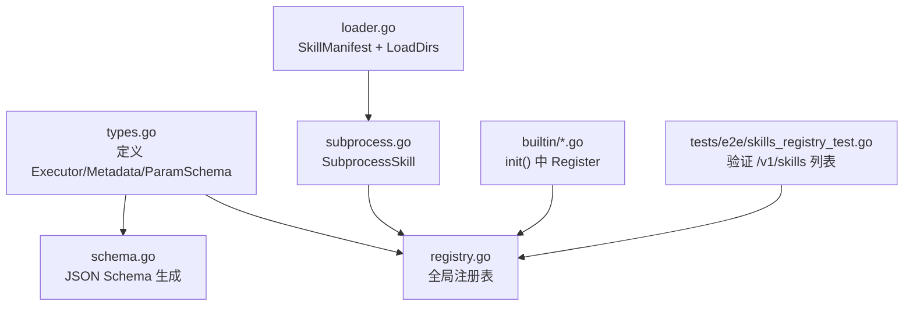
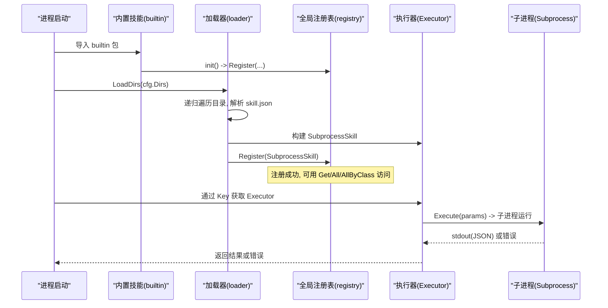
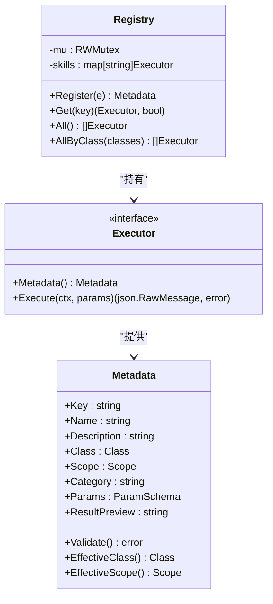
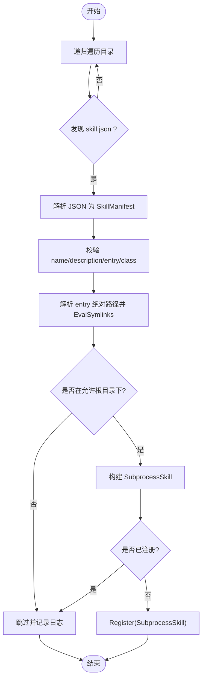
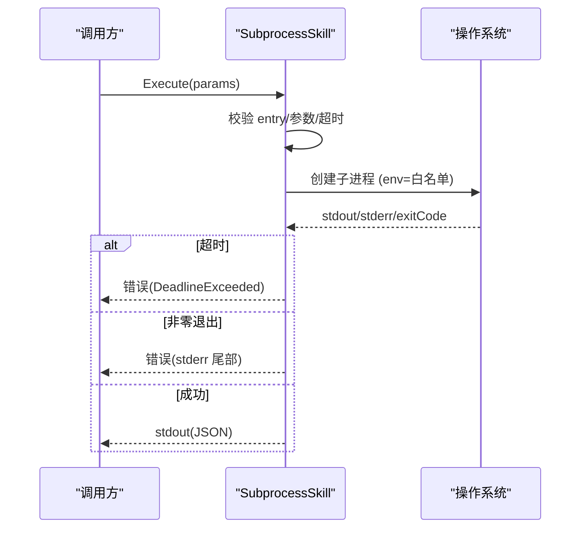
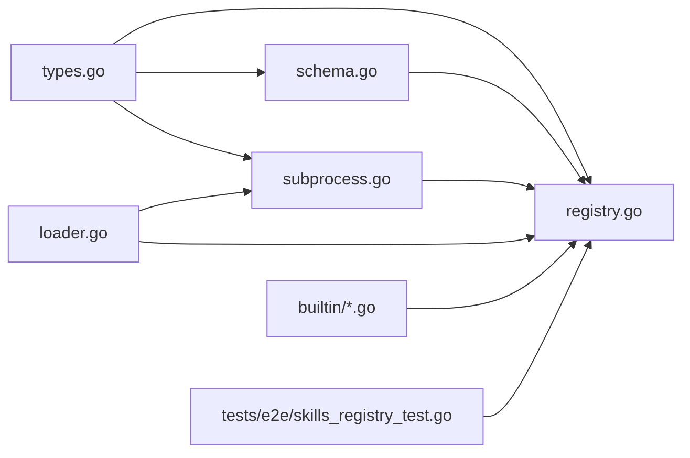

# 技能注册机制

<cite>
**本文引用的文件**
- [internal/skill/registry.go](file://internal/skill/registry.go)
- [internal/skill/types.go](file://internal/skill/types.go)
- [internal/skill/schema.go](file://internal/skill/schema.go)
- [internal/skill/loader.go](file://internal/skill/loader.go)
- [internal/skill/subprocess.go](file://internal/skill/subprocess.go)
- [internal/skill/builtin/doc.go](file://internal/skill/builtin/doc.go)
- [internal/skill/builtin/web_search.go](file://internal/skill/builtin/web_search.go)
- [tests/e2e/skills_registry_test.go](file://tests/e2e/skills_registry_test.go)
</cite>

## 目录
1. [简介](#简介)
2. [项目结构](#项目结构)
3. [核心组件](#核心组件)
4. [架构总览](#架构总览)
5. [详细组件分析](#详细组件分析)
6. [依赖关系分析](#依赖关系分析)
7. [性能考量](#性能考量)
8. [故障排查指南](#故障排查指南)
9. [结论](#结论)
10. [附录：注册与管理示例](#附录注册与管理示例)

## 简介
本技术文档围绕 ongrid 的“技能（Skill）”注册机制展开，系统性说明全局注册表、技能元数据验证与存储、技能清单（SkillManifest）结构与校验规则、安全分类体系（safe/mutating/dangerous）、子进程技能加载器的目录扫描算法与依赖管理，以及完整的注册流程与错误处理。同时提供基于代码路径的示例，帮助读者正确注册和管理技能。

## 项目结构
技能子系统位于 internal/skill 包，核心由以下模块组成：
- 类型与接口：types.go（Executor、Metadata、ParamSchema、Class、Scope 等）
- 注册表：registry.go（全局注册表、并发安全、按类过滤）
- 清单与加载器：loader.go（SkillManifest、LoadDirs、解析与构建 SubprocessSkill）
- 子进程执行器：subprocess.go（安全隔离、超时、环境变量白名单、输出限制）
- Schema 生成：schema.go（将 ParamSchema 转为 JSON Schema）
- 内置技能：builtin/*（通过 init() 调用 Register 自动注册）
- 端到端测试：tests/e2e/skills_registry_test.go（验证注册表可枚举、包含预期技能）

图表来源
- [internal/skill/types.go:99-203](file://internal/skill/types.go#L99-L203)
- [internal/skill/registry.go:10-116](file://internal/skill/registry.go#L10-L116)
- [internal/skill/loader.go:13-254](file://internal/skill/loader.go#L13-L254)
- [internal/skill/subprocess.go:30-172](file://internal/skill/subprocess.go#L30-L172)
- [internal/skill/builtin/doc.go:1-26](file://internal/skill/builtin/doc.go#L1-L26)
- [tests/e2e/skills_registry_test.go:33-134](file://tests/e2e/skills_registry_test.go#L33-L134)

章节来源
- [internal/skill/types.go:1-241](file://internal/skill/types.go#L1-L241)
- [internal/skill/registry.go:1-127](file://internal/skill/registry.go#L1-L127)
- [internal/skill/loader.go:1-274](file://internal/skill/loader.go#L1-L274)
- [internal/skill/subprocess.go:1-268](file://internal/skill/subprocess.go#L1-L268)
- [internal/skill/builtin/doc.go:1-26](file://internal/skill/builtin/doc.go#L1-L26)
- [tests/e2e/skills_registry_test.go:1-145](file://tests/e2e/skills_registry_test.go#L1-L145)

## 核心组件
- 全局注册表（Registry）：进程级技能目录，支持注册、查询、全量列举、按类别过滤；读写并发安全。
- 技能元数据（Metadata）：描述技能的 Key、Name、Description、Class、Scope、Category、Params、ResultPreview，并提供 Validate 校验。
- 参数 Schema（ParamSchema）：声明式参数定义，可转换为 OpenAI function-calling 兼容的 JSON Schema。
- 子进程技能（SubprocessSkill）：以独立进程运行外部可执行文件，严格限制环境变量、超时、输出大小，确保安全性。
- 清单加载器（Loader）：递归扫描配置目录，解析 skill.json，构建并注册 SubprocessSkill，具备路径白名单校验与重复保护。
- 内置技能（builtin）：通过 init() 调用 Register 自动注册到全局注册表，无需显式启动逻辑。

章节来源
- [internal/skill/registry.go:10-116](file://internal/skill/registry.go#L10-L116)
- [internal/skill/types.go:99-203](file://internal/skill/types.go#L99-L203)
- [internal/skill/schema.go:5-96](file://internal/skill/schema.go#L5-L96)
- [internal/skill/loader.go:13-254](file://internal/skill/loader.go#L13-L254)
- [internal/skill/subprocess.go:30-172](file://internal/skill/subprocess.go#L30-L172)
- [internal/skill/builtin/doc.go:1-26](file://internal/skill/builtin/doc.go#L1-L26)

## 架构总览
技能注册与执行的整体流程如下：
- 启动阶段：
  - 内置技能在包初始化时调用 Register 进入全局注册表。
  - Loader 根据配置目录递归扫描 skill.json，解析并构建 SubprocessSkill，再注册到全局注册表。
- 运行时：
  - Manager/Edge 通过 Key 从注册表获取 Executor，调用 Execute 执行。
  - 子进程技能通过 stdin/stdout 交换 JSON 参数与结果，受超时与环境变量白名单限制。

图表来源
- [internal/skill/builtin/doc.go:19-25](file://internal/skill/builtin/doc.go#L19-L25)
- [internal/skill/loader.go:69-161](file://internal/skill/loader.go#L69-L161)
- [internal/skill/registry.go:26-73](file://internal/skill/registry.go#L26-L73)
- [internal/skill/subprocess.go:99-172](file://internal/skill/subprocess.go#L99-L172)

## 详细组件分析

### 全局注册表（Registry）
- 设计要点：
  - 进程级单例 globalRegistry，使用 RWMutex 保证并发安全。
  - Register 会校验 Metadata，拒绝重复 Key，失败时 panic（作者级错误应在编译/启动期暴露）。
  - All/AllByClass 返回排序后的技能列表，便于 UI 与 LLM 工具注册。
- 关键行为：
  - Get(key) 未找到返回 (nil, false)，上层可转 404。
  - AllByClass 用于按安全类别过滤（仅 safe 可直接调用，mutating/dangerous 需审批）。

图表来源
- [internal/skill/registry.go:17-116](file://internal/skill/registry.go#L17-L116)
- [internal/skill/types.go:99-203](file://internal/skill/types.go#L99-L203)

章节来源
- [internal/skill/registry.go:10-127](file://internal/skill/registry.go#L10-L127)
- [internal/skill/types.go:99-203](file://internal/skill/types.go#L99-L203)

### 技能清单（SkillManifest）与加载器（Loader）
- SkillManifest 字段与验证规则：
  - name：必须为 lower_snake（[a-z0-9_]），作为 Key。
  - description：必填，用于 UI 与 LLM 工具描述。
  - schema：可选，若缺失则使用空对象 Schema。
  - entry：可执行入口，相对路径相对于 manifest 所在目录；绝对路径必须在允许根目录下（防逃逸）。
  - env_allow：显式白名单环境变量名，默认不继承任何环境。
  - timeout_seconds：子进程超时，0 表示使用默认 30s。
  - class：安全分类，空值默认为 safe。
  - category：分组标签，空值默认为 external。
- 目录扫描算法：
  - LoadDirs 接受一组允许目录，递归遍历每个目录查找 skill.json。
  - 对每个 skill.json 解析后构建 SubprocessSkill，并进行路径白名单校验（EvalSymlinks + pathHasPrefix）。
  - 遇到重复 Key 跳过而非崩溃，避免部署过渡期的冲突。
  - 单个清单解析/构建失败仅记录日志并跳过，不影响其他技能加载。

图表来源
- [internal/skill/loader.go:69-161](file://internal/skill/loader.go#L69-L161)
- [internal/skill/loader.go:163-254](file://internal/skill/loader.go#L163-L254)
- [internal/skill/loader.go:256-274](file://internal/skill/loader.go#L256-L274)

章节来源
- [internal/skill/loader.go:13-274](file://internal/skill/loader.go#L13-L274)

### 子进程技能（SubprocessSkill）与安全策略
- 执行模型：
  - 通过 stdin 传入 JSON 参数，stdout 返回 JSON 结果；非零退出码视为错误。
  - 强制 ScopeManager，防止在边缘节点执行不受控二进制。
  - 环境变量白名单：仅允许 env_allow 中的变量，默认不继承 PATH。
  - 超时控制：默认 30s，可通过 manifest 指定。
  - 输出限制：stdout 最大 16MiB，stderr 尾部保留 4KiB 用于诊断。
- 安全校验：
  - entry 必须为绝对路径且存在、可执行。
  - 路径必须在允许根目录下（防 ../ 逃逸与符号链接跳转）。
  - 参数 JSON 无效直接报错，避免向子进程传递非法数据。

图表来源
- [internal/skill/subprocess.go:99-172](file://internal/skill/subprocess.go#L99-L172)
- [internal/skill/subprocess.go:174-205](file://internal/skill/subprocess.go#L174-L205)
- [internal/skill/subprocess.go:207-238](file://internal/skill/subprocess.go#L207-L238)

章节来源
- [internal/skill/subprocess.go:17-268](file://internal/skill/subprocess.go#L17-L268)

### 参数 Schema 生成（ParamSchema -> JSON Schema）
- 将 ParamSchema 映射为 OpenAI function-calling 兼容的 JSON Schema：
  - string/duration -> "string"
  - int -> "integer"
  - float -> "number"
  - bool -> "boolean"
  - enum -> "string" + "enum" 数组
  - array -> "array" + items 类型
- 支持 RawSchemaProvider 覆盖默认生成，用于复杂形状（嵌套对象、oneOf 等）。

章节来源
- [internal/skill/schema.go:5-96](file://internal/skill/schema.go#L5-L96)
- [internal/skill/types.go:177-188](file://internal/skill/types.go#L177-L188)

### 安全分类体系（safe/mutating/dangerous）
- 分类定义：
  - safe：只读、无副作用（探测、读取文件、查看日志）。
  - mutating：修改边缘状态但可逆（终止进程、重启服务）。
  - dangerous：不可逆或影响集群（rm、reboot、drop table）。
- 默认策略：
  - 未设置 Class 时默认为 safe，避免作者遗漏导致危险能力上线。
  - 框架仅标记 Class，具体审批策略在 manager 服务层实现（例如 mutating 需人工审批，dangerous 需签名 SOP + 双审）。
- 过滤能力：
  - AllByClass 可按类别筛选，LLM 工具注册时仅自动启用 safe 技能，mutating/dangerous 需走工作流审批。

章节来源
- [internal/skill/types.go:18-27](file://internal/skill/types.go#L18-L27)
- [internal/skill/types.go:35-45](file://internal/skill/types.go#L35-L45)
- [internal/skill/registry.go:49-54](file://internal/skill/registry.go#L49-L54)

### 内置技能注册模式
- 通过 import _ "internal/skill/builtin" 触发包初始化，各内置技能在 init() 中调用 Register。
- 典型示例：web_search 在 init() 中注册，Metadata 明确 Class=ClassSafe、Scope=ScopeManager，并声明 Params。

章节来源
- [internal/skill/builtin/doc.go:19-25](file://internal/skill/builtin/doc.go#L19-L25)
- [internal/skill/builtin/web_search.go:19-195](file://internal/skill/builtin/web_search.go#L19-L195)

## 依赖关系分析
- 类型与接口（types.go）被所有组件引用，构成契约基础。
- 注册表（registry.go）依赖 Executor 与 Metadata，提供并发安全的存取。
- 加载器（loader.go）依赖 types、schema、subprocess，负责清单解析与构建。
- 子进程执行器（subprocess.go）依赖系统 exec，实现安全隔离与资源限制。
- 内置技能（builtin）依赖 registry 进行自注册。
- 端到端测试（skills_registry_test.go）验证注册表对外 API 的行为。

图表来源
- [internal/skill/types.go:99-203](file://internal/skill/types.go#L99-L203)
- [internal/skill/registry.go:10-116](file://internal/skill/registry.go#L10-L116)
- [internal/skill/loader.go:69-161](file://internal/skill/loader.go#L69-L161)
- [internal/skill/subprocess.go:99-172](file://internal/skill/subprocess.go#L99-L172)
- [internal/skill/builtin/doc.go:19-25](file://internal/skill/builtin/doc.go#L19-L25)
- [tests/e2e/skills_registry_test.go:33-134](file://tests/e2e/skills_registry_test.go#L33-L134)

章节来源
- [internal/skill/types.go:1-241](file://internal/skill/types.go#L1-L241)
- [internal/skill/registry.go:1-127](file://internal/skill/registry.go#L1-L127)
- [internal/skill/loader.go:1-274](file://internal/skill/loader.go#L1-L274)
- [internal/skill/subprocess.go:1-268](file://internal/skill/subprocess.go#L1-L268)
- [internal/skill/builtin/doc.go:1-26](file://internal/skill/builtin/doc.go#L1-L26)
- [tests/e2e/skills_registry_test.go:1-145](file://tests/e2e/skills_registry_test.go#L1-L145)

## 性能考量
- 注册阶段：
  - 注册表使用 RWMutex，读多写少场景高效；All/AllByClass 返回前排序，时间复杂度 O(n log n)。
- 加载阶段：
  - 目录递归遍历 O(N)，其中 N 为文件数；每个清单解析与构建为常数开销。
  - 路径白名单校验涉及 EvalSymlinks，注意文件系统 I/O 成本。
- 执行阶段：
  - 子进程启动与通信有固定开销；超时与输出限制避免资源耗尽。
  - 环境变量白名单减少不必要的环境污染与潜在泄露风险。

## 故障排查指南
- 清单解析失败：
  - 检查 skill.json 格式与必填字段（name、description、entry）。
  - 参考解析错误日志定位问题文件。
- 路径逃逸被拒：
  - 确认 entry 解析后位于允许根目录下，避免 ../ 或符号链接跳出。
- 重复 Key 被跳过：
  - 部署过渡期间可能出现新旧清单共存，确保旧清单移除后再部署新清单。
- 子进程执行失败：
  - 检查 entry 是否存在且可执行；确认参数 JSON 合法；查看 stderr 尾部信息。
  - 若超时，调整 timeout_seconds 或优化子进程逻辑。
- 环境变量未生效：
  - 确认 env_allow 包含所需变量名（如 PATH、API_KEY）。

章节来源
- [internal/skill/loader.go:115-161](file://internal/skill/loader.go#L115-L161)
- [internal/skill/loader.go:176-254](file://internal/skill/loader.go#L176-L254)
- [internal/skill/subprocess.go:112-172](file://internal/skill/subprocess.go#L112-L172)
- [internal/skill/subprocess.go:174-205](file://internal/skill/subprocess.go#L174-L205)

## 结论
ongrid 的技能注册机制通过清晰的分层设计与严格的安全策略，实现了可扩展、可审计、可治理的能力体系。全局注册表提供并发安全的技能目录；清单加载器确保外部技能的安全接入；子进程执行器保障执行隔离与资源限制；安全分类体系配合审批策略控制风险。该机制既支持内置 Go 技能，也支持外部脚本/二进制技能，满足多样化运维场景。

## 附录：注册与管理示例
以下为基于代码路径的示例指引，展示如何正确注册与管理技能：

- 注册内置技能（Go 实现）
  - 在包的 init() 中调用 Register，参考：
    - [internal/skill/builtin/web_search.go:19-195](file://internal/skill/builtin/web_search.go#L19-L195)
  - 通过 import _ "internal/skill/builtin" 触发注册，参考：
    - [internal/skill/builtin/doc.go:19-25](file://internal/skill/builtin/doc.go#L19-L25)

- 注册外部技能（子进程）
  - 在目标目录创建 skill.json，字段包括 name、description、entry、env_allow、timeout_seconds、class、category，参考：
    - [internal/skill/loader.go:13-53](file://internal/skill/loader.go#L13-L53)
  - 使用 Loader 扫描目录并注册，参考：
    - [internal/skill/loader.go:69-161](file://internal/skill/loader.go#L69-L161)
  - 构建与校验过程，参考：
    - [internal/skill/loader.go:176-254](file://internal/skill/loader.go#L176-L254)

- 查询与过滤技能
  - 通过 Key 获取 Executor，参考：
    - [internal/skill/registry.go:35-40](file://internal/skill/registry.go#L35-L40)
  - 列出全部或按类别过滤，参考：
    - [internal/skill/registry.go:42-54](file://internal/skill/registry.go#L42-L54)

- 端到端验证
  - 通过 HTTP API GET /api/v1/skills 验证注册表内容，参考：
    - [tests/e2e/skills_registry_test.go:33-134](file://tests/e2e/skills_registry_test.go#L33-L134)

- 子进程执行与错误处理
  - 执行参数与返回值约定，参考：
    - [internal/skill/subprocess.go:99-172](file://internal/skill/subprocess.go#L99-L172)
  - 环境变量白名单与超时控制，参考：
    - [internal/skill/subprocess.go:174-205](file://internal/skill/subprocess.go#L174-L205)
    - [internal/skill/subprocess.go:145-160](file://internal/skill/subprocess.go#L145-L160)