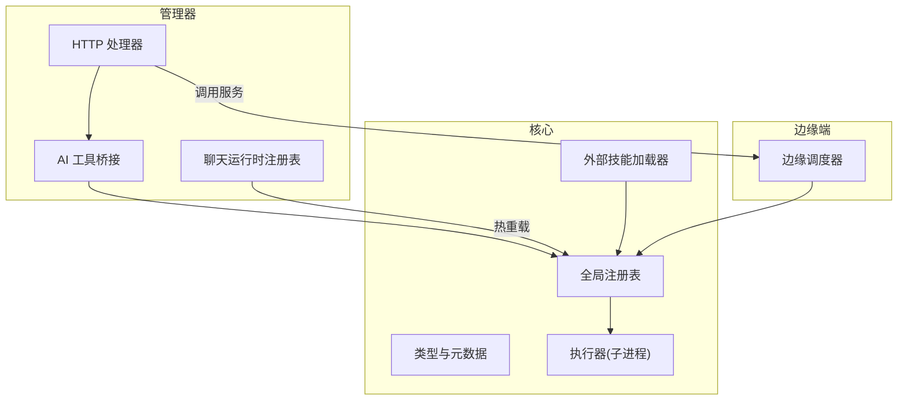
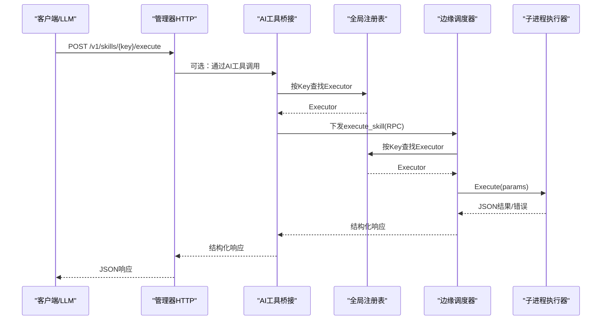
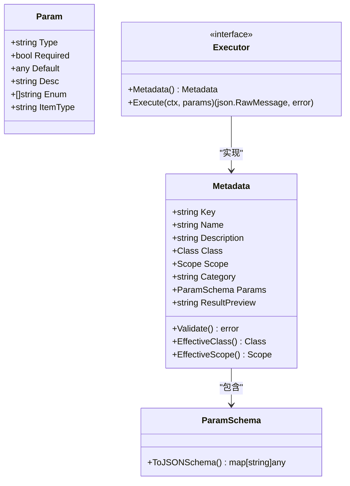
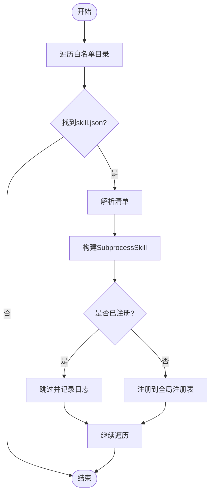
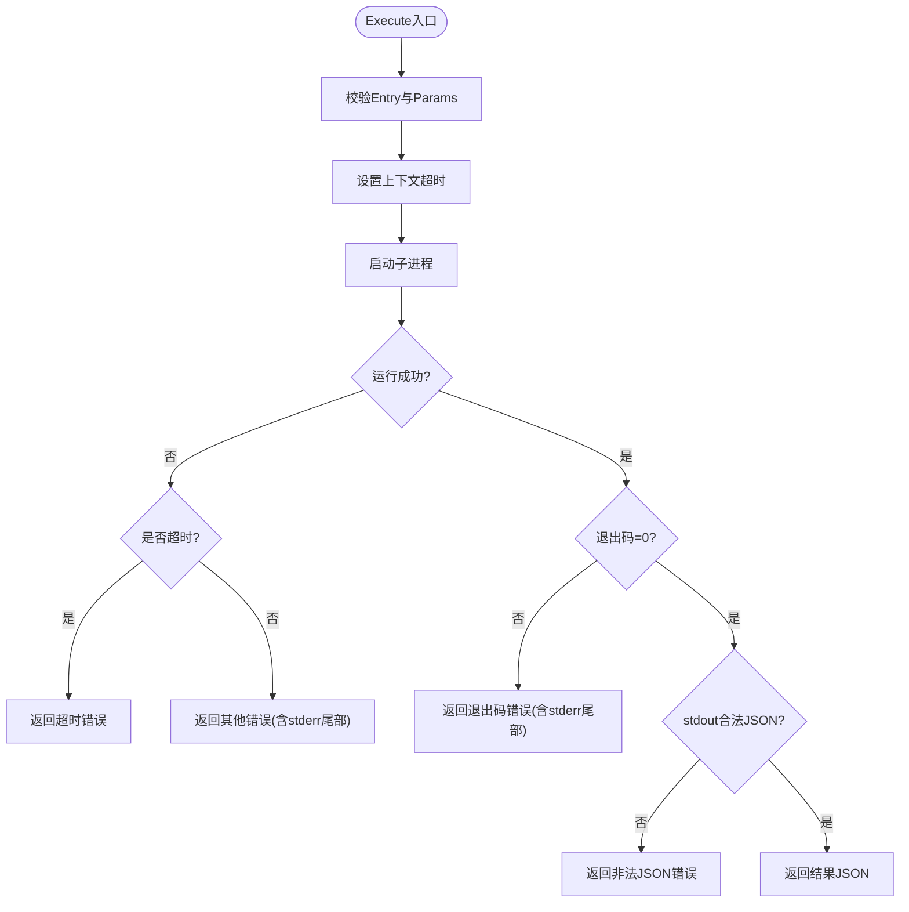
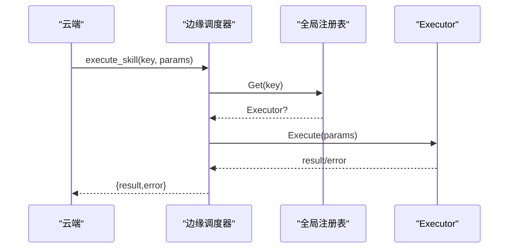
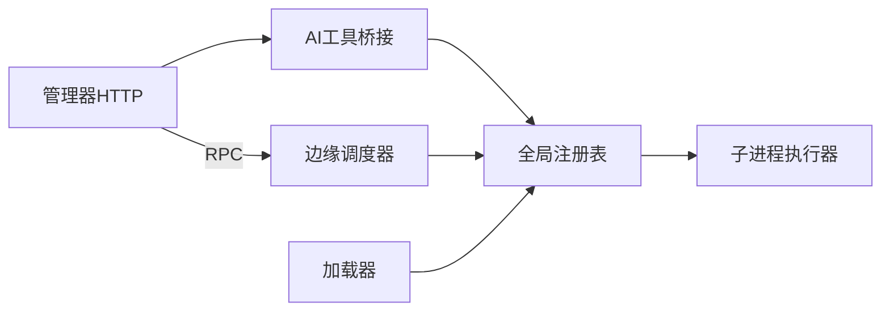

# 技能生命周期管理

<cite>
**本文引用的文件**
- [internal/skill/types.go](file://internal/skill/types.go)
- [internal/skill/registry.go](file://internal/skill/registry.go)
- [internal/skill/loader.go](file://internal/skill/loader.go)
- [internal/skill/subprocess.go](file://internal/skill/subprocess.go)
- [internal/skill/schema.go](file://internal/skill/schema.go)
- [internal/edgeagent/skill/dispatcher.go](file://internal/edgeagent/skill/dispatcher.go)
- [internal/manager/server/skill/http.go](file://internal/manager/server/skill/http.go)
- [internal/manager/biz/aiops/tools/skill_bridge.go](file://internal/manager/biz/aiops/tools/skill_bridge.go)
- [internal/manager/biz/aiops/chatruntime/skill_registry.go](file://internal/manager/biz/aiops/chatruntime/skill_registry.go)
</cite>

## 目录
1. [简介](#简介)
2. [项目结构](#项目结构)
3. [核心组件](#核心组件)
4. [架构总览](#架构总览)
5. [详细组件分析](#详细组件分析)
6. [依赖关系分析](#依赖关系分析)
7. [性能考量](#性能考量)
8. [故障排查指南](#故障排查指南)
9. [结论](#结论)
10. [附录：API与使用示例](#附录api与使用示例)

## 简介
本技术文档围绕“技能（Skill）”的完整生命周期展开，覆盖从发现、加载、注册到执行的全流程；重点说明子进程型外部技能的热重载机制、版本管理与冲突解决策略；阐述健康检查与状态监控（执行跟踪、错误处理与恢复）；解释卸载与清理流程（资源释放与依赖解除）；并提供部署最佳实践、运维指南以及具体的API接口说明与使用示例。

## 项目结构
技能框架由“核心定义 + 注册表 + 加载器 + 执行器 + 边缘调度 + 管理器HTTP + AI工具桥接 + 聊天运行时注册表”组成，形成清晰的职责分层：
- 核心定义：统一元数据、权限分类、作用域、参数Schema等基础类型
- 注册表：进程内全局技能索引，提供并发安全的增删查
- 加载器：扫描外部目录，解析manifest并构建可执行实例
- 执行器：封装具体执行逻辑（如子进程执行）
- 边缘调度：将云端RPC分发到本地注册表并执行
- 管理器HTTP：对外暴露技能列表、详情与执行接口
- AI工具桥接：将安全类技能自动注册为LLM可调用的工具
- 聊天运行时注册表：支持SKILL.md驱动的技能热重载

图表来源
- [internal/manager/server/skill/http.go:1-163](file://internal/manager/server/skill/http.go#L1-L163)
- [internal/manager/biz/aiops/tools/skill_bridge.go:1-250](file://internal/manager/biz/aiops/tools/skill_bridge.go#L1-L250)
- [internal/manager/biz/aiops/chatruntime/skill_registry.go:1-240](file://internal/manager/biz/aiops/chatruntime/skill_registry.go#L1-L240)
- [internal/skill/registry.go:1-127](file://internal/skill/registry.go#L1-L127)
- [internal/skill/loader.go:1-274](file://internal/skill/loader.go#L1-L274)
- [internal/skill/subprocess.go:1-268](file://internal/skill/subprocess.go#L1-L268)
- [internal/edgeagent/skill/dispatcher.go:1-56](file://internal/edgeagent/skill/dispatcher.go#L1-L56)

章节来源
- [internal/skill/types.go:1-241](file://internal/skill/types.go#L1-L241)
- [internal/skill/registry.go:1-127](file://internal/skill/registry.go#L1-L127)
- [internal/skill/loader.go:1-274](file://internal/skill/loader.go#L1-L274)
- [internal/skill/subprocess.go:1-268](file://internal/skill/subprocess.go#L1-L268)
- [internal/skill/schema.go:1-96](file://internal/skill/schema.go#L1-L96)
- [internal/edgeagent/skill/dispatcher.go:1-56](file://internal/edgeagent/skill/dispatcher.go#L1-L56)
- [internal/manager/server/skill/http.go:1-163](file://internal/manager/server/skill/http.go#L1-L163)
- [internal/manager/biz/aiops/tools/skill_bridge.go:1-250](file://internal/manager/biz/aiops/tools/skill_bridge.go#L1-L250)
- [internal/manager/biz/aiops/chatruntime/skill_registry.go:1-240](file://internal/manager/biz/aiops/chatruntime/skill_registry.go#L1-L240)

## 核心组件
- 类型与元数据：定义技能的权限分类（safe/mutating/dangerous）、作用域（host/manager）、参数Schema、校验规则等
- 全局注册表：线程安全的技能索引，提供按Key查找、按Class过滤、全量枚举能力
- 外部技能加载器：扫描配置目录，解析skill.json清单，构建SubprocessSkill并注册；包含路径白名单、符号链接校验、重复键跳过等安全与健壮性措施
- 子进程执行器：以独立进程运行外部二进制，通过stdin/stdout交换JSON；具备超时控制、输出大小限制、环境变量白名单、错误信息裁剪等
- 边缘调度器：接收云端execute_skill RPC，按Key分发给本地Executor执行并返回结构化结果或错误
- 管理器HTTP：提供列出技能、获取技能详情、在指定边缘执行技能的REST接口
- AI工具桥接：将安全类技能自动注册为LLM可调用的工具，自动注入设备ID、构造Schema、路由执行
- 聊天运行时注册表：基于SKILL.md与插件容器进行技能发现与热重载，原子替换内部快照，保证并发安全

章节来源
- [internal/skill/types.go:1-241](file://internal/skill/types.go#L1-L241)
- [internal/skill/registry.go:1-127](file://internal/skill/registry.go#L1-L127)
- [internal/skill/loader.go:1-274](file://internal/skill/loader.go#L1-L274)
- [internal/skill/subprocess.go:1-268](file://internal/skill/subprocess.go#L1-L268)
- [internal/edgeagent/skill/dispatcher.go:1-56](file://internal/edgeagent/skill/dispatcher.go#L1-L56)
- [internal/manager/server/skill/http.go:1-163](file://internal/manager/server/skill/http.go#L1-L163)
- [internal/manager/biz/aiops/tools/skill_bridge.go:1-250](file://internal/manager/biz/aiops/tools/skill_bridge.go#L1-L250)
- [internal/manager/biz/aiops/chatruntime/skill_registry.go:1-240](file://internal/manager/biz/aiops/chatruntime/skill_registry.go#L1-L240)

## 架构总览
技能生命周期分为以下阶段：
- 发现：加载器扫描外部目录；聊天运行时扫描SKILL.md与插件容器
- 加载：解析清单/描述，构建执行器实例，完成参数Schema生成
- 注册：写入全局注册表，进行元数据校验与冲突检测
- 执行：管理器HTTP或AI工具桥接发起调用，边缘调度器分发至本地Executor执行
- 监控：执行过程具备超时、输出限流、错误捕获与审计
- 热重载：聊天运行时支持Reload原子替换，避免重启更新
- 卸载与清理：移除清单后不再被扫描；子进程退出时释放资源；注册表无显式删除但可通过重新加载覆盖

图表来源
- [internal/manager/server/skill/http.go:1-163](file://internal/manager/server/skill/http.go#L1-L163)
- [internal/manager/biz/aiops/tools/skill_bridge.go:1-250](file://internal/manager/biz/aiops/tools/skill_bridge.go#L1-L250)
- [internal/edgeagent/skill/dispatcher.go:1-56](file://internal/edgeagent/skill/dispatcher.go#L1-L56)
- [internal/skill/registry.go:1-127](file://internal/skill/registry.go#L1-L127)
- [internal/skill/subprocess.go:1-268](file://internal/skill/subprocess.go#L1-L268)

## 详细组件分析

### 类型与元数据（types.go）
- 权限分类：safe（只读）、mutating（可逆修改）、dangerous（不可逆/集群影响）
- 作用域：host（在边缘执行）、manager（在管理器进程执行）
- 参数Schema：声明式ParamSchema与RawSchemaProvider扩展，兼容复杂结构
- 元数据校验：启动时校验Key命名、必填字段、Class/Scope合法性、参数类型与默认值一致性

图表来源
- [internal/skill/types.go:1-241](file://internal/skill/types.go#L1-L241)

章节来源
- [internal/skill/types.go:1-241](file://internal/skill/types.go#L1-L241)

### 全局注册表（registry.go）
- 并发安全：读写锁保护，初始化阶段单线程注册，运行期并发读取
- 功能：Register、Get、All、AllByClass；重复Key与无效元数据会panic，确保作者级错误尽早暴露
- 用途：管理器枚举技能、AI工具注册、边缘调度分发

章节来源
- [internal/skill/registry.go:1-127](file://internal/skill/registry.go#L1-L127)

### 外部技能加载器（loader.go）
- 扫描白名单目录，递归查找skill.json
- 解析清单并构建SubprocessSkill，强制作用域为manager，校验入口路径位于允许根目录，防止逃逸
- 重复键跳过而非崩溃，提升热重载期间的健壮性
- 日志记录每个注册/跳过事件，便于审计

图表来源
- [internal/skill/loader.go:1-274](file://internal/skill/loader.go#L1-L274)

章节来源
- [internal/skill/loader.go:1-274](file://internal/skill/loader.go#L1-L274)

### 子进程执行器（subprocess.go）
- 执行模型：以独立进程运行外部二进制，stdin传入JSON参数，stdout返回JSON结果
- 安全与健壮性：
  - 环境变量白名单：仅转发允许的环境变量名
  - 超时控制：默认30秒，可配置
  - 输出限制：stdout最大16MiB，stderr尾部保留用于诊断
  - 路径校验：必须绝对路径且存在可执行位
- 错误处理：非零退出码、上下文超时、非法JSON等均返回结构化错误

图表来源
- [internal/skill/subprocess.go:1-268](file://internal/skill/subprocess.go#L1-L268)

章节来源
- [internal/skill/subprocess.go:1-268](file://internal/skill/subprocess.go#L1-L268)

### 参数Schema生成（schema.go）
- 优先使用RawSchemaProvider提供的原始Schema
- 否则基于ParamSchema转换为OpenAI函数调用所需的JSON Schema
- 支持字符串、整数、浮点、布尔、时长、枚举、数组等类型映射

章节来源
- [internal/skill/schema.go:1-96](file://internal/skill/schema.go#L1-L96)

### 边缘调度器（dispatcher.go）
- 接收云端execute_skill请求，解析Key与Params
- 通过全局注册表查找Executor并执行
- 将错误或结果包装为统一响应格式，保持审计链路完整

图表来源
- [internal/edgeagent/skill/dispatcher.go:1-56](file://internal/edgeagent/skill/dispatcher.go#L1-L56)
- [internal/skill/registry.go:1-127](file://internal/skill/registry.go#L1-L127)

章节来源
- [internal/edgeagent/skill/dispatcher.go:1-56](file://internal/edgeagent/skill/dispatcher.go#L1-L56)

### 管理器HTTP（http.go）
- 路由：
  - GET /v1/skills：列出所有技能（支持按类别过滤）
  - GET /v1/skills/{key}：获取单个技能元数据
  - POST /v1/skills/{key}/execute：在指定边缘执行技能
- 鉴权：基于租户上下文提取调用者身份
- 错误：统一错误码与消息体

章节来源
- [internal/manager/server/skill/http.go:1-163](file://internal/manager/server/skill/http.go#L1-L163)

### AI工具桥接（skill_bridge.go）
- 自动将安全类技能注册为LLM可调用的工具
- 为host作用域技能注入device_id参数，并解析为实际edge_id
- 合并SubprocessSkill的原始Schema，确保LLM获得准确参数提示
- 执行结果打包为{result,error}结构，便于模型消费

章节来源
- [internal/manager/biz/aiops/tools/skill_bridge.go:1-250](file://internal/manager/biz/aiops/tools/skill_bridge.go#L1-L250)

### 聊天运行时注册表（chatruntime/skill_registry.go）
- 基于SKILL.md与插件容器发现技能
- Load/Reload支持热重载：原子替换内部快照，保证并发安全
- Resolve支持激活模式与策略过滤（按Class）
- Warnings收集解析警告，便于运维观察

章节来源
- [internal/manager/biz/aiops/chatruntime/skill_registry.go:1-240](file://internal/manager/biz/aiops/chatruntime/skill_registry.go#L1-L240)

## 依赖关系分析
- 管理器HTTP依赖AI工具桥接与服务层，最终通过全局注册表定位Executor
- AI工具桥接依赖全局注册表与设备解析，负责Schema组装与参数转换
- 边缘调度器依赖全局注册表，将RPC分发到本地Executor
- 加载器依赖文件系统与全局注册表，负责外部技能发现与注册
- 子进程执行器依赖操作系统进程管理，具备严格的输入输出与安全约束

图表来源
- [internal/manager/server/skill/http.go:1-163](file://internal/manager/server/skill/http.go#L1-L163)
- [internal/manager/biz/aiops/tools/skill_bridge.go:1-250](file://internal/manager/biz/aiops/tools/skill_bridge.go#L1-L250)
- [internal/edgeagent/skill/dispatcher.go:1-56](file://internal/edgeagent/skill/dispatcher.go#L1-L56)
- [internal/skill/registry.go:1-127](file://internal/skill/registry.go#L1-L127)
- [internal/skill/loader.go:1-274](file://internal/skill/loader.go#L1-L274)
- [internal/skill/subprocess.go:1-268](file://internal/skill/subprocess.go#L1-L268)

章节来源
- [internal/skill/registry.go:1-127](file://internal/skill/registry.go#L1-L127)
- [internal/skill/loader.go:1-274](file://internal/skill/loader.go#L1-L274)
- [internal/edgeagent/skill/dispatcher.go:1-56](file://internal/edgeagent/skill/dispatcher.go#L1-L56)
- [internal/manager/server/skill/http.go:1-163](file://internal/manager/server/skill/http.go#L1-L163)
- [internal/manager/biz/aiops/tools/skill_bridge.go:1-250](file://internal/manager/biz/aiops/tools/skill_bridge.go#L1-L250)

## 性能考量
- 注册表并发访问：读写锁保护，枚举与过滤操作均加读锁，避免阻塞
- 子进程执行：
  - 超时控制：默认30秒，防止长时间占用资源
  - 输出限制：stdout上限16MiB，stderr尾部保留，避免内存膨胀
  - 环境变量白名单：最小化泄露面
- 热重载：聊天运行时原子替换快照，避免长事务中断
- 建议：
  - 合理设置超时与输出限制，依据技能复杂度调优
  - 对高频技能考虑缓存元数据与Schema
  - 监控子进程CPU/内存与退出码分布

[本节为通用指导，不直接分析具体文件]

## 故障排查指南
- 常见错误与定位：
  - 未知技能Key：检查注册表是否成功注册，确认加载器目录与清单正确
  - 子进程执行失败：查看stderr尾部与退出码，确认入口路径可执行与环境变量白名单
  - 超时：增加timeout_seconds或优化子进程逻辑
  - 非法JSON参数：检查上游参数序列化与Schema匹配
- 日志与审计：
  - 加载器日志：记录每个清单解析与注册/跳过事件
  - 执行错误：统一包装为结构化错误，便于审计与展示
- 恢复策略：
  - 热重载：通过Reload原子替换，无需重启
  - 回滚：替换旧清单或恢复原版本，利用重复键跳过与原子替换特性

章节来源
- [internal/skill/loader.go:1-274](file://internal/skill/loader.go#L1-L274)
- [internal/skill/subprocess.go:1-268](file://internal/skill/subprocess.go#L1-L268)
- [internal/manager/biz/aiops/chatruntime/skill_registry.go:1-240](file://internal/manager/biz/aiops/chatruntime/skill_registry.go#L1-L240)

## 结论
该技能框架通过清晰的分层与严格的校验，实现了从发现、加载、注册到执行的完整生命周期管理；子进程执行器提供了安全可控的外部能力扩展；管理器HTTP与AI工具桥接使得技能可被人类与LLM共同调用；聊天运行时注册表支持热重载与策略过滤，满足动态部署需求。结合合理的超时、输出限制与错误处理，系统具备良好的可观测性与稳定性。

[本节为总结，不直接分析具体文件]

## 附录：API与使用示例
- 列出技能
  - 方法：GET
  - 路径：/v1/skills
  - 查询参数：category（可选）
  - 响应：items、total
- 获取技能详情
  - 方法：GET
  - 路径：/v1/skills/{key}
  - 响应：技能元数据
- 执行技能
  - 方法：POST
  - 路径：/v1/skills/{key}/execute
  - 请求体：{ edge_id, params }
  - 响应：执行结果或错误

使用示例（概念性）：
- 列出网络类技能：GET /v1/skills?category=network
- 获取ping探测技能详情：GET /v1/skills/probe_ping
- 在指定边缘执行ping探测：POST /v1/skills/probe_ping，body: { edge_id: 123, params: { target: "8.8.8.8" } }

章节来源
- [internal/manager/server/skill/http.go:1-163](file://internal/manager/server/skill/http.go#L1-L163)