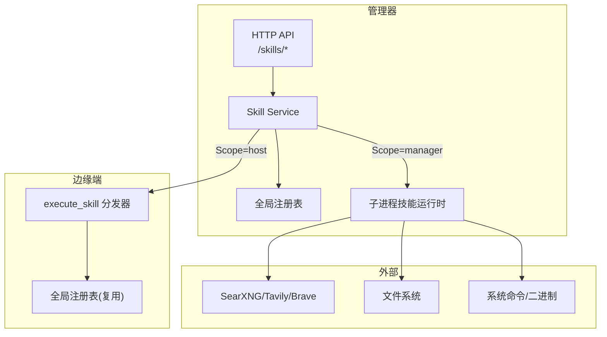
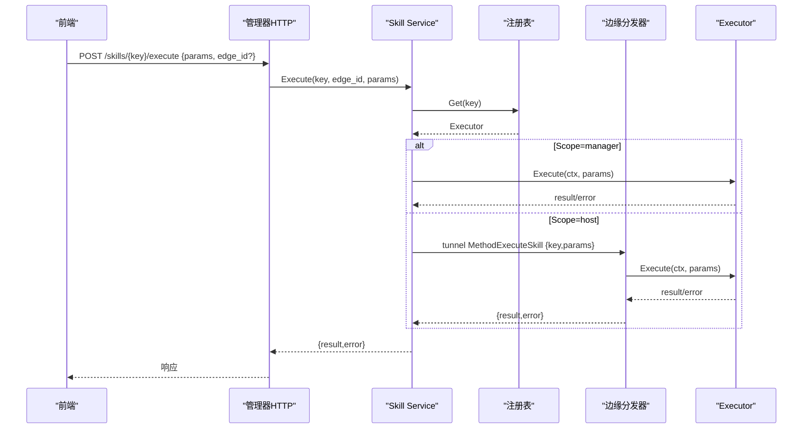
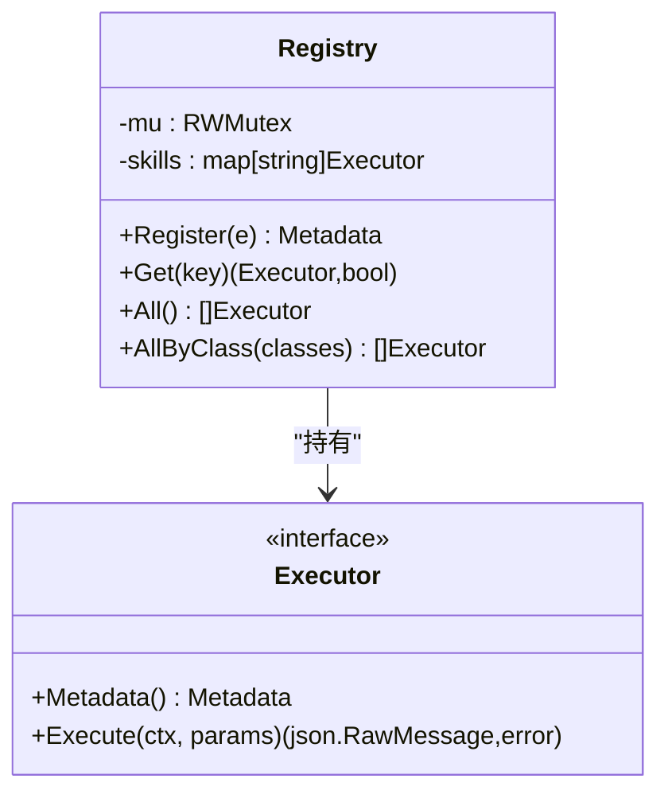
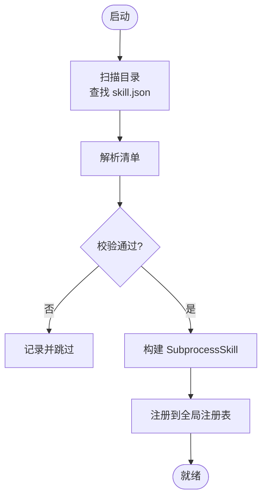

# 技能系统

<cite>
**本文引用的文件**
- [internal/skill/types.go](file://internal/skill/types.go)
- [internal/skill/registry.go](file://internal/skill/registry.go)
- [internal/skill/loader.go](file://internal/skill/loader.go)
- [internal/skill/subprocess.go](file://internal/skill/subprocess.go)
- [internal/skill/schema.go](file://internal/skill/schema.go)
- [internal/skill/builtin/probe_ping.go](file://internal/skill/builtin/probe_ping.go)
- [internal/skill/builtin/probe_http.go](file://internal/skill/builtin/probe_http.go)
- [internal/skill/builtin/probe_dns.go](file://internal/skill/builtin/probe_dns.go)
- [internal/skill/builtin/tail_file.go](file://internal/skill/builtin/tail_file.go)
- [internal/skill/builtin/capture_pcap.go](file://internal/skill/builtin/capture_pcap.go)
- [internal/skill/builtin/web_search.go](file://internal/skill/builtin/web_search.go)
- [internal/edgeagent/skill/dispatcher.go](file://internal/edgeagent/skill/dispatcher.go)
- [internal/manager/biz/skill/service.go](file://internal/manager/biz/skill/service.go)
- [web/src/api/skills.ts](file://web/src/api/skills.ts)
- [skills/bash/SKILL.md](file://skills/bash/SKILL.md)
</cite>

## 目录
1. [简介](#简介)
2. [项目结构](#项目结构)
3. [核心组件](#核心组件)
4. [架构总览](#架构总览)
5. [详细组件分析](#详细组件分析)
6. [依赖关系分析](#依赖关系分析)
7. [性能与资源限制](#性能与资源限制)
8. [故障排查指南](#故障排查指南)
9. [结论](#结论)
10. [附录：开发指南与最佳实践](#附录开发指南与最佳实践)

## 简介
本技术文档系统化阐述 Ongrid 的“技能系统”（Skill System），覆盖技能的注册机制、执行环境（边缘端与管理器端）、沙箱隔离与权限控制、内置技能实现原理、自定义技能开发规范、市场机制与版本管理，以及调试与性能优化建议。目标是帮助开发者快速理解并扩展系统的可观测性与自动化能力。

## 项目结构
技能系统由“框架层 + 内置技能 + 加载器 + 调度层 + 前端/管理器服务”组成：
- 框架层：定义技能元数据、执行器接口、注册表、参数 Schema 生成等。
- 内置技能：网络探测、文件读取、抓包、联网搜索等。
- 加载器：扫描外部 skill.json 清单，构建子进程技能并注册。
- 调度层：管理器侧根据 Scope 决定本地执行或隧道转发到边缘；边缘侧统一分发 execute_skill。
- 前端/管理器服务：暴露 HTTP API，驱动 UI 表单与 LLM 工具注册。

图表来源
- [internal/manager/biz/skill/service.go:187-261](file://internal/manager/biz/skill/service.go#L187-L261)
- [internal/edgeagent/skill/dispatcher.go:16-55](file://internal/edgeagent/skill/dispatcher.go#L16-L55)
- [internal/skill/loader.go:69-160](file://internal/skill/loader.go#L69-L160)
- [internal/skill/subprocess.go:99-172](file://internal/skill/subprocess.go#L99-L172)

章节来源
- [internal/skill/types.go:1-27](file://internal/skill/types.go#L1-L27)
- [internal/skill/registry.go:10-47](file://internal/skill/registry.go#L10-L47)
- [internal/skill/loader.go:13-67](file://internal/skill/loader.go#L13-L67)
- [internal/skill/subprocess.go:17-78](file://internal/skill/subprocess.go#L17-L78)

## 核心组件
- 技能元数据与执行器接口：定义 Key、Name、Description、Class、Scope、Category、Params、ResultPreview 等，并提供 Execute(ctx, params) 契约。
- 全局注册表：进程级技能目录，支持 Register/Get/All/AllByClass，并发安全。
- 参数 Schema：将 ParamSchema 转换为 JSON Schema，供 LLM 工具与 UI 表单使用；支持 RawSchemaProvider 自定义复杂 schema。
- 子进程技能加载器：扫描外部目录中的 skill.json，校验并构建 SubprocessSkill，强制 ScopeManager 与白名单路径。
- 子进程运行时：以独立进程运行外部可执行，stdin/stdout 交换 JSON，限制超时、输出大小与环境变量注入。
- 管理器 Skill 服务：鉴权、路由（本地或隧道到边缘）、审计记录。
- 边缘分发器：统一处理 execute_skill RPC，按 Key 查找 Executor 并执行。

章节来源
- [internal/skill/types.go:63-224](file://internal/skill/types.go#L63-L224)
- [internal/skill/registry.go:21-119](file://internal/skill/registry.go#L21-L119)
- [internal/skill/schema.go:5-96](file://internal/skill/schema.go#L5-L96)
- [internal/skill/loader.go:69-274](file://internal/skill/loader.go#L69-L274)
- [internal/skill/subprocess.go:99-268](file://internal/skill/subprocess.go#L99-L268)
- [internal/manager/biz/skill/service.go:187-261](file://internal/manager/biz/skill/service.go#L187-L261)
- [internal/edgeagent/skill/dispatcher.go:16-55](file://internal/edgeagent/skill/dispatcher.go#L16-L55)

## 架构总览
技能执行流程分为两类：
- Manager 范围（ScopeManager）：在管理器进程内直接执行 Executor（如 web_search、子进程技能）。
- Host 范围（ScopeHost）：管理器通过隧道将 execute_skill 请求转发到目标边缘 Agent，由边缘分发器执行。

图表来源
- [internal/manager/biz/skill/service.go:187-261](file://internal/manager/biz/skill/service.go#L187-L261)
- [internal/edgeagent/skill/dispatcher.go:16-55](file://internal/edgeagent/skill/dispatcher.go#L16-L55)
- [web/src/api/skills.ts:303-314](file://web/src/api/skills.ts#L303-L314)

## 详细组件分析

### 注册表与生命周期
- 注册阶段：所有内置技能在 init() 中调用 Register(e)，注册表校验 Metadata 并拒绝重复 Key。
- 运行阶段：管理器/边缘通过 Get(key) 获取 Executor；All()/AllByClass() 用于枚举与分类过滤。
- 并发模型：注册期单线程，运行期读多写少，使用 RWMutex 保护。

图表来源
- [internal/skill/registry.go:21-119](file://internal/skill/registry.go#L21-L119)
- [internal/skill/types.go:190-203](file://internal/skill/types.go#L190-L203)

章节来源
- [internal/skill/registry.go:10-119](file://internal/skill/registry.go#L10-L119)
- [internal/skill/types.go:99-224](file://internal/skill/types.go#L99-L224)

### 参数 Schema 与 LLM 集成
- 声明式 ParamSchema 自动转为 JSON Schema，适配 LLM function-calling。
- 支持 RawSchemaProvider 提供完整 JSON Schema，用于复杂类型（数组、oneOf 等）。
- 前端 UI 基于该 Schema 渲染表单，LLM 工具描述来自 Metadata.Description。

章节来源
- [internal/skill/schema.go:5-96](file://internal/skill/schema.go#L5-L96)
- [internal/skill/types.go:63-97](file://internal/skill/types.go#L63-L97)

### 子进程技能加载与执行
- 加载器：遍历配置目录，解析 skill.json，校验 name/description/entry/class/category，强制 ScopeManager，限制 entry 必须在 allowlist 根目录下。
- 执行器：为每个子进程设置超时、环境变量白名单、stdout/stderr 上限，确保健壮性。
- 错误处理：非零退出码、超时、非法 JSON 均返回结构化错误，stderr 尾部保留用于诊断。

图表来源
- [internal/skill/loader.go:69-160](file://internal/skill/loader.go#L69-L160)
- [internal/skill/loader.go:176-254](file://internal/skill/loader.go#L176-L254)

章节来源
- [internal/skill/loader.go:13-274](file://internal/skill/loader.go#L13-L274)
- [internal/skill/subprocess.go:99-268](file://internal/skill/subprocess.go#L99-L268)

### 管理器 Skill 服务与权限控制
- 鉴权策略：safe 允许任意已认证用户；mutating 仅管理员；dangerous 需要 SOP 签名（当前未启用，默认拒绝）。
- 路由策略：Scope=host 要求 edge_id 非空并通过隧道转发；Scope=manager 直接在管理器进程执行。
- 审计：记录开始/结束时间，便于追踪。

章节来源
- [internal/manager/biz/skill/service.go:187-261](file://internal/manager/biz/skill/service.go#L187-L261)

### 边缘分发器
- 统一入口：接收 execute_skill 请求，按 key 查找 Executor，执行后封装 {result,error} 返回。
- 错误语义：executor 的错误不会导致 RPC 失败，而是放入 Error 字段，便于上层呈现与审计。

章节来源
- [internal/edgeagent/skill/dispatcher.go:16-55](file://internal/edgeagent/skill/dispatcher.go#L16-L55)

### 内置技能详解

#### 网络探测类
- host_probe_ping：发送 ICMP ping，限制 count/timeout，返回 ok、exit_code、duration_ms、stdout/stderr。
- host_probe_http：HEAD/GET 探测，禁用 TLS 验证（适配内部自签证书），返回 status_code、latency_ms、content_length。
- host_probe_dns：DNS 解析 A/AAAA，带超时控制，返回 addrs、latency_ms。

章节来源
- [internal/skill/builtin/probe_ping.go:14-125](file://internal/skill/builtin/probe_ping.go#L14-L125)
- [internal/skill/builtin/probe_http.go:15-120](file://internal/skill/builtin/probe_http.go#L15-L120)
- [internal/skill/builtin/probe_dns.go:13-85](file://internal/skill/builtin/probe_dns.go#L13-L85)

#### 文件操作类
- host_tail_file：读取文件最后 N 行，限制 max_bytes，禁止路径穿越，返回 lines、total_lines_returned、file_size、truncated。

章节来源
- [internal/skill/builtin/tail_file.go:15-133](file://internal/skill/builtin/tail_file.go#L15-L133)

#### 抓包类
- capture_pcap/get_packet_capture：声明抓包任务与状态查询，实际执行在边缘 Agent（此处返回占位错误提示需边缘执行）。

章节来源
- [internal/skill/builtin/capture_pcap.go:11-73](file://internal/skill/builtin/capture_pcap.go#L11-L73)

#### 联网搜索类
- web_search：支持 SearXNG（默认，无需密钥）、Tavily、Brave 三种后端；通过配置解析器选择 provider；对不可达或未配置场景返回 skipped_reason，而非错误，便于 LLM 引导修复。

章节来源
- [internal/skill/builtin/web_search.go:19-593](file://internal/skill/builtin/web_search.go#L19-L593)

### 自定义技能开发指南
- 规范：实现 Executor 接口，提供 Metadata（Key/Name/Description/Class/Scope/Category/Params/ResultPreview）。
- 注册：在 init() 中调用 Register(e)。
- 参数：优先使用 ParamSchema；复杂类型可实现 RawSchemaProvider 提供 JSON Schema。
- 测试：可通过 NewRegistryForTest() 构造独立注册表进行单元测试；子进程技能可使用 runner 桩替换 exec 行为。
- 部署：外部技能打包为 skill.json + 可执行 Entry，放置于 LoaderConfig.Dirs 指定目录，启动时自动发现。

章节来源
- [internal/skill/types.go:190-224](file://internal/skill/types.go#L190-L224)
- [internal/skill/registry.go:121-127](file://internal/skill/registry.go#L121-L127)
- [internal/skill/loader.go:69-160](file://internal/skill/loader.go#L69-L160)
- [internal/skill/subprocess.go:75-85](file://internal/skill/subprocess.go#L75-L85)

### 技能市场工作机制
- 发布：技能以 skill.json 清单 + 可执行 Entry 形式发布，清单包含 name/description/schema/entry/env_allow/timeout_seconds/class/category。
- 安装：将技能包放入 LoaderConfig.Dirs 配置的目录，管理器启动时扫描并注册。
- 版本管理：通过替换 skill.json 与可执行文件实现版本升级；加载器会跳过已注册的同名技能以避免冲突。
- 依赖解析：子进程技能通过 EnvAllow 显式注入所需环境变量（如 API Key），不继承父进程环境，降低泄露风险。

章节来源
- [internal/skill/loader.go:13-67](file://internal/skill/loader.go#L13-L67)
- [internal/skill/loader.go:176-254](file://internal/skill/loader.go#L176-L254)
- [internal/skill/subprocess.go:64-73](file://internal/skill/subprocess.go#L64-L73)

## 依赖关系分析
- 管理器 Skill 服务依赖全局注册表与隧道调用（边缘执行）。
- 边缘分发器依赖全局注册表（与管理器共享同一注册表类型）。
- 子进程技能依赖操作系统 exec 能力，受 Loader 白名单与 SubprocessSkill 资源限制约束。
- 前端通过 HTTP API 调用管理器，传递 edge_id（仅 host 范围需要）。

图表来源
- [web/src/api/skills.ts:303-314](file://web/src/api/skills.ts#L303-L314)
- [internal/manager/biz/skill/service.go:187-261](file://internal/manager/biz/skill/service.go#L187-L261)
- [internal/edgeagent/skill/dispatcher.go:16-55](file://internal/edgeagent/skill/dispatcher.go#L16-L55)

章节来源
- [web/src/api/skills.ts:303-314](file://web/src/api/skills.ts#L303-L314)
- [internal/manager/biz/skill/service.go:187-261](file://internal/manager/biz/skill/service.go#L187-L261)
- [internal/edgeagent/skill/dispatcher.go:16-55](file://internal/edgeagent/skill/dispatcher.go#L16-L55)

## 性能与资源限制
- 子进程 stdout 限制：最大 16 MiB，防止恶意输出耗尽内存。
- stderr 尾部保留：最多 4 KiB，用于错误诊断。
- 默认超时：30 秒，可在 manifest 中配置 timeout_seconds。
- 环境变量白名单：仅允许 env_allow 列表中的变量注入，避免敏感信息泄露。
- 文件读取限制：tail_file 支持 max_bytes 截断，避免大文件读取。
- 网络探测：HTTP 探测禁用 TLS 验证（适配内部服务），DNS/HTTP/Ping 均带超时控制。

章节来源
- [internal/skill/subprocess.go:17-28](file://internal/skill/subprocess.go#L17-L28)
- [internal/skill/subprocess.go:145-172](file://internal/skill/subprocess.go#L145-L172)
- [internal/skill/builtin/tail_file.go:64-133](file://internal/skill/builtin/tail_file.go#L64-L133)
- [internal/skill/builtin/probe_http.go:62-120](file://internal/skill/builtin/probe_http.go#L62-L120)
- [internal/skill/builtin/probe_dns.go:52-85](file://internal/skill/builtin/probe_dns.go#L52-L85)
- [internal/skill/builtin/probe_ping.go:60-125](file://internal/skill/builtin/probe_ping.go#L60-L125)

## 故障排查指南
- 未知技能 Key：检查注册表是否成功注册，确认 Key 符合 lower_snake 规则。
- 权限不足：mutating/dangerous 技能需要管理员权限；dangerous 当前默认拒绝。
- 边缘执行失败：确认 edge_id 正确且隧道连通；查看边缘分发器返回的 Error 字段。
- 子进程超时/退出：检查 manifest 中 timeout_seconds 与 Entry 可执行权限；查看 stderr 尾部。
- 联网搜索不可用：SearXNG 不可达或未配置 API Key 时，会返回 skipped_reason；按提示调整设置。
- 文件读取被拒：确认路径为绝对路径且不包含 ..；检查文件系统权限。

章节来源
- [internal/manager/biz/skill/service.go:187-261](file://internal/manager/biz/skill/service.go#L187-L261)
- [internal/edgeagent/skill/dispatcher.go:16-55](file://internal/edgeagent/skill/dispatcher.go#L16-L55)
- [internal/skill/loader.go:176-254](file://internal/skill/loader.go#L176-L254)
- [internal/skill/subprocess.go:145-172](file://internal/skill/subprocess.go#L145-L172)
- [internal/skill/builtin/web_search.go:225-283](file://internal/skill/builtin/web_search.go#L225-L283)
- [internal/skill/builtin/tail_file.go:64-133](file://internal/skill/builtin/tail_file.go#L64-L133)

## 结论
Ongrid 技能系统通过统一的元数据与执行器接口，实现了跨边缘与管理器的可扩展能力编排。注册表保证并发安全与唯一性，加载器与安全策略保障外部技能的可控接入，管理器服务提供鉴权与审计，边缘分发器简化了远程执行。内置技能覆盖了常见运维场景，结合子进程运行时与参数 Schema，既满足 LLM 工具需求，又兼顾 UI 友好性。未来可进一步扩展危险技能的 SOP 审批流与更细粒度的资源配额。

## 附录：开发指南与最佳实践
- 编写技能：
  - 明确 Class（safe/mutating/dangerous）与 Scope（host/manager）。
  - 使用 ParamSchema 声明参数；复杂类型实现 RawSchemaProvider。
  - 在 init() 中注册，确保 Key 唯一且符合命名规范。
- 测试：
  - 使用 NewRegistryForTest() 隔离注册表。
  - 子进程技能通过 runner 桩模拟输入输出与退出码。
- 部署：
  - 将 skill.json 与可执行放入 LoaderConfig.Dirs 指定目录。
  - 配置 env_allow 仅注入必要环境变量。
- 调试：
  - 关注 stderr 尾部与超时错误。
  - 对于联网搜索，检查 provider 配置与可达性。
- 最佳实践：
  - 限制资源：合理设置 timeout、max_bytes、MaxSubprocessStdout。
  - 安全优先：避免 shell 嵌套与写操作；遵循 cmdpolicy 只读策略（参考 bash 技能说明）。
  - 可观测性：在 ResultPreview 中清晰描述结果形状，便于 LLM 与 UI 展示。

章节来源
- [internal/skill/types.go:99-224](file://internal/skill/types.go#L99-L224)
- [internal/skill/registry.go:121-127](file://internal/skill/registry.go#L121-L127)
- [internal/skill/loader.go:69-160](file://internal/skill/loader.go#L69-L160)
- [internal/skill/subprocess.go:145-172](file://internal/skill/subprocess.go#L145-L172)
- [skills/bash/SKILL.md:1-188](file://skills/bash/SKILL.md#L1-L188)