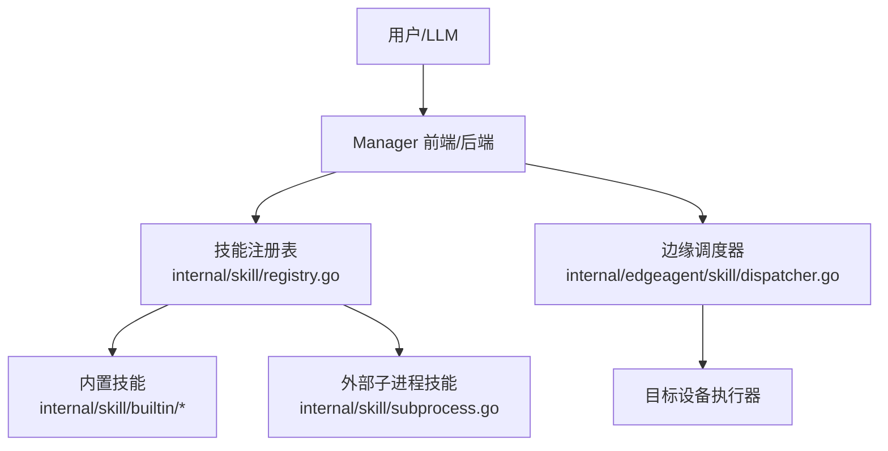
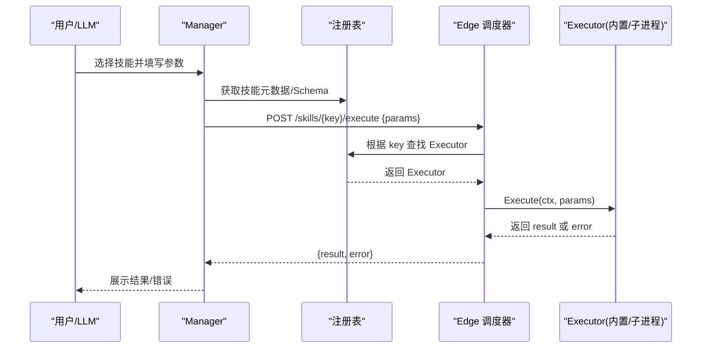
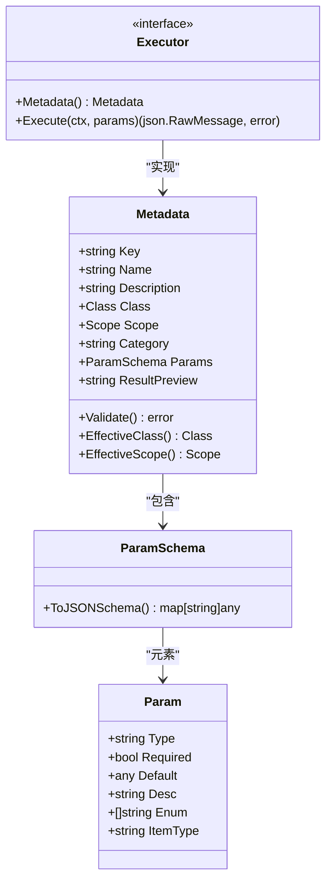
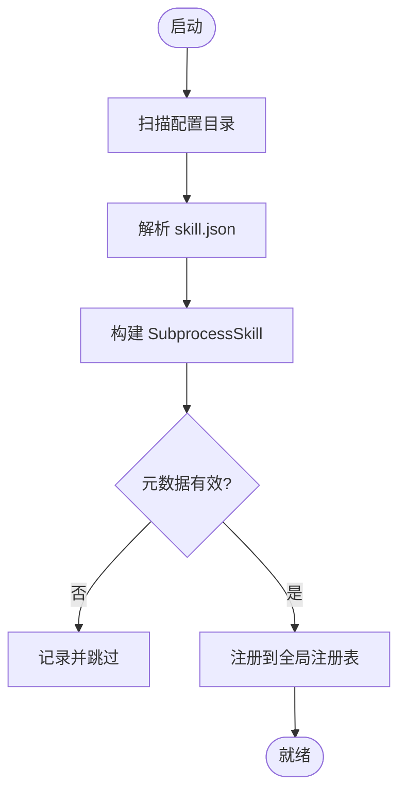
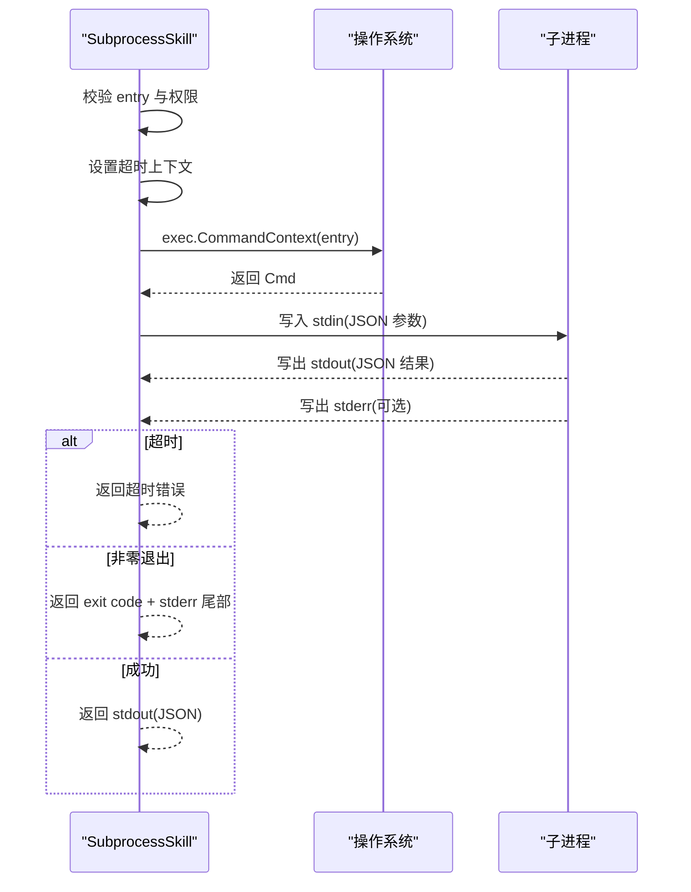
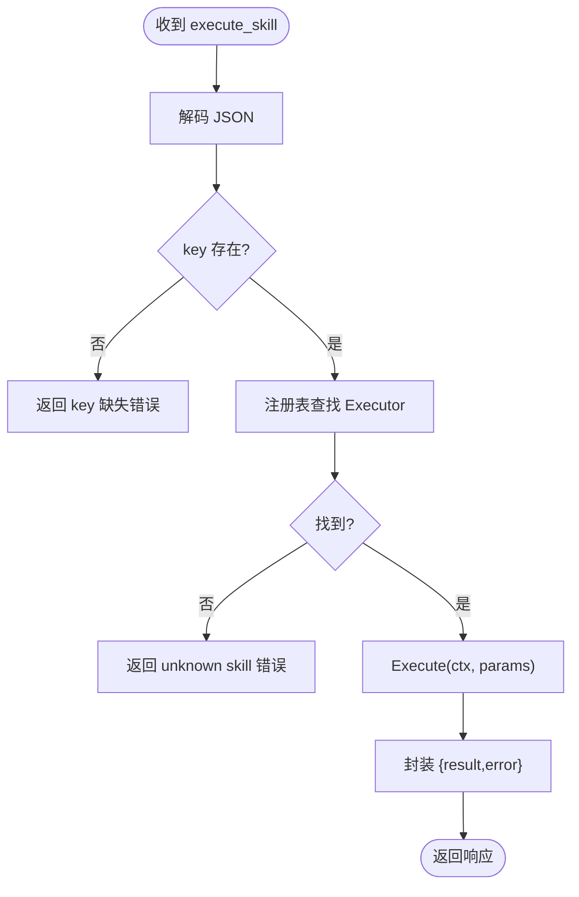
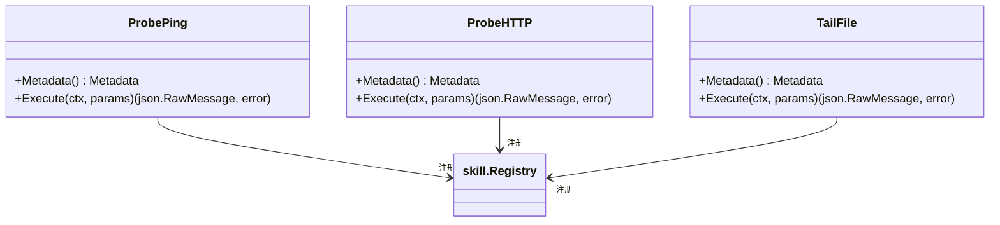
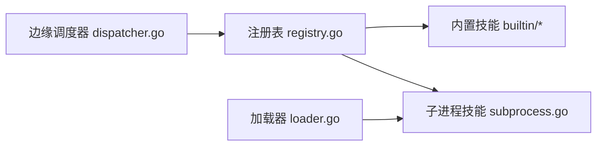

# 自定义技能开发

<cite>
**本文引用的文件**
- [SKILL.md（bash）](file://skills/bash/SKILL.md)
- [SKILL.md（restart-service）](file://skills/restart-service/SKILL.md)
- [types.go](file://internal/skill/types.go)
- [schema.go](file://internal/skill/schema.go)
- [loader.go](file://internal/skill/loader.go)
- [registry.go](file://internal/skill/registry.go)
- [subprocess.go](file://internal/skill/subprocess.go)
- [subprocess_process_unix.go](file://internal/skill/subprocess_process_unix.go)
- [subprocess_process_windows.go](file://internal/skill/subprocess_process_windows.go)
- [dispatcher.go](file://internal/edgeagent/skill/dispatcher.go)
- [probe_ping.go](file://internal/skill/builtin/probe_ping.go)
- [probe_http.go](file://internal/skill/builtin/probe_http.go)
- [tail_file.go](file://internal/skill/builtin/tail_file.go)
- [skills.ts](file://web/src/api/skills.ts)
- [SkillRun.tsx](file://web/src/pages/SkillRun.tsx)
- [Skills.tsx](file://web/src/pages/Skills.tsx)
</cite>

## 目录
1. [简介](#简介)
2. [项目结构](#项目结构)
3. [核心组件](#核心组件)
4. [架构总览](#架构总览)
5. [详细组件分析](#详细组件分析)
6. [依赖关系分析](#依赖关系分析)
7. [性能与资源控制](#性能与资源控制)
8. [测试与调试指南](#测试与调试指南)
9. [发布与版本管理最佳实践](#发布与版本管理最佳实践)
10. [结论](#结论)

## 简介
本指南面向希望在 OnGrid 平台中开发“自定义技能”的工程师，覆盖从技能规范定义、元数据与参数 Schema 设计，到入口程序实现、跨平台兼容、错误处理与超时控制、测试调试、性能优化以及发布与版本管理的完整流程。OnGrid 的技能框架将“设备侧能力”抽象为可注册、可编排、可审计的统一接口：每个技能包含描述性元数据、输入参数 Schema 和执行器；系统自动派生 LLM 工具描述、HTTP API、UI 表单、权限门控与审计日志。

## 项目结构
- 技能规范与示例
  - skills/bash/SKILL.md：以 Markdown + 前置元数据描述一个“只读 shell 诊断”技能，包含 OS 要求、二进制依赖、边端能力白名单、激活模式等。
  - skills/restart-service/SKILL.md：以 Markdown + 前置元数据描述一个“重启服务”的变更类技能，包含关键词触发与二审流程说明。
- 技能框架核心
  - internal/skill/*：定义技能类型、元数据、Schema 生成、注册表、子进程执行器、Unix/Windows 差异化实现、边缘调度器等。
- 内置技能示例
  - internal/skill/builtin/*：提供若干原生 Go 实现的技能样例（如 ping、HTTP 探测、文件尾部读取），展示如何声明 Metadata、实现 Execute。
- 前端集成
  - web/src/api/skills.ts、web/src/pages/SkillRun.tsx、web/src/pages/Skills.tsx：技能列表、详情、执行调用与 UI 渲染。

图表来源
- [registry.go:10-47](file://internal/skill/registry.go#L10-L47)
- [subprocess.go:30-78](file://internal/skill/subprocess.go#L30-L78)
- [dispatcher.go:16-44](file://internal/edgeagent/skill/dispatcher.go#L16-L44)

章节来源
- [SKILL.md（bash）:1-109](file://skills/bash/SKILL.md#L1-L109)
- [SKILL.md（restart-service）:1-30](file://skills/restart-service/SKILL.md#L1-L30)
- [types.go:1-27](file://internal/skill/types.go#L1-L27)

## 核心组件
- 技能元数据与参数 Schema
  - 通过 types.go 中的 Metadata、Param、ParamSchema 描述技能的键名、名称、描述、权限类别、作用域、分类、参数及结果预览。
  - schema.go 将 ParamSchema 转换为 OpenAI function-calling 风格的 JSON Schema，供 LLM 工具注册与 UI 表单生成。
- 注册表
  - registry.go 维护全局技能目录，支持按 Key 查询、按权限类别过滤、全量枚举，保证并发安全。
- 子进程技能
  - subprocess.go 提供通用子进程执行器：stdin/stdout JSON 协议、环境变量白名单、超时控制、输出大小限制、非零退出码错误封装。
  - Unix/Windows 差异由 subprocess_process_unix.go 与 subprocess_process_windows.go 分别实现进程组与取消策略。
- 边缘调度器
  - dispatcher.go 将 Manager 下发的 execute_skill RPC 解析并分发到对应 Executor，统一返回 Result/Error 结构。

章节来源
- [types.go:63-125](file://internal/skill/types.go#L63-L125)
- [schema.go:5-20](file://internal/skill/schema.go#L5-L20)
- [registry.go:10-47](file://internal/skill/registry.go#L10-L47)
- [subprocess.go:17-78](file://internal/skill/subprocess.go#L17-L78)
- [dispatcher.go:16-44](file://internal/edgeagent/skill/dispatcher.go#L16-L44)

## 架构总览
技能在 Manager 与 Edge 两侧协同工作：
- Manager 侧
  - 加载内置与外部技能，构建 LLM 工具集与 HTTP /skills 路由。
  - 对 mutating/dangerous 技能进行审批流拦截（例如 restart-service）。
- Edge 侧
  - 接收 execute_skill RPC，查找 Executor 并执行，返回结构化结果或错误。

图表来源
- [registry.go:31-47](file://internal/skill/registry.go#L31-L47)
- [dispatcher.go:24-44](file://internal/edgeagent/skill/dispatcher.go#L24-L44)
- [subprocess.go:99-172](file://internal/skill/subprocess.go#L99-L172)

## 详细组件分析

### 技能规范与 SKILL.md
- 前置元数据块
  - name：稳定标识（lower_snake）
  - description：人类可读描述，同时作为 LLM 工具描述
  - when_to_use：使用场景与禁忌
  - metadata.os：目标操作系统
  - metadata.requires.bins：依赖的二进制
  - metadata.ongrid.scope：作用域（edge/manager）
  - metadata.ongrid.edge_runtime：运行方式（如 subprocess）
  - metadata.ongrid.edge_capabilities：能力白名单（如 process.exec 列表）
  - metadata.ongrid.activation.mode/keywords：激活模式（always/keyword）
  - metadata.ongrid.min_ongrid_version：最低版本要求
- 正文部分
  - 能力标题、调用规则、允许的命令分类、推荐套路、v1 实现说明等。

章节来源
- [SKILL.md（bash）:1-109](file://skills/bash/SKILL.md#L1-L109)
- [SKILL.md（bash）:111-188](file://skills/bash/SKILL.md#L111-L188)
- [SKILL.md（restart-service）:1-30](file://skills/restart-service/SKILL.md#L1-L30)
- [SKILL.md（restart-service）:32-82](file://skills/restart-service/SKILL.md#L32-L82)

### 元数据与参数 Schema
- Metadata
  - Key/Name/Description/Class/Scope/Category/Params/ResultPreview
  - Validate() 校验 Key 格式、必填字段、Class/Scope 取值、参数类型与数组 ItemType 约束、Required 与 Default 互斥。
- ParamSchema.ToJSONSchema()
  - 将声明式参数映射为 JSON Schema（string/int/float/bool/duration/enum/array），用于 LLM 工具与 UI 表单。
- RawSchemaProvider
  - 允许手写复杂 Schema（嵌套对象、oneOf 等），优先于声明式 Schema。

图表来源
- [types.go:63-125](file://internal/skill/types.go#L63-L125)
- [types.go:177-203](file://internal/skill/types.go#L177-L203)
- [schema.go:5-20](file://internal/skill/schema.go#L5-L20)

章节来源
- [types.go:63-175](file://internal/skill/types.go#L63-L175)
- [schema.go:5-96](file://internal/skill/schema.go#L5-L96)

### 技能注册与发现
- 全局注册表
  - Register(e)：注册 Executor，重复 Key 会 panic（作者级错误应在启动期暴露）。
  - Get(key)、All()、AllByClass(classes...)：查询与过滤。
- 外部技能加载
  - loader.go 扫描指定目录下的 skill.json，解析并构建 SubprocessSkill，强制 Scope=Manager，校验 Class、Category、Timeout，并限制 Entry 路径在允许根目录下。

图表来源
- [loader.go:69-161](file://internal/skill/loader.go#L69-L161)
- [loader.go:176-254](file://internal/skill/loader.go#L176-L254)
- [registry.go:31-74](file://internal/skill/registry.go#L31-L74)

章节来源
- [registry.go:10-127](file://internal/skill/registry.go#L10-L127)
- [loader.go:69-274](file://internal/skill/loader.go#L69-L274)

### 子进程技能入口协议与执行
- 输入输出协议
  - stdin：JSON 参数对象（空时默认 {}）
  - stdout：JSON 结果对象（必须合法 JSON）
  - stderr：错误信息片段（错误消息中包含尾部 stderr）
- 执行流程
  - 校验 entry 绝对路径与可执行权限
  - 设置上下文超时（默认 30s）
  - 构建受限环境变量（仅 EnvAllow 白名单）
  - 启动子进程，捕获 stdout/stderr，限制内存占用
  - 非零退出码视为错误；超时返回 context.DeadlineExceeded 包装错误
- 跨平台差异
  - Unix：设置进程组并支持 Kill(-pid, SIGKILL) 以终止子进程树
  - Windows：无额外配置（保持最小化行为）

图表来源
- [subprocess.go:99-172](file://internal/skill/subprocess.go#L99-L172)
- [subprocess.go:207-238](file://internal/skill/subprocess.go#L207-L238)
- [subprocess_process_unix.go:12-26](file://internal/skill/subprocess_process_unix.go#L12-L26)
- [subprocess_process_windows.go:5-7](file://internal/skill/subprocess_process_windows.go#L5-L7)

章节来源
- [subprocess.go:17-78](file://internal/skill/subprocess.go#L17-L78)
- [subprocess.go:99-172](file://internal/skill/subprocess.go#L99-L172)
- [subprocess.go:207-238](file://internal/skill/subprocess.go#L207-L238)
- [subprocess_process_unix.go:12-26](file://internal/skill/subprocess_process_unix.go#L12-L26)
- [subprocess_process_windows.go:5-7](file://internal/skill/subprocess_process_windows.go#L5-L7)

### 边缘调度器
- 职责
  - 解析 execute_skill 请求体（key、params）
  - 查找 Executor，调用 Execute
  - 统一封装响应（result 或 error 字符串）
- 错误处理
  - 未知 key 返回错误消息
  - Executor 错误不中断 RPC，便于审计与前端展示

图表来源
- [dispatcher.go:24-56](file://internal/edgeagent/skill/dispatcher.go#L24-L56)

章节来源
- [dispatcher.go:16-56](file://internal/edgeagent/skill/dispatcher.go#L16-L56)

### 内置技能示例
- Ping 探测
  - 安全类网络探测，固定包数与超时，返回状态、耗时、原始输出。
- HTTP 探测
  - 安全类，仅 HEAD/GET，跳过 TLS 验证以适配内网自签证书，返回状态码、延迟、内容长度。
- 文件尾部读取
  - 安全类文件系统操作，限制绝对路径与无穿越，按预算读取尾部字节并返回行。

图表来源
- [probe_ping.go:14-43](file://internal/skill/builtin/probe_ping.go#L14-L43)
- [probe_http.go:15-47](file://internal/skill/builtin/probe_http.go#L15-L47)
- [tail_file.go:15-46](file://internal/skill/builtin/tail_file.go#L15-L46)

章节来源
- [probe_ping.go:14-125](file://internal/skill/builtin/probe_ping.go#L14-L125)
- [probe_http.go:15-120](file://internal/skill/builtin/probe_http.go#L15-L120)
- [tail_file.go:15-133](file://internal/skill/builtin/tail_file.go#L15-L133)

### 前端集成与调用
- API 调用
  - skills.ts 提供 executeSkill(key, edgeID, params)，Manager 侧技能无需 edge_id。
- UI 页面
  - Skills.tsx：技能目录与安装页切换（管理员可见）。
  - SkillRun.tsx：拉取技能详情、渲染表单、执行并展示结果/错误。

章节来源
- [skills.ts:290-314](file://web/src/api/skills.ts#L290-L314)
- [Skills.tsx:22-44](file://web/src/pages/Skills.tsx#L22-L44)
- [SkillRun.tsx:44-89](file://web/src/pages/SkillRun.tsx#L44-L89)

## 依赖关系分析
- 组件耦合
  - 注册表被 Manager 与 Edge 共享；内置技能与外部子进程技能均通过 Register 注入。
  - 子进程技能强依赖操作系统命令与权限模型；Unix 下需进程组与信号处理。
- 外部依赖
  - 子进程技能可能调用系统命令（如 ping、curl、systemctl），需在 SKILL.md 中声明依赖 bins 与能力白名单。
- 潜在循环依赖
  - 注册发生在 init()，无运行时循环导入；Loader 与 Registry 解耦。

图表来源
- [registry.go:10-47](file://internal/skill/registry.go#L10-L47)
- [loader.go:69-161](file://internal/skill/loader.go#L69-L161)
- [dispatcher.go:16-44](file://internal/edgeagent/skill/dispatcher.go#L16-L44)

章节来源
- [registry.go:10-127](file://internal/skill/registry.go#L10-L127)
- [loader.go:69-274](file://internal/skill/loader.go#L69-L274)
- [dispatcher.go:16-56](file://internal/edgeagent/skill/dispatcher.go#L16-L56)

## 性能与资源控制
- 子进程资源上限
  - stdout 最大 16 MiB，stderr 保留尾部 4 KiB 用于诊断。
  - 默认超时 30s，可通过 manifest 或技能元数据覆盖。
- 内存保护
  - cappedWriter 丢弃超出限额的输出，避免恶意/异常输出导致 OOM。
- 网络与命令沙箱
  - bash 技能受 cmdpolicy 沙箱限制（read-only policy），写操作拒绝；网络出站默认拒绝，需显式 allowlist。
- 建议
  - 合理设置 timeout_seconds 与 max_bytes，避免长尾任务阻塞。
  - 对大输出技能采用分页或摘要输出。

章节来源
- [subprocess.go:17-28](file://internal/skill/subprocess.go#L17-L28)
- [subprocess.go:207-238](file://internal/skill/subprocess.go#L207-L238)
- [SKILL.md（bash）:181-188](file://skills/bash/SKILL.md#L181-L188)

## 测试与调试指南
- 单元测试
  - 子进程技能测试覆盖正常路径、参数透传、非零退出、相对路径拒绝、缺失二进制、超时、环境变量白名单、非 JSON 输出、强制 ScopeManager 等。
- 调试技巧
  - 查看 stderr 尾部信息定位子进程错误。
  - 检查 stdout 是否为合法 JSON。
  - 确认 entry 路径绝对且可执行。
  - 在 Unix 下利用进程组与信号快速终止卡住的子进程树。
- 常见问题
  - 超时：增加 timeout_seconds 或优化子进程逻辑。
  - 权限：确保 entry 有执行位，必要时调整环境权限。
  - 环境变量泄露：仅通过 EnvAllow 白名单传递必要变量。

章节来源
- [subprocess_test.go:1-200](file://internal/skill/subprocess_test.go#L1-L200)
- [subprocess.go:99-172](file://internal/skill/subprocess.go#L99-L172)
- [subprocess_process_unix.go:12-26](file://internal/skill/subprocess_process_unix.go#L12-L26)

## 发布与版本管理最佳实践
- 技能包组织
  - 每个外部技能包包含 skill.json（manifest）与可执行 entry；manifest 指定 name、description、schema、entry、env_allow、timeout_seconds、class、category。
  - 将 skill.json 放入受信任目录，由 Loader 扫描注册。
- 版本与兼容性
  - 在 SKILL.md 中声明 min_ongrid_version，确保功能与平台能力匹配。
  - 变更元数据或参数 Schema 时，注意向后兼容与 UI 表单变化。
- 安全与权限
  - 明确 Class（safe/mutating/dangerous），mutating/dangerous 走审批流。
  - 对外部二进制严格限制路径与作用域（SubprocessSkill 强制 ScopeManager）。
- 发布流程
  - 先部署 manifest，再部署可执行；观察注册日志确认加载成功。
  - 提供回滚方案（卸载/替换旧版本），并在 UI 中展示警告与能力清单。

章节来源
- [loader.go:13-53](file://internal/skill/loader.go#L13-L53)
- [loader.go:176-254](file://internal/skill/loader.go#L176-L254)
- [SKILL.md（bash）:1-109](file://skills/bash/SKILL.md#L1-L109)
- [SKILL.md（restart-service）:1-30](file://skills/restart-service/SKILL.md#L1-L30)

## 结论
OnGrid 的技能框架通过统一的元数据、Schema 与执行器抽象，实现了设备侧能力的标准化接入与编排。开发者只需关注技能的业务实现与安全边界，即可享受自动化的 LLM 工具注册、HTTP API、UI 表单、权限门控与审计日志。遵循本指南的规范与实践，可高效开发出安全、可靠、可观测的自定义技能，满足从简单命令执行到复杂网络诊断的多类场景。