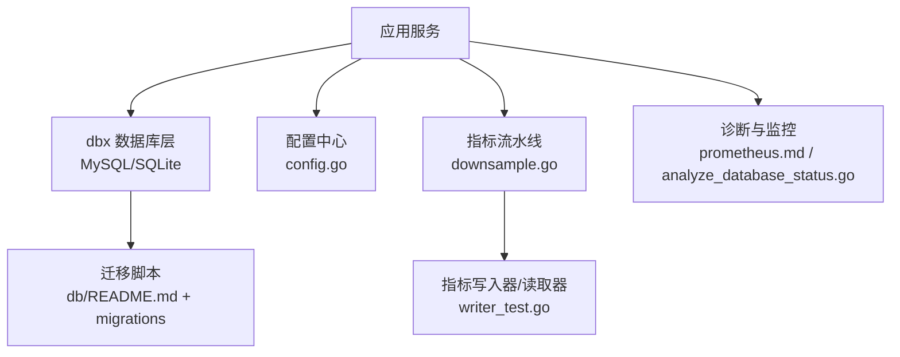
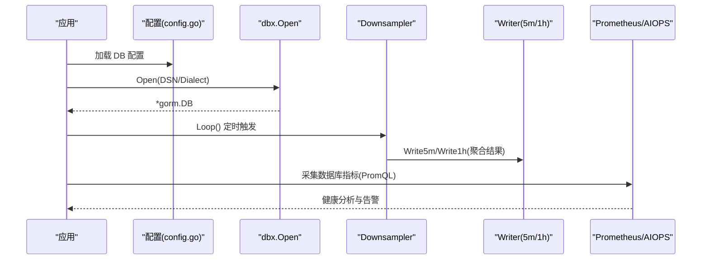
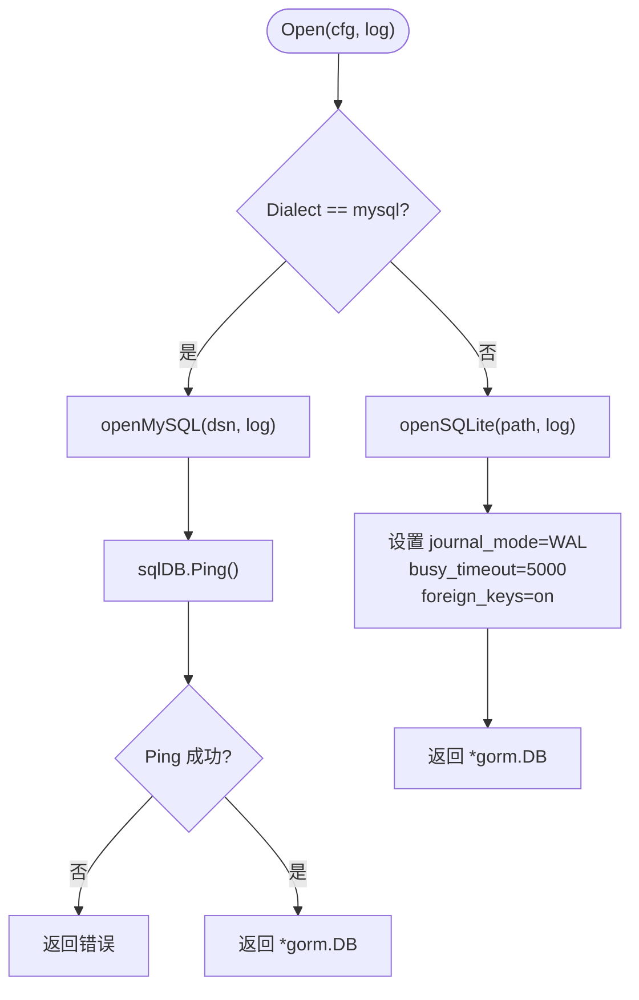
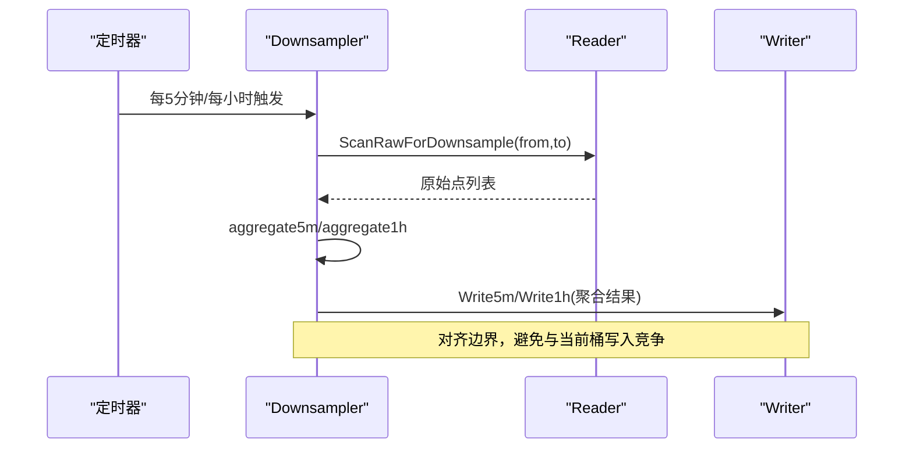
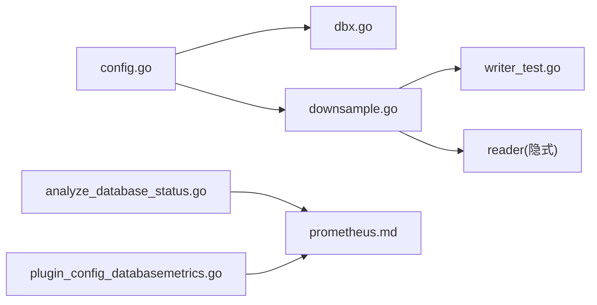

# 性能优化

<cite>
**本文引用的文件**
- [db/README.md](file://db/README.md)
- [internal/pkg/dbx/dbx.go](file://internal/pkg/dbx/dbx.go)
- [internal/pkg/dbx/doc.go](file://internal/pkg/dbx/doc.go)
- [internal/pkg/dbx/soft_delete.go](file://internal/pkg/dbx/soft_delete.go)
- [internal/pkg/config/config.go](file://internal/pkg/config/config.go)
- [internal/manager/biz/metric/downsample.go](file://internal/manager/biz/metric/downsample.go)
- [internal/manager/data/metric/store/writer_test.go](file://internal/manager/data/metric/store/writer_test.go)
- [internal/manager/biz/knowledge/builtin_vault/diagnostics/db-connection-pool-exhaustion.md](file://internal/manager/biz/knowledge/builtin_vault/diagnostics/db-connection-pool-exhaustion.md)
- [internal/manager/biz/knowledge/builtin_vault/diagnostics/db-slow-queries-locks.md](file://internal/manager/biz/knowledge/builtin_vault/diagnostics/db-slow-queries-locks.md)
- [internal/manager/biz/knowledge/builtin_vault/systems/observability-stack/prometheus.md](file://internal/manager/biz/knowledge/builtin_vault/systems/observability-stack/prometheus.md)
- [internal/manager/biz/aiops/tools/analyze_database_status.go](file://internal/manager/biz/aiops/tools/analyze_database_status.go)
- [internal/manager/biz/edge/plugin_config_databasemetrics.go](file://internal/manager/biz/edge/plugin_config_databasemetrics.go)
- [internal/manager/biz/knowledge/builtin_vault/diagnostics/disk-pressure.md](file://internal/manager/biz/knowledge/builtin_vault/diagnostics/disk-pressure.md)
</cite>

## 目录
1. [简介](#简介)
2. [项目结构](#项目结构)
3. [核心组件](#核心组件)
4. [架构总览](#架构总览)
5. [详细组件分析](#详细组件分析)
6. [依赖关系分析](#依赖关系分析)
7. [性能考量](#性能考量)
8. [故障排查指南](#故障排查指南)
9. [结论](#结论)
10. [附录](#附录)

## 简介
本技术文档围绕数据库性能优化展开，覆盖查询优化（索引设计、查询重写、执行计划分析）、数据分片与分区策略（时序数据的降采样与归档）、连接池配置、批量操作优化与内存管理、慢查询监控与分析工具使用，以及高并发场景下的调优案例。同时给出容量规划、存储优化与备份恢复的性能考虑，并结合仓库中的实际实现与诊断知识进行说明。

## 项目结构
本项目采用分层模块化组织：
- 数据库基础设施：通过 dbx 包统一打开 MySQL/SQLite 连接，提供迁移与软删除等能力；生产默认 MySQL，本地开发可选 SQLite。
- 运行时配置：集中从环境变量加载 DB、Prometheus、Grafana、通知等配置项。
- 指标数据流水线：包含时序数据的采集、聚合与落库（Downsampler），以及读写接口测试。
- 运维诊断知识库：内置慢查询、锁竞争、连接池耗尽、磁盘压力等排障手册，以及基于 Prometheus 的数据库状态分析工具。

图表来源
- [internal/pkg/dbx/dbx.go:1-151](file://internal/pkg/dbx/dbx.go#L1-L151)
- [internal/pkg/config/config.go:306-319](file://internal/pkg/config/config.go#L306-L319)
- [internal/manager/biz/metric/downsample.go:1-115](file://internal/manager/biz/metric/downsample.go#L1-L115)
- [internal/manager/data/metric/store/writer_test.go:96-136](file://internal/manager/data/metric/store/writer_test.go#L96-L136)
- [db/README.md:1-15](file://db/README.md#L1-L15)

章节来源
- [internal/pkg/dbx/dbx.go:1-151](file://internal/pkg/dbx/dbx.go#L1-L151)
- [internal/pkg/config/config.go:306-319](file://internal/pkg/config/config.go#L306-L319)
- [db/README.md:1-15](file://db/README.md#L1-L15)

## 核心组件
- 数据库连接与后端选择：dbx.Open 根据配置选择 MySQL 或 SQLite，并在 MySQL 模式下启动时 Ping 验证连通性；SQLite 启用 WAL、busy_timeout、外键约束等 pragma。
- 配置加载：DBConfig 支持 Dialect、DSN、Path，默认 MySQL，可通过环境变量切换。
- 迁移与索引：生产使用 golang-migrate 版本化迁移；AutoMigrate 用于本地初始化；提供 DropIndexes 辅助以在 AutoMigrate 时代修正索引形状。
- 时序数据降采样：Downsampler 按 5 分钟和 1 小时窗口对原始点聚合为 Bucket5m/Bucket1h 并持久化，Loop 定时触发。
- 指标读写与回环测试：Writer/Reader 封装 5m/1h 写入与查询，测试覆盖写入与删除边界。
- 诊断与监控：内置连接池耗尽、慢查询与锁竞争排障手册；Prometheus 工作原理与基数成本说明；AIOPS 工具通过 PromQL 拉取数据库运行指标进行分析。

章节来源
- [internal/pkg/dbx/dbx.go:34-77](file://internal/pkg/dbx/dbx.go#L34-L77)
- [internal/pkg/dbx/doc.go:1-25](file://internal/pkg/dbx/doc.go#L1-L25)
- [internal/pkg/dbx/soft_delete.go:9-46](file://internal/pkg/dbx/soft_delete.go#L9-L46)
- [internal/manager/biz/metric/downsample.go:11-115](file://internal/manager/biz/metric/downsample.go#L11-L115)
- [internal/manager/data/metric/store/writer_test.go:96-136](file://internal/manager/data/metric/store/writer_test.go#L96-L136)
- [internal/manager/biz/knowledge/builtin_vault/diagnostics/db-connection-pool-exhaustion.md:8-84](file://internal/manager/biz/knowledge/builtin_vault/diagnostics/db-connection-pool-exhaustion.md#L8-L84)
- [internal/manager/biz/knowledge/builtin_vault/diagnostics/db-slow-queries-locks.md:8-48](file://internal/manager/biz/knowledge/builtin_vault/diagnostics/db-slow-queries-locks.md#L8-L48)
- [internal/manager/biz/knowledge/builtin_vault/systems/observability-stack/prometheus.md:1-65](file://internal/manager/biz/knowledge/builtin_vault/systems/observability-stack/prometheus.md#L1-L65)
- [internal/manager/biz/aiops/tools/analyze_database_status.go:926-1543](file://internal/manager/biz/aiops/tools/analyze_database_status.go#L926-L1543)

## 架构总览
系统通过配置驱动数据库后端，业务模块通过 dbx 获取 gorm.DB；指标子系统将高频原始点按时间窗口聚合后写入低粒度表，供长期查询与可视化；诊断与监控通过 Prometheus 暴露与采集数据库运行指标，结合 AIOPS 工具生成健康报告。

图表来源
- [internal/pkg/config/config.go:417-448](file://internal/pkg/config/config.go#L417-L448)
- [internal/pkg/dbx/dbx.go:34-77](file://internal/pkg/dbx/dbx.go#L34-L77)
- [internal/manager/biz/metric/downsample.go:82-115](file://internal/manager/biz/metric/downsample.go#L82-L115)
- [internal/manager/biz/aiops/tools/analyze_database_status.go:926-1543](file://internal/manager/biz/aiops/tools/analyze_database_status.go#L926-L1543)

## 详细组件分析

### 数据库连接与后端选择（dbx）
- 功能要点：
  - 支持 MySQL（生产默认）与 SQLite（本地开发）。
  - MySQL 模式在 Open 时执行 Ping 快速失败，避免延迟错误。
  - SQLite 模式启用 WAL、busy_timeout=5000ms、foreign_keys=on，提升并发读与稳定性。
  - 日志中隐藏密码，仅记录脱敏后的 DSN。
- 性能影响：
  - 连接建立阶段即校验可达性，减少首次查询时的抖动。
  - SQLite 的 WAL 模式降低写放大并允许并发读，适合单机轻量场景。

图表来源
- [internal/pkg/dbx/dbx.go:34-112](file://internal/pkg/dbx/dbx.go#L34-L112)

章节来源
- [internal/pkg/dbx/dbx.go:34-112](file://internal/pkg/dbx/dbx.go#L34-L112)

### 配置加载（config）
- 关键配置项：
  - DB.Dialect、DB.DSN、DB.Path：控制数据库类型与连接参数。
  - Prom.*：是否启用 Prometheus、URL、RemoteWrite 与 Query URL。
  - Grafana.*：内部根 URL 与引导凭据。
  - Notification.*：通知通道开关与超时。
- 性能相关：
  - 通过环境变量集中管理，便于在不同环境快速切换与调优。
  - 默认值保证最小可用，同时保留扩展空间。

章节来源
- [internal/pkg/config/config.go:306-319](file://internal/pkg/config/config.go#L306-L319)
- [internal/pkg/config/config.go:417-548](file://internal/pkg/config/config.go#L417-L548)

### 迁移与索引管理（dbx + migrations）
- 生产迁移：使用 golang-migrate 命名规范，先扩表再滚动发布新版本。
- 本地初始化：使用 GORM AutoMigrate 自动建表。
- 索引修正：DropIndexes 可在 AutoMigrate 无法改写同名索引时主动删除重建。
- 软删除兼容：BackfillDeleteMarker 将旧表中的软删除行迁移到新的 delete_marker 字段，确保唯一键正确。

章节来源
- [db/README.md:1-15](file://db/README.md#L1-L15)
- [internal/pkg/dbx/doc.go:1-25](file://internal/pkg/dbx/doc.go#L1-L25)
- [internal/pkg/dbx/soft_delete.go:9-46](file://internal/pkg/dbx/soft_delete.go#L9-L46)

### 时序数据降采样与归档（downsample）
- 功能要点：
  - Downsampler 按 5 分钟与 1 小时窗口聚合原始点，输出 Bucket5m/Bucket1h。
  - Loop 对齐墙钟边界，避免与当前桶写入竞争。
  - aggregate5m/aggregate1h 分别计算均值、最大值与计数器求和，保持可解释性与一致性。
- 性能与存储：
  - 降采样显著降低长期查询负载与存储空间。
  - 写入器测试覆盖写入与删除边界，保障数据一致性与清理策略。

图表来源
- [internal/manager/biz/metric/downsample.go:11-115](file://internal/manager/biz/metric/downsample.go#L11-L115)
- [internal/manager/data/metric/store/writer_test.go:96-136](file://internal/manager/data/metric/store/writer_test.go#L96-L136)

章节来源
- [internal/manager/biz/metric/downsample.go:11-115](file://internal/manager/biz/metric/downsample.go#L11-L115)
- [internal/manager/data/metric/store/writer_test.go:96-136](file://internal/manager/data/metric/store/writer_test.go#L96-L136)

### 慢查询与锁竞争诊断（知识库）
- 区分“慢查询”与“被阻塞”两类问题：前者多为缺少索引/全表扫描/统计信息陈旧；后者为锁等待或死锁。
- 常用手段：
  - PostgreSQL：pg_stat_activity、pg_locks、EXPLAIN ANALYZE。
  - MySQL：SHOW PROCESSLIST、performance_schema.data_lock_waits、EXPLAIN ANALYZE。
- 建议：开启慢查询日志，持续捕获重复问题；必要时调整索引或重写查询。

章节来源
- [internal/manager/biz/knowledge/builtin_vault/diagnostics/db-slow-queries-locks.md:8-48](file://internal/manager/biz/knowledge/builtin_vault/diagnostics/db-slow-queries-locks.md#L8-L48)

### 连接池耗尽诊断（知识库）
- 症状识别：客户端 pool timeout、服务端 too many connections、延迟陡增、连接数攀升不释放。
- 定位步骤：
  - 服务端：Threads_connected/max_connections、进程列表。
  - 客户端：max_open_conns、max_idle_conns、conn_max_lifetime。
  - 泄漏检测：idle in transaction 堆积。
- 修复顺序：修复泄漏 → 合理设置池大小 → 引入连接代理（PgBouncer/ProxySQL）→ 最后考虑提高 max_connections。

章节来源
- [internal/manager/biz/knowledge/builtin_vault/diagnostics/db-connection-pool-exhaustion.md:8-84](file://internal/manager/biz/knowledge/builtin_vault/diagnostics/db-connection-pool-exhaustion.md#L8-L84)

### 指标系统与基数成本（Prometheus）
- 工作原理：周期性抓取 HTTP /metrics，解析样本写入 TSDB，提供 PromQL 查询。
- 存储模型：head block 定期刷盘为不可变块，压缩与合并；保留期删除整块而非单条系列。
- 基数成本：活跃 series 数量决定存储与查询成本；100k series @15s ≈ 3GB/天；1M series 则约 30GB/天且查询延迟明显下降。

章节来源
- [internal/manager/biz/knowledge/builtin_vault/systems/observability-stack/prometheus.md:1-65](file://internal/manager/biz/knowledge/builtin_vault/systems/observability-stack/prometheus.md#L1-L65)

### 数据库状态分析（AIOPS 工具）
- 通过 PromQL 收集 MySQL/PostgreSQL/Redis/MongoDB 等关键指标，如慢查询增长、连接错误、网络 IO、InnoDB Buffer Pool、binlog 缓存等。
- 将指标映射为结构化发现项，便于自动化诊断与告警。

章节来源
- [internal/manager/biz/aiops/tools/analyze_database_status.go:926-1543](file://internal/manager/biz/aiops/tools/analyze_database_status.go#L926-L1543)
- [internal/manager/biz/edge/plugin_config_databasemetrics.go:470-493](file://internal/manager/biz/edge/plugin_config_databasemetrics.go#L470-L493)

## 依赖关系分析
- 配置依赖：config.go 提供 DB/Prom/Grafana 等运行时参数，驱动 dbx.Open 与下游服务。
- 数据流依赖：downsample 依赖 Reader/Writer 抽象，测试验证了写入与查询的一致性。
- 监控依赖：AIOPS 工具依赖 Prometheus 暴露的数据库指标，结合插件配置的采集集。

图表来源
- [internal/pkg/config/config.go:417-548](file://internal/pkg/config/config.go#L417-L548)
- [internal/pkg/dbx/dbx.go:34-112](file://internal/pkg/dbx/dbx.go#L34-L112)
- [internal/manager/biz/metric/downsample.go:82-115](file://internal/manager/biz/metric/downsample.go#L82-L115)
- [internal/manager/data/metric/store/writer_test.go:96-136](file://internal/manager/data/metric/store/writer_test.go#L96-L136)
- [internal/manager/biz/aiops/tools/analyze_database_status.go:926-1543](file://internal/manager/biz/aiops/tools/analyze_database_status.go#L926-L1543)
- [internal/manager/biz/knowledge/builtin_vault/systems/observability-stack/prometheus.md:1-65](file://internal/manager/biz/knowledge/builtin_vault/systems/observability-stack/prometheus.md#L1-L65)
- [internal/manager/biz/edge/plugin_config_databasemetrics.go:470-493](file://internal/manager/biz/edge/plugin_config_databasemetrics.go#L470-L493)

## 性能考量
- 查询优化策略
  - 索引设计：依据过滤与连接列创建合适索引；利用 DropIndexes 在 AutoMigrate 时代修正索引形状。
  - 查询重写：避免全表扫描与大范围 JOIN；合理使用分页与投影。
  - 执行计划分析：使用 EXPLAIN ANALYZE 观察扫描类型、行数估计与实际差异，及时更新统计信息。
- 数据分片与分区策略
  - 时序数据：通过 Downsampler 将原始点聚合成 5m/1h 桶，降低长期查询与存储压力。
  - 归档机制：结合保留策略与删除边界（DeleteBefore），定期清理过期数据。
- 连接池配置
  - 客户端：合理设置 max_open_conns、max_idle_conns、conn_max_lifetime，避免连接抖动与资源占用。
  - 服务端：确保实例总数 × per-instance max_open < server max_connections，预留余量。
  - 代理：在高并发小连接场景引入 PgBouncer/ProxySQL 复用连接。
- 批量操作与内存管理
  - 批量写入：按窗口聚合后再写入，减少事务与 I/O 次数。
  - 内存控制：聚合过程使用 map 分组，注意热点 key 导致的内存峰值；必要时分片处理。
- 慢查询监控与分析
  - 启用慢查询日志；结合 pg_stat_activity/SHOW PROCESSLIST 定位长耗时与被阻塞查询。
  - 使用 AIOPS 工具拉取数据库指标，形成健康报告与告警。
- 高并发场景调优案例
  - 连接池耗尽：优先修复泄漏与池大小，其次引入连接代理，最后才提高 max_connections。
  - 基数爆炸：控制标签基数，避免过多动态维度导致存储与查询成本飙升。
- 容量规划、存储优化与备份恢复
  - 容量规划：基于 active series 与采样间隔估算存储增长；结合保留期与降采样策略。
  - 存储优化：压缩与合并 TSDB 块；定期清理过期数据；关注磁盘 IO 延迟与队列深度。
  - 备份恢复：对 MySQL 使用逻辑/物理备份；SQLite 使用 WAL 模式配合快照；制定回滚流程与演练。

[本节为通用指导，无需特定文件引用]

## 故障排查指南
- 连接池耗尽
  - 检查服务端 Threads_connected/max_connections 与进程列表。
  - 检查客户端池配置与并发度；识别 idle in transaction 泄漏。
  - 修复泄漏 → 调整池大小 → 引入连接代理 → 提高 max_connections。
- 慢查询与锁竞争
  - 使用 EXPLAIN ANALYZE 查看执行计划；添加缺失索引或重写查询。
  - 使用 pg_locks 或 performance_schema.data_lock_waits 定位阻塞链。
- 磁盘压力
  - 使用 iostat/iotop 分析 await/svctm/%util，区分硬件瓶颈与请求队列问题。
  - 针对 blocks/inodes 耗尽，识别生产者并清理或扩容。

章节来源
- [internal/manager/biz/knowledge/builtin_vault/diagnostics/db-connection-pool-exhaustion.md:8-84](file://internal/manager/biz/knowledge/builtin_vault/diagnostics/db-connection-pool-exhaustion.md#L8-L84)
- [internal/manager/biz/knowledge/builtin_vault/diagnostics/db-slow-queries-locks.md:8-48](file://internal/manager/biz/knowledge/builtin_vault/diagnostics/db-slow-queries-locks.md#L8-L48)
- [internal/manager/biz/knowledge/builtin_vault/diagnostics/disk-pressure.md:74-96](file://internal/manager/biz/knowledge/builtin_vault/diagnostics/disk-pressure.md#L74-L96)

## 结论
本项目通过统一的数据库接入层、严格的迁移管理与完善的诊断知识库，构建了可扩展且可观测的数据平台。时序数据降采样有效降低了长期查询与存储成本；连接池与慢查询诊断提供了高并发场景下的稳定性保障。建议在工程实践中持续优化索引与查询、控制指标基数、合理配置连接池，并结合 AIOPS 工具进行常态化健康巡检与容量预测。

[本节为总结性内容，无需特定文件引用]

## 附录
- 环境变量参考：DB.Dialect、DB.DSN、DB.Path、Prom.*、Grafana.*、Notification.* 等，详见配置加载部分。
- 迁移命令：生产环境使用 golang-migrate 执行 up/down；本地使用 AutoMigrate 初始化。
- 监控指标：通过 Prometheus 采集数据库运行指标，结合 AIOPS 工具生成分析报告。

章节来源
- [internal/pkg/config/config.go:417-548](file://internal/pkg/config/config.go#L417-L548)
- [db/README.md:1-15](file://db/README.md#L1-L15)
- [internal/manager/biz/aiops/tools/analyze_database_status.go:926-1543](file://internal/manager/biz/aiops/tools/analyze_database_status.go#L926-L1543)