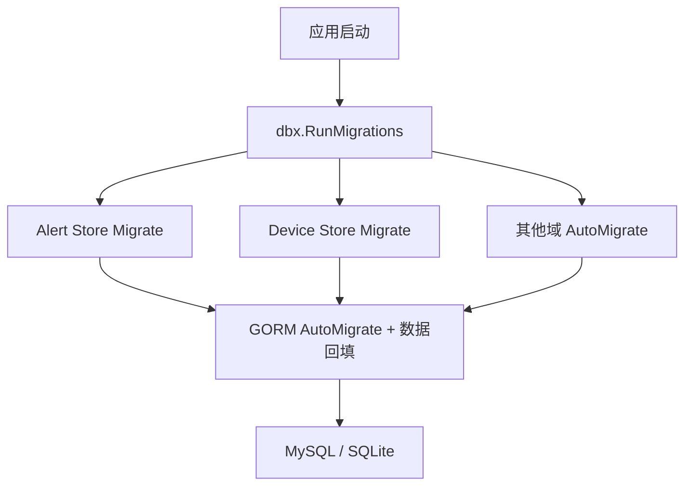
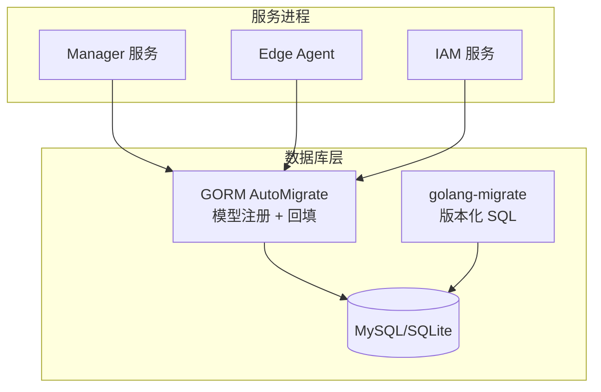
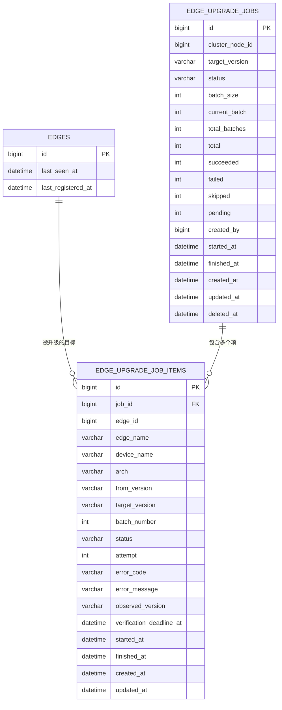
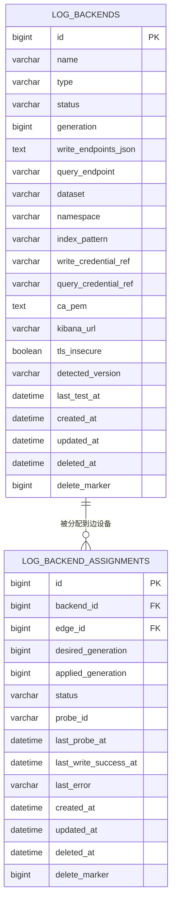
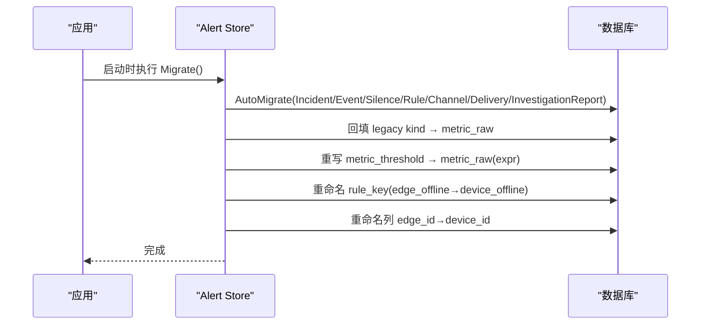
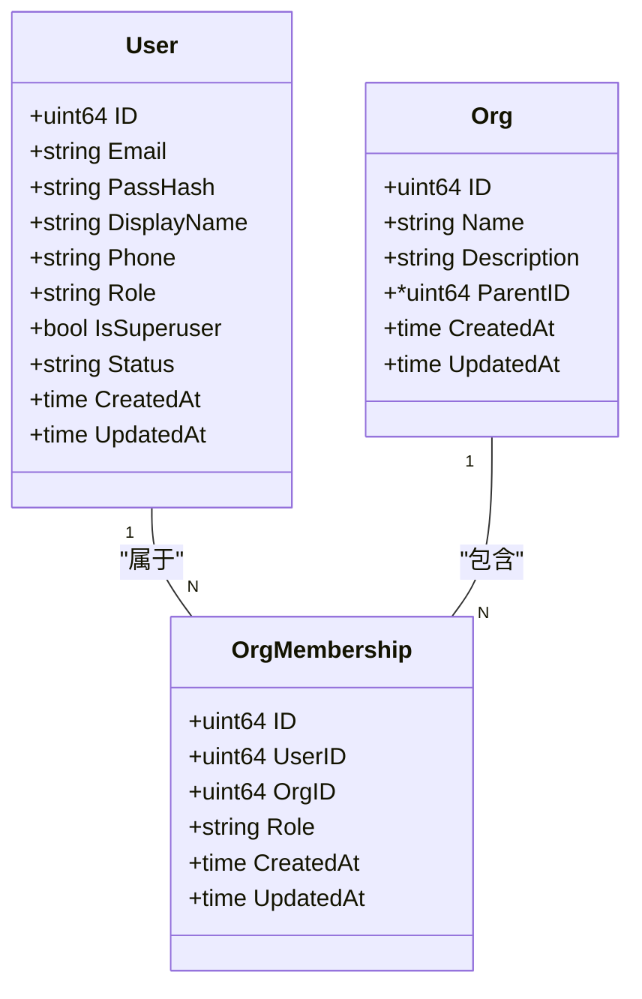
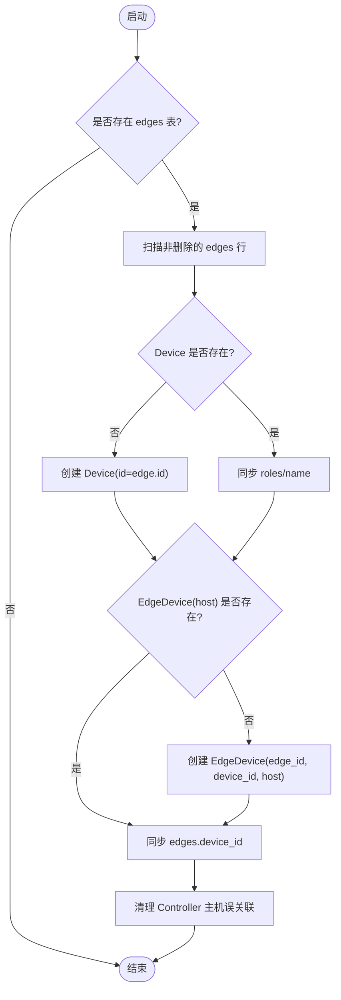
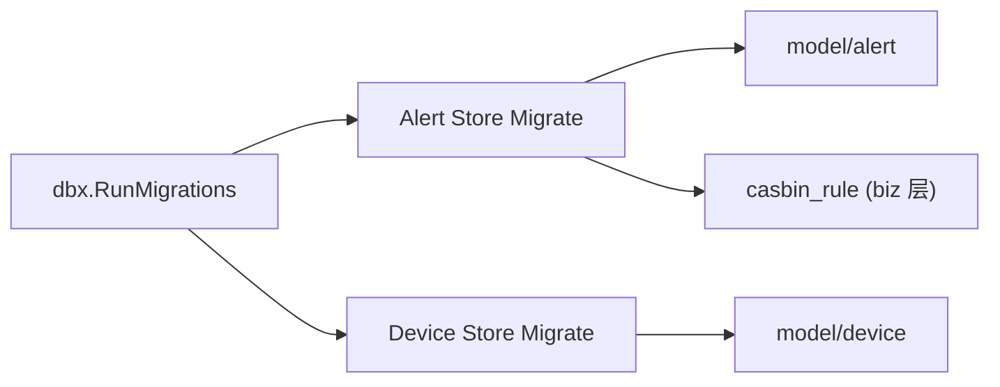

# 数据库设计

<cite>
**本文引用的文件**
- [db/README.md](file://db/README.md)
- [20260731173000_create_edge_upgrade_jobs.up.sql](file://db/migrations/20260731173000_create_edge_upgrade_jobs.up.sql)
- [20260818160000_create_log_backends.up.sql](file://db/migrations/20260818160000_create_log_backends.up.sql)
- [20260820170000_alter_alert_silence_name.up.sql](file://db/migrations/20260820170000_alter_alert_silence_name.up.sql)
- [migrate.go (alert store)](file://internal/manager/data/alert/store/migrate.go)
- [migrate.go (device store)](file://internal/manager/data/device/store/migrate.go)
- [model.go (IAM)](file://internal/iam/model/model.go)
- [migrate.go (dbx)](file://internal/pkg/dbx/migrate.go)
</cite>

## 目录
1. [简介](#简介)
2. [项目结构](#项目结构)
3. [核心组件](#核心组件)
4. [架构总览](#架构总览)
5. [详细组件分析](#详细组件分析)
6. [依赖关系分析](#依赖关系分析)
7. [性能考虑](#性能考虑)
8. [故障排查指南](#故障排查指南)
9. [结论](#结论)
10. [附录](#附录)

## 简介
本技术文档聚焦于系统的数据库设计与实现，覆盖边设备、告警规则、AI 会话、用户权限等关键数据表的结构设计、主外键与索引约束、数据验证与业务规则的数据库落地、迁移策略（版本管理、增量升级、回滚）、数据访问模式与缓存策略、性能优化方案、SQL 查询示例与 ORM 使用方式，以及备份恢复与容量规划建议。文档基于仓库中的 SQL 迁移脚本、GORM 模型定义与迁移编排代码进行梳理，确保读者既能理解高层架构，也能定位到具体实现位置。

## 项目结构
数据库相关资产主要分布在以下位置：
- db/migrations：生产环境 MySQL 的版本化 SQL 迁移脚本（golang-migrate 命名规范），用于扩缩字段、创建新表、重命名列等。
- internal/manager/data/*/store/migrate.go：各业务域通过 GORM AutoMigrate 注册模型并执行向后兼容的数据回填（backfill）。
- internal/iam/model/model.go：IAM 领域实体（用户、组织、成员关系）的模型定义与约束。
- internal/pkg/dbx/migrate.go：统一的迁移运行器，按序调用各域的 Migrator 函数，记录耗时并返回错误上下文。

图表来源
- [migrate.go (dbx):1-47](file://internal/pkg/dbx/migrate.go#L1-L47)
- [migrate.go (alert store):1-454](file://internal/manager/data/alert/store/migrate.go#L1-L454)
- [migrate.go (device store):1-326](file://internal/manager/data/device/store/migrate.go#L1-L326)

章节来源
- [db/README.md:1-15](file://db/README.md#L1-L15)
- [migrate.go (dbx):1-47](file://internal/pkg/dbx/migrate.go#L1-L47)

## 核心组件
- 边设备与升级作业
  - 新增 edge_upgrade_jobs 与 edge_upgrade_job_items 表，支撑批量升级任务与细粒度项跟踪；edges 表增加 last_registered_at 字段以增强状态观测。
  - 索引设计覆盖 cluster_node_id、status、deleted_at、edge_id、batch_number 等高频查询维度。
- 日志后端与分配
  - log_backends 描述可配置的日志写入/查询后端及元信息；log_backend_assignments 将后端与边设备绑定，支持期望/已生效 generation 与探测状态。
  - 唯一键与索引保障多租户/多实例下的唯一性与查询性能。
- 告警规则与事件
  - 通过 GORM AutoMigrate 注册 incident/event/silence/rule/channel/delivery/investigation_report 等表，并在启动时执行多轮数据回填，保证历史数据与新 schema 兼容。
  - 包含 legacy kind 归一化、scope 拆分、rule_key 重命名、metric_threshold→metric_raw 编译回填等。
- 用户与权限
  - users/orgs/org_memberships 三张表构成 RBAC 基础；users.role 保留兼容列，IsSuperuser 作为系统管理员旁路；org_memberships.role 映射到 casbin 策略主体。

章节来源
- [20260731173000_create_edge_upgrade_jobs.up.sql:1-60](file://db/migrations/20260731173000_create_edge_upgrade_jobs.up.sql#L1-L60)
- [20260818160000_create_log_backends.up.sql:1-51](file://db/migrations/20260818160000_create_log_backends.up.sql#L1-L51)
- [migrate.go (alert store):1-454](file://internal/manager/data/alert/store/migrate.go#L1-L454)
- [model.go (IAM):1-140](file://internal/iam/model/model.go#L1-L140)

## 架构总览
下图展示了数据库层在系统中的位置与各模块对数据的访问路径。生产环境采用 golang-migrate 管理版本化 SQL；本地/单机使用 GORM AutoMigrate 初始化空库。业务域通过各自的 store/migrate.go 注册模型并执行数据回填，统一由 dbx.RunMigrations 编排。

图表来源
- [db/README.md:1-15](file://db/README.md#L1-L15)
- [migrate.go (dbx):1-47](file://internal/pkg/dbx/migrate.go#L1-L47)

## 详细组件分析

### 边设备与升级作业
- 表结构与关系
  - edges：新增 last_registered_at 字段，便于追踪最近注册时间。
  - edge_upgrade_jobs：记录升级批次任务，含目标版本、批大小、进度统计、创建人、时间戳、软删除标记等。
  - edge_upgrade_job_items：记录每个边设备的升级明细，含设备名、架构、版本对比、批次号、状态、重试次数、错误码/消息、观察到的版本、校验截止时间等。
- 主键与索引
  - jobs.id 为主键；items.id 为主键，且 (job_id, edge_id) 唯一键避免重复项。
  - 索引：jobs.cluster_node_id、jobs.status、jobs.deleted_at；items.edge_id、items.batch_number。
- 外键约束
  - items.job_id 引用 jobs.id，级联删除，保证任务清理一致性。
- 业务规则落地
  - 通过 status、attempt、error_code/message 等字段驱动调度器与重试逻辑；verification_deadline_at 用于超时校验。
- 查询示例（概念性）
  - 查询某集群待执行的升级任务：SELECT * FROM edge_upgrade_jobs WHERE cluster_node_id=? AND status='queued' ORDER BY created_at;
  - 查询某任务的失败项：SELECT * FROM edge_upgrade_job_items WHERE job_id=? AND status='failed';
- ORM 使用要点
  - 通过 GORM 模型注册后，可使用 Create/Find/Updates/Delete 等操作；注意软删除字段 deleted_at 的使用。

图表来源
- [20260731173000_create_edge_upgrade_jobs.up.sql:1-60](file://db/migrations/20260731173000_create_edge_upgrade_jobs.up.sql#L1-L60)

章节来源
- [20260731173000_create_edge_upgrade_jobs.up.sql:1-60](file://db/migrations/20260731173000_create_edge_upgrade_jobs.up.sql#L1-L60)

### 日志后端与分配
- 表结构与关系
  - log_backends：描述日志后端类型（如 elasticsearch）、读写端点、数据集/命名空间、索引模式、凭据引用、TLS 配置、检测版本、最后测试时间等。
  - log_backend_assignments：将后端与边设备关联，维护 desired/applied generation、状态、探测结果与错误信息。
- 主键与索引
  - backends.id 主键；assignments.id 主键。
  - 唯一键：backends.name+generation+delete_marker；assignments.backend_id+edge_id+delete_marker。
  - 索引：status、deleted_at、backend_id、edge_id。
- 业务规则落地
  - generation 机制用于灰度/回滚控制；status 驱动推送与探测流程；last_write_success_at 用于健康检查。
- 查询示例（概念性）
  - 查询未选中的后端：SELECT * FROM log_backends WHERE status='unselected';
  - 查询某边的分配状态：SELECT * FROM log_backend_assignments WHERE edge_id=?;
- ORM 使用要点
  - 通过 GORM 模型注册后，使用 Upsert/Update 更新 assigned_generation；结合条件查询过滤 deleted_at。

图表来源
- [20260818160000_create_log_backends.up.sql:1-51](file://db/migrations/20260818160000_create_log_backends.up.sql#L1-L51)

章节来源
- [20260818160000_create_log_backends.up.sql:1-51](file://db/migrations/20260818160000_create_log_backends.up.sql#L1-L51)

### 告警规则与事件
- 表族与关系
  - alert_rules：规则定义，包含 rule_key、kind、scope_type、join_mode、severity、enabled、conditions_json 等。
  - alert_incidents：告警事件，关联 rule_key 或 device_id（实体拆分后）。
  - alert_silences：静默规则，name 长度调整以适应更长的标识。
  - alert_channels、alert_deliveries、alert_investigations：通知渠道、投递记录、调查报告。
- 主键与索引
  - 各表均具备自增主键；rules/incidents/silences 等常用查询字段建立索引（例如 status、deleted_at 等）。
- 数据验证与业务规则
  - kind 归一化：legacy kind（prom_query、edge_absence、health_ingest、event_internal 等）统一转换为 metric_raw 或禁用态。
  - scope 拆分：monitoring_pipeline 中特定 kind 调整为 global，保持通道路由一致性。
  - rule_key 重命名：edge_offline → device_offline，保持 UI 与历史数据一致。
  - conditions_json 重构：metric_threshold→metric_raw 编译为单一 PromQL 表达式；metric_raw 旧四字段形状合并为 expr-only。
- 查询示例（概念性）
  - 查询启用的规则：SELECT * FROM alert_rules WHERE enabled=TRUE;
  - 查询某规则的最近事件：SELECT * FROM alert_incidents WHERE rule='device_offline' ORDER BY created_at DESC LIMIT 10;
- ORM 使用要点
  - 通过 store/migrate.go 注册模型；使用 UpsertBuiltinRule 等方法插入内置规则；注意 JSON 字段的序列化/反序列化。

图表来源
- [migrate.go (alert store):1-454](file://internal/manager/data/alert/store/migrate.go#L1-L454)
- [20260820170000_alter_alert_silence_name.up.sql:1-3](file://db/migrations/20260820170000_alter_alert_silence_name.up.sql#L1-L3)

章节来源
- [migrate.go (alert store):1-454](file://internal/manager/data/alert/store/migrate.go#L1-L454)
- [20260820170000_alter_alert_silence_name.up.sql:1-3](file://db/migrations/20260820170000_alter_alert_silence_name.up.sql#L1-L3)

### 用户权限（IAM）
- 表结构与关系
  - users：登录身份，包含邮箱、密码哈希、显示名、电话、角色（admin/user/viewer）、是否超级用户、状态等。
  - orgs：组织单元，支持父子层级（ParentID），名称全局唯一。
  - org_memberships：用户与组织的 N:M 关系，角色（org_admin/member/viewer）映射到 casbin 策略主体。
- 主键与索引
  - users.email 唯一索引；orgs.name 唯一索引；org_memberships.user_id+org_id 复合唯一索引。
- 业务规则落地
  - Role 常量与校验：IsValidRole/RoleCanMutate 限制合法角色与写操作能力。
  - IsSuperuser 旁路 Casbin，防止策略损坏导致锁定。
  - Membership.Role 同步到 casbin_rule，维持策略与 HR 事实一致。
- 查询示例（概念性）
  - 查询用户在某组织的角色：SELECT role FROM org_memberships WHERE user_id=? AND org_id=?;
  - 查询超级用户：SELECT * FROM users WHERE is_superuser=TRUE;
- ORM 使用要点
  - 通过 GORM 模型注册；使用 check 约束与 uniqueIndex 保证数据完整性；在 biz 层同步 casbin 策略。

图表来源
- [model.go (IAM):1-140](file://internal/iam/model/model.go#L1-L140)

章节来源
- [model.go (IAM):1-140](file://internal/iam/model/model.go#L1-L140)

### 设备实体拆分与回填
- 背景
  - 从单一的 edges 实体拆分为 Device + EdgeDevice（关系表），以区分“平台设备”和“边缘节点”。
- 回填逻辑
  - 为每条 edges 行确保存在对应的 Device（必要时复用原 edge.id 以保持 Prometheus 标签兼容）。
  - 创建 EdgeDevice(edge_id, device_id, type=host) 关联，并同步 edges.device_id 指针。
  - 清理 Kubernetes Controller 主机误关联，删除孤立设备。
- 索引与约束
  - 删除旧索引后重建，确保新 schema 下查询性能；软删除字段 delete_marker 回填。
- 查询示例（概念性）
  - 查询某边关联的主机设备：SELECT d.* FROM devices d JOIN edge_devices ed ON d.id=ed.device_id WHERE ed.edge_id=? AND ed.type='host';
- ORM 使用要点
  - 通过 store/migrate.go 注册模型；使用 Upsert/Where Not Exists 风格写入保证幂等。

图表来源
- [migrate.go (device store):1-326](file://internal/manager/data/device/store/migrate.go#L1-L326)

章节来源
- [migrate.go (device store):1-326](file://internal/manager/data/device/store/migrate.go#L1-L326)

## 依赖关系分析
- 迁移编排
  - dbx.RunMigrations 按序调用各域 Migrator，记录开始/结束时间与错误上下文，便于诊断慢迁移。
- 域内依赖
  - Alert Store 依赖 model/alert 与 biz 层的规则编译逻辑（通过回填脚本保持一致性）。
  - Device Store 依赖 model/device 与 edge 表的兼容性处理。
- 外部依赖
  - golang-migrate 负责版本化 SQL；GORM 负责模型注册与自动迁移；Casbin 负责策略同步（biz 层）。

图表来源
- [migrate.go (dbx):1-47](file://internal/pkg/dbx/migrate.go#L1-L47)
- [migrate.go (alert store):1-454](file://internal/manager/data/alert/store/migrate.go#L1-L454)
- [migrate.go (device store):1-326](file://internal/manager/data/device/store/migrate.go#L1-L326)

章节来源
- [migrate.go (dbx):1-47](file://internal/pkg/dbx/migrate.go#L1-L47)

## 性能考虑
- 索引设计
  - 针对高频查询字段建立索引：如 jobs.status、items.batch_number、assignments.status、deleted_at 等。
  - 复合唯一键避免重复关联，减少冲突与重试。
- 软删除与分区
  - 使用 deleted_at/delete_marker 实现软删除，便于审计与回滚；大表可考虑按时间分区（如 incidents/deliveries）。
- 查询优化
  - 使用覆盖索引减少回表；避免 SELECT *，仅选择必要字段；分页查询使用 limit/offset 或游标。
- 写入优化
  - 批量写入与事务合并；避免热点行频繁更新（如 status 字段）造成锁竞争。
- 缓存策略
  - 对读多写少的配置（如 log_backends）引入应用层缓存（带失效策略）；告警规则可按 scope 缓存编译后的表达式。
- 监控与可观测性
  - 记录慢查询与迁移耗时；对关键表建立指标（行数、增长速率、索引命中率）。

[本节提供通用指导，不直接分析具体文件]

## 故障排查指南
- 迁移失败
  - 检查 dbx.RunMigrations 日志中的 migrator index 与 elapsed；确认对应域的 AutoMigrate 是否成功。
  - 对于 golang-migrate 脚本，确认 up/down 成对存在且幂等。
- 数据不一致
  - 检查回填逻辑是否执行（如 rule_key 重命名、edge_id→device_id 重命名列）。
  - 核对唯一键冲突（如 org_memberships.user_id+org_id），必要时清理重复数据。
- 性能问题
  - 使用 EXPLAIN 分析慢查询；确认索引命中；检查是否有全表扫描。
  - 关注 deleted_at 过滤是否利用索引。
- 权限问题
  - 确认 org_memberships.role 与 casbin_rule 同步；IsSuperuser 旁路策略可能导致权限判断异常。

章节来源
- [migrate.go (dbx):1-47](file://internal/pkg/dbx/migrate.go#L1-L47)
- [migrate.go (alert store):1-454](file://internal/manager/data/alert/store/migrate.go#L1-L454)
- [migrate.go (device store):1-326](file://internal/manager/data/device/store/migrate.go#L1-L326)

## 结论
本项目的数据库设计围绕“版本化 SQL + GORM AutoMigrate + 数据回填”的模式展开，兼顾了生产环境的稳健性与本地开发的便捷性。通过明确的表结构、索引与约束，以及完善的迁移编排与回填逻辑，系统在边设备管理、告警规则、日志后端与用户权限等核心领域实现了高内聚、低耦合的数据模型。建议在后续演进中继续遵循幂等迁移、索引先行、软删除与缓存协同的原则，持续提升性能与可维护性。

[本节总结性内容，不直接分析具体文件]

## 附录
- 数据迁移策略
  - 版本管理：使用 golang-migrate 命名规范（YYYYMMDDHHMMSS_*.sql），up/down 成对。
  - 增量升级：先扩字段再改读取逻辑；本地/单机使用 GORM AutoMigrate 初始化空库。
  - 回滚机制：两步回滚——先回退应用至不读取新列的版本，再执行 migrate-down。
- 数据访问模式
  - 通过 GORM 模型进行 CRUD；复杂查询使用 Raw/Exec；JSON 字段注意序列化/反序列化。
- 备份恢复
  - 定期全量备份（mysqldump 或云厂商快照）；增量备份基于 binlog；恢复前校验迁移版本。
- 容量规划
  - 预估 incidents/deliveries 增长速率，设置归档策略；监控磁盘使用率与索引膨胀；必要时分库分表或冷热分离。

[本节提供通用指导，不直接分析具体文件]