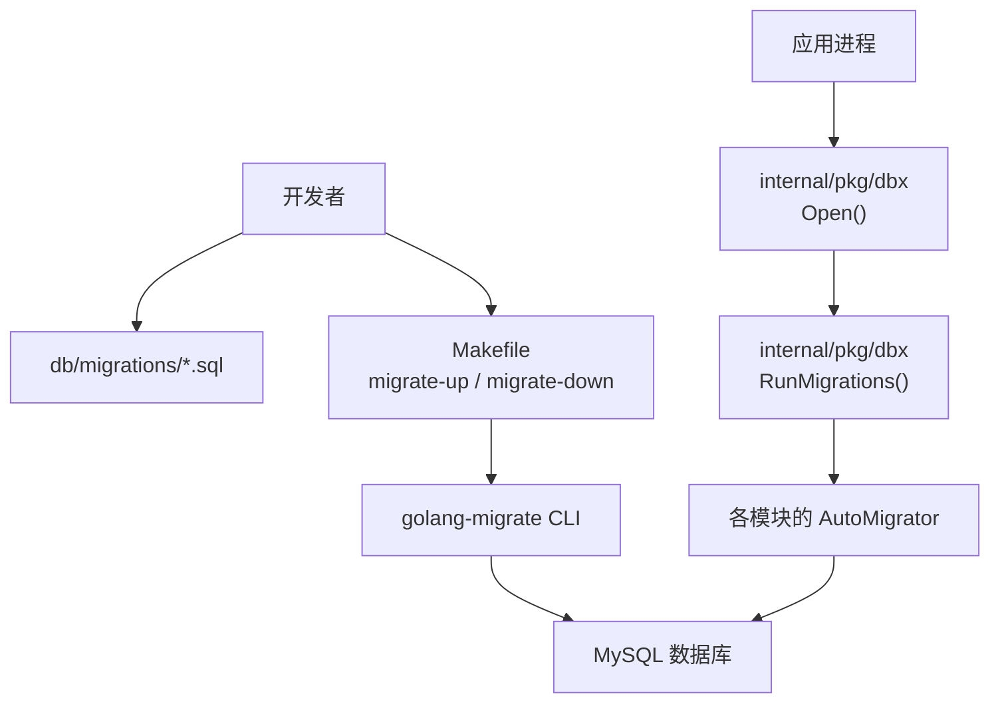
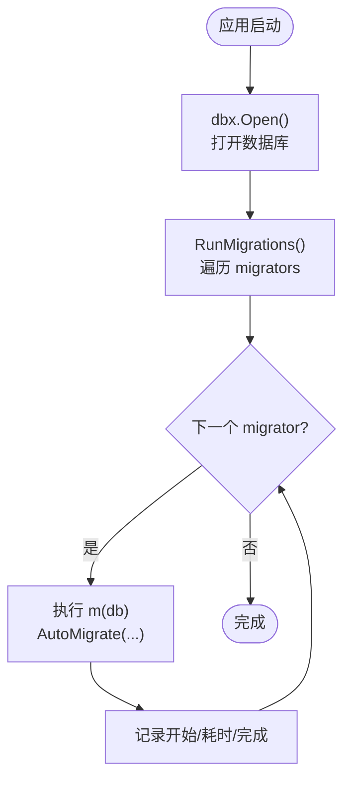
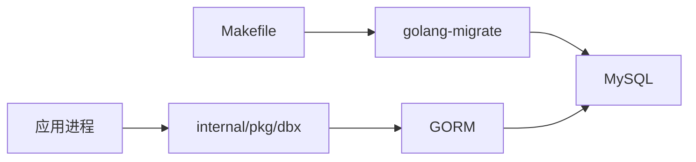

# 数据库迁移

<cite>
**本文引用的文件**
- [db/README.md](file://db/README.md)
- [Makefile](file://Makefile)
- [internal/pkg/dbx/migrate.go](file://internal/pkg/dbx/migrate.go)
- [internal/pkg/dbx/dbx.go](file://internal/pkg/dbx/dbx.go)
- [db/migrations/20260729070000_add_k8s_workload_rollout_metadata.up.sql](file://db/migrations/20260729070000_add_k8s_workload_rollout_metadata.up.sql)
- [db/migrations/20260729070000_add_k8s_workload_rollout_metadata.down.sql](file://db/migrations/20260729070000_add_k8s_workload_rollout_metadata.down.sql)
- [db/migrations/20260818160000_create_log_backends.up.sql](file://db/migrations/20260818160000_create_log_backends.up.sql)
- [db/migrations/20260818160000_create_log_backends.down.sql](file://db/migrations/20260818160000_create_log_backends.down.sql)
- [db/migrations/20260817100000_add_packet_capture_network_namespace.up.sql](file://db/migrations/20260817100000_add_packet_capture_network_namespace.up.sql)
- [db/migrations/20260817100000_add_packet_capture_network_namespace.down.sql](file://db/migrations/20260817100000_add_packet_capture_network_namespace.down.sql)
- [db/migrations/20260820170000_alter_alert_silence_name.up.sql](file://db/migrations/20260820170000_alter_alert_silence_name.up.sql)
- [db/migrations/20260820170000_alter_alert_silence_name.down.sql](file://db/migrations/20260820170000_alter_alert_silence_name.down.sql)
</cite>

## 目录
1. [简介](#简介)
2. [项目结构](#项目结构)
3. [核心组件](#核心组件)
4. [架构总览](#架构总览)
5. [详细组件分析](#详细组件分析)
6. [依赖关系分析](#依赖关系分析)
7. [性能考量](#性能考量)
8. [故障排查指南](#故障排查指南)
9. [结论](#结论)
10. [附录](#附录)

## 简介
本技术文档围绕 ongrid 项目的数据库迁移系统，系统性说明：
- 迁移文件的命名规范、版本管理与执行顺序
- 增量升级机制与 up/down 脚本编写规范、最佳实践
- 数据迁移策略（数据转换、备份恢复、回滚方案）
- 迁移工具使用方法与配置选项
- 具体迁移脚本示例（表结构变更、数据迁移、索引优化）
- 生产环境迁移的安全考虑与故障处理方案

本项目在生产环境使用 golang-migrate 对 MySQL 进行版本化迁移；本地或全新单节点安装仍通过 GORM AutoMigrate 初始化空库。应用启动时按序执行各模块的 AutoMigrator，确保模型与数据库结构一致。

## 项目结构
- 迁移脚本集中存放于 db/migrations，采用 golang-migrate 的时间戳前缀命名规范，每个变更包含 .up.sql 与 .down.sql 成对文件。
- Makefile 提供 migrate-up / migrate-down 目标，封装 golang-migrate CLI 调用，默认连接 MySQL。
- internal/pkg/dbx 提供数据库连接与运行期自动迁移能力（GORM AutoMigrate），用于本地/开发环境与初始建库。



图表来源
- [Makefile:154-162](file://Makefile#L154-L162)
- [internal/pkg/dbx/dbx.go:34-49](file://internal/pkg/dbx/dbx.go#L34-L49)
- [internal/pkg/dbx/migrate.go:20-46](file://internal/pkg/dbx/migrate.go#L20-L46)

章节来源
- [db/README.md:1-15](file://db/README.md#L1-L15)
- [Makefile:70-72](file://Makefile#L70-L72)
- [Makefile:154-162](file://Makefile#L154-L162)
- [internal/pkg/dbx/dbx.go:1-16](file://internal/pkg/dbx/dbx.go#L1-L16)

## 核心组件
- 迁移脚本集合：位于 db/migrations，遵循时间戳命名，成对提供 up/down。
- 迁移执行入口：Makefile 中的 migrate-up / migrate-down 目标，调用 golang-migrate 对 MySQL 执行迁移。
- 运行时自动迁移：internal/pkg/dbx 提供 Open() 打开数据库，RunMigrations() 按序执行各模块的 Migrator（AutoMigrate）。
- 数据库后端：默认 MySQL，支持 SQLite（仅本地/测试场景）。

章节来源
- [db/README.md:1-15](file://db/README.md#L1-L15)
- [Makefile:154-162](file://Makefile#L154-L162)
- [internal/pkg/dbx/migrate.go:12-46](file://internal/pkg/dbx/migrate.go#L12-L46)
- [internal/pkg/dbx/dbx.go:34-49](file://internal/pkg/dbx/dbx.go#L34-L49)

## 架构总览
生产环境采用“双轨”策略：
- 结构演进：通过 golang-migrate 管理 SQL 迁移（up/down），在发布前手动或 CI 执行，确保 schema 与代码兼容。
- 运行时一致性：应用启动时通过 GORM AutoMigrate 保证本地/新库的模型与结构一致，便于开发与调试。

```mermaid
sequenceDiagram
participant Dev as "开发者"
participant Make as "Makefile"
participant Mig as "golang-migrate"
participant DB as "MySQL"
App as "应用进程"
DBX as "dbx.Open()"
RM as "dbx.RunMigrations()"
AM as "各模块 AutoMigrator"
Dev->>Make : make migrate-up
Make->>Mig : -path db/migrations -database mysql : //DSN up
Mig->>DB : 按时间戳顺序执行 .up.sql
Note over DB : 生产结构变更生效
App->>DBX : 启动时打开数据库
DBX-->>App : *gorm.DB
App->>RM : 传入各模块 Migrator
RM->>AM : 依次调用 AutoMigrate(...)
AM->>DB : 同步模型到数据库幂等
```

图表来源
- [Makefile:154-162](file://Makefile#L154-L162)
- [internal/pkg/dbx/dbx.go:34-49](file://internal/pkg/dbx/dbx.go#L34-L49)
- [internal/pkg/dbx/migrate.go:20-46](file://internal/pkg/dbx/migrate.go#L20-L46)

## 详细组件分析

### 迁移文件命名规范与版本管理
- 命名格式：YYYYMMDDHHMMSS_描述性名称.up.sql 与 .down.sql 成对存在。
- 版本号即时间戳，golang-migrate 按文件名排序决定执行顺序，因此新增迁移必须使用未来时间戳，避免重复。
- 建议：
  - 每次变更只做一个明确目的（如新增列、创建表、修改索引）。
  - down 脚本需与 up 完全对称，确保可回滚。
  - 大表变更尽量分步（先加列/索引，再填充数据，最后删除旧列/索引），降低锁表风险。

章节来源
- [db/README.md:1-15](file://db/README.md#L1-L15)
- [Makefile:154-162](file://Makefile#L154-L162)

### 增量升级机制与 up/down 脚本规范
- up 脚本：实现向前增量变更（DDL/DML），应幂等且可重试。
- down 脚本：实现向后回滚，应与 up 严格对应。
- 最佳实践：
  - 大字段/大数据量变更拆分为多步迁移，避免长时间锁表。
  - 对字符串长度扩展，down 中需截断超长数据后再还原定义。
  - 新增列设置合理默认值，避免阻塞写入。
  - 索引变更优先添加后清理，必要时分批重建。

章节来源
- [db/migrations/20260820170000_alter_alert_silence_name.up.sql:1-3](file://db/migrations/20260820170000_alter_alert_silence_name.up.sql#L1-L3)
- [db/migrations/20260820170000_alter_alert_silence_name.down.sql:1-7](file://db/migrations/20260820170000_alter_alert_silence_name.down.sql#L1-L7)

### 数据迁移策略（转换、备份恢复、回滚）
- 数据转换：
  - 将历史数据转换为新结构所需格式，建议在低峰期执行，并记录进度日志。
  - 对长事务操作拆分批次提交，避免锁表过久。
- 备份恢复：
  - 生产变更前执行全量或增量备份，保留快照以便快速回滚。
  - 对关键表（如告警、日志后端配置）额外导出校验。
- 回滚方案：
  - 优先使用 golang-migrate down 回退一步或多步。
  - 若 down 不可用或失败，基于备份恢复至迁移前状态。
  - 回滚前先回滚应用版本至不读取新字段的版本，再执行 down。

章节来源
- [db/README.md:1-15](file://db/README.md#L1-L15)
- [Makefile:154-162](file://Makefile#L154-L162)

### 迁移工具使用方法与配置选项
- 环境变量：
  - DB_DSN：MySQL 连接串，覆盖默认值。
  - MIGRATIONS：迁移脚本路径（默认 db/migrations）。
- 常用命令：
  - make migrate-up：向上执行所有未应用的迁移。
  - make migrate-down：向下回滚一步（可通过多次执行回滚多步）。
- 注意事项：
  - 首次部署或本地新库可使用 GORM AutoMigrate 初始化。
  - 生产环境务必先迁移再滚动更新应用。

章节来源
- [Makefile:70-72](file://Makefile#L70-L72)
- [Makefile:154-162](file://Makefile#L154-L162)
- [db/README.md:1-15](file://db/README.md#L1-L15)

### 具体迁移脚本示例
- 表结构变更（新增列与索引）：
  - 参考：[k8s_workloads 新增多个字段与索引:1-11](file://db/migrations/20260729070000_add_k8s_workload_rollout_metadata.up.sql#L1-L11)
  - 回滚：[删除新增字段与索引:1-11](file://db/migrations/20260729070000_add_k8s_workload_rollout_metadata.down.sql#L1-L11)
- 新建表与关联表：
  - 参考：[创建 log_backends 与 log_backend_assignments:1-51](file://db/migrations/20260818160000_create_log_backends.up.sql#L1-L51)
  - 回滚：[删除两表:1-3](file://db/migrations/20260818160000_create_log_backends.down.sql#L1-L3)
- 简单列变更：
  - 参考：[packet_captures 新增 network_namespace 列:1-3](file://db/migrations/20260817100000_add_packet_capture_network_namespace.up.sql#L1-L3)
  - 回滚：[删除该列:1-3](file://db/migrations/20260817100000_add_packet_capture_network_namespace.down.sql#L1-L3)
- 字段长度扩展与数据保护：
  - 参考：[alert_silences.name 长度扩展:1-3](file://db/migrations/20260820170000_alter_alert_silence_name.up.sql#L1-L3)
  - 回滚：[截断超长数据并还原长度:1-7](file://db/migrations/20260820170000_alter_alert_silence_name.down.sql#L1-L7)

章节来源
- [db/migrations/20260729070000_add_k8s_workload_rollout_metadata.up.sql:1-11](file://db/migrations/20260729070000_add_k8s_workload_rollout_metadata.up.sql#L1-L11)
- [db/migrations/20260729070000_add_k8s_workload_rollout_metadata.down.sql:1-11](file://db/migrations/20260729070000_add_k8s_workload_rollout_metadata.down.sql#L1-L11)
- [db/migrations/20260818160000_create_log_backends.up.sql:1-51](file://db/migrations/20260818160000_create_log_backends.up.sql#L1-L51)
- [db/migrations/20260818160000_create_log_backends.down.sql:1-3](file://db/migrations/20260818160000_create_log_backends.down.sql#L1-L3)
- [db/migrations/20260817100000_add_packet_capture_network_namespace.up.sql:1-3](file://db/migrations/20260817100000_add_packet_capture_network_namespace.up.sql#L1-L3)
- [db/migrations/20260817100000_add_packet_capture_network_namespace.down.sql:1-3](file://db/migrations/20260817100000_add_packet_capture_network_namespace.down.sql#L1-L3)
- [db/migrations/20260820170000_alter_alert_silence_name.up.sql:1-3](file://db/migrations/20260820170000_alter_alert_silence_name.up.sql#L1-L3)
- [db/migrations/20260820170000_alter_alert_silence_name.down.sql:1-7](file://db/migrations/20260820170000_alter_alert_silence_name.down.sql#L1-L7)

### 运行时自动迁移（GORM AutoMigrate）
- 作用：在本地或全新单节点环境中，通过 AutoMigrate 初始化空库并同步模型结构。
- 执行流程：
  - 应用启动调用 dbx.Open() 获取 *gorm.DB。
  - 调用 RunMigrations() 依次执行各模块的 Migrator（AutoMigrate）。
  - 每个迁移耗时会被记录，便于定位慢迁移。
- 注意：生产环境以 golang-migrate 为准，AutoMigrate 主要用于开发/初始化。



图表来源
- [internal/pkg/dbx/dbx.go:34-49](file://internal/pkg/dbx/dbx.go#L34-L49)
- [internal/pkg/dbx/migrate.go:20-46](file://internal/pkg/dbx/migrate.go#L20-L46)

章节来源
- [internal/pkg/dbx/migrate.go:12-46](file://internal/pkg/dbx/migrate.go#L12-L46)
- [internal/pkg/dbx/dbx.go:34-49](file://internal/pkg/dbx/dbx.go#L34-L49)

## 依赖关系分析
- 外部依赖：
  - golang-migrate：负责 SQL 迁移脚本的版本控制与执行。
  - GORM + MySQL/SQLite 驱动：用于运行时 AutoMigrate 与连接管理。
- 内部依赖：
  - Makefile 封装迁移命令，统一参数与环境变量。
  - dbx 包提供数据库连接与迁移编排。



图表来源
- [Makefile:154-162](file://Makefile#L154-L162)
- [internal/pkg/dbx/dbx.go:34-49](file://internal/pkg/dbx/dbx.go#L34-L49)

章节来源
- [Makefile:154-162](file://Makefile#L154-L162)
- [internal/pkg/dbx/dbx.go:34-49](file://internal/pkg/dbx/dbx.go#L34-L49)

## 性能考量
- 大表变更：
  - 优先使用在线 DDL（如 MySQL 8+ 的 ALGORITHM=INPLACE），减少锁表时间。
  - 分阶段迁移：先加列/索引，再批量更新数据，最后删旧列/重建索引。
- 索引优化：
  - 新增复合索引时评估查询模式，避免冗余索引。
  - 删除无用索引前先分析慢查询。
- 事务与批处理：
  - 大批量 DML 使用分批提交，控制事务大小。
  - 监控锁等待与死锁，必要时调整隔离级别或重试策略。

## 故障排查指南
- 常见问题与定位：
  - 迁移失败：查看 golang-migrate 输出与应用日志，确认 DSN、权限与网络连通性。
  - 自动迁移报错：检查 dbx.Open() 是否成功 Ping 数据库，以及各模块 Migrator 是否返回错误。
  - 回滚失败：核对 down 脚本是否与 up 对称，必要时从备份恢复。
- 安全与合规：
  - DSN 密码不在日志中打印（已做脱敏）。
  - 生产变更需审批与灰度，先在预发验证。
- 回滚步骤：
  - 先回滚应用版本至不读取新字段的版本。
  - 执行 make migrate-down 回退相应迁移。
  - 若 down 失败，从备份恢复数据库。

章节来源
- [internal/pkg/dbx/dbx.go:51-77](file://internal/pkg/dbx/dbx.go#L51-L77)
- [internal/pkg/dbx/dbx.go:130-150](file://internal/pkg/dbx/dbx.go#L130-L150)
- [db/README.md:1-15](file://db/README.md#L1-L15)

## 结论
本项目的数据库迁移体系以 golang-migrate 为核心，配合 Makefile 简化执行流程；同时通过 dbx 包的 AutoMigrate 保障本地与新库的一致性。生产环境遵循“先迁移、后发布”的原则，并提供完善的 up/down 脚本与回滚策略。建议持续优化大表变更与索引策略，结合备份与灰度发布，确保迁移过程安全可控。

## 附录
- 常用命令速查：
  - make migrate-up：执行所有未应用的迁移。
  - make migrate-down：回滚最近一次迁移。
  - 本地新库：直接运行应用，由 AutoMigrate 初始化。
- 参考示例：
  - 新增列与索引：[k8s_workloads 迁移:1-11](file://db/migrations/20260729070000_add_k8s_workload_rollout_metadata.up.sql#L1-L11)
  - 新建表：[log_backends 迁移:1-51](file://db/migrations/20260818160000_create_log_backends.up.sql#L1-L51)
  - 字段长度扩展：[alert_silences.name 迁移:1-3](file://db/migrations/20260820170000_alter_alert_silence_name.up.sql#L1-L3)