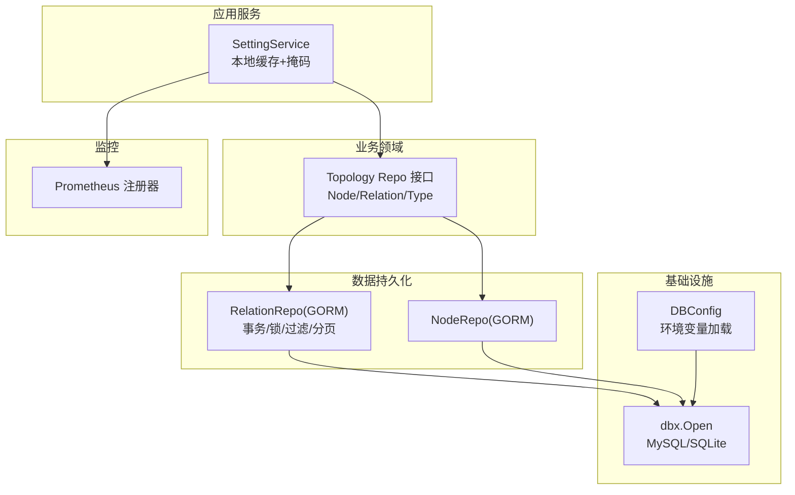
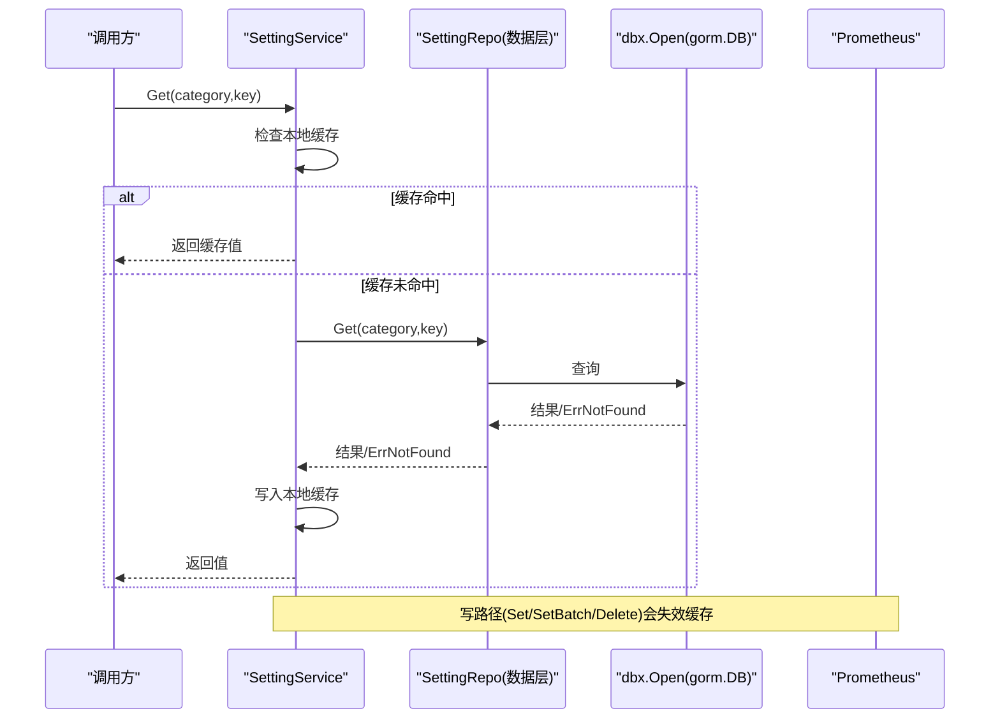
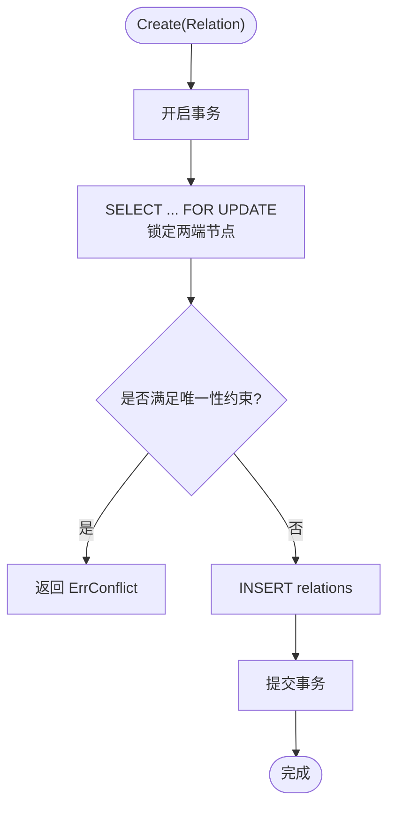
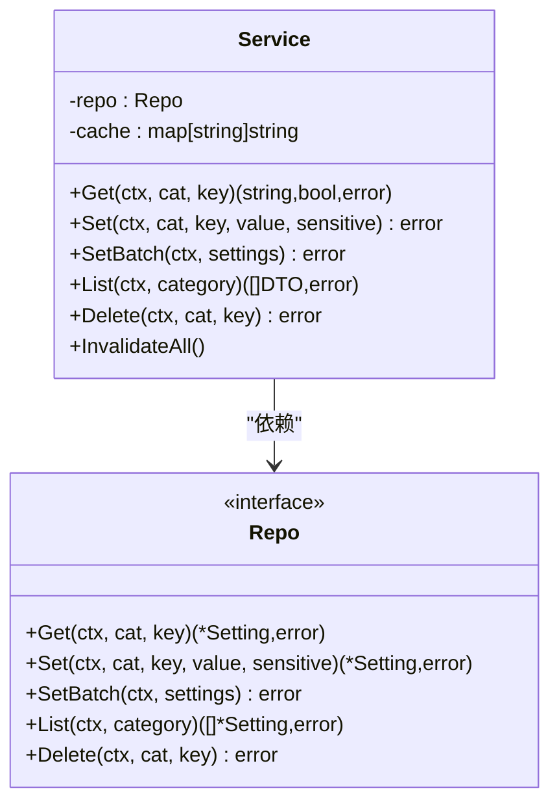
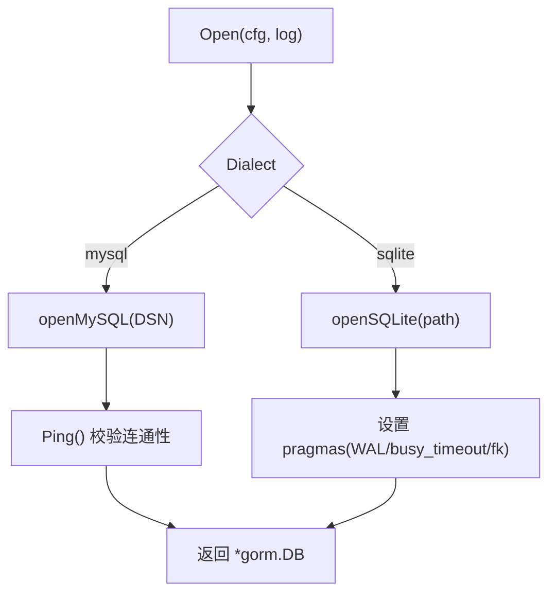
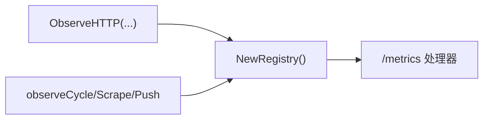
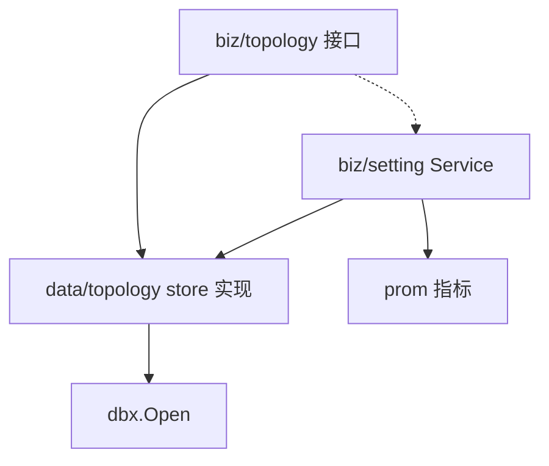

# 数据访问模式

<cite>
**本文引用的文件**
- [dbx.go](file://internal/pkg/dbx/dbx.go)
- [config.go](file://internal/pkg/config/config.go)
- [repo.go](file://internal/manager/biz/topology/repo.go)
- [relation_repo.go](file://internal/manager/data/topology/store/relation_repo.go)
- [node_repo.go](file://internal/manager/data/topology/store/node_repo.go)
- [service.go](file://internal/manager/biz/setting/service.go)
- [errs.go](file://internal/pkg/errs/errs.go)
- [prom.go](file://internal/pkg/prom/prom.go)
- [manager_metrics.go](file://internal/pkg/prom/manager_metrics.go)
- [http.go](file://internal/manager/server/edge/http.go)
- [metrics_observer.go](file://internal/edgeagent/k8s/metrics_observer.go)
- [db-connection-pool-exhaustion.md](file://internal/manager/biz/knowledge/builtin_vault/diagnostics/db-connection-pool-exhaustion.md)
- [db-slow-queries-locks.md](file://internal/manager/biz/knowledge/builtin_vault/diagnostics/db-slow-queries-locks.md)
</cite>

## 目录
1. [简介](#简介)
2. [项目结构](#项目结构)
3. [核心组件](#核心组件)
4. [架构总览](#架构总览)
5. [详细组件分析](#详细组件分析)
6. [依赖关系分析](#依赖关系分析)
7. [性能与调优](#性能与调优)
8. [故障排查指南](#故障排查指南)
9. [结论](#结论)
10. [附录：查询示例与最佳实践](#附录：查询示例与最佳实践)

## 简介
本技术文档聚焦于数据访问层的设计与实现，围绕 Repository 模式在系统中的落地展开。内容涵盖：
- 抽象接口与具体实现的职责划分
- CRUD 封装、事务边界与一致性策略
- 连接池配置、查询优化与性能调优
- 缓存策略（本地进程内缓存）的使用场景与失效机制
- 复杂查询、批量操作与并发访问模式
- 错误处理、重试与监控指标采集的最佳实践

## 项目结构
数据访问相关代码主要分布在以下层次：
- 基础设施层：数据库连接与方言选择（MySQL/SQLite），日志级别控制，DSN 脱敏等
- 业务领域层：定义 Repository 接口契约（如拓扑 Node/Relation/Type 的读写能力）
- 数据持久化层：基于 GORM 的具体实现，封装 SQL 构建、过滤、分页、事务与锁
- 应用服务层：在 Service 中组合 Repo 并加入本地缓存、敏感字段掩码等横切逻辑
- 监控与可观测性：Prometheus 指标注册与 HTTP 请求度量

图表来源
- [dbx.go:34-49](file://internal/pkg/dbx/dbx.go#L34-L49)
- [config.go:306-319](file://internal/pkg/config/config.go#L306-L319)
- [repo.go:42-89](file://internal/manager/biz/topology/repo.go#L42-L89)
- [relation_repo.go:15-23](file://internal/manager/data/topology/store/relation_repo.go#L15-L23)
- [service.go:49-70](file://internal/manager/biz/setting/service.go#L49-L70)
- [prom.go:16-29](file://internal/pkg/prom/prom.go#L16-L29)

章节来源
- [dbx.go:1-151](file://internal/pkg/dbx/dbx.go#L1-L151)
- [config.go:306-319](file://internal/pkg/config/config.go#L306-L319)
- [repo.go:1-90](file://internal/manager/biz/topology/repo.go#L1-L90)
- [relation_repo.go:1-145](file://internal/manager/data/topology/store/relation_repo.go#L1-L145)
- [service.go:1-259](file://internal/manager/biz/setting/service.go#L1-L259)
- [prom.go:1-29](file://internal/pkg/prom/prom.go#L1-L29)

## 核心组件
- 数据库接入层（dbx）
  - 统一入口 Open(cfg, log)，根据 Dialect 选择 MySQL 或 SQLite
  - MySQL 启动时 Ping 校验连通性；默认 Warn 级日志避免噪音
  - SQLite 启用 WAL、busy_timeout、foreign_keys 等 pragmas，提升并发与稳定性
- 配置层（config）
  - 通过环境变量加载 DBConfig（Dialect/DSN/Path），提供默认值
- 领域接口（biz/topology repo 接口）
  - 定义 NodeRepo、RelationRepo、RelationTypeRepo、NodeTypeRepo 的 CRUD 契约
  - 明确 List/Count 的过滤参数（类型、关键词、分页）
- 数据实现（data/topology store）
  - RelationRepo 使用 GORM 实现，包含事务、行级锁、条件过滤、分页
  - 将 gorm.ErrRecordNotFound 映射为统一的 ErrNotFound
- 应用服务（biz/setting service）
  - 进程内本地缓存（map + RWMutex），读路径命中即短路 DB
  - 写路径（Set/SetBatch/Delete）后主动失效对应缓存键
  - 列表返回时对敏感字段进行掩码处理
- 错误体系（errs）
  - 统一定义常见哨兵错误，并提供 HTTPStatus 映射，便于上层统一响应
- 监控（prom）
  - 提供全局 Registry 与 /metrics 处理器
  - 记录 HTTP 请求总量与时延分桶，支持 Go 运行时与进程指标

章节来源
- [dbx.go:34-151](file://internal/pkg/dbx/dbx.go#L34-L151)
- [config.go:306-319](file://internal/pkg/config/config.go#L306-L319)
- [repo.go:17-89](file://internal/manager/biz/topology/repo.go#L17-L89)
- [relation_repo.go:15-145](file://internal/manager/data/topology/store/relation_repo.go#L15-L145)
- [service.go:29-259](file://internal/manager/biz/setting/service.go#L29-L259)
- [errs.go:1-54](file://internal/pkg/errs/errs.go#L1-L54)
- [prom.go:1-29](file://internal/pkg/prom/prom.go#L1-L29)

## 架构总览
下图展示了从应用服务到数据库的完整调用链，以及缓存与监控的横切点。

图表来源
- [service.go:72-106](file://internal/manager/biz/setting/service.go#L72-L106)
- [dbx.go:34-49](file://internal/pkg/dbx/dbx.go#L34-L49)

## 详细组件分析

### 拓扑数据访问（Node/Relation/Type）
- 接口设计
  - NodeRepo/RelationRepo/RelationTypeRepo/NodeTypeRepo 暴露一致的 CRUD 与 Count/List 能力
  - Filter 结构体承载查询条件（类型、关键词、分页、端点筛选）
- 实现要点（以 RelationRepo 为例）
  - Create 使用事务，并在必要时对关联节点加排他锁，保证一致性
  - 特殊关系（如设备归属集群）存在唯一性约束，冲突时返回 ErrConflict
  - List/Count 支持 SrcOrDstID/SrcID/DstID/Type 的组合过滤与分页
  - 将 gorm.ErrRecordNotFound 转换为 errs.ErrNotFound，统一错误语义

图表来源
- [relation_repo.go:23-63](file://internal/manager/data/topology/store/relation_repo.go#L23-L63)

章节来源
- [repo.go:17-89](file://internal/manager/biz/topology/repo.go#L17-L89)
- [relation_repo.go:23-145](file://internal/manager/data/topology/store/relation_repo.go#L23-L145)

### 设置项服务（本地缓存与掩码）
- 本地缓存
  - 读路径先查内存 map，命中直接返回，减少 DB 压力
  - 写路径（Set/SetBatch/Delete）成功后删除对应缓存键，确保最终一致
- 安全与可见性
  - List 返回时对敏感字段进行掩码，避免明文泄露
- 适用场景
  - 小表、高频读取、低更新频率的配置类数据（如 LLM 提供商配置）

图表来源
- [service.go:29-70](file://internal/manager/biz/setting/service.go#L29-L70)
- [service.go:72-259](file://internal/manager/biz/setting/service.go#L72-L259)

章节来源
- [service.go:1-259](file://internal/manager/biz/setting/service.go#L1-L259)

### 数据库接入与方言选择
- dbx.Open
  - 根据 Dialect 选择 MySQL 或 SQLite
  - MySQL：启动时 Ping 校验连通性，默认 Warn 日志
  - SQLite：启用 WAL、busy_timeout、foreign_keys，支持内存库用于测试
- 配置加载
  - DBConfig 由环境变量驱动，提供默认值，便于本地开发

图表来源
- [dbx.go:34-151](file://internal/pkg/dbx/dbx.go#L34-L151)
- [config.go:306-319](file://internal/pkg/config/config.go#L306-L319)

章节来源
- [dbx.go:34-151](file://internal/pkg/dbx/dbx.go#L34-L151)
- [config.go:306-319](file://internal/pkg/config/config.go#L306-L319)

### 监控与指标
- Prometheus 注册器
  - 提供 NewRegistry 与 /metrics 处理器
  - 已注册 Go 运行时与进程指标
- HTTP 指标
  - ObserveHTTP 记录请求量与时延，按状态码分类
- 边缘侧指标
  - 抓取周期耗时、样本数、推送成功/失败计数等

图表来源
- [prom.go:16-29](file://internal/pkg/prom/prom.go#L16-L29)
- [manager_metrics.go:355-377](file://internal/pkg/prom/manager_metrics.go#L355-L377)
- [metrics_observer.go:85-118](file://internal/edgeagent/k8s/metrics_observer.go#L85-L118)

章节来源
- [prom.go:1-29](file://internal/pkg/prom/prom.go#L1-L29)
- [manager_metrics.go:303-377](file://internal/pkg/prom/manager_metrics.go#L303-L377)
- [metrics_observer.go:85-118](file://internal/edgeagent/k8s/metrics_observer.go#L85-L118)

## 依赖关系分析
- 耦合与内聚
  - biz 层仅依赖接口，不感知具体存储实现，利于替换与测试
  - data 层专注 SQL/GORM 细节，保持高内聚
  - dbx 作为共享基础，屏蔽方言差异
- 外部依赖
  - GORM、MySQL/SQLite 驱动、Prometheus client_golang
- 潜在循环依赖
  - 当前分层清晰，未见循环引用

图表来源
- [repo.go:42-89](file://internal/manager/biz/topology/repo.go#L42-L89)
- [relation_repo.go:15-23](file://internal/manager/data/topology/store/relation_repo.go#L15-L23)
- [dbx.go:34-49](file://internal/pkg/dbx/dbx.go#L34-L49)
- [service.go:49-70](file://internal/manager/biz/setting/service.go#L49-L70)
- [prom.go:16-29](file://internal/pkg/prom/prom.go#L16-L29)

章节来源
- [repo.go:42-89](file://internal/manager/biz/topology/repo.go#L42-L89)
- [relation_repo.go:15-23](file://internal/manager/data/topology/store/relation_repo.go#L15-L23)
- [dbx.go:34-49](file://internal/pkg/dbx/dbx.go#L34-L49)
- [service.go:49-70](file://internal/manager/biz/setting/service.go#L49-L70)
- [prom.go:16-29](file://internal/pkg/prom/prom.go#L16-L29)

## 性能与调优
- 连接池与事务
  - 连接池耗尽通常表现为“获取连接超时”或“服务器 too many connections”，需区分客户端 pool 上限与服务端 max_connections
  - 建议：修复连接泄漏（确保每次借出都归还）、合理设置 per-instance max_open、必要时引入连接代理（PgBouncer/ProxySQL）
  - 长事务与 idle in transaction 会导致锁持有时间过长，应缩短事务范围并确保 commit/rollback
- 查询优化
  - 慢查询与锁竞争：定位阻塞者，缩短事务、缩小锁粒度、避免热点行争用
  - 索引与统计信息：全表扫描需加索引或重写查询
- 本地缓存
  - 设置项服务采用进程内缓存，显著降低热点配置的 DB 压力
  - 写路径及时失效缓存，保障一致性
- 批处理与并发
  - 批量操作采用有界并发（semaphore）与顺序保留的结果收集，兼顾吞吐与可观测性
- 监控
  - 通过 Prometheus 指标观察 HTTP 请求量、时延、抓取/推送成功率等，辅助容量规划与问题定位

章节来源
- [db-connection-pool-exhaustion.md:1-84](file://internal/manager/biz/knowledge/builtin_vault/diagnostics/db-connection-pool-exhaustion.md#L1-L84)
- [db-slow-queries-locks.md:50-85](file://internal/manager/biz/knowledge/builtin_vault/diagnostics/db-slow-queries-locks.md#L50-L85)
- [service.go:72-165](file://internal/manager/biz/setting/service.go#L72-L165)
- [http.go:810-860](file://internal/manager/server/edge/http.go#L810-L860)
- [manager_metrics.go:355-377](file://internal/pkg/prom/manager_metrics.go#L355-L377)

## 故障排查指南
- 常见问题定位
  - 连接池耗尽：检查服务端 max_connections、客户端 pool 大小、是否存在连接泄漏
  - 慢查询与锁等待：查找阻塞会话，清理长时间事务或 DDL 锁
  - 缓存不一致：确认写路径是否正确失效缓存键
- 错误映射
  - 使用 errs.HTTPStatus 将领域错误映射为 HTTP 状态码，便于前端与网关处理
- 监控告警
  - 关注 /metrics 中的 HTTP 请求量与时延、抓取/推送成功率等关键指标

章节来源
- [db-connection-pool-exhaustion.md:1-84](file://internal/manager/biz/knowledge/builtin_vault/diagnostics/db-connection-pool-exhaustion.md#L1-L84)
- [db-slow-queries-locks.md:50-85](file://internal/manager/biz/knowledge/builtin_vault/diagnostics/db-slow-queries-locks.md#L50-L85)
- [errs.go:28-54](file://internal/pkg/errs/errs.go#L28-L54)
- [manager_metrics.go:355-377](file://internal/pkg/prom/manager_metrics.go#L355-L377)

## 结论
本项目采用清晰的 Repository 模式分层：biz 层定义接口契约，data 层实现具体存储，dbx 统一数据库接入。通过本地缓存、事务与行级锁、分页与过滤、以及完善的错误与监控体系，实现了稳定高效的数据访问能力。在生产环境中，建议结合连接池与慢查询诊断指南持续优化，确保在高并发与大数据量场景下的可用性与性能。

## 附录：查询示例与最佳实践
- 复杂查询
  - 使用 RelationListFilter 组合 SrcOrDstID/SrcID/DstID/Type 进行精确筛选，配合 Limit/Offset 分页
  - 参考路径：[relation_repo.go:87-112](file://internal/manager/data/topology/store/relation_repo.go#L87-L112)
- 批量操作
  - 使用 runEdgeBatch 对有界并发执行批量任务，保留输入顺序并统计成功/失败
  - 参考路径：[http.go:810-860](file://internal/manager/server/edge/http.go#L810-L860)
- 并发访问模式
  - 读多写少的配置项通过本地缓存加速，写路径及时失效缓存
  - 参考路径：[service.go:72-165](file://internal/manager/biz/setting/service.go#L72-L165)
- 事务与一致性
  - 创建关系时使用事务与行级锁，避免竞态与重复
  - 参考路径：[relation_repo.go:23-63](file://internal/manager/data/topology/store/relation_repo.go#L23-L63)
- 错误处理
  - 将 gorm.ErrRecordNotFound 映射为 errs.ErrNotFound，并通过 errs.HTTPStatus 转为 HTTP 状态码
  - 参考路径：[relation_repo.go:76-85](file://internal/manager/data/topology/store/relation_repo.go#L76-L85)、[errs.go:28-54](file://internal/pkg/errs/errs.go#L28-L54)
- 监控指标
  - 使用 ObserveHTTP 记录 API 请求量与时延，结合边缘侧抓取/推送指标评估系统健康度
  - 参考路径：[manager_metrics.go:355-377](file://internal/pkg/prom/manager_metrics.go#L355-L377)、[metrics_observer.go:85-118](file://internal/edgeagent/k8s/metrics_observer.go#L85-L118)