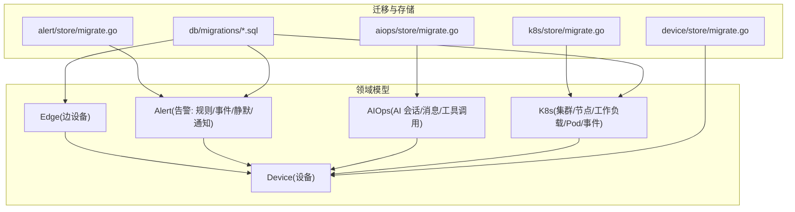
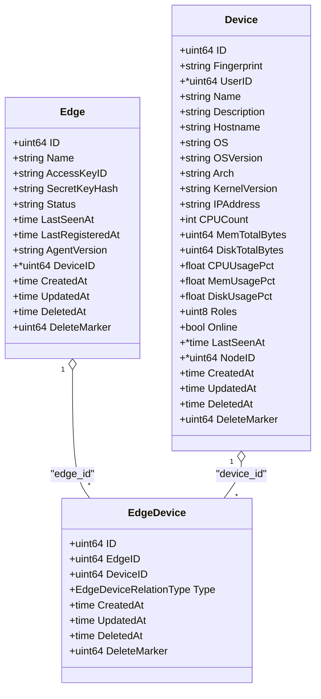
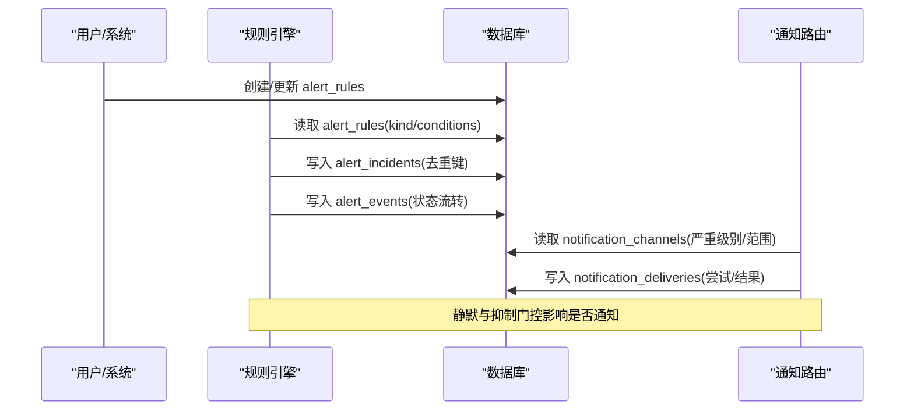
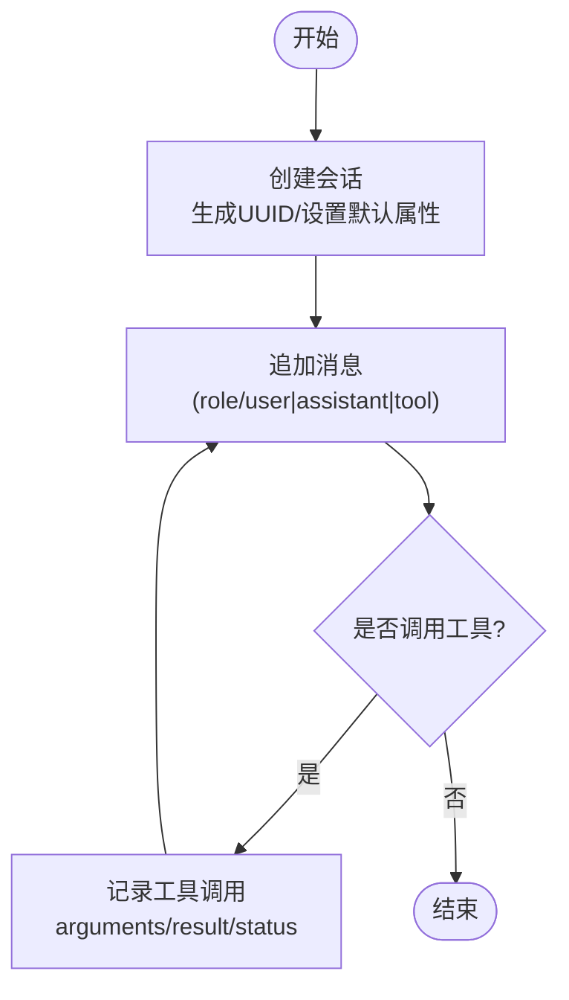
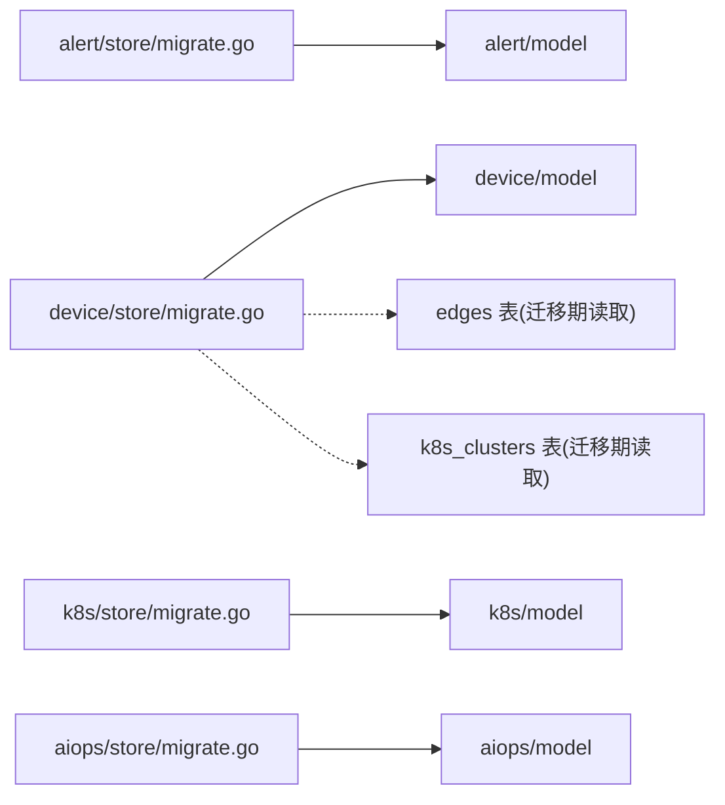

# 核心数据模型

<cite>
**本文引用的文件**
- [internal/manager/model/edge/model.go](file://internal/manager/model/edge/model.go)
- [internal/manager/model/device/model.go](file://internal/manager/model/device/model.go)
- [internal/manager/model/alert/model.go](file://internal/manager/model/alert/model.go)
- [internal/manager/model/k8s/model.go](file://internal/manager/model/k8s/model.go)
- [internal/manager/model/aiops/model.go](file://internal/manager/model/aiops/model.go)
- [db/migrations/20260731173000_create_edge_upgrade_jobs.up.sql](file://db/migrations/20260731173000_create_edge_upgrade_jobs.up.sql)
- [db/migrations/20260818160000_create_log_backends.up.sql](file://db/migrations/20260818160000_create_log_backends.up.sql)
- [db/migrations/20260820170000_alter_alert_silence_name.up.sql](file://db/migrations/20260820170000_alter_alert_silence_name.up.sql)
- [internal/manager/data/alert/store/migrate.go](file://internal/manager/data/alert/store/migrate.go)
- [internal/manager/data/device/store/migrate.go](file://internal/manager/data/device/store/migrate.go)
- [internal/manager/data/k8s/store/migrate.go](file://internal/manager/data/k8s/store/migrate.go)
- [internal/manager/data/aiops/store/migrate.go](file://internal/manager/data/aiops/store/migrate.go)
</cite>

## 目录
1. [简介](#简介)
2. [项目结构](#项目结构)
3. [核心组件](#核心组件)
4. [架构总览](#架构总览)
5. [详细组件分析](#详细组件分析)
6. [依赖关系分析](#依赖关系分析)
7. [性能考虑](#性能考虑)
8. [故障排查指南](#故障排查指南)
9. [结论](#结论)
10. [附录](#附录)

## 简介
本技术文档聚焦于边设备、告警规则、AI 会话、设备信息、Kubernetes 资源等关键实体的数据库设计。内容涵盖：
- 表结构与字段定义（类型、约束、默认值）
- 主外键与表间关联
- 数据验证与业务规则的数据库实现
- SQL 建表语句与 ORM 映射示例
- 索引策略与查询优化建议

## 项目结构
本项目采用领域分层组织：
- model 层：定义实体与 GORM 标签，描述表结构、约束与默认值
- data/store 层：负责 AutoMigrate 与历史数据迁移/回填
- db/migrations：版本化 SQL 迁移脚本（新增/变更表结构）

图表来源
- [internal/manager/model/edge/model.go:22-66](file://internal/manager/model/edge/model.go#L22-L66)
- [internal/manager/model/device/model.go:29-105](file://internal/manager/model/device/model.go#L29-L105)
- [internal/manager/model/alert/model.go:216-386](file://internal/manager/model/alert/model.go#L216-L386)
- [internal/manager/model/aiops/model.go:25-208](file://internal/manager/model/aiops/model.go#L25-L208)
- [internal/manager/model/k8s/model.go:21-198](file://internal/manager/model/k8s/model.go#L21-L198)
- [internal/manager/data/alert/store/migrate.go:20-31](file://internal/manager/data/alert/store/migrate.go#L20-L31)
- [internal/manager/data/device/store/migrate.go:27-64](file://internal/manager/data/device/store/migrate.go#L27-L64)
- [internal/manager/data/k8s/store/migrate.go:11-29](file://internal/manager/data/k8s/store/migrate.go#L11-L29)
- [internal/manager/data/aiops/store/migrate.go:18-29](file://internal/manager/data/aiops/store/migrate.go#L18-L29)
- [db/migrations/20260731173000_create_edge_upgrade_jobs.up.sql:4-28](file://db/migrations/20260731173000_create_edge_upgrade_jobs.up.sql#L4-L28)
- [db/migrations/20260818160000_create_log_backends.up.sql:1-27](file://db/migrations/20260818160000_create_log_backends.up.sql#L1-L27)

章节来源
- [internal/manager/model/edge/model.go:22-66](file://internal/manager/model/edge/model.go#L22-L66)
- [internal/manager/model/device/model.go:29-105](file://internal/manager/model/device/model.go#L29-L105)
- [internal/manager/model/alert/model.go:216-386](file://internal/manager/model/alert/model.go#L216-L386)
- [internal/manager/model/aiops/model.go:25-208](file://internal/manager/model/aiops/model.go#L25-L208)
- [internal/manager/model/k8s/model.go:21-198](file://internal/manager/model/k8s/model.go#L21-L198)

## 核心组件
- 边设备 Edge：记录 Agent 身份、在线状态、最近心跳/注册时间与版本；通过多对多与 Device 关联
- 设备 Device：主机指纹、硬件/系统信息、容量与实时使用率、角色位图、拓扑 Node 关联
- 告警 Alert：规则 Rule、事件 Event、静默 Silence、通知渠道 Channel、投递 Delivery、事件 Incident
- AI 会话 AIOps：会话 Session、消息 Message、工具调用 ToolCall
- Kubernetes K8s：集群 Cluster、节点 Node、工作负载 Workload、Pod、事件 Event、安装 Installation、遥测凭证 TelemetryCredential

章节来源
- [internal/manager/model/edge/model.go:22-66](file://internal/manager/model/edge/model.go#L22-L66)
- [internal/manager/model/device/model.go:29-105](file://internal/manager/model/device/model.go#L29-L105)
- [internal/manager/model/alert/model.go:216-386](file://internal/manager/model/alert/model.go#L216-L386)
- [internal/manager/model/aiops/model.go:25-208](file://internal/manager/model/aiops/model.go#L25-L208)
- [internal/manager/model/k8s/model.go:21-198](file://internal/manager/model/k8s/model.go#L21-L198)

## 架构总览
下图展示核心实体间的关系与主要索引点，体现“边设备-设备”的解耦设计与告警/AI/K8s 围绕设备展开的关联。

```mermaid
erDiagram
EDGES {
bigint id PK
varchar name
varchar access_key_id
varchar secret_key_hash
varchar status
datetime last_seen_at
datetime last_registered_at
varchar agent_version
bigint device_id FK
bigint created_by
datetime created_at
datetime updated_at
datetime deleted_at
bigint delete_marker
}
DEVICES {
bigint id PK
varchar fingerprint UK
bigint user_id
varchar name
text description
varchar hostname
varchar os
varchar os_version
varchar arch
varchar kernel_version
varchar ip_address
int cpu_count
bigint mem_total_bytes
bigint disk_total_bytes
float cpu_usage_pct
float mem_usage_pct
float disk_usage_pct
tinyint roles
boolean online
datetime last_seen_at
bigint node_id UK
datetime created_at
datetime updated_at
datetime deleted_at
bigint delete_marker
}
EDGE_DEVICES {
bigint id PK
bigint edge_id
bigint device_id
tinyint type
datetime created_at
datetime updated_at
datetime deleted_at
bigint delete_marker
}
ALERT_RULES {
bigint id PK
varchar rule_key UK
varchar kind
varchar name
varchar source_type
varchar scope_type
varchar join_mode
varchar severity
boolean enabled
text conditions_json
text labels_json
text annotations_json
varchar runbook_url
text notify_channel_ids_json
int notify_window_seconds
int notify_min_fires
bigint created_by
datetime created_at
datetime updated_at
datetime deleted_at
}
ALERT_INCIDENTS {
bigint id PK
bigint rule_id
bigint device_id
varchar title
varchar scope
varchar scope_type
varchar rule
varchar rule_name
varchar severity
varchar status
text summary
text description
varchar dedupe_key UK
float value
float threshold
text labels_json
text annotations_json
varchar runbook_url
bigint event_count
datetime first_fired_at
datetime last_fired_at
datetime last_notified_at
datetime silenced_until
datetime acknowledged_at
bigint acknowledged_by
datetime resolved_at
bigint resolved_by
varchar source_type
datetime created_at
datetime updated_at
datetime deleted_at
}
ALERT_SILENCES {
bigint id PK
varchar name
varchar scope
varchar scope_type
bigint device_id
varchar rule
varchar status
text matchers_json
text reason
bigint created_by
bigint cancelled_by
datetime starts_at
datetime ends_at
datetime cancelled_at
datetime created_at
datetime updated_at
datetime deleted_at
}
NOTIFICATION_CHANNELS {
bigint id PK
varchar name
varchar channel_type
boolean enabled
text config_json
varchar match_severity_min
varchar match_scope_types
bigint created_by
datetime created_at
datetime updated_at
datetime deleted_at
}
NOTIFICATION_DELIVERIES {
bigint id PK
bigint incident_id
bigint event_id
bigint channel_id
varchar status
uint attempt_count
varchar provider_message_id
text request_json
text response_json
text error_message
datetime sent_at
datetime finished_at
datetime created_at
datetime updated_at
datetime deleted_at
}
CHAT_SESSIONS {
char(36) id PK
bigint user_id
varchar title
text scope_json
char(36) root_session_id
varchar initiator
varchar audience
varchar owner_agent_id
varchar agent_id
char(36) parent_session_id
boolean background
bigint related_incident_id
varchar kind
datetime created_at
datetime updated_at
datetime closed_at
}
CHAT_MESSAGES {
char(36) id PK
char(36) session_id
varchar role
text content
varchar tool_call_id
varchar tool_name
varchar model
int prompt_tokens
int completion_tokens
datetime created_at
}
CHAT_TOOL_CALLS {
char(36) id PK
char(36) message_id
varchar tool_name
text arguments_json
text result_json
varchar status
varchar error
datetime started_at
datetime ended_at
bigint device_id
varchar llm_call_id
datetime created_at
}
K8S_CLUSTERS {
bigint id PK
varchar name
varchar uid UK
varchar mode
varchar status
varchar bootstrap_token_hash
varchar node_bootstrap_token_hash
bigint controller_edge_id
varchar controller_node_name
varchar controller_namespace
varchar controller_pod_name
varchar version
datetime last_seen_at
bigint node_id
varchar inventory_resource_version
text inventory_resource_versions_json
varchar inventory_scope
varchar inventory_namespace
bigint inventory_sync_duration_ms
bigint inventory_watch_lag_seconds
datetime inventory_synced_at
bigint created_by
datetime created_at
datetime updated_at
datetime deleted_at
bigint delete_marker
}
K8S_NODES {
bigint id PK
bigint cluster_id
varchar node_name
varchar node_uid
varchar provider_id
bigint edge_id
bigint device_id
text labels_json
text taints_json
text conditions_json
text capacity_json
text allocatable_json
varchar kubelet_version
datetime last_seen_at
datetime created_at
datetime updated_at
}
K8S_WORKLOADS {
bigint id PK
bigint cluster_id
varchar namespace
varchar kind
varchar name
varchar uid
int desired_replicas
int ready_replicas
int active_replicas
int failed_replicas
boolean is_terminal_failure
varchar owner_kind
varchar owner_name
varchar owner_uid
bigint revision
datetime resource_created_at
text labels_json
text annotations_json
text conditions_json
datetime last_seen_at
datetime created_at
datetime updated_at
}
K8S_PODS {
bigint id PK
bigint cluster_id
varchar namespace
varchar name
varchar uid
varchar node_name
varchar phase
varchar owner_kind
varchar owner_name
int restart_count
varchar reason
datetime last_seen_at
datetime created_at
datetime updated_at
}
K8S_EVENTS {
bigint id PK
bigint cluster_id
varchar namespace
varchar name
varchar uid
varchar type
varchar reason
text message
varchar involved_kind
varchar involved_namespace
varchar involved_name
varchar involved_uid
varchar source_component
varchar source_host
varchar reporting_controller
varchar reporting_instance
varchar action
int count
datetime first_timestamp
datetime last_timestamp
datetime event_time
datetime last_seen_at
datetime created_at
datetime updated_at
}
LOG_BACKENDS {
bigint id PK
varchar name
varchar type
varchar status
bigint generation
text write_endpoints_json
varchar query_endpoint
varchar dataset
varchar namespace
varchar index_pattern
varchar write_credential_ref
varchar query_credential_ref
text ca_pem
varchar kibana_url
boolean tls_insecure
varchar detected_version
datetime last_test_at
datetime created_at
datetime updated_at
datetime deleted_at
bigint delete_marker
}
LOG_BACKEND_ASSIGNMENTS {
bigint id PK
bigint backend_id
bigint edge_id
bigint desired_generation
bigint applied_generation
varchar status
varchar probe_id
datetime last_probe_at
datetime last_write_success_at
varchar last_error
datetime created_at
datetime updated_at
datetime deleted_at
bigint delete_marker
}
EDGE_UPGRADE_JOBS {
bigint id PK
bigint cluster_node_id
varchar target_version
varchar status
boolean force_reinstall
int batch_size
int current_batch
int total_batches
int total
int succeeded
int failed
int skipped
int pending
bigint created_by
datetime started_at
datetime finished_at
datetime created_at
datetime updated_at
datetime deleted_at
}
EDGE_UPGRADE_JOB_ITEMS {
bigint id PK
bigint job_id FK
bigint edge_id
bigint device_id
varchar edge_name
varchar device_name
varchar arch
varchar from_version
varchar target_version
int batch_number
varchar status
int attempt
varchar error_code
varchar error_message
varchar observed_version
datetime baseline_registered_at
datetime observed_registered_at
datetime verification_deadline_at
datetime started_at
datetime finished_at
datetime created_at
datetime updated_at
}
EDGES ||--o{ EDGE_DEVICES : "拥有"
DEVICES ||--o{ EDGE_DEVICES : "被托管/发现"
ALERT_RULES ||--o{ ALERT_INCIDENTS : "触发"
ALERT_INCIDENTS ||--o{ NOTIFICATION_DELIVERIES : "投递"
ALERT_SILENCES ||--|| ALERT_INCIDENTS : "影响"
CHAT_SESSIONS ||--o{ CHAT_MESSAGES : "包含"
CHAT_MESSAGES ||--o{ CHAT_TOOL_CALLS : "调用"
K8S_CLUSTERS ||--o{ K8S_NODES : "包含"
K8S_CLUSTERS ||--o{ K8S_WORKLOADS : "包含"
K8S_CLUSTERS ||--o{ K8S_PODS : "包含"
K8S_CLUSTERS ||--o{ K8S_EVENTS : "包含"
LOG_BACKENDS ||--o{ LOG_BACKEND_ASSIGNMENTS : "分配给"
EDGES ||--o{ LOG_BACKEND_ASSIGNMENTS : "接收日志"
EDGES ||--o{ EDGE_UPGRADE_JOB_ITEMS : "升级项"
EDGE_UPGRADE_JOBS ||--o{ EDGE_UPGRADE_JOB_ITEMS : "包含"
```

图表来源
- [internal/manager/model/edge/model.go:22-66](file://internal/manager/model/edge/model.go#L22-L66)
- [internal/manager/model/device/model.go:29-105](file://internal/manager/model/device/model.go#L29-L105)
- [internal/manager/model/alert/model.go:216-386](file://internal/manager/model/alert/model.go#L216-L386)
- [internal/manager/model/aiops/model.go:25-208](file://internal/manager/model/aiops/model.go#L25-L208)
- [internal/manager/model/k8s/model.go:21-198](file://internal/manager/model/k8s/model.go#L21-L198)
- [db/migrations/20260731173000_create_edge_upgrade_jobs.up.sql:4-59](file://db/migrations/20260731173000_create_edge_upgrade_jobs.up.sql#L4-L59)
- [db/migrations/20260818160000_create_log_backends.up.sql:1-50](file://db/migrations/20260818160000_create_log_backends.up.sql#L1-L50)

## 详细组件分析

### 边设备与设备（Edge ↔ Device）
- 设计要点
  - Edge 仅保留 Agent 相关元数据（access key、online/offline、last_seen_at、agent_version），不再承载主机事实
  - Device 承载主机事实（hostname、OS、CPU/Mem/Disk、角色位图、在线/最后心跳），并通过 edge_devices 多对多与 Edge 关联（Type=host/discovered）
  - 兼容字段：Edge.DeviceID 作为便捷指针指向 host 设备，真实归属以 junction 为准
- 关键字段与约束
  - edges: 唯一索引 on access_key_id + delete_marker；status 检查为 online/offline；软删除 via DeletedAt/DeleteMarker
  - devices: 唯一指纹 fingerprint；roles 位图校验；node_id 唯一索引；软删除
  - edge_devices: (edge_id, device_id, type, delete_marker) 唯一；便于去重与软删
- 索引与查询优化
  - edges.access_key_id 用于快速鉴权与会话建立
  - devices.fingerprint 唯一索引保证设备识别稳定
  - edge_devices 复合唯一索引避免重复绑定
- ORM 映射示例
  - Edge.TableName = "edges"
  - Device.TableName = "devices"
  - EdgeDevice.TableName = "edge_devices"
- 迁移与回填
  - 从旧 edges 表回填 Device 与 edge_devices(host)，并清理控制器 Edge 的错误主机关联
  - 将 roles 从 edges 迁移到 devices.roles，并删除旧列

图表来源
- [internal/manager/model/edge/model.go:22-66](file://internal/manager/model/edge/model.go#L22-L66)
- [internal/manager/model/device/model.go:29-105](file://internal/manager/model/device/model.go#L29-L105)
- [internal/manager/model/device/model.go:234-251](file://internal/manager/model/device/model.go#L234-L251)

章节来源
- [internal/manager/model/edge/model.go:22-66](file://internal/manager/model/edge/model.go#L22-L66)
- [internal/manager/model/device/model.go:29-105](file://internal/manager/model/device/model.go#L29-L105)
- [internal/manager/model/device/model.go:234-251](file://internal/manager/model/device/model.go#L234-L251)
- [internal/manager/data/device/store/migrate.go:27-64](file://internal/manager/data/device/store/migrate.go#L27-L64)
- [internal/manager/data/device/store/migrate.go:172-326](file://internal/manager/data/device/store/migrate.go#L172-L326)

### 告警规则与事件（Rule/Incident/Event/Silence/Channel/Delivery）
- 设计要点
  - Rule 统一承载多种信号源（metric/log/trace）与触发模式（anomaly/forecast/burn_rate/match/raw），通过 kind 与 conditions_json 表达
  - Incident 记录每次告警实例，支持去重键 dedupe_key、时间线（first/last fired）、静默窗口、确认/解决审计
  - Event 记录告警生命周期事件（firing/ack/silenced/resolved/reopened/note/notification_sent/failed/inhibited/ai_initial_diagnosis）
  - Silence 支持按设备/规则匹配器进行静默，支持起止时间与状态机
  - Channel 配置通知渠道（webhook/slack/飞书/钉钉/企微/telegram），支持最小严重级别与范围过滤
  - Delivery 记录每次通知投递结果与重试
- 关键字段与约束
  - alert_rules: rule_key 唯一；kind 有已知集合；scope_type/source_type/enabled 联合索引；conditions_json 文本
  - alert_incidents: dedupe_key 唯一；rule/device/status/时间戳索引
  - alert_events: incident_id + created_at 复合索引
  - alert_silences: device_id+rule 复合索引；status+ends_at 复合索引
  - notification_channels: channel_type+enabled 复合索引
  - notification_deliveries: incident_id+channel_id 复合索引；status 索引
- 数据验证与业务规则（数据库侧）
  - Role/Status CHECK 约束（如 chat_messages.role 取值限制）
  - 规则 kind 白名单由代码层校验，迁移时做历史 kind 归一化
  - 静默名称长度在迁移中扩展至 256
- 索引与查询优化
  - 高频过滤：status、deleted_at、scope_type、rule、device_id、starts_at/ends_at
  - 事件时间线：incident_id + created_at 复合索引
- ORM 映射示例
  - Rule.TableName = "alert_rules"
  - Incident.TableName = "alert_incidents"
  - Event.TableName = "alert_events"
  - Silence.TableName = "alert_silences"
  - Channel.TableName = "notification_channels"
  - Delivery.TableName = "notification_deliveries"
- 迁移与回填
  - 自动迁移注册上述表
  - 历史 kind 归一化（prom_query/edge_absence/health_ingest/event_internal → metric_raw）
  - 将 metric_threshold UI 输入编译为 metric_raw 表达式
  - 将 legacy 四字段条件合并为 expr-only
  - 将 monitoring_pipeline 语义拆分为 global
  - 重命名列 edge_id → device_id（incidents/silences/chat_tool_calls）

图表来源
- [internal/manager/model/alert/model.go:216-386](file://internal/manager/model/alert/model.go#L216-L386)
- [internal/manager/data/alert/store/migrate.go:20-31](file://internal/manager/data/alert/store/migrate.go#L20-L31)
- [internal/manager/data/alert/store/migrate.go:153-194](file://internal/manager/data/alert/store/migrate.go#L153-L194)
- [db/migrations/20260820170000_alter_alert_silence_name.up.sql:1-3](file://db/migrations/20260820170000_alter_alert_silence_name.up.sql#L1-L3)

章节来源
- [internal/manager/model/alert/model.go:216-386](file://internal/manager/model/alert/model.go#L216-L386)
- [internal/manager/data/alert/store/migrate.go:20-31](file://internal/manager/data/alert/store/migrate.go#L20-L31)
- [internal/manager/data/alert/store/migrate.go:153-194](file://internal/manager/data/alert/store/migrate.go#L153-L194)
- [db/migrations/20260820170000_alter_alert_silence_name.up.sql:1-3](file://db/migrations/20260820170000_alter_alert_silence_name.up.sql#L1-L3)

### AI 会话（Session/Message/ToolCall）
- 设计要点
  - Session 支持多轮对话、子会话树（parent/root）、发起者（user/agent/alert/scheduler）、可见性（user/internal）、关联告警 incident
  - Message 记录每轮对话，role=user/assistant/tool/system，支持工具调用上下文
  - ToolCall 记录工具调用参数/结果/状态/错误/耗时，并可关联设备
- 关键字段与约束
  - chat_messages.role 受 CHECK 约束
  - chat_tool_calls.status 受 CHECK 约束
  - 会话与消息 ID 为 UUID，便于不可枚举与安全分享
- 索引与查询优化
  - session_id 索引加速会话消息列表
  - root_session_id/parent_session_id/owner_agent_id 索引支撑树形遍历与审计
- ORM 映射示例
  - Session.TableName = "chat_sessions"
  - Message.TableName = "chat_messages"
  - ToolCall.TableName = "chat_tool_calls"
- 迁移
  - AutoMigrate 注册会话/消息/工具调用/操作审计等表

图表来源
- [internal/manager/model/aiops/model.go:25-208](file://internal/manager/model/aiops/model.go#L25-L208)
- [internal/manager/data/aiops/store/migrate.go:18-29](file://internal/manager/data/aiops/store/migrate.go#L18-L29)

章节来源
- [internal/manager/model/aiops/model.go:25-208](file://internal/manager/model/aiops/model.go#L25-L208)
- [internal/manager/data/aiops/store/migrate.go:18-29](file://internal/manager/data/aiops/store/migrate.go#L18-L29)

### Kubernetes 资源（Cluster/Node/Workload/Pod/Event/Installation/TelemetryCredential）
- 设计要点
  - Cluster 记录集群元数据、控制器 Edge 关联、清单同步指标与命名空间范围
  - Node/Workload/Pod/Event 为最新快照，JSON 字段承载复杂对象（labels/taints/conditions/capacity/annotations）
  - Installation 记录控制器安装作用域与能力
  - TelemetryCredential 提供集群级遥测写入凭据，与 Edge 鉴权隔离
- 关键字段与约束
  - k8s_clusters.uid + delete_marker 唯一索引
  - workloads/pods/events 以 cluster_id + 标识字段组合唯一键
  - 大量 last_seen_at 索引用于健康度判断
- 索引与查询优化
  - 基于 cluster_id 的分区式查询
  - 针对 reason/type/involved_* 的常用过滤建立索引
- ORM 映射示例
  - Cluster.TableName = "k8s_clusters"
  - Node.TableName = "k8s_nodes"
  - Workload.TableName = "k8s_workloads"
  - Pod.TableName = "k8s_pods"
  - Event.TableName = "k8s_events"
  - Installation.TableName = "k8s_installations"
  - TelemetryCredential.TableName = "k8s_telemetry_credentials"
- 迁移
  - AutoMigrate 注册所有 K8s 表，并处理 delete_marker 回填

章节来源
- [internal/manager/model/k8s/model.go:21-198](file://internal/manager/model/k8s/model.go#L21-L198)
- [internal/manager/data/k8s/store/migrate.go:11-29](file://internal/manager/data/k8s/store/migrate.go#L11-L29)

### 日志后端与分配（Log Backends & Assignments）
- 设计要点
  - log_backends 定义日志后端（类型、端点、数据集、命名空间、索引模式、凭据引用、TLS、检测版本等）
  - log_backend_assignments 将后端分配给边设备，跟踪期望/已应用版本、探测状态、错误与成功时间
- 关键字段与约束
  - 唯一键 (name, generation, delete_marker)
  - 分配唯一键 (backend_id, edge_id, delete_marker)
  - 状态与删除标记索引
- 索引与查询优化
  - 按 status/deleted_at/backend_id/edge_id 高效筛选
- 迁移
  - 版本化 SQL 创建两表及索引

章节来源
- [db/migrations/20260818160000_create_log_backends.up.sql:1-50](file://db/migrations/20260818160000_create_log_backends.up.sql#L1-L50)

### 边缘升级任务（Edge Upgrade Jobs）
- 设计要点
  - edge_upgrade_jobs 管理批量升级任务（目标版本、批次、统计计数、执行时间）
  - edge_upgrade_job_items 记录每个边设备的升级明细（版本对比、批次号、状态、错误、观察版本、验证截止时间）
- 关键字段与约束
  - 任务与条目通过 job_id 外键关联（级联删除）
  - 条目唯一键 (job_id, edge_id)
  - 常见查询索引：status、batch_number、edge_id、deleted_at
- 迁移
  - 版本化 SQL 创建两表及索引

章节来源
- [db/migrations/20260731173000_create_edge_upgrade_jobs.up.sql:4-59](file://db/migrations/20260731173000_create_edge_upgrade_jobs.up.sql#L4-L59)

## 依赖关系分析
- 耦合与内聚
  - Edge 与 Device 通过 edge_devices 解耦，提升多 Agent/多扫描场景的可扩展性
  - 告警子系统围绕 Rule/Incident/Event/Silence/Channel/Delivery 形成高内聚闭环
  - AIOps 会话与告警通过 related_incident_id 弱耦合，便于从告警进入诊断
  - K8s 资源以 cluster_id 为中心，独立于 Edge/Device，但可通过 Node/Edge/Device 三向关联定位物理位置
- 直接/间接依赖
  - alert/store/migrate.go 依赖 alert/model 与 dbx 工具
  - device/store/migrate.go 依赖 device/model 与 dbx，并在迁移中访问 edges/k8s_clusters 表
  - k8s/store/migrate.go 依赖 k8s/model 与 dbx
  - aiops/store/migrate.go 依赖 aiops/model
- 潜在循环依赖
  - device 迁移避免引入 edge 模型以避免循环依赖，使用松散类型视图读取 edges 表

图表来源
- [internal/manager/data/alert/store/migrate.go:20-31](file://internal/manager/data/alert/store/migrate.go#L20-L31)
- [internal/manager/data/device/store/migrate.go:27-64](file://internal/manager/data/device/store/migrate.go#L27-L64)
- [internal/manager/data/k8s/store/migrate.go:11-29](file://internal/manager/data/k8s/store/migrate.go#L11-L29)
- [internal/manager/data/aiops/store/migrate.go:18-29](file://internal/manager/data/aiops/store/migrate.go#L18-L29)

章节来源
- [internal/manager/data/alert/store/migrate.go:20-31](file://internal/manager/data/alert/store/migrate.go#L20-L31)
- [internal/manager/data/device/store/migrate.go:27-64](file://internal/manager/data/device/store/migrate.go#L27-L64)
- [internal/manager/data/k8s/store/migrate.go:11-29](file://internal/manager/data/k8s/store/migrate.go#L11-L29)
- [internal/manager/data/aiops/store/migrate.go:18-29](file://internal/manager/data/aiops/store/migrate.go#L18-L29)

## 性能考虑
- 索引策略
  - 唯一索引：access_key_id、fingerprint、rule_key、dedupe_key、cluster uid、workload/pod/event 组合键
  - 复合索引：edge_devices(edge_id, device_id, type, delete_marker)、alert_events(incident_id, created_at)、alert_silences(device_id, rule)、alert_silences(status, ends_at)、notification_deliveries(incident_id, channel_id)
  - 状态与时间戳：status、deleted_at、last_seen_at、created_at 广泛索引
- 查询优化建议
  - 优先使用唯一索引与复合索引进行等值/范围过滤
  - 对 JSON 字段（conditions_json、labels_json、annotations_json）仅在必要时检索，避免全表扫描
  - 对大表（events/workloads/pods）按 cluster_id 或 device_id 分区式查询
  - 使用软删除字段（deleted_at/delete_marker）过滤，减少无效数据
- 写入优化
  - 批量插入升级任务项与告警事件
  - 利用 AutoMigrate 与幂等回填，避免重复迁移开销

[本节为通用指导，不直接分析具体文件]

## 故障排查指南
- 告警规则迁移问题
  - 若规则 kind 为空或为历史值，启动时会执行归一化与表达式重写；如遇 JSON 解析失败，会跳过并记录日志
  - 静默名称长度不足可在迁移后扩展
- 设备拆分回填问题
  - 若 edges 表存在 roles 列，迁移会复制到 devices.roles 并删除旧列；若控制器 Edge 误绑主机，迁移会解绑并清理孤儿设备
- 常见问题定位
  - 检查各表的 deleted_at/delete_marker 是否为空
  - 核对索引是否存在（尤其是复合唯一索引）
  - 查看迁移日志输出（如 rewrote X rules、seeded Y devices）

章节来源
- [internal/manager/data/alert/store/migrate.go:153-194](file://internal/manager/data/alert/store/migrate.go#L153-L194)
- [internal/manager/data/device/store/migrate.go:66-119](file://internal/manager/data/device/store/migrate.go#L66-L119)
- [internal/manager/data/device/store/migrate.go:172-326](file://internal/manager/data/device/store/migrate.go#L172-L326)
- [db/migrations/20260820170000_alter_alert_silence_name.up.sql:1-3](file://db/migrations/20260820170000_alter_alert_silence_name.up.sql#L1-L3)

## 结论
本数据模型通过清晰的领域划分与严格的约束/索引设计，实现了：
- 边设备与设备解耦，支持多 Agent 与网络发现
- 告警规则统一抽象，支持多信号源与可演进的条件表达
- AI 会话与告警联动，提供可追溯的诊断链路
- Kubernetes 资源快照化管理，便于观测与排障
- 完善的迁移与回填机制，保障平滑升级与数据一致性

[本节为总结性内容，不直接分析具体文件]

## 附录
- 典型 SQL 建表参考（节选）
  - 边缘升级任务与条目：见 [db/migrations/20260731173000_create_edge_upgrade_jobs.up.sql:4-59](file://db/migrations/20260731173000_create_edge_upgrade_jobs.up.sql#L4-L59)
  - 日志后端与分配：见 [db/migrations/20260818160000_create_log_backends.up.sql:1-50](file://db/migrations/20260818160000_create_log_backends.up.sql#L1-L50)
  - 静默名称长度调整：见 [db/migrations/20260820170000_alter_alert_silence_name.up.sql:1-3](file://db/migrations/20260820170000_alter_alert_silence_name.up.sql#L1-L3)
- ORM 映射参考（表名）
  - Edge -> edges；Device -> devices；EdgeDevice -> edge_devices
  - Rule -> alert_rules；Incident -> alert_incidents；Event -> alert_events；Silence -> alert_silences；Channel -> notification_channels；Delivery -> notification_deliveries
  - Session -> chat_sessions；Message -> chat_messages；ToolCall -> chat_tool_calls
  - Cluster -> k8s_clusters；Node -> k8s_nodes；Workload -> k8s_workloads；Pod -> k8s_pods；Event -> k8s_events；Installation -> k8s_installations；TelemetryCredential -> k8s_telemetry_credentials

章节来源
- [db/migrations/20260731173000_create_edge_upgrade_jobs.up.sql:4-59](file://db/migrations/20260731173000_create_edge_upgrade_jobs.up.sql#L4-L59)
- [db/migrations/20260818160000_create_log_backends.up.sql:1-50](file://db/migrations/20260818160000_create_log_backends.up.sql#L1-L50)
- [db/migrations/20260820170000_alter_alert_silence_name.up.sql:1-3](file://db/migrations/20260820170000_alter_alert_silence_name.up.sql#L1-L3)
- [internal/manager/model/edge/model.go:65-66](file://internal/manager/model/edge/model.go#L65-L66)
- [internal/manager/model/device/model.go:104-105](file://internal/manager/model/device/model.go#L104-L105)
- [internal/manager/model/device/model.go:250-251](file://internal/manager/model/device/model.go#L250-L251)
- [internal/manager/model/alert/model.go:253-386](file://internal/manager/model/alert/model.go#L253-L386)
- [internal/manager/model/aiops/model.go:108-208](file://internal/manager/model/aiops/model.go#L108-L208)
- [internal/manager/model/k8s/model.go:53-198](file://internal/manager/model/k8s/model.go#L53-L198)