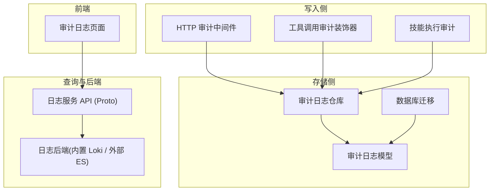
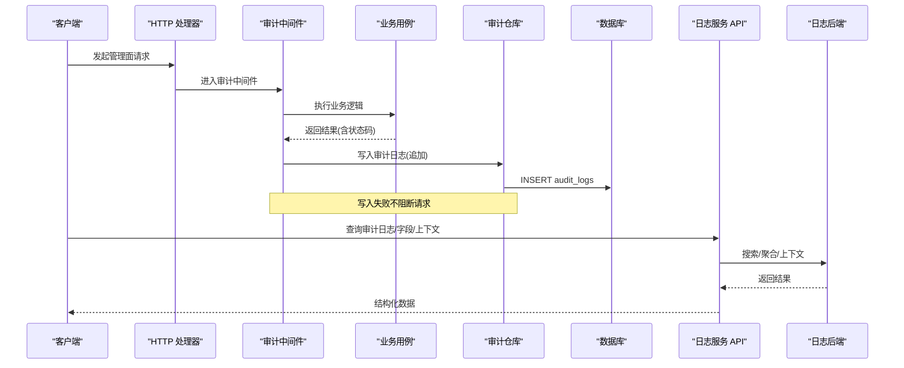
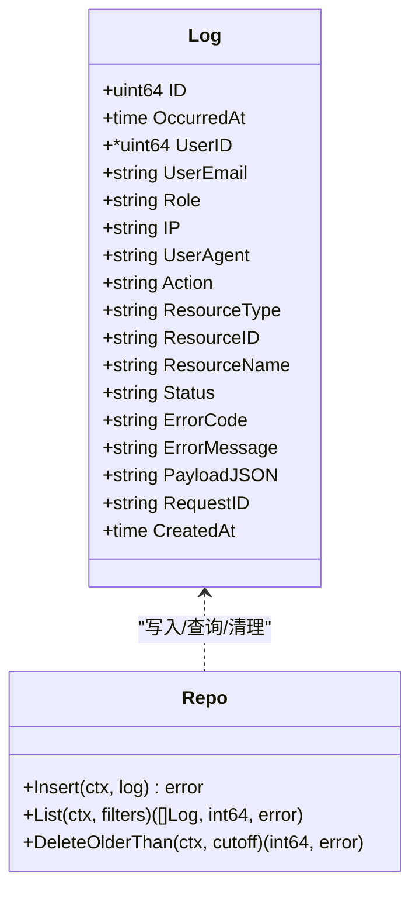
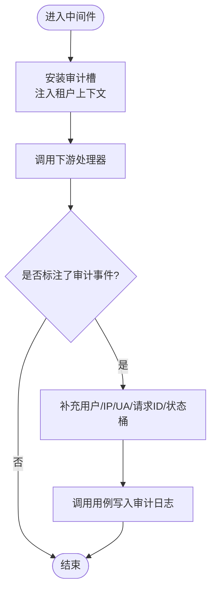
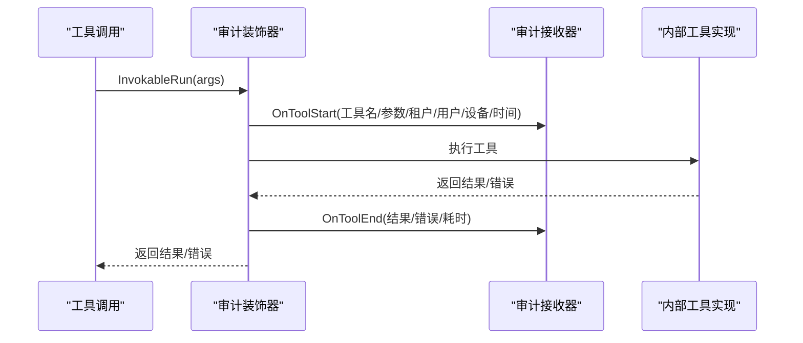
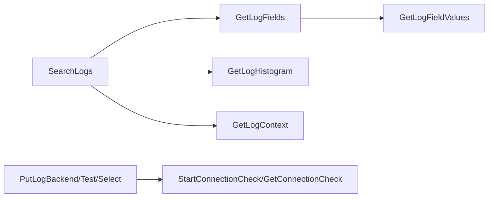
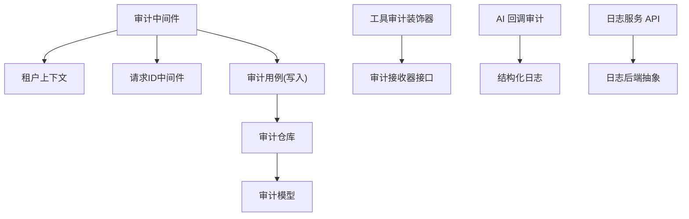

# 安全审计日志

<cite>
**本文引用的文件**
- [internal/manager/model/audit/log.go](file://internal/manager/model/audit/log.go)
- [internal/manager/data/audit/store/repo.go](file://internal/manager/data/audit/store/repo.go)
- [internal/manager/data/audit/store/migrate.go](file://internal/manager/data/audit/store/migrate.go)
- [internal/manager/server/middleware/audit.go](file://internal/manager/server/middleware/audit.go)
- [internal/manager/biz/skill/audit.go](file://internal/manager/biz/skill/audit.go)
- [internal/manager/biz/aiops/graph/callbacks/audit.go](file://internal/manager/biz/aiops/graph/callbacks/audit.go)
- [internal/manager/biz/aiops/tools/decorators/audit.go](file://internal/manager/biz/aiops/tools/decorators/audit.go)
- [api/manager/logs/v1/logs.proto](file://api/manager/logs/v1/logs.proto)
- [db/migrations/20260818160000_create_log_backends.up.sql](file://db/migrations/20260818160000_create_log_backends.up.sql)
- [web/src/pages/settings/AuditLog.tsx](file://web/src/pages/settings/AuditLog.tsx)
</cite>

## 目录
1. [简介](#简介)
2. [项目结构](#项目结构)
3. [核心组件](#核心组件)
4. [架构总览](#架构总览)
5. [详细组件分析](#详细组件分析)
6. [依赖关系分析](#依赖关系分析)
7. [性能考量](#性能考量)
8. [故障排查指南](#故障排查指南)
9. [结论](#结论)
10. [附录](#附录)

## 简介
本文件面向 Ongrid 的安全审计与日志能力，系统性阐述：
- 安全事件记录机制、审计日志结构与存储策略
- 关键操作的审计追踪、用户行为分析与异常检测
- 审计日志查询接口、报表生成与合规性报告
- 日志完整性保护、防篡改机制与长期归档策略
- 审计日志分析方法与安全事件响应流程

Ongrid 的审计体系由“请求级审计（HTTP 中间件）+ 工具调用审计（AI/工具链）+ 技能执行审计 + 外部日志后端”共同构成，既覆盖管理面操作，也覆盖 AI/工具链的可观测性与可追溯性。

## 项目结构
围绕审计与日志的核心代码分布如下：
- 模型与持久化：审计日志模型、仓库与迁移
- 写入路径：HTTP 中间件、工具装饰器、技能执行审计
- 查询与配置：日志后端定义与选择、字段与上下文检索
- 前端展示：审计日志列表与详情

图表来源
- [internal/manager/server/middleware/audit.go:72-104](file://internal/manager/server/middleware/audit.go#L72-L104)
- [internal/manager/biz/aiops/tools/decorators/audit.go:89-121](file://internal/manager/biz/aiops/tools/decorators/audit.go#L89-L121)
- [internal/manager/biz/skill/audit.go:50-64](file://internal/manager/biz/skill/audit.go#L50-L64)
- [internal/manager/model/audit/log.go:29-47](file://internal/manager/model/audit/log.go#L29-L47)
- [internal/manager/data/audit/store/repo.go:31-33](file://internal/manager/data/audit/store/repo.go#L31-L33)
- [internal/manager/data/audit/store/migrate.go:11-14](file://internal/manager/data/audit/store/migrate.go#L11-L14)
- [api/manager/logs/v1/logs.proto:11-25](file://api/manager/logs/v1/logs.proto#L11-L25)
- [web/src/pages/settings/AuditLog.tsx:171-231](file://web/src/pages/settings/AuditLog.tsx#L171-L231)

章节来源
- [internal/manager/model/audit/log.go:29-47](file://internal/manager/model/audit/log.go#L29-L47)
- [internal/manager/data/audit/store/repo.go:31-93](file://internal/manager/data/audit/store/repo.go#L31-L93)
- [internal/manager/data/audit/store/migrate.go:11-14](file://internal/manager/data/audit/store/migrate.go#L11-L14)
- [internal/manager/server/middleware/audit.go:72-104](file://internal/manager/server/middleware/audit.go#L72-L104)
- [internal/manager/biz/aiops/tools/decorators/audit.go:89-121](file://internal/manager/biz/aiops/tools/decorators/audit.go#L89-L121)
- [internal/manager/biz/skill/audit.go:50-64](file://internal/manager/biz/skill/audit.go#L50-L64)
- [api/manager/logs/v1/logs.proto:11-25](file://api/manager/logs/v1/logs.proto#L11-L25)
- [web/src/pages/settings/AuditLog.tsx:171-231](file://web/src/pages/settings/AuditLog.tsx#L171-L231)

## 核心组件
- 审计日志模型与常量：定义审计行结构、状态枚举与标准动作/资源类型，确保统一语义与索引优化。
- HTTP 审计中间件：以显式标注的方式记录用户关键操作，自动补充租户、IP、UA、请求ID与状态桶。
- 工具调用审计装饰器：在工具执行前后记录起止事件，保证审计失败不影响业务执行。
- 技能执行审计：为每次技能调度落库，包含参数、结果、错误与时间戳。
- 日志服务 API：提供后端无关的日志搜索、字段发现、直方图、上下文、后端管理与连接检查等能力。
- 存储层：仅追加写入，支持过滤查询与过期清理；通过迁移注册表结构。

章节来源
- [internal/manager/model/audit/log.go:29-136](file://internal/manager/model/audit/log.go#L29-L136)
- [internal/manager/server/middleware/audit.go:72-104](file://internal/manager/server/middleware/audit.go#L72-L104)
- [internal/manager/biz/aiops/tools/decorators/audit.go:89-121](file://internal/manager/biz/aiops/tools/decorators/audit.go#L89-L121)
- [internal/manager/biz/skill/audit.go:50-64](file://internal/manager/biz/skill/audit.go#L50-L64)
- [api/manager/logs/v1/logs.proto:11-25](file://api/manager/logs/v1/logs.proto#L11-L25)
- [internal/manager/data/audit/store/repo.go:31-101](file://internal/manager/data/audit/store/repo.go#L31-L101)

## 架构总览
下图展示了从请求进入、到审计落库、再到查询与可视化的端到端链路。

图表来源
- [internal/manager/server/middleware/audit.go:72-104](file://internal/manager/server/middleware/audit.go#L72-L104)
- [internal/manager/data/audit/store/repo.go:31-33](file://internal/manager/data/audit/store/repo.go#L31-L33)
- [api/manager/logs/v1/logs.proto:11-25](file://api/manager/logs/v1/logs.proto#L11-L25)

## 详细组件分析

### 审计日志模型与存储
- 模型字段涵盖发生时间、用户标识、角色、IP、UA、动作、资源、状态、错误信息、负载 JSON、请求ID与创建时间，并提供常用索引。
- 状态枚举限定成功/失败/拒绝三类，便于筛选与告警。
- 标准动作与资源类型采用扁平命名约定，具体差异通过负载字段表达，避免动作空间膨胀。
- 存储层仅支持追加写入与过期删除，保障审计不可变原则。

图表来源
- [internal/manager/model/audit/log.go:29-47](file://internal/manager/model/audit/log.go#L29-L47)
- [internal/manager/data/audit/store/repo.go:17-101](file://internal/manager/data/audit/store/repo.go#L17-L101)

章节来源
- [internal/manager/model/audit/log.go:29-136](file://internal/manager/model/audit/log.go#L29-L136)
- [internal/manager/data/audit/store/repo.go:31-101](file://internal/manager/data/audit/store/repo.go#L31-L101)

### HTTP 审计中间件
- 仅在处理器显式标注时记录审计行，避免无意义的访问日志污染。
- 自动从租户上下文填充用户邮箱与角色，从请求提取 IP、UA、请求ID，并基于状态码映射成功/失败/拒绝。
- 使用可变的上下文槽保存审计事件，兼容后续中间件对请求上下文的包装。

图表来源
- [internal/manager/server/middleware/audit.go:72-104](file://internal/manager/server/middleware/audit.go#L72-L104)
- [internal/manager/server/middleware/audit.go:106-144](file://internal/manager/server/middleware/audit.go#L106-L144)

章节来源
- [internal/manager/server/middleware/audit.go:72-104](file://internal/manager/server/middleware/audit.go#L72-L104)
- [internal/manager/server/middleware/audit.go:106-169](file://internal/manager/server/middleware/audit.go#L106-L169)

### 工具调用审计（AI/工具链）
- 通过装饰器在工具执行前记录开始事件，执行后记录结束事件（含耗时、结果大小或错误）。
- 审计失败不会导致工具执行失败，确保可观测性不影响业务。
- 对于流式或并发场景，回调处理器按阶段记录 token 用量、工具调用次数与状态。

图表来源
- [internal/manager/biz/aiops/tools/decorators/audit.go:89-121](file://internal/manager/biz/aiops/tools/decorators/audit.go#L89-L121)
- [internal/manager/biz/aiops/graph/callbacks/audit.go:78-187](file://internal/manager/biz/aiops/graph/callbacks/audit.go#L78-L187)

章节来源
- [internal/manager/biz/aiops/tools/decorators/audit.go:10-122](file://internal/manager/biz/aiops/tools/decorators/audit.go#L10-L122)
- [internal/manager/biz/aiops/graph/callbacks/audit.go:17-289](file://internal/manager/biz/aiops/graph/callbacks/audit.go#L17-L289)

### 技能执行审计
- 每次技能调度写入一行，包含技能键、边缘节点、调用者、角色、类、参数/结果 JSON、错误与时间戳。
- 写入失败降级为警告，不中断技能执行。

章节来源
- [internal/manager/biz/skill/audit.go:13-72](file://internal/manager/biz/skill/audit.go#L13-L72)

### 日志服务 API 与后端
- 提供日志搜索、字段发现、字段值枚举、直方图、上下文、后端配置与连接检查等能力。
- 支持内置 Loki 与外部 Elasticsearch 作为后端，并可切换当前后端。
- 连接检查支持异步启动与状态查询，统计在线/已验证/待处理/失败/离线数量。

图表来源
- [api/manager/logs/v1/logs.proto:11-25](file://api/manager/logs/v1/logs.proto#L11-L25)
- [api/manager/logs/v1/logs.proto:125-187](file://api/manager/logs/v1/logs.proto#L125-L187)
- [api/manager/logs/v1/logs.proto:189-346](file://api/manager/logs/v1/logs.proto#L189-L346)

章节来源
- [api/manager/logs/v1/logs.proto:11-346](file://api/manager/logs/v1/logs.proto#L11-L346)

### 前端审计日志查看
- 提供分页列表，展示时间、操作者、动作、资源、状态、IP 与详情入口。
- 支持按用户、动作、资源类型、状态进行过滤。

章节来源
- [web/src/pages/settings/AuditLog.tsx:171-231](file://web/src/pages/settings/AuditLog.tsx#L171-L231)

## 依赖关系分析
- 中间件依赖租户上下文与请求 ID 中间件，用于填充审计行元数据。
- 审计仓库依赖 GORM 与模型定义，仅暴露最小必要接口。
- 工具审计装饰器与回调处理器解耦于具体实现，通过接口/回调点接入。
- 日志 API 与后端抽象，屏蔽底层存储差异。

图表来源
- [internal/manager/server/middleware/audit.go:72-104](file://internal/manager/server/middleware/audit.go#L72-L104)
- [internal/manager/biz/aiops/tools/decorators/audit.go:10-35](file://internal/manager/biz/aiops/tools/decorators/audit.go#L10-L35)
- [internal/manager/biz/aiops/graph/callbacks/audit.go:17-61](file://internal/manager/biz/aiops/graph/callbacks/audit.go#L17-L61)
- [api/manager/logs/v1/logs.proto:11-25](file://api/manager/logs/v1/logs.proto#L11-L25)

章节来源
- [internal/manager/server/middleware/audit.go:72-104](file://internal/manager/server/middleware/audit.go#L72-L104)
- [internal/manager/biz/aiops/tools/decorators/audit.go:10-35](file://internal/manager/biz/aiops/tools/decorators/audit.go#L10-L35)
- [internal/manager/biz/aiops/graph/callbacks/audit.go:17-61](file://internal/manager/biz/aiops/graph/callbacks/audit.go#L17-L61)
- [api/manager/logs/v1/logs.proto:11-25](file://api/manager/logs/v1/logs.proto#L11-L25)

## 性能考量
- 审计写入为追加型，建议批量提交或异步落库以降低请求延迟。
- 查询层限制最大返回条数，避免大结果集拖慢接口。
- 直方图与上下文查询应结合时间范围与资源过滤，减少扫描范围。
- 工具与技能审计尽量轻量，避免在热路径中执行重 IO。

[本节为通用指导，无需特定文件引用]

## 故障排查指南
- 审计未记录：确认处理器是否显式标注审计事件；检查中间件是否生效。
- 写入失败：仓库写入失败不应阻断请求，需检查日志中的警告与数据库连通性。
- 查询为空：核对过滤条件（用户、动作、资源类型、状态、时间范围）与索引命中情况。
- 后端不可用：通过连接检查接口定位各边缘节点的在线/验证/失败/离线状态。

章节来源
- [internal/manager/server/middleware/audit.go:72-104](file://internal/manager/server/middleware/audit.go#L72-L104)
- [internal/manager/data/audit/store/repo.go:31-33](file://internal/manager/data/audit/store/repo.go#L31-L33)
- [api/manager/logs/v1/logs.proto:287-337](file://api/manager/logs/v1/logs.proto#L287-L337)

## 结论
Ongrid 的审计与日志体系以“最小侵入、高保真、可查询、可扩展”为目标：
- 通过中间件与装饰器在关键路径埋点，保证“谁在何时做了什么”的可追溯性
- 以模型与仓库固化审计结构，配合迁移与只写策略保障一致性
- 提供统一的日志 API 与多后端支持，满足查询、分析与合规需求
- 前端提供直观的审计日志浏览与过滤能力，提升运营效率

[本节为总结性内容，无需特定文件引用]

## 附录

### 审计日志结构与字段说明
- 基础字段：发生时间、用户标识、邮箱、角色、IP、UA、请求ID
- 业务字段：动作、资源类型、资源ID、资源名称、状态、错误码、错误信息
- 扩展字段：负载 JSON（用于承载变更细节，敏感信息需在写入前脱敏）

章节来源
- [internal/manager/model/audit/log.go:29-47](file://internal/manager/model/audit/log.go#L29-L47)
- [internal/manager/model/audit/log.go:53-136](file://internal/manager/model/audit/log.go#L53-L136)

### 查询接口与报表
- 日志搜索：支持关键词匹配、字段过滤、排序方向、游标分页
- 字段与值：动态发现字段类型与可聚合性，枚举字段值
- 直方图：按时间区间统计日志量，辅助趋势分析
- 上下文：围绕某条日志获取前后若干条，便于排障
- 后端管理：配置、测试、选择与连接检查

章节来源
- [api/manager/logs/v1/logs.proto:76-187](file://api/manager/logs/v1/logs.proto#L76-L187)
- [api/manager/logs/v1/logs.proto:189-346](file://api/manager/logs/v1/logs.proto#L189-L346)

### 完整性保护与长期归档
- 写入策略：仅追加写入，禁止随意修改或删除历史行
- 保留策略：通过过期清理任务删除早于阈值的记录，控制存储成本
- 后端隔离：将运行日志与审计日志分离，审计日志落库并受保留策略约束
- 迁移与版本：通过迁移脚本维护表结构演进

章节来源
- [internal/manager/data/audit/store/repo.go:96-101](file://internal/manager/data/audit/store/repo.go#L96-L101)
- [db/migrations/20260818160000_create_log_backends.up.sql](file://db/migrations/20260818160000_create_log_backends.up.sql)

### 分析方法与响应流程
- 分析方法：按用户/动作/资源/状态筛选，结合直方图观察峰值；利用上下文快速定位问题链路
- 异常检测：关注失败与拒绝状态，结合登录失败动作识别暴力破解模式
- 响应流程：发现异常 → 关联请求ID与上下文 → 回溯工具调用与技能执行 → 评估影响范围 → 采取处置措施

章节来源
- [internal/manager/model/audit/log.go:53-136](file://internal/manager/model/audit/log.go#L53-L136)
- [internal/manager/biz/aiops/graph/callbacks/audit.go:78-216](file://internal/manager/biz/aiops/graph/callbacks/audit.go#L78-L216)
- [internal/manager/biz/skill/audit.go:50-64](file://internal/manager/biz/skill/audit.go#L50-L64)