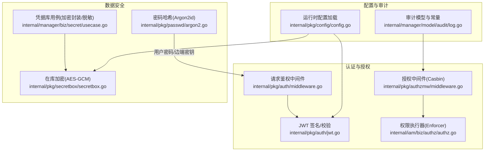
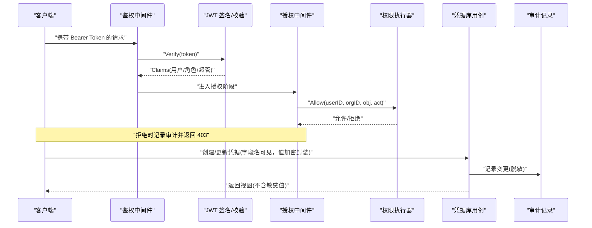
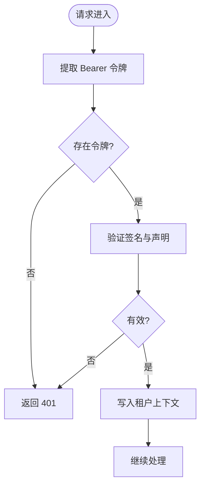
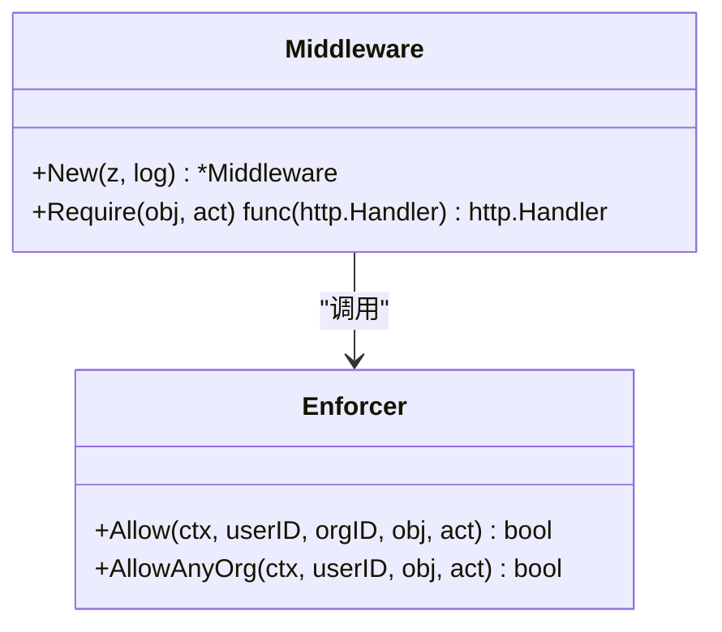
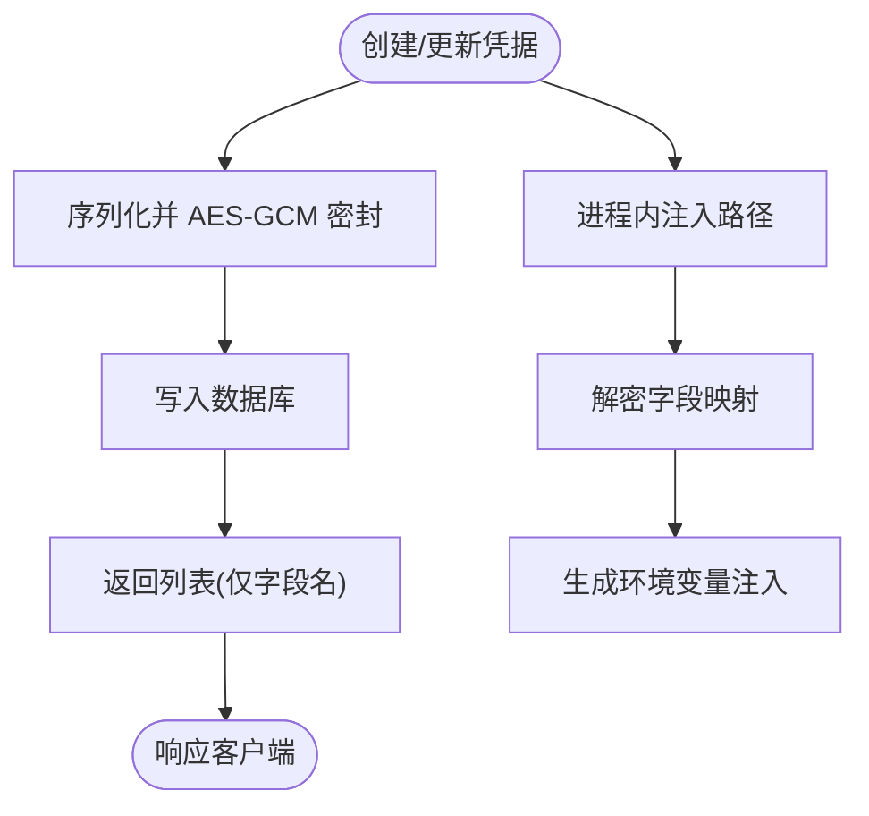
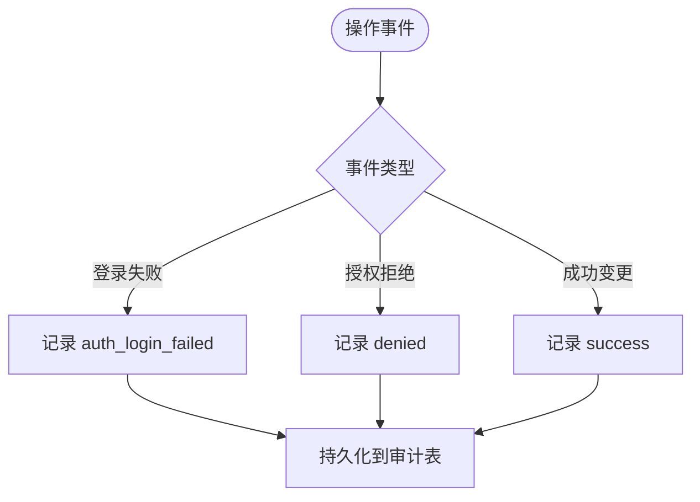
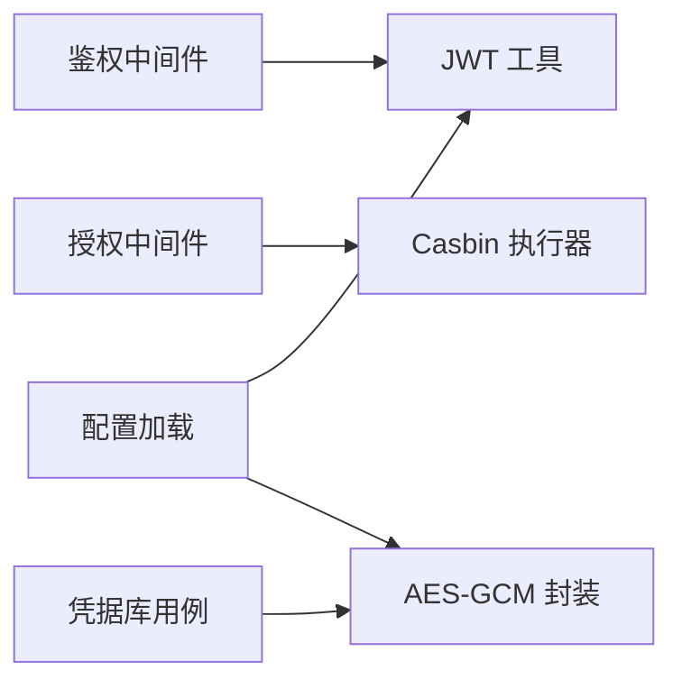

# 安全架构设计

<cite>
**本文引用的文件**
- [internal/pkg/auth/jwt.go](file://internal/pkg/auth/jwt.go)
- [internal/pkg/auth/middleware.go](file://internal/pkg/auth/middleware.go)
- [internal/manager/server/knowledge/http.go](file://internal/manager/server/knowledge/http.go)
- [internal/pkg/authzmw/middleware.go](file://internal/pkg/authzmw/middleware.go)
- [internal/iam/biz/authz/authz.go](file://internal/iam/biz/authz/authz.go)
- [internal/manager/model/audit/log.go](file://internal/manager/model/audit/log.go)
- [internal/manager/biz/secret/usecase.go](file://internal/manager/biz/secret/usecase.go)
- [internal/pkg/secretbox/secretbox.go](file://internal/pkg/secretbox/secretbox.go)
- [internal/pkg/config/config.go](file://internal/pkg/config/config.go)
- [internal/pkg/passwd/argon2.go](file://internal/pkg/passwd/argon2.go)
- [internal/iam/biz/user/hash.go](file://internal/iam/biz/user/hash.go)
- [SECURITY.md](file://SECURITY.md)
</cite>

## 目录
1. [简介](#简介)
2. [项目结构](#项目结构)
3. [核心组件](#核心组件)
4. [架构总览](#架构总览)
5. [详细组件分析](#详细组件分析)
6. [依赖关系分析](#依赖关系分析)
7. [性能与安全权衡](#性能与安全权衡)
8. [故障排查指南](#故障排查指南)
9. [结论](#结论)
10. [附录](#附录)

## 简介
本文件阐述 Ongrid 的安全架构，围绕零信任模型落地身份认证、授权控制、数据传输与存储加密、以及安全审计。重点覆盖：
- JWT 令牌签发与校验、访问/刷新令牌生命周期管理
- 基于 RBAC 的细粒度授权（Casbin）与超级管理员短路策略
- 敏感数据在途与在库保护（TLS、AES-GCM 密封、Argon2id 密码哈希）
- 统一审计日志与事件记录
- 密钥与敏感信息管理最佳实践
- 威胁模型与攻击面防护策略
- 合规与隐私保护措施

## 项目结构
Ongrid 将安全能力拆分为可复用的内部包与业务域：
- 认证与鉴权：JWT 签名/校验、HTTP 中间件、Casbin 授权中间件
- 权限模型：RBAC 角色与组织域隔离，对象级动作控制
- 数据安全：凭据库（Secrets）加密封装、字段名脱敏返回、Argon2id 密码哈希
- 配置与密钥：集中式环境变量加载、默认安全基线、可选 TLS 开关
- 审计：统一审计模型与常量定义，支持失败/拒绝等状态记录

**图表来源**
- [internal/pkg/auth/jwt.go:1-100](file://internal/pkg/auth/jwt.go#L1-L100)
- [internal/pkg/auth/middleware.go:1-68](file://internal/pkg/auth/middleware.go#L1-L68)
- [internal/pkg/authzmw/middleware.go:1-55](file://internal/pkg/authzmw/middleware.go#L1-L55)
- [internal/iam/biz/authz/authz.go:1-289](file://internal/iam/biz/authz/authz.go#L1-L289)
- [internal/manager/biz/secret/usecase.go:1-231](file://internal/manager/biz/secret/usecase.go#L1-L231)
- [internal/pkg/secretbox/secretbox.go:1-110](file://internal/pkg/secretbox/secretbox.go#L1-L110)
- [internal/pkg/config/config.go:1-667](file://internal/pkg/config/config.go#L1-L667)
- [internal/manager/model/audit/log.go:1-136](file://internal/manager/model/audit/log.go#L1-L136)

**章节来源**
- [internal/pkg/auth/jwt.go:1-100](file://internal/pkg/auth/jwt.go#L1-L100)
- [internal/pkg/auth/middleware.go:1-68](file://internal/pkg/auth/middleware.go#L1-L68)
- [internal/pkg/authzmw/middleware.go:1-55](file://internal/pkg/authzmw/middleware.go#L1-L55)
- [internal/iam/biz/authz/authz.go:1-289](file://internal/iam/biz/authz/authz.go#L1-L289)
- [internal/manager/biz/secret/usecase.go:1-231](file://internal/manager/biz/secret/usecase.go#L1-L231)
- [internal/pkg/secretbox/secretbox.go:1-110](file://internal/pkg/secretbox/secretbox.go#L1-L110)
- [internal/pkg/config/config.go:1-667](file://internal/pkg/config/config.go#L1-L667)
- [internal/manager/model/audit/log.go:1-136](file://internal/manager/model/audit/log.go#L1-L136)

## 核心组件
- 身份认证
  - JWT Claims 包含用户标识、邮箱、角色与超级管理员标记；使用 HS256 签名，支持访问令牌与刷新令牌不同 TTL。
  - HTTP 中间件从 Authorization 头或查询参数提取令牌并校验，失败直接返回 401；成功时将租户上下文写入请求上下文供后续处理。
- 授权控制
  - 基于 Casbin 的 RBAC 模型，按“对象:资源”和“动作”进行细粒度控制；支持跨组织判断与超级管理员短路。
  - 路由层通过中间件包装 Require(obj, action) 实现最小权限。
- 数据安全
  - 凭据库对字段映射进行 AES-GCM 密封存储，对外 API 仅暴露字段名，不返回值；解析仅在进程内注入路径使用。
  - 密码采用 Argon2id PHC 编码，具备抗暴力破解与时序侧信道防护。
- 配置与密钥
  - 集中式环境变量加载，提供 JWT、数据库、外部服务 TLS 等关键安全开关与默认值。
- 安全审计
  - 统一的审计模型与动作枚举，记录操作主体、资源、结果与错误信息，便于事后追溯与 RCA。

**章节来源**
- [internal/pkg/auth/jwt.go:16-99](file://internal/pkg/auth/jwt.go#L16-L99)
- [internal/pkg/auth/middleware.go:10-67](file://internal/pkg/auth/middleware.go#L10-L67)
- [internal/pkg/authzmw/middleware.go:1-55](file://internal/pkg/authzmw/middleware.go#L1-L55)
- [internal/iam/biz/authz/authz.go:1-84](file://internal/iam/biz/authz/authz.go#L1-L84)
- [internal/manager/biz/secret/usecase.go:1-43](file://internal/manager/biz/secret/usecase.go#L1-L43)
- [internal/pkg/secretbox/secretbox.go:1-110](file://internal/pkg/secretbox/secretbox.go#L1-L110)
- [internal/pkg/passwd/argon2.go:14-78](file://internal/pkg/passwd/argon2.go#L14-L78)
- [internal/pkg/config/config.go:321-326](file://internal/pkg/config/config.go#L321-L326)
- [internal/manager/model/audit/log.go:10-47](file://internal/manager/model/audit/log.go#L10-L47)

## 架构总览
下图展示从客户端到服务端的关键安全路径：登录获取 JWT、请求鉴权、授权决策、数据加密封装与审计落盘。

**图表来源**
- [internal/pkg/auth/middleware.go:21-52](file://internal/pkg/auth/middleware.go#L21-L52)
- [internal/pkg/auth/jwt.go:81-99](file://internal/pkg/auth/jwt.go#L81-L99)
- [internal/pkg/authzmw/middleware.go:1-55](file://internal/pkg/authzmw/middleware.go#L1-L55)
- [internal/iam/biz/authz/authz.go:46-84](file://internal/iam/biz/authz/authz.go#L46-L84)
- [internal/manager/biz/secret/usecase.go:48-72](file://internal/manager/biz/secret/usecase.go#L48-L72)
- [internal/manager/model/audit/log.go:10-47](file://internal/manager/model/audit/log.go#L10-L47)

## 详细组件分析

### 身份认证与 JWT 管理
- 令牌结构
  - Claims 包含用户 ID、邮箱、角色与是否超级管理员；标准过期时间由 Signer 设置。
- 令牌签发
  - 访问令牌短生命周期，刷新令牌长生命周期；内部票据可使用自定义 TTL。
- 令牌校验
  - 仅做签名与声明校验，不查库；失败返回 401。
- 中间件行为
  - 从 Authorization 头或查询参数提取令牌；成功后将租户上下文写入请求上下文，供后续路由与审计使用。

**图表来源**
- [internal/pkg/auth/middleware.go:21-52](file://internal/pkg/auth/middleware.go#L21-L52)
- [internal/pkg/auth/jwt.go:81-99](file://internal/pkg/auth/jwt.go#L81-L99)

**章节来源**
- [internal/pkg/auth/jwt.go:16-99](file://internal/pkg/auth/jwt.go#L16-L99)
- [internal/pkg/auth/middleware.go:10-67](file://internal/pkg/auth/middleware.go#L10-L67)

### 授权控制与 RBAC
- 模型与策略
  - 使用 Casbin 模型与持久化适配器；启动时加载策略并注入固定角色矩阵。
- 作用域
  - 支持按组织域进行权限判定；当未指定活动组织时，遍历用户所属组织进行授权。
- 超级管理员短路
  - 中间件对超级管理员进行硬短路，避免策略损坏导致系统锁定。
- 路由集成
  - 通过 Require(obj, action) 为每个写/删操作附加授权检查。

**图表来源**
- [internal/pkg/authzmw/middleware.go:1-55](file://internal/pkg/authzmw/middleware.go#L1-L55)
- [internal/iam/biz/authz/authz.go:46-84](file://internal/iam/biz/authz/authz.go#L46-L84)

**章节来源**
- [internal/pkg/authzmw/middleware.go:1-55](file://internal/pkg/authzmw/middleware.go#L1-L55)
- [internal/iam/biz/authz/authz.go:1-84](file://internal/iam/biz/authz/authz.go#L1-L84)
- [internal/manager/server/knowledge/http.go:81-107](file://internal/manager/server/knowledge/http.go#L81-L107)

### 凭据库与敏感信息保护
- 在库加密
  - 使用 AES-256-GCM 对凭据字段映射进行密封存储；版本前缀便于未来算法演进。
  - 密钥派生自环境变量；若未设置则回退至弱密钥并报告风险。
- 脱敏输出
  - 列表/详情 API 仅返回字段名，绝不返回值；仅在进程内注入路径解密。
- 密码哈希
  - 用户密码与边端密钥使用 Argon2id PHC 编码，具备随机盐与恒定时间比较，抵御暴力破解与时序侧信道。

**图表来源**
- [internal/manager/biz/secret/usecase.go:48-72](file://internal/manager/biz/secret/usecase.go#L48-L72)
- [internal/manager/biz/secret/usecase.go:137-175](file://internal/manager/biz/secret/usecase.go#L137-L175)
- [internal/pkg/secretbox/secretbox.go:53-109](file://internal/pkg/secretbox/secretbox.go#L53-L109)
- [internal/pkg/passwd/argon2.go:26-78](file://internal/pkg/passwd/argon2.go#L26-L78)

**章节来源**
- [internal/manager/biz/secret/usecase.go:1-231](file://internal/manager/biz/secret/usecase.go#L1-L231)
- [internal/pkg/secretbox/secretbox.go:1-110](file://internal/pkg/secretbox/secretbox.go#L1-L110)
- [internal/pkg/passwd/argon2.go:14-78](file://internal/pkg/passwd/argon2.go#L14-L78)
- [internal/iam/biz/user/hash.go:1-16](file://internal/iam/biz/user/hash.go#L1-L16)

### 安全审计机制
- 审计模型
  - 每条记录包含发生时间、主体、资源、动作、状态与错误信息；支持按时间范围与动作过滤。
- 动作与资源
  - 标准化动作命名与资源分类，便于 UI 筛选与报表统计。
- 失败与拒绝
  - 登录失败、授权拒绝等关键事件均记录，便于安全分析与 RCA。

**图表来源**
- [internal/manager/model/audit/log.go:10-47](file://internal/manager/model/audit/log.go#L10-L47)
- [internal/manager/model/audit/log.go:53-135](file://internal/manager/model/audit/log.go#L53-L135)

**章节来源**
- [internal/manager/model/audit/log.go:10-135](file://internal/manager/model/audit/log.go#L10-L135)

### 配置管理与密钥策略
- JWT 配置
  - 通过环境变量设置密钥与令牌 TTL；默认值用于本地开发，生产需替换强密钥。
- 外部服务 TLS
  - 支持为 Prometheus/Grafana 等外部服务配置 TLS 证书与跳过校验开关（仅限自签场景）。
- 安全提示
  - 当使用弱密钥或禁用 TLS 校验时，应在部署与运行期发出告警或阻断。

**章节来源**
- [internal/pkg/config/config.go:321-326](file://internal/pkg/config/config.go#L321-L326)
- [internal/pkg/config/config.go:449-451](file://internal/pkg/config/config.go#L449-L451)
- [internal/pkg/config/config.go:504-507](file://internal/pkg/config/config.go#L504-L507)

## 依赖关系分析
- 低耦合高内聚
  - 认证与授权解耦：JWT 负责身份，Casbin 负责权限；中间件串联两者。
  - 数据安全与业务逻辑分离：凭据库用例封装加密封装与脱敏，上层无需关心细节。
- 外部依赖
  - Casbin 作为授权引擎，GORM 适配器持久化策略；JWT 库负责令牌编解码。
- 潜在循环依赖
  - 通过接口抽象（如 Authorizer 接口）避免 manager 与 iam 之间的循环导入。

**图表来源**
- [internal/pkg/auth/middleware.go:1-68](file://internal/pkg/auth/middleware.go#L1-L68)
- [internal/pkg/authzmw/middleware.go:1-55](file://internal/pkg/authzmw/middleware.go#L1-L55)
- [internal/manager/biz/secret/usecase.go:1-43](file://internal/manager/biz/secret/usecase.go#L1-L43)
- [internal/pkg/secretbox/secretbox.go:1-110](file://internal/pkg/secretbox/secretbox.go#L1-L110)
- [internal/pkg/config/config.go:1-667](file://internal/pkg/config/config.go#L1-L667)

**章节来源**
- [internal/pkg/authzmw/middleware.go:1-55](file://internal/pkg/authzmw/middleware.go#L1-L55)
- [internal/iam/biz/authz/authz.go:1-84](file://internal/iam/biz/authz/authz.go#L1-L84)

## 性能与安全权衡
- JWT 无库查询校验提升吞吐，但需配合短期访问令牌降低泄露影响。
- Casbin 策略缓存与批量同步减少授权开销；超级管理员短路保障可用性。
- AES-GCM 密封存储带来 CPU 开销，但确保数据在库安全；建议合理批处理与连接池优化。
- Argon2id 哈希参数兼顾安全性与性能；可根据硬件调优。
- 审计记录可能产生大量写入；建议异步落盘与定期归档。

[本节为通用指导，不直接分析具体文件]

## 故障排查指南
- 401 未授权
  - 检查请求是否携带有效的 Bearer 令牌；确认 JWT 密钥一致且未过期。
- 403 禁止访问
  - 检查当前用户的角色与组织成员关系；确认策略中是否授予对应对象与动作。
- 凭据读取失败
  - 检查环境中的加密密钥是否正确；确认密文格式与版本前缀。
- 审计缺失
  - 确认审计中间件已安装；检查审计表写入权限与磁盘空间。

**章节来源**
- [internal/pkg/auth/middleware.go:21-52](file://internal/pkg/auth/middleware.go#L21-L52)
- [internal/pkg/authzmw/middleware.go:1-55](file://internal/pkg/authzmw/middleware.go#L1-L55)
- [internal/pkg/secretbox/secretbox.go:53-109](file://internal/pkg/secretbox/secretbox.go#L53-L109)
- [internal/manager/model/audit/log.go:10-47](file://internal/manager/model/audit/log.go#L10-L47)

## 结论
Ongrid 以零信任为核心，通过 JWT 身份认证、Casbin RBAC 授权、端到端加密与审计追踪构建纵深防御体系。凭据库与密码哈希确保敏感数据在库安全，配置管理提供安全基线与可观测性。建议在生产环境中启用强密钥、强制 TLS、限制最小权限，并持续监控审计与告警指标。

[本节为总结性内容，不直接分析具体文件]

## 附录

### 威胁模型与攻击面防护
- 令牌劫持
  - 防护：短 TTL、HTTPS、严格同源策略、刷新令牌轮换。
- 越权访问
  - 防护：细粒度 RBAC、组织域隔离、超级管理员短路保护。
- 凭据泄露
  - 防护：AES-GCM 密封、API 脱敏、最小可见原则。
- 暴力破解
  - 防护：Argon2id 哈希、速率限制、审计告警。
- 配置误用
  - 防护：环境变量校验、默认安全基线、部署脚本提示。

[本节为概念性内容，不直接分析具体文件]

### 合规与隐私
- 数据最小化：API 仅返回必要字段，敏感值不序列化。
- 可追溯性：审计记录关联请求 ID，便于跨日志关联。
- 漏洞披露：遵循仓库安全政策，通过私有渠道报告。

**章节来源**
- [SECURITY.md:1-35](file://SECURITY.md#L1-L35)