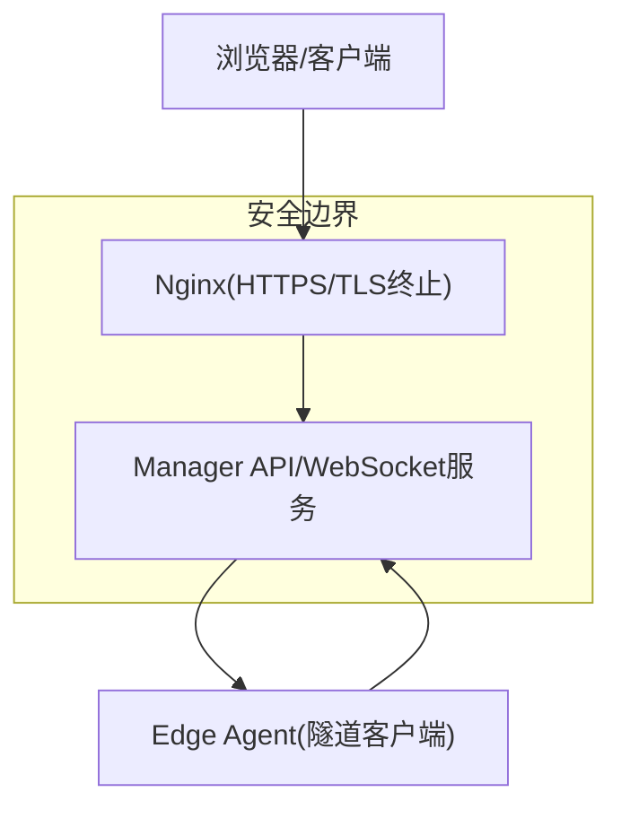
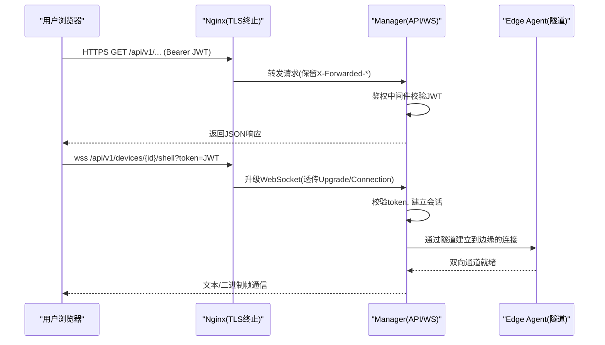
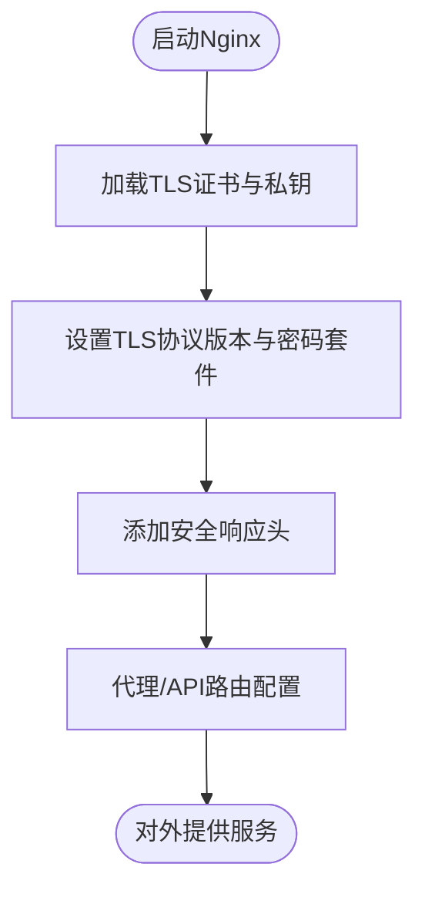
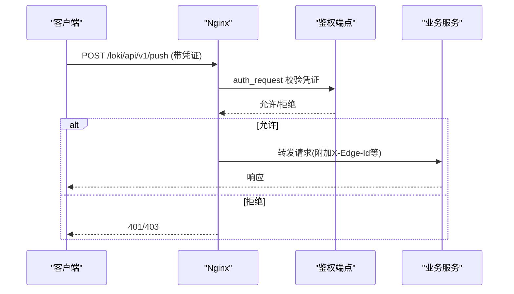
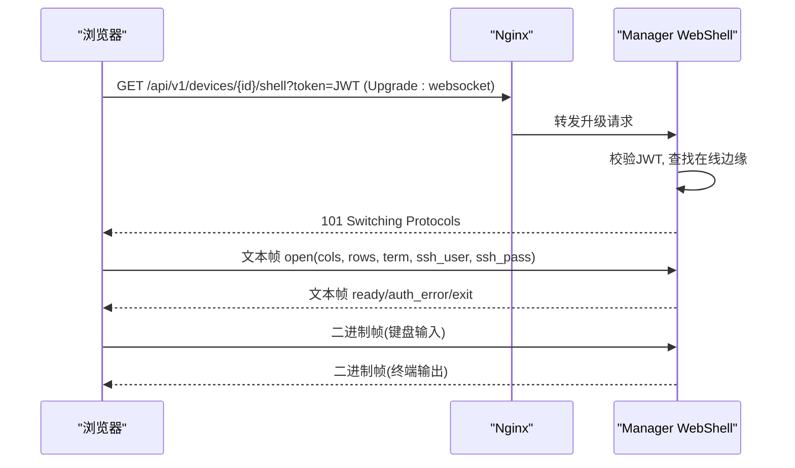
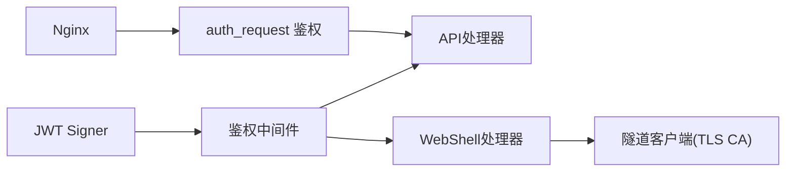

# 传输安全协议

<cite>
**本文引用的文件**
- [internal/pkg/auth/jwt.go](file://internal/pkg/auth/jwt.go)
- [internal/pkg/auth/middleware.go](file://internal/pkg/auth/middleware.go)
- [internal/manager/server/webshell/http.go](file://internal/manager/server/webshell/http.go)
- [web/src/api/webshell.ts](file://web/src/api/webshell.ts)
- [deploy/install/nginx.conf](file://deploy/install/nginx.conf)
- [deploy/nginx/nginx.conf](file://deploy/nginx/nginx.conf)
- [internal/pkg/tunnel/types.go](file://internal/pkg/tunnel/types.go)
- [internal/edgeagent/dpapi/dpapi_windows_test.go](file://internal/edgeagent/dpapi/dpapi_windows_test.go)
- [internal/edgeagent/install/secrets_windows.go](file://internal/edgeagent/install/secrets_windows.go)
- [internal/edgeagent/install/acl_windows.go](file://internal/edgeagent/install/acl_windows.go)
- [internal/pkg/secretbox/secretbox_test.go](file://internal/pkg/secretbox/secretbox_test.go)
- [internal/manager/biz/knowledge/builtin_vault/diagnostics/tls-handshake-failure.md](file://internal/manager/biz/knowledge/builtin_vault/diagnostics/tls-handshake-failure.md)
- [internal/manager/biz/knowledge/builtin_vault/diagnostics/jwt-auth-failures.md](file://internal/manager/biz/knowledge/builtin_vault/diagnostics/jwt-auth-failures.md)
- [cmd/ongrid-edge/k8s_credentials_test.go](file://cmd/ongrid-edge/k8s_credentials_test.go)
- [web/src/pages/settings/Integrations.tsx](file://web/src/pages/settings/Integrations.tsx)
- [web/src/pages/EdgeDetail.tsx](file://web/src/pages/EdgeDetail.tsx)
</cite>

## 目录
1. [简介](#简介)
2. [项目结构](#项目结构)
3. [核心组件](#核心组件)
4. [架构总览](#架构总览)
5. [详细组件分析](#详细组件分析)
6. [依赖关系分析](#依赖关系分析)
7. [性能考虑](#性能考虑)
8. [故障排查指南](#故障排查指南)
9. [结论](#结论)
10. [附录：配置示例与最佳实践](#附录配置示例与最佳实践)

## 简介
本文件系统性阐述本项目在数据传输安全方面的设计与实现，覆盖 HTTPS/TLS 配置、证书管理、连接加密；API 请求的身份验证、请求签名与防重放机制；WebSocket 安全握手、消息传输与连接监控；以及前端到后端、代理层与负载均衡器的 TLS 终止策略。文档同时提供可操作的配置要点与常见问题的定位方法。

## 项目结构
从传输安全视角，关键位置包括：
- 反向代理（Nginx）：负责 TLS 终止、HTTP/2、安全头、WebSocket 升级转发、数据面鉴权入口。
- 管理服务（Manager）：提供 API 鉴权中间件、WebShell WebSocket 处理、边缘设备认证缓存等。
- 边缘侧（Edge Agent）：隧道客户端 TLS 校验、Windows 平台敏感信息本地保护与轮转。
- 前端（Web）：通过 wss/ws 建立 WebShell 连接，携带 JWT 令牌进行身份传递。

图表来源
- [deploy/install/nginx.conf:92-144](file://deploy/install/nginx.conf#L92-L144)
- [internal/manager/server/webshell/http.go:153-181](file://internal/manager/server/webshell/http.go#L153-L181)
- [internal/pkg/tunnel/types.go:33-66](file://internal/pkg/tunnel/types.go#L33-L66)

章节来源
- [deploy/install/nginx.conf:92-144](file://deploy/install/nginx.conf#L92-L144)
- [deploy/nginx/nginx.conf:104-118](file://deploy/nginx/nginx.conf#L104-L118)
- [internal/manager/server/webshell/http.go:153-181](file://internal/manager/server/webshell/http.go#L153-L181)
- [internal/pkg/tunnel/types.go:33-66](file://internal/pkg/tunnel/types.go#L33-L66)

## 核心组件
- HTTPS/TLS 与证书管理：Nginx 作为统一入口完成 TLS 终止，启用 HTTP/2、限制协议版本与密码套件，并设置安全响应头。安装脚本支持生成自签证书用于开发环境。
- API 身份验证：基于 JWT 的无状态鉴权，中间件统一解析 Bearer Token 或查询参数中的 token（适配 WebSocket），校验签名与有效期后注入租户上下文。
- 请求签名与防重放：数据面（日志/遥测）通过 nginx auth_request 调用内部鉴权端点，结合速率限制与短生命周期凭证；边缘侧使用访问密钥对进行认证并缓存结果，降低重复计算开销。
- WebSocket 安全握手与消息传输：WebShell 通过 wss/ws 升级，前端附带 JWT 令牌，服务端校验后建立会话；二进制流用于终端输出，控制消息采用文本帧。
- 连接监控：WebShell 会话具备审计列表与管理员强制结束能力；Nginx 暴露健康检查端点供探针探测。

章节来源
- [internal/pkg/auth/jwt.go:32-99](file://internal/pkg/auth/jwt.go#L32-L99)
- [internal/pkg/auth/middleware.go:10-67](file://internal/pkg/auth/middleware.go#L10-L67)
- [internal/manager/server/webshell/http.go:153-181](file://internal/manager/server/webshell/http.go#L153-L181)
- [web/src/api/webshell.ts:1-52](file://web/src/api/webshell.ts#L1-L52)
- [deploy/install/nginx.conf:92-144](file://deploy/install/nginx.conf#L92-L144)

## 架构总览
下图展示了从浏览器到后端服务的完整安全路径，包括 TLS 终止、JWT 鉴权、WebSocket 升级与数据面鉴权。

图表来源
- [deploy/install/nginx.conf:92-144](file://deploy/install/nginx.conf#L92-L144)
- [internal/pkg/auth/middleware.go:21-52](file://internal/pkg/auth/middleware.go#L21-L52)
- [internal/manager/server/webshell/http.go:153-181](file://internal/manager/server/webshell/http.go#L153-L181)
- [web/src/api/webshell.ts:31-52](file://web/src/api/webshell.ts#L31-L52)
- [internal/pkg/tunnel/types.go:33-66](file://internal/pkg/tunnel/types.go#L33-L66)

## 详细组件分析

### HTTPS/TLS 配置与证书管理
- Nginx 监听 443 端口，启用 TLSv1.2/1.3，限制弱密码套件，开启 HTTP/2，配置会话缓存与超时，并设置基础安全响应头（X-Content-Type-Options、X-Frame-Options、Referrer-Policy）。默认未启用 HSTS，便于自签证书场景下部署。
- 安装脚本提供生成自签证书的函数，包含 SAN 扩展（localhost、域名、IP），并将私钥权限设置为仅所有者可写。
- 边缘侧隧道客户端支持指定 CA 文件以校验服务器证书，避免中间人攻击。
- 前端集成页面提供“跳过 TLS 校验”选项，适用于自签证书调试场景，但生产环境应关闭。

图表来源
- [deploy/install/nginx.conf:92-144](file://deploy/install/nginx.conf#L92-L144)
- [deploy/install/nginx.conf:99-111](file://deploy/install/nginx.conf#L99-L111)
- [deploy/install/install.sh:50-93](file://deploy/install/install.sh#L50-L93)
- [internal/pkg/tunnel/types.go:33-66](file://internal/pkg/tunnel/types.go#L33-L66)
- [web/src/pages/settings/Integrations.tsx:1718-1729](file://web/src/pages/settings/Integrations.tsx#L1718-L1729)

章节来源
- [deploy/install/nginx.conf:92-144](file://deploy/install/nginx.conf#L92-L144)
- [deploy/install/install.sh:50-93](file://deploy/install/install.sh#L50-L93)
- [internal/pkg/tunnel/types.go:33-66](file://internal/pkg/tunnel/types.go#L33-L66)
- [web/src/pages/settings/Integrations.tsx:1718-1729](file://web/src/pages/settings/Integrations.tsx#L1718-L1729)

### API 请求身份验证、请求签名与防重放
- JWT 签发与校验：Signer 使用对称密钥签发 access/refresh 令牌，并在 Verify 时严格校验签名方法与有效期。中间件统一提取 Authorization 头或查询参数中的 token，失败返回 401。
- 数据面鉴权：Nginx 通过 auth_request 将日志/遥测推送请求转发至内部鉴权端点，通过后放行至 Loki/Tempo 等后端，避免明文凭证进入业务链路。
- 防重放与限流：针对注册/遥测等接口启用 rate limit（如 k8s_enrollment、edge_dataplane），配合短生命周期凭证与缓存（authCacheTTL=60s）减少重复验证成本，降低重放窗口。
- 边缘侧认证缓存：使用 SHA-256(accessKey:secretKey) 作为键缓存成功验证结果，避免每次请求都进行高成本验证。

图表来源
- [deploy/install/nginx.conf:159-226](file://deploy/install/nginx.conf#L159-L226)
- [internal/pkg/auth/middleware.go:21-52](file://internal/pkg/auth/middleware.go#L21-L52)
- [internal/manager/biz/edge/authcache.go:9-56](file://internal/manager/biz/edge/authcache.go#L9-L56)

章节来源
- [internal/pkg/auth/jwt.go:32-99](file://internal/pkg/auth/jwt.go#L32-L99)
- [internal/pkg/auth/middleware.go:10-67](file://internal/pkg/auth/middleware.go#L10-L67)
- [deploy/install/nginx.conf:159-226](file://deploy/install/nginx.conf#L159-L226)
- [internal/manager/biz/edge/authcache.go:9-56](file://internal/manager/biz/edge/authcache.go#L9-L56)

### WebSocket 安全握手、消息加密与连接监控
- 握手流程：前端通过 wss/ws 发起升级请求，URL 中附带 token（兼容浏览器原生 WebSocket 无法设置请求头的限制），服务端中间件校验后建立会话。
- 消息传输：控制消息（open/resize/close）使用文本帧，终端输出使用二进制帧；写入时使用互斥锁保证 gorilla websocket 并发安全。
- 连接监控：提供会话审计列表与管理员强制结束接口；Nginx 暴露 /healthz 与 /readyz 供探针探测。

图表来源
- [web/src/api/webshell.ts:31-52](file://web/src/api/webshell.ts#L31-L52)
- [internal/manager/server/webshell/http.go:153-181](file://internal/manager/server/webshell/http.go#L153-L181)
- [internal/manager/server/webshell/http.go:597-683](file://internal/manager/server/webshell/http.go#L597-L683)
- [deploy/install/nginx.conf:123-144](file://deploy/install/nginx.conf#L123-L144)

章节来源
- [web/src/api/webshell.ts:1-52](file://web/src/api/webshell.ts#L1-L52)
- [internal/manager/server/webshell/http.go:153-181](file://internal/manager/server/webshell/http.go#L153-L181)
- [internal/manager/server/webshell/http.go:597-683](file://internal/manager/server/webshell/http.go#L597-L683)
- [deploy/install/nginx.conf:123-144](file://deploy/install/nginx.conf#L123-L144)

### 前端与后端通信安全、代理层与负载均衡器 TLS 终止
- 前端：根据当前页面协议选择 ws/wss，自动继承同源主机名；通过查询参数传递 JWT，确保跨域与代理环境下均可工作。
- 代理层：Nginx 统一 TLS 终止，设置安全头，透传 X-Forwarded-* 头，禁用缓冲以保证 SSE/WS 实时性；对数据面路径启用 auth_request 与限流。
- 负载均衡器：若置于 Nginx 之前，建议保持端到端加密（LB 终止后再经 Nginx 二次终止），或在 LB 终止后将内网流量走 mTLS 或受控网络。

章节来源
- [web/src/api/webshell.ts:31-52](file://web/src/api/webshell.ts#L31-L52)
- [deploy/install/nginx.conf:92-144](file://deploy/install/nginx.conf#L92-L144)
- [deploy/install/nginx.conf:159-226](file://deploy/install/nginx.conf#L159-L226)

## 依赖关系分析
- 鉴权依赖：JWT Signer 与中间件耦合紧密，所有需要鉴权的 API/WS 均通过中间件注入租户上下文。
- 代理依赖：Nginx 配置与后端路由强相关，数据面鉴权通过内部端点解耦业务逻辑。
- 边缘依赖：隧道客户端依赖 CA 校验与密钥对，确保与云端的安全通道。

图表来源
- [internal/pkg/auth/jwt.go:32-99](file://internal/pkg/auth/jwt.go#L32-L99)
- [internal/pkg/auth/middleware.go:21-52](file://internal/pkg/auth/middleware.go#L21-L52)
- [deploy/install/nginx.conf:159-226](file://deploy/install/nginx.conf#L159-L226)
- [internal/pkg/tunnel/types.go:33-66](file://internal/pkg/tunnel/types.go#L33-L66)

章节来源
- [internal/pkg/auth/jwt.go:32-99](file://internal/pkg/auth/jwt.go#L32-L99)
- [internal/pkg/auth/middleware.go:21-52](file://internal/pkg/auth/middleware.go#L21-L52)
- [deploy/install/nginx.conf:159-226](file://deploy/install/nginx.conf#L159-L226)
- [internal/pkg/tunnel/types.go:33-66](file://internal/pkg/tunnel/types.go#L33-L66)

## 性能考虑
- Nginx 会话缓存与超时优化 TLS 握手性能。
- 数据面鉴权缓存（authCacheTTL=60s）降低高频请求下的验证开销。
- 代理层关闭缓冲以提升 SSE/WS 实时性，避免长尾延迟。
- 合理设置 client_max_body_size 与超时时间，防止大文件或长连接被截断。

[本节为通用指导，不直接分析具体文件]

## 故障排查指南
- TLS 握手失败与证书问题：
  - 常见错误包括证书过期、未知 CA、主机名不匹配、握手失败/无共享密码等。
  - 使用 openssl s_client 检查服务器链完整性与 SAN，确认链顺序与根证书信任。
- JWT/Token 鉴权失败：
  - 关注 exp/nbf、时钟偏差、签名密钥轮换、issuer/audience 不匹配等问题。
  - 解码 token 查看 claims，核对时间与系统时钟同步。
- 数据面鉴权失败：
  - 检查 auth_request 返回码与上游头部（如 X-Edge-Id）是否正确传递。
  - 确认 rate limit 是否触发 429。
- 边缘侧 TLS 配置：
  - 确认 TLSCAFile/TLSCA 指向正确的 CA 文件，必要时启用 skip_verify 仅用于调试。
  - Windows 平台敏感信息使用 DPAPI 保护，轮转过程原子替换并校验 ACL。

章节来源
- [internal/manager/biz/knowledge/builtin_vault/diagnostics/tls-handshake-failure.md:1-44](file://internal/manager/biz/knowledge/builtin_vault/diagnostics/tls-handshake-failure.md#L1-L44)
- [internal/manager/biz/knowledge/builtin_vault/diagnostics/jwt-auth-failures.md:1-42](file://internal/manager/biz/knowledge/builtin_vault/diagnostics/jwt-auth-failures.md#L1-L42)
- [cmd/ongrid-edge/k8s_credentials_test.go:157-177](file://cmd/ongrid-edge/k8s_credentials_test.go#L157-L177)
- [internal/edgeagent/dpapi/dpapi_windows_test.go:53-93](file://internal/edgeagent/dpapi/dpapi_windows_test.go#L53-L93)
- [internal/edgeagent/install/secrets_windows.go:96-126](file://internal/edgeagent/install/secrets_windows.go#L96-L126)
- [internal/edgeagent/install/acl_windows.go:60-84](file://internal/edgeagent/install/acl_windows.go#L60-L84)

## 结论
本项目通过 Nginx 统一 TLS 终止、JWT 无状态鉴权、数据面内部鉴权与边缘侧证书校验，构建了端到端的传输安全体系。WebSocket 安全握手与二进制消息传输满足远程运维需求，配合审计与限流保障可控性与稳定性。生产环境建议启用真实证书、HSTS、最小化权限与严格的速率限制，并定期轮换密钥与证书。

[本节为总结性内容，不直接分析具体文件]

## 附录：配置示例与最佳实践
- Nginx TLS 终止与安全头
  - 启用 TLSv1.2/1.3，限制密码套件，开启 HTTP/2，设置会话缓存与超时。
  - 添加 X-Content-Type-Options、X-Frame-Options、Referrer-Policy 等安全头。
  - 参考路径：[deploy/install/nginx.conf:92-144](file://deploy/install/nginx.conf#L92-L144)、[deploy/install/nginx.conf:99-111](file://deploy/install/nginx.conf#L99-L111)
- 自签证书生成（开发环境）
  - 使用安装脚本生成带 SAN 的自签证书，限制私钥权限。
  - 参考路径：[deploy/install/install.sh:50-93](file://deploy/install/install.sh#L50-L93)
- 边缘侧 TLS 校验
  - 配置 TLSCAFile/TLSCA 指向 CA 文件，确保服务端证书可信。
  - 参考路径：[internal/pkg/tunnel/types.go:33-66](file://internal/pkg/tunnel/types.go#L33-L66)
- 前端跳过 TLS 校验（仅调试）
  - 在集成设置中勾选“跳过 TLS 校验”，生产环境务必关闭。
  - 参考路径：[web/src/pages/settings/Integrations.tsx:1718-1729](file://web/src/pages/settings/Integrations.tsx#L1718-L1729)
- 数据库/外部服务 TLS 配置展示
  - 前端界面显示 TLS 启用状态、CA/Cert/Key 路径与跳过校验标志。
  - 参考路径：[web/src/pages/EdgeDetail.tsx:2926-2946](file://web/src/pages/EdgeDetail.tsx#L2926-L2946)
- 数据面鉴权与限流
  - 通过 auth_request 调用内部鉴权端点，配置 rate limit 与超时。
  - 参考路径：[deploy/install/nginx.conf:159-226](file://deploy/install/nginx.conf#L159-L226)
- 敏感信息本地保护（Windows）
  - 使用 DPAPI 加密存储 token，轮转过程原子替换并校验 ACL。
  - 参考路径：[internal/edgeagent/dpapi/dpapi_windows_test.go:53-93](file://internal/edgeagent/dpapi/dpapi_windows_test.go#L53-L93)、[internal/edgeagent/install/secrets_windows.go:96-126](file://internal/edgeagent/install/secrets_windows.go#L96-L126)、[internal/edgeagent/install/acl_windows.go:60-84](file://internal/edgeagent/install/acl_windows.go#L60-L84)
- 通用加密工具
  - secretbox 提供加解密封装，支持历史明文兼容读取。
  - 参考路径：[internal/pkg/secretbox/secretbox_test.go:1-30](file://internal/pkg/secretbox/secretbox_test.go#L1-L30)